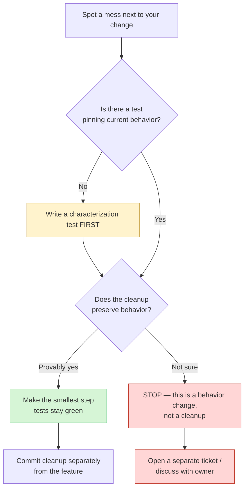

# Boy Scout Rule — Find the Bug

> The Boy Scout Rule says: *leave the campground cleaner than you found it.* But there's a sharp edge. A "cleanup" is only safe if it is **behavior-preserving**. Below are 11 diffs, each presented as an innocent tidy-up — a renamed variable, a simplified condition, a deleted "dead" branch, a loop turned into a stream. Every one of them shipped a bug, because the author changed behavior while *believing* they were only changing form, and no test stood in the way. Find what each cleanup broke.

---

## Table of Contents

1. [How to Use](#how-to-use)
2. [Snippet 1 — "Simplifying" a boolean condition (Java)](#snippet-1--simplifying-a-boolean-condition-java)
3. [Snippet 2 — Deleting "dead" code reached by reflection (Java)](#snippet-2--deleting-dead-code-reached-by-reflection-java)
4. [Snippet 3 — Loop → stream changes ordering (Java)](#snippet-3--loop--stream-changes-ordering-java)
5. [Snippet 4 — Extract Method drops a `defer` (Go)](#snippet-4--extract-method-drops-a-defer-go)
6. [Snippet 5 — Magic number → constant with the wrong value (Python)](#snippet-5--magic-number--constant-with-the-wrong-value-python)
7. [Snippet 6 — Inlining a variable evaluated once (Python)](#snippet-6--inlining-a-variable-evaluated-once-python)
8. [Snippet 7 — Tightening a type breaks a caller (Go)](#snippet-7--tightening-a-type-breaks-a-caller-go)
9. [Snippet 8 — Deleting a "redundant" null check (Java)](#snippet-8--deleting-a-redundant-null-check-java)
10. [Snippet 9 — Rename collides with a shadowed variable (Python)](#snippet-9--rename-collides-with-a-shadowed-variable-python)
11. [Snippet 10 — `for` → comprehension skips an edge case (Python)](#snippet-10--for--comprehension-skips-an-edge-case-python)
12. [Snippet 11 — De-duplicating two "identical" branches (Go)](#snippet-11--de-duplicating-two-identical-branches-go)
13. [Snippet 12 — "Obvious" early return drops a `finally` side effect (Java)](#snippet-12--obvious-early-return-drops-a-finally-side-effect-java)
14. [Scorecard](#scorecard)
15. [Related Topics](#related-topics)

---

## How to Use

Each snippet shows a **before** (the messy original) and a **cleaned** version that *looks* strictly better — shorter, clearer, more idiomatic. Your job is the reviewer's job: not "is this prettier?" but **"is this the same program?"**

For each one:

1. Read the cleaned diff and decide whether you'd approve the PR.
2. Write down what, if anything, changed about the *behavior* — not the style.
3. Open the answer and check: the behavior change, why the existing tests stayed green, and the safe way to land the same cleanup.

The thread running through all of them is in the diagram below: a clean-up is safe only when it sits inside the behavior-preserving box **and** has a test pinning the behavior down.



---

### Snippet 1 — "Simplifying" a boolean condition (Java)

**Difficulty:** ★★☆☆☆

The original condition looked redundant. The cleanup applied De Morgan and dropped what seemed like a duplicate guard.

```java
// BEFORE
public boolean isEligible(Account account) {
    if (account != null && account.isActive() && account.getBalance() > 0) {
        return true;
    }
    return false;
}

// CLEANED — "just return the expression, and the != null is implied by isActive()"
public boolean isEligible(Account account) {
    return account.isActive() && account.getBalance() > 0;
}
```

**What did the cleanup break?**

<details><summary>Answer</summary>

The original **short-circuited on `account != null`**. If `account` is `null`, the `&&` never evaluates `account.isActive()`, and the method returns `false`.

The cleaned version dereferences `account` immediately. A `null` account now throws `NullPointerException` instead of returning `false`. The author reasoned "`isActive()` already implies non-null" — but that's a statement about *intent*, not about what the type system guarantees. The parameter is still a nullable reference.

**Why no test caught it:** every existing test passed a constructed, non-null `Account`. Nobody had written `isEligible(null)` because the old code "obviously" handled it — so there was no pin protecting the null path. The behavior was *implicit*, which is exactly the kind of behavior that evaporates during a tidy-up.

**The safe way:** First add a characterization test — `assertFalse(isEligible(null))` — against the *original* code. It passes, documenting the contract. Now the simplification can't compile-and-ship silently; the test goes red the moment you remove the guard, forcing a deliberate decision (keep the guard, or use `Objects.requireNonNull` if null should actually be rejected loudly). The cleanup that *is* safe:

```java
public boolean isEligible(Account account) {
    return account != null && account.isActive() && account.getBalance() > 0;
}
```

Collapsing `if (x) return true; return false;` to `return x;` is fine — but only when `x` is the *whole* original expression, including the null guard.
</details>

---

### Snippet 2 — Deleting "dead" code reached by reflection (Java)

**Difficulty:** ★★★☆☆

The IDE flagged a method as unused. The cleanup deleted it and a "never instantiated" constructor.

```java
// BEFORE
public class ReportJob {
    public ReportJob() { }                 // IDE: "no usages"
    public void run() { /* generate report */ }
    private void onComplete() {             // IDE: "no usages"
        metrics.increment("report.completed");
    }
}

// CLEANED — removed the unused no-arg constructor and the unused private method
public class ReportJob {
    public void run() { /* generate report */ }
}
```

**What did the cleanup break?**

<details><summary>Answer</summary>

Two things, both invisible to static analysis:

1. The **no-arg constructor** is invoked reflectively by the job scheduler (`clazz.getDeclaredConstructor().newInstance()`). Removing it didn't break compilation — Java synthesizes a default constructor *only if no other constructor exists*. Here there were no other constructors, so a default is still synthesized and the app still starts... until someone later adds a parameterized constructor for an unrelated reason, at which point the synthesized default vanishes and the scheduler throws `NoSuchMethodException` at runtime. A latent landmine.

2. `onComplete()` is invoked via an annotation-driven hook (`@OnComplete`, scanned by the framework at startup). The IDE sees no *direct caller* and reports "no usages." Deleting it silently dropped the `report.completed` metric. Dashboards flatline; no exception, no failed test.

**Why no test caught it:** reflective and annotation-driven invocation is wired by the *framework at runtime*, not by code the compiler or test harness traces. Unit tests instantiate `ReportJob` directly and call `run()` — they never exercise the scheduler or the annotation scanner.

**The safe way:** "No usages" from an IDE means *no static usages*. Before deleting, grep the codebase and config for the symbol name, check for reflection (`newInstance`, `getMethod`, `getDeclaredConstructor`), and check for annotations on the member. If a member is invoked reflectively, document it: `@SuppressWarnings("unused") // invoked by @OnComplete scanner`. The genuinely safe cleanup here is to add that annotation/comment so the next person doesn't repeat the deletion — not to remove the code.
</details>

---

### Snippet 3 — Loop → stream changes ordering (Java)

**Difficulty:** ★★★☆☆

A verbose accumulation loop became a tidy stream pipeline.

```java
// BEFORE
public List<String> topTags(List<Post> posts) {
    Map<String, Integer> counts = new LinkedHashMap<>();
    for (Post p : posts) {
        for (String tag : p.getTags()) {
            counts.merge(tag, 1, Integer::sum);
        }
    }
    List<String> result = new ArrayList<>();
    for (Map.Entry<String, Integer> e : counts.entrySet()) {
        if (e.getValue() >= 3) result.add(e.getKey());
    }
    return result;
}

// CLEANED — one expressive stream
public List<String> topTags(List<Post> posts) {
    return posts.stream()
        .flatMap(p -> p.getTags().stream())
        .collect(Collectors.groupingBy(t -> t, Collectors.counting()))
        .entrySet().stream()
        .filter(e -> e.getValue() >= 3)
        .map(Map.Entry::getKey)
        .collect(Collectors.toList());
}
```

**What did the cleanup break?**

<details><summary>Answer</summary>

**Ordering.** The original used a `LinkedHashMap`, so `result` preserved **first-seen tag order**. `Collectors.groupingBy(...)` with no map supplier returns a `HashMap`, whose iteration order is unspecified (effectively hash-bucket order). The returned list now comes out in an arbitrary order.

The function's name and signature say nothing about order, but a downstream consumer relied on it — the UI rendered "top tags" and the product expected them in the order they first appeared in the feed. The cleanup quietly scrambled the displayed order.

**Why no test caught it:** the test asserted `assertEquals(List.of("java", "go", "rust"), topTags(posts))` — but on the *old* implementation the order was deterministic by luck of `LinkedHashMap`, and on small inputs `HashMap` sometimes produces the same order. The test was flaky-green: it passed on the developer's machine and CI by coincidence of hash codes, then produced a different order in production with different data.

**The safe way:** characterization first — assert the exact order on a representative input *and a larger one* where `HashMap` would reorder. With the order pinned, the stream rewrite fails the test, and you fix it by preserving the ordered collector:

```java
.collect(Collectors.groupingBy(t -> t, LinkedHashMap::new, Collectors.counting()))
```

A loop→stream rewrite changes more than syntax: it swaps the underlying collection type, which can change ordering, null-handling, and concurrency semantics. Those are behavior, not style.
</details>

---

### Snippet 4 — Extract Method drops a `defer` (Go)

**Difficulty:** ★★★☆☆

A long handler was tidied by extracting the locking-and-work part into a helper.

```go
// BEFORE
func (c *Cache) Refresh(key string) error {
    c.mu.Lock()
    defer c.mu.Unlock()
    val, err := c.loader(key)
    if err != nil {
        return err
    }
    c.entries[key] = val
    return nil
}

// CLEANED — extracted the body into a focused helper
func (c *Cache) Refresh(key string) error {
    c.mu.Lock()
    return c.refreshLocked(key)
}

func (c *Cache) refreshLocked(key string) error {
    defer c.mu.Unlock()
    val, err := c.loader(key)
    if err != nil {
        return err
    }
    c.entries[key] = val
    return nil
}
```

**What did the cleanup break?**

<details><summary>Answer</summary>

This one actually still unlocks correctly — the `defer c.mu.Unlock()` moved into `refreshLocked`, which runs and returns, so the unlock fires. But look harder at a subtler variant the author *almost* shipped, and at what this version costs: the lock acquisition and release now live in **different functions**. If anyone later adds an early `return` in `Refresh` between `Lock()` and the call to `refreshLocked` — say a quick validation guard — that path holds the lock forever because the `defer Unlock()` lives in the helper that was never reached.

The real defect: the cleanup **split the `Lock`/`Unlock` pair across a function boundary**, breaking the invariant that they sit together where `defer` can guarantee pairing. The lock is now acquired in one function and released in another, conditional on actually calling the second function. That's a deadlock waiting for the next innocent edit.

**Why no test caught it:** the happy path and the error path both call `refreshLocked`, so the lock is always released *today*. Tests pass. The bug is **latent** — it activates only when a future early-return is added to `Refresh`, and that future PR will look unrelated to locking.

**The safe way:** keep `Lock` and its `defer Unlock` in the same function. Extract only the *work*, leaving the locking discipline intact and local:

```go
func (c *Cache) Refresh(key string) error {
    c.mu.Lock()
    defer c.mu.Unlock()
    return c.refreshLocked(key) // helper assumes the lock is held; documented in its name + a comment
}

func (c *Cache) refreshLocked(key string) error {
    val, err := c.loader(key)
    if err != nil {
        return err
    }
    c.entries[key] = val
    return nil
}
```

Extract Method must not separate paired acquire/release operations. The `defer` belongs with the `Lock()`.
</details>

---

### Snippet 5 — Magic number → constant with the wrong value (Python)

**Difficulty:** ★★☆☆☆

A bare number was promoted to a named constant — exactly what the Boy Scout Rule encourages.

```python
# BEFORE
def session_is_expired(last_seen: datetime, now: datetime) -> bool:
    return (now - last_seen).total_seconds() > 1800   # magic number


# CLEANED — name the magic number
SESSION_TIMEOUT_MINUTES = 30

def session_is_expired(last_seen: datetime, now: datetime) -> bool:
    return (now - last_seen).total_seconds() > SESSION_TIMEOUT_MINUTES
```

**What did the cleanup break?**

<details><summary>Answer</summary>

`1800` was **1800 seconds** = 30 minutes. The author named it `SESSION_TIMEOUT_MINUTES = 30` — a correct *interpretation* — but then compared it against `total_seconds()` **without converting**. The comparison is now `seconds > 30`, i.e. the session expires after 30 **seconds**, not 30 minutes.

The naming was the trap: choosing the unit `MINUTES` and the value `30` was the human-readable insight, but the surrounding expression was in seconds. The cleanup substituted the right *concept* with the wrong *magnitude*.

**Why no test caught it:** the existing test was `assert session_is_expired(now - timedelta(hours=2), now) is True` and `assert session_is_expired(now - timedelta(seconds=10), now) is False`. After the change, the two-hours-ago case is still `True` (correct by accident) and the ten-seconds-ago case is still `False` (10 > 30 is false — also correct by accident). No test probed the boundary between 30 seconds and 30 minutes, which is the only region where the bug shows.

**The safe way:** extracting a constant is behavior-preserving *only if the substituted expression is numerically identical*. Either keep the value in the same unit as the comparison:

```python
SESSION_TIMEOUT = timedelta(minutes=30)

def session_is_expired(last_seen: datetime, now: datetime) -> bool:
    return now - last_seen > SESSION_TIMEOUT
```

or make the conversion explicit (`SESSION_TIMEOUT_SECONDS = 30 * 60`). And add a boundary test at 29 and 31 minutes *before* touching the literal — that test goes red instantly on the bad constant.
</details>

---

### Snippet 6 — Inlining a variable evaluated once (Python)

**Difficulty:** ★★★☆☆

A "pointless" temporary variable used twice was inlined for brevity.

```python
# BEFORE
def assign_ticket(queue):
    agent = pick_next_agent()          # mutates round-robin cursor, returns an agent
    log.info("assigning to %s", agent.name)
    queue.assign(agent.id)
    return agent

# CLEANED — the temporary is used only to read .name and .id; inline it
def assign_ticket(queue):
    log.info("assigning to %s", pick_next_agent().name)
    queue.assign(pick_next_agent().id)
    return pick_next_agent()
```

**What did the cleanup break?**

<details><summary>Answer</summary>

`pick_next_agent()` is **not pure** — it advances a round-robin cursor and returns the *next* agent each call. The original evaluated it **once** and reused the result. The cleaned version calls it **three times**, advancing the cursor three positions and assigning the ticket to a *different* agent than the one it logged, and returning yet a third.

So: it logs agent A, assigns to agent B, and returns agent C. Three agents are consumed per ticket, the log lies about who got it, and round-robin distribution is silently tripled.

**Why no test caught it:** the unit test mocked `pick_next_agent` to `return Mock(name="alice", id=1)` — a mock that returns the *same* object every call. Under the mock, "called once" and "called three times" are indistinguishable, so the test stayed green. The non-idempotent behavior only exists in the real implementation.

**The safe way:** inlining is behavior-preserving **only when the expression is referentially transparent** (same value, no side effects, every call). `pick_next_agent()` is neither. Keep the variable. If the goal was brevity, the variable *is* the clean form — it names the single evaluation and makes the single-call contract obvious. A test that asserts `pick_next_agent` was called exactly once (`mock.assert_called_once()`) would have pinned the contract and caught the regression.
</details>

---

### Snippet 7 — Tightening a type breaks a caller (Go)

**Difficulty:** ★★★☆☆

A function returned a broad `interface{}`; the cleanup tightened it to the concrete type actually returned.

```go
// BEFORE
func Lookup(key string) (interface{}, bool) {
    v, ok := store[key]
    return v, ok
}

// CLEANED — "it always returns a *User, so say so"
func Lookup(key string) (*User, bool) {
    v, ok := store[key]
    if !ok {
        return nil, false
    }
    return v.(*User), false  // <- assert to the concrete type
}
```

**What did the cleanup break?**

<details><summary>Answer</summary>

Two bugs rode in on the "obvious" tightening:

1. **`return v.(*User), false`** — the success branch returns `false` for `ok`. The author copied the `return nil, false` line from the not-found branch and forgot to flip it to `true`. Now *every* lookup reports "not found," even on a hit. A trivial typo, fully enabled by hand-editing return tuples during a "cleanup."

2. The store actually held **more than one type** — most entries were `*User`, but an admin path stashed `*ServiceAccount` under some keys. The old `interface{}` return let callers type-switch. The type assertion `v.(*User)` now **panics** at runtime when it hits a `*ServiceAccount` entry. The "it always returns a `*User`" assumption was false; it was just true for the data the author happened to look at.

**Why no test caught it:** the test seeded the store with `*User` values only, so the assertion never hit a `*ServiceAccount`, and it asserted on the returned `*User` without checking the `ok` boolean (`u, _ := Lookup("alice")`). The discarded `_` hid the inverted flag.

**The safe way:** narrowing a type is a **contract change**, not a cleanup — it can break callers and assumes the value set is what you think it is. If the value really is always `*User`, prove it (audit every write to `store`), keep `ok` correct, and change callers in the same reviewed step. Crucially: a test that checks the `ok` flag on a hit (`u, ok := Lookup("alice"); assert ok`) and a test seeded with the admin type would both go red. Pin the boolean and the type variety before touching the signature.
</details>

---

### Snippet 8 — Deleting a "redundant" null check (Java)

**Difficulty:** ★★☆☆☆

A null check looked redundant because the value was checked one line above.

```java
// BEFORE
public String formatAddress(Customer customer) {
    Address addr = customer.getAddress();
    if (addr == null) {
        return "(no address)";
    }
    String city = addr.getCity();
    if (city == null) {                 // "redundant — addr isn't null"
        return "(no city)";
    }
    return city.toUpperCase();
}

// CLEANED — removed the second null check; addr is already non-null
public String formatAddress(Customer customer) {
    Address addr = customer.getAddress();
    if (addr == null) {
        return "(no address)";
    }
    return addr.getCity().toUpperCase();
}
```

**What did the cleanup break?**

<details><summary>Answer</summary>

The second check guarded a **different reference**. `addr != null` says nothing about `addr.getCity()`. A non-null `Address` can perfectly well have a null `city` (incomplete data, a partially-filled form, a legacy record). The author conflated "the parent is non-null" with "the child is non-null."

The cleaned version throws `NullPointerException` on `addr.getCity().toUpperCase()` for any address with a missing city — a population that exists in production but not in the tidy test fixtures.

**Why no test caught it:** the only `Customer` fixtures with an address had a fully populated address (city included). The null-city case was real in the database but never represented in tests. The "redundant"-looking check was the *only* documentation that this case exists.

**The safe way:** a null check is redundant only if the **same expression** was already proven non-null on every path reaching it. `addr` and `addr.getCity()` are different expressions. Before deleting any defensive check, ask "what input made someone write this?" and write that input as a test. `assertEquals("(no city)", formatAddress(customerWithAddressButNoCity))` against the original code passes and documents the load-bearing branch — and turns red the instant it's deleted.
</details>

---

### Snippet 9 — Rename collides with a shadowed variable (Python)

**Difficulty:** ★★★★☆

A confusingly reused name was renamed for clarity — but the rename was applied too broadly.

```python
# BEFORE
def summarize(records):
    data = load_defaults()          # outer: a dict of default fields
    for record in records:
        data = {**data, **record}   # inner reuse of `data` = merged row (intentional? buggy?)
        emit(data)
    return data                     # returns the LAST merged row's data

# CLEANED — "the name `data` is overloaded; rename the loop variable to `merged`"
def summarize(records):
    data = load_defaults()
    for record in records:
        merged = {**data, **record}   # renamed the loop-local
        emit(merged)
    return merged
```

**What did the cleanup break?**

<details><summary>Answer</summary>

The original `data = {**data, **record}` **reassigned the outer `data`** on each iteration — so defaults accumulated: row 2 saw row 1's merged result as its base, row 3 saw row 2's, and so on. Whether that accumulation was intended or a pre-existing bug, the function's *observable behavior* depended on it.

The cleanup renamed the loop-local to `merged` and based it on `data` every time. Now `data` stays the pristine defaults across the whole loop, so each `merged` is `defaults + that row only` — no accumulation. The output of `emit` changed for every row after the first.

It also introduced a latent `NameError`: `return merged` references a loop-local that is **undefined when `records` is empty**. The original `return data` always had a value.

**Why no test caught it:** the test passed a single record. With one iteration there's no accumulation to observe — `data` and `merged` produce identical output, and `merged` is defined. The multi-record and empty-record behaviors, which is where the rename changed semantics, were untested.

**The safe way:** a rename is safe only when it preserves **scope and lifetime**. Here the "overloaded name" was actually carrying state across iterations; renaming the inner binding silently changed an accumulator into a per-iteration temporary. Before renaming, pin the behavior with a **multi-record** test and an **empty-input** test. If the accumulation was a bug, fix it as a *separate, announced* change with its own test — don't smuggle a semantic fix inside a rename.
</details>

---

### Snippet 10 — `for` → comprehension skips an edge case (Python)

**Difficulty:** ★★★☆☆

An imperative parse loop became a tidy comprehension.

```python
# BEFORE
def parse_amounts(lines):
    results = []
    for line in lines:
        line = line.strip()
        if not line:
            continue                 # skip blank lines
        if line.startswith("#"):
            continue                 # skip comments
        results.append(Decimal(line))
    return results

# CLEANED — one comprehension
def parse_amounts(lines):
    return [Decimal(line.strip()) for line in lines if not line.startswith("#")]
```

**What did the cleanup break?**

<details><summary>Answer</summary>

The comprehension lost two behaviors and reordered a third:

1. **Blank lines are no longer skipped.** The original `if not line: continue` is gone. A blank or whitespace-only line now reaches `Decimal("")`, which raises `decimal.InvalidOperation`. The whole parse crashes on a trailing newline.

2. **The comment filter uses the wrong string.** The original stripped *first*, then checked `startswith("#")`, so `"   # note"` (leading whitespace) was correctly treated as a comment. The comprehension checks `line.startswith("#")` on the **unstripped** line, so an indented comment slips through into `Decimal(...)` and raises.

3. The strip-then-filter ordering that made (2) work was collapsed; the filter now runs on raw `line` while the value uses `line.strip()`.

**Why no test caught it:** the fixture was a clean list `["1.50", "2.00", "# header", "3.25"]` — no blank lines, no indented comments. The comprehension produces the identical result on that input. The skipped edge cases (blank lines, indented comments) were precisely the messy real-world inputs the original loop was written to survive.

**The safe way:** a loop with `continue` guards encodes **multiple filter conditions and an order of operations**. A comprehension can express that, but only if you carry over *every* guard and preserve the strip-before-test order. Write the characterization test from realistic fixtures (blank lines, indented comments, trailing newline) *before* the rewrite. The faithful comprehension:

```python
def parse_amounts(lines):
    stripped = (line.strip() for line in lines)
    return [Decimal(s) for s in stripped if s and not s.startswith("#")]
```
</details>

---

### Snippet 11 — De-duplicating two "identical" branches (Go)

**Difficulty:** ★★★★☆

Two branches looked like copy-paste. The cleanup merged them under the Don't-Repeat-Yourself banner.

```go
// BEFORE
func price(plan string, seats int) int {
    switch plan {
    case "team":
        base := 10 * seats
        if seats > 50 {
            base = base * 90 / 100 // 10% volume discount
        }
        return base
    case "business":
        base := 18 * seats
        if seats > 50 {
            base = base * 85 / 100 // 15% volume discount
        }
        return base
    }
    return 0
}

// CLEANED — extract the shared volume-discount logic
func price(plan string, seats int) int {
    rate := map[string]int{"team": 10, "business": 18}[plan]
    if rate == 0 {
        return 0
    }
    base := rate * seats
    if seats > 50 {
        base = base * 90 / 100 // volume discount
    }
    return base
}
```

**What did the cleanup break?**

<details><summary>Answer</summary>

The branches were **not** identical. The `business` plan applied a **15%** volume discount (`* 85 / 100`); the `team` plan applied **10%** (`* 90 / 100`). The cleanup spotted the shared *shape* — `base = rate * seats`, then a `seats > 50` discount — and unified the discount to a single `* 90 / 100`. That silently downgraded the business plan's volume discount from 15% to 10%, overcharging every business customer with more than 50 seats.

The repetition was *structural*, not *semantic*: same control flow, different constants. DRY applies to duplicated knowledge, and here the two discount rates were genuinely different pieces of knowledge.

**Why no test caught it:** the tests checked `price("team", 10)` and `price("business", 10)` — both below the 50-seat threshold, so the discount branch never ran in either case. The discount rates were never exercised at all, let alone compared. The whole `seats > 50` region was untested.

**The safe way:** before merging "duplicate" branches, diff them character by character and confirm the *constants* match, not just the structure. Pin every distinct value with a test first — `price("business", 100)` and `price("team", 100)` — so the discount rates are observable. If the structure is worth sharing, parameterize the *difference* instead of collapsing it:

```go
var discountByPlan = map[string]struct{ rate, volumeMul int }{
    "team":     {10, 90},
    "business": {18, 85},
}

func price(plan string, seats int) int {
    p, ok := discountByPlan[plan]
    if !ok {
        return 0
    }
    base := p.rate * seats
    if seats > 50 {
        base = base * p.volumeMul / 100
    }
    return base
}
```

This removes the structural duplication while keeping each plan's distinct knowledge intact.
</details>

---

### Snippet 12 — "Obvious" early return drops a `finally` side effect (Java)

**Difficulty:** ★★★★☆

A method had a `try/finally` that "wrapped the whole body for no reason." The cleanup added an early return for the empty case.

```java
// BEFORE
public Result process(List<Job> jobs) {
    span.start();
    try {
        Result r = new Result();
        for (Job j : jobs) {
            r.merge(run(j));
        }
        return r;
    } finally {
        span.end();   // always closes the tracing span
    }
}

// CLEANED — bail out early when there's nothing to do
public Result process(List<Job> jobs) {
    span.start();
    if (jobs.isEmpty()) {
        return Result.empty();   // fast path
    }
    try {
        Result r = new Result();
        for (Job j : jobs) {
            r.merge(run(j));
        }
        return r;
    } finally {
        span.end();
    }
}
```

**What did the cleanup break?**

<details><summary>Answer</summary>

The early `return Result.empty()` was inserted **after `span.start()` but before the `try`**. On the empty-jobs path, `span.end()` — which lives only in the `finally` — **never runs**. Every empty call now starts a tracing span and leaks it: the span stays open forever, distorting latency metrics and, depending on the tracer, leaking memory or holding a thread-local that corrupts the *next* request's trace on a pooled thread.

The author saw `try/finally` "wrapping the whole body for no reason" and added a shortcut that escaped the `finally`'s reach. The `finally` had exactly one reason to exist: guarantee `span.end()` on *every* exit. The new exit slipped past it.

**Why no test caught it:** unit tests asserted on the returned `Result` for empty and non-empty inputs — both correct. No test inspected the tracer to assert "every `start()` is matched by an `end()`." Span balance is a cross-cutting effect that functional tests rarely assert, so the leak was invisible to the suite.

**The safe way:** any early return must respect existing `finally`/cleanup scopes. Either put the fast path **inside** the `try` (so `finally` still fires), or — better — don't open the span until you're committed to work. The smallest correct step keeps the guarantee:

```java
public Result process(List<Job> jobs) {
    span.start();
    try {
        if (jobs.isEmpty()) {
            return Result.empty();   // inside try → finally still runs
        }
        Result r = new Result();
        for (Job j : jobs) {
            r.merge(run(j));
        }
        return r;
    } finally {
        span.end();
    }
}
```

Before touching code with `finally`, write a characterization test that asserts the cleanup side effect fires on *every* exit path (`verify(span).end()` for the empty case). That test pins the invariant the `finally` exists to protect.
</details>

---

## Scorecard

Rate yourself by how you'd have caught each one *as a reviewer* — not by whether you eventually understood the answer.

| # | Snippet | The illusion | The real change | Class of mistake |
|---|---------|--------------|-----------------|------------------|
| 1 | Boolean simplify (Java) | "the null check is implied" | dropped short-circuit null guard → NPE | implicit behavior erased |
| 2 | Delete dead code (Java) | "IDE says no usages" | removed reflection / annotation hook | static analysis blind spot |
| 3 | Loop → stream (Java) | "more expressive" | `LinkedHashMap` → `HashMap`, order lost | collection-type semantics |
| 4 | Extract Method (Go) | "focused helper" | split `Lock`/`defer Unlock` across funcs | broke paired acquire/release |
| 5 | Magic → constant (Python) | "name the number" | seconds compared as minutes | unit / magnitude mismatch |
| 6 | Inline variable (Python) | "used only twice" | non-pure call now runs 3× | lost single-evaluation contract |
| 7 | Tighten type (Go) | "always a `*User`" | inverted `ok` + panic on other type | contract narrowing |
| 8 | Delete null check (Java) | "parent already non-null" | different reference → NPE | conflated parent/child nullity |
| 9 | Rename variable (Python) | "name is overloaded" | accumulator → per-iteration temp | scope/lifetime changed |
| 10 | Loop → comprehension (Python) | "one-liner" | dropped guards + reordered strip | filter conditions lost |
| 11 | De-dup branches (Go) | "copy-paste, apply DRY" | merged distinct discount rates | structural ≠ semantic duplication |
| 12 | Early return (Java) | "fast path" | escaped `finally` → leaked span | bypassed cleanup scope |

**Caught 10–12:** you read for behavior, not aesthetics. You instinctively ask "what input made the messy version messy?"

**Caught 6–9:** solid reviewer reflexes. Sharpen the habit of demanding a characterization test *before* approving any "pure cleanup."

**Caught 0–5:** the lesson landed where it counts. The fix is not "be smarter" — it's process: no cleanup ships without a behavior-pinning test, and cleanups land in their own commit, separate from features.

**The single rule behind all twelve:** a cleanup is only a cleanup if it is **behavior-preserving and test-protected**. The moment it changes an observable — an ordering, a null path, a side effect, a constant, a number of evaluations — it is a *behavior change wearing a cleanup's clothes*, and it deserves the same scrutiny, tests, and separate review as any other behavior change. That is the cautionary other half of the Boy Scout Rule: leave it cleaner, but **leave it doing the same thing** — and prove both.

---

## Related Topics

- [junior.md](junior.md) — the plain-language definition of the Boy Scout Rule and its limits
- [tasks.md](tasks.md) — practice exercises: turn unsafe cleanups into safe, test-protected steps
- [Boy Scout Rule — chapter README](../README.md) — the positive rules and the anti-patterns to avoid
- [Refactoring](../../refactoring/README.md) — the discipline of behavior-preserving change, with characterization tests
- [Anti-Patterns](../../anti-patterns/README.md) — the broader catalog of well-intentioned changes that go wrong
