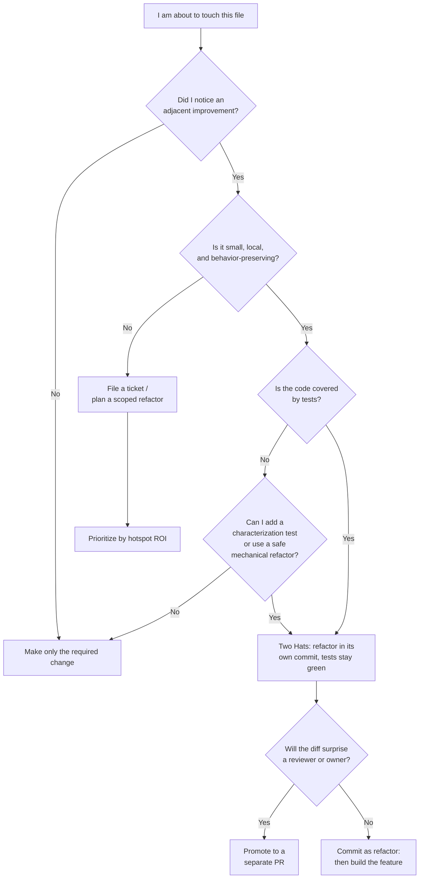

# Boy Scout Rule — Interview Questions

> 50+ questions across all skill levels (Junior → Staff). Most are behavioral — the Boy Scout Rule is as much a team-discipline and code-review topic as a coding one. Use as self-review or interview prep. For the underlying ideas, see [junior.md](junior.md) and [professional.md](professional.md); for the chapter overview, the [README](README.md).

---

## Table of Contents

- [Junior (12)](#junior-12)
- [Mid (14)](#mid-14)
- [Senior (14)](#senior-14)
- [Staff (12)](#staff-12)
- [Rapid-Fire](#rapid-fire)
- [Summary](#summary)
- [Further Reading](#further-reading)
- [Related Topics](#related-topics)

---

## Junior (12)

### J1. What is the Boy Scout Rule?

Answer

"Always leave the code cleaner than you found it." Coined by Robert C. Martin (Uncle Bob), adapting the scouting maxim "leave the campground cleaner than you found it." Each time you touch a file, make one small improvement — rename a confusing variable, delete dead code, fix a comment — so the codebase trends toward better over time instead of decaying.

### J2. Where does the campsite metaphor come from?

Answer

From the Boy Scouts of America, whose rule is to leave a campsite cleaner than you found it. Uncle Bob applied it to software in *Clean Code* (2008) and the essay collection *97 Things Every Programmer Should Know*. The point is *continuous, incremental* care, not a one-time cleanup project.

### J3. Give a concrete example of a Boy Scout cleanup.

Answer

You're fixing a bug in `calculateTotal()`. While there, you notice a local variable named `temp` that actually holds the discounted subtotal. You rename it to `discountedSubtotal`. That single rename — unrelated to the bug but adjacent to it — is a textbook Boy Scout improvement: cheap, safe, and it makes the next reader's life easier.

### J4. Why not just schedule a big "cleanup sprint" instead?

Answer

Big cleanup sprints rarely get prioritized (they don't ship features), and when they do, they touch huge surface area at once — risky to review and to merge. The Boy Scout Rule spreads the cost across normal work so it's amortized, low-risk, and never needs its own budget fight. Small, continuous improvement beats occasional heroic effort.

### J5. What's the difference between opportunistic cleanup and scope creep?

Answer

**Opportunistic cleanup** is small, local, and directly adjacent to the code you're already changing — a rename, a clarified comment, an extracted helper. **Scope creep** is reaching into unrelated files or rewriting large chunks "while you're in there." The line is roughly: would a reviewer be surprised this is in the diff? If yes, it's creep.

### J6. Is the Boy Scout Rule about big refactors?

Answer

No. It's the opposite — it's about *tiny* improvements that fit inside the work you're already doing. Big refactors deserve their own ticket, branch, and review. Boy Scouting is the discipline of constant small care, not occasional large surgery.

### J7. Why should cleanup ideally be a separate commit?

Answer

So a reviewer (and `git log`/`git bisect` later) can see "this commit only renames things, this commit changes behavior." Mixing them makes review harder: the reviewer must mentally separate the noise (formatting, renames) from the signal (logic change). Separate commits keep each diff focused and reversible.

### J8. What does "leave it cleaner" actually mean in practice?

Answer

Slightly more readable, slightly safer, slightly less duplicated than before — not perfect. Examples: a clearer name, a deleted unused import, a magic number turned into a named constant, a missing test added, a misleading comment fixed or removed. One small win per visit.

### J9. If you see a typo in a comment next to your change, should you fix it?

Answer

Yes — that's the canonical Boy Scout move. It's adjacent, trivial, and safe. The anti-pattern is "I didn't write it, so I won't touch it," which is how codebases rot: everyone steps over the same broken window.

### J10. Does cleanup count as part of "done"?

Answer

In teams that take it seriously, yes — leaving adjacent code at least as clean as you found it is part of the definition of done, not an optional extra you do "if there's time." Treating it as optional means it never happens.

### J11. What's the risk of cleaning code without tests?

Answer

You can silently change behavior. A "harmless" rename or extraction can alter evaluation order, capture the wrong variable, or remove a side effect you didn't notice. Without a test to catch it, the regression ships. The rule of safe cleanup: have a test (or characterization test) covering the code before you touch it.

### J12. What is a "broken window" in software?

Answer

A small, visible defect left unfixed — a commented-out block, a TODO from two years ago, an inconsistent naming style. Like a literal broken window in a building, it signals "nobody cares here," which invites more neglect. Boy Scouting is the practice of repairing broken windows as you pass them.

---

## Mid (14)

### M1. How do you keep cleanup commits separate from feature commits in practice?

Answer

Do the cleanup as its own commit *first* (or in a separate PR), then build the feature on top. Tools: `git add -p` to stage only the cleanup hunks, `git commit` with a clear `refactor:` prefix, then the feature commit. If cleanup grew large, push it as a standalone PR that merges before the feature PR. Reviewers see a pure no-behavior-change diff, then a focused feature diff.

### M2. What is the "Two Hats" rule?

Answer

Kent Beck's rule: when you work, you wear exactly one of two hats — **adding behavior** or **refactoring** — never both at once. Adding behavior changes what the code does (new tests should appear). Refactoring changes structure while preserving behavior (existing tests stay green). Switching hats consciously keeps each step verifiable: if a refactor breaks a test, you know it's the refactor, not the new feature.

> **What the interviewer is really checking (M2):** whether you understand that "refactor" has a *precise* meaning — behavior-preserving — and that conflating it with feature work is what makes changes hard to review and bisect.

### M3. Should every PR include some cleanup? (trick)

Answer

No — and answering "yes" is a trap. The Boy Scout Rule says leave code *cleaner than you found it*, not "manufacture cleanup on every change." A hotfix to production at 2 a.m. should be minimal and surgical. A one-line config change shouldn't trigger a rename spree. The rule is opportunistic ("while you're already here"), not mandatory. Forced cleanup quotas produce noise and review fatigue.

> **What the interviewer is really checking (M3):** that you treat principles as heuristics with context, not absolute rules to apply mechanically.

### M4. When should you NOT clean up code you're touching?

Answer

- It's an urgent hotfix — minimize the diff, clean up later in a follow-up.
- There are no tests and the code is risky to change — write tests first, or skip.
- The cleanup would balloon the PR and delay a time-sensitive feature.
- You don't understand the code well enough to be sure the change preserves behavior.
- A larger refactor is already planned for that area — don't conflict with it.
- The "cleanup" is really a style opinion the team hasn't agreed on.

### M5. What is technical debt, in Ward Cunningham's original sense?

Answer

Cunningham's 1992 metaphor: shipping code with imperfect understanding is like taking on debt. It's *fine* to borrow against the future to ship and learn quickly — but you must pay it back by refactoring as your understanding improves. If you don't, "interest" accrues: every future change in that area costs more. Crucially, his metaphor was about *learning*, not about deliberately writing bad code.

### M6. Is all duplication technical debt? (trick)

Answer

No. Duplication is a *smell*, not automatically debt. Two pieces of code that look alike but change for different reasons should stay separate — deduplicating them couples unrelated concerns (the wrong abstraction is more expensive than duplication, per Sandi Metz). Boy Scouting means removing *accidental* duplication you understand, not chasing every textual repeat. "Prefer duplication over the wrong abstraction."

> **What the interviewer is really checking (M6):** whether you know DRY is about knowledge duplication, not text matching, and that premature deduplication is its own debt.

### M7. How does the Boy Scout Rule relate to the campsite over a long project?

Answer

It produces a slow upward drift in quality instead of the usual entropy-driven decay. If every developer leaves each visited file slightly better, the codebase improves passively as a side effect of normal work — no special initiative required. The most-touched files (hotspots) get cleaned the most, which is exactly where cleanup pays off.

### M8. What is broken-windows theory, and where did it come from?

Answer

Originally a 1982 criminology theory (Wilson & Kelling): visible signs of disorder (broken windows, graffiti) encourage more disorder. *The Pragmatic Programmer* (Hunt & Thomas, 1999) applied it to code: don't leave "broken windows" (bad designs, wrong decisions, poor code) unrepaired, because they erode the team's standards and signal that low quality is acceptable.

### M9. What's the critique of broken-windows theory?

Answer

The criminology version is empirically contested — studies dispute the causal link, and "broken-windows policing" has been criticized for harmful over-enforcement. The lesson for software: the analogy is a useful *motivator* for not normalizing neglect, but don't over-extend it into zealotry. Fixing every cosmetic imperfection can be its own form of over-policing — churning diffs, blocking PRs on trivia, and burning review goodwill.

> **What the interviewer is really checking (M9):** intellectual honesty — can you cite a principle *and* its limits rather than parroting it?

### M10. How do you make cleanup safe before doing it?

Answer

1. Ensure tests cover the code. If not, add **characterization tests** that pin current behavior.
2. Make the refactor in small, individually-green steps (use IDE-assisted refactorings like Rename/Extract, which are mechanically safe).
3. Keep behavior identical — run the full test suite after each step.
4. Commit the refactor separately so it's bisectable and revertible.

### M11. What's a characterization test and why does it matter for cleanup?

Answer

A test that captures the code's *current* behavior (not its intended behavior) by recording representative inputs and observed outputs. For legacy code without specs, it's the safety net that lets you refactor: if a cleanup changes output, the characterization test fails and tells you. Michael Feathers calls this the entry point for working with legacy code.

### M12. Your teammate snuck a 40-file reformat into a feature PR. What do you say in review?

Answer

Ask them to split it: the reformat into one commit/PR (ideally automated and added to `.git-blame-ignore-revs`), the feature into another. Reasoning, stated kindly: the mixed diff hides the actual logic change among 2,000 lines of noise, makes review unreliable, pollutes blame history, and is painful to revert. This is "review sandbagging" — overwhelming reviewers so the real change escapes scrutiny.

### M13. How do you record "cleanup later" so it actually gets paid?

Answer

A bare `// TODO` rots. Make the debt *visible and tracked*: a ticket in the backlog, a `// TODO(JIRA-1234): ...` linking to it, or a tech-debt register. Then allocate a standing slice of capacity (e.g., 10–20% per sprint) to it. Untracked "later" is "never" — it's the most common way debt becomes permanent.

### M14. What's the difference between deliberate and inadvertent technical debt?

Answer

It's two of the four axes of Fowler's quadrant. *Deliberate* debt is a conscious choice ("we'll skip the abstraction to ship for the demo"). *Inadvertent* debt is taken on unknowingly ("we didn't know layering would matter here"). Crossed with prudent/reckless, this gives four kinds — see S2.

---

## Senior (14)

### S1. Walk me through Fowler's Technical Debt Quadrant.

Answer

Martin Fowler's 2×2 crosses **deliberate vs. inadvertent** with **reckless vs. prudent**:

| | Reckless | Prudent |
|---|---|---|
| **Deliberate** | "We don't have time for design." | "We must ship now and deal with the consequences." |
| **Inadvertent** | "What's layering?" | "Now we know how we should have done it." |

The interesting cell is *prudent-deliberate*: knowingly taking on debt with eyes open and a payback plan — legitimate engineering. *Prudent-inadvertent* (you only understand the right design after building it) is exactly Cunningham's original metaphor. The reckless row is what people usually mean by "tech debt" but is only half the picture.

> **What the interviewer is really checking (S1):** that you can reason about debt as a *deliberate, sometimes-correct trade-off*, not just "bad code."

### S2. When is taking on technical debt the right call?

Answer

When the cost of delay exceeds the future interest: validating a market hypothesis, hitting a hard external deadline, or building a throwaway prototype. The discipline is to make it *prudent and deliberate* — document the shortcut, write the ticket, and pay it down once the bet pays off. Debt is a financing tool; reckless debt is the problem, not debt itself.

### S3. Is a big rewrite ever the right move? (trick)

Answer

Rarely, but yes, under specific conditions. Joel Spolsky's "Things You Should Never Do" warns rewrites discard hard-won knowledge embedded in messy code (edge cases, regulatory rules, bug fixes) and re-introduce solved bugs. Incremental approaches — **Strangler Fig** (route new traffic to new code, migrate gradually) and **Branch by Abstraction** — almost always beat a rewrite. A rewrite *can* be justified when: the platform is truly dead (unmaintained language/runtime), the team is replaced wholesale, or the product scope changed so fundamentally the old model can't stretch. Even then, prefer incremental migration if at all possible.

> **What the interviewer is really checking (S3):** that you default to incremental, can name the patterns, *and* can articulate the narrow cases where rewrite wins — not dogma in either direction.

### S4. What is hotspot-driven cleanup?

Answer

Prioritize cleanup where it pays off: files that are both **complex** and **frequently changed** (Adam Tornhill's "behavioral code analysis"). Metric: roughly `change_frequency × complexity`. A 5,000-line file untouched in three years isn't worth refactoring; a 300-line file edited every week is a prime target. Tools like CodeScene mine `git log` to surface hotspots. This directs Boy Scout effort by ROI instead of by whoever-feels-like-it.

### S5. What is `.git-blame-ignore-revs` and why does it matter for cleanup?

Answer

A file listing commit SHAs that `git blame` should skip when assigning line authorship — typically bulk-formatting or mass-rename commits. Without it, a project-wide `gofmt`/Prettier/Black run makes *every* line blame to that commit, destroying the history of who-changed-what-and-why. You add the noisy commit's SHA to `.git-blame-ignore-revs` and set `git config blame.ignoreRevsFile .git-blame-ignore-revs` (GitHub honors it automatically). This is what makes large mechanical cleanups socially acceptable.

### S6. How do you do a large formatting/style migration without poisoning blame?

Answer

1. Land the format change as a *single, pure* commit that does nothing but reformat (no logic changes).
2. Add that commit's SHA to `.git-blame-ignore-revs`.
3. Commit the config (`blame.ignoreRevsFile`) so the whole team and GitHub honor it.
4. Enforce the format in CI going forward so it never drifts again.

This separates the one-time noise from real history and prevents recurrence.

### S7. How do you balance Boy Scouting against review burden?

Answer

Keep cleanup *small and adjacent* so it doesn't dominate the diff, and *separate* it (commit or PR) so reviewers can skim the no-op refactor quickly and focus on the real change. If cleanup grows beyond a handful of lines, it's no longer a Boy Scout move — promote it to its own PR. The goal is to reduce, not increase, total cognitive load on the reviewer.

### S8. A junior keeps reformatting whole files on every PR "to be a good scout." How do you coach them?

Answer

Clarify that the rule is *opportunistic and small*, not "maximize cleanup." Explain the costs: review noise, merge conflicts for teammates, poisoned blame, harder reverts. Redirect the instinct productively: automate formatting (pre-commit hook + CI) so nobody has to do it by hand, and focus their cleanup energy on *meaningful, local* improvements (names, dead code, missing tests) in code they're already changing.

### S9. How does the Boy Scout Rule interact with code ownership and CODEOWNERS?

Answer

In strong-ownership cultures, touching another team's file for a drive-by cleanup can trigger required reviews, conflict with their roadmap, or step on planned refactors. Boy Scout cleanups across ownership boundaries should be tiny and ideally flagged to owners; large cleanups need their buy-in. The rule presumes shared collective ownership — adapt it where ownership is strict.

### S10. How do you measure whether Boy Scouting is working?

Answer

Trend metrics on hotspots over time: complexity (cyclomatic/cognitive), duplication, test coverage on changed lines, change-failure rate, and lead time for changes in those files. You want hotspot complexity flat or declining while feature velocity holds. Beware optimizing the metric itself — these are health signals, not targets to game.

### S11. Compare Strangler Fig and Branch by Abstraction as alternatives to rewrite.

Answer

- **Strangler Fig:** put a façade in front of the old system; route new/migrated functionality to new code; shrink the old system until it's gone. Operates at the use-site/feature level; timescale months–years; good for whole-system replacement.
- **Branch by Abstraction:** introduce an abstraction over the thing being changed, build the new implementation behind it, switch via flag, then remove the old one. Operates inside one codebase; timescale days–weeks; good for swapping a component with continuous rollback safety.

Both let the system stay shippable throughout — the antithesis of a big-bang rewrite.

### S12. How do you decide between an opportunistic cleanup and filing a ticket?

Answer

Heuristic by size and risk: if it's a few lines, local, test-covered, and behavior-preserving → do it now in a separate commit. If it spans many files, needs design discussion, lacks test coverage, or risks behavior → file a ticket and (if it's a hotspot) prioritize it. The dividing question: "Can a reviewer verify this is a no-op in under a minute?"

### S13. What's the danger of "refactor while you debug"?

Answer

You break the Two Hats rule. If you reshape code while hunting a bug, you can't tell whether your changes fixed it, masked it, or introduced a new one — and the diff conflates investigation with structural change. Discipline: find and fix the bug with the smallest change (add a regression test), *then* put on the refactor hat in a separate commit.

### S14. How do you Boy-Scout in a codebase with zero tests?

Answer

Carefully and narrowly. Limit yourself to *provably safe* mechanical refactorings (IDE Rename, Extract Method/Variable) which tools guarantee behavior-preserving, and to pure deletions of demonstrably dead code. For anything riskier, write a characterization test around the seam first. If you can't establish a safety net, restrain the scout instinct — an untested "improvement" that regresses is worse than the original smell.

---

## Staff (12)

### St1. How do you make the Boy Scout Rule a sustainable team norm rather than individual heroics?

Answer

Encode it into the system, not into willpower: (1) automated formatting + linting in pre-commit and CI so style cleanup is free and uncontested; (2) a definition of done that includes "adjacent code left no worse"; (3) hotspot dashboards to direct effort by ROI; (4) a standing capacity allocation for debt paydown; (5) review norms that reward small, separated cleanups and push back on mixed mega-diffs; (6) `.git-blame-ignore-revs` so mechanical cleanups are painless. Culture follows the path of least resistance — make clean the easy path.

> **What the interviewer is really checking (St1):** systems thinking — can you turn a personal virtue into an organizational default through tooling, process, and incentives?

### St2. How do you build a technical-debt management strategy at org scale?

Answer

Make debt *visible, prioritized, and funded*: maintain a debt register tied to business impact; classify items with Fowler's quadrant (kill reckless debt, schedule prudent debt); use hotspot analysis to rank by ROI; reserve a fixed capacity slice each cycle; track health metrics (change-failure rate, lead time, hotspot complexity) so paydown is justified with data, not vibes. Frame it to leadership as *interest reduction* — debt slows every future feature — not as "engineers want to gold-plate."

### St3. How do you sell continuous cleanup to non-technical stakeholders?

Answer

Use the debt/interest framing: messy code is a tax on every future feature — each one ships slower and buggier. Show data: lead time and defect rate in hotspots vs. clean areas. Pitch continuous Boy Scouting as the *cheap* option (amortized, low-risk) versus the expensive alternatives (a velocity-killing rewrite later, or accelerating decay). Tie it to outcomes they care about: predictability and speed.

### St4. When does a hotspot justify a deliberate refactoring project over Boy Scouting?

Answer

When the file is so central and tangled that incidental, in-passing cleanups can't keep up with the change rate — the entropy inflow exceeds the scouting outflow. At that point, fund a *scoped*, test-backed refactor (Mikado Method to map dependencies, small green steps), ideally behind Branch by Abstraction. Boy Scouting maintains; targeted projects fix structural problems too big for one PR.

### St5. How do you prevent cleanup from causing destabilizing churn in a fast-moving codebase?

Answer

Sequence and scope it: land mechanical cleanups in low-traffic windows; keep each cleanup small to minimize merge conflicts; rebase frequently; coordinate large refactors with teams owning the area; use feature flags / Branch by Abstraction so structural change is decoupled from release. The cost of cleanup includes the conflicts and rebases it imposes on *others* — a staff engineer accounts for that.

### St6. Critique "always leave the code cleaner than you found it" as an absolute rule.

Answer

Taken absolutely it's wrong. It can justify scope creep, review-burdening diffs, blame poisoning, merge-conflict churn, and risky untested changes under hotfix pressure. It presumes collective ownership and a test safety net that don't always exist. The defensible version is *bounded*: leave it cleaner **when the change is small, local, test-covered, separated, and won't surprise a reviewer or owner**. A staff engineer holds the principle *and* its guardrails.

> **What the interviewer is really checking (St6):** seniority shows in qualifying maxims, not reciting them.

### St7. How do the Boy Scout Rule, Two Hats, and Simple Design fit together?

Answer

They're a layered discipline. **Simple Design** (Kent Beck's rules — passes tests, reveals intent, no duplication, fewest elements) defines *what* "cleaner" means. **Two Hats** governs *how* you change code: refactor and add-behavior are separate acts. The **Boy Scout Rule** sets the *cadence*: apply continuous, small, refactor-hat improvements toward Simple Design whenever you pass through. Together: a definition of clean, a safe method of change, and a habit that keeps applying it.

### St8. Your org has 8,000 lint violations after adopting a new linter. How do you Boy-Scout out of it?

Answer

Don't fix all 8,000 in one PR (a rewrite by another name). Use a *baseline*: capture current violations as accepted; fail CI only on *new* violations and on touched lines (ratchet mode, e.g. SonarQube's "new code" / `betterer`). Now every change must leave the file no worse — the Boy Scout Rule enforced mechanically — and the violation count monotonically decreases as files are touched, weighted naturally toward hotspots. Optionally bulk-fix the safe auto-fixable subset in one ignore-revs'd commit.

### St9. How do you avoid "boiling the frog" — slow decay despite everyone meaning well?

Answer

Good intentions lose to entropy without feedback loops. Instrument the decay: track hotspot complexity, duplication, and coverage over time; alert on negative trends; review them in retros. Make "no worse" enforceable in CI (ratcheting linters, coverage-on-diff). Allocate guaranteed debt-paydown capacity so it's not the perpetual loser against feature pressure. The fix is converting an individual habit into a measured, enforced system property.

### St10. How do you handle disagreement over what "cleaner" means?

Answer

Most cleanup fights are about *taste* (style, formatting, idiom) — remove them from human debate by codifying them in an automated formatter/linter and a written style guide; the tool is the arbiter. Reserve human discussion for *substantive* design questions (boundaries, naming of domain concepts, abstractions), and resolve those with ADRs or team agreement. "Cleaner" should mean "closer to the agreed standard," not "closer to my preference."

### St11. What's your stance on cleanup in a regulated / high-stakes codebase (finance, medical, avionics)?

Answer

The bar for "behavior-preserving" rises sharply — every change may require re-validation, audit, or certification, so even safe-looking refactors carry process cost. Boy Scouting narrows to provably mechanical, fully test-covered changes, often with formal review and traceability. The campsite still applies, but the definition of "safe" is far stricter, and "leave it alone unless you must" is frequently the right call. Risk-of-change is part of the cost calculation.

### St12. Synthesize: when is the right answer "leave it dirty"?

Answer

When the expected cost of cleaning exceeds the expected benefit. Concretely: under hotfix/incident pressure (minimize blast radius); in code with no tests you can't safely characterize; in another team's domain mid-refactor; in cold code nobody touches (no ROI); when the change would balloon a time-sensitive PR; or in a regulated path where change triggers expensive re-validation. The mature reading of the Boy Scout Rule includes knowing when *not* to pick up the litter — clean opportunistically, not compulsively.

---

## Rapid-Fire

| Question | One-line answer |
|---|---|
| Who coined the Boy Scout Rule for code? | Robert C. Martin (Uncle Bob). |
| Original campsite version? | "Leave the campground cleaner than you found it." |
| Two Hats rule author? | Kent Beck. |
| The two hats? | Adding behavior, and refactoring — never both at once. |
| Technical-debt metaphor author? | Ward Cunningham (1992). |
| Was Cunningham's metaphor about writing bad code? | No — about shipping with incomplete understanding, then refactoring. |
| Fowler's quadrant axes? | Deliberate↔inadvertent × reckless↔prudent. |
| Most legitimate quadrant cell? | Prudent-deliberate (debt taken with a payback plan). |
| Broken-windows theory origin? | Wilson & Kelling, 1982 criminology; adapted in *The Pragmatic Programmer*. |
| Is broken-windows theory uncontested? | No — disputed in criminology; use as motivator, not dogma. |
| Default: rewrite or incremental? | Incremental (Strangler Fig / Branch by Abstraction). |
| Essay warning against rewrites? | Joel Spolsky, "Things You Should Never Do, Part I." |
| File that protects blame from bulk reformats? | `.git-blame-ignore-revs`. |
| Hotspot metric? | change_frequency × complexity. |
| Tool category for hotspots? | Behavioral code analysis (e.g., CodeScene). |
| Should every PR include cleanup? | No — opportunistic, not mandatory. |
| Is all duplication debt? | No — prefer duplication over the wrong abstraction. |
| Safe cleanup precondition? | Tests (or characterization tests) covering the code. |
| Cleanup commit prefix convention? | `refactor:` (Conventional Commits). |
| Cleanup and feature in one commit? | No — separate them. |
| Linter ratchet for legacy debt? | Baseline + fail on new/touched-line violations. |
| When to leave it dirty? | Hotfix, no tests, cold code, others' in-progress refactor, regulated path. |

---

## Summary

The Boy Scout Rule — "leave the code cleaner than you found it" — is a discipline of **continuous, small, opportunistic** improvement that lets a codebase trend upward as a side effect of normal work. Its power comes from being bounded by good engineering judgment:

- **Keep it small and adjacent.** Opportunistic cleanup, not scope creep or rewrites.
- **Wear one hat.** Refactor xor add behavior (Beck). Keep them in separate commits/PRs so reviewers and `git bisect` can trust each diff.
- **Make it safe.** Tests or characterization tests before touching; favor mechanically-safe refactorings.
- **Know when not to.** Hotfixes, untested risky code, cold files, others' in-progress work, and regulated paths often warrant "leave it alone."
- **Manage debt deliberately.** Use Cunningham's metaphor and Fowler's quadrant; prudent-deliberate debt is legitimate; track and fund paydown so "later" doesn't mean "never."
- **Prefer incremental over rewrite.** Strangler Fig and Branch by Abstraction beat big-bang rewrites in nearly all cases.
- **Protect history and reviewers.** `.git-blame-ignore-revs` for mechanical cleanups; linter baselines/ratchets for legacy debt; automate style so cleanup is uncontested.
- **Hold principles with their limits.** Broken-windows and "always leave it cleaner" are motivators, not absolutes.

---

## Further Reading

- Robert C. Martin, *Clean Code* (2008) — the Boy Scout Rule chapter.
- Kent Beck, *Refactoring*-era writings — the Two Hats rule.
- Ward Cunningham, "The WyCash Portfolio Management System" (1992) — the debt metaphor; and his later video clarification.
- Martin Fowler, "TechnicalDebtQuadrant" and "TechnicalDebt" — martinfowler.com.
- Andrew Hunt & David Thomas, *The Pragmatic Programmer* — "Software Entropy" / broken windows.
- Joel Spolsky, "Things You Should Never Do, Part I" — against rewrites.
- Michael Feathers, *Working Effectively with Legacy Code* — characterization tests, seams.
- Adam Tornhill, *Software Design X-Rays* / *Your Code as a Crime Scene* — hotspots and behavioral code analysis.
- Sandi Metz, "The Wrong Abstraction" — duplication vs. abstraction.

---

## Related Topics

- [Boy Scout Rule — Junior](junior.md) · [Professional](professional.md)
- [Chapter README](README.md)
- [Clean Code: Emergence (Simple Design)](../10-emergence/README.md)
- [Refactoring](../../refactoring/README.md)
- [Design Patterns](../../design-patterns/README.md)
