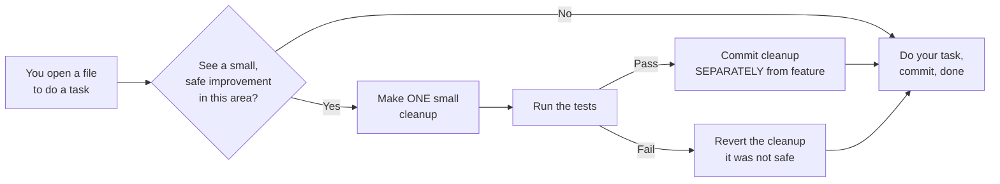
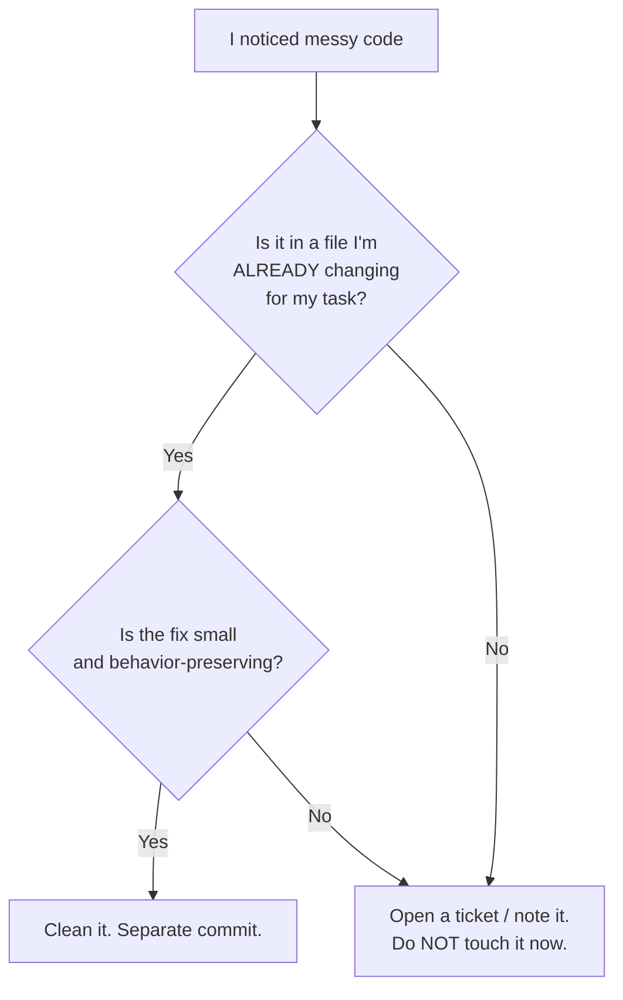

# Boy Scout Rule — Junior Level

> **Level:** Junior — "What is the rule? Show me a clean example."
> You will learn the campsite rule, how to make small safe cleanups as you pass through code, and the traps that turn a good habit into a liability.

---

## Table of Contents

1. [What is the Boy Scout Rule?](#what-is-the-boy-scout-rule)
2. [Real-world analogy](#real-world-analogy)
3. [The rule in one sentence](#the-rule-in-one-sentence)
4. [Rule 1 — Keep each cleanup small](#rule-1--keep-each-cleanup-small)
5. [Rule 2 — Cleanup must be behavior-preserving](#rule-2--cleanup-must-be-behavior-preserving)
6. [Rule 3 — Separate cleanup commits from feature commits](#rule-3--separate-cleanup-commits-from-feature-commits)
7. [Rule 4 — Run the tests; if there are none, add one](#rule-4--run-the-tests-if-there-are-none-add-one)
8. [Rule 5 — Stay in scope](#rule-5--stay-in-scope)
9. [The four most common cleanups](#the-four-most-common-cleanups)
10. [Common Mistakes](#common-mistakes)
11. [Test Yourself](#test-yourself)
12. [Cheat Sheet](#cheat-sheet)
13. [Summary](#summary)
14. [Further Reading](#further-reading)
15. [Related Topics](#related-topics)

---

## What is the Boy Scout Rule?

The **Boy Scout Rule** is a single habit:

> **Always leave the code a little cleaner than you found it.**

It comes from a scouting principle — *"leave the campsite cleaner than you found it"* — popularized for programming by Robert C. Martin (Uncle Bob). The idea is small and almost boring, which is exactly why it works: you do not need permission, a ticket, or a planning meeting to rename one confusing variable while you are already editing that function.

The rule is about **entropy**. Every codebase decays over time. Each rushed deadline leaves a slightly worse name, a dead branch, a duplicated import. If nobody ever cleans up, the rot compounds until the code becomes a tar pit nobody wants to touch. The Boy Scout Rule fights entropy **continuously, in tiny increments**, so it never accumulates into a crisis.

Crucially, it is **not** a license to rewrite. It is the opposite of a big-bang rewrite. You make *one small, safe improvement* in the area you are already working in — then you move on.

> **Key idea:** The Boy Scout Rule is opportunistic, not heroic. You clean what you touch, not the whole repo.

---

## Real-world analogy

### The shared kitchen sink

You walk into the office kitchen to refill your water. There is one dirty mug in the sink — not yours. You have two choices:

- **"Not my mug."** Walk away. By Friday there are fourteen mugs, the sink is unusable, and someone has to call a "kitchen cleanup meeting."
- **Rinse the one mug** while your bottle fills. It costs you ten seconds. The sink stays usable. Nobody ever needs a meeting.

The second choice is the Boy Scout Rule. The point is not that you become the kitchen janitor — you do not scrub the floor, descale the kettle, and reorganize the cupboards (that would be scope creep, and you would never get your water). You handle **the one thing in front of you**, and you do it **while you are already there**.

### The same thing in code

You are fixing a bug in `chargeCustomer()`. Right above your fix is a variable named `flag2` and an `import` that is no longer used. You:

- rename `flag2` to `isRefundable` (you understood it anyway while debugging),
- delete the dead import,
- and leave everything else alone.

Ten seconds. The next person who reads `chargeCustomer()` has it slightly easier. That is the whole rule.

---

## The rule in one sentence



The rest of this document is just the five guard-rails that keep this loop honest.

---

## Rule 1 — Keep each cleanup small

A Boy Scout cleanup is something you can describe in **one short sentence** and review in **under a minute**. Rename a variable. Extract a tiny helper. Delete dead code. Tidy imports. If a "cleanup" needs a design discussion, it is no longer a Boy Scout cleanup — it is a refactoring task that deserves its own ticket.

### Rename a confusing name (Go)

```go
// Before — you had to read the whole loop to learn what `d` is.
func expiringSoon(subs []Subscription) []Subscription {
    var r []Subscription
    for _, s := range subs {
        d := time.Until(s.RenewsAt)
        if d < 7*24*time.Hour {
            r = append(r, s)
        }
    }
    return r
}

// After — names say what they mean. Same behavior, zero risk.
func expiringSoon(subs []Subscription) []Subscription {
    var soon []Subscription
    for _, sub := range subs {
        timeLeft := time.Until(sub.RenewsAt)
        if timeLeft < 7*24*time.Hour {
            soon = append(soon, sub)
        }
    }
    return soon
}
```

### Rename a confusing name (Java)

```java
// Before
public BigDecimal calc(List<Item> l) {
    BigDecimal t = BigDecimal.ZERO;
    for (Item i : l) {
        t = t.add(i.price().multiply(BigDecimal.valueOf(i.qty())));
    }
    return t;
}

// After
public BigDecimal subtotal(List<Item> items) {
    BigDecimal total = BigDecimal.ZERO;
    for (Item item : items) {
        total = total.add(item.price().multiply(BigDecimal.valueOf(item.qty())));
    }
    return total;
}
```

### Rename a confusing name (Python)

```python
# Before
def f(u, l):
    return [x for x in l if x.owner_id == u.id]

# After
def items_owned_by(user, items):
    return [item for item in items if item.owner_id == user.id]
```

> **Why this is safe:** a rename is mechanical. Your IDE's "Rename Symbol" updates every reference at once. Behavior cannot change because only the *name* changed, not the logic.

---

## Rule 2 — Cleanup must be behavior-preserving

This is the line that separates a *cleanup* from a *change*. A cleanup makes the code easier to read or maintain **without altering what it does** — same inputs, same outputs, same side effects. If your "tidy-up" fixes a bug, changes a return value, or alters an edge case, it is no longer a cleanup. It is a behavior change, and it must be reviewed and tested as one.

### Extract a helper — behavior preserved (Java)

```java
// Before — the eligibility check is inlined and unnamed.
public void notifyUser(User user) {
    if (user.isActive()
            && user.email() != null
            && !user.email().isBlank()
            && user.notificationsEnabled()) {
        mailer.send(user.email(), welcomeTemplate());
    }
}

// After — the same condition, now named. Nothing about WHEN we send changed.
public void notifyUser(User user) {
    if (canEmail(user)) {
        mailer.send(user.email(), welcomeTemplate());
    }
}

private boolean canEmail(User user) {
    return user.isActive()
            && user.email() != null
            && !user.email().isBlank()
            && user.notificationsEnabled();
}
```

The extracted `canEmail` has **exactly** the same truth table as the original inline condition. That is the test: if you can prove the outputs are identical for all inputs, it is behavior-preserving.

### Extract a helper (Python)

```python
# Before
def notify_user(user, mailer):
    if user.is_active and user.email and user.notifications_enabled:
        mailer.send(user.email, welcome_template())

# After
def notify_user(user, mailer):
    if _can_email(user):
        mailer.send(user.email, welcome_template())

def _can_email(user):
    return user.is_active and user.email and user.notifications_enabled
```

### Extract a helper (Go)

```go
// Before
func NotifyUser(u User, m Mailer) {
    if u.Active && u.Email != "" && u.NotificationsEnabled {
        m.Send(u.Email, welcomeTemplate())
    }
}

// After
func NotifyUser(u User, m Mailer) {
    if canEmail(u) {
        m.Send(u.Email, welcomeTemplate())
    }
}

func canEmail(u User) bool {
    return u.Active && u.Email != "" && u.NotificationsEnabled
}
```

> **The trap:** while extracting, it is tempting to "also fix" the missing `email != ""` check you noticed. **Don't** — not in the same step. Adding a check is a behavior change. Finish the safe extraction, commit it, *then* (if it matters) open a separate change with a test that proves the bug and the fix.

---

## Rule 3 — Separate cleanup commits from feature commits

A reviewer reading your pull request wants to answer one question fast: *"What did this change actually do?"* If your PR mixes a feature with fifty unrelated cleanups, that question becomes impossible — the one risky line is buried under noise. The fix is **discipline at commit time**: cleanups go in their own commits (ideally their own PR), feature logic goes in another.

### Bad — one commit, mixed concerns

```text
commit: "Add refund endpoint"
  + refund handler (the actual feature)
  ~ renamed 12 variables in unrelated billing.go
  - deleted dead helper in invoice.go
  ~ reformatted shipping.py
  ~ reordered imports in 9 files
```

A reviewer cannot tell the refund logic from the churn. If the refund has a bug, `git bisect` and `git blame` point at a 400-line diff.

### Good — split by intent

```text
commit 1: "cleanup: rename billing vars, drop dead invoice helper"  (no behavior change)
commit 2: "cleanup: tidy imports in shipping module"                (no behavior change)
commit 3: "feat: add refund endpoint"                               (the actual feature)
```

Now each commit has one job. The feature commit is small and reviewable. The cleanup commits are obvious at a glance and safe to approve quickly. `git blame` on a billing line shows the *rename*, not the unrelated refund work.

> **Rule of thumb:** a reviewer should be able to label every commit as either *"this changes behavior"* or *"this does not."* If a commit is both, split it.

A deeper treatment of commit hygiene lives in [Clean Commits & Version Control](../25-clean-commits-and-version-control/README.md).

---

## Rule 4 — Run the tests; if there are none, add one

A cleanup is only "safe" if you can *prove* you did not break anything. The proof is a passing test run **before and after** your change. Cleaning up code that has no tests is cleaning up in the dark — a silent behavior change can slip through and you will not find out until production.

So the junior-friendly protocol is:

1. Run the existing tests. Green? Good — that is your safety net.
2. Make the small cleanup.
3. Run the tests again. Still green? The cleanup was behavior-preserving.
4. **If the area had no test at all,** add a tiny characterization test that pins the current behavior *first* — then clean up against it.

### A characterization test before cleaning (Python)

```python
# The function you're about to tidy has no test. Pin its behavior FIRST.
def test_items_owned_by_filters_by_owner():
    alice = User(id=1)
    items = [Item(owner_id=1), Item(owner_id=2), Item(owner_id=1)]
    result = items_owned_by(alice, items)
    assert [i.owner_id for i in result] == [1, 1]   # pins today's behavior
```

Now you can rename variables, extract helpers, and tidy the function freely. If the test goes red, your "cleanup" changed behavior — revert and rethink.

### The same idea in Java (JUnit) and Go

```java
@Test
void subtotalSumsPriceTimesQuantity() {
    var items = List.of(new Item(new BigDecimal("2.00"), 3));
    assertEquals(new BigDecimal("6.00"), service.subtotal(items));
}
```

```go
func TestExpiringSoon(t *testing.T) {
    subs := []Subscription{
        {RenewsAt: time.Now().Add(3 * 24 * time.Hour)},   // soon
        {RenewsAt: time.Now().Add(30 * 24 * time.Hour)},  // not soon
    }
    if got := len(expiringSoon(subs)); got != 1 {
        t.Fatalf("want 1 expiring soon, got %d", got)
    }
}
```

> **Why this matters:** "I just renamed a variable, it can't break anything" is a famous last word. A rename that accidentally shadows another variable, or an "obvious" simplification that drops an edge case, *does* break things. The test catches it in seconds instead of in an incident.

---

## Rule 5 — Stay in scope

The Boy Scout Rule says clean the campsite you are *camping in* — not the whole forest. When you are fixing a bug in the billing module, you tidy the billing code you are reading. You do **not** wander into the auth module, the frontend, and the deploy scripts "while you're at it." That is **scope creep**, and it is one of the most common ways the rule goes wrong.

Why staying in scope matters:

- **Reviewability:** a PR that touches 3 files is reviewable; one that touches 60 is rubber-stamped or rejected.
- **Risk:** every file you touch is a file you might break. Touching unrelated files multiplies risk for zero relation to your task.
- **Merge conflicts:** drive-by edits to files other people are working on cause painful conflicts.
- **Reverts:** if your feature must be rolled back, unrelated cleanups get rolled back with it.

### A simple scope test

Ask: *"Am I already editing this code for my actual task?"*

- **Yes** → a small cleanup here is fair game (Boy Scout Rule applies).
- **No** → leave it. If it genuinely needs cleaning, write a one-line note or a ticket and move on.



---

## The four most common cleanups

These are the bread-and-butter Boy Scout moves. Each is small, mechanical, and (with a test net) safe.

| Cleanup | What you do | Why it's safe |
|---|---|---|
| **Rename** | Give a vague name (`d`, `flag2`, `tmp`) a meaningful one | IDE updates all references atomically |
| **Extract helper** | Pull a named condition or block into a small function | Same logic, just named — behavior identical |
| **Delete dead code** | Remove unused vars, unreachable branches, commented-out blocks | If it never runs, removing it changes nothing |
| **Tidy an import** | Drop unused imports; let the formatter order them | Imports have no runtime behavior of their own |

### Delete dead code (Go)

```go
// Before — `legacyMode` is never set anywhere; the branch is dead.
import (
    "fmt"
    "strings"   // unused after an earlier change
)

func format(name string, legacyMode bool) string {
    if legacyMode {
        return strings.ToUpper(name)   // never reached: legacyMode is always false
    }
    return fmt.Sprintf("Hello, %s", name)
}

// After
import "fmt"

func format(name string) string {
    return fmt.Sprintf("Hello, %s", name)
}
```

### Delete dead code & tidy imports (Python)

```python
# Before
import os          # no longer used
import json
from datetime import datetime

def load_config(path):
    # debug_mode = True   # leftover commented code
    with open(path) as f:
        return json.load(f)

# After
import json

def load_config(path):
    with open(path) as f:
        return json.load(f)
```

### Tidy an import (Java)

```java
// Before — IntelliJ greys these out: imported, never used.
import java.util.List;
import java.util.Map;        // unused
import java.util.HashMap;    // unused
import java.time.LocalDate;

// After — keep only what's referenced; let the formatter order them.
import java.time.LocalDate;
import java.util.List;
```

> **Tooling does the work:** `goimports` (Go), Spotless / IntelliJ "Optimize Imports" (Java), and `ruff`/`isort` (Python) handle imports automatically. A Boy Scout often just runs the formatter on the file they are already editing.

---

## Common Mistakes

Each of these is a way the Boy Scout Rule goes wrong. Recognize them in your own PRs and in reviews.

### 1. Cleanup avoidance — "not my code"

You see a typo in a comment right next to your fix and leave it because "I didn't write it." Multiply this across a team and the codebase only ever decays. **The rule exists precisely to overcome this reflex:** if you are already in the file, the typo is now yours to fix.

### 2. Mixed-concern PRs

Bundling fifty unrelated cleanups into your feature PR. The reviewer cannot find the one line that matters, so they either rubber-stamp it (risky) or block it (slow). Split cleanups into their own commits or PRs (Rule 3).

### 3. The big rewrite

"This whole module is a mess — let me rewrite it." The Boy Scout Rule is the *opposite* of this. Rewrites are high-risk, hard to review, and often re-introduce old bugs. Reduce entropy **incrementally**, one small safe step per visit.

### 4. Cleanup commits without tests

"It's just a rename, it can't break." Then the rename shadows a field, or the "simplification" drops a `null` check, and a silent behavior change ships. No test run = no proof of safety (Rule 4).

### 5. Drive-by refactoring on a feature branch, silently

You refactor a shared file on your feature branch and never mention it in the PR description. The reviewer is surprised, and a teammate's parallel work now conflicts. If you must touch shared code, **call it out explicitly** in the description or, better, land it as a separate PR first.

### 6. "Cleanup later" debt that's never paid

`// TODO: clean this up later` with no ticket is a lie you tell yourself. "Later" never comes. Either clean it now (if it's small and in scope) or file a real, trackable ticket.

### 7. Treating cleanup as optional

"We'll clean up when we have time." Teams never have time on purpose. Make small cleanup part of the **definition of done** for every task, so it happens by default rather than by heroics.

### 8. Over-eager cleanup (scope creep)

Touching files unrelated to your task because they "also looked messy." This bloats the diff, multiplies risk, and causes merge conflicts. Stay on your campsite (Rule 5).

---

## Test Yourself

<details>
<summary>1. State the Boy Scout Rule in one sentence.</summary>

**Always leave the code a little cleaner than you found it** — make small, safe, behavior-preserving improvements to the code you are already working in, rather than letting entropy accumulate until a big cleanup is needed.
</details>

<details>
<summary>2. You're fixing a bug and notice a confusingly named variable two functions away (in the same file, but unrelated to your bug). Do you rename it?</summary>

It depends on whether you're *editing* that function. If your bug fix already touches it, rename away — that's the rule. If it's an unrelated function you just happen to be scrolling past, it's borderline: a one-variable rename in the same file is usually fine, but if it starts pulling you into refactoring code you're not changing, that's scope creep (Rule 5). When in doubt, keep the diff tight and note it for later.
</details>

<details>
<summary>3. Why must a Boy Scout cleanup be "behavior-preserving"? What if you spot an actual bug?</summary>

Because a cleanup is supposed to be *low-risk and quick to review* — reviewers and tests treat it as "no functional change." If you spot a real bug, that's great, but fixing it is a **behavior change**: it deserves its own commit, its own test proving the bug and the fix, and its own line in the PR description. Sneaking a bug fix into a "cleanup" hides a risky change where nobody is looking for it.
</details>

<details>
<summary>4. Your teammate's PR is titled "Add CSV export" but the diff also renames 30 variables and reformats 8 files. What feedback do you give?</summary>

Ask them to **split the PR**: one commit/PR for the cleanups (no behavior change) and one for the CSV export feature. As written, you cannot review the actual feature — the export logic is buried in churn, and if the feature must be reverted later, the cleanups go with it. This is the mixed-concern anti-pattern (Rule 3).
</details>

<details>
<summary>5. You want to clean up a function that has zero tests. What do you do first?</summary>

Write a **characterization test** that pins the function's *current* behavior (even if that behavior is imperfect). Run it — it should pass. Now do your cleanup and run it again. If it stays green, your cleanup was behavior-preserving; if it goes red, you changed behavior and should revert. Cleaning untested code without this net is changing code in the dark (Rule 4).
</details>

<details>
<summary>6. Is "rewrite this whole legacy module from scratch" an application of the Boy Scout Rule?</summary>

No — it's the opposite. The Boy Scout Rule reduces entropy **incrementally**, one small safe change per visit. A big-bang rewrite is high-risk, hard to review, and tends to re-introduce bugs that the old code had already fixed. Improve the module a little each time you pass through it instead.
</details>

<details>
<summary>7. Name the four most common Boy Scout cleanups.</summary>

**Rename** a confusing identifier, **extract** a named helper, **delete dead code**, and **tidy imports**. All four are small, mechanical, and safe under a test net.
</details>

<details>
<summary>8. A `// TODO: refactor this later` comment has been in the code for two years. What does the Boy Scout Rule say about it?</summary>

"Later" without a ticket never happens — it's debt that's never paid. If the fix is small and you're already in the file, just do it now. If it's larger, replace the bare TODO with a tracked, prioritized ticket so it can actually be scheduled, rather than rotting in a comment.
</details>

---

## Cheat Sheet

| Situation | Do | Don't |
|---|---|---|
| You spot messy code in a file you're editing | Make one small, safe cleanup | Rewrite the whole file |
| You spot messy code in an unrelated file | Note it / file a ticket | Touch it in this PR (scope creep) |
| Cleanup + feature in the same task | Split into separate commits | Bundle them into one diff |
| Cleanup in untested code | Add a characterization test first | "It's just a rename, it's fine" |
| You notice a real bug while cleaning | Separate commit + test for the fix | Smuggle it into the cleanup |
| Shared/critical file needs a tidy | Call it out / land it separately | Silent drive-by refactor |
| "We'll clean up later" | Do it now or file a ticket | Leave a bare TODO |

**The 30-second checklist before committing a cleanup:**

1. Is it small enough to describe in one sentence?
2. Is it behavior-preserving (same inputs → same outputs)?
3. Did the tests pass before *and* after?
4. Is it in a file I'm already editing for my task?
5. Is it in its own commit, separate from feature work?

Five yeses → ship it.

---

## Summary

- The **Boy Scout Rule** is "leave the code a little cleaner than you found it." It fights entropy **continuously and incrementally**, never as a big-bang rewrite.
- A valid cleanup is **small** (one-sentence description), **behavior-preserving** (same inputs, same outputs), and **in scope** (in a file you're already changing).
- **Separate** cleanup commits from feature commits so reviewers can tell what changed behavior and what didn't.
- **Run the tests** around every cleanup; if the code has none, pin current behavior with a characterization test first.
- The four staple moves: **rename**, **extract a helper**, **delete dead code**, **tidy imports** — all small and mechanical.
- Watch for the anti-patterns: cleanup avoidance, mixed-concern PRs, big rewrites, untested cleanups, silent drive-by refactors, unpaid "later" debt, optional cleanup, and scope creep.

Done consistently, the rule means a codebase gets *slightly better* every single time someone touches it — and slightly-better, compounded across a team over months, is how healthy codebases stay healthy.

---

## Further Reading

- [middle.md](middle.md) — applying the rule on real teams: judging cleanup size, communicating drive-by changes, and balancing it against deadlines.
- [senior.md](senior.md) — entropy as an engineering metric, making cleanup part of the definition of done, and leading a team that practices the rule by default.
- [Chapter README](../README.md) — the positive rules this chapter is built around.

---

## Related Topics

- [Emergence](../10-emergence/README.md) — clean design *emerges* from many small improvements; the Boy Scout Rule is how that happens day to day.
- [Code Reviews](../17-code-reviews/README.md) — where mixed-concern PRs and silent drive-by refactors get caught.
- [Clean Commits & Version Control](../25-clean-commits-and-version-control/README.md) — how to separate cleanup commits from feature commits in practice.
- [Refactoring](../../refactoring/README.md) — the catalog of behavior-preserving transformations (rename, extract, etc.) that Boy Scout cleanups draw from.
- [Anti-Patterns](../../anti-patterns/README.md) — the larger messes that incremental cleanup prevents from forming.
