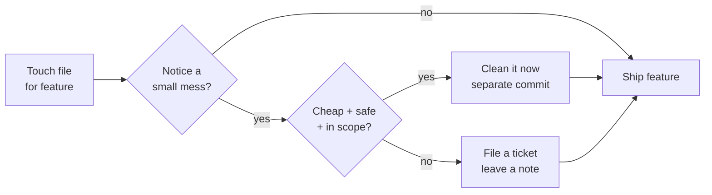
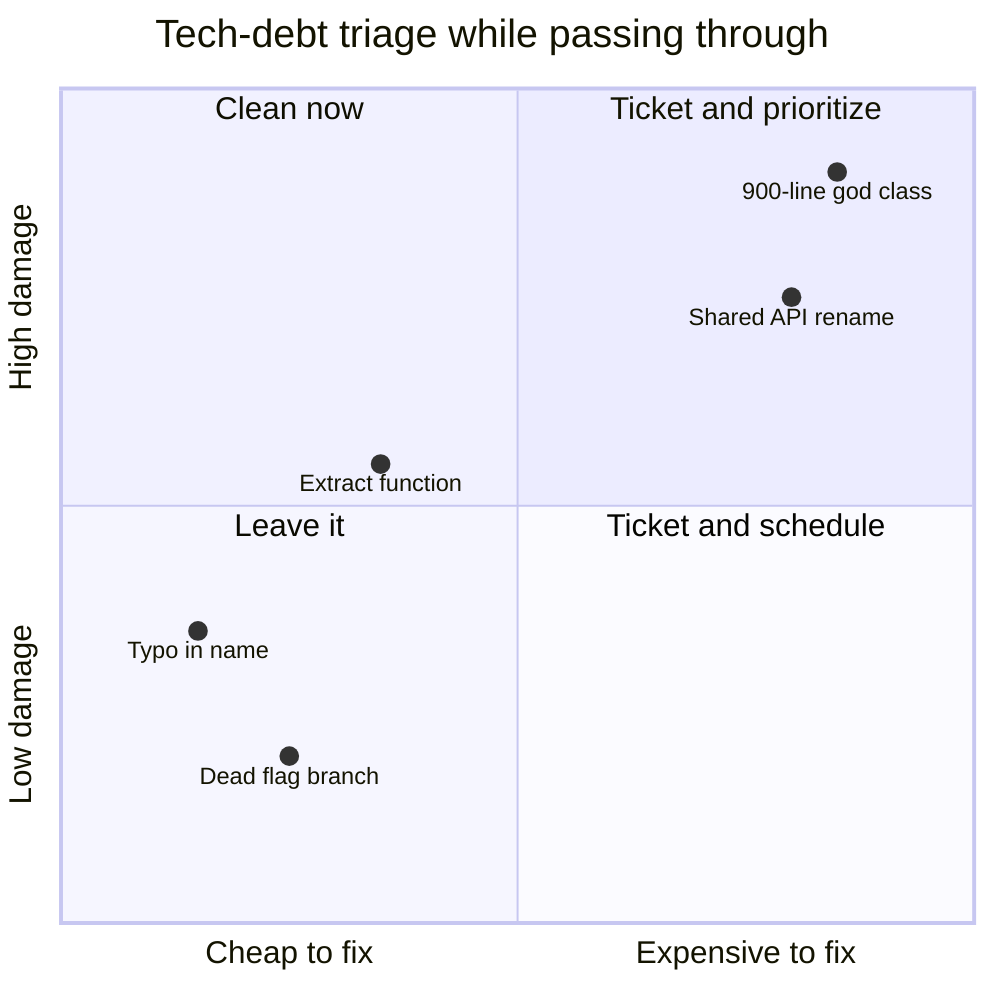

# Boy Scout Rule — Middle Level

> Focus: "Why does opportunistic cleanup pay off?" and "When does it bend?" — the trade-offs of cleaning code inside a feature PR, where the line sits between improvement and scope creep, and the discipline that keeps cleanup safe.

---

## Table of Contents

1. [Why the rule works: the economics of decay](#why-the-rule-works-the-economics-of-decay)
2. [The two hats: never refactor and add behavior at once](#the-two-hats-never-refactor-and-add-behavior-at-once)
3. [How much cleanup belongs in a feature PR](#how-much-cleanup-belongs-in-a-feature-pr)
4. [Separate commit vs. separate PR](#separate-commit-vs-separate-pr)
5. [Cleanup needs a safety net: characterization tests first](#cleanup-needs-a-safety-net-characterization-tests-first)
6. [Blast radius: the cost of touching shared code](#blast-radius-the-cost-of-touching-shared-code)
7. [When NOT to clean](#when-not-to-clean)
8. [Triage: clean now vs. file a ticket](#triage-clean-now-vs-file-a-ticket)
9. [The opportunistic / scope-creep boundary](#the-opportunistic--scope-creep-boundary)
10. [Common Mistakes](#common-mistakes)
11. [Test Yourself](#test-yourself)
12. [Cheat Sheet](#cheat-sheet)
13. [Summary](#summary)
14. [Further Reading](#further-reading)
15. [Related Topics](#related-topics)

---

## Why the rule works: the economics of decay

"Leave the campground cleaner than you found it." Applied to code, the rule is not about heroics — it is about **arithmetic on a derivative**. Code quality doesn't fall in discrete cliffs; it erodes one shortcut at a time. The Boy Scout Rule attacks the *rate* of decay, not the absolute level.

The reason it pays:

- **Cleanup is cheapest while you're already there.** You've loaded the file into your head to add the feature. The context — invariants, callers, naming intent — is in working memory *right now*. Coming back next quarter to fix the same mess means re-paying that loading cost. The marginal cost of a one-line rename while you're already reading is close to zero; the cost of a scheduled "tech-debt sprint" includes re-onboarding.
- **It distributes the work.** No single person owns "fix the codebase." Each touch is small. Across a team and a year, thousands of micro-improvements outpace any quarterly cleanup initiative — and they happen exactly where change is concentrated, which is exactly where quality matters most.
- **It changes the gradient.** In a decaying codebase the easiest next step is another shortcut. Once the local code is clean, the easiest next step is to *keep* it clean — the path of least resistance flips direction.



The rule is bounded by one word in that diagram: **small**. A boy scout picks up a wrapper; he does not re-landscape the campground on his way out. Everything below is about where that boundary sits.

---

## The two hats

Kent Beck's "two hats" metaphor is the single most important discipline behind safe cleanup. At any moment you are wearing exactly one hat:

- **Adding behavior** — writing new functionality. Tests change (you add new ones); behavior changes by design.
- **Refactoring** — restructuring without changing observable behavior. Tests do *not* change; if a test breaks, you broke something.

You switch hats frequently, but you **never wear both at once**. The reason is diagnostic clarity: if you refactor and add behavior in the same commit and a test fails, you cannot tell whether your restructuring introduced a regression or your new feature is simply incomplete. Separating the hats means a failing test always has one of two unambiguous meanings.

```python
# Hat 1 — REFACTOR (behavior must not change; existing tests stay green)
def total_price(items):
    return sum(line_total(i) for i in items)   # extracted helper, same result

def line_total(item):
    return item.qty * item.unit_price

# Hat 2 — ADD BEHAVIOR (in a later commit; new test added for the discount)
def line_total(item):
    subtotal = item.qty * item.unit_price
    return subtotal - discount_for(item)        # new behavior, new test
```

In practice this maps to commit hygiene: a refactor commit and a feature commit, never a "refactored stuff and added the discount" commit. Reviewers can read the refactor diff knowing the test suite proves behavior is unchanged, then read the feature diff knowing every line is intentional new behavior.

---

## How much cleanup belongs in a feature PR

This is the central trade-off of the rule at the 1–3 year level. You opened `invoice.go` to add a field. You see a misleading variable name, a dead branch, and a 200-line function begging to be split. How much do you fix?

The governing tension is **improvement vs. reviewer noise**. Every cleanup line is a line your reviewer must read and reason about *on top of* the feature they were asked to review. Too little cleanup and decay wins; too much and the feature gets lost in the diff, review slows, and a genuine bug hides behind 40 cosmetic changes.

A workable rule of thumb:

| Cleanup size | Where it goes |
|---|---|
| Typo, rename a local, delete dead code you just orphaned, fix formatting on lines you touched | Inline, same commit — invisible noise |
| Extract a function, simplify a conditional, in the file you're editing | Separate commit *within the same PR*, clearly labeled |
| Restructure a class, change a shared signature, rework a module | **Split into its own PR** |

The heuristic that scales: **cleanup should be a footnote to the PR, not a second headline.** If the reviewer has to ask "wait, why is the auth module in this payments PR?", you've crossed the line. When in doubt, keep the feature PR about the feature and pull the cleanup into a follow-up PR — a small dedicated PR gets reviewed faster than the same change buried in a feature.

```java
// You came to add `currency` support. The boy-scout-sized fixes (do now):
//  - rename `amt` -> `amount` in the method you're editing
//  - delete the `// TODO 2019` comment that's now false
//
// The NOT-now fix (file a ticket / separate PR):
//  - PaymentProcessor is 900 lines and mixes retry, logging, and posting.
//    Splitting it touches 30 call sites. That is not a footnote.
public Money convert(Money amount, Currency target) { ... }
```

---

## Separate commit vs. separate PR

Once you've decided a cleanup is in scope, you still choose its *granularity*. The two axes are **review cost** and **revertability**.

**Separate commit, same PR** — use when the cleanup is small, lives in the same files as the feature, and is naturally read alongside it. Benefits: the reviewer sees the whole story; you don't pay PR overhead twice. The discipline is that the commit is *atomic and labeled* (`refactor: extract validateAddress`), so if it ever needs reverting, `git revert <sha>` removes only the cleanup, leaving the feature intact. This is the everyday Boy Scout commit.

**Separate PR** — use when the cleanup is large, touches files the feature doesn't, has a different blast radius, or would benefit from a different reviewer (e.g., the owner of a shared module). Benefits: each PR has one reason to be rejected; the feature isn't blocked by debate over the refactor; the refactor can merge and bake on its own. Cost: branch juggling, and the feature may need to rebase on the merged cleanup.

> **Rule:** *Same files + small + behavior-preserving → separate commit. Different files, large, or shared ownership → separate PR.* The deciding question is always "who needs to review this, and would they review it the same way as the feature?"

---

## Cleanup needs a safety net

Refactoring is "changing structure without changing behavior" — a promise you can only keep if you can *detect* a behavior change. That detector is tests. Cleaning code that has no tests isn't refactoring; it's rewriting and hoping.

When the code you want to improve has no coverage, write **characterization tests** first: tests that pin down what the code *currently does*, bugs and all, not what it should do. They are a vise that holds behavior steady while you reshape the structure.

```python
# Step 1 — pin current behavior (characterization), even if it looks wrong.
def test_legacy_rounding_is_pinned():
    # We do NOT assert "correct" rounding — we assert what it does TODAY.
    assert legacy_tax(100.00) == 7.0     # captures the existing result
    assert legacy_tax(0.00)  == 0.0

# Step 2 — now refactor legacy_tax internals freely; these tests guard you.
# Step 3 — if you later FIX the rounding, that is the OTHER hat (add behavior),
#          a separate commit, and you UPDATE the test deliberately.
```

The order matters: tests, then refactor, then (separately, if at all) behavior fix. If you cannot write a characterization test cheaply — the code reaches the network, mutates global state, or has tangled dependencies — that is a strong signal to **not clean it during a feature PR**. Note it, ticket it, and tackle it when you can invest in seams first.

---

## Blast radius: the cost of touching shared code

The Boy Scout Rule scales beautifully on *local* code and dangerously on *shared* code. The deciding variable is **blast radius** — how many callers, teams, and CI pipelines your change disturbs.

Cleaning a private helper used in one file: blast radius of one. Renaming a public method on a base class that 200 services extend: blast radius of the whole org. The same "improvement" is a footnote in the first case and a multi-team migration in the second.

```go
// Low blast radius — clean freely.
func (s *server) parseHeader(b []byte) (header, error) { ... } // unexported, one caller

// High blast radius — do NOT boy-scout this mid-feature.
// Renaming the field below breaks every JSON client and every test that builds it.
type User struct {
    Eml string `json:"eml"` // ugly name, but it's the public wire contract
}
```

Practical guardrails:

- **Measure before you touch.** Use "Find usages" / `grep` on the symbol. If the count is large or crosses package/module boundaries, the cleanup is a project, not a chore.
- **Public APIs and serialized formats are not campground litter — they are load-bearing.** Renaming them is a versioned, communicated change, never an opportunistic one.
- **Review impact is part of the cost.** A change that touches 40 files forces 40 files of review attention even if each diff is trivial; that attention is borrowed from finding real bugs.

---

## When NOT to clean

The rule has a strong default toward cleaning, but it bends — sometimes breaks — in specific situations. Recognizing them is a senior-track skill that starts here:

- **Code you're about to delete.** A module slated for removal next sprint, a feature behind a flag being sunset. Polishing it is effort invested in something with a known expiry. Leave it.
- **Code you don't understand.** If you can't articulate the current behavior and its invariants, you can't preserve them. "Cleaning" code you don't understand is how subtle regressions are born. Read it, test it, *then* maybe clean it — or leave it.
- **A hot incident fix.** During an outage, the only goal is to stop the bleeding with the smallest, most reviewable, most revertable change possible. A cluttered fix is faster to reason about under pressure than a fix tangled with a refactor. Clean up *after* the incident, in a calm follow-up PR.
- **Frozen / regulated / certified code.** Some code is locked for compliance, audit, or because re-certification is expensive. Touching it triggers process cost far beyond the cleanup's value.
- **No test coverage and no cheap way to add it.** Covered above — without a safety net, "cleanup" is a gamble.
- **Right before a release freeze.** The risk/reward flips: a cosmetic improvement isn't worth the regression risk hours before a cut.

> The unifying principle: **clean when the expected value is positive.** Expected value ≈ (probability the code survives and is re-read) × (improvement) − (risk of regression) − (review/process cost). Soon-to-be-deleted code zeroes the first term; incident fixes spike the risk term; shared code spikes the cost term.

---

## Triage: clean now vs. file a ticket

You can't clean everything you notice, and you shouldn't pretend you will "get to it later" with no record. Triage each mess on two axes — **cost to fix now** and **damage if left** — and route it:



- **Cheap + you're already there → clean now** (the classic Boy Scout move).
- **Expensive + high damage → file a real ticket** with enough context to act on, and prioritize it. A ticket is a *commitment to schedule*, not a place debt goes to die. The anti-pattern is the "cleanup later" comment that is never paid.
- **Cheap + low damage but out of scope → leave a focused follow-up** or a precise `// TODO(owner, ticket-123): ...`. A TODO with no owner and no ticket is litter, not a plan.
- **Expensive + low damage → usually leave it.** Not all imperfect code is worth fixing.

The honest version of "cleanup later" is a ticket with a priority. The dishonest version is a comment everyone learns to ignore.

---

## The opportunistic / scope-creep boundary

The failure mode of an enthusiastic engineer is the inverse of the lazy one. Scope creep is the Boy Scout Rule taken past its bound: you went in to fix a typo and came out having "improved" six unrelated files. Three tests draw the line:

1. **The locality test.** Is the cleanup in code you had to touch for the task anyway? Cleaning the function you're editing: opportunistic. Cleaning the neighboring module because you happened to see it: scope creep.
2. **The single-story test.** Can the PR be described in one sentence without "and"? "Add currency support" — good. "Add currency support *and* refactor the retry layer *and* rename the logger" — three PRs wearing a trench coat.
3. **The revert test.** If the feature has to be rolled back, does the cleanup roll back with it (and should it)? If your cleanup is independently valuable, it shouldn't be hostage to the feature's fate — that's a sign it wants its own PR.

> Scope creep isn't caused by caring too much; it's caused by not separating concerns into separate changesets. The cure is rarely "clean less" — it's "clean in the right-sized, separately-reviewable unit."

---

## Common Mistakes

- **Wearing both hats.** Refactoring and adding behavior in one commit. A test fails and you can't tell which change caused it. *Fix: one hat per commit.*
- **Cleanup with no tests.** Calling a rewrite "refactoring" when there's no coverage to prove behavior held. *Fix: characterization tests first, or don't touch it now.*
- **The 40-file footnote.** Bundling sweeping cleanup into a feature PR so the actual feature is invisible and review quality drops. *Fix: keep cleanup a footnote; split large cleanups into their own PR.*
- **Boy-scouting shared/public code mid-feature.** Renaming a public API or wire field opportunistically and breaking downstream consumers. *Fix: measure blast radius first; treat public contracts as versioned changes.*
- **The immortal TODO.** "Clean up later" comments and ownerless TODOs that are never paid. *Fix: file a ticket with a priority, or fix it now.*
- **Polishing the doomed.** Carefully cleaning code that's scheduled for deletion. *Fix: check survival before investing.*
- **Refactoring during an incident.** Tangling the outage fix with a cleanup. *Fix: smallest revertable fix now; clean in a calm follow-up.*
- **Drive-by refactors with no heads-up.** Silently reshaping a teammate's module on your feature branch. *Fix: separate, labeled commit or PR so reviewers see the intent.*

---

## Test Yourself

1. **You opened a 60-line function to add one parameter and noticed it has a confusingly named local and a dead `else` branch. Clean them?**

<details><summary>Answer</summary>

Yes — both are inside the function you're already editing (locality test passes), both are cheap and behavior-preserving (deleting a dead branch changes nothing; renaming a local is mechanical). Put them in a separate, labeled commit (`refactor: rename local, remove dead branch`) within the same PR so the reviewer can read them apart from your feature line. This is the textbook Boy Scout move.

</details>

2. **Why is "refactor and add the feature in one commit" discouraged even when the result works?**

<details><summary>Answer</summary>

Because of the two-hats principle. If a test fails, a mixed commit gives you two possible causes — your restructuring broke something, or your new feature is incomplete — and you can't tell which. Separate commits make a failing test unambiguous, make review tractable (the reviewer trusts the green suite on the refactor and scrutinizes only the feature), and make `git revert` surgical.

</details>

3. **Mid-feature you realize a clean implementation needs a method on a shared base class renamed — used by 200 callers across teams. What do you do?**

<details><summary>Answer</summary>

Stop boy-scouting. The blast radius is org-wide; this is a migration, not a footnote. Options: (a) do your feature without the rename, adapting locally; (b) open a separate, well-communicated PR for the rename with owner sign-off, possibly staged (add new name, deprecate old, migrate callers, remove old). Never fold an org-wide rename into a feature PR.

</details>

4. **The code you want to clean has zero tests. Clean it anyway since it's "obviously safe"?**

<details><summary>Answer</summary>

No. "Obviously safe" is exactly the assumption that produces regressions. Write characterization tests that pin the current behavior first, then refactor under their protection. If a characterization test is too expensive to write (network, global state, tangled deps), that's a signal to ticket the cleanup rather than do it opportunistically during a feature.

</details>

5. **It's a production incident; you spot ugly code right next to the line causing the outage. Fix both?**

<details><summary>Answer</summary>

No. During an incident, ship the smallest, most revertable change that stops the bleeding. Mixing in cleanup enlarges the diff, slows review under pressure, and adds regression risk at the worst possible moment. File a follow-up and clean it in a calm PR afterward.

</details>

6. **Your reviewer says "this PR has the feature plus 30 cleanup changes; I can't tell what's load-bearing." Is that fair?**

<details><summary>Answer</summary>

Yes — that's the reviewer-noise trade-off biting. Cleanup should be a footnote, not a second headline. Split the cleanup into separate commits at minimum (so it can be reviewed as a unit) or, if it's large, into its own PR. The reviewer's confusion is direct evidence the balance tipped too far toward cleanup.

</details>

7. **You notice a 900-line god class while adding an unrelated field. The clean instinct says "split it now." Right call?**

<details><summary>Answer</summary>

No. Splitting a 900-line class while adding an unrelated field fails every boundary test: it's not local to your task, it can't be described in one sentence with the feature, and its blast radius (likely many callers) makes it a project. Add your field; file a ticket for the split and prioritize it honestly. If the class actively blocks your feature, that's a reason for a *dedicated* refactoring PR done first, not a drive-by.

</details>

8. **A cleanup is genuinely valuable but unrelated to your feature, and small. Commit in the feature PR or split it out?**

<details><summary>Answer</summary>

Apply the revert test: if the feature is rolled back, would you want this cleanup rolled back too? If no — it stands on its own merits — it wants its own PR (or at least its own PR if it touches different files). Independently valuable changes shouldn't be hostage to a feature's fate, and a small dedicated PR is reviewed quickly. Keep the feature PR single-story.

</details>

---

## Cheat Sheet

| Situation | Move |
|---|---|
| Mess in code you're already editing, cheap, safe | Clean now, separate labeled commit |
| Refactor + new behavior | Two commits, never one (two hats) |
| No tests on the target | Characterization tests first, or don't touch it |
| Large cleanup, different files, shared ownership | Separate PR |
| Public API / wire format rename | Versioned, communicated change — not opportunistic |
| Big blast radius (many callers/teams) | It's a migration, not a chore — ticket + dedicated PR |
| Code about to be deleted | Leave it |
| Code you don't understand | Read/test first, or leave it |
| Hot incident fix | Smallest revertable change; clean up afterward |
| Mess too expensive to fix now | File a ticket with a priority (not an immortal TODO) |
| PR needs "and" to describe it | Split it — single-story rule |

**Three questions before any opportunistic cleanup:** Is it *local* to my task? Is it *cheap and safe* (tests cover it)? Is its *blast radius* small? Three yeses → clean now. Any no → ticket or split.

---

## Summary

The Boy Scout Rule is a force on the *rate* of code decay: many small, local improvements made exactly where change concentrates, by whoever is already there. Its power comes from low marginal cost — you've already paid to load the context — and its safety comes from discipline:

- **Two hats:** refactor or add behavior, never both in one commit, so a failing test is never ambiguous.
- **Tests first:** cleanup without coverage is rewriting and hoping; characterization tests pin behavior before you reshape it.
- **Footnote, not headline:** keep cleanup small enough to ride along in a feature PR without drowning the feature in reviewer noise; split large or shared-code cleanups into their own PR.
- **Mind the blast radius:** local code is a chore, shared/public contracts are migrations.
- **Know when to stop:** doomed code, code you don't understand, incident fixes, and freezes are when the rule bends — clean only when expected value is positive.
- **Triage honestly:** the real "later" is a prioritized ticket, not an ignored comment.

Done right, the rule is invisible: the codebase quietly gets better and no PR ever felt heavier for it. Done wrong, it becomes scope creep in one direction or neglect in the other — and the cure for both is the same: clean in the right-sized, separately-reviewable unit.

---

## Further Reading

- [`junior.md`](junior.md) — the rule's definition, the anti-patterns to avoid, and worked before/after examples.
- [`senior.md`](senior.md) — making cleanup a team norm: definition-of-done, fitness functions, hotspot-driven debt prioritization, and large-scale migration patterns.
- [`../README.md`](../README.md) — the chapter overview and the positive rules this anti-pattern set inverts.
- _Refactoring_ (Martin Fowler) — the two-hats metaphor and the catalog of behavior-preserving moves.
- _Working Effectively with Legacy Code_ (Michael Feathers) — characterization tests and creating seams in untested code.

---

## Related Topics

- [`../10-emergence/README.md`](../10-emergence/README.md) — incremental refactoring as the engine of emergent, simple design.
- [`../17-code-reviews/README.md`](../17-code-reviews/README.md) — how PR-size and single-story discipline keep reviews effective.
- [`../../refactoring/README.md`](../../refactoring/README.md) — the mechanics of behavior-preserving change the rule relies on.
- [`../../anti-patterns/README.md`](../../anti-patterns/README.md) — the larger taxonomy of decay the Boy Scout Rule counteracts.
