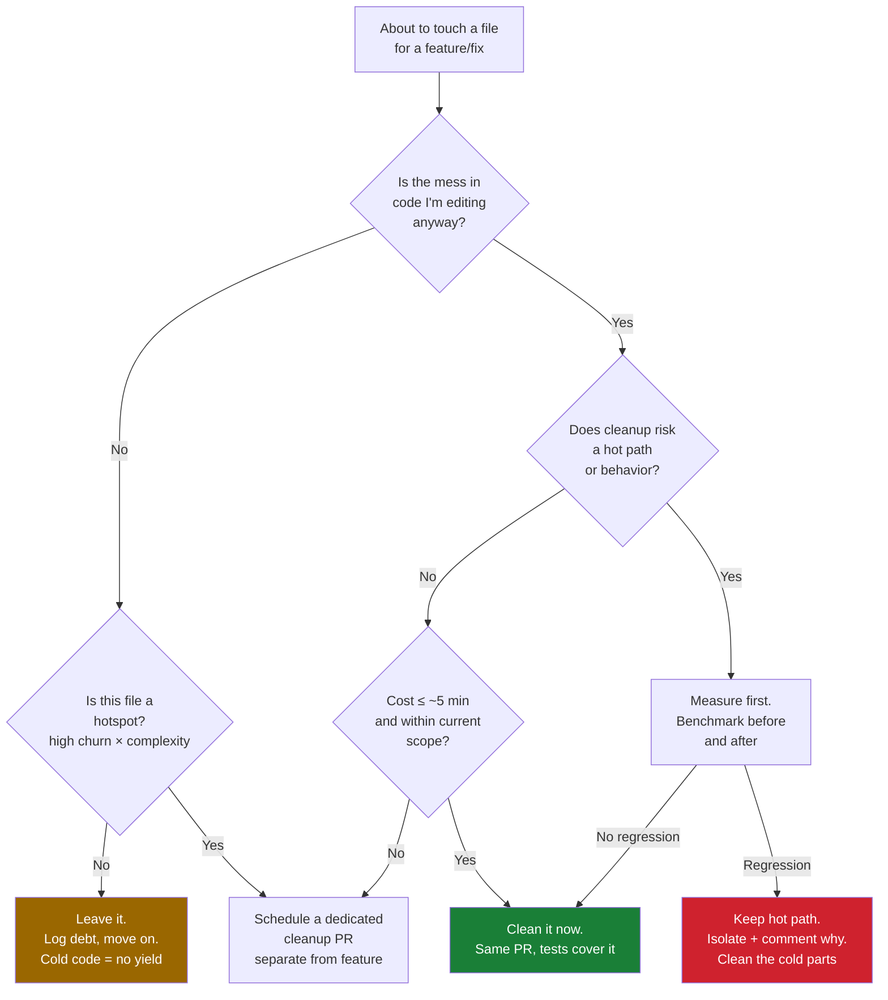
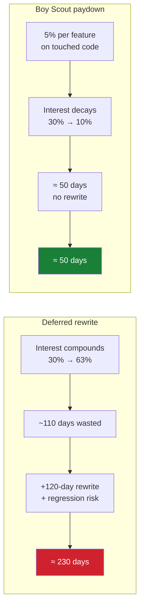

# Boy Scout Rule — Optimize & Reconcile

> "Always leave the campground cleaner than you found it." The rule is unconditional in spirit, but engineering is not unconditional — you have a finite budget of time, review attention, and risk tolerance per change. This file is about the *economics* of continuous cleanup: where a swept floor pays compound interest, where it burns money, and how to clean without destabilizing a hot path or trashing `git blame`. Every cleanup is an investment with a yield and a downside. We price both.

The naive reading of the Boy Scout Rule is "clean everything you touch, always." The senior reading is "clean what you touch *when the expected payoff exceeds the expected cost*, and pick *which* mess to attack so your finite cleanup budget lands where it compounds." Both the cost and the payoff are measurable. This file makes them concrete.

---

## Table of Contents

1. [Hotspot-driven ROI — clean where churn × complexity is highest](#scenario-1)
2. [Cold, stable code — the cleanup that earns nothing](#scenario-2)
3. [The risk surface of a diff — every line touched is a chance to add a bug](#scenario-3)
4. [The reviewer's mental-model tax](#scenario-4)
5. [Merge-conflict cost of cleanup on a long-lived branch](#scenario-5)
6. [Batching cleanup vs spreading it — the review-cost curve](#scenario-6)
7. [When cleanup regresses a hot path (clean abstraction over hand-tuned loop)](#scenario-7)
8. [`.git-blame-ignore-revs` — keeping blame useful after format-only sweeps](#scenario-8)
9. [Compound-interest math of technical debt — paydown vs deferred rewrite](#scenario-9)
10. [Time-boxing cleanup — the 5-minute / 20% rule](#scenario-10)
11. [Cleanup that invalidates a cache or warm path at runtime](#scenario-11)
12. [Sequencing — refactor-then-feature vs feature-then-refactor](#scenario-12)
13. [Measuring the rule worked — leading indicators of debt paydown](#scenario-13)

---

## The decision flow



---

### Scenario 1 — Hotspot-driven ROI: clean where churn × complexity is highest

You inherit a 180k-LOC service with debt everywhere. You have one engineer-week to spend on cleanup this quarter. Spreading it evenly across the codebase feels fair. It is also nearly worthless.

<details><summary>Resolution</summary>

**Reasoning.** Adam Tornhill's *behavioral code analysis* (CodeScene) gives the prioritization: cleanup ROI is highest where **change frequency (churn) intersects with complexity**. A file that is complex but never changes costs you nothing — nobody pays the comprehension tax. A file that changes daily but is simple is already cheap to work in. The expensive intersection is the file that is *both* complex *and* hot: every change is slow, error-prone, and the cost recurs on every commit.

**Concrete prioritization.** Rank files by a hotspot score:

```
hotspot_score(file) = commits_last_180d(file) × complexity(file)
```

where `complexity` is a cheap proxy — indentation-based complexity, cyclomatic complexity, or just LOC. Compute it from git:

```bash
# Churn: commits per file in the last 180 days
git log --since="180 days ago" --name-only --pretty=format: \
  | grep -E '\.(go|java|py)$' | sort | uniq -c | sort -rn > churn.txt
```

Pair `churn.txt` with a complexity number per file (e.g. `gocyclo`, `radon cc`, `lizard`). Multiply. The top 5% of files by hotspot score typically carry 40–60% of the maintenance cost. **Spend the engineer-week there**, not spread evenly.

**The numbers.** Say file `pricing_engine.go` has 47 commits in 180 days and cyclomatic complexity 90 → score 4230. A cold `legacy_xml_export.go` has 1 commit and complexity 200 → score 200. The pricing engine is 21× more valuable to clean even though the XML file *looks* scarier. A reader's instinct ("clean the scariest file") is exactly wrong; the data redirects effort to where it compounds.

**Principled resolution.** The Boy Scout Rule applies to *every* file you touch, but your *proactive, budgeted* cleanup goes to hotspots. These reinforce each other: hotspots are, by definition, the files you touch most, so the opportunistic rule and the strategic rule converge on the same place.

</details>

---

### Scenario 2 — Cold, stable code: the cleanup that earns nothing

A linter flags 600 violations in `legacy/reporting/`. The module hasn't been edited in 3 years. A teammate opens a 4000-line PR to "boy-scout" it into compliance.

<details><summary>Resolution</summary>

**Reasoning.** Cleanup yields value only when someone *reads or edits* the code afterward. The expected number of future reads of a file that has gone 3 years untouched is approximately zero in any horizon you can plan for. Cleaning it converts a guaranteed cost (review time, risk of breaking working code, blame noise) into a payoff with near-zero probability of being collected.

**The economics.** Model it. Let `r` = expected reads/edits over the next 2 years, `s` = time saved per read by the cleanup, `c` = one-time cleanup cost (write + review + risk-adjusted bug cost). Cleanup is justified when `r × s > c`.

| File | reads/2y (`r`) | saving/read (`s`) | cleanup cost (`c`) | `r×s` | Verdict |
|---|---|---|---|---|---|
| Hot pricing engine | 200 | 4 min | 6 h | 800 min | Clean — 2.2× payoff |
| Cold reporting module | ~2 | 4 min | 30 h | 8 min | Leave — 0.004× payoff |

The cold module returns **0.4% of its cost**. Cleaning it is not virtue; it's destroying value while feeling virtuous.

**The hidden cost.** A 4000-line format-only PR also (a) consumes a reviewer's day for zero feature value, (b) creates merge conflicts for anyone with in-flight work in those files, and (c) rewrites `git blame` for 4000 lines, burying the *actual* last-meaningful-change author behind a mechanical commit.

**Principled resolution.** Suppress the linter for cold modules (`//nolint`, a path-scoped config exclusion) rather than rewriting them. If the code is genuinely dead, the highest-ROI cleanup is *deletion*, not formatting. Reserve full sweeps for the moment the module actually becomes hot again — at which point you have a *reason* to be in there. The Boy Scout Rule is opportunistic: it cleans the campsite you're *camping in*, not every campsite in the forest.

</details>

---

### Scenario 3 — The risk surface of a diff: every line touched is a chance to add a bug

While fixing a one-line null check, you also rename 12 variables, reorder 3 methods, and extract a helper — all "improvements." The PR is now 90 lines. It introduces a bug in the reordering that the one-line fix would never have had.

<details><summary>Resolution</summary>

**Reasoning.** Defect density is roughly proportional to *changed* lines, not total lines. Industry studies put injected-defect rates around **10–50 bugs per 1000 lines of new/changed code** depending on rigor. If your true task changes 1 line and your cleanup changes 89 more, you have multiplied the bug-injection surface of this change by ~90× to deliver a cleanup whose payoff is, at best, marginal comprehension gain.

**The asymmetry.** The bug-fix line has a clear, tested purpose. The 89 cleanup lines have diffuse value and full risk. A regression in the cleanup can *reintroduce or mask* the very bug you came to fix, and now the PR's blast radius makes the regression hard to bisect — was it the null check or the method reorder?

```go
// Came to fix this:
if user != nil {            // was missing, NPE in prod
    notify(user)
}

// Got tempted to also "clean" this, in the same PR:
- func process(o *Order, c *Customer, p *Payment, opts Options) { ... }
+ func process(req ProcessRequest) { ... }   // 60-line signature refactor
```

The signature refactor touches every caller, every test, every mock. One of them gets the field mapping wrong. Now the hotfix is blocked on debugging the refactor.

**Principled resolution.** *Separate risk profiles into separate commits/PRs.* The behavior-changing fix ships alone, small, reviewable in 2 minutes, fast to revert. The cleanup ships as its own PR with the explicit, smaller claim "no behavior change — only structure." This is not a betrayal of the Boy Scout Rule; it's the disciplined form of it. The campground metaphor doesn't say "renovate the campground" — it says "leave it a *little* cleaner." Bounded scope is the whole point. (See [find-bug.md](find-bug.md) for how mixed-concern PRs hide regressions.)

</details>

---

### Scenario 4 — The reviewer's mental-model tax

Your reviewer read this file last week and built a mental model of it. Your cleanup PR moves every function, renames the central type, and reflows the imports. The reviewer must rebuild their model from scratch to review a change that, semantically, does nothing.

<details><summary>Resolution</summary>

**Reasoning.** A reviewer approving a diff is verifying "the *change* is correct," leaning on their existing model of the surrounding code. A large structural cleanup invalidates that model: now they must re-derive correctness for the whole file, because they can no longer tell what is *moved-unchanged* vs *moved-and-altered*. A 200-line reshuffle where 198 lines are pure moves and 2 lines secretly changed behavior is nearly unreviewable — the signal is buried in the noise.

**The number.** Review effectiveness drops sharply with diff size. Cisco/SmartBear review data and the broadly cited guidance converge on: defect-detection efficiency falls off a cliff past ~200–400 LOC per review, and reviewers' inspection rate above ~500 LOC/hour misses most defects. A 1500-line cleanup PR is reviewed at "LGTM" rubber-stamp quality regardless of reviewer diligence — the human cannot hold it.

**Principled resolution.**
- **Mechanical-only PRs get a contract.** Title them `refactor(pricing): rename + reorder, no behavior change`. Reviewer reviews the *guarantee*, not every line, and verifies it cheaply: "tests pass + diff is structural" rather than "re-derive every line."
- **Keep moves out of behavior PRs.** Tools help: many review UIs detect and dim pure moves only if the commit is *move-only*. Mix in edits and the move-detection breaks, re-exposing the whole reviewer tax.
- **Preserve mental-model continuity.** If a hot file is being read by 4 people this sprint, don't relocate its core type mid-sprint. Time the structural cleanup for a quiet window. The cleanup's value (clarity) is real but small; the cost (4 invalidated mental models + a hard-to-review diff) can dwarf it.

</details>

---

### Scenario 5 — Merge-conflict cost of cleanup on a long-lived branch

Three feature branches have been open for 2 weeks, all editing `order_service.py`. You merge a "boy-scout" cleanup to `main` that reformats and reorders the whole file. All three branches now face a brutal rebase.

<details><summary>Resolution</summary>

**Reasoning.** A format-or-reorder sweep touches *lines that other people's in-flight work also touches*, but in a way git cannot auto-merge: line-level conflicts everywhere because everything moved. The cleanup's local payoff (cleaner file) is paid for by an externalized cost — three engineers each spend an hour resolving conflicts, and each resolution is itself a bug-injection opportunity (mis-resolved conflicts are a classic source of regressions and lost edits).

**The math.** Cleanup author saves themselves maybe 20 minutes of future reading. The externalized cost: 3 branches × 1 h rebase × (1 + p·bug_cost). At 3 engineer-hours plus conflict-resolution risk, the *net* of this cleanup is sharply negative even though the file got cleaner. The author optimized their local view and dumped the cost on the team.

**Principled resolution.**
- **Coordinate timing.** Big structural cleanups go in when contention is low — early in a sprint, or right after the contended branches land. `git log --since=... --name-only` plus open-PR inspection tells you which files are hot *right now*.
- **Prefer narrow, append-friendly cleanups on contended files.** Extracting a new helper at the end of a file conflicts far less than reordering the whole file.
- **Land the cleanup in tiny increments** so each is a small, isolated conflict rather than one catastrophic rebase.

This is the Boy Scout Rule's social contract: leave it cleaner *for the next camper*, not "leave it cleaner for me and hand the next three campers a mess."

</details>

---

### Scenario 6 — Batching cleanup vs spreading it: the review-cost curve

Should you bundle 30 small cleanups into one "spring cleaning" PR, or spread them one-per-feature-PR over a month? Both have a defensible story. The right answer depends on the *kind* of cleanup.

<details><summary>Resolution</summary>

**Reasoning.** There are two opposing forces:

- **Fixed review overhead per PR** favors *batching*: context-switch, CI run, approval round-trip cost ~10–20 min regardless of size. 30 separate PRs pay that 30 times.
- **Reviewability degrades super-linearly with size** (Scenario 4) and **risk scales with changed lines** (Scenario 3), both favoring *spreading*.

The resolution is a classification, not a single rule:

| Cleanup kind | Batch or spread? | Why |
|---|---|---|
| Pure-mechanical, tool-applied (gofmt, isort, prettier) | **Batch** — one PR, repo-wide | Zero per-item risk; reviewer verifies "ran the tool", not each line. Spreading wastes 30× the review overhead. |
| Semantic, judgment-bearing (rename for clarity, extract method) | **Spread** — one per touched area, in the feature PR that touches it | Each needs real review; bundling 30 into one PR makes them un-reviewable and couples unrelated risk. |
| Behavior-adjacent (tighten an error path, fix a flaky check) | **Spread + isolate** — its own small PR each | Each can regress; must be individually revertable. |

**The number.** A repo-wide `gofmt` is 100% mechanical → one PR, reviewed in 2 minutes against the guarantee "this is `gofmt -w ./...` output, nothing else." Splitting it into 30 PRs would burn ~7 hours of overhead for zero added safety. Conversely, 30 *renames* batched into one PR turns a 2-minute-each judgment call into a 4-hour unreviewable slog where the 1 bad rename hides among 29 good ones.

**Principled resolution.** Batch by *risk homogeneity*: a PR should contain changes that are reviewed and reverted as a unit. Mechanical sweeps are one risk class (batch them, exclude from blame — Scenario 8). Judgment cleanups are individual risks (spread them). Never mix the two classes in one PR — that's the worst of both: mechanical noise drowning the judgment changes.

</details>

---

### Scenario 7 — When cleanup regresses a hot path

A reviewer asks you to replace this "ugly" hand-tuned loop with a clean, declarative stream/comprehension. The clean version is genuinely more readable. It is also 4× slower on the path that runs 2M times/sec.

<details><summary>Resolution</summary>

**Reasoning.** Clean abstractions have a cost the abstraction is meant to hide — allocation, boxing, indirection, lost vectorization, lambda capture. On a cold path that cost is invisible and irrelevant. On a hot path it dominates. The Boy Scout Rule never says "clean at any performance cost"; readability and throughput are *both* assets, and on a hot path throughput can be worth more than the few seconds of comprehension the cleaner code saves.

**Measure first — concrete.** Don't argue from intuition; benchmark.

Java (JMH), summing a primitive array:

```java
// Hand-tuned, ugly, fast:
long sum = 0;
for (int i = 0; i < a.length; i++) sum += a[i];   // ~0.2 ns/elem, no boxing

// "Clean", slower on hot path:
long sum = Arrays.stream(a).asLongStream().sum();   // fine for ints…
long sum = list.stream().mapToLong(Long::longValue).sum();  // boxed: 3–5× slower, allocates
```

Go (`go test -bench` + `-gcflags=-m`):

```go
// Hot path. The "clean" closure version below may add a per-call
// indirect call the inliner can't remove; verify, don't assume.
func sumLoop(xs []int) (s int) { for _, x := range xs { s += x }; return }

func sumFold(xs []int) int {       // prettier, but check inlining + escape analysis
    return reduce(xs, 0, func(a, x int) int { return a + x })
}
// $ go test -bench=Sum -benchmem   ->  ns/op AND allocs/op for both
```

Python (the abstraction can win *or* lose — measure):

```python
# Vectorized clean beats the explicit loop when data is large:
total = arr.sum()                      # numpy, C loop
total = sum(x for x in py_list)        # pure-Python, ~50–100× slower for large lists
# But a generator expression can be slower than a tight built-in on small data. timeit it.
```

**The rule of decision.** Run the benchmark before merging the "cleaner" version on any path you suspect is hot. If the clean version is within noise (say <5%), take it — readability for free. If it regresses a *proven* hot path materially, **keep the hot path** and isolate it.

**Principled resolution.** Quarantine the ugliness, don't spread it. Keep the fast loop, wrap it behind a clean *interface*, and leave a comment that turns "why is this ugly?" into "this is ugly *on purpose*, here's the number":

```go
// HOT PATH: 2M calls/s. Hand-rolled loop is 4× faster than the reduce()
// abstraction (see bench_sum_test.go, 0.21 vs 0.84 ns/op). Do not "clean up".
func sumLoop(xs []int) (s int) { for _, x := range xs { s += x }; return }
```

Now the campground *is* cleaner: the next camper sees a documented, intentional trade-off instead of mysterious ugliness, and they have the benchmark to re-decide if hardware changes. Cleanup of *understanding* without regression of *speed*. (See [code-craft profiling skill] — profile before you optimize *or* before you "clean".)

</details>

---

### Scenario 8 — `.git-blame-ignore-revs`: keeping blame useful after format-only sweeps

You finally run a repo-wide formatter. Now `git blame` on every file points at your formatting commit, and `git log -L` for any line stops at the reformat. You've made `blame` archaeology — the single most useful debugging tool — nearly useless.

<details><summary>Resolution</summary>

**Reasoning.** `git blame` answers "who last touched this line and *why*" — the entry point to the commit message, the PR, the ticket, the original author to ask. A pure-formatting commit touches *every* line without changing meaning, so it overwrites that answer with "the formatter, for no semantic reason" across the whole file. The information loss is total and silent.

**The fix — `.git-blame-ignore-revs`.** Git supports a revs file that `blame` skips, restoring the *meaningful* last-touch author beneath the mechanical commit.

```bash
# 1. Make the mechanical-only commit, nothing else in it:
gofmt -w ./...           # or: black . ; isort .   |   ./gradlew spotlessApply
git commit -am "style: repo-wide gofmt, no behavior change"

# 2. Record its full SHA in the ignore-revs file:
git rev-parse HEAD >> .git-blame-ignore-revs
git commit -am "chore: ignore the formatting commit in blame"

# 3. Make it the default so everyone (and the IDE) benefits:
git config blame.ignoreRevsFile .git-blame-ignore-revs
```

`.git-blame-ignore-revs` is honored by `git blame`, GitHub, and GitLab automatically once present (GitHub reads it from the repo root). IDEs that delegate to git pick it up via the config.

**The discipline that makes it work.** The ignored commit must be **mechanical-only**. If you sneak a logic change into the formatting commit, ignoring it in blame *hides a real change* — the worst outcome, a behavior change invisible to `blame`. This is exactly why Scenario 6 insists mechanical and semantic cleanups never share a commit.

**Principled resolution.** Repo-wide formatting is legitimate cleanup *if* you (1) keep it 100% mechanical, (2) commit it in isolation, and (3) register it in `.git-blame-ignore-revs`. Then you get the clean campground *and* keep the trail markers (`blame`) that the next debugger relies on. Skip step 3 and your "cleanup" is a debugging-tool regression that the team curses for years.

</details>

---

### Scenario 9 — Compound-interest math of technical debt: paydown vs deferred rewrite

Leadership keeps deferring cleanup: "we'll do a big rewrite next year." Meanwhile every feature in the messy module ships slower than the last. You need to make the cost of *deferral* concrete, because "it feels slow" loses to "ship features now."

<details><summary>Resolution</summary>

**Reasoning.** Technical debt behaves like financial debt: you pay *interest* every time you work in the indebted code — extra time to understand, extra bugs, extra test scaffolding. The interest *compounds* because new code built on messy foundations inherits and amplifies the mess (Ward Cunningham's original metaphor). The choice is not "pay now vs pay never"; it's "small, continuous principal payments (Boy Scout)" vs "let interest compound until a big, risky, all-or-nothing rewrite."

**The model — make it a spreadsheet.** Let:
- `f` = features shipped per month in this module = 4
- `t₀` = baseline dev-time per feature in clean code = 5 days
- `interest rate` `i` = extra fraction of time the current debt adds = 30% today, *growing* 3 percentage points/month as debt compounds.

Deferred-rewrite path (do nothing for 12 months, then rewrite):

| Month | interest `i` | wasted days/feature | wasted days that month (×4) |
|---|---|---|---|
| 1 | 30% | 1.5 | 6 |
| 6 | 45% | 2.25 | 9 |
| 12 | 63% | 3.15 | 12.6 |

Cumulative waste over 12 months ≈ **~110 engineer-days**, *then* a rewrite costing, say, 120 days with its own regression risk. Total ≈ **230 days + risk**.

Continuous-paydown path (Boy Scout, ~5% of each feature's time on cleanup of the part you touch): interest *falls* ~2 pts/month instead of rising. By month 12, `i` ≈ 10%, monthly waste ≈ 2 days, cumulative waste ≈ **~50 days**, no rewrite, no big-bang risk. Total ≈ **50 days + small steady cost**.

**The punchline number:** continuous paydown costs roughly **one-quarter** of deferred-rewrite-plus-interest here, and removes the rewrite's binary risk entirely. The "we'll rewrite later" plan is the financial equivalent of paying only the minimum on a high-APR card.



**Principled resolution.** Rewrites are justified only when interest is so high that *no* incremental path converges (the code is unsafe to touch at all) — rare, and usually itself the product of years of skipped Boy Scout cleanups. Present the table above, not adjectives. Continuous small paydown beats deferred rewrite on cost *and* risk in the overwhelming majority of cases. (Large-scale restructuring, when truly needed, has its own discipline — see `../../refactoring/04-large-scale-refactoring/README.md`.)

</details>

---

### Scenario 10 — Time-boxing cleanup: the 5-minute / 20% rule

A junior reports they spent a full day "boy-scouting" a file they were assigned a 1-hour bug fix in. The bug is fixed; they also rewrote half the module. The instinct was right; the budgeting was absent.

<details><summary>Resolution</summary>

**Reasoning.** Without a budget, "always leave it cleaner" expands to fill all available time — cleanup has no natural stopping point (there is *always* more to clean). The rule needs a governor: a cap on how much of a task's budget cleanup may consume, so it stays opportunistic rather than becoming a competing project.

**Two practical governors.**

- **The 5-minute test (opportunistic, in-scope).** If the cleanup of code you're *already editing* takes under ~5 minutes and carries no behavior risk — rename a misleading variable, delete dead code in the function you're in, fix the typo in the comment you're reading — do it now, in this PR. It's below the cost of even tracking it as debt.
- **The 20% rule (budgeted, slightly larger).** Allow cleanup to consume up to ~20% of a task's time budget. A 1-hour fix gets ~12 minutes of cleanup latitude. Anything bigger is not "boy-scouting" — it's a *refactoring task* that needs its own ticket, its own scope, its own review (Scenario 1/3).

**The number.** The junior's day was an 8× budget overrun on a 1-hour task. The fix should have been: 1-hour bug fix + 12 min of touched-code cleanup, and a *ticket* logged for the rest. The logged ticket is the key move — it doesn't lose the cleanup intent (avoiding the "cleanup later that never happens" anti-pattern from the [README](README.md)), it *schedules* it against hotspot ROI (Scenario 1).

**Principled resolution.** Codify both governors in the team's definition of done: "clean what you touch within ~5 min / 20% of task budget; log a ticket for anything larger; never expand a fix into a rewrite without a new scope." This keeps the campground continuously a *little* cleaner — which is exactly what the rule asks — without letting any single visit balloon into an unbudgeted renovation.

</details>

---

### Scenario 11 — Cleanup that invalidates a cache or warm path at runtime

You "clean up" a service by replacing a sprawling singleton with fresh, dependency-injected instances per request. The code is clearly better. Latency p99 triples in production because the singleton was, accidentally, holding a warm cache and a pooled connection.

<details><summary>Resolution</summary>

**Reasoning.** Some "ugly" structures are load-bearing for *performance* in ways the source doesn't advertise: a long-lived object that amortizes an expensive setup (compiled template, warmed cache, established connection pool, JIT-warmed code path). A clean-looking refactor to short-lived instances discards that amortization, and the regression appears only under production load — invisible in unit tests.

**Concrete failure modes a "clean" refactor can trigger.**

```java
// "Messy" but warm: one pool, one compiled template cache, reused across requests.
class ReportService {                  // de-facto singleton
    private final ConnectionPool pool;        // warm, sized for load
    private final Map<String, Template> cache; // compiled once
}

// "Clean" DI version — a fresh instance per request:
@RequestScoped
class ReportService {                  // new pool + cold cache EVERY request
    ...                                 // p99 latency 3×; connection churn; GC pressure
}
```

The same trap hits: re-`Pattern.compile`-ing per call (cf. gold Optimize 10), reconnecting per request, recompiling templates, or recreating thread pools.

**Measure first.** Before merging a lifecycle/structure change on a request path, run a load test (not just unit tests) and compare p50/p99 latency, allocation rate, and connection-open count before and after. A clean refactor that triples p99 is not cleaner in the sense that matters to users.

**Principled resolution.** Keep the amortization, clean the *expression* of it. Make the warm cache an *explicit, named, injected* dependency rather than an accidental side effect of a singleton:

```java
// Clean AND warm: the amortization is now intentional and documented.
@Singleton class TemplateCache { /* compiled-once templates */ }
@Singleton class ReportConnectionPool { /* sized for load */ }

class ReportService {                  // request-scoped logic, shared warm collaborators
    ReportService(TemplateCache cache, ReportConnectionPool pool) { ... }
}
```

Now the design is both clean *and* fast, and the performance-critical lifetime is a deliberate, reviewable decision instead of a hidden one. The Boy Scout Rule improved comprehension *without* regressing the warm path — the same principle as Scenario 7, applied to object lifetime instead of loop shape.

</details>

---

### Scenario 12 — Sequencing: refactor-then-feature vs feature-then-refactor

You must add a feature to a tangled function. Do you clean it first (then add the feature to clean code) or add the feature first (then clean)? Kent Beck's guidance and the risk math point one way.

<details><summary>Resolution</summary>

**Reasoning.** "Make the change easy, then make the easy change" (Beck). Refactoring *first* — with the existing tests green and *no* behavior change — separates the two risk classes cleanly: the refactor is verified by the unchanged tests passing; then the feature is a small, obvious addition to code that now has a clean seam for it. Doing the feature first means adding to a mess (high bug risk), then cleaning *around* live new code (higher risk, harder to verify nothing regressed).

**The two-commit shape.**

```
commit 1  refactor: extract priceLine() seam in computeTotal()  [tests unchanged, all green]
commit 2  feat: add bulk-discount via the new priceLine() seam   [new tests for the feature]
```

**Why this ordering wins the risk math.** Commit 1 changes structure with a *strong oracle* — the existing test suite. If it passes, behavior is preserved with high confidence, and the diff is reviewable as "structure only" (Scenario 4). Commit 2 is then small and isolated. Reverse the order and a single PR mixes "did the refactor break anything?" with "is the feature correct?" — the unreviewable, hard-to-bisect mix from Scenario 3.

**Caveat — don't refactor on a foundation you can't trust.** This ordering assumes the existing tests actually cover the behavior. If they don't, *first* add characterization tests (a third, earliest commit), then refactor, then feature. Refactoring untested code is not the Boy Scout Rule — it's gambling with no oracle. (The README anti-pattern "cleanup commits without tests" is exactly this failure.)

**Principled resolution.** Default to *refactor-first, in its own commit, verified by unchanged tests*, then add the feature. It makes each step independently reviewable and revertable, and it leaves the campground cleaner *as a natural by-product* of doing the feature work — the ideal form of the rule. See [`../../refactoring/02-refactoring-techniques/README.md`](../../refactoring/02-refactoring-techniques/README.md) for the catalog of safe seams.

</details>

---

### Scenario 13 — Measuring that the rule worked: leading indicators of debt paydown

A team adopts the Boy Scout Rule. Six months later, management asks "did it help, or did we just slow down feature delivery?" You need evidence, not vibes — and the right metrics, since the wrong ones (e.g. "lines cleaned") reward churn.

<details><summary>Resolution</summary>

**Reasoning.** "Cleanup activity" (commits, lines reformatted) is a *vanity* metric — it rewards motion, not improvement, and can even reward the value-destroying sweeps of Scenario 2. The real question is whether the *cost of changing the system* fell. Measure outcomes, not effort.

**Leading + lagging indicators that actually track debt paydown.**

| Metric | What it signals | How to read it |
|---|---|---|
| **Hotspot complexity trend** (CodeScene / `gocyclo` over time on top-churn files) | Are the *expensive* files getting simpler? | Top-10 hotspots' avg complexity should trend *down* quarter over quarter. |
| **Change lead time** in formerly-debted modules | Is it cheaper to ship there now? | DORA lead-time, sliced by module. A falling lead time in the targeted hotspots is the payoff. |
| **Change-failure rate** in those modules | Did cleanup reduce breakage, not just churn? | DORA CFR per module; should fall as the warm/clean reconciliation (Scenarios 7, 11) holds. |
| **Defect density** (bugs/KLOC) in touched areas | Fewer regressions per change | Trend, not absolute; compare cleaned vs untouched modules. |
| **"Time-to-first-meaningful-edit"** for new joiners in the module | Comprehension cost | Qualitative but telling; the cognitive-load payoff made concrete. |

**The anti-metric.** Do *not* target "number of cleanup commits" or "lines reformatted." Goodhart's law: the moment that becomes the goal, people reformat cold code (Scenario 2) to hit the number, destroying value while the dashboard goes green. Tie cleanup credit to *hotspot* movement only (Scenario 1).

**The number.** A healthy result after two quarters of disciplined Boy Scout cleanup on hotspots looks like: top-10 hotspot complexity −20–30%, lead time in those modules −15–25%, change-failure rate flat-to-down — *with no measurable drop in overall feature throughput* (the cleanup paid for itself within the same modules). If throughput dropped and the metrics above didn't move, you were spreading effort (Scenario 2/10), not targeting it.

**Principled resolution.** Instrument the *cost of change* (DORA + hotspot complexity trend), not the *volume of cleanup*. The Boy Scout Rule is working when the files you touch most keep getting *cheaper to touch* — that is the compounding interest of Scenario 9 showing up on a dashboard. (Cognitive-load reduction is the human-facing half of the same payoff — see [`../20-cognitive-load/README.md`](../20-cognitive-load/README.md).)

</details>

---

## Rules of Thumb

- **Clean where churn × complexity is highest.** Hotspots carry most of the maintenance cost; cold code carries almost none. Spend your proactive cleanup budget on the top ~5% of files by `commits × complexity`, not evenly. (Scenario 1, 2)
- **Cold + stable = leave it.** A file untouched for years has ~zero future reads to repay a cleanup. Suppress the linter or delete dead code; don't reformat. (Scenario 2)
- **Every changed line is a bug-injection site.** Don't multiply a 1-line fix's risk by bundling 80 lines of opportunistic cleanup. Behavior changes ship small and alone. (Scenario 3)
- **Respect the reviewer's mental model.** Review quality collapses past ~400 LOC. Mechanical-only PRs are reviewed against a *guarantee* ("no behavior change"), not line-by-line — so never mix moves with edits. (Scenario 4, 6)
- **Don't externalize merge-conflict cost.** Time big structural sweeps for low-contention windows; prefer append-style cleanups on hot files. (Scenario 5)
- **Batch by risk homogeneity.** Mechanical sweeps → one repo-wide PR. Judgment renames/extractions → spread one per touched area. Never the two in one PR. (Scenario 6)
- **Measure before you "clean" a hot path.** A clean abstraction that regresses a proven hot path is not cleaner. Keep the fast path, wrap it, and comment the benchmark. (Scenario 7, 11)
- **Always register format-only commits in `.git-blame-ignore-revs`** — and keep those commits 100% mechanical so blame stays honest. (Scenario 8)
- **Continuous small paydown beats deferred rewrite** on both cost and risk in nearly every case. Bring the interest-rate table, not adjectives. (Scenario 9)
- **Time-box it: ~5 minutes opportunistically, ~20% of task budget at most.** Anything larger becomes a ticket scheduled by hotspot ROI — not a silent rewrite. (Scenario 10)
- **Refactor first (own commit, unchanged tests green), then add the feature.** If tests don't cover the behavior, add characterization tests *first*. (Scenario 12)
- **Measure the cost of change, not the volume of cleanup.** Hotspot complexity trend + DORA lead time / change-failure rate. Never reward "lines cleaned." (Scenario 13)

---

## Related Topics

- [`README.md`](README.md) — the positive rules of the Boy Scout Rule and the anti-patterns to avoid.
- [`find-bug.md`](find-bug.md) — how mixed-concern and untested cleanup PRs hide regressions.
- [`professional.md`](professional.md) — making continuous cleanup part of the definition of done and the team's social contract.
- [`../20-cognitive-load/README.md`](../20-cognitive-load/README.md) — the human-facing half of cleanup payoff: reducing what a reader must hold in their head.
- [`../../refactoring/02-refactoring-techniques/README.md`](../../refactoring/02-refactoring-techniques/README.md) — the catalog of behavior-preserving seams used in refactor-first sequencing.
- `../../refactoring/04-large-scale-refactoring/README.md` — discipline for the rare case where incremental paydown genuinely cannot converge.

---

> **Next:** [professional.md](professional.md) — making the Boy Scout Rule durable: definition of done, team norms, and the social contract of continuous improvement.