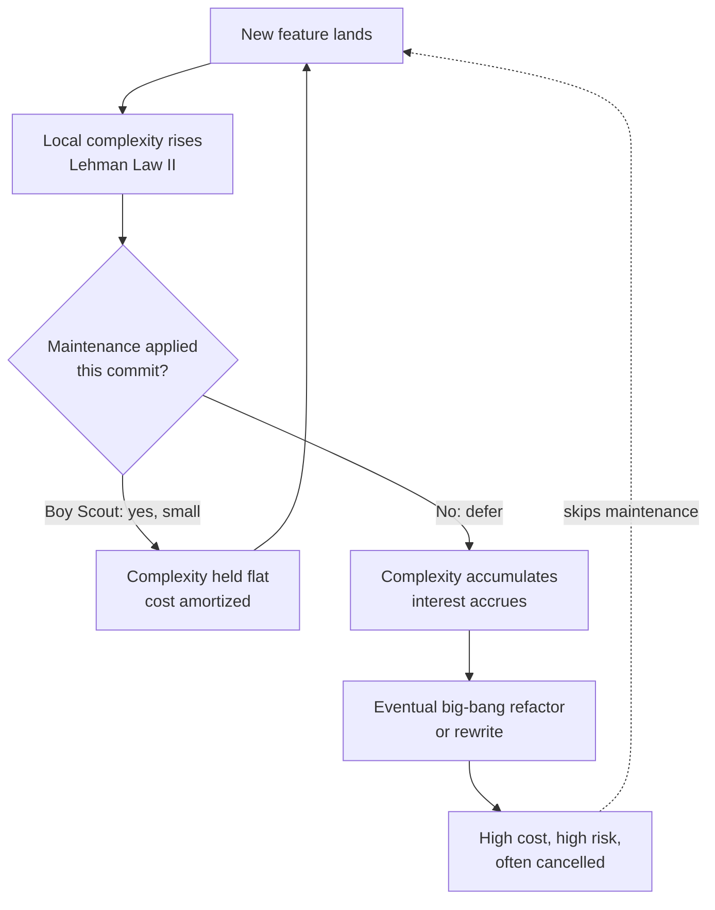
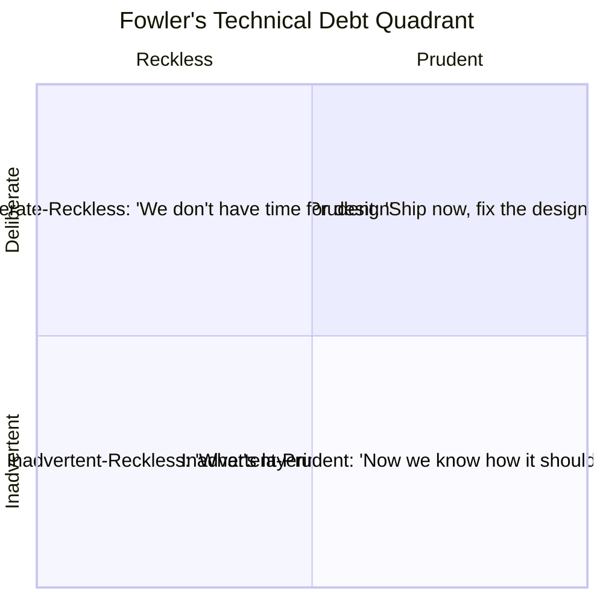
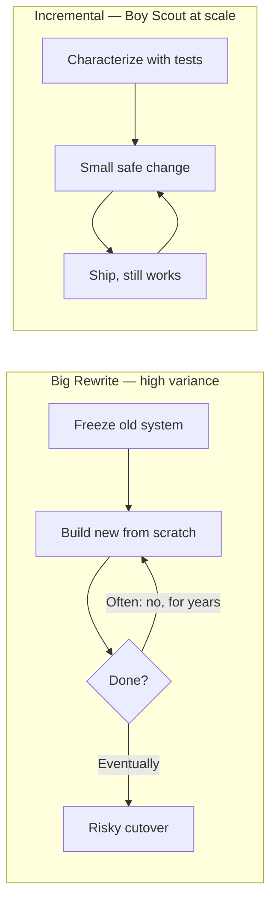
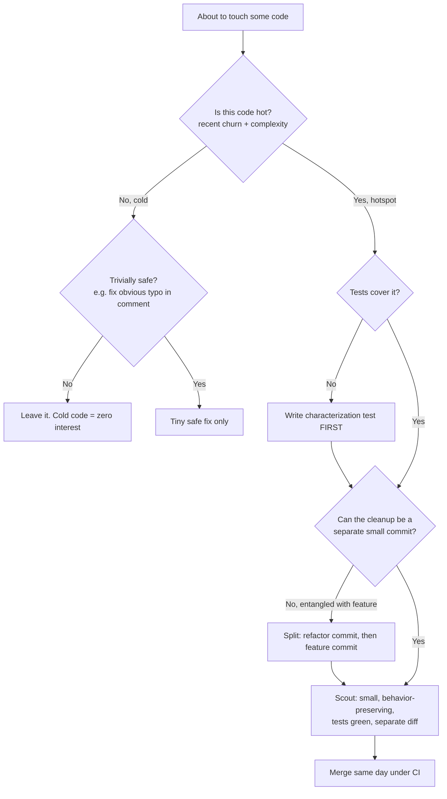

# Boy Scout Rule — Professional Level

> Focus: the economics of continuous cleanup. Software entropy and Lehman's laws; the "broken windows" theory and its empirical critique; technical debt as a *financial* instrument (Cunningham's original framing vs. its later misuse; Fowler's debt quadrant); when continuous cleanup is the *wrong* call (cold code, hotspot economics); rewrite-vs-refactor at scale; ownership incentives and the tragedy of the commons; how the rule interacts with trunk-based development and CI; and the risk that every cleanup is itself a defect injection.

---

## Table of Contents

1. [Restating the rule as an economic policy](#restating-the-rule-as-an-economic-policy)
2. [Software entropy: Lehman's laws](#software-entropy-lehmans-laws)
3. [Broken windows — theory and its empirical critique](#broken-windows--theory-and-its-empirical-critique)
4. [Technical debt: the financial metaphor, used correctly](#technical-debt-the-financial-metaphor-used-correctly)
5. [Fowler's debt quadrant and the boy-scout rule](#fowlers-debt-quadrant-and-the-boy-scout-rule)
6. [When continuous cleanup is the wrong call](#when-continuous-cleanup-is-the-wrong-call)
7. [Hotspot economics: where to point the rule](#hotspot-economics-where-to-point-the-rule)
8. [Rewrite vs. refactor at scale](#rewrite-vs-refactor-at-scale)
9. [Ownership, incentives, and the tragedy of the commons](#ownership-incentives-and-the-tragedy-of-the-commons)
10. [The rule under trunk-based development and CI](#the-rule-under-trunk-based-development-and-ci)
11. [Cleanup is a change — the defect-injection risk](#cleanup-is-a-change--the-defect-injection-risk)
12. [A decision procedure](#a-decision-procedure)
13. [Common Mistakes](#common-mistakes)
14. [Test Yourself](#test-yourself)
15. [Cheat Sheet](#cheat-sheet)
16. [Summary](#summary)
17. [Further Reading](#further-reading)
18. [Related Topics](#related-topics)

---

## Restating the rule as an economic policy

The Boy Scout Rule — *"Always leave the code cleaner than you found it"* — is usually attributed to Robert C. Martin, who adapted the Scout Law ("leave the campground cleaner than you found it") into a coding maxim in *Clean Code* (2008) and credits the framing to a 2009 essay. At junior and senior levels the rule reads as a discipline: make small, opportunistic improvements as you pass through code.

At the professional level the rule is not a discipline — it is an **investment policy under uncertainty**. Every cleanup spends a scarce resource (engineer attention, review bandwidth, regression risk) to buy a future return (lower maintenance cost on that code). A policy is good only if its expected return beats its expected cost, *weighted by the probability the code is touched again*. The naive reading — "always clean" — ignores that weighting and therefore loses money on code that will never be read again.

So the professional question is never "should I clean code?" but "**does this particular cleanup, on this particular code, with this churn profile, have positive expected value after accounting for regression risk?**" The rest of this document is the toolkit for answering that.

---

## Software entropy: Lehman's laws

The rule exists because code *decays*. The canonical formalization is Meir Lehman's **laws of software evolution** (Lehman 1980; refined with Belady in *Program Evolution*, 1985), derived from longitudinal study of IBM OS/360 releases. Three of the eight laws matter here:

- **I. Continuing Change** — A system used in a real environment must continually adapt, or it becomes progressively less satisfactory. Software is never "done"; the environment moves under it.
- **II. Increasing Complexity** — As a system evolves, its complexity *increases* unless work is explicitly done to reduce or maintain it. Entropy is the default; order is the exception that costs energy.
- **VII. Declining Quality** — A system's perceived quality declines unless it is rigorously maintained against a changing environment.

Law II is the precise justification for the Boy Scout Rule. Complexity does not stay flat for free; you pay to hold the line. The rule is the *distributed, continuous payment* of that maintenance cost, spread across every commit instead of deferred to a quarterly "refactoring sprint" (which, empirically, gets cut when deadlines loom).



The economic insight: Law II says the cost of *not* maintaining is not zero — it is deferred and compounding. The Boy Scout Rule converts a lumpy, deferrable, high-variance cost into a smooth, predictable, low-variance one. That is the same reason finance prefers dollar-cost averaging to market timing.

---

## Broken windows — theory and its empirical critique

The Boy Scout Rule is frequently justified by the **broken windows theory**, imported into software by Andrew Hunt and David Thomas in *The Pragmatic Programmer* (1999): "Don't live with broken windows. Fix each as soon as it's discovered." The argument is psychological — visible decay signals that nobody cares, which licenses further decay. One messy function invites the next.

A professional must know that this metaphor rests on **contested social science**. The original broken-windows theory (Wilson & Kelling, *The Atlantic*, 1982) claimed that visible disorder causes crime. Decades of replication attempts have been mixed at best:

- Harcourt & Ludwig (2006), re-analyzing the data behind New York's order-maintenance policing, found **no significant support** for the disorder-causes-crime mechanism once you control for confounders (mean reversion, broader crime decline).
- The criminological consensus today treats the causal claim as, at minimum, unproven and confounded.

What does this mean for code? Two honest conclusions:

1. **The mechanism is plausible but not proven for software.** There is real software-engineering evidence that code quality correlates with defect rates (e.g., complexity metrics predict bugs — Tornhill's hotspot research; the SonarQube/CodeScene body of work). But correlation between *messy code* and *more mess* via a *psychological contagion* channel is largely anecdotal. Be honest in arguments: cite the entropy/complexity-cost evidence (strong), not the disorder-contagion claim (weak).
2. **Use the durable part.** The defensible core is not "messiness spreads like crime" but "the marginal cost to fix a defect rises with the time since it was introduced" (Boehm's cost-of-change curve, *Software Engineering Economics*, 1981). That is a measured engineering result, not a sociological analogy. Anchor the rule there.

> **Professional move:** when defending the Boy Scout Rule to a skeptical eng manager, drop the broken-windows analogy and lead with Lehman's Law II + Boehm's cost-of-change curve. Both are empirical; the window metaphor is rhetorically pretty but evidentiarily soft.

---

## Technical debt: the financial metaphor, used correctly

Ward Cunningham coined "technical debt" in a 1992 OOPSLA experience report and clarified it on video in 2009. His original meaning is narrow and often misquoted:

> *"Shipping first-time code is like going into debt. A little debt speeds development so long as it is paid back promptly with a rewrite... The danger occurs when the debt is not repaid. Every minute spent on not-quite-right code counts as interest on that debt."* — Cunningham, 2009

Two things in the original framing that the popular usage corrupts:

1. **Cunningham's debt is about the gap between your code and your *current understanding* of the domain** — you ship, you learn, the code now lags your knowledge, you repay by aligning code to new understanding. It was **never** a synonym for "sloppy code" or "stuff we were too lazy to do right." Cunningham himself said: "I'm never in favor of writing code poorly, but I am in favor of writing code to reflect your current understanding of a problem even if that understanding is partial."
2. **The metaphor's power is in modeling *interest*.** Debt has a *principal* (the cost to fix the shortcut now) and *interest* (the recurring extra cost you pay on every interaction until you fix it). The Boy Scout Rule is a strategy for paying down principal *opportunistically*, financed by the fact that you are already paying the access cost (you have the file open, the context loaded).

| Financial term | Software analogue | Boy-Scout relevance |
|---|---|---|
| Principal | One-time cost to clean a piece of code | What a scout pays per commit |
| Interest | Recurring drag: slower edits, more bugs, more onboarding time | What you avoid by paying principal early |
| Interest rate | Churn frequency × complexity | High rate → clean now; low rate → leave it |
| Default / bankruptcy | Code so degraded that rewrite is cheaper than repair | What deferred cleanup eventually forces |

The misuse to guard against (Fowler, McConnell, and Cunningham have all complained about it): calling *every* imperfection "debt" to extract a "pay it down" budget from management. If there is no recurring interest — nobody touches the code, no edits are slowed — there is no debt. There is just code you don't like. The financial metaphor is precisely what tells you the difference.

---

## Fowler's debt quadrant and the boy-scout rule

Martin Fowler (*Technical Debt Quadrant*, 2009) split debt along two axes: **reckless ↔ prudent** and **deliberate ↔ inadvertent**.



How the Boy Scout Rule maps to each quadrant — this is the part professionals get wrong:

- **Deliberate-Prudent** (top-right): a recorded, time-boxed shortcut with a repayment plan. The scout rule is the *repayment mechanism* — you settle the debt the next time you pass through, while context is fresh. **Apply the rule.**
- **Inadvertent-Prudent** (bottom-right): Cunningham's actual debt — you only understood the right design *after* shipping. The scout rule is exactly how you realign code to new understanding incrementally. **Apply the rule — this is its home quadrant.**
- **Deliberate-Reckless** (top-left): "no time for design." This is a process failure, not a cleanup problem. Boy-scouting won't fix a team that systematically skips design; you'll be bailing with a teaspoon. **Fix the process; cleanup is a band-aid.**
- **Inadvertent-Reckless** (bottom-left): the team doesn't know what good looks like. Opportunistic cleanup by individuals who *do* know just creates inconsistency (half the codebase scout-cleaned, half not). **Invest in skill/standards first; uncoordinated boy-scouting amplifies inconsistency.**

> **Takeaway:** the Boy Scout Rule is a precision tool for the *prudent* (right-hand) quadrants. In the reckless quadrants it treats symptoms while the disease — broken process or absent skill — keeps generating debt faster than scouts can clean it.

---

## When continuous cleanup is the wrong call

The dogmatic reading ("always clean everything you touch") is economically wrong in several well-defined cases. A senior engineer who can articulate these is far more credible than one who recites the rule.

**1. Cold code — leave it alone.** If a file has not been modified in years and is unlikely to be modified again, its accumulated debt charges *zero interest* — nobody pays the recurring cost. Cleaning it spends principal to retire a zero-interest loan: pure loss, plus regression risk on code that currently works. Adam Tornhill's data (*Your Code as a Crime Scene*, 2015; *Software Design X-Rays*, 2018) shows maintenance cost concentrates in a small fraction of files; the vast cold majority is, economically, fine as-is.

**2. Code scheduled for deletion.** If a module is being decommissioned next quarter, cleaning it is negative-value by definition. Verify the roadmap before scouting.

**3. The diff-noise tax exceeds the cleanup value.** Reformatting an entire file to fix one function buries your one-line bug fix in 300 lines of whitespace churn, destroys `git blame`, and creates merge conflicts for everyone on that file. The cleanup's local value is real but the *coordination cost* it externalizes onto the team is larger. (See trunk-based section.)

**4. Hot, safety-critical code with thin tests.** In code where a regression is catastrophic (payment ledger, flight control) and test coverage is weak, the expected cost of an injected defect can dwarf any maintainability gain. Here the correct move is *write the characterization tests first*, then clean — or do not clean opportunistically at all.

**5. You don't understand it.** Cleaning code you don't fully understand is how you "tidy" a deliberate-looking hack that was actually load-bearing (a workaround for an OS bug, a deliberate non-obvious ordering). Chesterton's Fence: do not remove a fence until you know why it was put up.

> **The asymmetry that drives all five:** maintainability benefit accrues *only if the code is read/edited again*, but regression risk is incurred *now, unconditionally*. On low-churn code the benefit's probability is near zero while the risk's probability is fixed. Negative expected value.

---

## Hotspot economics: where to point the rule

If cleanup should be concentrated, *where*? The data-driven answer is **behavioral code analysis** — combine version-control history (where change actually happens) with complexity metrics (where change is expensive). The intersection is a **hotspot**: complex code that also changes frequently. This is Adam Tornhill's central contribution (CodeScene; *Software Design X-Rays*).

The model in economic terms:

| | Low complexity | High complexity |
|---|---|---|
| **Low churn (cold)** | Healthy — leave it | **Leave it alone** — zero interest, no ROI on cleanup |
| **High churn (hot)** | Healthy — protect it | **Hotspot — direct ALL scouting here**; highest interest rate |

The interest rate of a piece of debt is roughly **churn × complexity**. Cleanup ROI is highest exactly where both are high, because that is where the recurring interest payment is largest *and* most frequent. Tornhill's case studies repeatedly show that a tiny fraction of files (often <5%) accounts for the majority of development effort and defects — those are where boy-scouting pays.

How to find them, concretely:

```bash
# Churn: files changed most often in the last year (a crude hotspot proxy)
git log --since="1 year ago" --name-only --pretty=format: \
  | sed '/^$/d' | sort | uniq -c | sort -rn | head -30
```

Cross-reference that churn list against a complexity report (`gocyclo`/`golangci-lint` for Go, `radon cc` for Python, PMD/SonarQube cognitive-complexity for Java). Files high on *both* lists are your scouting targets. Files high on complexity but low on churn are the "leave the cold code alone" set — resist the urge.

> **Professional reframe of the rule:** *"Always leave hot code cleaner than you found it; leave cold code exactly as you found it."* The unqualified version wastes effort and adds risk on the 95% of the codebase that does not matter.

---

## Rewrite vs. refactor at scale

When debt is severe, the Boy Scout Rule's incremental philosophy collides with the seductive alternative: the **big rewrite**. The professional default is *refactor incrementally*, and the literature is unusually unanimous about why.

**Spolsky's argument.** Joel Spolsky, *Things You Should Never Do, Part I* (2000), on Netscape's rewrite of its browser: throwing out the codebase discards the *accumulated bug fixes* — each ugly conditional is "a bug fix... a bit of knowledge, hard-won." A rewrite restarts the entropy clock at zero but also restarts the knowledge clock at zero; you will rediscover, in production, every edge case the old code silently handled. Netscape spent three years rewriting and ceded the market to IE in the interval.

**Brooks's second-system effect.** Fred Brooks, *The Mythical Man-Month* (1975, ch. 5): the second system an architect designs is the most dangerous, because it accretes all the features deferred from the first ("this time I'll do it right"). Rewrites are second systems almost by definition — they are over-engineered, late, and frequently never ship.

**The refactor case.** Michael Feathers (*Working Effectively with Legacy Code*, 2004) and Fowler (*Refactoring*, 2nd ed., 2018) show the alternative: wrap legacy in characterization tests, then strangle it incrementally (Fowler's **Strangler Fig** pattern). Behavior is preserved at every step; you can stop at any commit and still ship. This is the Boy Scout Rule scaled up — many small, safe, reversible improvements rather than one giant irreversible bet.



**When is rewrite the right call?** Rarely, but it exists: when the platform/language is dead (no hiring, no security patches), when the original problem domain has fundamentally changed, or when the system is small enough that a rewrite is bounded and de-riskable. The test: can you *strangle* it instead? If yes, strangle. The bias should be heavily toward incremental — boy-scouting is the steady state, rewrite is the emergency.

---

## Ownership, incentives, and the tragedy of the commons

The Boy Scout Rule has a free-rider problem rooted in **collective code ownership**. Shared code is a commons (Hardin, 1968): everyone benefits from its cleanliness, but the engineer who cleans pays the full cost (time, review, regression risk) while the benefit diffuses across the whole team. Rational individuals therefore *under-invest* — each reasons "someone else will clean it; I have a deadline." The commons degrades.

This is why the rule cannot survive on virtue alone; it needs **incentive alignment**:

- **Make it part of the definition of done**, not optional. If "tidy the code you touched" is a checklist item gating merge, the cost is no longer discretionary — it is baked into the task estimate. (This directly addresses the README anti-pattern "treating cleanup as optional.")
- **Reward it in review and promotion.** If only feature throughput is measured, scouting is a tax an engineer pays personally for a benefit they don't capture. Teams that value maintainability must *see* and credit cleanup in code review and performance signals.
- **Soft ownership beats both extremes.** Pure individual ownership ("only Priya touches the billing module") kills boy-scouting by outsiders and bottlenecks on one person. Pure anonymous collective ownership invites the free-rider problem. Most high-functioning teams use *soft ownership* (a primary maintainer who reviews, plus a norm that anyone may improve) — this preserves the right to scout while keeping someone accountable for coherence.
- **CODEOWNERS as an incentive structure**, not just routing. Mapping files to owning teams makes the interest on a hotspot *visible to the team that pays it*, which is what makes them willing to fund cleanup.

> The Boy Scout Rule is, at bottom, a solution to a commons problem. It only works when the team's incentive system makes the cleaner whole — otherwise you are asking individuals to subsidize a public good, and economics predicts they won't.

---

## The rule under trunk-based development and CI

Modern delivery (trunk-based development, continuous integration; DORA's *Accelerate* — Forsgren, Humble, Kim, 2018) constrains *how* you scout. The interaction is non-obvious and is where the README's "mixed-concern PR" and "drive-by refactoring" anti-patterns become concrete failures.

**The core tension: small diffs vs. opportunistic cleanup.** Trunk-based dev demands small, frequent, independently reviewable merges. Boy-scouting *adds* changes to a diff that was about something else. Unmanaged, this produces the "review sandbagging" anti-pattern: a 12-line feature buried in 400 lines of reformatting, where the reviewer can no longer see the actual behavior change and rubber-stamps it.

The professional discipline — **separate the refactor commit from the behavior change**:

- **Two commits, or two PRs.** Fowler's "two hats": you are either adding behavior or refactoring, never both in the same commit. A reviewer can verify a pure-refactor PR by confirming *tests are unchanged and still pass* (behavior preserved), and verify the feature PR in isolation. This is the resolution to mixed-concern PRs.
- **Refactor first, then feature** ("preparatory refactoring", Fowler / Kent Beck: *"Make the change easy, then make the easy change"*). Land the cleanup that makes your feature trivial as a separate, reviewable step, then land the now-trivial feature.
- **CI is the safety net that makes scouting affordable.** The reason you *can* clean opportunistically is that a fast, trustworthy test suite catches the regression in minutes. Without CI, every scout edit is an unbounded risk and the rule becomes irresponsible. DORA's research ties high deploy frequency + low change-failure rate precisely to this kind of automated verification — it is what lets teams make many small changes safely.
- **Beware long-lived cleanup branches.** A "big cleanup" branch that lives for weeks accumulates merge conflicts against a moving trunk — the opposite of trunk-based dev. Scout in small increments that merge same-day, or don't.

> **Rule of thumb:** if your cleanup cannot be reviewed independently of your feature, it is too big for a boy-scout pass. Split it, or schedule it as its own task.

---

## Cleanup is a change — the defect-injection risk

The uncomfortable truth professionals must internalize: **every cleanup is a code change, and every code change has a nonzero probability of introducing a defect.** The Boy Scout Rule, applied without discipline, is a defect-injection engine that happens to also improve readability.

The risk model:

- Let *p* be the probability a given edit injects a bug, *C_bug* its expected cost, and *B* the maintainability benefit of the cleanup discounted by the probability the code is touched again. Scout only when **B > p · C_bug**. On cold code, *B* → 0, so *any* nonzero *p* makes the trade negative — which is the formal restatement of "leave the cold code alone."
- *p* is not constant. It collapses toward zero under two conditions: (1) the change is **behavior-preserving and verified by tests**, and (2) the change is **small** (small diffs are easier to review correctly — review effectiveness drops sharply past a few hundred lines, per code-review research and SmartBear/Cisco's classic study).

This yields the two non-negotiable preconditions for safe scouting:

1. **Tests must exist (or you write a characterization test first).** Refactoring without tests is not refactoring — it is *editing and hoping*. Feathers's entire *Working Effectively with Legacy Code* is the procedure for getting untested code under test *before* you touch it. This directly answers the README anti-pattern "cleanup commits without tests — silent behavior changes slip through."
2. **Keep the diff small.** A small, focused cleanup is reviewable, revertible, and bisectable. If a bug surfaces, `git bisect` lands on a 10-line commit, not a 400-line "tidied the module" blob. Small diffs are *risk control*, not just etiquette.

> **The synthesis:** the Boy Scout Rule is only economically sound when paired with (a) hotspot targeting — so *B* is large, (b) tests — so *p* is small, and (c) small diffs — so *p* is small *and* a regression is cheap to find and revert. Strip away any one and the rule starts losing money.

---

## A decision procedure

A reusable, defensible procedure for "should I scout this code right now?":



---

## Common Mistakes

- **Reciting "always clean everything."** The unqualified rule loses money on cold code and adds risk for no return. Professionals qualify it with churn.
- **Justifying the rule with broken-windows.** The sociological claim is empirically contested. Lead with Lehman's Law II and Boehm's cost-of-change curve instead.
- **Calling every imperfection "technical debt."** If there's no recurring interest (no churn, no slowed edits), it isn't debt — it's just code you don't like. Cunningham's metaphor is a measuring tool, not a budget-extraction slogan.
- **Mixed-concern PRs.** Bundling cleanup with a feature defeats review. Separate the refactor commit from the behavior change (two hats).
- **Scouting without tests.** Refactoring untested code is editing and hoping. Characterize first.
- **Big-bang rewrite disguised as cleanup.** "I'll just rewrite this module" is the second-system effect waiting to happen. Strangle incrementally.
- **Reformatting the whole file to fix one line.** Externalizes merge-conflict and blame-destruction costs onto the team that dwarf the local benefit.
- **Cleaning code you don't understand.** Chesterton's Fence: the ugly conditional may be a load-bearing bug fix.
- **Long-lived cleanup branches.** They rot against a moving trunk. Scout in same-day increments.
- **Expecting virtue to sustain the rule.** Shared code is a commons; without incentive alignment (definition of done, review credit), engineers rationally under-invest.

---

## Test Yourself

**1. A teammate's PR reformats an entire 800-line legacy file to fix a one-line null check, "applying the Boy Scout Rule." The file hasn't been edited in 3 years. Critique this.**

<details><summary>Answer</summary>

Two independent problems. (1) Cold code: 3 years of no edits means the debt charges near-zero interest; the maintainability benefit is discounted by a tiny probability of future edits, so expected value is negative once you account for regression risk. "Leave the cold code alone" (Tornhill). (2) Diff noise: 800 lines of reformatting around a 1-line fix is a mixed-concern PR that destroys reviewability, wrecks `git blame`, and creates merge conflicts. The correct move: the 1-line fix in a tiny diff; the reformat (if ever) as a separate, deliberately scheduled commit — but on cold code, probably not at all.

</details>

**2. Distinguish Cunningham's original "technical debt" from the way most teams use the term.**

<details><summary>Answer</summary>

Cunningham (1992/2009) meant the gap between code and your *current understanding* of the domain — you ship to learn, then repay by realigning code to new knowledge. It was explicitly *not* "sloppy code we were too lazy to write well." Most teams misuse it as a synonym for any imperfection or shortcut. The diagnostic that recovers the real meaning: debt has *interest* — a recurring cost paid on every interaction. No churn, no slowed edits → no interest → not debt, just disliked code.

</details>

**3. Why is the broken-windows justification for the Boy Scout Rule weak, and what should you cite instead?**

<details><summary>Answer</summary>

The broken-windows theory (Wilson & Kelling 1982) is contested criminology — Harcourt & Ludwig (2006) and others found no robust support for disorder *causing* further disorder once confounders are controlled. Importing it to code assumes a psychological-contagion mechanism that is anecdotal in software. Cite instead: Lehman's Law II (complexity rises unless work is spent to hold it) and Boehm's cost-of-change curve (defect-fix cost rises with time since introduction). Both are empirical engineering results.

</details>

**4. A staff engineer proposes rewriting a 200k-LOC legacy monolith from scratch in a new language "to clear the debt." Argue the professional default.**

<details><summary>Answer</summary>

Default is *no*. Spolsky: a rewrite discards thousands of hard-won, undocumented bug fixes encoded in the "ugly" code; you'll rediscover every edge case in production. Brooks: the rewrite is a textbook second system — over-scoped, late, often never ships. Alternative: Strangler Fig (Fowler) — wrap in characterization tests, incrementally route functionality to new code behind a facade, ship at every step, stop anytime. Rewrite is justified only when the platform is dead (no patches/hiring) or the system is small enough to bound and de-risk. The test: can you strangle it? If yes, strangle.

</details>

**5. Your team practices trunk-based development. How does that constrain opportunistic cleanup, and how do you reconcile them?**

<details><summary>Answer</summary>

Trunk-based dev demands small, independently reviewable, same-day merges; opportunistic cleanup tends to bloat a diff that was about something else, producing mixed-concern PRs and review sandbagging. Reconcile via the "two hats": separate the pure-refactor commit/PR (verified by *unchanged tests still passing* = behavior preserved) from the behavior change. Prefer preparatory refactoring ("make the change easy, then make the easy change"). CI is the enabler — fast trustworthy tests are what make small frequent scout edits safe. Avoid long-lived cleanup branches; they rot against the trunk.

</details>

**6. Formalize "leave the cold code alone" as an expected-value inequality.**

<details><summary>Answer</summary>

Scout only when **B > p · C_bug**, where *B* is the maintainability benefit *discounted by the probability the code is read/edited again*, *p* is the probability the edit injects a defect, and *C_bug* is the expected cost of that defect. On cold code the future-touch probability → 0, so *B* → 0, making *any* nonzero *p* produce negative expected value. The same inequality shows why tests (shrink *p*), small diffs (shrink *p* and *C_bug* via easy bisect/revert), and hotspot targeting (raise *B*) are the three preconditions for the rule to pay.

</details>

**7. The Boy Scout Rule depends on individuals cleaning shared code. What economic failure mode threatens it, and what are the fixes?**

<details><summary>Answer</summary>

Tragedy of the commons / free-rider problem: the cleaner pays the full cost (time, review, regression risk) while the benefit diffuses across the team, so rational individuals under-invest. Fixes are incentive alignment, not exhortation: make cleanup part of the definition of done (cost baked into estimates, not discretionary); credit it in review and promotion; use soft ownership (a primary maintainer plus a norm that anyone may improve) and CODEOWNERS so the team that pays the interest sees it. Virtue alone doesn't sustain a public good.

</details>

**8. Map the Boy Scout Rule onto Fowler's debt quadrant. In which quadrants does it actually help?**

<details><summary>Answer</summary>

It is a precision tool for the *prudent* (right-hand) quadrants. Inadvertent-Prudent ("now we know how it should've been done") is its home — exactly Cunningham's realign-to-new-understanding case. Deliberate-Prudent (recorded, planned shortcut) — it's the repayment mechanism. In the *reckless* quadrants it only treats symptoms: Deliberate-Reckless is a broken process, Inadvertent-Reckless is missing skill/standards — both generate debt faster than uncoordinated scouting can clean, and ad-hoc cleanup there just adds inconsistency. Fix process/skill first.

</details>

---

## Cheat Sheet

| Question | Professional answer |
|---|---|
| Why does code decay? | Lehman's Law II: complexity rises unless work is spent to hold it |
| Best empirical justification for the rule? | Law II + Boehm's cost-of-change curve (not broken windows) |
| Is "technical debt" any imperfection? | No — only if it charges *interest* (recurring cost). Cunningham's real meaning: code lagging current understanding |
| Where to point scouting? | Hotspots: high churn × high complexity (Tornhill). Interest rate ≈ churn × complexity |
| When NOT to clean? | Cold code, code slated for deletion, code you don't understand, when diff-noise tax > benefit, weak tests on critical paths |
| Rewrite or refactor? | Refactor / Strangler Fig by default. Rewrite risks second-system effect (Brooks) and lost bug-knowledge (Spolsky) |
| Scout + trunk-based dev? | Two hats: separate refactor commit from feature; preparatory refactoring; same-day small merges; CI as safety net |
| Two non-negotiables before scouting? | Tests cover it (characterize first if not) + small diff |
| EV rule | Scout only when B > p · C_bug |
| Why does the rule need incentives? | Shared code is a commons; without alignment, rational individuals free-ride |

---

## Summary

At the professional level the Boy Scout Rule is an **investment policy**, not a moral injunction. Its justification is empirical — Lehman's Law II (complexity rises without maintenance work) and Boehm's cost-of-change curve — *not* the rhetorically attractive but empirically contested broken-windows analogy. Cunningham's technical-debt metaphor supplies the decision criterion: clean where the debt charges real *interest* (high churn × complexity hotspots, per Tornhill), and **leave the cold code alone**, where benefit is near-zero but regression risk is unconditional. Fowler's quadrant shows the rule belongs in the *prudent* quadrants and treats only symptoms in the reckless ones.

At scale, the incremental philosophy of the rule beats the big rewrite for the reasons Brooks (second-system effect) and Spolsky (lost bug-knowledge) gave; the Strangler Fig is boy-scouting writ large. The rule survives in practice only when three conditions hold: **hotspot targeting** (so benefit is large), **tests** (so defect probability is small — Feathers), and **small, separated diffs** (so review is effective and regressions are cheap to revert — the trunk-based, two-hats discipline). And because shared code is a commons, the rule needs **incentive alignment** — definition-of-done, review credit, soft ownership — or rational engineers will free-ride and the codebase will decay exactly as Lehman predicted.

---

## Further Reading

- Robert C. Martin, *Clean Code* (2008) — the chapter that coined the coding form of the rule.
- Meir M. Lehman & László Belády, *Program Evolution: Processes of Software Change* (1985) — the laws of software evolution.
- Ward Cunningham, "The WyCash Portfolio Management System" (OOPSLA 1992) and the 2009 "Debt Metaphor" video — the original technical-debt framing.
- Martin Fowler, "Technical Debt Quadrant" (2009) and *Refactoring*, 2nd ed. (2018) — the quadrant, preparatory refactoring, two hats.
- Adam Tornhill, *Software Design X-Rays* (2018) and *Your Code as a Crime Scene* (2015) — hotspot economics, behavioral code analysis.
- Joel Spolsky, "Things You Should Never Do, Part I" (2000) — the case against rewrites.
- Frederick P. Brooks, *The Mythical Man-Month* (1975) — the second-system effect.
- Michael Feathers, *Working Effectively with Legacy Code* (2004) — characterization tests; touching untested code safely.
- Barry Boehm, *Software Engineering Economics* (1981) — the cost-of-change curve.
- Hunt & Thomas, *The Pragmatic Programmer* (1999) — the broken-windows import (read alongside its critique).
- Harcourt & Ludwig, "Broken Windows: New Evidence from New York City..." (*Journal of Legal Studies*, 2006) — the empirical critique.
- Forsgren, Humble & Kim, *Accelerate* (2018) — DORA metrics; CI as the enabler of safe, frequent change.

---

## Related Topics

- [senior.md](senior.md) — the engineering practice: preparatory refactoring, two hats, scoping a scout pass.
- [interview.md](interview.md) — Q&A across all levels for interview prep.
- [Chapter README](../README.md) — the positive rules and anti-patterns for this chapter.
- [Emergence](../10-emergence/README.md) — how continuous small cleanup lets good design emerge rather than be imposed.
- [Cognitive Load](../20-cognitive-load/README.md) — what the cleanup is *for*: keeping working code within human working-memory limits.
- [Refactoring](../../refactoring/README.md) — the mechanics (Strangler Fig, characterization tests, behavior-preserving transformations) that make scouting safe.
