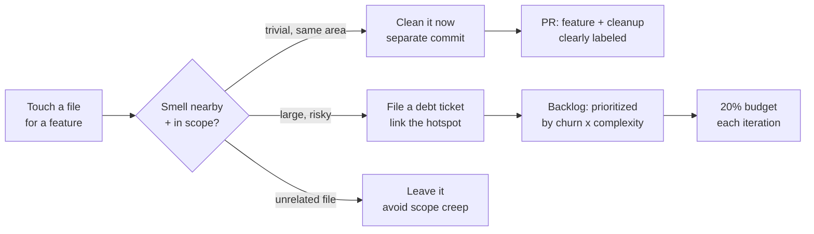
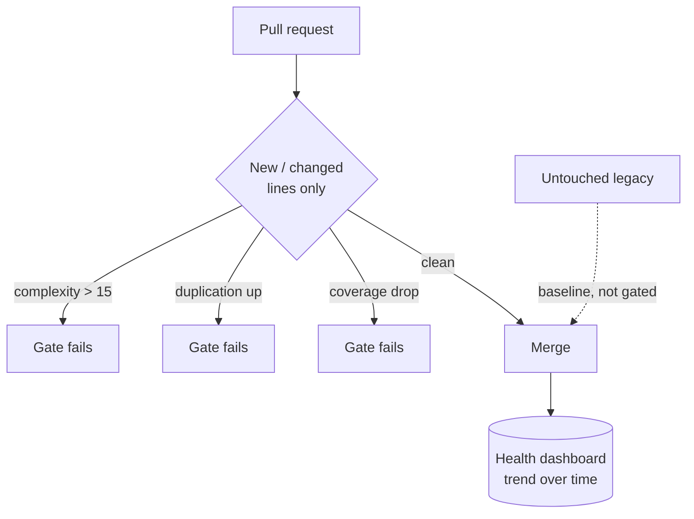

# Boy Scout Rule — Senior Level

> Focus: turning "leave it cleaner than you found it" from a personal habit into a **team operating model** — debt strategy, incremental modernization of legacy at scale, review culture, blame hygiene, and measuring code-health trends instead of guessing.

---

## Table of Contents

1. [From personal habit to team policy](#from-personal-habit-to-team-policy)
2. [Technical-debt strategy: the debt quadrant](#technical-debt-strategy-the-debt-quadrant)
3. [Tracked debt vs. opportunistic cleanup](#tracked-debt-vs-opportunistic-cleanup)
4. [The boy-scout budget (the 20% rule)](#the-boy-scout-budget-the-20-rule)
5. [Hotspot analysis: clean where it pays](#hotspot-analysis-clean-where-it-pays)
6. [Measuring code-health trends](#measuring-code-health-trends)
7. [Incremental modernization of legacy at scale](#incremental-modernization-of-legacy-at-scale)
8. [Avoiding the big-rewrite trap](#avoiding-the-big-rewrite-trap)
9. [Making cleanup safe at scale](#making-cleanup-safe-at-scale)
10. [Blame hygiene: .git-blame-ignore-revs](#blame-hygiene-git-blame-ignore-revs)
11. [Preventing debt accrual](#preventing-debt-accrual)
12. [Common Mistakes](#common-mistakes)
13. [Test Yourself](#test-yourself)
14. [Cheat Sheet](#cheat-sheet)
15. [Summary](#summary)
16. [Further Reading](#further-reading)
17. [Related Topics](#related-topics)

---

## From personal habit to team policy

At junior scale the Boy Scout Rule is an individual virtue: you fix the typo, rename the unclear variable, delete the dead branch next to your change. At team scale that same impulse becomes a **liability if it's not governed** — uncoordinated cleanups bloat diffs, churn ownership, and break other people's in-flight branches.

A senior engineer's job is to make continuous improvement *systemic*: a default behavior the team performs without negotiating it every time, bounded by rules that keep it cheap and safe. Three forces have to be balanced:

| Force | Untended failure mode | Senior lever |
|---|---|---|
| **Improvement** | Code rots; every change gets more expensive | Definition of done includes leave-it-cleaner |
| **Velocity** | Cleanup crowds out features; nothing ships | A bounded budget (the 20% rule) |
| **Coordination** | Drive-by refactors break branches and blame | Separate-commit discipline + blame-ignore |

The rule scales by being *small and continuous*. The moment cleanup becomes a quarterly "refactoring sprint," you've already lost — debt has been allowed to accrue to the point where it needs a project, and projects get cut.



---

## Technical-debt strategy: the debt quadrant

The Boy Scout Rule is one tactic inside a broader **debt strategy**. Martin Fowler's **technical-debt quadrant** classifies debt along two axes — *reckless vs. prudent* and *deliberate vs. inadvertent*:

|  | **Deliberate** | **Inadvertent** |
|---|---|---|
| **Reckless** | "We don't have time for design." | "What's layering?" |
| **Prudent** | "Ship now, deal with consequences — and we know what they are." | "Now we know how we should have done it." |

The quadrant changes *how you respond*, not just whether you respond:

- **Prudent-deliberate** debt is a financing decision. Track it, attach an interest estimate ("every feature in this module now costs ~30% more"), and pay it down when the interest exceeds the principal.
- **Prudent-inadvertent** debt is the most common kind in healthy teams — you learned something. This is the *natural target of the Boy Scout Rule*: clean it opportunistically as you re-enter the code.
- **Reckless** debt (either flavor) is a process problem, not a code problem. The fix is review standards and a definition of done, not a cleanup ticket.

The senior insight: **opportunistic cleanup (Boy Scout) and tracked debt (tickets) are complementary, not competing.** Small, low-risk, in-the-flow improvements go straight into the PR. Large, cross-cutting, risky improvements become tickets so they can be scheduled, tested, and reviewed deliberately. Confusing the two is where teams go wrong — either by smuggling a risky refactor into a feature PR, or by filing a Jira ticket for a one-line rename that will never get prioritized.

---

## Tracked debt vs. opportunistic cleanup

A decision rule the team can apply in seconds:

| Signal | Clean now (opportunistic) | Track as ticket (deliberate) |
|---|---|---|
| **Blast radius** | The file(s) you already touch | Spans modules / services |
| **Risk** | Behavior-preserving, covered by tests | Could change behavior; needs new tests |
| **Time** | Minutes | Hours to days |
| **Review cost** | Reviewer can verify by reading the diff | Needs its own design discussion |
| **Reversibility** | Trivially revertable | Coordinated rollout / migration |

> **Rule of thumb:** if you can't honestly label the cleanup commit in one line *and* a reviewer can verify it's behavior-preserving from the diff alone, it's too big to be a drive-by. Promote it to a ticket.

The anti-pattern this kills: the **mixed-concern PR** that bundles a feature with 40 unrelated cleanups ("review sandbagging"). Reviewers can't separate the load-bearing change from the noise, so they rubber-stamp it — and a real bug rides in on the cleanup. Keep cleanup in *separate commits within the PR* at minimum, and in *separate PRs* when the cleanup is more than a few lines.

---

## The boy-scout budget (the 20% rule)

"Leave it cleaner" with no bound is unfundable — product pressure always wins, and engineers either stop cleaning or clean recklessly. The fix is to **make the budget explicit**.

Common formulations:

- **The 20% rule** — a standing allocation (often ~20% of each iteration's capacity) for debt paydown and cleanup, defended like any other commitment. Google's well-known "20% time" is a cultural cousin; here it's specifically for code health.
- **The boy-scout tax** — every feature estimate includes the cost of leaving the touched area cleaner. Cleanup isn't a separate line item; it's baked into "done."
- **One-improvement-per-PR** — a soft norm: every PR that touches old code carries at least one small improvement to it. Cheap, continuous, and self-limiting because it's scoped to what you already touched.

A budget does three things a vague exhortation cannot: it gives engineers *permission* to clean (so they don't feel they're stealing time), it gives product managers a *predictable cost* (so cleanup isn't a surprise), and it creates *accountability* (an iteration with zero cleanup is a visible anomaly, not the silent default).

> **Watch for budget theater:** a 20% allocation that's the first thing cut every sprint is worse than none — it trains the team that cleanup is negotiable. If you can't defend it, make it smaller but inviolable.

---

## Hotspot analysis: clean where it pays

Cleanup effort is finite. Spreading it evenly across the codebase wastes it on code that never changes. **Hotspot analysis** — popularized by Adam Tornhill (*Your Code as a Crime Scene*, *Software Design X-Rays*) and his tool **CodeScene** — targets the intersection of two signals:

> **Refactor where `change frequency (churn) × complexity` is highest.**

A 3,000-line class that hasn't changed in two years is *dormant* — refactoring it is pure cost with no return. A 400-line class edited every week is a *hotspot* — every defect, every onboarding cost, every slow feature flows through it. That's where the Boy Scout Rule should be aimed.

You don't need a commercial tool to start. Git already has the churn data:

```bash
# Files changed most often in the last year (churn signal)
git log --since="1 year ago" --name-only --pretty=format: \
  | grep -E '\.(go|java|py)$' \
  | sort | uniq -c | sort -rn | head -30
```

Cross-reference that list against complexity (lines, cognitive complexity from your linter). The files appearing in *both* the high-churn list and the high-complexity list are your cleanup targets — in priority order. This turns "leave it cleaner than you found it" into "you will naturally re-enter the hotspots most often, so clean *those* every time."

Tools that operationalize this: **CodeScene** (churn × complexity, plus "knowledge maps" showing bus-factor risk), **SonarQube** (complexity + duplication trends), and **Code Climate** (maintainability + churn). The metric matters more than the vendor.

---

## Measuring code-health trends

Cleanup that isn't measured regresses to zero the moment attention shifts. A senior makes code health **visible and trended**, not a one-time audit. The point is the *slope*, not the absolute number — a codebase improving from a bad baseline is healthier than one decaying from a good one.

| Metric | What it catches | Tooling |
|---|---|---|
| **Cognitive complexity** (trend) | Methods getting harder to read | SonarQube, golangci-lint `gocognit`, ruff `C901` |
| **Duplication %** (trend) | Copy-paste accrual | SonarQube, PMD CPD, `jscpd` |
| **Hotspot count** | Churn × complexity concentration | CodeScene |
| **Coverage on changed lines** | Cleanup landing without tests | Codecov / SonarQube "new code" |
| **Lint violations on new code** | Debt accrual rate | SonarQube quality gate, baseline mode |

The most useful gate is the **ratchet** — quality measured on *new and changed code only*:

- New code must meet full standards (coverage, complexity, no new duplication).
- Legacy code is held at a **baseline**; the build fails only on *new* violations or changes to existing violation lines.
- The baseline shrinks naturally as hotspots are touched (boy-scouted) over time.

SonarQube calls this "Clean as You Code"; `golangci-lint --new-from-rev`, ESLint baselines, and ruff baselines implement the same idea. It encodes the Boy Scout Rule directly into CI: **you can't make changed code worse, and you're nudged to make it better.**



---

## Incremental modernization of legacy at scale

The Boy Scout Rule's large-scale expression is **incremental modernization**: replacing or restructuring legacy without a stop-the-world rewrite. The dominant pattern is the **Strangler Fig** (Martin Fowler), named after the vine that grows around a host tree and gradually replaces it.

The shape:

1. Put a **facade / routing layer** in front of the legacy system (an API gateway, a reverse proxy, an interface, or a feature-flagged dispatch).
2. Implement one slice of behavior in the new code.
3. Route that slice's traffic to the new implementation; everything else still hits legacy.
4. Repeat slice by slice. The new system "strangles" the old until the legacy code is dead and deletable.

```go
// Strangler facade: route per-feature to new or legacy, flip incrementally.
type OrderService interface {
    Place(ctx context.Context, o Order) (Receipt, error)
}

type StranglerOrders struct {
    legacy OrderService
    modern OrderService
    flags  FlagStore
}

func (s StranglerOrders) Place(ctx context.Context, o Order) (Receipt, error) {
    if s.flags.Enabled(ctx, "orders.modern", o.TenantID) {
        return s.modern.Place(ctx, o) // new path, per-tenant rollout
    }
    return s.legacy.Place(ctx, o) // untouched until the slice is proven
}
```

Related incremental patterns:

- **Branch by Abstraction** — introduce an interface over the thing being replaced, build the new implementation behind it, switch via flag, then delete the old one. Best when the change is in-process and you want a kill-switch (days-to-weeks scope).
- **Parallel run / shadowing** — send production traffic to *both* implementations, compare outputs, alert on divergence, but only return the legacy result until confidence is high. GitHub's **Scientist** library (and ports like `scientist4j`, Python `laboratory`) does exactly this.
- **Expand–contract (parallel change)** — for schema/API migrations: add the new shape (expand), migrate readers/writers, then remove the old shape (contract). Never a breaking change in a single step.

```python
# Shadow / parallel-run: trust legacy, measure the candidate, never block on it.
def get_price(item, *, legacy, candidate, metrics):
    result = legacy(item)
    try:
        shadow = candidate(item)
        if shadow != result:
            metrics.increment("price.mismatch", tags={"item": item.sku})
    except Exception:
        metrics.increment("price.candidate_error")
    return result  # callers always get the proven path
```

> **Senior judgment:** modernize **least-coupled slices first**. Extracting the most-entangled subdomain first creates a chatty distributed dependency that's worse than the monolith you started with.

---

## Avoiding the big-rewrite trap

The opposite of the Boy Scout Rule is the **big rewrite** — "this code is hopeless, let's start fresh." Joel Spolsky's *Things You Should Never Do, Part I* (2000) is the canonical warning: Netscape rewrote its browser from scratch and handed the market to Microsoft during the years it spent rebuilding.

The reason rewrites fail is structural, not motivational:

- **The ugly code encodes hard-won knowledge.** Every weird conditional is a bug fix, an edge case, a regulatory rule someone learned the hard way. A rewrite throws away that *embedded behavior* and re-learns every lesson — usually as production incidents.
- **You ship nothing for months while competitors ship continuously.** The business runs on two stacks at once, paying for both.
- **The new system inherits the old constraints anyway** the moment it has to interoperate or match exact behavior.

| Favors incremental (strangler) | Favors rewrite |
|---|---|
| System is in active use and changing | Frozen, soon-to-be-decommissioned |
| Behavior is mostly correct | Business logic itself is wrong |
| Tests exist or can be added | No tests and no way to characterize behavior |
| Team holds domain knowledge | Knowledge is genuinely lost *and* documented requirements exist |
| Tech stack is current/maintained | Stack is truly dead (unsupported runtime, no security patches) |

In nearly all cases the answer is **incremental modernization, financed by the Boy Scout Rule and the debt budget** — not a rewrite. The strangler fig *is* the safe way to "rewrite": you replace the system leaf by leaf, in production, with a working product the entire time.

---

## Making cleanup safe at scale

Opportunistic cleanup is only safe if it's **provably behavior-preserving**. The failure mode the chapter warns about — *cleanup commits without tests, silent behavior changes slip through* — is the single fastest way to get the Boy Scout Rule banned by a burned team. Safety mechanisms, in order of preference:

1. **Existing tests first.** If the area you're cleaning has good coverage, a passing suite is your license to refactor.
2. **Characterization tests** for untested legacy. Capture current behavior (record real inputs/outputs, or golden-master snapshots) so the tests pass *by construction*, then refactor inside that net. These document *what is*, not *what should be* — replace them with intent tests once the area is clean.
3. **Automated, mechanical refactors.** Prefer tool-driven transforms over hand edits — IDE rename/extract, `gofmt`/`gopls` rename, Java IDE refactorings, Python `libcst`/Bowler codemods. They're behavior-preserving by tooling guarantee and reviewable at a glance.
4. **Feature flags / dark launches** for cleanup that touches runtime paths, so a regression is a flag flip away from rollback.
5. **Incremental migration** (expand–contract, branch by abstraction) for anything crossing a module or service boundary.

```java
// Characterization (golden master) test: lock in current behavior before refactoring.
@ParameterizedTest
@MethodSource("recordedProductionInputs")
void preservesLegacyBehavior(PricingRequest in) {
    // 'expected' was captured by replaying real traffic through the OLD code.
    PricingResult expected = GoldenMaster.load(in);
    PricingResult actual = pricingEngine.evaluate(in);
    assertThat(actual).isEqualTo(expected); // any drift = a behavior change, caught
}
```

> A cleanup PR with no test backing and no mechanical-refactor guarantee should not merge. "It's just a rename" is exactly how a `Money` field silently starts rounding differently.

---

## Blame hygiene: .git-blame-ignore-revs

The strongest objection to large mechanical cleanups (reformatting, mass renames, import reordering) is that they **destroy `git blame`** — every line now points at the cleanup commit instead of the author who wrote the logic. This makes engineers *avoid* cleanup to preserve archaeology.

Git solves this. A `.git-blame-ignore-revs` file lists pure-formatting/cleanup commit SHAs that `git blame` should *see through*:

```bash
# .git-blame-ignore-revs  (one commit SHA per line; comments allowed)
# Repo-wide gofmt + import grouping, no behavior change
9c4b8a1f2e6d7c3b5a09f8e1d2c3b4a5f6e7d8c9
# Apply Black + isort across the Python tree
1a2b3c4d5e6f70819a2b3c4d5e6f70819a2b3c4d
```

Wire it up so it's automatic for everyone:

```bash
git config blame.ignoreRevsFile .git-blame-ignore-revs
```

GitHub, GitLab, and the `git blame` CLI all honor this file, attributing each line to the *meaningful* author behind the cosmetic commit. The discipline that makes it work:

- **Pure-cleanup commits must be pure** — no logic change mixed in, or blame-skip hides a real edit.
- **Add the SHA to the file in the same PR** (or immediately after) so the noise never pollutes history.

This single mechanism removes the most common excuse for *not* boy-scouting at scale: "it'll wreck the blame."

---

## Preventing debt accrual

Cleaning is downstream of *not making the mess*. A senior invests more in prevention than in remediation:

- **Definition of Done includes leave-it-cleaner.** "Done" isn't "the feature works"; it's "the feature works *and* the touched code is at least as clean as before, with tests on changed lines." Make it a checklist item, not a hope.
- **Review culture that rewards small cleanups.** If reviewers nitpick a one-line rename in a cleanup commit but wave through a 600-line god method, you've inverted the incentives. Senior reviewers *praise* in-scope cleanups and *flag* out-of-scope scope creep — both reinforce the rule. (See [code reviews](../17-code-reviews/README.md).)
- **The ratchet in CI** (new-code quality gate) so debt can't accrue faster than it's paid.
- **Pre-commit hooks** for the mechanical baseline (`gofmt`, `goimports`, Black, isort, Prettier) so formatting drift never enters history and never shows up in a diff.
- **Make the cost visible.** Surface per-PR complexity/coverage deltas so "just one more conditional" is a number the author and reviewer both see.

The goal is a system where the *default path* leaves code cleaner — not one that depends on every engineer remembering to be virtuous under deadline pressure.

---

## Common Mistakes

- **Smuggling risky refactors into feature PRs.** Mixed-concern diffs hide bugs and exhaust reviewers. Separate the commits; promote anything non-trivial to its own PR or ticket.
- **Cleanup without tests.** Behavior-preserving means *proven* behavior-preserving. No tests, no mechanical guarantee, no merge.
- **Over-eager scope creep.** "Leave it cleaner" means the area you touched, not a tour of the whole module. Touching unrelated files balloons review cost and merge conflicts.
- **Filing tickets for one-line cleanups.** They'll never be prioritized. Trivial in-scope improvements belong in the current PR, not the backlog.
- **Doing it inline with logic, then wrecking blame.** Mass reformatting mixed with edits destroys history *and* hides changes. Pure-cleanup commits + `.git-blame-ignore-revs`.
- **Budget theater.** A 20% allocation that's always the first sprint cut trains the team that cleanup is optional. Smaller-but-inviolable beats large-but-ignored.
- **Refactoring dormant code.** Effort spent on code that never changes returns nothing. Aim cleanup at churn × complexity hotspots.
- **Choosing a rewrite over incremental modernization.** The rewrite re-learns every embedded lesson as a production incident. Strangle, don't rewrite.

---

## Test Yourself

**1. A teammate's feature PR includes the feature, plus reformatting of 12 unrelated files, plus a "small" change to a shared validation helper. What's your review feedback?**

<details><summary>Answer</summary>

Split it. The feature is fine. The reformatting of *unrelated* files is scope creep — it should be its own pure-cleanup PR (and its SHA added to `.git-blame-ignore-revs`). The change to the shared validation helper is the dangerous part: it's a behavior-affecting change riding on a "cleanup," and a mixed-concern diff is exactly where such a change escapes scrutiny. Ask for it as a separate, test-backed commit/PR so its blast radius is reviewed deliberately. The principle: opportunistic cleanup must stay *in-scope and behavior-preserving*; anything else is tracked debt, not a drive-by.
</details>

**2. Leadership asks you to choose between a 6-month rewrite of a crufty but working billing service and "just cleaning it up over time." How do you frame the decision?**

<details><summary>Answer</summary>

Frame it with the rewrite-vs-incremental criteria and Spolsky's argument. The service is *in active use, mostly correct, and the domain knowledge is encoded in the very cruft you'd throw away* — every weird branch is a billing edge case learned in production. A rewrite re-learns all of that as customer-facing incidents and ships nothing for 6 months while you pay for two systems. Propose the strangler fig: route slices of billing to a new implementation behind feature flags, run new and legacy in parallel (shadow/compare outputs) until each slice is proven, then delete the legacy slice. Fund the work via the debt budget. You get continuous delivery, a kill-switch, and no big-bang risk — the safe way to "rewrite."
</details>

**3. Your team agrees on the Boy Scout Rule, but `git blame` on the core modules is now useless because of cleanup commits, and engineers have started *avoiding* cleanup to preserve history. Fix it.**

<details><summary>Answer</summary>

Introduce `.git-blame-ignore-revs`. Put the SHAs of pure-formatting/mass-rename commits in that file, set `git config blame.ignoreRevsFile .git-blame-ignore-revs`, and rely on GitHub/GitLab honoring it so blame sees through the cosmetic commits to the real authors. The enabling discipline: cleanup commits must be *pure* (no logic mixed in) and the SHA must be added in the same PR. Once blame is preserved, the strongest excuse for avoiding mechanical cleanup disappears.
</details>

**4. Your new-code quality gate is green every sprint, yet senior engineers complain the codebase keeps getting harder to work in. What's likely happening, and what do you measure?**

<details><summary>Answer</summary>

A new-code gate only protects *changed* lines; it says nothing about the *aggregate trend* or about hotspots being repeatedly patched without ever being restructured (each patch is "clean" in isolation while the file's overall complexity climbs). Add trend dashboards — cognitive complexity, duplication %, and especially **hotspot (churn × complexity)** trend over time. If a hotspot's complexity keeps rising despite every individual PR passing, that file needs a tracked, test-backed refactor (a ticket), not more opportunistic patching. The gate prevents *new* debt; the trend tells you where *existing* debt is compounding.
</details>

**5. A manager wants to cut the 20% cleanup budget for "one sprint" to hit a deadline. How do you respond, and what's the risk if it becomes a habit?**

<details><summary>Answer</summary>

One genuinely exceptional sprint with an explicit pay-back plan is a reasonable prudent-deliberate decision — borrow against code health, and record it. The risk is *budget theater*: if "just this sprint" becomes the default, the team learns cleanup is always negotiable, debt compounds, and velocity quietly drops until features that took days take weeks. The senior move is to make the trade-off visible (this borrows X, here's the interest), keep the budget inviolable in normal sprints, and prefer a permanently smaller-but-protected allocation over a large one that's the first casualty of every deadline.
</details>

---

## Cheat Sheet

| Situation | Move |
|---|---|
| Trivial smell next to your change | Clean it now, separate commit, same PR |
| Large/risky improvement | File a tracked debt ticket; don't drive-by |
| Choosing what to clean | Aim at churn × complexity hotspots, not dormant code |
| Legacy with no tests | Characterization / golden-master tests before refactoring |
| Mass reformat or rename | Pure commit + add SHA to `.git-blame-ignore-revs` |
| Replacing a live system | Strangler fig + feature flags + shadow run — never big-bang rewrite |
| Schema/API migration | Expand → migrate → contract (parallel change) |
| Stopping debt accrual | Definition of done = leave-it-cleaner; new-code quality gate (ratchet) |
| Funding cleanup | Explicit, inviolable budget (~20%) — not "if there's time" |
| Reviewing a mixed-concern PR | Ask for feature and cleanup to be separated |

**Debt quadrant (Fowler):** reckless ↔ prudent × deliberate ↔ inadvertent. Boy-scout the *prudent-inadvertent* corner; ticket the rest.

---

## Summary

The Boy Scout Rule scales from "I'll fix the typo" to a team operating model only when it's **governed**. The senior responsibilities:

- **Strategy over impulse.** Classify debt with Fowler's quadrant; clean prudent-inadvertent debt opportunistically, track the rest as deliberate tickets.
- **Bound the work.** An explicit, defended budget (the 20% rule, the boy-scout tax) makes cleanup fundable and accountable instead of negotiable.
- **Aim it.** Hotspot analysis (churn × complexity, via CodeScene/Git data) spends finite effort where it actually pays.
- **Measure the slope.** Trend complexity, duplication, and hotspots; enforce a new-code ratchet so debt can't accrue faster than it's paid.
- **Modernize incrementally.** Strangler fig, branch by abstraction, parallel run, and expand–contract replace legacy leaf by leaf — never the big rewrite Spolsky warns against.
- **Make it safe.** Characterization tests, mechanical refactors, feature flags, and `.git-blame-ignore-revs` remove the two biggest objections: "it'll break something" and "it'll wreck blame."
- **Prevent the mess.** Definition of done includes leaving-it-cleaner; a review culture that rewards small, in-scope cleanups keeps the default path clean.

Continuous, small, measured, and safe beats heroic, large, and risky — every time.

---

## Further Reading

- Martin Fowler — *TechnicalDebtQuadrant* and *TechnicalDebt* (martinfowler.com)
- Martin Fowler — *StranglerFigApplication* and *BranchByAbstraction* (martinfowler.com)
- Martin Fowler — *ParallelChange* (expand–contract migration)
- Adam Tornhill — *Software Design X-Rays* and *Your Code as a Crime Scene* (hotspot analysis)
- Joel Spolsky — *Things You Should Never Do, Part I* (the big-rewrite trap), 2000
- Robert C. Martin — *Clean Code*, the Boy Scout Rule (the source of the chapter)
- Michael Feathers — *Working Effectively with Legacy Code* (characterization tests)
- GitHub — *Scientist* library and the *.git-blame-ignore-revs* documentation
- SonarSource — *Clean as You Code* methodology and quality gates

---

## Related Topics

- [junior.md](junior.md) — the rule as a personal habit: fix the small thing next to your change
- [middle.md](middle.md) — applying it across a feature: scoping, separate commits, when to stop
- [professional.md](professional.md) — org-wide code-health programs and platform-level enablement
- [Chapter README](../README.md) — the positive rules of continuous improvement
- [Emergence](../10-emergence/README.md) — incremental design that the Boy Scout Rule sustains
- [Code Reviews](../17-code-reviews/README.md) — the review culture that rewards small, in-scope cleanups
- [Refactoring](../../refactoring/README.md) — the behavior-preserving techniques cleanup relies on
- [Anti-Patterns](../../anti-patterns/README.md) — the messes the rule is meant to prevent and erode
