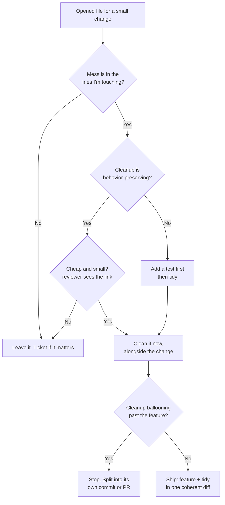

# Boy Scout Rule — Practice Tasks

> 12 hands-on exercises. Every task drops you into a real situation: **you opened this file for a small feature or fix, and the code around your change is a little messy.** Your job is to leave the campground cleaner than you found it — *without* turning a 10-line change into a 300-line refactor PR. Each task gives you the actual work item, the messy code you pass through, an instruction, and a full solution that shows the *small safe* cleanup alongside the feature, what to **leave alone** (and why), and the reasoning. Languages vary (Go / Java / Python). Difficulty climbs from easy to hard, and at least one task's correct answer is **"don't clean this — ticket it."**

---

## Table of Contents

1. [Task 1 — Rename a confusing variable next to your change (Python)](#task-1--rename-a-confusing-variable-next-to-your-change-python) · *Easy*
2. [Task 2 — Delete adjacent dead code (Go)](#task-2--delete-adjacent-dead-code-go) · *Easy*
3. [Task 3 — Tidy imports and format only the lines you touched (Python)](#task-3--tidy-imports-and-format-only-the-lines-you-touched-python) · *Easy*
4. [Task 4 — Extract a tiny helper you're about to call twice (Java)](#task-4--extract-a-tiny-helper-youre-about-to-call-twice-java) · *Easy*
5. [Task 5 — Add a missing test for your change's neighborhood (Go)](#task-5--add-a-missing-test-for-your-changes-neighborhood-go) · *Medium*
6. [Task 6 — Split the cleanup into its own commit (Python)](#task-6--split-the-cleanup-into-its-own-commit-python) · *Medium*
7. [Task 7 — Replace a magic number you're already editing (Java)](#task-7--replace-a-magic-number-youre-already-editing-java) · *Medium*
8. [Task 8 — Recognize over-reach and STOP: should you clean this? (Go)](#task-8--recognize-over-reach-and-stop-should-you-clean-this-go) · *Medium*
9. [Task 9 — Characterization test before a risky tidy (Python)](#task-9--characterization-test-before-a-risky-tidy-python) · *Hard*
10. [Task 10 — Tidy a confusing conditional inside the block you edit (Java)](#task-10--tidy-a-confusing-conditional-inside-the-block-you-edit-java) · *Hard*
11. [Task 11 — Resist the rewrite; do the boring incremental cleanup (Go)](#task-11--resist-the-rewrite-do-the-boring-incremental-cleanup-go) · *Hard*
12. [Task 12 — Boy-Scout audit of a real PR diff (open-ended)](#task-12--boy-scout-audit-of-a-real-pr-diff-open-ended) · *Hard*

---

## How to Use

- Read the **work item** first. The cleanup is always *secondary* to shipping the feature/fix. If the feature breaks because of your cleanup, you failed the rule.
- For each task, before opening the solution, write down two lists: **clean now** (cheap, safe, in your blast radius) and **leave / ticket** (out of scope, risky, or large).
- The test for "in scope" is blunt: *would a reviewer reading your diff understand why this line changed from the work item alone?* If not, it's scope creep — split it out or ticket it.
- Default to keeping cleanups **behavior-preserving**. Anything that can change runtime behavior needs a test first (Tasks 5, 9).
- One commit should tell one story. When in doubt, see [Task 6](#task-6--split-the-cleanup-into-its-own-commit-python).

The decision flow every task exercises:



---

## Task 1 — Rename a confusing variable next to your change (Python)

**Difficulty:** Easy

**Work item:** *"Add a 5% surcharge for express shipping."* The change is one line. But right above it sits a variable named `x` that you now have to read to make your edit.

```python
def shipping_cost(order):
    x = order.weight_kg * 2.5          # base rate per kg
    if order.region == "remote":
        x = x + 15
    return x

# Your one-line feature: express adds 5%.
```

**Instruction:** Ship the express surcharge. While you're reading this function to make the change, fix the one thing that actively slowed you down. Decide what *not* to touch.

<details><summary>Solution</summary>

Rename `x` → `cost`. You had to decode `x` just to place your new line correctly, so the rename is squarely in your blast radius and it's purely mechanical (rename-symbol, zero behavior change).

```python
def shipping_cost(order):
    cost = order.weight_kg * 2.5       # base rate per kg
    if order.region == "remote":
        cost += 15
    if order.express:                  # <-- the actual feature
        cost *= 1.05
    return cost
```

**What I cleaned:** `x` → `cost`, and `x = x + 15` → `cost += 15` (the augmented-assignment tidy rides along because that exact line was already being rewritten by the rename).

**What I left alone — and why:**
- The magic numbers `2.5` and `15` are *not* in my way. Pulling them into named constants is a separate, defensible change, but the reviewer of "add express surcharge" wouldn't expect it. Leave it. (If it nags, ticket it.)
- I did **not** rename `order` or restructure the `if`. The rename I did was forced by my reading of the code; these are not.

**Reasoning:** The cheapest, safest Boy-Scout cleanup is a local rename of a name you were *forced to understand anyway*. It carries no behavioral risk and makes the very diff you're shipping more readable. That is the rule in its purest form.

</details>

---

## Task 2 — Delete adjacent dead code (Go)

**Difficulty:** Easy

**Work item:** *"Log the user's plan tier when they hit the paywall."* You're editing `checkAccess`. Right next to it is a helper that nothing calls anymore.

```go
package access

import "log"

func checkAccess(u User, feature string) bool {
	if u.IsAdmin {
		return true
	}
	return u.Plan.Allows(feature)
}

// legacyGate was replaced by Plan.Allows in #4821 but never removed.
func legacyGate(u User, feature string) bool {
	for _, f := range u.GrantedFeatures {
		if f == feature {
			return true
		}
	}
	return false
}
```

**Instruction:** Add the log line for the paywall. Then handle the dead helper sitting next to your change — but only if you can prove it's safe.

<details><summary>Solution</summary>

First, confirm `legacyGate` is truly dead. Run a usage search across the module:

```bash
# Go: the compiler also helps — an unexported, unused func is reported by `go vet`/staticcheck.
grep -rn "legacyGate" .          # expect: only the definition
staticcheck ./...                # flags unused unexported funcs
```

If the only hit is the definition itself, delete it. Then add the feature.

```go
package access

import "log"

func checkAccess(u User, feature string) bool {
	if u.IsAdmin {
		return true
	}
	allowed := u.Plan.Allows(feature)
	if !allowed {
		log.Printf("paywall hit: user=%s plan=%s feature=%s", u.ID, u.Plan.Tier, feature)
	}
	return allowed
}
```

**What I cleaned:** Removed `legacyGate` entirely (the comment even told us it was orphaned in #4821).

**What I left alone — and why:**
- I did not go hunting for *other* dead functions in the package. The Boy-Scout boundary is the campground I'm standing in — this file's `checkAccess` neighborhood — not the whole repo.
- I kept `u.Plan.Allows` as-is; refactoring it is out of scope.

**Reasoning:** Dead code adjacent to your edit is high-value, low-risk to remove *once you've proven it's unreferenced*. Unexported Go funcs make this provable cheaply (grep + staticcheck). Deleting it shrinks the surface the next reader has to understand. The discipline is in *proving* it's dead, not assuming it — and in not turning a paywall log into a repo-wide dead-code sweep.

</details>

---

## Task 3 — Tidy imports and format only the lines you touched (Python)

**Difficulty:** Easy

**Work item:** *"Parse the `created_at` field as a timezone-aware datetime."* You add two lines. The file's imports are a mess and the indentation is inconsistent across the whole module.

```python
import json,os
from datetime import datetime
import sys
from datetime import timezone   # duplicate datetime import line

def load_record(path):
    data=json.loads(open(path).read())
    record = {
        "id": data["id"],
            "name": data["name"],      # over-indented (pre-existing)
        "tags": data.get("tags", []),
    }
    return record
```

**Instruction:** Add timezone-aware parsing of `created_at`. Clean formatting/imports **only where your change lives** — do not reformat the whole file.

<details><summary>Solution</summary>

```python
import json
import os
import sys
from datetime import datetime, timezone


def load_record(path):
    data = json.loads(open(path).read())
    record = {
        "id": data["id"],
        "name": data["name"],
        "tags": data.get("tags", []),
        "created_at": datetime.fromisoformat(data["created_at"]).astimezone(timezone.utc),
    }
    return record
```

**What I cleaned:**
- Consolidated the two `datetime` import lines into `from datetime import datetime, timezone` — I had to add `timezone` for the feature, so I was editing the imports anyway.
- Fixed the over-indented `"name"` line: it sits *inside the dict literal I just appended to*, so it's in my blast radius and the diff already touches this block.
- Split `import json,os` and added a blank line because my editor's formatter (Black/isort) touched those exact import lines when I added `timezone`.

**What I left alone — and why:**
- `data=json.loads(...)` has no spaces around `=`, and so do other lines elsewhere in the file. I did **not** chase formatting fixes outside the dict literal and import block I touched. A whole-file `black .` would balloon the diff and bury the one-line feature under noise — that's review sandbagging.
- The `open(path).read()` resource leak is a real bug, but it's *not* what this ticket is about and fixing it changes behavior under errors. Ticket it separately.

**Reasoning:** Format/import tidies are only "free" inside the hunk you're already changing. The moment a formatter would rewrite lines unrelated to your work, you've crossed into scope creep that makes review harder, not easier. The test: *does `git diff` still read as "added timezone parsing"?* If a reviewer has to scroll past 40 reformatted lines to find your two, you over-reached.

</details>

---

## Task 4 — Extract a tiny helper you're about to call twice (Java)

**Difficulty:** Easy

**Work item:** *"Trim and lowercase the email on signup too (we already do it on login)."* You're adding the same normalization you see on login.

```java
class AuthService {
    User login(String email, String password) {
        String e = email.trim().toLowerCase();   // normalize
        User u = repo.findByEmail(e);
        return verify(u, password) ? u : null;
    }

    User signup(String email, String password) {
        // TODO: normalize email here too
        if (repo.findByEmail(email) != null) {
            throw new IllegalStateException("email exists");
        }
        return repo.save(new User(email, hash(password)));
    }
}
```

**Instruction:** Add normalization to `signup`. Notice you're now writing the *same* `trim().toLowerCase()` expression a second time. Make the right small cleanup.

<details><summary>Solution</summary>

Extract a one-line helper. You're about to create the second call site, which is exactly when extraction earns its keep (rule of three is generous; two identical normalizations of a *security-relevant* key is enough).

```java
class AuthService {
    private static String normalizeEmail(String email) {
        return email.trim().toLowerCase();
    }

    User login(String email, String password) {
        User u = repo.findByEmail(normalizeEmail(email));
        return verify(u, password) ? u : null;
    }

    User signup(String email, String password) {
        String e = normalizeEmail(email);
        if (repo.findByEmail(e) != null) {
            throw new IllegalStateException("email exists");
        }
        return repo.save(new User(e, hash(password)));
    }
}
```

**What I cleaned:** Extracted `normalizeEmail`, then used it in both `login` (the existing call) and `signup` (the feature). Touching `login`'s normalization line is justified: it's the duplication my feature creates, and routing it through the helper guarantees the two paths can't drift apart.

**What I left alone — and why:**
- I did not redesign `User`, `repo`, or introduce an `Email` value object. A value object is the *right* long-term fix, but it ripples through every caller and constructor — far beyond "normalize on signup." Ticket it.
- I left `verify`, `hash`, and the exception type untouched.

**Reasoning:** Extracting a helper *at the moment you'd otherwise duplicate it* is textbook Boy-Scout: the change is forced by your feature, it removes a real consistency hazard (login and signup normalizing differently is a login-fails bug waiting to happen), and it stays tiny. The restraint is recognizing where the *bigger* right answer (a type) is, and deliberately not doing it now.

</details>

---

## Task 5 — Add a missing test for your change's neighborhood (Go)

**Difficulty:** Medium

**Work item:** *"Fix: discount should never make the price negative."* There's a one-line clamp to add. The function has **no tests at all**.

```go
package pricing

func FinalPrice(base, discount int) int {
	return base - discount
	// bug: if discount > base, this goes negative
}
```

**Instruction:** Ship the clamp. Leave the neighborhood safer by adding the test that *should have caught this bug* — but keep the test scope tight to the function you touched.

<details><summary>Solution</summary>

Add the fix and a focused table test covering the behavior you just changed plus the obvious boundaries.

```go
package pricing

func FinalPrice(base, discount int) int {
	final := base - discount
	if final < 0 {
		return 0
	}
	return final
}
```

```go
package pricing

import "testing"

func TestFinalPrice(t *testing.T) {
	cases := []struct {
		name             string
		base, discount   int
		want             int
	}{
		{"normal discount", 100, 30, 70},
		{"no discount", 100, 0, 100},
		{"discount equals base", 100, 100, 0},
		{"discount exceeds base is clamped", 100, 150, 0}, // the bug this PR fixes
	}
	for _, c := range cases {
		if got := FinalPrice(c.base, c.discount); got != c.want {
			t.Errorf("%s: FinalPrice(%d, %d) = %d, want %d",
				c.name, c.base, c.discount, got, c.want)
		}
	}
}
```

**What I cleaned:** Added the first test for `FinalPrice`, anchored on the exact regression I'm fixing (`discount exceeds base`) plus the natural boundaries.

**What I left alone — and why:**
- I did not write tests for *other* untested functions in the `pricing` package. The Boy-Scout neighborhood is the function I changed; a package-wide test campaign is its own initiative — ticket it.
- I did not add negative-`base` or overflow cases. They're plausible but not what this fix addresses, and inventing requirements ("what *should* a negative base do?") is design work, not cleanup. Note it in the ticket.

**Reasoning:** The cleanest way to "leave it cleaner" around a bug fix is to leave behind the test that pins the fix in place — future refactors can't silently reintroduce the negative price. Keeping the test scoped to the changed function (not the whole package) keeps the diff honest and the test fast. See [unit-testing patterns](../../refactoring/README.md) discussions on scoping tests to the unit under change.

</details>

---

## Task 6 — Split the cleanup into its own commit (Python)

**Difficulty:** Medium

**Work item:** *"Add retry (3 attempts) to the webhook sender."* While implementing it you also (correctly) rename `d` → `payload`, fix a misleading docstring, and pull a magic timeout into a constant. All good cleanups — but now your single commit mixes feature and tidy.

```python
def send(d, url):
    """Sends the data."""        # docstring says nothing useful
    resp = requests.post(url, json=d, timeout=5)
    resp.raise_for_status()
    return resp
```

**Instruction:** You've decided all the cleanups are in scope (you touched these lines for the retry). The problem is *commit hygiene*, not scope. Structure the work so review is easy.

<details><summary>Solution</summary>

Make **two commits on the same branch**: one pure-tidy (no behavior change), one feature. Stage them separately.

**Commit 1 — `refactor: clarify send() — rename d→payload, real docstring, named timeout`** (behavior-preserving):

```python
WEBHOOK_TIMEOUT_SECONDS = 5

def send(payload, url):
    """POST `payload` as JSON to `url`; raise on non-2xx."""
    resp = requests.post(url, json=payload, timeout=WEBHOOK_TIMEOUT_SECONDS)
    resp.raise_for_status()
    return resp
```

**Commit 2 — `feat: retry webhook send up to 3 times on transient failure`**:

```python
WEBHOOK_TIMEOUT_SECONDS = 5
MAX_ATTEMPTS = 3

def send(payload, url):
    """POST `payload` as JSON to `url`; retry transient failures, raise on final failure."""
    last_exc = None
    for attempt in range(MAX_ATTEMPTS):
        try:
            resp = requests.post(url, json=payload, timeout=WEBHOOK_TIMEOUT_SECONDS)
            resp.raise_for_status()
            return resp
        except requests.RequestException as exc:
            last_exc = exc
    raise last_exc
```

Staging them apart:

```bash
git add -p          # stage only the rename/docstring/constant hunks first
git commit -m "refactor: clarify send() — rename d→payload, real docstring, named timeout"
git add -p          # now stage the retry loop
git commit -m "feat: retry webhook send up to 3 times on transient failure"
```

**What I did:** Kept all the cleanups (they were legitimately in my blast radius) but separated them from the feature so each commit tells one story. A reviewer can verify the refactor commit changed *nothing* observable, then focus their attention on the retry logic.

**What I left alone — and why:**
- I did not bundle the cleanup into the feature commit. A mixed "feat + 4 tidies" diff hides the risky part (retry/exception handling) inside cosmetic noise — that's how real behavior changes slip past review.
- I did not push the cleanup to a *separate PR* here; same-PR-separate-commits is enough for changes this small and this entangled. (For larger, unrelated cleanups, a separate PR is better — see Task 8.)

**Reasoning:** Scope and commit hygiene are different axes. These cleanups *were* in scope; the failure mode would be smushing them into one opaque commit. "Leave it cleaner" includes leaving a **reviewable history**: behavior-preserving tidy isolated from behavior-changing feature.

</details>

---

## Task 7 — Replace a magic number you're already editing (Java)

**Difficulty:** Medium

**Work item:** *"Raise the password minimum from 8 to 12 characters."* The `8` is a bare literal in a condition you must edit.

```java
class PasswordPolicy {
    boolean isValid(String pw) {
        if (pw == null) return false;
        if (pw.length() < 8) return false;
        if (!pw.matches(".*[A-Z].*")) return false;
        if (!pw.matches(".*[0-9].*")) return false;
        return true;
    }
}
```

**Instruction:** Change the minimum to 12. Since you're rewriting that exact line, make the constant self-documenting. Decide whether the regex checks are also yours to clean.

<details><summary>Solution</summary>

```java
class PasswordPolicy {
    private static final int MIN_LENGTH = 12;

    boolean isValid(String pw) {
        if (pw == null) return false;
        if (pw.length() < MIN_LENGTH) return false;
        if (!pw.matches(".*[A-Z].*")) return false;
        if (!pw.matches(".*[0-9].*")) return false;
        return true;
    }
}
```

**What I cleaned:** Promoted the bare `8` to a named `MIN_LENGTH = 12` constant. The line was being rewritten anyway, and naming it documents the *intent* (a length policy) rather than a mystery integer — the next person changing the policy will find it immediately.

**What I left alone — and why:**
- The two `matches(...)` regexes are recompiled on every call (a minor inefficiency) and could be pulled into `static final Pattern` fields. But that's an optimization unrelated to the length bump — touching those lines would make my "raise minimum to 12" diff include changes to the uppercase/digit checks, confusing the reviewer. Ticket it under "precompile password regexes."
- I did not add a "special character required" rule. That's a *policy decision*, not a cleanup, and not mine to make in a length-bump ticket.

**Reasoning:** Replacing a magic number is the right Boy-Scout move *precisely because you're already editing that line* — the cost is one constant and the benefit is durable readability. The trap is letting "I'm in the password file" justify touching every imperfect line in it. Stay on the line your ticket put you on.

</details>

---

## Task 8 — Recognize over-reach and STOP: should you clean this? (Go)

**Difficulty:** Medium

**Work item:** *"Add a `X-Request-ID` header to outgoing API calls."* It's a two-line change in `doRequest`. But the file also contains a 200-line `parseResponse` function that is genuinely awful: nested switches, duplicated error handling, a 30-line `if/else` ladder. It offends you. You have time today.

```go
func (c *Client) doRequest(req *http.Request) (*http.Response, error) {
	// <-- add X-Request-ID here
	return c.http.Do(req)
}

func parseResponse(resp *http.Response) (Result, error) {
	// 200 lines of nested switches, duplicated decode/error blocks,
	// a giant if/else ladder over status codes... a real mess.
	...
}
```

**Instruction:** Ship the header. Then make the *correct* call on `parseResponse`. The right answer here is the hard one.

<details><summary>Solution</summary>

Do the feature. **Do not** refactor `parseResponse`.

```go
func (c *Client) doRequest(req *http.Request) (*http.Response, error) {
	req.Header.Set("X-Request-ID", uuid.NewString())
	return c.http.Do(req)
}
// parseResponse: untouched.
```

Instead, file a ticket:

```
TICKET: Refactor parseResponse (Client) — high complexity, duplicated decode/error handling

parseResponse is ~200 lines: nested switches over status code + content type,
duplicated decode-and-wrap-error blocks, a 30-line if/else ladder. Hard to modify
safely. Proposal: table-driven status handling + a single decode helper. Needs
characterization tests first (no current coverage). Est. 1–2 days. Not coupled to
any feature — schedule on its own.
```

**Why this is the right answer — STOP:**
- **It's outside your blast radius.** Your ticket touches `doRequest`. `parseResponse` is in the same *file* but not the same *change*. "Same file" is not "same campground" when the messy region is a self-contained 200-line beast you weren't going to read.
- **It's not cheap or safe.** A 200-line function with *no tests* cannot be refactored safely as a drive-by. Doing it would mean either (a) refactoring blind — risking a behavior change in response parsing, which affects every API call — or (b) writing characterization tests first, which is itself a 1–2 day effort. Either way it dwarfs the two-line feature.
- **It wrecks the PR.** Reviewers asked to approve "add request ID header" would suddenly face a 200-line rewrite of critical parsing logic. They can't review both well in one sitting. The feature gets delayed by the refactor's risk, or the refactor gets rubber-stamped because it's bundled with a trivial feature. Both outcomes are bad.

**The discipline:** "Leave it cleaner" is bounded by "without changing scope or adding risk." A mess this big, this risky, and this far from your change is not litter you pick up on the way out — it's a project. Ticket it so it actually gets scheduled (and tested), instead of pretending a code review is the place to land a 1–2 day refactor.

**Reasoning:** The Boy-Scout rule is frequently *over*-applied. The skill that separates seniors from eager juniors is knowing when the campground-cleaning instinct is leading you into scope creep. Big, risky, untested, out-of-blast-radius messes get *tickets*, not drive-by heroics.

</details>

---

## Task 9 — Characterization test before a risky tidy (Python)

**Difficulty:** Hard

**Work item:** *"Add support for the `application/x-ndjson` content type."* To do it you must edit `parse_body`, whose logic you find confusing and want to simplify as you go. But it has no tests and the existing branching is subtle — simplifying it blind is risky.

```python
def parse_body(content_type, raw):
    if content_type and "json" in content_type:
        if raw.strip() == "":
            return {}
        return json.loads(raw)
    elif content_type == "application/x-www-form-urlencoded":
        return dict(urllib.parse.parse_qsl(raw))
    else:
        return {"raw": raw}
```

Notice the subtlety: `"json" in content_type` matches `application/json`, `text/json`, *and* `application/x-ndjson` (because `"json"` is a substring) — but ndjson is **not** valid single-object JSON, so the current code would `json.loads` it and crash. You want to special-case ndjson, and ideally clean the muddy `"json" in content_type` check.

**Instruction:** Pin down current behavior with characterization tests *before* you touch the logic, then make your change and a safe tidy on top of that safety net.

<details><summary>Solution</summary>

**Step 1 — Characterization tests** (capture what the code does *today*, including quirks, so a refactor can't silently change it):

```python
import pytest

def test_characterize_parse_body():
    # JSON
    assert parse_body("application/json", '{"a": 1}') == {"a": 1}
    # empty JSON body -> {}
    assert parse_body("application/json", "   ") == {}
    # form-encoded
    assert parse_body("application/x-www-form-urlencoded", "a=1&b=2") == {"a": "1", "b": "2"}
    # unknown type -> wrapped raw
    assert parse_body("text/plain", "hello") == {"raw": "hello"}
    # None content type -> wrapped raw
    assert parse_body(None, "hello") == {"raw": "hello"}
    # QUIRK we're about to fix: ndjson currently matches "json" and crashes
    with pytest.raises(json.JSONDecodeError):
        parse_body("application/x-ndjson", '{"a":1}\n{"a":2}')
```

Run them — green. Now I *know* the behavior I must preserve (and the one quirk I'm deliberately changing).

**Step 2 — Feature + safe tidy**, with the muddy substring check tightened so ndjson no longer falls into the JSON branch by accident:

```python
def parse_body(content_type, raw):
    ct = (content_type or "").split(";")[0].strip()   # strip charset params, normalize None

    if ct == "application/x-ndjson":
        return [json.loads(line) for line in raw.splitlines() if line.strip()]
    if ct in ("application/json", "text/json"):
        return {} if raw.strip() == "" else json.loads(raw)
    if ct == "application/x-www-form-urlencoded":
        return dict(urllib.parse.parse_qsl(raw))
    return {"raw": raw}
```

**Step 3 — Update the one characterization assertion that intentionally changed**, and add the new behavior:

```python
    # ndjson is now parsed into a list of objects (the feature)
    assert parse_body("application/x-ndjson", '{"a":1}\n{"a":2}') == [{"a": 1}, {"a": 2}]
```

Every other characterization assertion still passes, proving the tidy (substring check → explicit type match) preserved behavior for json/form/unknown/None inputs.

**What I cleaned:** Replaced the fragile `"json" in content_type` substring test with explicit content-type matching, and normalized `content_type` once (handles `None` and `; charset=utf-8` suffixes). This is in scope — the muddy check was the *reason* ndjson was broken, so fixing it is part of the feature.

**What I left alone — and why:**
- I did not turn this into a content-type *registry* / strategy dispatch. That's a nice design (see [structural patterns discussion](../../refactoring/README.md)) but it's a bigger change than four content types justify today. Ticket it if a fifth type shows up.
- I did not add streaming/large-file handling for ndjson. Out of scope; note it.

**Reasoning:** A "cleanup" that can change behavior is **not safe without a test**. Characterization tests let you tidy confusing logic *on a net*: they fail loudly if your simplification alters any existing case, and they document the one quirk you're intentionally changing. This is the responsible version of "leave it cleaner" — you don't tidy risky code blind, you tidy it under coverage.

</details>

---

## Task 10 — Tidy a confusing conditional inside the block you edit (Java)

**Difficulty:** Hard

**Work item:** *"Also reject requests when the account is suspended."* You add one condition to a guard that's already a tangle of nested `if`s and negations.

```java
boolean canPlaceOrder(Account acc, Cart cart) {
    if (acc != null) {
        if (!acc.isClosed()) {
            if (cart != null && !cart.isEmpty()) {
                if (acc.getBalance() >= cart.total()) {
                    return true;
                } else {
                    return false;
                }
            } else {
                return false;
            }
        } else {
            return false;
        }
    } else {
        return false;
    }
}
```

**Instruction:** Add the "suspended account" rejection. The nesting is in the exact block you must edit, so flattening it is in scope — but keep it behavior-preserving and don't gold-plate.

<details><summary>Solution</summary>

Add a focused characterization-style test (cheap here — the logic is pure), then flatten to guard clauses and slot in the new rule.

```java
boolean canPlaceOrder(Account acc, Cart cart) {
    if (acc == null) return false;
    if (acc.isClosed()) return false;
    if (acc.isSuspended()) return false;            // <-- the feature
    if (cart == null || cart.isEmpty()) return false;
    return acc.getBalance() >= cart.total();
}
```

Quick test to prove the flatten preserved behavior and the new rule works:

```java
@Test void rejectsSuspended() {
    assertFalse(canPlaceOrder(suspendedAccount(), nonEmptyCart()));
}
@Test void allowsHealthyOrder() {
    assertTrue(canPlaceOrder(fundedOpenAccount(), affordableCart()));
}
@Test void rejectsInsufficientBalance() {
    assertFalse(canPlaceOrder(brokeAccount(), expensiveCart()));
}
@Test void rejectsEmptyCart() {
    assertFalse(canPlaceOrder(fundedOpenAccount(), emptyCart()));
}
```

**What I cleaned:** Inverted the four nested conditions into early-return guard clauses. The arrow-shaped nesting was the literal block I had to modify to add the suspended check — flattening it is what made the new rule placeable and readable. The `if/else return true/false` at the bottom collapsed to a direct boolean return.

**What I left alone — and why:**
- I did not introduce a `Rule`/`OrderEligibility` abstraction or a chain-of-responsibility of policies. The four guards are clear as guard clauses; abstracting them now is speculative generality for a function with four conditions. If eligibility rules multiply, *then* it's worth a [behavioral pattern](../../refactoring/README.md) — ticket it as a watch item.
- I did not change `Account` or `Cart` APIs.

**Reasoning:** Guard-clause flattening is a high-value, behavior-preserving tidy when the nesting is *in your way* — and here it literally was, since the new condition had to be threaded into the pyramid. The restraint is stopping at "readable guard clauses" rather than escalating to a pattern the problem doesn't yet demand. Clean what's in front of you; don't architect for an imagined future.

</details>

---

## Task 11 — Resist the rewrite; do the boring incremental cleanup (Go)

**Difficulty:** Hard

**Work item:** *"Fix the off-by-one: the last item in the page is being dropped."* The pagination function is old and clunky and you're tempted to rewrite it cleanly. There are tests, and they pass.

```go
func Paginate(items []Item, page, size int) []Item {
	start := page * size
	end := start + size
	if end > len(items) {
		end = len(items)
	}
	if start > len(items) {       // bug: should clamp start too, but the real bug is below
		start = len(items)
	}
	// off-by-one: callers pass 1-based page, code assumes 0-based
	result := []Item{}
	for i := start; i < end; i++ {
		result = append(result, items[i])
	}
	return result
}
```

**Instruction:** The actual bug is the 1-based vs 0-based page mismatch. Fix it with the **smallest** correct change. Resist rewriting the whole function — but make a tiny, safe improvement on the line you touch.

<details><summary>Solution</summary>

The bug is `start := page * size` assuming 0-based pages while callers pass 1-based. Smallest correct fix: normalize the page once. While I'm editing that line, the manual append loop on the line right after is trivially replaceable with a slice — but I'll weigh it.

```go
func Paginate(items []Item, page, size int) []Item {
	start := (page - 1) * size      // <-- fix: callers pass 1-based pages
	if start < 0 {
		start = 0
	}
	end := start + size
	if start > len(items) {
		start = len(items)
	}
	if end > len(items) {
		end = len(items)
	}
	return items[start:end]          // small safe tidy: loop -> slice, same result
}
```

**What I cleaned:** Replaced the manual `for ... append` loop with a slice expression `items[start:end]`. It's behavior-identical (and the existing passing tests confirm it), it's on the lines adjacent to my fix, and it removes ~4 lines of noise. I added a `start < 0` guard because subtracting 1 introduced the possibility of a negative start — that's defending *my own change*, not gold-plating.

**What I left alone — and why:**
- I did **not** rewrite `Paginate` into a generic `Paginate[T any]` with an options struct and `PageResult{Items, Total, HasNext}`. That's a tempting, "obviously better" design — and it's exactly the **"big rewrite instead of incremental fix"** anti-pattern. It would change the signature, break every caller, and bury a one-line off-by-one fix under a redesign. Ticket the generics/PageResult idea separately.
- I left the existing clamp ordering and variable names. They're slightly awkward but not wrong, and not in the path of my fix.

**Reasoning:** The pull toward a clean rewrite is strongest exactly when you're already frustrated by clunky code. The Boy-Scout rule is *incremental and behavior-preserving*, not "rewrite while I'm here." The disciplined move: make the minimal correct fix, take the one adjacent tidy that's provably safe (loop→slice, backed by green tests), and ticket the redesign. The boring incremental cleanup is the professional one.

</details>

---

## Task 12 — Boy-Scout audit of a real PR diff (open-ended)

**Difficulty:** Hard

**Work item / scenario:** A teammate's PR is titled *"Add `is_archived` flag to notes."* You're reviewing it. The diff (below, abbreviated) bundles the feature with a pile of cleanups. Decide, line by line, what's a legitimate Boy-Scout cleanup to keep and what's scope creep that should be split out, ticketed, or reverted.

```diff
 # notes/service.py
+from typing import Optional
-import os, sys, json          # 'os' and 'sys' were unused
+import json

 class NoteService:
-    def get(self, id):
-        n = self.repo.find(id)          # 'n' renamed to 'note'
-        return n
+    def get(self, id: int) -> Optional["Note"]:
+        note = self.repo.find(id)
+        return note

-    def create(self, title, body):
+    def create(self, title, body, is_archived=False):     # the feature
         note = Note(title=title, body=body)
+        note.is_archived = is_archived
         return self.repo.save(note)

+    # NEW: also reformatted the entire 120-line `export_all` method below
+    # NEW: renamed the public method `listNotes` -> `list_notes` (used by 7 callers)
+    # NEW: switched the whole module from `%`-formatting to f-strings (40 lines)
+    # NEW: added a `# TODO: cache this` comment on an unrelated method
```

**Instruction:** Produce a review verdict for each change: **keep** (in-scope tidy) / **split** (good but belongs in its own commit/PR) / **revert + ticket** (out of scope). Justify each with the blast-radius and risk tests.

<details><summary>Solution</summary>

| Change in the PR | Verdict | Why |
|---|---|---|
| Remove unused `os`, `sys` imports; split the import line | **Keep** | The import block sits at the top of the file the feature edits, the removal is provably safe (unused), and it's tiny. Classic in-scope tidy. |
| Add type hints to `get` (`id: int`, `-> Optional[Note]`) | **Keep (borderline)** | `get` is adjacent and the hints are low-risk documentation. Acceptable if the project uses hints elsewhere. If it'd be the *only* typed method in an untyped file, lean toward **split** to keep the feature diff focused. |
| Rename local `n` → `note` in `get` | **Keep** | Local, mechanical, zero behavior change, improves a method right next to the feature. |
| Add `is_archived` param + field | **Keep** | This *is* the feature. |
| Reformat the entire 120-line `export_all` | **Revert + ticket** | Not in the blast radius (the feature never touches `export_all`), 120 lines of noise that bury the 3-line feature, and pure churn for reviewers. Out of scope. |
| Rename public `listNotes` → `list_notes` (7 callers) | **Revert + ticket** (or its own PR) | Public API rename with 7 call sites is a *risky, wide-blast* change — a behavior-relevant refactor masquerading as cleanup. It deserves its own reviewed PR with all call sites visible, not a ride-along on a flag feature. |
| Module-wide `%` → f-string (40 lines) | **Split** (own commit/PR) | Defensible cleanup, but unrelated to `is_archived` and large. At minimum its own commit; better its own PR. Bundling it is review sandbagging. |
| Add `# TODO: cache this` on an unrelated method | **Revert + ticket** | Drive-by comment on code the PR doesn't touch. If caching matters, file a ticket — a stray TODO is debt that's never paid. |

**The verdict in one sentence per anti-pattern:**

- *Cleanup avoidance* — none here; the author is the opposite problem.
- *Mixed-concern / review sandbagging* — the `export_all` reformat, the f-string sweep, and the public rename all bundle unrelated work into a feature PR. Split them.
- *Big-bang over incremental* — the 7-caller public rename is a wide change pretending to be tidy. Isolate it.
- *Drive-by on a feature branch without telling reviewers* — the unrelated TODO and the `export_all` reformat. Revert.

**The recommendation to the author:**
> Keep the import cleanup, the local `n→note` rename, and the `get` hints — they're in the blast radius of the flag change and tiny. Pull the `export_all` reformat, the f-string migration, and the `listNotes` rename into their own PRs (the rename especially — it touches 7 callers and needs its own review). Drop the stray TODO; open a ticket if caching matters. Result: a 3-line feature diff a reviewer can approve in 30 seconds, plus separate, reviewable cleanup PRs.

**Reasoning:** The Boy-Scout rule cuts both ways: this PR's author *did* clean things, but smeared three out-of-scope cleanups across a feature, making the whole thing hard to review and risky to merge. The audit applies one consistent test to every line — *blast radius* (did the feature touch this region?) and *risk/size* (is it cheap and behavior-preserving?). Pass both → keep. Fail size/coherence → split. Fail blast radius or risk → revert and ticket.

</details>

---

## Self-Assessment

Rate yourself on each. You've internalized the Boy Scout Rule when you can do all of these *by reflex* on a real PR.

- [ ] I can name my **blast radius** before cleaning anything — the lines my work item actually touches.
- [ ] I clean a confusing **local name** I was forced to read, without renaming the world (Task 1).
- [ ] I **delete adjacent dead code** only after *proving* it's unreferenced (Task 2).
- [ ] I tidy **imports/formatting only inside the hunk** I'm changing, never `format-the-whole-file` (Task 3).
- [ ] I **extract a helper** at the moment duplication appears, and stop short of a full value-object redesign when it's out of scope (Task 4).
- [ ] I leave behind the **test that pins my fix**, scoped to the unit I changed (Task 5).
- [ ] I separate **behavior-preserving tidy from behavior-changing feature** into distinct commits (Task 6).
- [ ] I name a **magic number** I'm already editing, and resist touching unrelated lines in the same file (Task 7).
- [ ] I can say **"no, ticket it"** to a big, risky, out-of-blast-radius mess — and actually file the ticket (Task 8).
- [ ] I write **characterization tests before tidying risky, untested logic** (Task 9).
- [ ] I **flatten nesting that's in my way** without escalating to a pattern the problem doesn't need (Task 10).
- [ ] I make the **minimal correct fix and resist the rewrite**, ticketing the redesign (Task 11).
- [ ] I can **audit a mixed-concern PR** and sort each line into keep / split / revert+ticket (Task 12).

**Scoring:** 0–4 you're either avoiding cleanup or over-reaching — re-read [junior.md](junior.md). 5–9 solid instincts; tighten your scope discipline. 10–12 you clean the campground *and* keep the diff honest — the mark of a senior contributor.

---

## Related Topics

- [junior.md](junior.md) — the Boy Scout Rule from first principles: what "leave it cleaner" means and where its boundary is.
- [find-bug.md](find-bug.md) — spot the bugs that hide in unclean code (and the ones a careless "cleanup" introduces).
- [optimize.md](optimize.md) — when tidying and performance pull in different directions.
- [Chapter README](../README.md) — the positive Clean Code rules this chapter draws on.
- [Refactoring section](../../refactoring/README.md) — the catalog of behavior-preserving transformations every safe cleanup uses (Extract Method, Rename, Replace Magic Number, Guard Clauses).

> **Next:** Apply the rule on your next real PR. Before you push, run `git diff` and ask the Task 12 question of every changed line: *would a reviewer understand why this line changed from the work item alone?*
