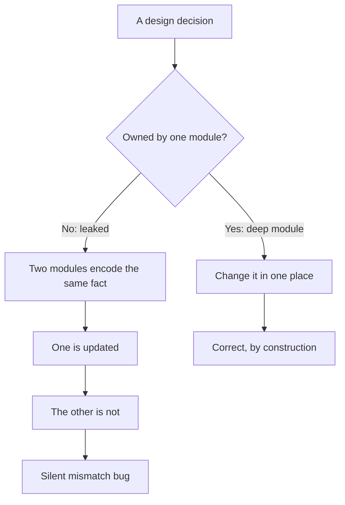

# Abstraction & Information Hiding — Find the Bug

> 12 buggy snippets where a leaky or shallow abstraction *causes* a real bug. A design decision escaped the one module that should have owned it, so two pieces of code now disagree — or a hidden detail surfaced where the interface promised it wouldn't. Find the bug, then trace it back to the leak. The fix is almost always to deepen the module: hide the decision in one place and stop making callers know about it.

---

## Table of Contents

1. [Snippet 1 — Duplicated buffer size in two modules (Go)](#snippet-1--duplicated-buffer-size-in-two-modules-go)
2. [Snippet 2 — Exposed mutable slice breaks an invariant (Go)](#snippet-2--exposed-mutable-slice-breaks-an-invariant-go)
3. [Snippet 3 — Lazy-load leaks the transaction boundary (Python)](#snippet-3--lazy-load-leaks-the-transaction-boundary-python)
4. [Snippet 4 — Pass-through method forgot a parameter (Java)](#snippet-4--pass-through-method-forgot-a-parameter-java)
5. [Snippet 5 — Shallow wrapper swallows the error below (Go)](#snippet-5--shallow-wrapper-swallows-the-error-below-go)
6. [Snippet 6 — Temporal decomposition assumes unset state (Python)](#snippet-6--temporal-decomposition-assumes-unset-state-python)
7. [Snippet 7 — Caller depends on undocumented iteration order (Java)](#snippet-7--caller-depends-on-undocumented-iteration-order-java)
8. [Snippet 8 — "General" config flag with an untested combination (Python)](#snippet-8--general-config-flag-with-an-untested-combination-python)
9. [Snippet 9 — Index base duplicated across the boundary (Go)](#snippet-9--index-base-duplicated-across-the-boundary-go)
10. [Snippet 10 — Iterator invalidated by a mutation the interface allowed (Java)](#snippet-10--iterator-invalidated-by-a-mutation-the-interface-allowed-java)
11. [Snippet 11 — Leaked enum default surfaces in a new branch (Python)](#snippet-11--leaked-enum-default-surfaces-in-a-new-branch-python)
12. [Snippet 12 — Date format decided in two places (Go)](#snippet-12--date-format-decided-in-two-places-go)
13. [Scorecard](#scorecard)
14. [Related Topics](#related-topics)

---

## How to Use

Read each snippet and decide **where** the bug is *and* **why** weak information hiding let it happen. The trigger is almost never a typo — it is a design decision that lives in two places, or a detail the interface failed to hide. Then open the answer.

A leak follows a predictable shape:



Score yourself with the [Scorecard](#scorecard). Each snippet names the **leak**, the **bug it caused**, and the **deep-module fix** that makes the bug structurally impossible — not merely patched.

---

### Snippet 1 — Duplicated buffer size in two modules (Go)

**Difficulty:** Easy

```go
// package framing — owns the wire protocol
package framing

func Encode(payload []byte) []byte {
	frame := make([]byte, 0, 4+len(payload))
	frame = append(frame, byte(len(payload)>>24), byte(len(payload)>>16),
		byte(len(payload)>>8), byte(len(payload)))
	return append(frame, payload...)
}

// package reader — in a different file, written later
package reader

const headerSize = 2 // length prefix is 2 bytes

func ReadFrame(conn net.Conn) ([]byte, error) {
	header := make([]byte, headerSize)
	if _, err := io.ReadFull(conn, header); err != nil {
		return nil, err
	}
	length := int(header[0])<<8 | int(header[1])
	payload := make([]byte, length)
	_, err := io.ReadFull(conn, payload)
	return payload, err
}
```

**What's wrong?**

<details><summary>Answer</summary>

The encoder writes a **4-byte** big-endian length prefix. The reader assumes a **2-byte** prefix (`headerSize = 2`). The same design decision — *how many bytes the length prefix occupies* — is encoded independently in two modules, and they disagree.

The reader consumes 2 bytes of a 4-byte header, parses the two high-order bytes of the length (almost always `0x0000` for small payloads, so `length == 0`), then tries to read 0 bytes of payload while the real length bytes and the entire payload are still sitting unread in the stream. Every subsequent frame is misaligned. The protocol is corrupt from the first message, but nothing throws — the reader just returns empty or garbage payloads.

**The leak:** the wire format is a single decision that must be known by exactly one place. Here it is *duplicated* — once as "4 bytes, shift by 24/16/8/0" in `framing`, once as "2 bytes, shift by 8/0" in `reader`. When the encoder chose 4 bytes (or someone later widened it from 2 to 4), the reader was not updated, because nothing tied them together.

**The deep-module fix:** the framing package owns the format and exposes *both* directions, so the prefix width is decided once and is unspeakable elsewhere.

```go
package framing

const prefixLen = 4

func Encode(payload []byte) []byte {
	frame := make([]byte, prefixLen+len(payload))
	binary.BigEndian.PutUint32(frame, uint32(len(payload)))
	copy(frame[prefixLen:], payload)
	return frame
}

func Decode(conn io.Reader) ([]byte, error) {
	header := make([]byte, prefixLen)
	if _, err := io.ReadFull(conn, header); err != nil {
		return nil, err
	}
	payload := make([]byte, binary.BigEndian.Uint32(header))
	_, err := io.ReadFull(conn, payload)
	return payload, err
}
```

`prefixLen` and the byte order now exist in one module. A reader in another package cannot invent its own value — there is nothing to copy.
</details>

---

### Snippet 2 — Exposed mutable slice breaks an invariant (Go)

**Difficulty:** Easy

```go
type Histogram struct {
	buckets []int
	total   int
}

func NewHistogram(n int) *Histogram {
	return &Histogram{buckets: make([]int, n)}
}

func (h *Histogram) Add(bucket int) {
	h.buckets[bucket]++
	h.total++
}

// Buckets exposes the raw counts for rendering.
func (h *Histogram) Buckets() []int {
	return h.buckets
}

func (h *Histogram) Mean() float64 {
	sum := 0
	for i, c := range h.buckets {
		sum += i * c
	}
	return float64(sum) / float64(h.total)
}

// Caller, in a dashboard module:
func render(h *Histogram) {
	b := h.Buckets()
	b[0] = 0 // "hide the noisy zero bucket from the chart"
}
```

**What's wrong?**

**Where is the bug?**

<details><summary>Answer</summary>

`Buckets()` returns the internal slice header directly. A slice in Go is a *view* onto the backing array, so the caller now holds a live handle to `Histogram`'s internals. When the dashboard does `b[0] = 0` to clean up its chart, it mutates the histogram's actual counts.

`total` is not adjusted, so the invariant `total == sum(buckets)` is now broken. `Mean()` divides by a `total` that includes the entries the caller just zeroed out, returning a number that is silently too small. Worse, the corruption is permanent and at a distance: a rendering function quietly changed a statistics object.

**The leak:** the interface promised "read the counts" but actually handed out write access to private state. The encapsulation boundary — "only `Add` may change buckets, and it keeps `total` in sync" — leaked the moment a mutable reference escaped.

**The deep-module fix:** never return the internal collection. Return a copy, or expose a read-only accessor.

```go
// Buckets returns a snapshot the caller may freely mutate.
func (h *Histogram) Buckets() []int {
	out := make([]int, len(h.buckets))
	copy(out, h.buckets)
	return out
}

// Or, cheaper and intent-revealing, expose only what callers need:
func (h *Histogram) Count(bucket int) int { return h.buckets[bucket] }
func (h *Histogram) Len() int             { return len(h.buckets) }
```

The invariant is now owned entirely by `Histogram`; no caller can reach in and break it.
</details>

---

### Snippet 3 — Lazy-load leaks the transaction boundary (Python)

**Difficulty:** Medium

```python
# repository.py
class OrderRepository:
    def __init__(self, session_factory):
        self._session_factory = session_factory

    def find(self, order_id):
        with self._session_factory() as session:
            return session.query(Order).get(order_id)


# service.py
class InvoiceService:
    def __init__(self, repo):
        self._repo = repo

    def total_with_lines(self, order_id):
        order = self._repo.find(order_id)
        total = Decimal("0")
        for line in order.lines:          # relationship, lazy-loaded
            total += line.unit_price * line.quantity
        return total
```

**What's wrong?**

<details><summary>Answer</summary>

`find` opens a session, loads the `Order`, and **closes the session** (the `with` block exits) before returning. The `order.lines` relationship is lazy — the ORM only fetches the child rows the first time they are accessed, and that access needs a live session attached to the object.

`InvoiceService` accesses `order.lines` *after* `find` returned, when the session is already closed. The ORM raises `DetachedInstanceError` (or, in some configurations, silently returns an empty/stale collection — even worse). Either way the bug appears in the service, far from the repository that caused it.

**The leak:** the repository's interface looks like a plain "give me an `Order`" abstraction, but the returned object secretly depends on a transaction/session boundary that the interface neither documents nor enforces. The session lifetime — an implementation decision — leaked out as an undocumented precondition on *every attribute access* of the returned object. The abstraction is shallow: it hides the query but not the most important fact about what it returns.

**The deep-module fix:** the repository must own the session boundary *and* the completeness of what it returns. Either eagerly load everything the contract promises, or return a detached, fully-populated value object.

```python
class OrderRepository:
    def find(self, order_id):
        with self._session_factory() as session:
            order = (
                session.query(Order)
                .options(joinedload(Order.lines))  # load lines inside the session
                .get(order_id)
            )
            # Return a plain value object — no live-session dependency leaks out.
            return OrderView(
                id=order.id,
                lines=[LineView(l.unit_price, l.quantity) for l in order.lines],
            )
```

Now the returned object carries no hidden requirement to be inside a session. The repository hides the entire transaction lifetime, which is exactly the decision it is best placed to make.
</details>

---

### Snippet 4 — Pass-through method forgot a parameter (Java)

**Difficulty:** Medium

```java
public class CachingUserClient {
    private final UserApi delegate;
    private final Cache<String, User> cache;

    public User getUser(String userId, boolean includeArchived) {
        User cached = cache.getIfPresent(userId);
        if (cached != null) {
            return cached;
        }
        // Pass-through to the real client.
        User user = delegate.fetchUser(userId);   // (?)
        cache.put(userId, user);
        return user;
    }
}

// UserApi:
public interface UserApi {
    User fetchUser(String userId);
    User fetchUser(String userId, boolean includeArchived);
}
```

**What's wrong?**

<details><summary>Answer</summary>

`CachingUserClient.getUser` accepts an `includeArchived` flag but the pass-through call `delegate.fetchUser(userId)` resolves to the **single-argument overload**, dropping the flag entirely. The caller asked to include archived users; the delegate is asked for the default (non-archived) view. The flag is silently ignored.

It gets worse with the cache. The cache key is `userId` alone — it does not include `includeArchived`. So a `getUser(id, false)` call populates the cache, and a later `getUser(id, true)` returns the cached non-archived result without ever calling the delegate. Two semantically different requests collapse onto one cache entry. Even fixing the dropped parameter would leave a cache-key bug.

**The leak:** a pass-through method adds a layer of indirection without adding abstraction — it exists only to forward. Because it forwards by hand, it is free to forward *incorrectly*, and the two-arg/one-arg overload made the mistake invisible to the compiler. The wrapper does not hide a meaningful decision; it just relays, and relaying is exactly the operation that is easy to get subtly wrong.

**The deep-module fix:** if the wrapper genuinely adds caching, the cache key must reflect *every* input that changes the result, and the forward must pass *every* parameter. Better still, collapse the overloads so there is one method and nothing to forget.

```java
public class CachingUserClient {
    private final UserApi delegate;
    private final Cache<CacheKey, User> cache;

    public User getUser(String userId, boolean includeArchived) {
        CacheKey key = new CacheKey(userId, includeArchived); // key reflects all inputs
        return cache.get(key, k -> delegate.fetchUser(k.userId(), k.includeArchived()));
    }
}

// And drop the convenience overload from UserApi — one method, one behavior:
public interface UserApi {
    User fetchUser(String userId, boolean includeArchived);
}
```

When the underlying interface has a single method, the wrapper cannot forward the wrong one, and the key derivation forces the author to confront which inputs matter.
</details>

---

### Snippet 5 — Shallow wrapper swallows the error below (Go)

**Difficulty:** Medium

```go
type ConfigStore struct {
	db *sql.DB
}

// Get returns the value for a key, or "" if not set.
func (c *ConfigStore) Get(key string) string {
	var value string
	row := c.db.QueryRow("SELECT value FROM config WHERE key = $1", key)
	row.Scan(&value)
	return value
}

// Caller:
func startServer(cfg *ConfigStore) {
	maxConns := cfg.Get("max_connections")
	n, _ := strconv.Atoi(maxConns)
	pool := newPool(n)
	// ...
}
```

**What's wrong?**

<details><summary>Answer</summary>

`row.Scan(&value)` returns an `error` that is discarded. `Scan` fails for two very different reasons that now look identical:

- `sql.ErrNoRows` — the key genuinely isn't set. Returning `""` is arguably fine.
- A **real** failure — the DB is down, the query timed out, the `config` table is missing, a type mismatch. These also leave `value == ""` and the error swallowed.

So when the database is unreachable, `Get("max_connections")` returns `""`, `strconv.Atoi("")` returns `0` (with its own discarded error), and the server boots a connection pool of size **0**. The server starts "successfully" and then every request hangs or fails to acquire a connection. The root cause — a dead database at startup — is completely hidden behind an abstraction that promised a plain string.

**The leak:** the wrapper is shallow — it barely simplifies the DB call — yet it *removes* information that the layer below produced. Collapsing "not found" and "query failed" into the same empty string is information loss disguised as a clean interface. The simpler-looking signature (`string` instead of `(string, error)`) is precisely what hid the failure.

**The deep-module fix:** preserve the distinction the lower layer worked to establish. Return the error, and let "not set" be a typed, explicit case.

```go
var ErrNotSet = errors.New("config key not set")

func (c *ConfigStore) Get(key string) (string, error) {
	var value string
	err := c.db.QueryRow("SELECT value FROM config WHERE key = $1", key).Scan(&value)
	if errors.Is(err, sql.ErrNoRows) {
		return "", ErrNotSet
	}
	if err != nil {
		return "", fmt.Errorf("config get %q: %w", key, err) // real failure surfaces
	}
	return value, nil
}

// Caller can now fail fast on a dead DB and apply a default only on ErrNotSet.
func startServer(cfg *ConfigStore) error {
	raw, err := cfg.Get("max_connections")
	if errors.Is(err, ErrNotSet) {
		raw = "50"
	} else if err != nil {
		return fmt.Errorf("startup: %w", err) // do NOT boot with a guessed value
	}
	n, err := strconv.Atoi(raw)
	if err != nil {
		return fmt.Errorf("max_connections not an int: %w", err)
	}
	pool := newPool(n)
	_ = pool
	return nil
}
```

A wrapper may hide *complexity*, but it must never hide a *failure*.
</details>

---

### Snippet 6 — Temporal decomposition assumes unset state (Python)

**Difficulty:** Medium

```python
class ReportBuilder:
    def __init__(self, raw_rows):
        self.raw_rows = raw_rows
        self.rows = None
        self.totals = None

    def step1_clean(self):
        self.rows = [r for r in self.raw_rows if r["amount"] is not None]

    def step2_aggregate(self):
        by_region = defaultdict(Decimal)
        for r in self.rows:
            by_region[r["region"]] += Decimal(str(r["amount"]))
        self.totals = dict(by_region)

    def step3_format(self):
        return "\n".join(f"{region}: {amount:.2f}"
                         for region, amount in self.totals.items())


# Caller, refactored last week to support an "already clean" fast path:
def build_report(rows, prevalidated=False):
    b = ReportBuilder(rows)
    if not prevalidated:
        b.step1_clean()
    b.step2_aggregate()
    return b.step3_format()
```

**What's wrong?**

<details><summary>Answer</summary>

`ReportBuilder` is split by **execution order**: `step1`, `step2`, `step3`. Each step communicates with the next only through mutable instance fields (`self.rows`, `self.totals`), and the contract "`step2` requires `step1` to have run" lives nowhere except the original linear call order.

The new `prevalidated=True` fast path skips `step1_clean`. But `step1` is the only thing that assigns `self.rows`. When skipped, `self.rows` is still `None`, and `step2_aggregate` does `for r in self.rows` — `TypeError: 'NoneType' is not iterable`. The author of the fast path reasonably assumed "prevalidated rows are already in `self.rows`," but nothing in the design moved the raw rows into `rows`; that coupling was hidden inside `step1`.

**The leak:** temporal decomposition exposes the *sequence* of operations as the interface while hiding the *data dependencies* between them. The knowledge "rows must be populated before aggregation" is implicit in field-ordering, so any caller that reorders or skips a step silently violates a precondition the design never stated.

**The deep-module fix:** decompose by *what each unit knows*, not by *when it runs*. Make each transformation a pure function whose inputs and outputs are explicit, so an unset intermediate state cannot exist.

```python
def clean(raw_rows):
    return [r for r in raw_rows if r["amount"] is not None]

def aggregate(rows):
    by_region = defaultdict(Decimal)
    for r in rows:
        by_region[r["region"]] += Decimal(str(r["amount"]))
    return dict(by_region)

def format_report(totals):
    return "\n".join(f"{region}: {amount:.2f}" for region, amount in totals.items())

def build_report(rows, prevalidated=False):
    clean_rows = rows if prevalidated else clean(rows)  # the data dependency is now explicit
    return format_report(aggregate(clean_rows))
```

There is no `None` intermediate field to forget: the output of each stage is the input to the next, by signature.
</details>

---

### Snippet 7 — Caller depends on undocumented iteration order (Java)

**Difficulty:** Hard

```java
public class TaxRuleEngine {
    private final Map<String, TaxRule> rules = new HashMap<>();

    public void register(String code, TaxRule rule) {
        rules.put(code, rule);
    }

    // Returns every rule; callers apply them in the returned order.
    public Collection<TaxRule> allRules() {
        return rules.values();
    }
}

// Caller:
public Money applyTaxes(Money base, TaxRuleEngine engine) {
    Money result = base;
    for (TaxRule rule : engine.allRules()) {
        result = rule.apply(result);   // order-sensitive: VAT before surcharge
    }
    return result;
}
```

**What's wrong?**

<details><summary>Answer</summary>

`applyTaxes` applies rules *in sequence*, and the result depends on the order: a percentage VAT followed by a flat surcharge yields a different total than the reverse. But `allRules()` returns `HashMap.values()`, whose iteration order is **unspecified** and may change between JDK versions, after a resize, or simply with different keys. The caller has built a correctness requirement (ordering) on top of a guarantee the abstraction never made.

The code "works" in tests because, for a given small set of keys and a given JDK, `HashMap` happens to iterate in a stable order. In production with more rules — or after a JVM upgrade — the order shifts, taxes apply in a different sequence, and totals are silently wrong. Nothing throws; the numbers are just off by a few cents to a few dollars, discovered weeks later in a reconciliation.

**The leak:** `HashMap`'s iteration order is an *implementation detail* that the `allRules()` return type accidentally exposed. The engine made no promise about order, but the type `Collection<TaxRule>` did not *forbid* the caller from depending on one either. The abstraction failed to hide a detail and failed to state a contract, so the caller filled the vacuum with a false assumption.

**The deep-module fix:** if order matters, the engine must own and guarantee it — make ordering an explicit, first-class part of the contract rather than a leaked artifact of the map type.

```java
public class TaxRuleEngine {
    // Each rule declares its position; the engine owns ordering.
    private final List<TaxRule> rules = new ArrayList<>();

    public void register(TaxRule rule) {
        rules.add(rule);
        rules.sort(Comparator.comparingInt(TaxRule::priority)); // explicit, total order
    }

    /** Rules in guaranteed application order (ascending priority). */
    public List<TaxRule> orderedRules() {
        return List.copyOf(rules); // immutable snapshot; no internal leak
    }
}
```

Now the ordering decision lives in the engine, is documented in the method's contract, and is independent of any `HashMap` internals. The caller depends on a guarantee, not a coincidence.
</details>

---

### Snippet 8 — "General" config flag with an untested combination (Python)

**Difficulty:** Hard

```python
class CsvExporter:
    def __init__(self, delimiter=",", quote_all=False, escape_char=None,
                 line_terminator="\n", trim_whitespace=False):
        self.delimiter = delimiter
        self.quote_all = quote_all
        self.escape_char = escape_char
        self.line_terminator = line_terminator
        self.trim_whitespace = trim_whitespace

    def _field(self, value):
        s = str(value)
        if self.trim_whitespace:
            s = s.strip()
        if self.escape_char:
            s = s.replace(self.delimiter, self.escape_char + self.delimiter)
        if self.quote_all:
            s = f'"{s}"'
        return s

    def row(self, values):
        return self.line_terminator.join([])  # placeholder
        # return self.delimiter.join(self._field(v) for v in values) + self.line_terminator
```

Assume `row` is the commented line. A user configures `CsvExporter(quote_all=True, escape_char="\\")` to be "extra safe."

**What's wrong?**

<details><summary>Answer</summary>

The flags `quote_all` and `escape_char` were each designed and tested in isolation, but their *combination* is incoherent. `_field` first escapes the delimiter (`a,b` → `a\,b`), then wraps the whole thing in quotes (`"a\,b"`). In real CSV, a quoted field does not need delimiter-escaping at all — the quotes already protect embedded delimiters — and the backslash-escape is not part of the CSV quoting convention. The output `"a\,b"` is now ambiguous: a strict CSV parser reads the field as the literal `a\,b` (backslash included), corrupting the data on round-trip.

Each flag "works" alone. The bug only appears when both are on — a combination no test exercised, because the configuration surface is a product of five independent options and nobody enumerated the cross-products.

**The leak:** the exporter pushed a *quoting strategy* decision onto every caller as a bag of independent booleans and characters. CSV quoting is one coherent decision (RFC 4180 quoting vs. escape-character style vs. none) that the exporter is far better placed to make than the caller. By exposing the knobs separately, it let callers assemble combinations the module never validated.

**The deep-module fix:** replace the loose flags with a single, closed choice of *quoting strategy*. The module owns the decision; the caller picks one valid mode, and impossible combinations cannot be expressed.

```python
from enum import Enum

class Quoting(Enum):
    MINIMAL = "minimal"   # RFC 4180: quote only when needed
    ALL = "all"           # quote every field
    ESCAPED = "escaped"   # backslash-escape, no quotes

class CsvExporter:
    def __init__(self, delimiter=",", quoting=Quoting.MINIMAL,
                 line_terminator="\n", trim_whitespace=False):
        self.delimiter = delimiter
        self.quoting = quoting
        self.line_terminator = line_terminator
        self.trim_whitespace = trim_whitespace

    def _field(self, value):
        s = str(value).strip() if self.trim_whitespace else str(value)
        needs_quote = self.delimiter in s or '"' in s or "\n" in s
        if self.quoting is Quoting.ALL or (self.quoting is Quoting.MINIMAL and needs_quote):
            return '"' + s.replace('"', '""') + '"'   # RFC 4180 doubling
        if self.quoting is Quoting.ESCAPED:
            return s.replace("\\", "\\\\").replace(self.delimiter, "\\" + self.delimiter)
        return s
```

There is no "quote *and* escape" combination to misconfigure: the strategies are mutually exclusive by type. The decision the caller is unqualified to make has been pulled down into the module.
</details>

---

### Snippet 9 — Index base duplicated across the boundary (Go)

**Difficulty:** Medium

```go
// package sheet — models a spreadsheet; columns are 0-indexed internally.
package sheet

type Sheet struct {
	cells [][]string
}

func (s *Sheet) Set(row, col int, v string) { s.cells[row][col] = v }
func (s *Sheet) Get(row, col int) string    { return s.cells[row][col] }

// package importer — maps a user's column letters to indices, written separately.
package importer

// Users type columns as A=1, B=2, ... (1-based, matching the UI label).
func columnIndex(letter string) int {
	return int(letter[0]-'A') + 1
}

func Import(s *sheet.Sheet, records []Record) {
	for r, rec := range records {
		s.Set(r, columnIndex("A"), rec.Name)   // column A
		s.Set(r, columnIndex("B"), rec.Email)  // column B
	}
}
```

**What's wrong?**

<details><summary>Answer</summary>

The `sheet` package uses **0-based** column indices (it indexes a Go slice directly: `s.cells[row][col]`). The `importer` package independently decided columns are **1-based** (`columnIndex("A") == 1`) to match a UI label. The two modules each made a *column-numbering* decision, and they disagree.

`columnIndex("A")` returns `1`, so `rec.Name` lands in slice index 1 (visually column B), `rec.Email` lands in index 2 (column C), and column 0 is left empty. Every imported record is shifted one column to the right. If the sheet has exactly two allocated columns, `columnIndex("B") == 2` is also an out-of-range write, panicking — but if the sheet is wider, it silently corrupts the layout with no error at all.

**The leak:** "what number does the first column have" is one decision that escaped into two modules. `sheet` never *documented or enforced* that callers must pass 0-based indices, and `importer` never *knew*, so it invented its own convention. The boundary type is a bare `int`, which carries no information about its base.

**The deep-module fix:** make the index base a property the `sheet` package owns and expresses through its own type, so foreign code cannot supply a number in the wrong base.

```go
package sheet

// Col is a column reference. Construct it through the package so the base is fixed here.
type Col int

// ColFromLetter is the ONLY supported way to name a column; the 0/1 decision lives here.
func ColFromLetter(letter byte) Col { return Col(letter - 'A') } // A -> 0, owned by sheet

func (s *Sheet) Set(row int, col Col, v string) { s.cells[row][int(col)] = v }

// importer now cannot invent its own base — it must go through sheet.
func Import(s *sheet.Sheet, records []Record) {
	for r, rec := range records {
		s.Set(r, sheet.ColFromLetter('A'), rec.Name)
		s.Set(r, sheet.ColFromLetter('B'), rec.Email)
	}
}
```

The letter-to-index mapping exists once, in the module that defines what an index means. The `Col` type makes a raw 1-based `int` un-passable.
</details>

---

### Snippet 10 — Iterator invalidated by a mutation the interface allowed (Java)

**Difficulty:** Hard

```java
public class SessionRegistry {
    private final Map<String, Session> sessions = new ConcurrentHashMap<>();

    public void add(Session s)          { sessions.put(s.id(), s); }
    public void remove(String id)       { sessions.remove(id); }

    // Sweep expired sessions.
    public void evictExpired(Instant now) {
        for (Session s : sessions.values()) {
            if (s.expiresAt().isBefore(now)) {
                remove(s.id());                 // (?)
                listener.onEvicted(s);          // may re-enter the registry
            }
        }
    }
}
```

`listener.onEvicted` is a user-supplied callback that, in one deployment, calls `registry.add(...)` to spawn a replacement session.

**What's wrong?**

<details><summary>Answer</summary>

The intent is "iterate the sessions and drop the expired ones." Two leaks combine into a bug.

First, the design *invites* mutation during iteration: `evictExpired` removes from `sessions` while looping over `sessions.values()`, and it then calls an arbitrary listener that may also mutate the map. With a plain `HashMap` this throws `ConcurrentModificationException`; with the `ConcurrentHashMap` used here it does **not** throw — instead the view's iterator offers only *weakly consistent* traversal. A `Session` that `onEvicted` adds mid-sweep may or may not be visited, and the behavior is non-deterministic across runs and map sizes.

The concrete bug: in the deployment where `onEvicted` calls `add`, a freshly added replacement session can be observed by the still-running iterator and, if its `expiresAt` happens to be in the past (e.g., a clock skew or a zero-TTL session), immediately evicted again — or, conversely, a session that *should* be swept is skipped because the iterator's weakly-consistent snapshot moved past it. Eviction becomes flaky: sometimes a session lingers forever, sometimes a brand-new one is killed on creation.

**The leak:** the registry's interface does not state whether it is safe to mutate during a sweep, and the choice of `ConcurrentHashMap` *hid* the violation (no exception) instead of preventing it. "Is it safe to add/remove while iterating?" is a contract the module must define and enforce; here it leaked as undefined behavior that depends on the concrete map type and the listener's actions.

**The deep-module fix:** decide the contract — iteration is over a *stable snapshot*, and notifications happen *after* the structural changes are complete — and enforce it inside the module so no caller or callback can corrupt a live traversal.

```java
public void evictExpired(Instant now) {
    // 1) Compute the victims against a stable snapshot — no mutation during scan.
    List<Session> expired = sessions.values().stream()
            .filter(s -> s.expiresAt().isBefore(now))
            .toList();

    // 2) Apply structural changes.
    for (Session s : expired) {
        sessions.remove(s.id(), s); // remove only if unchanged (atomic 2-arg remove)
    }

    // 3) Notify after the map is consistent; re-entrant add() is now harmless.
    for (Session s : expired) {
        listener.onEvicted(s);
    }
}
```

The two-arg `remove(key, value)` also fixes a related leak: a session re-`add`ed under the same id between the scan and the removal is not accidentally deleted, because removal is conditional on identity. The "can I mutate during a sweep?" question now has a definite, module-owned answer.
</details>

---

### Snippet 11 — Leaked enum default surfaces in a new branch (Python)

**Difficulty:** Hard

```python
class PaymentStatus(Enum):
    PENDING = 0
    AUTHORIZED = 1
    CAPTURED = 2
    REFUNDED = 3
    # FAILED added later

def is_settled(status):
    # Settled means money actually moved and stayed.
    return status.value >= PaymentStatus.CAPTURED.value


# Months later, FAILED is appended:
class PaymentStatus(Enum):
    PENDING = 0
    AUTHORIZED = 1
    CAPTURED = 2
    REFUNDED = 3
    FAILED = 4

# Caller in the reconciliation job:
def owed_to_merchant(payments):
    return sum(p.amount for p in payments if is_settled(p.status))
```

**What's wrong?**

<details><summary>Answer</summary>

`is_settled` does not encode the *meaning* of "settled"; it encodes an assumption about the *numeric ordering* of the enum — "anything at or past `CAPTURED`'s value counts." That assumption was an internal implementation detail of how the enum's integers happened to be assigned at the time the function was written. `REFUNDED = 3` already slipped through (`3 >= 2`), which is arguably a pre-existing latent bug, but it was tolerated because refunds were rare.

When `FAILED = 4` is appended, `is_settled(FAILED)` returns `True` because `4 >= 2`. The reconciliation job then counts **failed** payments as money owed to the merchant, inflating payouts. A new enum member silently changed the behavior of a function that never mentioned it, because the function depended on undocumented numeric ordering rather than on the explicit set of "settled" states.

**The leak:** the enum's integer values are an internal detail; `is_settled` reached past the abstraction and depended on them. The decision "which statuses count as settled" leaked from a single explicit list into an ordering coincidence, so adding a member elsewhere changed the answer here.

**The deep-module fix:** state the membership explicitly and let the type own its own classification. The numeric values become irrelevant, and a newly added member cannot fall into a category by accident.

```python
class PaymentStatus(Enum):
    PENDING = auto()
    AUTHORIZED = auto()
    CAPTURED = auto()
    REFUNDED = auto()
    FAILED = auto()

    @property
    def is_settled(self):
        # Explicit membership — adding FAILED does not silently include it.
        return self in {PaymentStatus.CAPTURED}
```

Now "settled" is a closed, named set owned by the enum. Adding `FAILED`, `DISPUTED`, or any future status leaves the classification untouched until someone *deliberately* edits the set — and a reviewer can see exactly what counts.
</details>

---

### Snippet 12 — Date format decided in two places (Go)

**Difficulty:** Medium

```go
// package exporter — writes a daily report file.
package exporter

func filename(day time.Time) string {
	return "report-" + day.Format("2006-01-02") + ".csv" // ISO date
}

// package cleaner — deletes reports older than 30 days, written by another team.
package cleaner

func isOldReport(name string, now time.Time) bool {
	// Expect "report-01-02-2006.csv" (US format)
	base := strings.TrimSuffix(strings.TrimPrefix(name, "report-"), ".csv")
	day, err := time.Parse("01-02-2006", base)
	if err != nil {
		return false
	}
	return now.Sub(day) > 30*24*time.Hour
}
```

**What's wrong?**

<details><summary>Answer</summary>

The exporter names files `report-2006-01-02.csv` (ISO, year-first). The cleaner tries to parse `report-01-02-2006.csv` (US, month-first). The *date format embedded in the filename* is a single decision encoded independently in two packages, and they disagree.

`time.Parse("01-02-2006", "2026-06-10")` fails — the layout doesn't match — so `isOldReport` hits the `err != nil` branch and returns `false` for **every** file. The cleaner silently never deletes anything. Reports accumulate forever until the disk fills, and because the function "works" (no crash, no error logged), the failure is invisible until an on-call page about disk usage weeks later.

**The leak:** the filename format is a contract between whoever writes files and whoever reads them, but it was duplicated as two opaque layout strings in two packages with no shared definition. When the exporter chose ISO (or switched to it), the cleaner had no way to know, and the `return false` on parse error turned the disagreement into a silent no-op rather than a loud failure.

**The deep-module fix:** the filename scheme is one decision — give it one owner that knows how to *both* build and parse the name. Neither team gets to re-encode the format.

```go
package report

const datePrefix = "report-"
const dateLayout = "2006-01-02" // the single source of truth for the filename date

func Filename(day time.Time) string {
	return datePrefix + day.Format(dateLayout) + ".csv"
}

// ParseDay is the inverse of Filename — same layout, by construction.
func ParseDay(name string) (time.Time, error) {
	base := strings.TrimSuffix(strings.TrimPrefix(name, datePrefix), ".csv")
	return time.Parse(dateLayout, base)
}

// cleaner now depends on the owner, not on a re-guessed layout:
func isOldReport(name string, now time.Time) bool {
	day, err := report.ParseDay(name)
	if err != nil {
		return false
	}
	return now.Sub(day) > 30*24*time.Hour
}
```

`Filename` and `ParseDay` share one `dateLayout` constant, so they cannot drift apart. The format is hidden behind the `report` package; no other module can disagree with it.
</details>

---

## Scorecard

| # | Snippet | Difficulty | The leak | The bug it caused |
|---|---------|-----------|----------|-------------------|
| 1 | Duplicated buffer size (Go) | Easy | Prefix width encoded in two packages | Misaligned, corrupt frames |
| 2 | Exposed mutable slice (Go) | Easy | Internal slice escaped via accessor | Broken `total == sum` invariant |
| 3 | Lazy-load session boundary (Python) | Medium | Transaction lifetime leaked as a precondition | `DetachedInstanceError` / empty lines |
| 4 | Pass-through dropped a param (Java) | Medium | Hand-forwarding + cache key missing input | Flag ignored; cross-request cache hit |
| 5 | Shallow wrapper swallows error (Go) | Medium | "Not found" and "failed" collapsed to `""` | Server boots with pool size 0 |
| 6 | Temporal decomposition (Python) | Medium | Data dependency hidden in step order | `None` row list on fast path |
| 7 | Undocumented iteration order (Java) | Hard | `HashMap` order exposed, no contract | Tax rules apply out of order |
| 8 | "General" config flags (Python) | Hard | Quoting strategy pushed onto callers | Quote+escape corrupts CSV round-trip |
| 9 | Index base duplicated (Go) | Medium | 0-based vs 1-based across packages | Every record shifted one column |
| 10 | Iterator + allowed mutation (Java) | Hard | "Safe to mutate during sweep?" undefined | Flaky eviction; new session killed |
| 11 | Leaked enum ordering (Python) | Hard | `is_settled` depends on int values | `FAILED` counted as money owed |
| 12 | Date format in two places (Go) | Medium | Filename layout duplicated, drifted | Cleaner deletes nothing; disk fills |

**How did you score?**

- **11–12 found:** You instinctively ask "who owns this decision?" and spot a fact encoded twice. Senior-level information-hiding judgment.
- **8–10 found:** Strong. You catch the duplicated-decision leaks; keep sharpening the eye for *shallow* abstractions that lose information (Snippets 5, 10).
- **5–7 found:** Solid. Re-read the answers and notice the recurring shape: the same fact known in two modules, or a detail the interface failed to hide.
- **0–4 found:** Study the [chapter README](../README.md) and [junior.md](junior.md), then return. The pattern repeats; once you see it you cannot unsee it.

---

## Related Topics

- [README.md](../README.md) — the chapter's positive rules: deep modules, information hiding, design it twice
- [junior.md](junior.md) — foundations of abstraction and information hiding
- [tasks.md](tasks.md) — exercises to practice deepening shallow modules
- [Anti-Patterns](../../anti-patterns/README.md) — broader catalog of design smells, including leaky abstractions
- [Refactoring](../../refactoring/README.md) — mechanical techniques (Encapsulate Field, Hide Delegate, Move Method) that repair the leaks shown here
