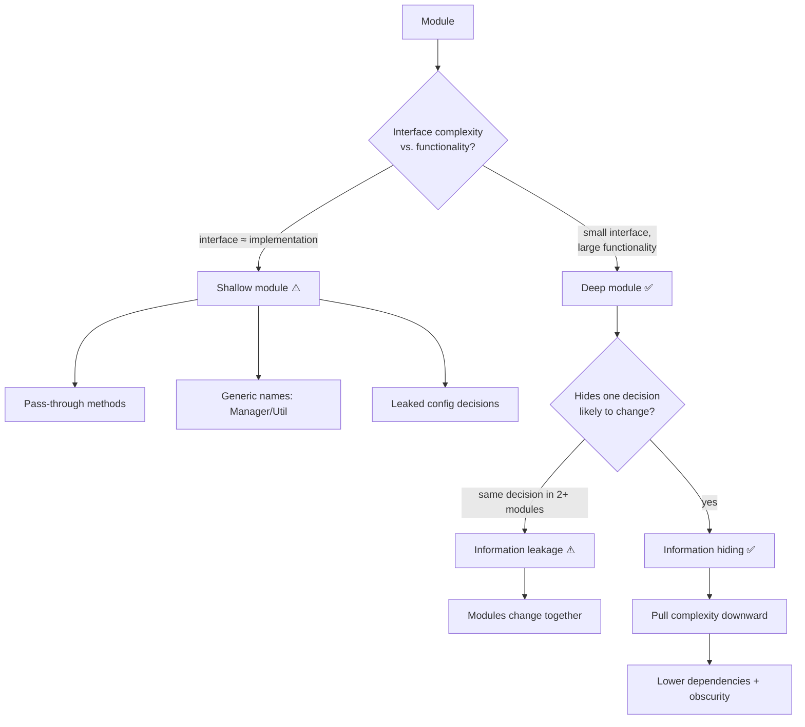

# Abstraction & Information Hiding — Interview Questions

> 50+ questions across four tiers (Junior → Staff). Answers are crisp; the harder ones include *what the interviewer is really checking*. Drawn from Parnas's information-hiding paper, Ousterhout's *A Philosophy of Software Design*, Spolsky's leaky-abstractions law, and the long-running Ousterhout-vs-Martin "small classes" debate.

---

## Table of Contents

- [Junior](#junior-15-questions)
- [Mid](#mid-15-questions)
- [Senior](#senior-13-questions)
- [Staff](#staff-9-questions)
- [Rapid-Fire](#rapid-fire)
- [Summary](#summary)
- [Further Reading](#further-reading)
- [Related Topics](#related-topics)

---

## Junior (15 questions)

### J1. What is an abstraction?

<details><summary>Answer</summary>

A simplified view of an entity that omits unimportant details. The art is choosing *which* details are unimportant: a good abstraction surfaces what the caller needs and hides everything else. The interface is the abstraction; the implementation is the thing being abstracted.
</details>

### J2. What is information hiding?

<details><summary>Answer</summary>

A module encapsulates a piece of knowledge — a data structure, an algorithm, a file format — so that no other module depends on it. Callers see only an interface. The hidden knowledge can change without rippling outward. Coined by David Parnas (1972).
</details>

### J3. What is encapsulation, and how does it differ from information hiding?

<details><summary>Answer</summary>

Encapsulation is the *mechanism* — bundling data with the code that operates on it and restricting access (`private`, package-scope). Information hiding is the *design goal* — deciding what knowledge to conceal. You use encapsulation to achieve information hiding; you can have encapsulation (getters/setters on every field) while hiding nothing.
</details>

### J4. What is the opposite of information hiding?

<details><summary>Answer</summary>

**Information leakage** — a design decision exposed in two or more modules so they must change together. The classic example: two classes that both know the file format, so changing the format means editing both.
</details>

### J5. What is a deep module?

<details><summary>Answer</summary>

A module with a simple interface over substantial functionality. The interface is small; the implementation it hides is large. Depth ≈ functionality ÷ interface complexity. Unix file I/O (`open`, `read`, `write`, `close`, `lseek`) is the canonical deep module: five calls hide buffering, scheduling, permissions, and device drivers.
</details>

### J6. What is a shallow module?

<details><summary>Answer</summary>

A module whose interface is nearly as complex as the implementation it hides — so it earns no leverage. The caller pays the cost of learning the interface but gains little simplification. A one-line method with a five-parameter signature is shallow.
</details>

### J7. What is a pass-through method?

<details><summary>Answer</summary>

A method that does nothing but forward its arguments to another method, usually with the same signature. It adds an interface element without adding abstraction — pure indirection. It's a sign that two classes have an unclear division of responsibility.
</details>

### J8. Why are generic names like `Manager`, `Util`, `Helper`, or `Data` a warning sign?

<details><summary>Answer</summary>

They signal an abstraction that hides nothing coherent — a bucket of unrelated functionality. A good module name describes the *one thing it knows*. If you can't name it more specifically than `Helper`, you probably haven't found the abstraction yet.
</details>

### J9. What does `private` actually buy you?

<details><summary>Answer</summary>

It enforces a boundary: callers cannot depend on what they cannot reach, so private members are free to change. `private` is the mechanical foundation of information hiding — without it, hiding is only a convention.
</details>

### J10. Why expose behavior rather than fields?

<details><summary>Answer</summary>

A public field freezes a representation decision: every caller now depends on the field's type and meaning. A method hides whether the value is stored, computed, cached, or fetched. `account.balance()` can change its implementation; `account.balance` (a public field) cannot.
</details>

### J11. What is a leaky abstraction?

<details><summary>Answer</summary>

An abstraction that fails to fully hide its underlying complexity, forcing the caller to understand the layer beneath. Joel Spolsky's **Law of Leaky Abstractions**: *all non-trivial abstractions, to some degree, are leaky.* Example: TCP promises reliable delivery, but you still feel network latency and disconnections.
</details>

### J12. Give an everyday example of a good abstraction.

<details><summary>Answer</summary>

A garbage collector: you allocate, it reclaims, you never call `free`. The interface is "just allocate." It hides reachability analysis, generational collection, and compaction — a huge amount of functionality behind almost no interface. That ratio is what makes it good.
</details>

### J13. What is the difference between an interface and an implementation?

<details><summary>Answer</summary>

The interface is everything a caller must know to use the module: method signatures, plus *informal* knowledge like ordering constraints, units, and side effects. The implementation is the code that fulfills it. Good design maximizes what's in the implementation and minimizes what's in the interface.
</details>

### J14. Is a one-line method always good?

<details><summary>Answer</summary>

No. Method length is not the metric — *depth* is. A one-line method that forwards to another (pass-through) or that requires a long, fiddly signature is shallow. Brevity helps readability but doesn't make an abstraction deep.
</details>

### J15. What's the relationship between abstraction and the Single Responsibility Principle?

<details><summary>Answer</summary>

SRP says a module should have one reason to change. Information hiding says a module should hide one design decision. They converge: the "one reason to change" *is* the hidden decision. If a module hides two unrelated decisions, it has two reasons to change.
</details>

---

## Mid (15 questions)

### M1. Ousterhout defines complexity as two things. What are they?

<details><summary>Answer</summary>

**Complexity = dependencies + obscurity.** A *dependency* is when code can't be understood or changed in isolation. *Obscurity* is when important information isn't obvious. Both raise the cost of the three symptoms of complexity: change amplification, high cognitive load, and unknown unknowns.
</details>

### M2. What does "pull complexity downward" mean?

<details><summary>Answer</summary>

When complexity is unavoidable, it's better for the *module* to absorb it than to push it onto callers — because there is one implementation and many callers. A configuration parameter that exports a decision to every caller pushes complexity *up*; computing a sensible default internally pulls it *down*.

*What the interviewer is checking:* whether you reflexively add a flag/parameter "for flexibility," or instead ask "is the module better placed to decide this?"
</details>

### M3. Parnas's criterion for what to hide is often misquoted. What did he actually say?

<details><summary>Answer</summary>

Hide the design decisions **likely to change**. Decomposition should be driven by *anticipated change*, not by flowchart/processing steps. Each module hides a decision behind an interface that stays stable when that decision changes. The famous corollary: don't decompose a system by the order in which things happen.
</details>

### M4. What is temporal decomposition and why is it usually wrong?

<details><summary>Answer</summary>

Splitting a system by *order of execution* — `ReadStep`, `ProcessStep`, `WriteStep` — instead of by *what knowledge each unit hides*. It's seductive because execution order is visible, but it scatters a single design decision (e.g., the file format) across the read and write units, creating information leakage. Decompose by knowledge, not by timeline.
</details>

### M5. How do you decide whether to expose a configuration parameter?

<details><summary>Answer</summary>

Ask: *is the caller actually better positioned to choose this value than the module is?* Often the module has more context (it knows its own buffer sizes, retry semantics, cache limits). Exporting the decision leaks complexity to every caller and invites inconsistent values. Prefer an internally computed default; expose an override only when callers genuinely have superior knowledge.
</details>

### M6. What is "classitis"?

<details><summary>Answer</summary>

Ousterhout's term for the disease of believing classes should always be small, producing a swarm of tiny classes that each hide almost nothing. The aggregate interface (and the interactions between the fragments) becomes more complex than one well-designed deep class would have been. Small classes tend to be shallow by construction.
</details>

### M7. Are more, smaller classes always cleaner? (Trick)

<details><summary>Answer</summary>

No. This is the central trick of the chapter. Splitting a class increases the number of interfaces and the dependencies between pieces. If each fragment hides little, you've raised total complexity. Classes should be *deep*, not merely *small*. Decompose only when the split reduces the total interface a reader must understand.

*What the interviewer is checking:* whether you've internalized "small = clean" as dogma, or can reason about interface cost.
</details>

### M8. Should every class have an interface? (Trick)

<details><summary>Answer</summary>

No. Interfaces (in the `interface`/protocol sense) earn their keep when there are multiple implementations, a testing seam is needed, or a stable boundary separates layers that change independently. A one-implementation interface added "for decoupling" is a shallow abstraction and a pass-through layer. Add it when a second implementation appears or a real seam exists.
</details>

### M9. Is a thin wrapper a good abstraction? (Trick)

<details><summary>Answer</summary>

Usually not. A wrapper that exposes nearly the same interface as the thing it wraps is shallow — it adds an interface to learn without hiding meaningful complexity. A wrapper earns its place only if it *changes the abstraction*: simplifies the interface, adds invariants, or isolates a likely-to-change dependency (an anti-corruption layer).
</details>

### M10. What is "design it twice"?

<details><summary>Answer</summary>

Before committing to an interface, sketch two or three radically different designs and compare them. The first idea is rarely the best, and comparing alternatives surfaces trade-offs you can't see from a single design. It's cheap for an interface (you're comparing signatures, not implementations) and high-payoff because interfaces are expensive to change later.
</details>

### M11. What does "define errors out of existence" mean?

<details><summary>Answer</summary>

Redesign the API so the error condition simply cannot occur, rather than throwing and forcing every caller to handle it. Examples: Java's `substring` clamping out-of-range indices (Ousterhout's preferred design) instead of throwing; `delete` on a non-existent key being a no-op; returning an empty collection instead of `null`. Fewer exceptions in the interface means a deeper, simpler module.
</details>

### M12. How does information leakage usually manifest in practice?

<details><summary>Answer</summary>

Two modules that always change together. A `Reader` and `Writer` that both encode the file layout; a serializer and deserializer with duplicated field ordering; a frontend and backend that both hardcode the same pagination rules. The smell: "to add a field I have to edit these N files." Cure: hide the shared decision in one module both depend on.
</details>

### M13. How does information hiding relate to coupling and cohesion?

<details><summary>Answer</summary>

Hiding a decision in one module *reduces coupling* — other modules can't depend on what they can't see. Grouping the data and behavior for one decision in that module *raises cohesion*. So good information hiding is simply the low-coupling/high-cohesion ideal expressed in terms of *what knowledge lives where*.
</details>

### M14. Why prefer general-purpose interfaces over special-purpose ones?

<details><summary>Answer</summary>

Ousterhout argues that a somewhat general-purpose interface is usually simpler and deeper than several special-purpose ones, because it serves current and future needs with fewer methods. A text editor with `insert(text, pos)` / `delete(start, end)` is deeper than one with `backspace`, `deleteSelection`, `cut`, each a special case. Caveat: don't over-generalize speculatively — match generality to plausible needs.
</details>

### M15. What's the cost of a leaky abstraction over time?

<details><summary>Answer</summary>

Spolsky's point: leaks don't *save* you complexity, they *defer* it. The abstraction lets you go fast until you hit a case it doesn't cover, then you must learn the layer beneath anyway — often under pressure, in production. The abstraction reduces the *frequency* of needing low-level knowledge, not the *peak* depth you sometimes need.
</details>

---

## Senior (13 questions)

### S1. Explain the Ousterhout-vs-Martin debate on class size.

<details><summary>Answer</summary>

Robert C. Martin (*Clean Code*) advocates small classes and very short functions, extracting aggressively so each unit does "one thing." John Ousterhout (*A Philosophy of Software Design*) argues this produces shallow modules and classitis — many tiny interfaces that collectively cost more than one deep module. The two held a public written debate.

The reconciliation most senior engineers settle on: *extract for a reason* (a distinct hidden decision, a reused fragment, a testing seam), not by line count. Depth is the metric, not size. Martin's advice prevents god classes; Ousterhout's prevents death by a thousand interfaces. Both failure modes are real.

*What the interviewer is checking:* can you hold two respected, opposing views and synthesize rather than picking a tribe?
</details>

### S2. When should you split a deep module despite the cost?

<details><summary>Answer</summary>

When it genuinely hides two independent decisions that change for different reasons (SRP), when part of it is reused elsewhere, when it has grown too large to hold in one's head even with a clean interface, or when a real testing seam is needed. The test: does the split *reduce the total interface a reader must understand*? If the sum of the new interfaces is smaller and clearer, split; if not, don't.
</details>

### S3. How do you recognize a shallow module in review?

<details><summary>Answer</summary>

Signals: the interface is as long as the body; the method name plus parameters say everything the implementation does; callers must read the source to use it correctly; lots of pass-through methods; generic names (`Manager`, `Util`). Quantitatively: low functionality-to-interface ratio. Ask "what does this hide?" — if the honest answer is "almost nothing," it's shallow.
</details>

### S4. A teammate adds an interface with one implementation "to follow Dependency Inversion." How do you respond?

<details><summary>Answer</summary>

Dependency Inversion is about depending on abstractions *at architectural boundaries that change independently* — not a blanket rule for every class. A single-implementation interface with no seam and no second impl is a speculative shallow layer (pass-through). I'd ask: is there a real boundary (external system, plugin point, test isolation need)? If yes, keep it. If it's "in case we swap it later," apply YAGNI and introduce the interface when the second implementation actually arrives — extraction is cheap then.
</details>

### S5. How do leaky abstractions affect API design and SLAs?

<details><summary>Answer</summary>

Because leaks are inevitable, design the interface to *fail honestly* when it can't hide the underlying layer: surface meaningful errors (timeout, backpressure) rather than pretending. Document the leak boundary. For SLAs, an abstraction's promise can't exceed what the layer beneath guarantees — an ORM can't promise sub-millisecond reads over a network DB. Set expectations at the weakest underlying layer, not the prettiest interface.
</details>

### S6. What is over-abstraction, and how do you detect it?

<details><summary>Answer</summary>

Abstraction added before there's a concrete need: speculative generality, premature interfaces, configuration knobs nobody sets, framework-style indirection in a 2,000-line app. Detection: count the implementations (1 = suspect), count the call sites that vary (0 = suspect), ask how many real requirements the flexibility serves today. Over-abstraction raises complexity (more dependencies, more obscurity) without paying it back — the opposite of a deep module.
</details>

### S7. How do you pull complexity downward in practice without making the module a god class?

<details><summary>Answer</summary>

Absorb the *messiness* (special cases, defaults, edge handling) behind the interface, but only the messiness that belongs to this one decision. If pulling complexity down forces the module to also own an *unrelated* decision, that's a sign to keep it separate. The discipline: pull down everything that the hidden decision implies; push back anything that belongs to a different decision.
</details>

### S8. Show how "define errors out of existence" changes an API.

<details><summary>Answer</summary>

```python
# Leaky: caller must handle the missing-key case everywhere
def get(self, key):
    if key not in self._data:
        raise KeyError(key)
    return self._data[key]

# Error defined out of existence: absence is a normal value
def get(self, key, default=None):
    return self._data.get(key, default)
```

The second design removes an exception from the interface. Every caller is simpler; no `try/except` boilerplate propagates. Apply judiciously — don't swallow errors that callers genuinely must react to (a failed payment is not "absence").
</details>

### S9. How does Postel's Law ("be liberal in what you accept") interact with deep modules?

<details><summary>Answer</summary>

Accepting a wide range of inputs and normalizing internally is a form of pulling complexity downward — the module absorbs input variance so callers don't. It deepens the module. The caveat (modern critique of Postel's Law): liberal acceptance can hide protocol divergence and create security/interop problems. So: be liberal where it simplifies callers, strict where ambiguity is dangerous.
</details>

### S10. You inherit a layer of pass-through methods between a controller and a service. How do you fix it?

<details><summary>Answer</summary>

First confirm they're truly pass-through (same signature, no added behavior). Options, in order of preference: (1) collapse the layers if one adds nothing — call the service directly; (2) if the layer *should* exist, give it a real job (validation, mapping, transaction boundary) so it stops being pass-through; (3) merge the responsibilities if the split was arbitrary. Don't keep an empty layer "for symmetry."
</details>

### S11. How do you abstract a likely-to-change external dependency?

<details><summary>Answer</summary>

Apply Parnas directly: the *vendor SDK* is the decision likely to change, so hide it behind an interface you own (an anti-corruption layer / port). Your domain code speaks your interface; one adapter speaks the vendor's. This is the legitimate case for a single-implementation interface — there's a real, anticipated change and a real boundary. Contrast with M8: the difference is *anticipated change at a boundary* vs. speculative decoupling.
</details>

### S12. How is information hiding expressed at the service/architecture level?

<details><summary>Answer</summary>

A service's API is its interface; its database schema, internal models, and algorithms are hidden. Information leakage at this scale = a shared database two services both read/write (both know the schema, both must change together) or `userId` flowing across boundaries with no owning schema. Deep services have narrow, stable APIs over substantial behavior; shallow ones are CRUD wrappers that leak their tables.
</details>

### S13. How do you measure abstraction quality, if at all?

<details><summary>Answer</summary>

No single number captures it, but useful proxies: public-API surface size vs. lines of implementation (a depth proxy); fan-in of an interface (high fan-in over a small interface = valuable deep module); change coupling (files that always change together = leakage); count of pass-through methods; number of parameters per public method. Treat these as conversation starters in review, not gates — depth is ultimately a judgment about *what is hidden*.
</details>

---

## Staff (9 questions)

### S14. Argue both sides: a 1,000-line class with a 5-method interface vs. ten 100-line classes.

<details><summary>Answer</summary>

*For the deep class:* a tiny interface over large functionality is exactly the deep-module ideal; readers learn 5 methods, not 10 interfaces and their interactions; no inter-fragment coupling. *Against:* 1,000 lines is hard to hold in one's head, hard to test in isolation, and likely hides more than one decision. *For the ten classes:* testability, parallel work, possible reuse. *Against:* classitis — 10 interfaces may sum to more complexity than 5 methods.

Staff-level answer: the question is wrong as posed. Decide by *how many independent decisions* the 1,000 lines encode. If one, keep it deep (maybe split the *file*, not the *interface*). If several, split along the decision seams — landing somewhere between 1 and 10 classes, each deep. Size is downstream of decision count.
</details>

### S15. How do you set an organization-wide stance on the small-classes debate without dogma?

<details><summary>Answer</summary>

Encode *principles*, not *limits*. Replace "functions ≤ 20 lines" gates with review heuristics: "what does this module hide? could a caller misuse it without reading the body? does splitting reduce total interface?" Provide both failure modes as named anti-patterns (god class *and* classitis) so reviewers cite the relevant one. Use metrics (S13) as signals, never hard fails. Train on Parnas + Ousterhout + the Martin debate so people understand the trade-off rather than following a rule.
</details>

### S16. When does pulling complexity downward become a liability?

<details><summary>Answer</summary>

When the module absorbs so much that it becomes a god module hiding several decisions, when callers genuinely need control you've hidden (so they reach around the abstraction — a worse leak), or when "smart defaults" encode policy that belongs to the caller's domain. The boundary: pull down *mechanism* and *implementation messiness*; do not pull down *policy* that varies by caller. Misjudging this produces a deep-but-wrong module everyone fights.
</details>

### S17. How do you evolve a leaky abstraction without breaking callers?

<details><summary>Answer</summary>

Treat the leak as a versioning problem. Add the lower-level control as an *optional, additive* part of the interface (overload, options object) so existing callers are untouched and advanced callers can opt in. Document the leak explicitly. Where the leak is structural (the abstraction was wrong), introduce a new interface alongside (branch by abstraction), migrate callers, and retire the old one — never widen the original interface so much that it becomes shallow.
</details>

### S18. A microservice exposes its database tables 1:1 as its API. Diagnose and remediate.

<details><summary>Answer</summary>

Diagnosis: a shallow service that leaks its persistence decision. The table schema *is* the interface, so every consumer couples to it; you can't refactor storage without breaking clients (change amplification across services). Remediation: design an API around the service's *behavior and domain concepts*, decouple it from the schema, and treat the DB as a hidden implementation detail. This is information hiding applied at the service boundary — the schema is the decision likely to change, so hide it.
</details>

### S19. How do abstraction boundaries interact with performance?

<details><summary>Answer</summary>

Abstractions impose layers; layers can hide cost (the latency leak Spolsky describes) and add indirection. The staff move is to choose boundaries so the *common path* is simple and fast and the *hidden complexity* is what's rarely on the hot path. When performance forces you to pierce an abstraction (batching, prefetching, zero-copy), prefer to push that capability *into* the deep module (e.g., a bulk API) rather than exposing internals — keep the abstraction, deepen it to cover the fast path.
</details>

### S20. How do you teach juniors to find the right abstraction, not just any abstraction?

<details><summary>Answer</summary>

Anchor on the question "what does this hide, and is that thing likely to change?" Have them name the hidden decision in one sentence; if they can't, the boundary is wrong. Teach by counter-example: show a pass-through layer and a generic `Manager`, and ask what each hides. Use "design it twice" — make them sketch two interfaces and defend the choice. The shift is from *splitting code* (mechanical) to *naming decisions* (design).
</details>

### S21. How does information hiding shape API/library backward-compatibility?

<details><summary>Answer</summary>

What you expose, you must support forever (or version). A deep, narrow public interface minimizes the surface you've promised, leaving maximum room to evolve the implementation without breaking users. Leaked internals — public fields, returned concrete types, exposed enums — become accidental contract. The discipline: default everything to private/internal; promote to public only deliberately, knowing it's now a promise.
</details>

### S22. Reconcile DRY with information hiding when two modules share knowledge.

<details><summary>Answer</summary>

DRY says don't duplicate knowledge; information hiding says one module should own each decision. They agree: if two modules duplicate a decision (the file format), that's both a DRY violation and information leakage — cure both by giving one module ownership. The trap is *false DRY*: deduplicating code that merely *looks* similar but encodes *different* decisions couples unrelated modules and creates a shallow shared utility. Deduplicate knowledge, not coincidental syntax.
</details>

---

## Rapid-Fire

| Question | Answer |
|---|---|
| Depth formula? | functionality ÷ interface complexity |
| Complexity = ? | dependencies + obscurity |
| Three symptoms of complexity? | change amplification, cognitive load, unknown unknowns |
| Hide what, per Parnas? | the decisions likely to change |
| Decompose by execution order? | No — temporal decomposition, an anti-pattern |
| One-impl interface for "decoupling"? | Usually a shallow speculative layer — wait for the second impl |
| More small classes = cleaner? | No — risks classitis |
| Thin wrapper = good abstraction? | Only if it changes the abstraction |
| Pass-through method? | forwards with no added behavior; pure indirection |
| Generic names smell? | `Manager`, `Util`, `Helper`, `Data` |
| Law of Leaky Abstractions author? | Joel Spolsky |
| "Deep modules" author? | John Ousterhout |
| Information hiding coined by? | David Parnas (1972) |
| Push complexity up or down? | Down — into the module, away from callers |
| "Design it twice" means? | sketch ≥2 interfaces, compare before committing |
| "Define errors out of existence"? | redesign the API so the error can't occur |
| Field vs method exposure? | expose behavior; a public field freezes representation |
| Service-level leakage example? | shared database / table-shaped API |
| Over-abstraction tell? | flexibility serving zero real requirements today |

---

## Summary

- An **abstraction** is a simplified view that hides unimportant detail; its quality is judged by *how much it hides per unit of interface*.
- **Information hiding** (Parnas) means each module conceals a design decision likely to change; the opposite, **information leakage**, forces modules to change together.
- **Deep modules** — simple interface, substantial implementation — are the goal; **shallow modules** earn no leverage.
- **Complexity = dependencies + obscurity.** Reduce both by **pulling complexity downward** into the module.
- Beware **temporal decomposition**, **pass-through methods**, **configuration that leaks decisions**, **over-exposure**, **classitis**, and **generic names**.
- All non-trivial abstractions leak (**Spolsky**); design interfaces to fail honestly and set SLAs at the weakest underlying layer.
- The **Ousterhout-vs-Martin** debate resolves not by picking small *or* large, but by extracting along *decision seams* — depth over size.
- **Design it twice** and **define errors out of existence** are concrete techniques for arriving at deeper interfaces.



---

## Further Reading

- David Parnas, *On the Criteria To Be Used in Decomposing Systems into Modules* (1972)
- John Ousterhout, *A Philosophy of Software Design* — deep modules, complexity, design it twice, define errors out of existence
- Joel Spolsky, *The Law of Leaky Abstractions* (2002)
- The Ousterhout / Robert C. Martin written debate on class and function size

---

## Related Topics

- [Chapter README](../README.md) — the positive rules for abstraction
- [Junior level](junior.md) · [Professional level](professional.md) — same chapter, by depth
- [Classes](../09-classes/README.md) — where deep vs. shallow lives concretely
- [Modules & Packages](../19-modules-and-packages/README.md) — physical structure and layering
- [Design Patterns](../../design-patterns/README.md) — patterns that package abstractions
- [Refactoring](../../refactoring/README.md) — techniques to deepen shallow modules
