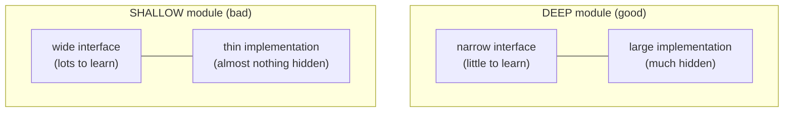
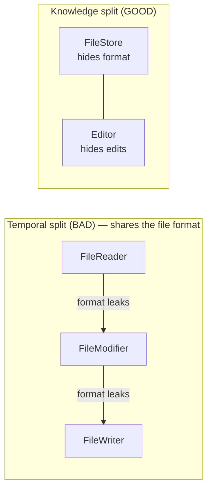

# Abstraction & Information Hiding — Junior Level

> **Level:** Junior — "What's the rule? Show me a clean example."
> **Source:** John Ousterhout, *A Philosophy of Software Design* (deep modules, information hiding, "complexity = dependencies + obscurity").

---

## Table of Contents

1. [The one idea behind this whole chapter](#the-one-idea-behind-this-whole-chapter)
2. [Real-world analogy](#real-world-analogy)
3. [Rule 1 — Make modules deep](#rule-1--make-modules-deep)
4. [Rule 2 — Hide the design decision, not just the data](#rule-2--hide-the-design-decision-not-just-the-data)
5. [Rule 3 — An interface should be simpler than its implementation](#rule-3--an-interface-should-be-simpler-than-its-implementation)
6. [Rule 4 — Pull complexity downward](#rule-4--pull-complexity-downward)
7. [Rule 5 — Don't leak internals through the interface](#rule-5--dont-leak-internals-through-the-interface)
8. [Common Mistakes](#common-mistakes)
9. [Test Yourself](#test-yourself)
10. [Cheat Sheet](#cheat-sheet)
11. [Summary](#summary)
12. [Further Reading](#further-reading)
13. [Related Topics](#related-topics)

---

## The one idea behind this whole chapter

Ousterhout reduces all of software complexity to two sources:

> **Complexity = dependencies + obscurity.**

- **Dependencies** — code that can't be understood or changed in isolation, because changing it forces you to change something else.
- **Obscurity** — important information that isn't obvious, so a reader has to dig to find it.

An **abstraction** is a simplified view of an entity that *omits unimportant detail*. A good abstraction lets you use a module while knowing very little about it — that directly attacks both sources of complexity: fewer things you depend on, fewer things you must know.

The central tool is the **deep module**: a module with a **simple interface** that hides a **substantial implementation**. The deeper the module, the more functionality you get per unit of interface you must learn. Ousterhout's mental model is a rectangle:



The interface is the *cost* (what every caller must learn); the hidden implementation is the *benefit* (work the caller didn't have to do). You want a high benefit-to-cost ratio: **maximize what's hidden, minimize what's exposed.**

---

## Real-world analogy

### The car pedal

To drive a car you learn three controls: a wheel, a gas pedal, a brake. Behind that tiny interface sits an engine, a transmission, fuel injection, anti-lock braking, and thousands of moving parts. You operate enormous complexity through a three-item interface. That is a **deep module** — and it's why almost anyone can learn to drive.

Now imagine a car that exposed every internal decision: a knob for spark timing, a lever for each gear ratio, a dial for brake-line pressure. Same capability, but the interface is now as complicated as the machine. That is a **shallow module** — it hides nothing, so it saves the driver nothing.

The whole chapter is about building the first kind of car, not the second.

---

## Rule 1 — Make modules deep

**Rule:** a module's value is *implementation hidden − interface exposed*. Prefer few modules that each hide a lot over many modules that each hide a little.

A module is **deep** when its interface is much smaller than the functionality behind it. It is **shallow** when the interface is roughly as complex as the implementation — then it adds indirection without buying simplicity.

### Dirty — a shallow wrapper

The classic shallow module forwards a single call and adds nothing. The caller must still know everything the wrapped thing knew.

**Go**

```go
// Shallow: FileStore exposes exactly what os already exposes.
// Every method is a one-line forward — the interface is as wide as the impl.
type FileStore struct{}

func (FileStore) Read(path string) ([]byte, error)  { return os.ReadFile(path) }
func (FileStore) Write(path string, b []byte) error { return os.WriteFile(path, b, 0o644) }
func (FileStore) Delete(path string) error          { return os.Remove(path) }
```

**Java**

```java
// Shallow: each method forwards one call and decides nothing.
class FileStore {
    byte[] read(String path) throws IOException  { return Files.readAllBytes(Path.of(path)); }
    void write(String path, byte[] b) throws IOException { Files.write(Path.of(path), b); }
    void delete(String path) throws IOException  { Files.delete(Path.of(path)); }
}
```

**Python**

```python
# Shallow: a thin skin over the os module that hides no decision.
class FileStore:
    def read(self, path):  return open(path, "rb").read()
    def write(self, path, b): open(path, "wb").write(b)
    def delete(self, path): os.remove(path)
```

A caller of `FileStore` still has to know about paths, file modes, error handling, and the difference between read/write/delete — exactly what `os`/`Files` already required. The wrapper earns nothing.

### Clean — a deep module

A `DocumentStore` hides *where* and *how* documents live. The caller works in terms of document IDs and gets atomic writes, locking, and a storage-location decision for free.

**Go**

```go
// Deep: a 2-method interface hides paths, locking, atomic writes, and layout.
type DocumentStore struct {
    root string
    mu   sync.Mutex
}

func NewDocumentStore(root string) *DocumentStore { return &DocumentStore{root: root} }

func (s *DocumentStore) Save(id string, doc []byte) error {
    s.mu.Lock()
    defer s.mu.Unlock()
    path := s.pathFor(id)                       // hidden: layout decision
    tmp := path + ".tmp"
    if err := os.WriteFile(tmp, doc, 0o600); err != nil {
        return err
    }
    return os.Rename(tmp, path)                  // hidden: atomic write
}

func (s *DocumentStore) Load(id string) ([]byte, error) {
    s.mu.Lock()
    defer s.mu.Unlock()
    return os.ReadFile(s.pathFor(id))
}

func (s *DocumentStore) pathFor(id string) string {
    // hidden: sharding by hash prefix so directories stay small
    return filepath.Join(s.root, id[:2], id+".doc")
}
```

**Java**

```java
// Deep: callers say "save this document"; everything else is hidden.
final class DocumentStore {
    private final Path root;
    DocumentStore(Path root) { this.root = root; }

    synchronized void save(String id, byte[] doc) throws IOException {
        Path path = pathFor(id);
        Files.createDirectories(path.getParent());
        Path tmp = path.resolveSibling(path.getFileName() + ".tmp");
        Files.write(tmp, doc);
        Files.move(tmp, path, StandardCopyOption.ATOMIC_MOVE);  // hidden: atomicity
    }

    synchronized byte[] load(String id) throws IOException {
        return Files.readAllBytes(pathFor(id));
    }

    private Path pathFor(String id) {                            // hidden: layout
        return root.resolve(id.substring(0, 2)).resolve(id + ".doc");
    }
}
```

**Python**

```python
# Deep: two public methods; sharding, temp-file swap, and locking are hidden.
class DocumentStore:
    def __init__(self, root):
        self._root = pathlib.Path(root)
        self._lock = threading.Lock()

    def save(self, doc_id, doc: bytes) -> None:
        with self._lock:
            path = self._path_for(doc_id)
            path.parent.mkdir(parents=True, exist_ok=True)
            tmp = path.with_suffix(".tmp")
            tmp.write_bytes(doc)
            tmp.replace(path)                       # hidden: atomic rename

    def load(self, doc_id) -> bytes:
        with self._lock:
            return self._path_for(doc_id).read_bytes()

    def _path_for(self, doc_id):                    # hidden: sharded layout
        return self._root / doc_id[:2] / f"{doc_id}.doc"
```

The interface is `save` / `load`. Behind it sit decisions a caller never has to think about: directory layout, sharding, temp-file-then-rename atomicity, and locking. If you later move storage to S3, **no caller changes**. That is depth.

---

## Rule 2 — Hide the design decision, not just the data

**Rule:** the most important thing a module hides is a **design decision** — a choice that, if exposed, would force callers to change when it changes. Each significant decision should be the secret of exactly **one** module.

When the *same* decision shows up in two modules, you have **information leakage**: change the decision and you must edit both places, in sync, forever. That is a dependency you created for free.

### Dirty — the date format decision leaks everywhere

Every caller "knows" the storage format is `YYYY-MM-DD`. The decision is duplicated across the codebase.

**Python**

```python
# The "dates are stored as YYYY-MM-DD strings" decision leaks into every caller.
def save_user(u):
    db.put(u.id, {"born": u.born.strftime("%Y-%m-%d")})   # decision here

def load_user(row):
    born = datetime.strptime(row["born"], "%Y-%m-%d").date()  # ...and here
    return User(row["id"], born)

def report(row):
    born = datetime.strptime(row["born"], "%Y-%m-%d").date()  # ...and here again
    ...
```

Change the stored format to ISO-8601 with time, and you must find and fix every `"%Y-%m-%d"`. Miss one and you get silent corruption.

### Clean — the decision lives in one module

**Python**

```python
# The format is the secret of one module. Callers never see the string.
class DateField:
    _FORMAT = "%Y-%m-%d"            # the ONE place this decision lives

    @classmethod
    def encode(cls, d) -> str:  return d.strftime(cls._FORMAT)

    @classmethod
    def decode(cls, s: str):    return datetime.strptime(s, cls._FORMAT).date()

def save_user(u):  db.put(u.id, {"born": DateField.encode(u.born)})
def load_user(row): return User(row["id"], DateField.decode(row["born"]))
```

**Java**

```java
// One module owns the wire format; callers traffic in LocalDate only.
final class DateField {
    private static final DateTimeFormatter FORMAT = DateTimeFormatter.ISO_LOCAL_DATE;
    static String encode(LocalDate d) { return d.format(FORMAT); }
    static LocalDate decode(String s) { return LocalDate.parse(s, FORMAT); }
}
```

**Go**

```go
// The layout constant is unexported and used nowhere else.
const dateLayout = "2006-01-02"

func EncodeDate(d time.Time) string         { return d.Format(dateLayout) }
func DecodeDate(s string) (time.Time, error) { return time.Parse(dateLayout, s) }
```

Now switching to ISO-8601-with-time is a **one-line change** in one file. No caller knew the format existed, so no caller breaks. The decision was *hidden*, not just the bytes.

> **Litmus test for leakage:** search the codebase for the literal that encodes a decision (a format string, a magic number, a column name). If it appears in more than one module, the decision has leaked.

---

## Rule 3 — An interface should be simpler than its implementation

**Rule:** measure an interface by *how little the caller must know*. A good abstraction omits detail the caller doesn't need; a **leaky** interface forces the caller to learn the implementation anyway.

A common leak: returning internal types, requiring callers to call methods in a fixed order, or exposing flags that only make sense if you know the internals.

### Dirty — a leaky interface

**Java**

```java
// Leaky: the caller must (1) know to call open() first, (2) know to flush(),
// (3) know to close(), and (4) handle the internal Buffer type. The "interface"
// is the entire implementation, exposed.
class CsvWriter {
    Buffer buffer;                          // internal type, public
    void open(String path) { ... }
    void flush() { ... }                    // caller must remember to call this
    void close() { ... }
    Buffer getBuffer() { return buffer; }   // hands out an internal
    void writeRaw(String csvLine) { ... }   // caller must format CSV themselves
}

// Every caller now knows the lifecycle AND the CSV escaping rules:
CsvWriter w = new CsvWriter();
w.open("out.csv");
w.writeRaw("\"" + name.replace("\"", "\"\"") + "\",42");  // caller does escaping!
w.flush();
w.close();
```

The caller re-implements CSV escaping and manages a four-step lifecycle. The interface taught them nothing.

### Clean — a narrow interface that omits the detail

**Java**

```java
// Clean: one obvious way to use it; escaping and lifecycle are hidden.
final class CsvWriter implements AutoCloseable {
    private final BufferedWriter out;
    CsvWriter(Path path) throws IOException { this.out = Files.newBufferedWriter(path); }

    void writeRow(Object... cells) throws IOException {
        out.write(Arrays.stream(cells).map(this::escape).collect(joining(",")));
        out.newLine();
    }

    private String escape(Object cell) {                // hidden: CSV rules
        String s = String.valueOf(cell);
        return s.contains(",") || s.contains("\"")
            ? "\"" + s.replace("\"", "\"\"") + "\""
            : s;
    }

    @Override public void close() throws IOException { out.close(); }  // flush hidden
}

// Caller: no escaping, no flush, no buffer, no ordering rules.
try (CsvWriter w = new CsvWriter(Path.of("out.csv"))) {
    w.writeRow(name, 42);
}
```

**Go**

```go
// Clean: WriteRow is the whole interface; escaping and flushing are internal.
type CsvWriter struct{ w *bufio.Writer; f *os.File }

func NewCsvWriter(path string) (*CsvWriter, error) {
    f, err := os.Create(path)
    if err != nil {
        return nil, err
    }
    return &CsvWriter{w: bufio.NewWriter(f), f: f}, nil
}

func (c *CsvWriter) WriteRow(cells ...string) error {
    for i, cell := range cells {
        if i > 0 {
            c.w.WriteByte(',')
        }
        c.w.WriteString(escapeCSV(cell)) // hidden
    }
    return c.w.WriteByte('\n')
}

func (c *CsvWriter) Close() error { c.w.Flush(); return c.f.Close() } // flush hidden
```

**Python**

```python
# Clean: a context manager hides open/flush/close; write_row hides escaping.
class CsvWriter:
    def __init__(self, path): self._f = open(path, "w", newline="")
    def __enter__(self): return self
    def __exit__(self, *exc): self._f.close()        # flush + close hidden

    def write_row(self, *cells):
        self._f.write(",".join(self._escape(str(c)) for c in cells) + "\n")

    @staticmethod
    def _escape(s):                                  # hidden: CSV rules
        return f'"{s.replace(chr(34), chr(34)*2)}"' if "," in s or '"' in s else s

with CsvWriter("out.csv") as w:
    w.write_row(name, 42)
```

The clean version reduces what the caller must know to *one method and one lifecycle construct*. The CSV escaping rules — genuinely tricky — are hidden inside, defined once, tested once.

---

## Rule 4 — Pull complexity downward

**Rule:** when there is unavoidable complexity, it is more important for a module to have a **simple interface** than a simple implementation. The module author should **absorb** complexity so that the *N* callers don't each have to.

If a piece of work is hard, do it *once*, inside the module — not once in every caller. A small amount of extra effort inside the module saves effort in many call sites and prevents each caller from getting it subtly wrong.

### Dirty — complexity pushed up onto every caller (config leak)

A configuration parameter forces every caller to make a decision the module is best placed to make.

**Go**

```go
// The module refuses to decide a sensible buffer size, so EVERY caller must.
func ReadAll(path string, bufferSize int) ([]byte, error) { ... }

// Now every call site carries the decision — and they disagree:
a, _ := ReadAll("a.txt", 4096)
b, _ := ReadAll("b.txt", 65536)   // why different? nobody knows
c, _ := ReadAll("c.txt", 0)       // someone passed a bug
```

The "flexibility" of `bufferSize` is a decision leaked onto callers who have no idea what value is right. Ninety-nine percent want the default.

### Clean — the module absorbs the decision

**Go**

```go
// The module picks a good default; complexity stays down here, with the expert.
func ReadAll(path string) ([]byte, error) {
    const bufferSize = 64 * 1024            // the author's informed decision
    // ...read using bufferSize...
}

// (If real tuning is ever needed, expose it as an OPTIONAL override, not a
// required parameter, so the common caller stays simple.)
func ReadAllWithBuffer(path string, bufferSize int) ([]byte, error) { ... }
```

**Java**

```java
// Common path takes no tuning knob; the module owns the default.
byte[] readAll(Path path) throws IOException {
    return readAll(path, 64 * 1024);     // overload absorbs the decision
}
byte[] readAll(Path path, int bufferSize) throws IOException { ... }  // escape hatch
```

**Python**

```python
# Sensible default lives in the module, not in every call site.
def read_all(path, buffer_size=64 * 1024):   # caller usually omits it
    ...
```

> **Rule of thumb for config parameters:** before exposing a knob, ask *"is the module in a better position than the caller to choose this value?"* Usually it is. Pull the decision down; offer an override only if a real need exists.

---

## Rule 5 — Don't leak internals through the interface

**Rule:** expose the *minimum* surface. Public fields, public-but-internal helper methods, and leaked internal types all become things callers can depend on — and therefore things you can never change freely.

This is **over-exposure**. The default visibility of everything that isn't part of the abstraction should be private/unexported.

### Dirty — internals are public

**Java**

```java
// Over-exposed: callers can mutate the list, see the cache, and depend on order.
class ShoppingCart {
    public List<Item> items = new ArrayList<>();   // anyone can clear() it
    public double cachedTotal;                      // internal cache exposed
    public boolean totalIsStale;                    // implementation flag exposed
}

// A distant caller does this and corrupts the invariant:
cart.items.add(item);          // forgot to mark totalIsStale = true
cart.cachedTotal = 9999;       // just... overwrites the cache
```

Now the cache invariant ("`cachedTotal` is valid iff `!totalIsStale`") is everyone's responsibility — i.e. no one's. The class can't guarantee anything.

### Clean — internals hidden, invariant protected

**Java**

```java
// The cache is the class's secret; callers see only intent-revealing methods.
final class ShoppingCart {
    private final List<Item> items = new ArrayList<>();
    private double cachedTotal;
    private boolean totalIsStale = true;

    void add(Item item) { items.add(item); totalIsStale = true; }   // invariant kept
    List<Item> items()  { return List.copyOf(items); }              // read-only view

    double total() {
        if (totalIsStale) { cachedTotal = recompute(); totalIsStale = false; }
        return cachedTotal;
    }
    private double recompute() { return items.stream().mapToDouble(Item::price).sum(); }
}
```

**Go**

```go
// Unexported fields; the cache invariant is enforced in one place.
type ShoppingCart struct {
    items       []Item
    cachedTotal float64
    stale       bool
}

func (c *ShoppingCart) Add(it Item) { c.items = append(c.items, it); c.stale = true }

func (c *ShoppingCart) Items() []Item { return slices.Clone(c.items) } // defensive copy

func (c *ShoppingCart) Total() float64 {
    if c.stale {
        c.cachedTotal, c.stale = c.recompute(), false
    }
    return c.cachedTotal
}

func (c *ShoppingCart) recompute() float64 { /* sum prices */ }
```

**Python**

```python
# Underscore-prefixed internals; the cache is never exposed.
class ShoppingCart:
    def __init__(self):
        self._items = []
        self._cached_total = 0.0
        self._stale = True

    def add(self, item):
        self._items.append(item)
        self._stale = True            # invariant maintained in one place

    @property
    def items(self):
        return tuple(self._items)     # read-only view

    @property
    def total(self):
        if self._stale:
            self._cached_total = sum(i.price for i in self._items)
            self._stale = False
        return self._cached_total
```

Because the cache is private, the class is free to *delete* it later (e.g. switch to always-recompute) without breaking a single caller. Hidden internals = freedom to change.

---

## Common Mistakes

These are the anti-patterns this chapter exists to prevent. Each one is a failure of depth or hiding.

| Anti-pattern | What it looks like | Why it hurts |
|---|---|---|
| **Shallow module** | Interface nearly as complex as the implementation it wraps | Earns no leverage — caller still learns everything |
| **Information leakage** | The same decision (format, schema, magic number) encoded in 2+ modules | They must change together forever — a hidden dependency |
| **Temporal decomposition** | Splitting code by *order of execution* (`Step1`, `Step2`, `Step3`) instead of by hidden knowledge | The split crosses no real boundary; each piece needs the others |
| **Pass-through method** | A method that only forwards to another layer, adding nothing | Indirection without abstraction; widens the interface for free |
| **Leaky config parameter** | A required knob the module is best placed to set | Pushes a decision up onto N callers who guess (and disagree) |
| **Over-exposure** | Public fields, public helpers, returned internal types | Anything public becomes a dependency you can't change |
| **"Classitis"** | A swarm of tiny classes that each hide almost nothing | Total interface to learn grows; depth per class is near zero |
| **Generic names** | `Manager`, `Util`, `Helper`, `Data`, `Info`, `Processor` | The name hides no coherent concept — usually a junk drawer |
| **Conjoined methods** | Two methods you can't understand or change in isolation | A dependency masquerading as a decomposition |

### Temporal decomposition — the subtle one

Splitting by *time* feels natural but usually produces shallow, conjoined modules. Suppose you read a file, modify it, and write it back:



The "bad" split breaks at execution boundaries — `Reader`, `Modifier`, `Writer` — but all three must know the **same file format**, so the decision leaks across all three. The "good" split groups by *what each unit hides*: one module owns the format (read+write together), another owns editing. Decompose by **knowledge hidden, not by order of execution.**

---

## Test Yourself

<details>
<summary>1. In one sentence, what makes a module "deep"?</summary>

A module is deep when its **interface is much smaller than the functionality it hides** — callers learn a little but get a lot, giving a high benefit-to-cost ratio. The opposite, a shallow module, has an interface nearly as complex as its implementation, so it earns no leverage.
</details>

<details>
<summary>2. You see the literal format string <code>"%Y-%m-%d"</code> in three different files. What anti-pattern is that, and what's the fix?</summary>

**Information leakage** — the same design decision (the stored date format) is exposed in three modules that now must change together. Fix: make the format the secret of **one** module (e.g. a `DateField.encode/decode` pair), so every other module traffics in `date` objects and never sees the string. Then changing the format is a one-line edit in one place.
</details>

<details>
<summary>3. Why is a method that just calls another method (a pass-through) usually a bad sign?</summary>

A **pass-through method** adds indirection without abstraction: it widens the interface (one more thing to learn) while hiding nothing and deciding nothing. It makes the module *shallower*. Either the method should add real value (transform inputs, enforce an invariant, choose a default) or it shouldn't exist — let the caller talk to the inner layer directly, or merge the layers.
</details>

<details>
<summary>4. A function takes a required <code>bufferSize int</code> parameter. Most callers have no idea what to pass. What's wrong and what's the rule?</summary>

It's a **leaked configuration decision**: the module is in a far better position than its callers to choose a good buffer size, but it has pushed that decision up onto every caller. The rule is **pull complexity downward** — give the module a sensible default and absorb the decision internally. If genuine tuning is ever needed, expose it as an *optional* override (overload, default arg, or functional option), not a required parameter.
</details>

<details>
<summary>5. Your teammate proposes splitting a feature into <code>StepOneService</code>, <code>StepTwoService</code>, <code>StepThreeService</code> matching the execution order. Why be cautious?</summary>

That's **temporal decomposition** — splitting by *order of execution* rather than by *knowledge hidden*. The steps usually share the same data and decisions, so those leak across all three classes and the classes become **conjoined** (you can't understand one without the others). Decompose by what each unit *hides* instead: group code that shares a secret (a format, a schema, an algorithm) into one module, even if it spans several execution steps.
</details>

<details>
<summary>6. Is making a field <code>public</code> "just for the test" a problem?</summary>

Yes — it's **over-exposure**. Once a field is public, it becomes part of the interface and any code can depend on it, so you lose the freedom to change or remove it later, and you can no longer guarantee the class's invariants. Test through the public behavior, or expose a narrow read-only accessor, but keep the internal representation private by default.
</details>

<details>
<summary>7. A class is named <code>OrderDataManager</code>. What does the name tell you, and why is that a smell?</summary>

The name is built from **generic words** (`Data`, `Manager`) that describe no coherent concept — they're a sign the class is a junk drawer that "manages" loosely related things and hides no single clear abstraction. A good module name names the *thing it hides* (`OrderRepository`, `OrderPricer`, `OrderValidator`). If you can't name it precisely, the abstraction probably isn't coherent yet.
</details>

<details>
<summary>8. Wrapping every standard-library call in a one-line method of your own — good encapsulation or a mistake?</summary>

Usually a mistake: it produces **shallow modules**. If your wrapper's interface is as wide and as detailed as the library it wraps (same parameters, same error model, same number of methods), the caller still has to know everything the library required — you've added a layer that hides nothing. Wrap a library only when you're hiding a *decision* (which library, what defaults, what error translation) behind a *narrower* interface.
</details>

---

## Cheat Sheet

| Rule | One-liner |
|---|---|
| **Complexity** | `complexity = dependencies + obscurity`. Reduce both. |
| **Deep modules** | Simple interface, substantial hidden implementation. Maximize hidden / exposed. |
| **Hide decisions** | Each design decision is the secret of exactly *one* module. |
| **Simple interfaces** | Measure the interface by *how little the caller must know*. |
| **Pull complexity down** | The author absorbs the hard part so N callers don't repeat it. |
| **Minimal surface** | Default to private/unexported. Public = a dependency you can't change. |
| **Decompose by knowledge** | Split by *what each unit hides*, never by *order of execution*. |
| **Name the abstraction** | If the best name is `Manager`/`Util`/`Data`, the abstraction isn't coherent. |

**Quick checks before you commit a module:**
- Could a caller use this knowing *only* the method names and docs? (depth)
- Does any decision in here also appear in another file? (leakage)
- Is anything `public` that callers don't actually need? (over-exposure)
- Does any method just forward a call? (pass-through)
- Can each method be understood alone? (no conjoining)

---

## Summary

- All complexity comes from **dependencies** (things that must change together) and **obscurity** (important things that aren't obvious). Abstraction fights both.
- An **abstraction** is a simplified view that omits unimportant detail; a good one lets callers know less.
- The core technique is the **deep module**: a *simple interface* over a *substantial implementation*. Maximize what's hidden, minimize what's exposed.
- **Hide design decisions**, not just data — each decision should be the secret of one module, or it leaks and creates a dependency.
- An interface should be **simpler than its implementation**; a leaky interface that forces callers to learn the internals earns nothing.
- **Pull complexity downward**: the module author absorbs the hard part — including sensible defaults — so callers stay simple.
- Keep the **surface minimal**: anything public is a dependency you can never freely change.
- Watch for the anti-patterns: shallow modules, information leakage, temporal decomposition, pass-through methods, leaky config params, over-exposure, classitis, generic names, and conjoined methods.

---

## Further Reading

- John Ousterhout, *A Philosophy of Software Design* — chapters on deep modules, information hiding, and "design it twice." The primary source for this chapter.
- David Parnas, "On the Criteria To Be Used in Decomposing Systems into Modules" (1972) — the original argument that modules should hide *design decisions*.
- [middle.md](middle.md) — when these rules collide in real systems, and how to judge "how deep is deep enough."
- [senior.md](senior.md) — abstraction at architectural scale: API and platform boundaries, layering, and the cost of leaky abstractions across teams.
- This chapter's overview: [../README.md](../README.md).

---

## Related Topics

- [Classes](../09-classes/README.md) — a class is the unit that most often hides a design decision; depth and information hiding apply directly to class design.
- [Functions](../02-functions/README.md) — function signatures are tiny interfaces; the "simple interface, hidden detail" rule starts here.
- [Modules & Packages](../19-modules-and-packages/README.md) — the *physical* counterpart: where boundaries live and how layering is structured (this chapter is about the *quality* of those boundaries).
- [Design Patterns](../../design-patterns/README.md) — many patterns (Facade, Adapter, Strategy) exist precisely to create deep interfaces and hide decisions.
- [Refactoring](../../refactoring/README.md) — the mechanics (Extract Class, Hide Delegate, Encapsulate Field) for turning a shallow, leaky module into a deep one.
- [Anti-Patterns](../../anti-patterns/README.md) — god objects and leaky abstractions catalogued as recognizable failures.
