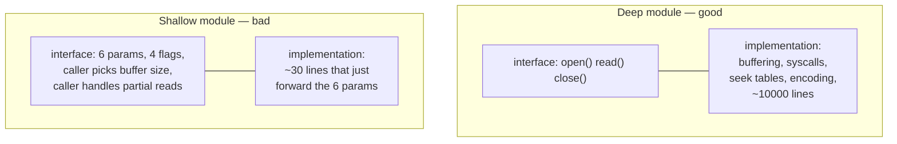

# Abstraction & Information Hiding — Middle Level

> Focus: "Why?" and "When does it bend?" — the trade-offs behind depth, the line between a translating layer and a pass-through, and how information hiding fights with testability in real code.

---

## Table of Contents

1. [Why depth is the whole point](#why-depth-is-the-whole-point)
2. [Trade-off: depth vs. the cost of a too-general interface](#trade-off-depth-vs-the-cost-of-a-too-general-interface)
3. [Trade-off: different layer, different abstraction (pass-through vs. translation)](#trade-off-different-layer-different-abstraction-pass-through-vs-translation)
4. [Trade-off: more classes vs. classitis](#trade-off-more-classes-vs-classitis)
5. [Trade-off: information hiding vs. testability](#trade-off-information-hiding-vs-testability)
6. [Leaky abstractions are sometimes unavoidable — manage them](#leaky-abstractions-are-sometimes-unavoidable--manage-them)
7. [Define errors out of existence](#define-errors-out-of-existence)
8. [Choosing what to expose](#choosing-what-to-expose)
9. [Common Mistakes](#common-mistakes)
10. [Test Yourself](#test-yourself)
11. [Cheat Sheet](#cheat-sheet)
12. [Summary](#summary)
13. [Further Reading](#further-reading)
14. [Related Topics](#related-topics)

---

## Why depth is the whole point

Ousterhout's central image is a module as a rectangle: the **top edge is the interface** (what a caller must know) and the **area is the functionality** (what the module does). A *deep* module is tall and thin — a small interface over a lot of behavior. A *shallow* module is short and wide — an interface almost as complex as its body, so the wrapper buys you nothing.



The metric that matters is the **interface-to-implementation complexity ratio**. A file API like `open / read / write / close` hides an enormous amount (disk layout, caching, scheduling) behind four verbs — the ratio is excellent. A `LinkedList` that forces callers to manipulate node pointers has a terrible ratio: the interface is as hard as doing it yourself.

> **Heuristic:** if reading the interface is nearly as much work as reading the implementation would have been, the module is shallow. Ask "what did the caller *not* have to learn?" If the answer is "not much," you have indirection without abstraction.

This reframes "abstraction" from a vague virtue into a measurable design decision: **maximize what's hidden per unit of interface a caller must absorb.**

---

## Trade-off: depth vs. the cost of a too-general interface

Depth pushes you toward hiding more. But there is a competing pull: an interface that tries to hide *everything for everyone* becomes a configuration nightmare — every caller now has to understand all the knobs you exposed to stay general.

Ousterhout's resolution is the phrase **"somewhat general-purpose."** Design the interface to be general enough that it survives the next few requirements, but specialized enough that today's caller isn't paying for use cases that don't exist yet.

Consider a text editor's buffer:

```go
// Too specialized: the interface mirrors today's exact UI gesture.
func (b *Buffer) DeleteSelectionTriggeredByBackspaceKey() error

// Too general: now every caller is a parser of "operations".
func (b *Buffer) Apply(op Operation, args map[string]any) (Result, error)

// Somewhat general-purpose: a small set of primitives that compose.
func (b *Buffer) Insert(pos Position, text string)
func (b *Buffer) Delete(from, to Position)
```

The middle version hides cursor math, undo bookkeeping, and line indexing — yet the caller only learns `Insert` and `Delete`. Backspace, cut, paste, and macros are all *built on top of* these two without the buffer ever knowing those features exist.

**When generality is wrong:** if you cannot name a second plausible caller, the general interface is speculative. The `Apply(op, map[string]any)` form trades compile-time safety and a readable interface for flexibility nobody asked for. That flexibility has a cost paid on *every* call site forever.

> **Rule of thumb:** prefer a slightly-too-general interface to a tightly-coupled one, but stop the moment generality forces callers to learn concepts that only exist to serve the abstraction itself.

---

## Trade-off: different layer, different abstraction (pass-through vs. translation)

A healthy layered system obeys **"different layer, different abstraction"**: each layer should present a *different* vocabulary than the one below it. The HTTP layer speaks requests and status codes; the service layer speaks `placeOrder(cart)`; the repository speaks rows and SQL. If two adjacent layers use the *same* abstraction, one of them is probably dead weight.

The classic dead-weight smell is the **pass-through method** — a method that does nothing but forward its arguments to another object under a renamed label.

```python
# Pass-through: adds an entry in the call stack and nothing else.
class OrderService:
    def __init__(self, repo: OrderRepository):
        self._repo = repo

    def get_order(self, order_id: str) -> OrderRow:
        return self._repo.get_order(order_id)   # same args, same return, same abstraction
```

Here `OrderService.get_order` and `OrderRepository.get_order` are the *same abstraction at two layers*. The service earns nothing; it just makes you read two files instead of one.

But not every forwarding method is a smell. A **translating layer** is forwarding plus value:

```python
# Translation: different vocabulary in, different vocabulary out.
class OrderService:
    def __init__(self, repo: OrderRepository, clock: Clock):
        self._repo = repo
        self._clock = clock

    def place_order(self, cart: Cart) -> OrderConfirmation:
        row = self._repo.insert(self._to_row(cart, placed_at=self._clock.now()))
        return OrderConfirmation(
            number=row.id,
            eta=self._estimate_delivery(row),
        )
```

This method *changes the abstraction*: it accepts a domain `Cart`, owns the "when is it placed" decision, persists a row, and returns a domain `OrderConfirmation` rather than a raw `OrderRow`. The caller never learns that rows or clocks exist. That is the difference: **a pass-through renames; a translating layer raises the abstraction level.**

| Symptom | Pass-through (smell) | Translating layer (fine) |
|---|---|---|
| Argument types | identical to callee | domain types in, domain types out |
| Return type | forwarded unchanged | mapped / enriched |
| Decisions owned | none | at least one (defaults, timing, policy) |
| If you deleted it | callers call the lower layer directly with no loss | callers would have to learn the lower layer's vocabulary |

> **Test:** delete the method in your head and have callers go straight to the lower layer. If nothing of value is lost, it was a pass-through.

---

## Trade-off: more classes vs. classitis

Decomposition is good — until it isn't. **Classitis** (Ousterhout's term) is the disease of believing that *more, smaller* classes are automatically *better*. Each class carries fixed overhead: a file, a name to learn, a constructor, an interface boundary to cross. A swarm of tiny classes that each hide almost nothing multiplies that overhead while reducing total hidden complexity — the opposite of the goal.

```java
// Classitis: four classes, each one shallow.
class TextDocument {
    private final TextLoader loader;
    private final TextParser parser;
    private final TextTokenizer tokenizer;
    private final TextNormalizer normalizer;
    // every method is a two-line hop between these collaborators
}
```

If `TextLoader` is "ten lines that call `Files.readString`," it is a shallow module wearing a class costume. Folding it back into `TextDocument` *increases* the depth of `TextDocument` and *removes* an interface from the world.

**When more classes is right:** split when each resulting class hides a genuinely independent design decision and you can change one without opening the other. `Tokenizer` deserves its own class if the tokenization rules are substantial and change for different reasons than parsing. The test is not line count — it's **independent secrets**.

> **Diagnostic:** if changing one "responsibility" routinely requires editing three of your tiny classes together, they were never independent — you decomposed along the wrong seam. That's [temporal decomposition or conjoined methods](README.md), not separation of concerns.

This is the precise inverse of the *Large Class* bloater: large class says "this hides too many *unrelated* secrets, split it"; classitis says "you split *related* secrets that should have stayed together." Both are failures to align module boundaries with knowledge boundaries.

---

## Trade-off: information hiding vs. testability

Information hiding says: make internals private so callers can't depend on them. Testability says: I need to reach inside to verify behavior, inject failures, and observe state. These genuinely conflict, and the naive resolutions are both wrong:

- **Wrong fix A — expose everything:** make fields/methods public "for testing." Now production callers couple to internals and the abstraction is gone.
- **Wrong fix B — test only the public surface, internals be damned:** fine in principle, but if a hidden component has rich behavior (a retry policy, a scheduler), testing it solely through ten layers of public API is slow, flaky, and gives terrible failure messages.

The professional resolution is to **design seams instead of opening up internals.** A seam is a place where you can substitute behavior *without* exposing implementation:

```go
// The "secret" (how time advances, how IDs are generated) stays hidden
// behind small injected interfaces — not behind public mutable fields.
type Clock interface{ Now() time.Time }
type IDGen interface{ NewID() string }

type OrderService struct {
    clock Clock
    ids   IDGen
    repo  OrderRepository
}

// Production wiring uses real implementations; tests inject fakes.
// The internals of OrderService remain unexported and unreachable.
func NewOrderService(repo OrderRepository) *OrderService {
    return &OrderService{clock: systemClock{}, ids: uuidGen{}, repo: repo}
}
```

The non-determinism (time, randomness) was *the thing worth hiding from callers but worth controlling from tests*. Making it an injected interface satisfies both: production callers never see it; tests pin it. You hid the *decision* ("we use the system clock") while exposing a *contract* ("something tells me the time").

Rules of thumb for the conflict:

- Test rich hidden components **directly** by giving them their own well-named type with a tight interface — that is, make them deep modules in their own right, then unit-test that module.
- Inject dependencies through **narrow interfaces**, not by widening visibility of fields.
- If you feel forced to make something `public`/exported *only* for a test, that's a signal the design is missing a seam — add the seam, don't drop the wall.
- A genuinely private helper with no independent behavior needs no test of its own; it's covered through the public method that owns it.

> **Spolsky-adjacent caution:** every seam you add is also a small abstraction the rest of the team must understand. Don't carve a seam for a class that has nothing to fake. Over-seaming is classitis aimed at the test suite.

---

## Leaky abstractions are sometimes unavoidable — manage them

**Spolsky's Law of Leaky Abstractions:** *all non-trivial abstractions, to some degree, are leaky.* TCP hides packet loss — until the network is bad enough that the latency leaks through. An ORM hides SQL — until an N+1 query forces you to understand exactly what SQL it generates. A virtual-memory abstraction hides the disk — until a page fault makes a memory access 100,000× slower than the one beside it.

You cannot eliminate leaks; mature engineers **manage** them:

1. **Make the leak observable, not silent.** A repository that hides the database should still surface the query count or a slow-query log, so the leak shows up in metrics before it shows up in an outage.
2. **Document the leak at the interface.** "This iterator is lazy; holding the connection open across the whole loop" is a leak the caller *must* know. Hiding it makes the leak worse, not better.
3. **Provide an escape hatch, deliberately.** A good ORM lets you drop to raw SQL for the 5% of queries that need it. The escape hatch *is* the managed leak — bounded, named, and visible.
4. **Don't leak the leak everywhere.** If one query needs raw SQL, expose *that one* query's escape, not a public `getRawConnection()` that lets every caller bypass the abstraction.

```python
# Managed leak: the abstraction is sealed by default, with one explicit valve.
class UserRepo:
    def find_active(self) -> list[User]: ...          # the clean, deep interface

    def execute_raw(self, sql: str, params: tuple) -> list[Row]:
        """Escape hatch for the rare query the ORM can't express well.
        Bypasses mapping and validation — use only in the reporting module."""
        ...
```

> **The trade-off:** a *zero*-leak abstraction usually doesn't exist, and chasing it produces a bloated interface trying to anticipate every leak. A *managed*-leak abstraction stays deep and simple for the common case and gives a documented valve for the rare one.

---

## Define errors out of existence

The most powerful way to reduce the complexity an abstraction exposes is to **make error cases impossible by design**, so neither the implementation nor the caller has to handle them. Ousterhout calls this *defining errors out of existence*. Fewer exceptions in the interface means fewer things every caller must learn and guard against.

Classic example — deleting a file from a directory listing:

```python
# Throws if the key is missing → every caller writes a try/except.
def remove(self, key: str) -> None:
    if key not in self._items:
        raise KeyError(key)
    del self._items[key]

# Error defined out of existence: "remove" means "ensure it's gone".
# Removing something already absent is success, not an error.
def remove(self, key: str) -> None:
    self._items.pop(key, None)
```

The second version is idempotent. The desired end state (the key is absent) is reached either way, so there's nothing for the caller to handle. This isn't "swallowing errors" — it's **redefining what counts as an error** so the not-found case is a normal success.

Other moves in the same family:

- **Make the type carry the guarantee.** A `NonEmptyList<T>` removes "empty list" as a runtime error — the type system forbids it, so no caller checks.
- **Pick a defaulting return over an exception** when a sensible default exists: `getOrDefault(key, fallback)` instead of `get` that throws.
- **Mask the error in the right layer.** A network client can retry transient failures internally so callers never see them — the error is defined out of *the caller's* existence even if it still happens internally.

> **Where it bends:** don't define *real* errors out of existence. "Payment declined" must surface — hiding it is a correctness bug, not a clean abstraction. The technique applies to errors that have a natural, safe interpretation as success or a default. If pretending it succeeded would mislead the caller, it's a real error: expose it (see [`../error-handling-patterns`](README.md) discussion in the chapter README).

---

## Choosing what to expose

Information hiding is fundamentally a series of **inclusion decisions**: every name you make public is a promise you must keep and a thing every reader must learn. Default to hidden; expose deliberately.

```java
public final class RateLimiter {
    // Hidden: the algorithm, the window math, the storage. Callers never learn these.
    private final long capacity;
    private final long refillPerSec;
    private long tokens;
    private long lastRefill;

    // Exposed: one verb that answers the only question a caller has.
    public boolean tryAcquire() { /* ... */ }
}
```

Guidelines:

- **Expose the question, hide the algorithm.** Callers want `tryAcquire()`; they do not want `capacity`, `refillPerSec`, or the token-bucket math. If you later switch to a sliding-window algorithm, no caller changes.
- **Keep configuration a constructor decision, not a per-call parameter.** A *configuration parameter that leaks a decision* — like forcing every `tryAcquire(capacity, refillRate)` call to re-supply the policy — pushes a decision onto callers that the module is best placed to make once.
- **Don't leak internal types.** If a public method returns an internal `TokenBucketState`, that type is now public whether you meant it or not. Return a domain type or a primitive.
- **Generic names are a red flag for over-exposure.** A class named `Manager`, `Util`, `Helper`, or `Data` rarely hides a coherent secret — its grab-bag of public methods is the tell. A precise name (`RateLimiter`, `RetryPolicy`) forces a coherent interface.

> **The exposure test:** for each public member, ask "would a caller's code break if I changed how this works internally?" If yes, you've exposed an implementation detail, not an abstraction.

---

## Common Mistakes

1. **Counting indirection as abstraction.** Adding a layer that forwards calls feels like "good architecture." If the layer doesn't change the abstraction, it's a pass-through tax — more files, more hops, zero hidden complexity.

2. **Splitting by execution order ("temporal decomposition").** Creating `RequestReader`, `RequestProcessor`, `ResponseWriter` mirrors the *sequence* of work, not the *knowledge* each unit hides — so request-format knowledge ends up smeared across all three. Split by secret, not by step.

3. **Making fields public "just for tests."** This trades a permanent design wall for a temporary test convenience. Add a seam (injected interface) instead.

4. **Chasing a zero-leak abstraction.** Trying to hide every possible leak (every timeout, every retry, every backend quirk) bloats the interface back toward the implementation's complexity. Manage the leak; don't pretend it isn't there.

5. **Over-generalizing on speculation.** A `map[string]any` "operation" interface or a plugin system with one plugin is generality paying rent for tenants who never arrive. Build *somewhat* general-purpose; generalize again when the second real caller appears.

6. **Classitis disguised as Single Responsibility.** Splitting a cohesive deep module into five shallow ones because "each class should do one thing" misreads the rule — the goal is *one coherent secret per module*, which can be substantial. Five shallow classes hide less, total, than one deep one.

7. **Exposing internal types through public signatures.** A public method returning an internal DTO silently makes that DTO part of your API. Audit return and parameter types, not just access modifiers.

---

## Test Yourself

1. **A service method takes a `dto`, calls `repo.save(dto)`, and returns `repo.save`'s result unchanged. Smell or not?**

<details><summary>Answer</summary>

A pass-through smell. Same argument type in, same return out, no decision owned — it's the *same abstraction at two layers*. Either delete it and let callers use the repo, or make it earn its place by translating to/from domain types and owning a decision (validation, timestamping, mapping). The test: if deleting it loses nothing, it was a pass-through.

</details>

2. **You need to verify retry behavior, so you make the `retryCount` field public to assert on it. What's the better move?**

<details><summary>Answer</summary>

Don't widen visibility — design a seam. Inject the retry *policy* (or a clock you control) through a narrow interface, and either assert via the observable outcome (number of calls a fake backend received) or unit-test the retry policy as its own deep module. Making a field public for a test couples production callers to an internal and signals a missing seam.

</details>

3. **Is `interface Operation { execute(args: map[string]any) }` a deep or shallow abstraction?**

<details><summary>Answer</summary>

Shallow, and over-general. The interface is tiny in *name* but hides almost nothing — every caller must know the magic string keys and value types in the map, which is exactly the implementation knowledge a good interface hides. It also discards compile-time checking. A set of named, typed methods would hide more and demand less. Generality here costs every call site.

</details>

4. **Your ORM hides SQL, but one report needs a hand-tuned query. How do you keep the abstraction?**

<details><summary>Answer</summary>

Manage the leak with a deliberate, bounded escape hatch: a single `execute_raw`/native-query method documented as bypassing the mapping layer, used only in the reporting module. Don't expose a general `getConnection()` that lets *every* caller bypass the abstraction — that turns one managed leak into a hole. The escape hatch *is* the managed leak: named, visible, scoped.

</details>

5. **`cache.remove(key)` throws `KeyNotFound` when the key is absent. Improve the interface.**

<details><summary>Answer</summary>

Define the error out of existence: make `remove` mean "ensure the key is absent." Removing a missing key becomes success (idempotent), so no caller writes a try/except for a case that has a natural success interpretation. This removes an exception from the interface that every caller would otherwise have to learn and guard. (Contrast: don't do this for *real* errors like "payment declined.")

</details>

6. **A teammate splits `Parser` into `Lexer`, `TokenReader`, `TokenBuffer`, `ParseStateMachine` — but every parsing change touches all four. Good decomposition?**

<details><summary>Answer</summary>

No — that's classitis plus conjoined methods. If one logical change routinely edits all four, they don't hide *independent* secrets; the seam is in the wrong place. The split added four interfaces to learn and four files to open while reducing total hidden complexity. Fold the conjoined pieces back into one deep `Parser`, and split only along a boundary where one side can change without opening the other.

</details>

7. **When is a "general-purpose" interface a mistake rather than future-proofing?**

<details><summary>Answer</summary>

When you cannot name a concrete second caller. Generality has an ongoing cost paid at every call site (more concepts, weaker typing, more configuration). "Somewhat general-purpose" — general enough to absorb the next likely requirement, specialized enough that today's caller pays nothing for hypothetical ones — is the sweet spot. Speculative generality is a liability; you can always generalize again when the second real use case shows up.

</details>

8. **How do you tell information *hiding* from information *leakage*?**

<details><summary>Answer</summary>

Hiding = a design decision lives in exactly one module; changing it touches one place. Leakage = the same decision is embedded in two or more modules that must then change together (e.g., a file format known to both the reader and an unrelated writer). The diagnostic for leakage is "to change X, I must edit modules that don't depend on each other." That coupling is the cost the abstraction was supposed to prevent.

</details>

---

## Cheat Sheet

| Question | If yes → | Action |
|---|---|---|
| Is the interface nearly as complex as the body? | Shallow module | Hide more, or inline the wrapper |
| Does a method forward with the same types and own no decision? | Pass-through | Delete it or make it translate |
| Do adjacent layers use the same vocabulary? | Layer redundancy | Collapse one layer |
| Does one logical change edit several tiny classes? | Classitis / conjoined | Merge along the real seam |
| Am I making something public only for a test? | Missing seam | Inject a narrow interface instead |
| Am I trying to hide *every* possible leak? | Over-engineering | Manage the leak: observe + document + one escape hatch |
| Does a "not found"/default case have a safe success reading? | Removable error | Define the error out of existence |
| Would callers break if I changed this member's internals? | Over-exposure | Make it private; return domain types |
| Can I name a second concrete caller for this generality? | If no | Build *somewhat* general-purpose only |

**One-line tests**
- *Depth:* "What did the caller *not* have to learn?" — if "not much," it's shallow.
- *Pass-through:* "If I delete this, do callers lose anything?" — if no, it was a tax.
- *Exposure:* "Would changing the internals break a caller?" — if yes, it's not hidden.
- *Generality:* "Who is the second caller?" — if you can't name one, don't generalize yet.

---

## Summary

- **Depth is the goal:** maximize hidden complexity per unit of interface. Track the interface-to-implementation complexity ratio as a design heuristic, not the class/line count.
- **Generality has a cost paid at every call site.** Aim for *somewhat* general-purpose — survives the next requirement, doesn't tax callers for hypothetical ones.
- **"Different layer, different abstraction."** A pass-through renames; a translating layer raises the abstraction level and owns a decision. Keep the latter, delete the former.
- **More classes ≠ better.** Classitis splits cohesive secrets into shallow shells. Split only along independent secrets, not execution order.
- **Information hiding fights testability — resolve it with seams, not public fields.** The thing worth hiding from callers (time, randomness, policy) is often exactly what tests must control; inject it through a narrow interface.
- **All non-trivial abstractions leak (Spolsky's Law).** Don't chase zero leaks; make the leak observable, document it, and provide one bounded escape hatch.
- **Define errors out of existence** where a not-found/default case has a safe success interpretation — but never hide *real* errors.
- **Default to hidden; expose deliberately.** Generic names (`Manager`, `Util`, `Helper`, `Data`) and leaked internal types are over-exposure tells.

---

## Further Reading

- John Ousterhout, *A Philosophy of Software Design* — deep modules, "define errors out of existence," "different layer different abstraction," classitis, "design it twice."
- Joel Spolsky, *The Law of Leaky Abstractions* — why every non-trivial abstraction leaks and what it costs.
- David Parnas, *On the Criteria To Be Used in Decomposing Systems into Modules* — the origin of information hiding: decompose by secrets, not by flowchart.
- Michael Feathers, *Working Effectively with Legacy Code* — seams as the disciplined alternative to exposing internals for tests.

---

## Related Topics

- [`junior.md`](junior.md) — the definitions and the basic rules (deep vs. shallow, what to hide).
- [`senior.md`](senior.md) — abstraction at architecture scale: module boundaries, API evolution, and platform-level information hiding.
- [Chapter README](README.md) — the positive rules and the full anti-pattern list.
- [Classes](../09-classes/README.md) — class-level cohesion and the encapsulation that backs information hiding.
- [Modules & Packages](../19-modules-and-packages/README.md) — the physical/layering counterpart to this chapter's "quality of abstraction" view.
- [Design Patterns](../../design-patterns/README.md) — Facade, Adapter, and Strategy as concrete tools for deepening interfaces and adding seams.
- [Refactoring](../../refactoring/README.md) — Extract Class, Hide Delegate, and Remove Middle Man as the mechanics for fixing shallow modules and pass-throughs.