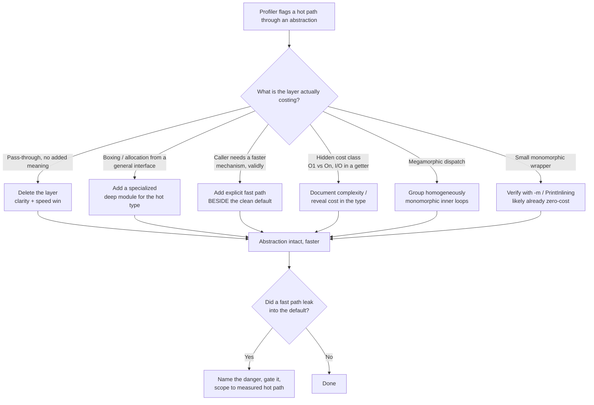

# Abstraction & Information Hiding — Optimize & Reconcile

> Clean abstraction and raw speed are usually allies, not enemies. Deep modules — a simple interface over substantial functionality — generally have *fewer* layers than the shallow ones they replace, so the same advice that makes code clear also removes dispatch, indirection, and allocation. The hard cases are the minority: when a layer hides a cost the caller must reason about, when a general interface forces boxing, or when someone genuinely needs the fast path below the clean default. The discipline here is to *measure the layer*, keep the clean default, and add the fast path as an explicit escape hatch — never to shatter the abstraction because a profiler blinked.

---

## Table of Contents

1. [Counting the layers: deep modules have fewer, not more](#scenario-1--counting-the-layers-deep-modules-have-fewer-not-more)
2. [The pass-through layer is pure overhead](#scenario-2--the-pass-through-layer-is-pure-overhead)
3. [A clean default plus an explicit fast path (`bufio` pattern)](#scenario-3--a-clean-default-plus-an-explicit-fast-path-bufio-pattern)
4. [The interface that hides O(1) vs O(n) — Hyrum's Law of performance](#scenario-4--the-interface-that-hides-o1-vs-on--hyrums-law-of-performance)
5. [A general-purpose interface forces boxing (Go `interface{}`, Java generics)](#scenario-5--a-general-purpose-interface-forces-boxing)
6. [Batch API beside the simple one](#scenario-6--batch-api-beside-the-simple-one)
7. [Zero-cost abstraction: inlining flattens clean layers](#scenario-7--zero-cost-abstraction-inlining-flattens-clean-layers)
8. [Information hiding vs exposing a cost-relevant detail](#scenario-8--information-hiding-vs-exposing-a-cost-relevant-detail)
9. [Iterator abstraction allocates per element (Python)](#scenario-9--iterator-abstraction-allocates-per-element-python)
10. [Defensive copy at the abstraction boundary](#scenario-10--defensive-copy-at-the-abstraction-boundary)
11. [Virtual dispatch in the hot loop — devirtualize without leaking](#scenario-11--virtual-dispatch-in-the-hot-loop--devirtualize-without-leaking)
12. [Lazy initialization hidden behind a getter](#scenario-12--lazy-initialization-hidden-behind-a-getter)
13. [The "raw escape hatch" that becomes the only path](#scenario-13--the-raw-escape-hatch-that-becomes-the-only-path)

---

### Scenario 1 — Counting the layers: deep modules have fewer, not more

**Scenario.** A team believes "clean code is slow because of all the layers." Their `OrderService` reads an order through five shallow types: `OrderController → OrderFacade → OrderManager → OrderRepositoryWrapper → OrderRepository`. Each layer's interface is nearly as wide as the layer below it. A senior engineer proposes collapsing this into one deep `OrderStore` whose interface is `Get(id) (Order, error)` and whose implementation holds the SQL, the cache, and the mapping.

**Measurement / reasoning.** Count the work per call. The five-layer path is five method frames, four of which only forward arguments and re-wrap errors. On the JVM each forwarding frame that does not inline is a call + return (~1–3 ns) plus an error-rewrap allocation in several layers (24–48 bytes each). The deep `OrderStore.Get` is *one* public frame; cache lookup and SQL are work that had to happen regardless. The deep module has **fewer** layers, so it is both clearer and faster.

<details><summary>Resolution</summary>

The "layers cost performance" intuition is real but points the *opposite* direction from the usual fear. Shallow modules multiply layers; deep modules reduce them. The Ousterhout advice — make the interface much simpler than the implementation — *aligns* with performance because it eliminates forwarding frames and the wrapper allocations that ride along with them.

```go
// Deep module: one public method, substantial hidden implementation.
type OrderStore struct {
	db    *sql.DB
	cache *lru.Cache[int64, Order]
}

func (s *OrderStore) Get(id int64) (Order, error) {
	if o, ok := s.cache.Get(id); ok {
		return o, nil
	}
	o, err := s.loadFromDB(id) // hidden: SQL + row mapping
	if err != nil {
		return Order{}, err
	}
	s.cache.Add(id, o)
	return o, nil
}
```

The caller learns one method. The cache, the SQL dialect, the row mapping are all hidden design decisions. There is no `Facade`, `Manager`, or `Wrapper` frame to traverse. Clarity and speed win together — this is the common case, not the exception.

**Rule:** before assuming abstraction costs cycles, count the layers. If your "clean" design has more frames than the procedural code it replaced, it is shallow, not deep, and you are paying for the wrong kind of abstraction.

</details>

---

### Scenario 2 — The pass-through layer is pure overhead

**Scenario.** `UserService.findUser(id)` calls `userManager.findUser(id)` which calls `userDao.findUser(id)`. The two upper methods add nothing — same signature, same arguments, no transformation, no validation, no caching. They exist because a style guide said "service → manager → dao."

**Measurement / reasoning.** Each pass-through is a call frame. On a path invoked 50M times/sec, two extra non-inlined frames cost roughly 100–300M wasted call/returns per second — small in isolation, but it also blocks inlining of the *real* method into the caller, which can cost a 2–5× slowdown on the hot leaf because the JIT can no longer fold the DAO logic into the call site. The pass-through doesn't just add its own cost; it hides the leaf from the optimizer.

<details><summary>Resolution</summary>

A pass-through method "does nothing but forward to another layer, adding indirection without abstraction." Removing it improves clarity *and* speed — the textbook case where the two goals are identical.

```java
// Before: three frames, no added meaning.
class UserService {
    User findUser(long id) { return userManager.findUser(id); }
}
class UserManager {
    User findUser(long id) { return userDao.findUser(id); }
}

// After: callers depend on the one module that actually hides something.
class UserService {
    private final UserRepository repo;
    User findUser(long id) { return repo.findUser(id); } // genuine: maps rows, caches
}
```

Delete the empty layers. The remaining module is deeper (it does the mapping and caching the others didn't), the call graph is shallower, and the JIT can now inline `findUser` into its callers. Do **not** "optimize" a pass-through by adding a cache to it just to justify its existence — that is moving the design decision to the wrong module. Put the cache where the data lives.

**Measurement:** profile with `async-profiler` in `-e wall` mode; pass-through frames show up as a stack of near-identical method names with self-time near zero. That signature is your delete list.

</details>

---

### Scenario 3 — A clean default plus an explicit fast path (`bufio` pattern)

**Scenario.** A logging library exposes `Logger.Write(p []byte)` that does one `write(2)` syscall per call. Profiling a service that logs 200k lines/sec shows 35% of CPU in the kernel — one syscall per line. A junior wants to "remove the Logger abstraction and write raw to the fd in the hot path."

**Measurement / reasoning.** A `write(2)` syscall costs ~1–3 µs (context switch + kernel work). At 200k/sec that is 200–600 ms/sec of CPU, i.e. 20–60% of a core, just in syscall overhead. Batching 64 lines into one 4 KB write cuts syscalls by ~64×, dropping syscall CPU to under 1%. The fix is buffering — and buffering is itself a clean abstraction.

<details><summary>Resolution</summary>

This is the canonical "leaky-for-performance" case, and Go's standard library already shows the right shape: keep `io.Writer` as the simple default, and offer `bufio.Writer` as an *explicit, additive* fast path layered on top. You do not break the abstraction; you stack a deeper one beside it.

```go
// Simple default — correct, one syscall per write, fine for low volume.
logger := NewLogger(os.Stderr)

// Explicit fast path — same Writer interface, batches syscalls.
buffered := bufio.NewWriterSize(os.Stderr, 64*1024)
logger := NewLogger(buffered)
defer buffered.Flush() // the one new obligation the fast path imposes
```

The escape hatch is *opt-in* and *visible*: a caller who needs throughput reaches for `bufio.Writer`; everyone else keeps the simple path. Both satisfy `io.Writer`, so downstream code is unchanged. The cost the fast path exposes — you must `Flush` — is documented in the contract, not hidden.

**Anti-pattern to avoid:** do not make every `Logger` secretly buffered and "smart." That hides a correctness-relevant decision (when do my logs actually reach disk?) from the caller and surprises the person debugging a crash whose last log line never flushed. Expose the fast path; don't smuggle it.

</details>

---

### Scenario 4 — The interface that hides O(1) vs O(n) — Hyrum's Law of performance

**Scenario.** A `Catalog` interface offers `Contains(sku string) bool`. Implementation A is a `map[string]struct{}` (O(1)). Implementation B is a `[]string` scanned linearly (O(n)). A caller writes `for _, sku := range incoming { if catalog.Contains(sku) ... }`, assuming O(1), and ships it. Six months later someone swaps in implementation B for a small catalog; a different caller then uses it on a 2M-element catalog and the endpoint goes from 5 ms to 4 s.

**Measurement / reasoning.** With implementation B, the loop is O(n·m): for m=10k incoming and n=2M catalog entries that is 2×10¹⁰ string comparisons. At ~5 ns each, ~100 seconds. The interface *hid* the complexity, and callers depend on the complexity they observed — Hyrum's Law applied to performance: with enough callers, the observable performance of an interface becomes part of its de-facto contract.

<details><summary>Resolution</summary>

Information hiding says hide the *implementation*. It does **not** say hide the *cost class*, because the cost class is part of what a caller must reason about to use the module correctly. Document complexity in the contract.

```java
public interface Catalog {
    /**
     * Returns whether the SKU exists.
     * @implSpec O(1) expected. Implementations MUST provide constant-time
     *           membership; if you cannot, implement {@link BulkCatalog} instead
     *           so callers can choose a set-based bulk check.
     */
    boolean contains(String sku);
}
```

```python
class Catalog(Protocol):
    def contains(self, sku: str) -> bool:
        """Membership test. Contract: amortized O(1). See ADR-014 for why."""
        ...
```

The interface still hides *how* membership is computed (hash table? bloom filter? remote KV?). It now exposes the one cost-relevant fact callers cannot work without. If an implementation genuinely cannot meet the contract, that is a signal it needs a *different* interface (a `bulkContains(Collection)` deep method that does the O(n) work once, internally) — not a silent O(n) substitution behind the O(1) name.

**Rule of thumb for the boundary:** hide mechanism, document magnitude. "It's a cache" can stay hidden; "lookups are O(1) vs O(n)" cannot.

</details>

---

### Scenario 5 — A general-purpose interface forces boxing

**Scenario.** A numeric pipeline defines `type Transform interface { Apply(x interface{}) interface{} }` in Go so it can handle ints, floats, and strings uniformly. The hot stage processes 500M `int64` values/sec. Profiling shows 60% of time in `runtime.convT64` and GC.

**Measurement / reasoning.** Every `int64` passed through `interface{}` is *boxed*: Go allocates (or fetches from the small-int cache) a heap word and stores a type pointer + data pointer. For arbitrary int64 outside the [0,256) cache, that is a heap allocation — 16 bytes + GC pressure — per element. At 500M/sec that is up to 8 GB/sec of garbage. The general interface bought uniformity and cost an allocation per value. In Java the same pattern (`Function<Object,Object>` over `Integer`) autoboxes identically.

<details><summary>Resolution</summary>

A general-purpose interface that forces boxing is a *shallow* abstraction in disguise: it hides almost nothing (the caller still must know the runtime type to use the result) while imposing a per-element cost. The resolution is a **specialized deep module** for the hot type, generated or hand-written, beside the general one.

```go
// Specialized fast path — no boxing, monomorphic, inlinable.
type Int64Transform interface{ Apply(x int64) int64 }

type ScaleInt64 struct{ Factor int64 }
func (s ScaleInt64) Apply(x int64) int64 { return x * s.Factor }

// Generic path stays for the cold, heterogeneous cases.
type Transform interface{ Apply(x any) any }
```

In modern Go (1.18+) generics give you the specialized version *without* duplicating source:

```go
type Transform[T any] interface{ Apply(x T) T }
// Transform[int64] is monomorphized — no boxing for the int64 instantiation.
```

In Java, prefer the primitive-specialized functional interfaces the JDK already ships — `IntUnaryOperator`, `LongStream` — over `Function<Integer,Integer>` and `Stream<Long>`, precisely to dodge autoboxing on numeric hot paths.

**Measurement:** `go build -gcflags=-m` will print `escapes to heap` on the boxed arguments; `pprof` `alloc_space` localizes the `convT*` calls. Confirm the boxing is the bottleneck before specializing — specialization duplicates surface area, so spend it only where the profiler points.

</details>

---

### Scenario 6 — Batch API beside the simple one

**Scenario.** A `UserRepository` exposes `save(User)` that does one `INSERT`. An import job calls it in a loop for 1M users and takes 40 minutes. Someone proposes "inline the SQL into the import job and bulk-insert there," abandoning the repository abstraction for that one job.

**Measurement / reasoning.** 1M individual `INSERT`s means 1M round trips. At ~2 ms per round trip (network + parse + commit) that is ~2000 s ≈ 33 min, dominated by latency, not the DB's actual insert capacity. A batched `INSERT ... VALUES (...),(...)` of 1000 rows cuts round trips 1000×, and a single transaction avoids 1M fsyncs. Expected: minutes, not tens of minutes.

<details><summary>Resolution</summary>

Keep `save(User)` as the simple default. Add `saveAll(Collection<User>)` as a *deeper* module that hides batching, chunking, and transaction management. The batch API is not a leak — it is a richer abstraction for a richer need, and it hides *more* (chunk sizing, parameter limits, partial-failure semantics) than the singular method.

```java
public interface UserRepository {
    void save(User u);                 // simple default
    void saveAll(Collection<User> us); // deep: batches, chunks, one transaction
}

// Implementation hides the messy parts the caller should never see.
public void saveAll(Collection<User> users) {
    for (List<User> chunk : partition(users, 1000)) { // driver param-limit hidden
        jdbc.batchUpdate("INSERT INTO users (...) VALUES (...)", chunk);
    }
}
```

The import job calls `saveAll`; nothing about the SQL, the chunk size, or the transaction boundary leaks into it. Contrast with the rejected proposal: inlining SQL into the job duplicates the schema knowledge across two modules — exactly the *information leakage* anti-pattern (the same design decision exposed in two places that must now change together).

**Rule:** when a loop-over-the-simple-method is the bottleneck, add a batch method *to the same module*. Do not move the work into the caller — that scatters the secret.

</details>

---

### Scenario 7 — Zero-cost abstraction: inlining flattens clean layers

**Scenario.** A team writes a clean `Optional<T>`-style wrapper, accessor methods, and small composable functions, then worries that the indirection will be slow in a tight numeric kernel running 1B iterations.

**Measurement / reasoning.** Measure before believing. In Go, a small method like `func (p Point) X() float64 { return p.x }` is inlined by the compiler (`-gcflags=-m` prints `can inline`); the accessor compiles to a direct field load — zero call overhead. In Java, the C2 JIT inlines hot monomorphic methods (default threshold ~325 bytecodes, hot ≥10k invocations) so the accessor and the wrapper vanish into the call site after warmup. In Rust, `Option<T>`/iterators are the textbook "zero-cost abstraction" — they compile to the same assembly as the hand-written loop.

<details><summary>Resolution</summary>

For small, monomorphic, non-escaping abstractions, the optimizer *flattens the clean layers away*. The clean code and the fast code are the same machine code. The job is to keep the abstraction in a shape the optimizer can flatten:

- **Keep call sites monomorphic.** The JIT inlines a virtual call cheaply when it sees ≤2 receiver types (bimorphic); a megamorphic site (many types) falls back to a vtable lookup. So *fewer implementations behind an interface on a hot path* helps both clarity and speed.
- **Keep methods small enough to inline.** A 400-line method won't inline; a 5-line accessor will. Small deep helpers are inline-friendly.
- **Let objects not escape.** Go and HotSpot escape analysis can stack-allocate or scalar-replace a wrapper that doesn't escape — turning `Optional`/value wrappers into free abstractions.

```go
type Celsius float64
func (c Celsius) ToFahrenheit() Fahrenheit { return Fahrenheit(c*9/5 + 32) }
// `go build -gcflags=-m` -> "can inline Celsius.ToFahrenheit"
// The type wrapper costs zero cycles after inlining; it buys type safety for free.
```

**Verification, not faith:** confirm flattening with `-gcflags=-m` (Go) or `-XX:+PrintInlining` / JITWatch (Java). The reconciliation is that *most* clean abstractions are zero-cost on hot paths once warmed up; treat "abstraction is slow" as a hypothesis to disprove with the disassembler before contorting the design.

</details>

---

### Scenario 8 — Information hiding vs exposing a cost-relevant detail

**Scenario.** A `Config` module exposes `get(key) string`. Some keys are in-memory (O(1), ns); some trigger a synchronous fetch from a remote config service (O(network), 5–50 ms). A request handler calls `config.get("feature.x")` inside a per-request loop, unaware that one key blocks on the network. P99 latency jumps to 4 s under load.

**Measurement / reasoning.** A 20 ms remote fetch called 100× per request, serially, is 2 s of pure wait. The interface perfectly hid *whether* a call touches the network — and that is the one fact the caller needed to avoid a latency catastrophe. The cost detail wasn't incidental; it was load-bearing.

<details><summary>Resolution</summary>

Information hiding governs *implementation mechanism*, not *observable cost characteristics that change how the caller must structure its code*. When an operation can synchronously block on I/O, that is part of the contract and must surface — usually by making the asynchrony or the cost explicit in the *type*.

```python
class Config:
    def get(self, key: str) -> str:
        """In-memory lookup. O(1). Never blocks. Raises if key needs a fetch."""
        ...

    async def fetch(self, key: str) -> str:
        """May hit the remote config service. Can block on I/O. Cache the result."""
        ...
```

The split *types* tell the truth: `get` is cheap and synchronous; `fetch` is awaitable, signaling "I might cost you a network round trip." The implementation (which keys live where, the cache, the backend) stays hidden. The handler now sees that remote keys are async and naturally hoists/batches them out of the per-request loop.

**The principle:** hide *how*, reveal *how much it costs you to call me* whenever that cost crosses an order of magnitude or changes failure modes (blocking, allocating, throwing). A getter that silently makes a network call is an abstraction that lies — fix the lie, keep the hiding.

</details>

---

### Scenario 9 — Iterator abstraction allocates per element (Python)

**Scenario.** A clean pipeline composes generators: `result = sum(transform(x) for x in filter(pred, source))`. It's elegant. Profiling 100M elements shows it's 3× slower than expected, with high time in frame setup.

**Measurement / reasoning.** Each generator `next()` call in CPython incurs frame push/pop and the generator-protocol overhead — roughly 30–80 ns per element of pure machinery on top of the actual work. Across 100M elements and three stacked generators, that's ~10–24 s of pure plumbing. The abstraction (lazy composable iterators) is clean but, in CPython, *not* zero-cost — unlike Rust iterators, CPython doesn't fuse the chain.

<details><summary>Resolution</summary>

This is a language-specific cost: the iterator abstraction is genuinely beautiful and genuinely not free in CPython. The reconciliation is to keep the composable API for normal sizes and offer a vectorized deep module for the hot, large-volume path — without forcing every caller to know about it.

```python
# Clean default: composable, lazy, perfect for typical sizes.
def pipeline(source: Iterable[float]) -> float:
    return sum(t for x in source if pred(x) for t in (transform(x),))

# Fast path for large numeric volume — hides NumPy behind the same intent.
import numpy as np
def pipeline_fast(source: np.ndarray) -> float:
    return transform_vec(source[pred_vec(source)]).sum()  # vectorized, C loop
```

The vectorized version pushes the per-element loop down into C, eliminating Python frame overhead — a 10–100× speedup on large arrays. It is a separate, explicitly named entry point; the simple generator pipeline remains for the 99% of call sites where 100M elements never occur.

**Caveat:** do not preemptively NumPy-ify everything. For 1000 elements the generator wins on clarity and the per-element overhead is invisible. Reach for the specialized deep module only where the profiler shows generator plumbing dominating — premature vectorization recreates obscurity for no measurable gain.

</details>

---

### Scenario 10 — Defensive copy at the abstraction boundary

**Scenario.** `Matrix.rows()` returns `new ArrayList<>(rows)` to protect the internal list — good information hiding, the caller can't mutate internals. A solver calls `matrix.rows()` inside a 10k-iteration loop over a 5000-row matrix.

**Measurement / reasoning.** Each call copies 5000 references (~40 KB) and allocates a fresh list. Across 10k iterations: 50M reference copies and 10k list allocations — ~400 MB of churn driving GC. The defensive copy that protects the boundary is being paid every iteration of a hot loop.

<details><summary>Resolution</summary>

The boundary protection is correct; paying for it per call is the bug. Expose the operations the caller needs instead of handing out the collection — deeper, safer, and copy-free (the "Tell, Don't Ask" move from the Bloaters playbook, applied at the abstraction seam).

```java
// Instead of leaking a copy of the collection:
public List<Row> rows() { return new ArrayList<>(rows); } // copies every call

// Expose the intent; hide the storage; no copy, no mutation risk.
public int rowCount()         { return rows.size(); }
public Row row(int i)         { return rows.get(i); }      // Row is immutable
public void forEachRow(Consumer<Row> a) { rows.forEach(a); }
```

If callers genuinely need to iterate, `Collections.unmodifiableList(rows)` returns a *view* (no copy) that still blocks mutation. The point: information hiding does not require *copying* — it requires *not exposing a mutable handle to internals*. A read-only view or a `forEach` hides just as much at a fraction of the cost.

**Measurement:** JFR `Allocation` event will pin the per-call `ArrayList` copy as a top allocation site inside the loop. Converting to a view drops it to zero.

</details>

---

### Scenario 11 — Virtual dispatch in the hot loop — devirtualize without leaking

**Scenario.** A `Shape` interface with `area()` is implemented by 12 shape types. A rendering loop iterates a heterogeneous `List<Shape>` of 5M shapes calling `area()`. The site is *megamorphic* — the JIT can't inline; every call is a vtable lookup.

**Measurement / reasoning.** A monomorphic call inlines to ~0 ns; a megamorphic virtual call costs a vtable load + indirect branch (~2–5 ns) plus a likely branch misprediction (~10–20 cycles, ~5 ns). Across 5M shapes per frame at 60 fps that is 300M dispatches/sec costing ~3 ms/frame — a fifth of the 16 ms frame budget, spent purely on dispatch.

<details><summary>Resolution</summary>

Do **not** leak the concrete types into the loop with a `switch (shape.getClass())` — that re-couples the caller to every implementation and re-opens the door the interface closed. Instead, reduce *polymorphism on the hot path* by grouping homogeneously, so each inner loop is monomorphic and inlinable.

```java
// Keep the clean Shape interface for the general API.
// On the hot path, partition by type ONCE, then run monomorphic inner loops.
Map<Class<?>, List<Shape>> byType = shapes.stream()
    .collect(groupingBy(Object::getClass));

double total = 0;
for (List<Shape> sameType : byType.values()) {
    for (Shape s : sameType) total += s.area(); // monomorphic site -> inlines
}
```

Now each inner-loop call site sees one receiver type and the JIT inlines `area()`. The `Shape` abstraction is untouched — callers outside the hot path never see the partitioning, and no concrete type leaks into business logic. For the most extreme cases (SIMD, layout), a *Structure-of-Arrays* deep module (`CircleBatch` holding `double[] radii`) hides the data-oriented layout behind a clean `areas()` method — the abstraction gets *deeper*, not leakier.

**Verification:** `-XX:+PrintInlining` shows `not inlinable (megamorphic)` on the original site and inlined calls after partitioning. Profile first — if shapes are mostly one type in practice, the site may already be bimorphic and fine.

</details>

---

### Scenario 12 — Lazy initialization hidden behind a getter

**Scenario.** A `Report` object hides an expensive computed field behind `getSummary()`, which lazily computes on first access. Clean — the caller never sees the computation. But a serializer calls `getSummary()` inside a loop that runs once per output row, and the lazy guard isn't memoized correctly, recomputing a 200 ms aggregation per row.

**Measurement / reasoning.** A 200 ms computation called once per row for 10k rows is 2000 s if recomputed each time, vs 200 ms if computed once. The lazy abstraction *intended* to compute once; the bug is that the hidden state isn't actually cached, and because the cost is hidden, no caller noticed it was being paid repeatedly.

<details><summary>Resolution</summary>

Lazy computation behind a getter is a legitimate, clean abstraction — *if* the memoization is correct and the cost is documented. Fix the memoization, and reveal the cost class in the contract.

```python
from functools import cached_property

class Report:
    @cached_property
    def summary(self) -> Summary:
        """Computed once on first access (~200 ms), then cached. Not thread-safe;
        see `summary_threadsafe` if accessed concurrently."""
        return self._aggregate()  # expensive; runs exactly once
```

```go
type Report struct {
	once    sync.Once
	summary Summary
}

// Summary computes once; concurrent callers block until the first finishes.
func (r *Report) Summary() Summary {
	r.once.Do(func() { r.summary = r.aggregate() }) // ~200ms, exactly once
	return r.summary
}
```

The abstraction still hides *that* and *how* the value is computed. It now correctly hides the *repetition* — the expensive work happens once. The docstring exposes the one-time cost so a caller knows the first access is expensive and subsequent ones are free.

**Lesson:** lazy + memoized is a deep module that legitimately hides cost — but a *broken* lazy guard hides a recurring cost no one can see. When you hide a cost, you take on the duty to actually pay it only once, and to say so in the contract.

</details>

---

### Scenario 13 — The "raw escape hatch" that becomes the only path

**Scenario.** A storage library shipped a clean `Store.Put(key, value)` and, for one high-throughput customer, added `Store.PutRaw(unsafe *byte, len int)` that skips serialization and validation. A year later, half the codebase calls `PutRaw` because "it's faster," validation is routinely skipped, and a malformed write corrupts the index.

**Measurement / reasoning.** `PutRaw` was ~30% faster (it skipped a 200 ns serialize + validate per call). That margin was real for the one batch-ingest path doing 1M writes/sec. But spread across 200 ordinary call sites doing 10 writes/sec, the saved 200 ns is invisible to users — and the skipped validation cost one production incident and a week of cleanup. The escape hatch leaked from its one justified use into the default.

<details><summary>Resolution</summary>

An explicit fast path is good engineering (Scenario 3); a fast path that *erodes the clean default* is a governance failure. The reconciliation is to keep the escape hatch but make it (a) clearly unsafe in its name/type, (b) hard to reach by accident, and (c) scoped to where it's measured to matter.

```go
// Default: safe, validated. This is what 99% of code must call.
func (s *Store) Put(key string, v Value) error { ... }

// Escape hatch: gated behind an explicitly-unsafe sub-API.
package unsafestore // separate package signals "you are leaving the safe zone"
func PutRaw(s *Store, p unsafe.Pointer, n int) error { ... }
```

Techniques that keep the hatch from becoming the highway:

- **Name the danger:** `unsafe`, `Raw`, `NoValidate` in the type/package name. Java's `sun.misc.Unsafe` and Rust's `unsafe {}` block are the precedent — the cost of bypassing the abstraction is *visible at the call site*.
- **Make it inconvenient:** require a feature flag, a separate import, or a constructor that demands an explicit "I accept the contract" token.
- **Document the precondition** the hatch transfers to the caller ("caller MUST have validated `value`; corruption otherwise") and the *measured* speedup, so future readers know whether the trade is worth it for *their* path.

The abstraction is not shattered — the clean default stands, and the fast path is an opt-in with its risk legible. The failure mode is silent erosion; the fix is to make the escape hatch loud.

</details>

---

## Rules of Thumb

| Situation | Resolution |
|---|---|
| "Clean code has too many layers, so it's slow" | Count the layers. Deep modules have **fewer** frames than the shallow code they replace — clarity and speed usually align. |
| Pass-through method on a hot path | Delete it. It adds a frame, blocks inlining of the real leaf, and hides nothing. Clarity *and* speed win. |
| A real fast path exists (buffering, batching) | Add it **beside** the clean default as an explicit, opt-in deeper module (`bufio` vs raw, `saveAll` vs `save`). Don't smuggle it into the default. |
| Interface hides O(1) vs O(n) | Hide the mechanism; **document the complexity** in the contract. Cost class is part of the de-facto contract (Hyrum's Law). |
| General interface forces boxing/allocation | Provide a **specialized deep module** for the hot type (generics monomorphization, primitive-specialized functional interfaces). |
| Worried an abstraction costs cycles | Measure before believing. Small monomorphic non-escaping abstractions are flattened by inlining/escape analysis — often **zero-cost**. |
| Getter silently does I/O or O(n) work | Reveal the cost in the **type** (`async fetch` vs sync `get`). Hide *how*, reveal *how much it costs to call me*. |
| Defensive copy paid per call in a loop | Expose a read-only **view** or `forEach`; hiding internals never requires *copying* them. |
| Megamorphic virtual dispatch on hot path | Group homogeneously so inner loops are monomorphic; or use a SoA batch module. Never leak concrete types via `switch (getClass())`. |
| Lazy/computed field | Memoize correctly (compute once) and document the first-access cost; a broken lazy guard hides a recurring cost no one sees. |
| Escape hatch starts spreading to default call sites | Name the danger (`Raw`/`Unsafe`), make it inconvenient (separate package/flag), scope it to the measured hot path. |

**Meta-rule:** the deep-module discipline is usually a performance *win*, not a tax. Treat "abstraction is slow" as a hypothesis to falsify with a profiler and a disassembler. When a layer genuinely costs you, the answer is almost never to shatter the abstraction — it is to make the layer deeper, document the cost, or add an explicit fast path beside the clean default.



---

## Related Topics

- [find-bug.md](find-bug.md) — spot the abstraction defect: shallow modules, leaked decisions, conjoined methods, generic names.
- [professional.md](professional.md) — judgment calls on where to draw module boundaries under real-world constraints.
- [Chapter README](../README.md) — the positive rules: deep modules, design it twice, pull complexity downward.
- [Modules & Packages](../19-modules-and-packages/README.md) — the *physical* structure and layering that this chapter's *quality* rules sit on top of.
- [Refactoring](../../refactoring/README.md) — Move Method, Extract Class, and the smell-driven changes that produce (or repair) these abstractions.
