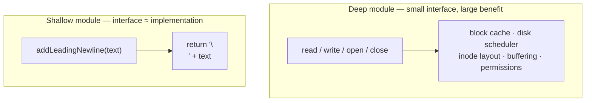

# Abstraction & Information Hiding — Professional Level

> Focus: the lineage and the deep end. Parnas's information-hiding criterion, Ousterhout's complexity calculus and deep modules, the Ousterhout-vs-Martin tension over "many small classes," Spolsky's Law of Leaky Abstractions, encapsulation guarantees the type system can and cannot enforce, and the measurable cost of the *wrong* abstraction.

---

## Table of Contents

1. [Parnas 1972: decompose around decisions likely to change](#parnas-1972-decompose-around-decisions-likely-to-change)
2. [Parnas 1985: a module is a set of secrets](#parnas-1985-a-module-is-a-set-of-secrets)
3. [Ousterhout: complexity as a measurable quantity](#ousterhout-complexity-as-a-measurable-quantity)
4. [Deep vs shallow modules](#deep-vs-shallow-modules)
5. [The Ousterhout–Martin tension: classitis](#the-ousterhoutmartin-tension-classitis)
6. [Spolsky: the Law of Leaky Abstractions](#spolsky-the-law-of-leaky-abstractions)
7. [Encapsulation guarantees across the type system](#encapsulation-guarantees-across-the-type-system)
8. [Over-abstraction and the cost of the wrong abstraction](#over-abstraction-and-the-cost-of-the-wrong-abstraction)
9. [Common Mistakes](#common-mistakes)
10. [Test Yourself](#test-yourself)
11. [Cheat Sheet](#cheat-sheet)
12. [Summary](#summary)
13. [Further Reading](#further-reading)
14. [Related Topics](#related-topics)

---

## Parnas 1972: decompose around decisions likely to change

David Parnas, *On the Criteria To Be Used in Decomposing Systems into Modules* (CACM, December 1972), is the foundational paper. Its argument is still mis-summarized fifty years later, so state it precisely.

Parnas built one system two ways. The first decomposition was the obvious one: split by the **steps of processing** — read input, build word list, alphabetize, output. The second was unusual: split by **design decision** — one module owns the line-storage representation, another owns the index, another owns the sort, and *no module knows another's internal representation*.

Both compile and run identically. The difference appears only under **change**. When the storage format moves from "all lines in core" to "lines on disk," the first decomposition forces edits in every module that touched the lines. The second confines the change to the storage module — its callers never knew the format. Parnas's conclusion is the criterion:

> "We propose instead that one begins with a list of difficult design decisions or design decisions which are likely to change. Each module is then designed to hide such a decision from the others."

This is the inversion most engineers miss. The dominant intuition — decompose by flowchart, by the temporal order in which work happens — is exactly the decomposition Parnas rejected. The README calls this **temporal decomposition**, and it is an anti-pattern *because* it organizes modules around execution order rather than around what knowledge each unit hides. A pipeline `parse → validate → transform → store` looks clean and is fragile: a change to the wire format ripples through all four stages, because each stage re-derives the same assumption about the data's shape.

The unit of modularity is therefore not "a thing that does a step" but "a thing that owns a secret." Ask of every module: *what decision can I change inside here without any caller noticing?* If the honest answer is "none," the module hides nothing and exists only as indirection.

```go
// Temporal decomposition: each stage knows the record's concrete shape.
// A format change touches all four.
func Parse(b []byte) (Record, error) { /* knows wire format */ }
func Validate(r Record) error        { /* knows field layout  */ }
func Transform(r Record) Record      { /* knows field layout  */ }
func Store(r Record) error           { /* knows storage format */ }

// Decision-based: the secret "how a record is represented and persisted"
// lives in ONE place. Callers never see Record's internals.
type Ledger interface {
    Append(raw []byte) (EntryID, error) // hides parse+validate+store as one secret
    Lookup(id EntryID) (Entry, error)
}
```

---

## Parnas 1985: a module is a set of secrets

Parnas, Clements, and Weiss, *The Modular Structure of Complex Systems* (1985), refined the idea into the **secrets** vocabulary still used in module-guide documentation. A module is defined not by its code but by the **set of secrets it keeps**. The interface is the contract; the secret is everything the contract deliberately does not promise.

This gives a sharp test for over-exposure (README: *over-exposure*). A field or method should be public only if it is part of the promise. Anything that exists merely because the implementation happens to need it is a secret and must be hidden. The mistake is treating `public`/`private` as a visibility convenience rather than as the boundary of a secret. When a "private" detail leaks through a getter that returns a mutable internal collection, the secret has escaped even though the field is technically `private`.

Parnas also distinguishes the **uses** relation from the **is-a-component-of** relation — two structures people routinely conflate. Module A *uses* B if A's correctness depends on a correct B. A clean uses-hierarchy is acyclic; cycles mean two modules share a secret and cannot be understood independently. That is precisely the README's **conjoined methods** and **information leakage** smells: when one design decision is encoded in two modules, they must change together, so they are really one module wearing two names.

---

## Ousterhout: complexity as a measurable quantity

John Ousterhout, *A Philosophy of Software Design* (2nd ed., 2018), reframes the entire subject around a single operational definition:

> "Complexity is anything related to the structure of a software system that makes it hard to understand and modify the system."

He decomposes it into three **symptoms**:

- **Change amplification** — a single conceptual change requires edits in many places. (This is exactly Parnas's failure mode under change.)
- **Cognitive load** — how much a developer must hold in their head to make a change correctly.
- **Unknown unknowns** — the worst kind: it is not obvious what must be changed, or what knowledge is needed to change it safely.

And two **causes**:

- **Dependencies** — when code cannot be understood or changed in isolation.
- **Obscurity** — when important information is not obvious from the code.

This is a genuinely useful calculus because it makes "good design" falsifiable. Information hiding attacks all three symptoms at once: hiding a decision behind one module reduces change amplification (the change stays local), reduces cognitive load (callers need not know the secret), and shrinks unknown unknowns (the interface tells you what you can rely on). Ousterhout's slogan — *the most important design choice is what to make visible and what to hide* — is Parnas restated with a cost model attached.

He adds two disciplines worth internalizing:

- **Tactical vs strategic programming.** Tactical programming optimizes for getting the current feature working; it accretes complexity that nobody pays for today and everybody pays for later. Strategic programming treats working code as necessary but insufficient — the goal is a *clean design that will keep being easy to change*. Ousterhout's claim is that a small, steady "investment" (his figure: ~10–20% of time) in design keeps the marginal cost of change flat instead of compounding.
- **Design it twice.** Before committing to an interface, sketch a radically different alternative. The first design you think of is rarely the best, and the cost of designing it twice is trivial against the cost of living with a bad interface for years.

---

## Deep vs shallow modules

Ousterhout's central metaphor. Picture a module as a rectangle: the **width** is the interface (its cost — what callers must learn and depend on), the **area** is the functionality it provides (its benefit).

- A **deep module** is a tall, thin rectangle: a small interface hiding a large, complex implementation. `read(fd, buf, n)` is three parameters hiding disk scheduling, block caching, and filesystem layout. The Unix file abstraction is the canonical deep module — open/read/write/close/lseek hides everything.
- A **shallow module** is a wide, flat rectangle: an interface nearly as complex as the implementation, so it provides little leverage. The README's first anti-pattern.



The **pass-through method** (README) is the degenerate shallow module: a method whose entire body forwards to another object with the same signature. It adds an interface to learn and a layer to step through in the debugger while hiding zero decisions. The cure is to either give the wrapper a genuine secret (a transformation, a default, a guarantee the inner layer doesn't make) or delete it and let callers talk to the inner layer directly.

The deep-module lens reframes a familiar trade. Adding a configuration parameter to push a decision onto the caller (README: *configuration parameters that leak a decision*) makes the interface wider and the module shallower. Often the module is the entity best placed to make that decision — a TCP stack should compute its own retransmission timeout, not demand one from every caller. Ousterhout's rule: **pull complexity downward.** It is usually better for one module to internalize a hard problem than to externalize it onto many callers, because the cost of a complex interface is paid by everyone who uses it, repeatedly.

```python
# Shallow: leaks the retry decision onto every caller.
def fetch(url, retries, backoff_base, backoff_max, jitter): ...

# Deep: the module owns the retry policy (its secret); callers state intent.
class HttpClient:
    def get(self, url: str) -> Response:
        """Retries idempotent requests with bounded exponential backoff.
        The policy is the module's secret; tune it here, not at every call site."""
        ...
```

---

## The Ousterhout–Martin tension: classitis

Here two respected sources genuinely disagree, and a professional should be able to hold both.

Robert C. Martin, *Clean Code* (2008), advances: functions should be small, then smaller; classes should have a single responsibility and be small; "the first rule of functions is that they should be small. The second rule is that they should be smaller than that." Followed literally, this produces many tiny units.

Ousterhout names the resulting disease **classitis**: "the mistaken view that classes are good, so more classes are better." His objection is not stylistic but cost-based. Every class boundary is an interface, and every interface has a cost (the rectangle's width). A swarm of one-method classes maximizes total interface for minimal hidden functionality — many shallow modules whose combined cognitive load exceeds that of one deep module. Decomposing a method purely to satisfy a length rule frequently *increases* complexity, because you must now understand the relationship between the pieces (a dependency) on top of the pieces themselves.

The reconciliation is the deep-module test, not a line count:

- Martin is right that a 300-line method mixing four levels of abstraction is a Long Method smell and should be split.
- Ousterhout is right that splitting a cohesive 40-line method into eight 5-line methods, each called once, manufactures shallow modules and **conjoined methods** — units you cannot understand without reading their siblings in sequence (README's last anti-pattern).

The decisive question is never "how many lines?" but "does this boundary hide a decision and reduce what the caller must know?" A method should be extracted when it has a *crisp, nameable abstraction* whose interface is much simpler than its body. If naming the extracted piece is hard, or the name just re-describes the steps (`step1`, `handlePart2`), the boundary hides nothing — that is a generic-name smell signaling the cut was made along the wrong seam.

> Both books are correct within their frame. Use SRP to find *what* to separate (does this unit conflate unrelated reasons to change?) and depth to decide *whether* a separation pays for its interface.

---

## Spolsky: the Law of Leaky Abstractions

Joel Spolsky, *The Law of Leaky Abstractions* (2002):

> "All non-trivial abstractions, to some degree, are leaky."

His examples: TCP promises reliable delivery over unreliable IP, but pull the cable and the abstraction leaks the underlying failure as a timeout. SQL abstracts the query, but a query that ignores the physical index layout runs a thousand times slower — performance leaks through. An ORM hides SQL until the N+1 query problem leaks it back. A memory abstraction hides physical RAM until a cache miss makes sequential access leak through as a 100× latency cliff.

The mature reading is *not* "abstractions are bad." It is: **an abstraction reduces the volume of what you must know, but never to zero, and the leaks tend to be exactly the failure and performance modes you most need to understand.** The corollary Spolsky draws is uncomfortable and true: abstractions save us *time working* but not *time learning* — to debug a leak you must understand the layer below, so the abstraction does not relieve you of learning it.

Set this against the alternative the slogan tempts people toward — *no* abstraction. The cost of no abstraction is unbounded: every caller deals with raw IP packets, raw bytes on disk, raw cache lines. The leaky abstraction is still the right engineering choice, because the *expected* cost of an occasional leak is far below the *certain* cost of every caller mastering the layer below. The professional move is to (a) build the abstraction, (b) document the leak honestly — Ousterhout: *comments should describe things that are not obvious from the code*, and the leak is precisely non-obvious — and (c) provide an escape hatch for the rare caller who must go below it. A good abstraction hides the common case completely and lets the expert reach through when reality leaks.

```java
// Deep abstraction with an honest leak and an escape hatch.
public interface Cache<K, V> {
    Optional<V> get(K key);
    void put(K key, V value);

    /**
     * Leak acknowledged: eviction is best-effort. Under memory pressure an
     * entry put() may already be gone before the next get(). Callers that
     * need a hard guarantee must use {@link #pin} — the escape hatch.
     */
    void pin(K key);
}
```

---

## Encapsulation guarantees across the type system

Information hiding is a *design intent*; encapsulation is the *mechanism* the language gives you to make the hidden state genuinely inaccessible. The strength of that guarantee differs sharply across runtimes, and a professional must know where the boundary is enforced versus merely suggested.

**Go — package-level, compiler-enforced, no reflection bypass of the exported boundary for type identity.** Go's only access control is the capitalization rule: an identifier exported (capitalized) or not (lowercase) at *package* scope. This is genuinely enforced by the compiler — there is no `private` to reflect around at the language level. Unexported struct fields cannot be set by another package even via `reflect` (the `reflect` package refuses `Set` on unexported fields). The secret's boundary is the package, which aligns with Parnas: the module is the package, and its secrets are its unexported names. The catch: within a package there is *no* hiding at all — every file in the package sees every unexported name.

```go
package money

type Amount struct{ cents int64 } // cents is a true secret outside this package

func New(dollars, cents int64) Amount { return Amount{dollars*100 + cents} }
func (a Amount) String() string       { /* ... */ }
// Another package cannot construct Amount{cents: -1} or read .cents — compiler-enforced.
```

**Java — language-enforced, reflection-breakable, module-sealable.** `private` is enforced by `javac` and the JVM verifier, but `setAccessible(true)` historically defeated it. Since the Java Platform Module System (JPMS, Java 9) and the strong encapsulation made default in Java 17 (JEP 403), reflection into a module's internals fails unless the package is explicitly `opens`-ed. So Java now offers a *spectrum*: `private` (compiler + verifier, reflection-breakable absent module config) → `module-private` (`exports`/`opens` in `module-info.java`, enforced at runtime). Records and sealed classes (Java 17) let you hide the *set of subtypes* — a secret about the algebra of the type, not just its fields.

**Python — convention, not enforcement.** Python has *no* private. A single leading underscore (`_secret`) is a convention meaning "internal, don't touch." A double underscore (`__secret`) triggers **name mangling** to `_ClassName__secret` — a mechanism to avoid accidental subclass collisions, *not* an access barrier; you can still reach `obj._ClassName__secret`. The strongest available enforcement is `__slots__` (prevents adding undeclared attributes) plus discipline. The implication for design: in Python the type system will *not* make your secret inaccessible, so information hiding must be carried by the interface design and documentation alone — which makes the *quality* of the abstraction, rather than the keyword, do all the work.

```python
class Account:
    __slots__ = ("_balance",)            # no __dict__: undeclared attrs raise
    def __init__(self, cents: int) -> None:
        self._balance = cents            # "_" = secret by convention only
    @property
    def balance(self) -> int:            # the promised interface
        return self._balance
# a = Account(100); a._balance = -1  ->  works. Python trusts you.
```

| Concern | Go | Java (17+) | Python |
|---|---|---|---|
| Boundary unit | package | class / module | none (convention) |
| Enforced by | compiler | compiler + verifier (+ JPMS) | nothing |
| Reflection bypass | no (unexported) | only if `opens` (JPMS) | trivial |
| Hide the type's subtypes | interface, unexported impls | `sealed` (JEP 409) | ABC, no enforcement |
| Practical guarantee | strong, package-scoped | strong with modules | by discipline |

The lesson: the *weaker* the language guarantee, the *more* the burden falls on a genuinely deep, well-documented interface — the Python case proves that information hiding is fundamentally a design property, with the keyword as at-most a backstop.

---

## Over-abstraction and the cost of the wrong abstraction

The opposite failure of classitis-by-rule is **premature generalization**: building an abstraction for variation that does not yet exist, paying its interface cost now against a benefit that may never arrive. This is the speculative-generality smell, and Ousterhout's *design it twice* is partly a defense against it — you cannot design the right general interface from a single example, because you have not yet seen the axis of variation.

Sandi Metz's *The Wrong Abstraction* (2016) gives the sharpest formulation and the empirically uncomfortable conclusion:

> "Duplication is far cheaper than the wrong abstraction."

Her sequence: someone sees duplication, extracts a shared abstraction with a parameter to handle the one difference; a new requirement adds a second parameter, then a conditional, then a flag; soon the abstraction is a knot of `if/else` driven by callers who each want slightly different behavior. The abstraction now *couples* its callers — a change for one breaks another — which is Ousterhout's change-amplification and dependency rolled into one. The leak is total: the abstraction hides nothing because every caller must understand every branch.

Metz's counterintuitive prescription is to **re-introduce the duplication**: inline the abstraction back into each caller, then discover the *correct* seam from the now-visible concrete cases. The cost asymmetry is the key insight a professional internalizes: a missing abstraction is a known, local, linear cost (some duplicated lines you can see and search for); the wrong abstraction is a hidden, global, compounding cost (a coupling you cannot see until a change breaks a caller you never thought about). Given that asymmetry, the correct default under uncertainty is to **wait** — duplicate twice, abstract on the third occurrence (the "rule of three"), when the shape of the variation is finally visible.

This closes the loop with everything above. Parnas says hide the decision *likely to change* — not every decision, and not decisions whose change axis you cannot yet see. Ousterhout says the cost of an interface is real and paid by every caller. Metz quantifies what happens when you guess that interface wrong. The discipline is the same: abstraction is leverage, and leverage applied to the wrong fulcrum moves the load the wrong way.

---

## Common Mistakes

- **Decomposing by execution order.** Splitting into `parse/validate/transform/store` feels modular but each stage shares the same secret (the data's shape), so a format change amplifies across all of them. Decompose by decision, not by step (Parnas 1972).
- **Counting lines instead of measuring depth.** Extracting a cohesive method into eight one-liners to satisfy a length rule manufactures shallow modules and conjoined methods. Ask whether the boundary hides a decision, not whether it is short (Ousterhout's classitis critique of *Clean Code*).
- **Pass-through methods mistaken for layering.** A method that only forwards adds an interface and a stack frame while hiding nothing. Give it a real secret or delete it.
- **Leaking a decision the module should own.** Adding `retries`, `timeout`, `bufferSize` parameters pushes complexity *upward* onto every caller. Pull it down: let the module choose, expose intent.
- **Treating `private` as a guarantee in Python.** `_x` and `__x` are convention and name-mangling, not access control. In Python the interface design carries the hiding; the keyword does not.
- **Pretending abstractions don't leak.** Building an ORM/cache/network layer and never documenting or providing an escape for the failure and performance modes that *will* leak (Spolsky). Document the leak; offer a reach-through.
- **Abstracting on the first duplication.** Two similar code paths are not yet an abstraction; they are two examples. Extracting too early produces the wrong abstraction, which is costlier than the duplication (Metz). Wait for the third case.
- **Generic names hiding nothing.** `Manager`, `Util`, `Helper`, `Data` signal a module with no coherent secret. If you cannot name the secret, you have not found one.

---

## Test Yourself

1. **Parnas built one system two ways. What was the *only* difference between them, and why does it matter?**

<details><summary>Answer</summary>

Both decompositions compiled and ran identically — the difference appeared only under *change*. The flowchart (temporal) decomposition forced edits across every module when the line-storage format changed; the decision-hiding decomposition confined that change to one module. The criterion that follows: decompose around *decisions likely to change*, hiding each behind one module, not around the steps of processing (Parnas 1972).
</details>

2. **State Ousterhout's definition of complexity and its three symptoms. How does information hiding attack all three?**

<details><summary>Answer</summary>

Complexity is anything about a system's structure that makes it hard to understand and modify. Symptoms: change amplification (one change, many edits), cognitive load (how much you must hold in your head), unknown unknowns (not obvious what must change). Hiding a decision behind one module localizes change (↓ amplification), frees callers from knowing the secret (↓ cognitive load), and lets the interface state what you can rely on (↓ unknown unknowns). Causes are dependencies and obscurity; hiding reduces both.
</details>

3. **Draw the deep/shallow rectangle. Where do pass-through methods and "leaky config parameters" fall on it?**

<details><summary>Answer</summary>

Width = interface cost, area = functionality/benefit. Deep = tall and thin (small interface, large hidden implementation, e.g. Unix `read`). Shallow = wide and flat (interface ≈ implementation). A pass-through method is maximally shallow — interface with zero hidden functionality. A leaked config parameter widens the interface (more for callers to know) without adding hidden benefit, making the module shallower; the fix is to pull the decision down into the module.
</details>

4. **Ousterhout and Martin disagree about small classes. State each position and the test that reconciles them.**

<details><summary>Answer</summary>

Martin (*Clean Code*): functions and classes should be small, single-responsibility — pushing toward many tiny units. Ousterhout: "classitis" — more classes are not better; each boundary is an interface with a cost, so a swarm of shallow one-method classes can exceed the cognitive load of one deep module. Reconciliation: use SRP to find *what* conflates unrelated reasons to change, but use *depth* (does this boundary hide a decision and reduce what the caller must know?) to decide *whether* to separate. Line count is never the test.
</details>

5. **Spolsky says all non-trivial abstractions leak. If true, why abstract at all?**

<details><summary>Answer</summary>

Because the alternative — no abstraction — has unbounded cost: every caller must master the layer below, always. A leaky abstraction has the *expected* cost of an occasional leak (a failure/performance mode you must understand to debug), which is far below the *certain* cost of universal low-level mastery. The professional response is to hide the common case completely, document the leak honestly (it is non-obvious, so it warrants a comment), and provide an escape hatch for experts. Abstractions save time working, not time learning.
</details>

6. **Rank Go, Java, and Python by the strength of their encapsulation guarantee, and say what enforces each.**

<details><summary>Answer</summary>

Go: strong, package-scoped, compiler-enforced — unexported names are unreachable from other packages, and `reflect` cannot set unexported fields (but no hiding *within* a package). Java: strong, class/module-scoped, compiler + verifier; `private` was reflection-breakable until JPMS strong encapsulation (Java 17, JEP 403) made cross-module reflection require explicit `opens`. Python: weakest — no access control at all; `_x` is convention, `__x` is name-mangling (collision avoidance, not protection). Weaker guarantee ⇒ more burden on the quality of the interface itself.
</details>

7. **Why is the wrong abstraction more expensive than duplication, and what is Metz's prescription?**

<details><summary>Answer</summary>

Duplication is a known, local, linear cost — lines you can see and grep. The wrong abstraction couples its callers through a growing tangle of parameters and conditionals, producing change amplification (a fix for one caller breaks another) and a dependency that is invisible until it breaks — a hidden, global, compounding cost. Metz's prescription: re-inline the abstraction back into each caller to expose the concrete cases, then re-abstract on the correct seam (rule of three). Default under uncertainty: wait.
</details>

8. **A pipeline `parse → validate → enrich → persist` must change whenever the upstream JSON schema changes, touching all four stages. Diagnose and redesign.**

<details><summary>Answer</summary>

This is temporal decomposition (Parnas's rejected flowchart split): the four stages all share the secret "the record's concrete shape," so a schema change amplifies across all of them. Redesign by decision: one module owns the *representation* secret (parse + validate together, since they share the wire-format knowledge) and exposes a domain type; downstream modules depend only on the domain type, never the wire shape. The schema change now stays inside the representation module — its callers don't notice.
</details>

---

## Cheat Sheet

| Concept | One-line statement | Source |
|---|---|---|
| Information-hiding criterion | Decompose around decisions *likely to change*; hide each behind one module | Parnas 1972 |
| Module = secrets | A module is defined by the set of secrets it keeps, not its code | Parnas 1985 |
| Complexity | What makes a system hard to understand and modify | Ousterhout |
| Symptoms | Change amplification · cognitive load · unknown unknowns | Ousterhout |
| Causes | Dependencies · obscurity | Ousterhout |
| Deep module | Small interface over large hidden functionality (tall, thin rectangle) | Ousterhout |
| Pull complexity down | Module internalizes hard decisions rather than externalizing them onto callers | Ousterhout |
| Classitis | "More classes are better" is false; each boundary has interface cost | Ousterhout vs Martin |
| Design it twice | Sketch a radically different alternative before committing an interface | Ousterhout |
| Law of Leaky Abstractions | All non-trivial abstractions leak; document the leak, offer an escape | Spolsky |
| Wrong abstraction | Duplication is cheaper than the wrong abstraction; re-inline, then re-abstract | Metz |
| Encapsulation strength | Go (package, compiler) > Java (`private`/JPMS) ≫ Python (convention) | — |

---

## Summary

The lineage is one continuous argument. **Parnas (1972, 1985)** established the criterion — modularize around decisions likely to change, define a module by the secrets it keeps — and the failure mode it prevents: change amplification when you decompose by execution order instead. **Ousterhout** gave that intuition an operational cost model (complexity = change amplification + cognitive load + unknown unknowns, caused by dependencies and obscurity) and the deep-module test for whether a boundary earns its keep, while naming "classitis" as the over-application of *Clean Code*'s small-unit rules. **Spolsky** reminds us that hiding is never total — non-trivial abstractions leak, so the engineering act is to hide the common case, document the leak, and provide a reach-through. **Metz** quantifies the downside: the wrong abstraction couples callers and costs more than the duplication it replaced, so the right default under uncertainty is to wait for the variation to reveal itself. And the **type system** determines only how strongly the hiding is *enforced* — Go and modular Java make secrets genuinely inaccessible, Python relies on convention — which means that, ultimately, the quality of the abstraction itself, not the keyword, does the work.

---

## Further Reading

- David L. Parnas — *On the Criteria To Be Used in Decomposing Systems into Modules*, CACM 15(12), 1972. The foundational information-hiding paper.
- David L. Parnas, Paul Clements, David Weiss — *The Modular Structure of Complex Systems*, IEEE TSE, 1985. The "secrets" and uses-hierarchy refinement.
- John Ousterhout — *A Philosophy of Software Design*, 2nd ed., 2018. Deep modules, complexity calculus, design-it-twice, the classitis critique.
- Robert C. Martin — *Clean Code*, 2008, ch. 3 (Functions) & ch. 10 (Classes). The small-unit position Ousterhout argues against.
- Joel Spolsky — *The Law of Leaky Abstractions*, 2002 (Joel on Software).
- Sandi Metz — *The Wrong Abstraction*, 2016 (sandimetz.com).
- JEP 403: *Strongly Encapsulate JDK Internals* (Java 17); JEP 409: *Sealed Classes*.

---

## Related Topics

- [Senior level](senior.md) — applied refactoring toward deeper modules in real code
- [Interview questions](interview.md) — abstraction and information-hiding Q&A across levels
- [Chapter README](../README.md) — the positive rules for this chapter
- [Modules & Packages](../19-modules-and-packages/README.md) — physical structure and layering (the complement to abstraction *quality*)
- [Classes](../09-classes/README.md) — cohesion, SRP, and class-level encapsulation
- [Design Patterns](../../design-patterns/README.md) — many patterns are named techniques for hiding a decision behind a stable interface
