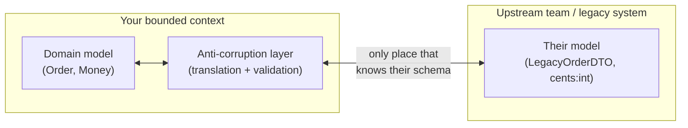

# Abstraction & Information Hiding — Senior Level

> Focus: "How do I design deep modules that span teams?" — API/SDK design as deep modules, information hiding at service boundaries, "design it twice" as a team practice, and managing system complexity as *dependencies + obscurity* rather than line count.

---

## Table of Contents

1. [The senior reframe: depth is leverage across teams](#the-senior-reframe-depth-is-leverage-across-teams)
2. [API & SDK design as deep modules](#api--sdk-design-as-deep-modules)
3. [Information hiding at module and service boundaries](#information-hiding-at-module-and-service-boundaries)
4. ["Design it twice" as a team practice](#design-it-twice-as-a-team-practice)
5. [Complexity = dependencies + obscurity, at system scale](#complexity--dependencies--obscurity-at-system-scale)
6. [Layers that earn their keep vs. the lasagna anti-pattern](#layers-that-earn-their-keep-vs-the-lasagna-anti-pattern)
7. [Documenting the abstraction: the contract and what's hidden](#documenting-the-abstraction-the-contract-and-whats-hidden)
8. [Enforcing the hidden boundary mechanically](#enforcing-the-hidden-boundary-mechanically)
9. [Refactoring a shallow module deep](#refactoring-a-shallow-module-deep)
10. [Common Mistakes](#common-mistakes)
11. [Test Yourself](#test-yourself)
12. [Cheat Sheet](#cheat-sheet)
13. [Summary](#summary)
14. [Further Reading](#further-reading)
15. [Related Topics](#related-topics)

---

## The senior reframe: depth is leverage across teams

A junior judges an abstraction by whether it compiles and reads cleanly. A senior judges it by **how much it lets the rest of the organization ignore.** Ousterhout's metric is exact:

```
            interface complexity (what callers must understand)
depth  ~=  ------------------------------------------------------
            functionality provided (what the module does for them)
```

A **deep module** has a small interface over large functionality — `read(fd, buf, n)` hides scheduling, caching, device drivers, and retries. A **shallow module** has an interface nearly as wide as its body; it makes you learn it without removing work. At team scale this ratio is the difference between a platform that 30 engineers build on without reading its source, and one where every consumer ends up reverse-engineering internals and filing tickets.

The senior consequence: **interface width is a tax paid by everyone downstream, multiplied by the number of teams that depend on you.** A 12-method client SDK with subtle ordering requirements costs you once to write and costs every consuming team forever. Narrowing it is one of the highest-leverage moves you can make — and one of the hardest to do after release, because the surface is now a contract.

---

## API & SDK design as deep modules

The clearest place a senior applies depth is at a published boundary: a REST/gRPC API, a client SDK, or an internal platform library. The job is to **hide the hard parts** — pagination, retries, auth refresh, backoff, serialization, partial failure — behind an interface the caller can hold in their head.

### A shallow client (leaks the backend's complexity)

```go
// Shallow: every caller re-implements paging, retry, and auth refresh.
type Client struct {
    http  *http.Client
    token string
}

func (c *Client) Get(url string) (*http.Response, error)   { /* raw request */ }
func (c *Client) RefreshToken() error                      { /* caller must know to call this */ }
func (c *Client) NextPageToken(resp *http.Response) string { /* caller parses headers */ }
```

Callers must understand auth lifecycle, paging tokens, and retry policy — the interface is as complex as the backend it wraps. It earns no leverage.

### A deep client (the hard parts live inside)

```go
// Deep: one method. Auth refresh, retry/backoff, and paging are hidden.
type Orders struct {
    // unexported: http, tokenSource, retryPolicy, baseURL
}

// ListAll streams every order matching the filter, transparently handling
// pagination, token refresh, and retry on transient (5xx / 429) failures.
func (o *Orders) ListAll(ctx context.Context, f Filter) iter.Seq2[Order, error] { /* ... */ }
```

The decision *"how do we paginate / refresh / retry"* now lives in exactly one place. Backend changes (a new paging scheme, a different auth flow) do not ripple to consumers.

The Java equivalent uses an interface as the published surface and keeps the wiring package-private:

```java
public interface OrderClient {                 // the entire public contract
    Stream<Order> listAll(Filter filter);      // paging hidden behind Stream
    Order get(OrderId id);
}
// OrderClientImpl, RetryingTransport, TokenSource are all package-private.
public final class OrderClients {              // single deep entry point
    public static OrderClient create(Config cfg) { return new OrderClientImpl(cfg); }
}
```

Python keeps the module surface deep with `__all__` and a leading-underscore convention for everything else:

```python
# orders/__init__.py
__all__ = ["OrderClient"]          # the whole published surface

class OrderClient:
    def list_all(self, *, filter: Filter) -> Iterator[Order]:
        """Yields every matching order; handles paging, auth refresh, retries."""
```

**The senior test for an SDK:** can a new consumer accomplish the common case with one call and *zero* knowledge of the backend's failure modes? If they must read your changelog to use you safely, the module is shallow.

---

## Information hiding at module and service boundaries

Information hiding is not "make fields private." It is: **each design decision is known to exactly one module.** When a decision (a wire format, a retry policy, a database schema, a rate-limit rule) is encoded in two places, you have *information leakage* — and the two places must now change together, across what may be two teams' release cycles.

### Hexagonal ports as deep abstractions

A port (in ports-and-adapters / hexagonal architecture) is a deep module *by construction*: the domain depends on a narrow interface; the messy adapter (SQL, Kafka, a vendor API) implements it and hides every detail.

```
+------------------------------------------------+
|                  Domain core                   |
|   (knows only the ports — no SQL, no HTTP)     |
|                                                |
|   uses --> OrderRepository (port)              |
+-----------------------+------------------------+
                        | implemented by
              +---------+----------+
              v                    v
     PostgresOrderRepo       InMemoryOrderRepo
   (hides connection pool,   (hides nothing — used
    SQL, retries, mapping)    only in tests)
```

The port `OrderRepository` is deep when it speaks the domain's language (`save(order)`, `findByCustomer(id)`) and hides persistence entirely. It is shallow — leaky — the moment it exposes `Connection`, `ResultSet`, SQL strings, or pagination cursors that only make sense for Postgres. A leaky port forces the domain (and every other adapter) to know about the database.

### Anti-corruption layers (ACL)

When you integrate with another team's service or a legacy system whose model you do not control, an **anti-corruption layer** is the deep module that translates their model into yours, so their concepts do not leak into your domain. The ACL absorbs the impedance mismatch — renamed fields, different invariants, awkward enums — in one place. Without it, the foreign model leaks through your code and every change on their side becomes a change on yours.



The ACL is the only module that knows the upstream's schema. If they rename a field, exactly one file changes.

---

## "Design it twice" as a team practice

Ousterhout's "design it twice" says: before committing to an interface, sketch two or three *fundamentally different* designs and compare them. At an individual level this is a 20-minute whiteboard exercise. At **team scale** it becomes a set of lightweight institutions:

| Practice | What it produces | When to spend the time |
|---|---|---|
| **Design review** | A reviewer pokes at the proposed interface before code exists | Any new cross-team boundary |
| **RFC / design doc** | A written proposal with two or more alternatives and their trade-offs, commented async | New service, new public API, schema migration |
| **Spike / prototype** | A throwaway implementation that surfaces the leaky parts of an interface | When the interface's depth is genuinely uncertain |
| **API review board** | A small standing group that owns consistency of public surfaces | Organizations with many published APIs |

The deliverable that matters is the **alternatives section**, not the chosen design. A design doc that presents one option is a status update, not a design. The discipline is to force a second real design so the first one is *chosen* rather than *defaulted into*.

A useful RFC skeleton for an abstraction:

```
## Problem        — what complexity are we hiding, and from whom?
## Option A       — interface sketch + what it hides + what leaks
## Option B       — a genuinely different shape (e.g. push vs. pull, sync vs. async)
## Option C       — "do nothing / extend the existing module"
## Comparison     — depth, blast radius, migration cost, who must learn it
## Decision       — chosen option and the single most important reason
## What's hidden  — the design decisions this module now owns alone
```

The "design it twice" payoff is concentrated at boundaries you cannot cheaply change later — published APIs, persisted schemas, event formats. Spend the second design there; skip it for a private helper you can rewrite in an afternoon.

---

## Complexity = dependencies + obscurity, at system scale

Ousterhout reduces complexity to two sources. At team scale they have concrete, measurable forms.

### Dependencies — measured as fan-in / fan-out

- **Fan-out** (how many modules this one depends on): a module with high fan-out is hard to change because it is coupled to many things. A service that calls 14 other services to serve one request is a *distributed shallow module*.
- **Fan-in** (how many depend on this one): high fan-in means **you cannot change the interface without coordinating with many teams.** This is not inherently bad — a deep, stable platform *should* have high fan-in — but every interface change is now an organization-wide event. High fan-in is exactly why narrowing the surface *before* release is so valuable.

The dangerous quadrant is **high fan-in + wide/unstable interface**: many teams depend on you, and your surface changes often. Each release breaks consumers. The cure is to make the interface deep and stable so the fan-in is harmless.

### Obscurity — measured as leaky abstractions across teams

Obscurity is when important information is not obvious from the interface. Across teams it shows up as:

- A method whose correct use requires reading another team's source or Slack history.
- Implicit ordering ("you must call `init()` before `connect()`") not encoded in the types.
- A "leaky abstraction" (Joel Spolsky's term): the abstraction works until it doesn't, and then the caller must understand the layer below — an ORM that hides SQL until a query is slow, then forces you to know both the ORM *and* the SQL.

Leaks are worse across team boundaries because the person who hits the leak is not the person who can fix it. The senior move is to make the leak *impossible to hit silently*: surface the constraint in the type system (a builder that won't compile without the required step), or fail loudly with an actionable error, rather than letting it leak quietly.

> **Heuristic:** complexity is what makes the *next* change hard. If a one-line behavior change forces edits across three teams, the system is complex regardless of how clean each file looks.

---

## Layers that earn their keep vs. the lasagna anti-pattern

Indirection is not abstraction. An abstraction *hides a decision*; indirection merely *forwards a call*. The **lasagna anti-pattern** (too many thin layers) and its building block, the **pass-through method**, add indirection while hiding nothing.

```java
// Lasagna: four layers, zero hiding. Each just forwards.
class OrderController { OrderService s; Order get(Id id){ return s.get(id); } }
class OrderService    { OrderManager m; Order get(Id id){ return m.get(id); } }
class OrderManager    { OrderRepo r;    Order get(Id id){ return r.get(id); } }
class OrderRepo       { Dao d;          Order get(Id id){ return d.get(id); } }
```

Each layer adds a file to read, a name to learn, and a place a bug can hide — and removes no complexity. A layer earns its keep only if it **changes the abstraction**: maps DTOs to domain types, adds caching/retry, enforces an invariant, or translates a foreign model (an ACL). A layer that passes the same type through unchanged should be collapsed.

**The senior heuristic for "is this layer real?":** name what each layer *hides* from the one above it. If you cannot, it is a pass-through and should go. Conversely, beware **"classitis"** — a swarm of tiny classes each hiding almost nothing — which is the same disease at the class level: more interfaces to learn, no leverage gained.

| Real layer (earns its keep) | Pass-through (lasagna) |
|---|---|
| Maps `OrderDTO` to/from `Order` (changes the type) | Forwards `Order` unchanged |
| Adds retry/backoff/circuit-breaker | Forwards the call |
| Enforces auth/validation invariant | Re-checks nothing |
| Anti-corruption translation | Renames the method, same args |

---

## Documenting the abstraction: the contract and what's hidden

A deep module's documentation is part of its interface. The doc's job is to let callers use the module *without reading the body* — so it must state the **contract** (preconditions, postconditions, invariants, error semantics, thread-safety) and deliberately **not** document the hidden internals as if they were guarantees.

```go
// Charge captures `amount` from the customer's default payment method.
//
// Contract:
//   - amount must be > 0; Charge panics on non-positive amounts (programmer error).
//   - Idempotent on idempotencyKey: a retry with the same key returns the original
//     result without double-charging.
//   - Returns ErrInsufficientFunds (recoverable) or ErrCardDeclined (terminal).
//   - Safe for concurrent use by multiple goroutines.
//
// NOT part of the contract (do not depend on): the gateway used, retry count,
// or backoff schedule — these may change without notice.
func (b *Billing) Charge(ctx context.Context, amount Money, key string) (Receipt, error)
```

The senior discipline is the **"NOT part of the contract"** clause. It tells consumers what is hidden *on purpose*, so they don't accidentally couple to an implementation detail and turn it into a de-facto contract you can never change. Document the *what*, hide the *how*, and name the *how* explicitly as off-limits.

For published surfaces, encode the contract where it is enforced, not just where it is read: OpenAPI/Protobuf schemas for wire contracts, type signatures for in-process contracts, and consumer-driven contract tests (e.g. Pact) so a consumer's assumptions are verified against your provider in CI.

---

## Enforcing the hidden boundary mechanically

A boundary you cannot enforce is a suggestion. Seniors make the hidden parts *unreachable*, not merely *discouraged by convention*, so the abstraction survives contact with a large team.

**Go — `internal/`:** packages under an `internal/` directory are importable only by code rooted at `internal/`'s parent. The compiler refuses external imports.

```
order/
  client.go            // public: package order
  internal/
    transport/         // importable only within order/ — invisible to consumers
    tokensource/
```

**Java — `module-info.java` (JPMS):** export only the API package; everything else is inaccessible at compile *and* run time, even via reflection unless `opens`.

```java
module com.acme.orders {
    exports com.acme.orders.api;        // the deep, public surface
    // com.acme.orders.internal is NOT exported — unreachable to consumers
    requires com.acme.http;
}
```

**Python — there is no compiler enforcement**, so combine conventions with linters: a leading underscore marks internals, `__all__` defines the public surface, and an import-linter contract fails CI when a forbidden layer imports another.

```ini
# importlinter: domain must not import the adapters that implement its ports
[importlinter:contract:domain-isolation]
name = Domain stays pure
type = forbidden
source_modules = app.domain
forbidden_modules = app.adapters
```

**Cross-language — architecture tests:** ArchUnit (Java), import-linter (Python), and `go vet` / custom `go/analysis` passes assert dependency rules in CI: "domain must not import adapters," "no package outside `billing` may import `billing/internal`." These turn the hidden boundary into a build failure, which is the only enforcement that survives schedule pressure.

---

## Refactoring a shallow module deep

You usually inherit shallow modules; you rarely get to design deep ones from scratch. The senior skill is widening the *functionality* behind an interface while *narrowing* the interface — without breaking the consumers who already depend on it.

A repeatable sequence:

1. **Map the current surface.** List every public method/endpoint and, for each, what knowledge it forces on the caller (ordering, error handling, retries). The high-knowledge ones are the leaks.
2. **Identify the decision that's leaking.** Usually one design decision (paging, auth, a wire format) is smeared across the interface. Name it.
3. **Pull complexity downward.** Add a new deep method that makes the common case trivial and absorbs the leaked decision (e.g. `ListAll` that hides paging). Implement it on top of the existing primitives.
4. **Migrate consumers via Branch by Abstraction.** Introduce the deep interface; have the old shallow one delegate to it. Move callers behind a flag, one team at a time. (Strangler-fig and branch-by-abstraction are the standard mechanics for working with legacy code here.)
5. **Shrink the surface.** Once callers use the deep method, deprecate and then delete the shallow primitives. Move the now-private wiring under `internal/` (Go) or behind a non-exported package (JPMS) so it can't drift back into the surface.
6. **Document what is now hidden** — including the explicit "not part of the contract" clause — so the depth you just created is not re-leaked by the next contributor.

The order is deliberate: you add depth *before* you remove width, so consumers always have a working path. Removing width first is how you break three teams on a Friday.

---

## Common Mistakes

- **Equating "small classes/functions" with good abstraction.** Many tiny units that each hide nothing (*classitis*) is *worse* than one deep module — it multiplies the interfaces to learn. Depth, not size, is the metric.
- **Privatizing fields and calling it information hiding.** Getters/setters over every private field re-expose the same decisions through the interface. Hiding a *decision* (how it's stored, when it's fetched) is the point, not hiding the keyword `private`.
- **Building layers that pass types through unchanged.** If a layer doesn't change the abstraction (map, validate, retry, translate), it's lasagna. Name what it hides; if you can't, delete it.
- **Letting a port leak the adapter.** A repository interface that returns a `ResultSet`, a SQL cursor, or a vendor SDK type is a shallow module wearing a hexagonal costume. The port must speak the domain's language only.
- **Designing the interface once and shipping it.** Cross-team surfaces you can't cheaply change deserve a second real design. One option in a design doc is not "design it twice."
- **Documenting internals as if they were the contract.** Consumers then couple to your retry count or gateway choice. State explicitly what is *not* guaranteed.
- **Enforcing boundaries by convention only.** "Don't import this package" in a wiki loses to a deadline. Use `internal/`, JPMS exports, or an import-linter so the compiler/CI enforces it.
- **Removing the shallow surface before consumers migrate.** Add the deep path first, migrate behind a flag, *then* delete. Otherwise you break every downstream team at once.

---

## Test Yourself

1. **A teammate adds a `getConnection()` method to your `OrderRepository` port "so callers can run custom queries." Why object?**

<details><summary>Answer</summary>

It turns a deep port into a shallow, leaky one. The whole point of the port is that the domain knows nothing about SQL or connections. Exposing `getConnection()` leaks the persistence decision to every caller and every other adapter (the in-memory test repo now has to fake a connection). The custom query belongs *behind* the port as a named domain method (`findOverdueOrders()`), so the decision stays hidden in exactly one module.
</details>

2. **Your platform library has fan-in of 40 teams. A product manager says high fan-in is a smell and you should split it. Respond.**

<details><summary>Answer</summary>

High fan-in on a *deep, stable* interface is a sign the abstraction is valuable, not broken — 40 teams reuse it instead of reinventing it. The risk is not the fan-in; it's whether the *interface is stable*. Splitting it would multiply the surfaces those teams must learn and likely create coordination overhead, not reduce it. The right move is to keep the surface narrow and stable (versioning, deprecation policy) so the high fan-in stays harmless. Only split if the module is also a *god module* doing unrelated jobs — that's low cohesion, a different problem.
</details>

3. **You see a `Service` layer where every method is `return repo.method(args)`. What's the test for whether to keep it?**

<details><summary>Answer</summary>

Ask: what does this layer *hide* from its caller? If the answer is "nothing — it forwards the same types unchanged," it's a pass-through (lasagna) and should be collapsed. Keep it only if it earns its keep: maps DTOs to domain types, enforces an invariant or authorization, adds caching/retry, or coordinates multiple repositories in a transaction. A layer that changes the abstraction is real; a layer that only renames the call is indirection.
</details>

4. **A consumer team files a bug: "your SDK silently stopped working after we deployed at 2x traffic." Investigation shows they relied on your internal retry count. Whose mistake, and how do you prevent it next time?**

<details><summary>Answer</summary>

Shared mistake, but the *prevention* is on the provider. They coupled to an implementation detail (the retry count) that was never part of the contract — a leaky abstraction. Prevent it by (a) documenting an explicit "NOT part of the contract" clause naming retry/backoff as internal, and (b) making the detail genuinely unreachable (`internal/` package, non-exported field) so they couldn't have depended on it in the first place. Obscurity that's reachable will eventually become a de-facto contract.
</details>

5. **When is "design it twice" a waste of time?**

<details><summary>Answer</summary>

For boundaries you can cheaply change later — a private helper, an internal function, anything with low fan-in and no published contract. The payoff of a second design is proportional to how expensive the interface is to change after release. Spend it on published APIs, persisted schemas, and event formats (high fan-in, hard to change); skip it for code you can rewrite in an afternoon without coordinating with anyone.
</details>

6. **How do you tell a deep abstraction layer from needless indirection in a code review?**

<details><summary>Answer</summary>

Name what each layer hides from the one above it. A deep layer has a clear answer: "it hides SQL," "it hides the auth lifecycle," "it translates the upstream model." Needless indirection (pass-through, classitis) has no answer — the same types flow through unchanged, so the layer adds a name and a file but removes no complexity. Depth is measured by functionality-hidden-per-unit-of-interface, not by how many layers exist.
</details>

---

## Cheat Sheet

| Concept | Senior takeaway |
|---|---|
| **Deep module** | Small interface, large functionality. Maximize functionality-hidden-per-unit-of-interface. |
| **Shallow module** | Interface ~= implementation. Earns no leverage; the tax is paid by every consumer. |
| **Interface width** | A tax multiplied by fan-in. Narrow *before* release; you can't after it's a contract. |
| **Information leakage** | One decision known to two modules. They now change together — possibly across teams. |
| **Hexagonal port** | A deep abstraction *iff* it speaks the domain language and hides the adapter entirely. |
| **Anti-corruption layer** | The one module that knows a foreign/legacy schema, so it doesn't leak into your domain. |
| **Pass-through / lasagna** | Indirection that hides nothing. Collapse it. Can't name what it hides? Delete it. |
| **Classitis** | Many tiny classes each hiding almost nothing — worse than one deep module. |
| **Design it twice** | Force a real alternative for any expensive-to-change boundary. RFC's value is the alternatives. |
| **Complexity** | dependencies (fan-in/fan-out) + obscurity (leaks). What makes the *next* change hard. |
| **Contract docs** | State pre/post/invariants/errors/thread-safety. Name what is *NOT* guaranteed. |
| **Enforcement** | `internal/` (Go), JPMS `exports` (Java), import-linter / `__all__` (Python), ArchUnit in CI. |
| **Deepen safely** | Add the deep path, migrate via branch-by-abstraction, *then* delete the shallow surface. |

---

## Summary

At senior scale, abstraction stops being a per-file readability concern and becomes the primary lever on **system complexity** — which Ousterhout decomposes into *dependencies + obscurity*. Deep modules (small interface, large hidden functionality) are leverage: they let other teams build without learning your internals, and that leverage is multiplied by your fan-in. The recurring senior decisions are: design published surfaces (APIs, SDKs, ports) to hide the hard parts; keep each design decision in exactly one module to prevent leakage; use anti-corruption layers so foreign models don't bleed into your domain; "design it twice" via RFCs and reviews for boundaries you can't cheaply change; collapse pass-through layers and classitis that add indirection without hiding anything; document the contract while explicitly naming what is *not* guaranteed; and enforce the hidden boundary mechanically (`internal/`, JPMS, linters, ArchUnit) so the abstraction survives a large team and schedule pressure. When you inherit a shallow module, deepen it by adding the deep path first and removing width last.

---

## Further Reading

- John Ousterhout, *A Philosophy of Software Design* — deep vs. shallow modules, information hiding, "design it twice," pulling complexity downward.
- David Parnas, "On the Criteria To Be Used in Decomposing Systems into Modules" (1972) — the founding paper on information hiding; decompose by *secrets*, not by execution order.
- Eric Evans, *Domain-Driven Design* — bounded contexts and anti-corruption layers.
- Alistair Cockburn, "Hexagonal Architecture (Ports and Adapters)" — ports as boundaries that hide adapters.
- Joel Spolsky, "The Law of Leaky Abstractions" (2002) — why every non-trivial abstraction leaks, and what that costs across teams.
- Michael Feathers, *Working Effectively with Legacy Code* — branch by abstraction and strangler-fig mechanics for deepening modules safely.

---

## Related Topics

- [junior.md](junior.md) — the basics: what a deep module is, hiding internals, avoiding generic names.
- [middle.md](middle.md) — applying depth within a single service: ports, DTO mapping, pass-through removal.
- [professional.md](professional.md) — abstraction at architecture/org scale beyond a single team.
- [Chapter README](../README.md) — the positive rules for this chapter.
- [Modules & Packages](../19-modules-and-packages/README.md) — physical structure and layering (the *where*, vs. this chapter's *how deep*).
- [Boundaries](../07-boundaries/README.md) — wrapping third-party code and isolating change.
- [Design Patterns](../../design-patterns/README.md) — Facade, Adapter, and Repository as concrete deep-module shapes.
- [Anti-Patterns](../../anti-patterns/README.md) — God Object, lasagna code, and leaky abstractions catalogued.
