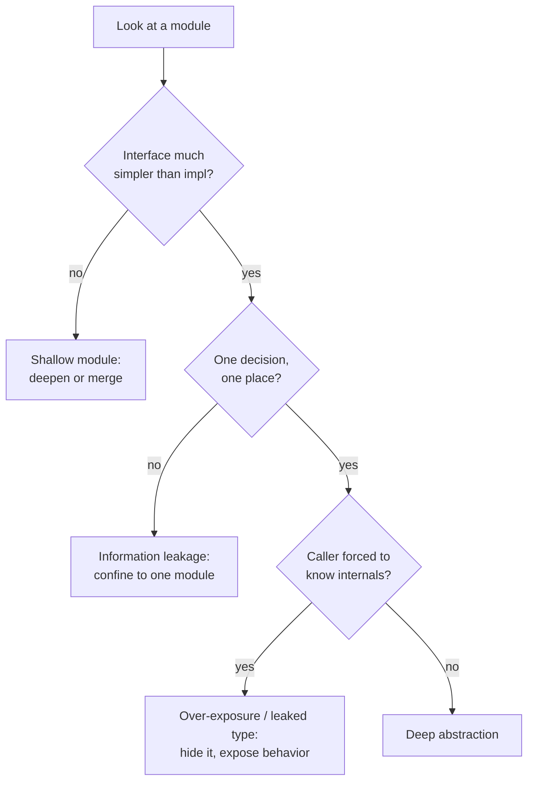

# Abstraction & Information Hiding — Practice Tasks

> Twelve hands-on exercises that train one instinct: judge an abstraction by what it *hides*, not by what it *exposes*. Each task gives you a shallow or leaky design and asks you to deepen it — pull complexity down behind a simple interface, collapse needless layers, and confine each design decision to exactly one module. Languages vary (Go / Java / Python) so the principle, not the syntax, sticks. Every task carries a full solution with reasoning.

---

## Table of Contents

1. [Task 1 — Collapse a pass-through method (Java)](#task-1--collapse-a-pass-through-method-java)
2. [Task 2 — Hide an exposed internal field (Python)](#task-2--hide-an-exposed-internal-field-python)
3. [Task 3 — Rename a generic `Manager` into a real abstraction (Go)](#task-3--rename-a-generic-manager-into-a-real-abstraction-go)
4. [Task 4 — Deepen a shallow wrapper (Python)](#task-4--deepen-a-shallow-wrapper-python)
5. [Task 5 — Fix information leakage across two modules (Go)](#task-5--fix-information-leakage-across-two-modules-go)
6. [Task 6 — Move a config decision into the module (Java)](#task-6--move-a-config-decision-into-the-module-java)
7. [Task 7 — Define an error out of existence (Python)](#task-7--define-an-error-out-of-existence-python)
8. [Task 8 — Convert temporal decomposition into knowledge modules (Go)](#task-8--convert-temporal-decomposition-into-knowledge-modules-go)
9. [Task 9 — Cure classitis by merging tiny classes (Java)](#task-9--cure-classitis-by-merging-tiny-classes-java)
10. [Task 10 — Leaked internal type in the public interface (Go)](#task-10--leaked-internal-type-in-the-public-interface-go)
11. [Task 11 — Pull complexity downward (Python)](#task-11--pull-complexity-downward-python)
12. [Task 12 — Abstraction audit (Java — open-ended)](#task-12--abstraction-audit-java--open-ended)

[Self-Assessment](#self-assessment) · [Related Topics](#related-topics)

---

## How to Use

Work top to bottom; the tasks climb from a mechanical fix (delete a pass-through) to a holistic redesign (an audit). For each one:

1. Read the scenario and the smelly code **before** opening the solution. Name the anti-pattern out loud — shallow module, leakage, temporal decomposition, over-exposure, pass-through, generic name, classitis, leaked type. Naming it is half the skill.
2. Write the fix yourself. Then expand the solution and compare — not line for line, but decision for decision: *what did each version make the caller know?*
3. Apply the litmus test from the chapter: **a good abstraction makes the common case trivial and the interface smaller than the implementation.** If your fix grew the interface, it is not yet deep.



---

## Task 1 — Collapse a pass-through method (Java)

**Difficulty:** Easy

**Scenario:** A service layer was added "for symmetry." Every method on `OrderService` does nothing but forward to `OrderRepository`. The extra layer adds a hop to read and a file to maintain, but hides no decision and transforms no data.

```java
public class OrderService {
    private final OrderRepository repository;

    public OrderService(OrderRepository repository) {
        this.repository = repository;
    }

    public Order findById(long id) {
        return repository.findById(id);
    }

    public List<Order> findByCustomer(long customerId) {
        return repository.findByCustomer(customerId);
    }

    public void save(Order order) {
        repository.save(order);
    }
}
```

**Instruction:** Decide whether `OrderService` earns its existence. If it does not, remove the pass-through layer and let callers depend on the abstraction that actually does the work. If you would keep the class, justify it by giving it real responsibility.

<details><summary>Solution</summary>

A pass-through method *increases* the interface surface of the system (one more type, one more set of signatures to learn) while *decreasing* nothing. The leverage of an abstraction is `functionality_hidden / interface_size`; here the numerator is zero. Delete the layer:

```java
// OrderService is gone. Callers depend on the repository interface directly.
public interface OrderRepository {
    Order findById(long id);
    List<Order> findByCustomer(long customerId);
    void save(Order order);
}
```

Callers change `orderService.findById(id)` to `orderRepository.findById(id)` — a mechanical rename your IDE does in one pass.

**When a service layer *does* earn its keep:** the moment it adds responsibility the repository should not have — a transaction boundary, an authorization check, an event published on save, caching, or coordination across two repositories. At that point it is no longer a pass-through; it hides a decision:

```java
public class OrderService {
    private final OrderRepository repository;
    private final EventBus events;

    public Order place(Order order) {
        order.validate();                  // decision hidden here
        Order saved = repository.save(order);
        events.publish(new OrderPlaced(saved.id()));  // side effect callers must not forget
        return saved;
    }
}
```

**Reasoning:** Indirection is only valuable when it buys abstraction. A layer that forwards is the negative case — it costs obscurity (where does the work happen?) and dependency (one more thing to wire) for no hiding. Keep a layer only when removing it would force every caller to remember a step.

</details>

---

## Task 2 — Hide an exposed internal field (Python)

**Difficulty:** Easy

**Scenario:** `ShoppingCart` exposes its `items` list directly. Callers reach in, mutate it, and recompute totals themselves — so the cart's most important invariant (the total always matches the items) lives in every caller instead of in the cart.

```python
class ShoppingCart:
    def __init__(self):
        self.items = []        # public: callers append/remove directly
        self.total = 0.0       # public: callers must remember to update this

# Caller code, repeated in five places:
cart.items.append(item)
cart.total += item.price * item.quantity
```

**Instruction:** Make the internal representation private and expose behavior instead of state, so the cart can never be observed with a stale total.

<details><summary>Solution</summary>

```python
from dataclasses import dataclass
from decimal import Decimal


@dataclass(frozen=True)
class LineItem:
    sku: str
    price: Decimal
    quantity: int


class ShoppingCart:
    def __init__(self) -> None:
        self._items: list[LineItem] = []   # leading underscore = "do not touch from outside"

    def add(self, item: LineItem) -> None:
        self._items.append(item)

    def remove(self, sku: str) -> None:
        self._items = [i for i in self._items if i.sku != sku]

    @property
    def total(self) -> Decimal:
        # Derived, never stored — it cannot drift out of sync.
        return sum((i.price * i.quantity for i in self._items), start=Decimal(0))

    @property
    def items(self) -> tuple[LineItem, ...]:
        return tuple(self._items)          # read-only view; mutation must go through add/remove
```

```python
# Callers now express intent, not bookkeeping:
cart.add(LineItem("ABC", Decimal("9.99"), 2))
print(cart.total)
```

**Reasoning:** A public field exposes a *representation decision* — "the cart is a list plus a running total" — to everyone. That decision then can't change without touching every caller, and the total/items invariant is unenforceable because anyone can update one without the other. By making `_items` private and computing `total` on read, we (1) hide the representation so we can later swap the list for a `dict` keyed by SKU, and (2) make an inconsistent total *impossible to express*, which is strictly stronger than asking callers to remember a rule. Expose behavior (`add`, `remove`), not state.

</details>

---

## Task 3 — Rename a generic `Manager` into a real abstraction (Go)

**Difficulty:** Easy

**Scenario:** `UserManager` is a grab bag. The name `Manager` describes nothing, and a glance at the methods shows it is doing two unrelated jobs: persisting users and sending them mail.

```go
package user

type UserManager struct {
    db     *sql.DB
    mailer *smtp.Client
}

func (m *UserManager) GetUserData(id int64) (*User, error)      { /* query db */ }
func (m *UserManager) SaveUserData(u *User) error               { /* insert/update */ }
func (m *UserManager) DoEmailStuff(u *User, subject string)     { /* send via smtp */ }
func (m *UserManager) HandleUserHelper(id int64) error          { /* load, then email */ }
```

**Instruction:** Replace the generic name and split the conflated responsibilities into coherent abstractions whose names state what they hide.

<details><summary>Solution</summary>

```go
package user

// Store hides where users live (Postgres today, anything tomorrow).
type Store interface {
    Find(id int64) (*User, error)
    Save(u *User) error
}

// Notifier hides how a user is reached (SMTP today).
type Notifier interface {
    Welcome(u *User) error
}

type postgresStore struct{ db *sql.DB }

func (s *postgresStore) Find(id int64) (*User, error) { /* query */ }
func (s *postgresStore) Save(u *User) error           { /* insert/update */ }

type emailNotifier struct{ client *smtp.Client }

func (n *emailNotifier) Welcome(u *User) error { /* compose + send */ }
```

The orphaned `HandleUserHelper` was a use case in disguise — name the use case:

```go
type Onboarding struct {
    store    Store
    notifier Notifier
}

func (o *Onboarding) Register(u *User) error {
    if err := o.store.Save(u); err != nil {
        return err
    }
    return o.notifier.Welcome(u)
}
```

**Reasoning:** `Manager`, `Util`, `Helper`, `Data`, `Processor`, `*Stuff` are smells because they name a *bucket*, not an *abstraction* — they tell the reader nothing about what knowledge is hidden inside, so they attract unrelated code until the type does everything and abstracts nothing. The fix is two-step: (1) split by *what each unit hides* — persistence vs. notification — and (2) name each unit after that secret (`Store`, `Notifier`). The methods get sharp verbs too: `GetUserData` → `Find`, `DoEmailStuff` → `Welcome`. Now a reader predicts what each type does from its name, which is the entire point of an abstraction.

</details>

---

## Task 4 — Deepen a shallow wrapper (Python)

**Difficulty:** Medium

**Scenario:** `FileStore` wraps the standard library but hides nothing — every method demands the same knowledge `open()` already demands (paths, modes, encodings, byte handling), so callers carry the full complexity *and* a useless extra layer.

```python
class FileStore:
    def open_file(self, path, mode, encoding):
        return open(path, mode, encoding=encoding)

    def read_file(self, path, mode, encoding):
        f = open(path, mode, encoding=encoding)
        data = f.read()
        f.close()
        return data

    def write_file(self, path, mode, encoding, data):
        f = open(path, mode, encoding=encoding)
        f.write(data)
        f.close()


# Caller still has to know everything open() wanted:
store = FileStore()
raw = store.read_file("config/app.json", "r", "utf-8")
config = json.loads(raw)
```

**Instruction:** Redesign `FileStore` into a *deep* module: a simple interface that hides the real complexity callers face — encoding, modes, resource cleanup, parsing, and the atomic-write problem. The caller should ask for *what it wants*, not *how files work*.

<details><summary>Solution</summary>

The caller's real intent is "give me the config object" and "durably persist this object." That is the interface. Everything else — modes, encodings, file handles, temp-file-then-rename for atomicity — is complexity to pull *inside*.

```python
import json
import os
import tempfile
from pathlib import Path
from typing import Any


class JsonStore:
    """A small interface over a real problem: durable, parsed config files."""

    def __init__(self, root: Path) -> None:
        self._root = root

    def load(self, name: str) -> dict[str, Any]:
        path = self._root / f"{name}.json"
        with path.open("r", encoding="utf-8") as f:   # mode + encoding hidden
            return json.load(f)                        # parsing hidden

    def save(self, name: str, value: dict[str, Any]) -> None:
        path = self._root / f"{name}.json"
        # Atomic write: never leave a half-written file if the process dies.
        fd, tmp = tempfile.mkstemp(dir=self._root, suffix=".tmp")
        try:
            with os.fdopen(fd, "w", encoding="utf-8") as f:
                json.dump(value, f, indent=2)
                f.flush()
                os.fsync(f.fileno())
            os.replace(tmp, path)                      # atomic rename hidden
        except BaseException:
            os.unlink(tmp)
            raise
```

```python
# Caller knows nothing about modes, encodings, handles, or atomicity:
store = JsonStore(Path("config"))
config = store.load("app")
store.save("app", config)
```

**Reasoning:** The original was a *shallow* module: its interface (`path, mode, encoding`) was as wide as the thing it wrapped, so it bought zero leverage — pure cost. A deep module is the opposite: a narrow interface (`load(name)` / `save(name, value)`) over substantial hidden work (encoding defaults, parsing, resource cleanup via `with`, and the genuinely tricky atomic-write-via-rename that most hand-rolled callers get wrong). The interface shrank *and* the implementation grew — that ratio is exactly what makes an abstraction worth its weight. A useful gauge: if deleting the wrapper would not make callers any dumber, the wrapper was shallow.

</details>

---

## Task 5 — Fix information leakage across two modules (Go)

**Difficulty:** Medium

**Scenario:** The on-disk file format for sessions is a design decision — "a session is gob-encoded, gzip-compressed bytes." That single decision is duplicated in two modules: the writer and the reader each independently know the format. Change the encoding and you must remember to change both, or you corrupt every session.

```go
package session

// --- writer.go ---
func WriteSession(path string, s *Session) error {
    var buf bytes.Buffer
    gz := gzip.NewWriter(&buf)
    if err := gob.NewEncoder(gz).Encode(s); err != nil {
        return err
    }
    gz.Close()
    return os.WriteFile(path, buf.Bytes(), 0o600)
}

// --- reader.go ---
func ReadSession(path string) (*Session, error) {
    raw, err := os.ReadFile(path)
    if err != nil {
        return nil, err
    }
    gz, err := gzip.NewReader(bytes.NewReader(raw))
    if err != nil {
        return nil, err
    }
    var s Session
    if err := gob.NewDecoder(gz).Decode(&s); err != nil {
        return nil, err
    }
    return &s, nil
}
```

**Instruction:** The format decision is *leaked* across `writer.go` and `reader.go` — they are conjoined and must change together. Confine that knowledge to one module so the format is described in exactly one place.

<details><summary>Solution</summary>

Both functions share one secret — *the byte layout of a session*. Information hiding says: that secret belongs to **one** module. Introduce a `codec` that owns encode and decode as a matched pair, so they are forced to agree.

```go
package session

// codec is the single owner of the on-disk format decision:
// gob-encoded then gzip-compressed. Nothing outside this type knows that.
type codec struct{}

func (codec) encode(s *Session) ([]byte, error) {
    var buf bytes.Buffer
    gz := gzip.NewWriter(&buf)
    if err := gob.NewEncoder(gz).Encode(s); err != nil {
        return nil, err
    }
    if err := gz.Close(); err != nil {
        return nil, err
    }
    return buf.Bytes(), nil
}

func (codec) decode(raw []byte) (*Session, error) {
    gz, err := gzip.NewReader(bytes.NewReader(raw))
    if err != nil {
        return nil, err
    }
    var s Session
    if err := gob.NewDecoder(gz).Decode(&s); err != nil {
        return nil, err
    }
    return &s, nil
}

// writer.go and reader.go now only know about files, not format:
func WriteSession(path string, s *Session) error {
    raw, err := codec{}.encode(s)
    if err != nil {
        return err
    }
    return os.WriteFile(path, raw, 0o600)
}

func ReadSession(path string) (*Session, error) {
    raw, err := os.ReadFile(path)
    if err != nil {
        return nil, err
    }
    return codec{}.decode(raw)
}
```

**Reasoning:** Information leakage is when one design decision is reflected in two or more modules — they become *conjoined*: you cannot understand or change one without the other. The test is the change scenario: "switch gob to JSON, or gzip to zstd." In the original, that edit touches two files and silently breaks if you miss one. After confining the format to `codec`, the decision lives in one place; the writer and reader know only "turn a session into bytes and back," which is a stable interface even as the encoding evolves. Leakage isn't always code duplication — sometimes it's two modules that merely *agree* on a fact; either way, name the fact and give it one home.

</details>

---

## Task 6 — Move a config decision into the module (Java)

**Difficulty:** Medium

**Scenario:** `RetryExecutor` pushes every tuning knob onto its callers — max attempts, base delay, multiplier, jitter, which exceptions are retryable. Each of the dozen call sites must re-derive a sane backoff policy, and they disagree. The module that knows the most about retrying is forcing the decision onto the modules that know the least.

```java
public class RetryExecutor {
    public <T> T execute(
            Supplier<T> action,
            int maxAttempts,
            long baseDelayMs,
            double multiplier,
            boolean jitter,
            Set<Class<? extends Exception>> retryable) {
        // ... loop applying all five parameters ...
    }
}

// Every caller, all slightly different and mostly wrong:
executor.execute(this::call, 3, 100, 2.0, true,
        Set.of(IOException.class, TimeoutException.class));
```

**Instruction:** A retry policy is a decision the retry module is best placed to make. Pull the default policy *into* the module so the common call requires no knobs, while still allowing deliberate overrides.

<details><summary>Solution</summary>

```java
public final class RetryPolicy {
    private final int maxAttempts;
    private final Duration baseDelay;
    private final double multiplier;
    private final boolean jitter;
    private final Set<Class<? extends Exception>> retryable;

    private RetryPolicy(Builder b) {
        this.maxAttempts = b.maxAttempts;
        this.baseDelay = b.baseDelay;
        this.multiplier = b.multiplier;
        this.jitter = b.jitter;
        this.retryable = b.retryable;
    }

    // The module owns what "sensible" means. Callers inherit it for free.
    public static RetryPolicy defaults() {
        return new Builder().build();
    }

    public static final class Builder {
        private int maxAttempts = 3;
        private Duration baseDelay = Duration.ofMillis(100);
        private double multiplier = 2.0;
        private boolean jitter = true;
        private Set<Class<? extends Exception>> retryable =
                Set.of(IOException.class, TimeoutException.class);

        public Builder maxAttempts(int n)        { this.maxAttempts = n; return this; }
        public Builder baseDelay(Duration d)     { this.baseDelay = d; return this; }
        public Builder retryOn(Set<Class<? extends Exception>> e) { this.retryable = e; return this; }
        public RetryPolicy build()               { return new RetryPolicy(this); }
    }
    // package-private getters used by RetryExecutor ...
}

public final class RetryExecutor {
    private final RetryPolicy policy;

    public RetryExecutor()                 { this(RetryPolicy.defaults()); }
    public RetryExecutor(RetryPolicy p)    { this.policy = p; }

    public <T> T execute(Supplier<T> action) { /* loop using this.policy */ }
}
```

```java
// Common case: zero knobs, one correct default policy.
T result = new RetryExecutor().execute(this::call);

// Deliberate override, expressed once, named clearly:
var aggressive = new RetryExecutor(
        new RetryPolicy.Builder().maxAttempts(5).baseDelay(Duration.ofMillis(50)).build());
```

**Reasoning:** A configuration parameter is often a decision the *module* is best placed to make, leaked onto every caller — who then re-derive it inconsistently, usually wrong. Ousterhout's guidance: avoid configuration parameters; pick a good default inside the module and treat overrides as the exception, not the rule. We did three things: (1) collapsed five parameters into one `RetryPolicy` value object (also killing a long parameter list), (2) gave the module ownership of "sensible" via `defaults()`, and (3) kept full control available through the builder for the rare caller that genuinely knows better. The default case now requires the caller to know *nothing* about backoff — the module that understands retries decides how to retry.

</details>

---

## Task 7 — Define an error out of existence (Python)

**Difficulty:** Medium

**Scenario:** `TextBuffer.delete` makes the caller responsible for staying inside bounds. Every call site repeats the same clamping logic, and the function raises if they get it wrong — so an entire class of errors exists purely because the interface chose to expose it.

```python
class TextBuffer:
    def __init__(self, text: str) -> None:
        self._chars = list(text)

    def delete(self, start: int, count: int) -> None:
        if start < 0 or start >= len(self._chars):
            raise IndexError("start out of range")
        if count < 0 or start + count > len(self._chars):
            raise IndexError("count out of range")
        del self._chars[start:start + count]


# Every caller must defend itself, and they do it differently:
start = max(0, min(start, len(buf)))
count = min(count, len(buf) - start)
buf.delete(start, count)
```

**Instruction:** Redesign `delete` so the out-of-range failure *cannot occur* — define the error out of existence by giving the operation a natural meaning for every input, instead of pushing bounds-checking onto the caller.

<details><summary>Solution</summary>

A delete that clamps its own range has a sensible meaning for *any* `start` and `count`: delete the overlap between the requested range and the buffer. With that definition there is no out-of-range case left to report.

```python
class TextBuffer:
    def __init__(self, text: str) -> None:
        self._chars = list(text)

    def __len__(self) -> int:
        return len(self._chars)

    def delete(self, start: int, count: int) -> None:
        # Clamp to the buffer. Out-of-range simply means "delete what overlaps."
        start = max(0, min(start, len(self._chars)))
        count = max(0, count)
        del self._chars[start:start + count]
```

```python
# Callers stop defending. Any input is well-defined:
buf.delete(start, count)          # no clamping, no try/except, no IndexError
buf.delete(0, 10_000)             # deletes everything; not an error
buf.delete(-5, 3)                 # starts at 0; not an error
```

**Reasoning:** "Define errors out of existence" means redesigning the interface so the exceptional case becomes a normal one, rather than detecting and reporting it. The clamping logic doesn't vanish — it moves *into* the module, where it lives once instead of at every call site (and where the call sites can't disagree on how to clamp). This is the same instinct behind Python's `str.split()` returning `[""]` instead of raising on an empty string, or `unset()` succeeding on a missing key: the most-informed module absorbs the edge case so callers never have to. The interface shrinks (no precondition to document, no exception to catch) and an entire bug category disappears. Caveat: only do this when clamping is genuinely the right semantics — for, say, a bank withdrawal, silently clamping an overdraft is a *bug*, and a raised error is correct. Eliminate accidental errors, not meaningful ones.

</details>

---

## Task 8 — Convert temporal decomposition into knowledge modules (Go)

**Difficulty:** Hard

**Scenario:** An image-upload pipeline was decomposed by *order of execution*: read, then validate, then resize, then store. But the format knowledge (how to read a JPEG header, its MIME type, how to re-encode it) is smeared across all four steps. Add WebP support and you edit four functions. The split follows *time*, not *knowledge*.

```go
package upload

// Decomposed by execution order — each step knows a bit about every format.
func step1Read(r io.Reader) ([]byte, string, error) {
    raw, _ := io.ReadAll(r)
    var ext string
    switch {
    case bytes.HasPrefix(raw, []byte{0xFF, 0xD8}):
        ext = "jpg"
    case bytes.HasPrefix(raw, []byte("\x89PNG")):
        ext = "png"
    }
    return raw, ext, nil
}

func step2Validate(raw []byte, ext string) error {
    switch ext {
    case "jpg":
        return validateJPEG(raw)
    case "png":
        return validatePNG(raw)
    }
    return errors.New("unknown format")
}

func step3Resize(raw []byte, ext string, w, h int) ([]byte, error) {
    switch ext {
    case "jpg":
        return resizeJPEG(raw, w, h)
    case "png":
        return resizePNG(raw, w, h)
    }
    return nil, errors.New("unknown format")
}

func step4Store(raw []byte, ext string) (string, error) {
    return saveToDisk(raw, "."+ext)
}
```

**Instruction:** Re-decompose by *knowledge*, not by execution order. Each module should hide everything about one image format, so adding a format means adding one unit, not editing four.

<details><summary>Solution</summary>

The recurring `switch ext` across every step is the tell: format knowledge is the real axis. Make a `Format` the unit of decomposition, with each concrete format hiding its own detection, validation, and resizing.

```go
package upload

// Each Format hides everything about one image type.
type Format interface {
    Detect(raw []byte) bool
    Validate(raw []byte) error
    Resize(raw []byte, w, h int) ([]byte, error)
    Extension() string
}

type jpeg struct{}

func (jpeg) Detect(raw []byte) bool             { return bytes.HasPrefix(raw, []byte{0xFF, 0xD8}) }
func (jpeg) Validate(raw []byte) error          { return validateJPEG(raw) }
func (jpeg) Resize(raw []byte, w, h int) ([]byte, error) { return resizeJPEG(raw, w, h) }
func (jpeg) Extension() string                  { return "jpg" }

type png struct{}

func (png) Detect(raw []byte) bool              { return bytes.HasPrefix(raw, []byte("\x89PNG")) }
func (png) Validate(raw []byte) error           { return validatePNG(raw) }
func (png) Resize(raw []byte, w, h int) ([]byte, error) { return resizePNG(raw, w, h) }
func (png) Extension() string                   { return "png" }

// The registry is the only place that enumerates formats.
var formats = []Format{jpeg{}, png{}}

func detect(raw []byte) (Format, error) {
    for _, f := range formats {
        if f.Detect(raw) {
            return f, nil
        }
    }
    return nil, errors.New("unsupported format")
}

// The pipeline now reads as a recipe and contains no format knowledge:
func Process(r io.Reader, w, h int) (string, error) {
    raw, err := io.ReadAll(r)
    if err != nil {
        return "", err
    }
    format, err := detect(raw)
    if err != nil {
        return "", err
    }
    if err := format.Validate(raw); err != nil {
        return "", err
    }
    resized, err := format.Resize(raw, w, h)
    if err != nil {
        return "", err
    }
    return saveToDisk(resized, "."+format.Extension())
}
```

Adding WebP is now a single `type webp struct{}` plus one entry in `formats` — no edit to `Process`, `Validate`, or `Resize`.

**Reasoning:** Temporal decomposition splits code by *when* things run (read → validate → resize → store). It feels natural because it mirrors the runtime sequence, but it scatters each piece of knowledge across the stages it touches — so a single conceptual change (add a format) hits every stage. Decomposition by *knowledge* asks instead: "what does each module hide?" Here the answer is "one image format." Once `Format` is the unit, each format's secret is local, the `switch` statements collapse into polymorphism, and the pipeline becomes a thin, stable sequencer that knows about no format at all. The runtime order didn't change — only the *module boundaries* did, and they now follow change boundaries.

</details>

---

## Task 9 — Cure classitis by merging tiny classes (Java)

**Difficulty:** Hard

**Scenario:** A `Money` concept was shattered into a swarm of one-method classes "for single responsibility." Each class hides almost nothing, and any real task (parse a string into a formatted, currency-checked amount) requires the caller to wire four of them together in the right order — so the complexity moved from inside the abstraction to *between* the abstractions.

```java
class MoneyParser     { BigDecimal parse(String s) { return new BigDecimal(s.replace(",", "")); } }
class MoneyValidator  { void validate(BigDecimal v) { if (v.signum() < 0) throw new IllegalArgumentException(); } }
class CurrencyChecker { void check(String c) { if (!Set.of("USD","EUR").contains(c)) throw new IllegalArgumentException(); } }
class MoneyFormatter  { String format(BigDecimal v, String c) { return c + " " + v.setScale(2); } }

// Every caller must orchestrate the swarm correctly:
var amount = new MoneyParser().parse(input);
new MoneyValidator().validate(amount);
new CurrencyChecker().check(currency);
String display = new MoneyFormatter().format(amount, currency);
```

**Instruction:** This is classitis — many tiny classes that each hide almost nothing while pushing orchestration onto callers. Merge them into one deep `Money` abstraction that hides parsing, validation, currency rules, and formatting behind a small interface.

<details><summary>Solution</summary>

```java
public final class Money {
    private static final Set<String> CURRENCIES = Set.of("USD", "EUR");

    private final BigDecimal amount;
    private final String currency;

    private Money(BigDecimal amount, String currency) {
        this.amount = amount;
        this.currency = currency;
    }

    // One entry point hides parsing + validation + currency rules.
    public static Money parse(String raw, String currency) {
        if (!CURRENCIES.contains(currency)) {
            throw new IllegalArgumentException("unsupported currency: " + currency);
        }
        BigDecimal value = new BigDecimal(raw.replace(",", ""));
        if (value.signum() < 0) {
            throw new IllegalArgumentException("amount cannot be negative");
        }
        return new Money(value.setScale(2, RoundingMode.HALF_UP), currency);
    }

    public Money add(Money other) {
        requireSameCurrency(other);
        return new Money(amount.add(other.amount), currency);
    }

    public String format() {
        return currency + " " + amount.toPlainString();
    }

    private void requireSameCurrency(Money other) {
        if (!currency.equals(other.currency)) {
            throw new IllegalStateException("currency mismatch");
        }
    }
}
```

```java
// Caller orchestrates nothing — one call, correct by construction:
Money price = Money.parse(input, currency);
String display = price.format();
```

**Reasoning:** Classitis is the over-application of "classes should be small": split far enough and each class hides almost nothing, so the complexity doesn't disappear — it relocates to the *seams between* the classes, where the caller now has to know the correct sequence (parse → validate → check → format) and what happens if they reorder it. Interface count went up; abstraction went down. Merging restores a **deep** module: `Money.parse(...)` has a tiny interface but hides real work, and — crucially — it returns an object that is *valid by construction*, so there is no invalid intermediate state and no orchestration to get wrong. Small classes are good when each hides a meaningful secret; they are noise when they don't. The unit of design is the abstraction, not the line count.

</details>

---

## Task 10 — Leaked internal type in the public interface (Go)

**Difficulty:** Hard

**Scenario:** A cache exposes its internal storage type in its public signature. Callers receive the raw `map[string]*entry` and the `*entry` struct — so the cache's representation has leaked into every caller, and any change to it (add a TTL field, swap the map for a sharded store) breaks the public API.

```go
package cache

import "time"

type entry struct {
    value     []byte
    expiresAt time.Time
}

type Cache struct {
    data map[string]*entry
}

// Leaks the internal map and *entry to every caller:
func (c *Cache) All() map[string]*entry { return c.data }

// Forces callers to construct the internal type and check expiry themselves:
func (c *Cache) Get(key string) (*entry, bool) {
    e, ok := c.data[key]
    return e, ok
}
```

```go
// Caller is coupled to the representation and must re-implement expiry:
e, ok := c.Get("k")
if ok && time.Now().Before(e.expiresAt) {
    use(e.value)
}
```

**Instruction:** The internal `entry` type and storage map have leaked into the public interface. Hide them: expose only behavior over `[]byte` values, and move expiry handling inside the cache so callers never touch `entry` or the map.

<details><summary>Solution</summary>

```go
package cache

import (
    "sync"
    "time"
)

type entry struct {
    value     []byte
    expiresAt time.Time
}

type Cache struct {
    mu   sync.RWMutex
    data map[string]entry      // unexported field, value not pointer
}

func New() *Cache {
    return &Cache{data: make(map[string]entry)}
}

func (c *Cache) Set(key string, value []byte, ttl time.Duration) {
    c.mu.Lock()
    defer c.mu.Unlock()
    c.data[key] = entry{value: value, expiresAt: time.Now().Add(ttl)}
}

// Public interface deals only in []byte. Expiry is handled inside.
func (c *Cache) Get(key string) ([]byte, bool) {
    c.mu.RLock()
    e, ok := c.data[key]
    c.mu.RUnlock()
    if !ok || time.Now().After(e.expiresAt) {
        return nil, false      // expired entries are invisible to callers
    }
    return e.value, true
}
```

```go
// Caller sees only the abstraction: bytes in, bytes out.
if v, ok := c.Get("k"); ok {
    use(v)
}
```

**Reasoning:** A leaked internal type ties the public API to the implementation: as long as `*entry` and the `map` appear in exported signatures, you cannot change the representation without breaking callers, and you've forced them to learn (and re-implement) internal concerns like expiry. Hiding the type does three things: (1) `entry` stays unexported, so the storage shape is free to evolve — a TTL field, a sharded map, an LRU list — behind a stable `Get`/`Set`; (2) expiry logic moves inside `Get`, so an expired entry is simply absent from the caller's point of view (a small "define the error out of existence" win); and (3) the interface speaks the caller's language (`[]byte`), not the cache's bookkeeping (`*entry`). Rule of thumb: nothing in an exported signature should name a type you'd be unwilling to support forever.

</details>

---

## Task 11 — Pull complexity downward (Python)

**Difficulty:** Hard

**Scenario:** A `Config` reader pushes complexity *upward*: it returns raw strings and makes every caller parse types, supply defaults, and validate ranges. The module knows the config schema better than anyone, yet it forces that knowledge onto its least-informed clients — and they each do it slightly differently.

```python
class Config:
    def __init__(self, raw: dict[str, str]) -> None:
        self._raw = raw

    def get(self, key: str) -> str | None:
        return self._raw.get(key)


# Every caller re-derives parsing, defaults, and validation:
timeout_raw = config.get("timeout")
timeout = int(timeout_raw) if timeout_raw else 30
if timeout <= 0:
    timeout = 30

workers_raw = config.get("workers")
workers = int(workers_raw) if workers_raw else 4
if workers < 1 or workers > 64:
    raise ValueError("workers out of range")
```

**Instruction:** Pull the complexity downward into `Config`. The module should own type conversion, defaults, and validation so callers ask for a typed, already-valid value and know nothing about the raw representation.

<details><summary>Solution</summary>

```python
from dataclasses import dataclass


@dataclass(frozen=True)
class Settings:
    timeout: int
    workers: int


class Config:
    """Owns the schema: parsing, defaults, and validation all live here."""

    def __init__(self, raw: dict[str, str]) -> None:
        self._raw = raw

    def load(self) -> Settings:
        return Settings(
            timeout=self._positive_int("timeout", default=30),
            workers=self._int_in_range("workers", default=4, lo=1, hi=64),
        )

    def _positive_int(self, key: str, *, default: int) -> int:
        value = self._int(key, default)
        return value if value > 0 else default

    def _int_in_range(self, key: str, *, default: int, lo: int, hi: int) -> int:
        value = self._int(key, default)
        if not (lo <= value <= hi):
            raise ValueError(f"{key} must be in [{lo}, {hi}], got {value}")
        return value

    def _int(self, key: str, default: int) -> int:
        raw = self._raw.get(key)
        if raw is None:
            return default
        try:
            return int(raw)
        except ValueError as exc:
            raise ValueError(f"{key} must be an integer, got {raw!r}") from exc
```

```python
# Caller asks for typed, validated values. It knows nothing about strings or defaults:
settings = Config(raw).load()
start_pool(workers=settings.workers, timeout=settings.timeout)
```

**Reasoning:** "Pull complexity downward" is the principle that, faced with a choice, the *module* should absorb complexity rather than export it — because the module is written once and the callers are many, and a module is more informed about its own domain than any client. Here `Config` knows the schema (which keys exist, their types, defaults, valid ranges), so that knowledge belongs inside `Config`, not duplicated and mutated across every call site. The payoff: callers get a `Settings` that is typed and already valid, the defaults are defined once (no drift), and adding a key changes one module. It is the inverse of a shallow module — instead of a thin interface over thin work, we deliberately thicken the implementation so the interface can stay thin. Slightly more work in one place buys simplicity in many.

</details>

---

## Task 12 — Abstraction audit (Java — open-ended)

**Difficulty:** Hard

**Scenario:** Below is a plausible "service" assembled by accretion. Identify **every** abstraction/information-hiding anti-pattern, name it, and write a one-line fix for each. Then give a recommended order of attack.

```java
public class DataManager {
    public Map<String, Object> cache;          // public mutable field

    public DataManager() { this.cache = new HashMap<>(); }

    // Pass-through: forwards verbatim to the repository.
    public Record getRecord(String id) {
        return Repository.instance().findById(id);
    }

    // Leaks the storage decision: caller must know records are JSON in a file.
    public String getRawJson(String id) {
        return Files.readString(Path.of("/data/" + id + ".json"));
    }

    // Config decision pushed to caller: which retry count? which timeout?
    public Record fetchRemote(String id, int retries, int timeoutMs, boolean useCache) {
        // ... HTTP with retries; the caller must pick a policy every time ...
    }

    // Temporal decomposition: parse, then transform, then validate — format
    // knowledge (CSV vs JSON) is duplicated in all three private helpers.
    public Record importData(byte[] bytes) {
        Object parsed = parseStep(bytes);       // switch on format
        Object shaped = transformStep(parsed);  // switch on format
        return validateStep(shaped);            // switch on format
    }

    // Returns the internal type; ties the API to the impl.
    public Map<String, Object> getCache() { return cache; }
}
```

**Instruction:** Produce the audit table and the order of attack. You do not need to write the fully refactored class — name the smell, locate it, and state the fix precisely.

<details><summary>Solution</summary>

| Anti-pattern | Where | Fix |
|---|---|---|
| Generic name | `DataManager`, `getRawJson`, `importData` | Rename to coherent abstractions: split into `RecordStore` (persistence) and `RecordImporter` (ingestion). `Manager`/`Data` name buckets, not secrets. |
| Over-exposure (public field) | `public Map<String,Object> cache` | Make it `private final`; expose behavior (`get`/`put`/`evict`), never the map. A public mutable field is an invariant with no owner. |
| Leaked internal type | `getCache()` returns `Map<String,Object>` | Don't expose the map at all; if a view is needed, return `Collections.unmodifiableMap(...)` or a domain type. Nothing exported should name a type you can't support forever. |
| Pass-through method | `getRecord` forwards to `Repository` | Delete it; let callers depend on the repository, or give the method real responsibility (caching, authorization). |
| Information leakage | `getRawJson` exposes "records are JSON files at `/data`" | Confine the storage-format decision to one module behind `Record find(String id)`; callers must not know the encoding or path layout. |
| Configuration parameters leak a decision | `fetchRemote(id, retries, timeoutMs, useCache)` | Move the retry/timeout policy into the module with a sensible default (`RetryPolicy.defaults()`); accept an override object for the rare exception. |
| Temporal decomposition | `importData` → `parseStep`/`transformStep`/`validateStep`, each `switch`-ing on format | Re-decompose by *knowledge*: a `Format` interface (`parse`/`transform`/`validate`) with `csvFormat`/`jsonFormat` implementations; the importer becomes a thin sequencer. |
| Shallow module (latent) | `DataManager` as a whole | After the splits, verify each resulting type's interface is smaller than its implementation; merge any tiny class that hides nothing (watch for classitis swinging the other way). |

**Order of attack** (safest first, each step independently shippable):

1. **Over-exposure & leaked type** — make `cache` private, drop/replace `getCache()`. Mechanical, immediately shrinks the public surface.
2. **Pass-through** — delete `getRecord` (or justify it). Removes a dependency for free.
3. **Information leakage** — hide the JSON-file decision behind a `RecordStore` interface; this is the change that most reduces caller knowledge.
4. **Config leakage** — introduce `RetryPolicy` with a default so `fetchRemote` needs no knobs.
5. **Temporal decomposition** — re-decompose `importData` by format; the highest-value structural change and the one that makes adding a format a one-file edit.
6. **Generic names** — with responsibilities now separated, rename `DataManager` into `RecordStore` + `RecordImporter`, and re-check the interface/implementation ratio for residual shallowness.

**Reasoning:** Notice the ordering principle: do the *local, low-risk* hides first (private field, delete pass-through), then the *structural* ones (confine decisions, re-decompose), and rename last — once each unit's responsibility is clear, the right name is obvious. Renaming first would be guessing.

</details>

---

## Self-Assessment

Rate yourself honestly. You have absorbed this chapter when you can:

- [ ] Spot a **shallow module** by comparing interface size to implementation size, and deepen it by pulling complexity in (Tasks 4, 11).
- [ ] Delete a **pass-through method** without hesitation, and articulate the rare case where a layer earns its keep (Task 1).
- [ ] Detect **information leakage** by running the change scenario — "what edit touches two modules at once?" — and confine the decision to one (Tasks 5, 12).
- [ ] Make a representation **private** and expose *behavior* instead of *state*, killing whole classes of caller-side bugs (Tasks 2, 10).
- [ ] Replace a **generic name** (`Manager`, `Util`, `Data`) by naming the *secret* a module hides (Tasks 3, 12).
- [ ] Re-decompose **temporal** code into **knowledge** modules so a conceptual change is a one-unit edit (Tasks 8, 12).
- [ ] **Define an error out of existence** by giving an operation a sane meaning for every input — and recognize when *not* to (Task 7).
- [ ] **Pull a configuration decision into the module** with a good default, leaving overrides as the exception (Tasks 6, 12).
- [ ] Recognize **classitis** and merge tiny do-nothing classes back into one deep abstraction (Task 9).
- [ ] Run a full **abstraction audit** and sequence the fixes from low-risk-local to high-value-structural (Task 12).

If three or more are shaky, re-read the [chapter README](../README.md) and redo the matching tasks.

---

## Related Topics

- [Abstraction & Information Hiding — concepts](../README.md) — the positive rules behind these exercises (deep modules, design it twice, pulling complexity down).
- [junior.md](junior.md) · [find-bug.md](find-bug.md) · [optimize.md](optimize.md) — the rest of this topic's exercise set.
- [Modules & Packages](../19-modules-and-packages/README.md) — the physical-structure and layering counterpart to this chapter's quality-of-abstraction focus.
- [Refactoring catalog](../../refactoring/README.md) — mechanical moves (Hide Delegate, Encapsulate Field, Inline Function, Extract Class) that implement many of these fixes step by step.
- [Design Patterns](../../design-patterns/README.md) — Facade (a deep interface over a subsystem) and Strategy (the polymorphic answer to a `switch`-on-type) recur throughout these solutions.
