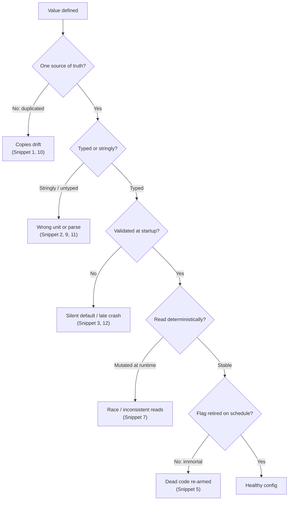

# Configuration, Constants & Feature Flags — Find the Bug

> 12 snippets where a config value, a constant, or a feature flag turns into a production incident. Every bug here is *not in the logic* — the logic is fine. The bug is in the value that governs the logic: a duplicated magic number that drifted, a stringly-typed timeout parsed in the wrong unit, a missing env var that defaulted to localhost, an immortal flag that fired dead code. Find the defect before opening the answer.

---

## Table of Contents

1. [Duplicated buffer size that drifted (Go)](#snippet-1--duplicated-buffer-size-that-drifted-go)
2. [Stringly-typed timeout, wrong unit (Python)](#snippet-2--stringly-typed-timeout-wrong-unit-python)
3. [Missing env var defaults to localhost in prod (Go)](#snippet-3--missing-env-var-defaults-to-localhost-in-prod-go)
4. [Boolean-trap call with swapped flags (Java)](#snippet-4--boolean-trap-call-with-swapped-flags-java)
5. [The immortal flag firing dead code — Knight Capital (Java)](#snippet-5--the-immortal-flag-firing-dead-code--knight-capital-java)
6. [Environment detection by hostname breaks in a new region (Go)](#snippet-6--environment-detection-by-hostname-breaks-in-a-new-region-go)
7. [Mutable global config mutated mid-request (Python)](#snippet-7--mutable-global-config-mutated-mid-request-python)
8. [Secret logged at startup (Java)](#snippet-8--secret-logged-at-startup-java)
9. [MB vs MiB unit mismatch from an untyped constant (Go)](#snippet-9--mb-vs-mib-unit-mismatch-from-an-untyped-constant-go)
10. [Flag default differs between services — split brain (Python)](#snippet-10--flag-default-differs-between-services--split-brain-python)
11. [Magic-string status compared against a renamed constant (Java)](#snippet-11--magic-string-status-compared-against-a-renamed-constant-java)
12. [Config read once at import time, env set later (Python)](#snippet-12--config-read-once-at-import-time-env-set-later-python)
13. [Scorecard](#scorecard)
14. [Related Topics](#related-topics)

---

## How to Use

Read each snippet and decide what breaks **before** expanding the answer. These bugs do not announce themselves: the code compiles, the happy path passes in CI, and the failure shows up only under a specific value, a specific environment, or a specific point in the deployment lifecycle. For each one, ask the four configuration questions:

- **Where does this value live?** One source of truth, or copies that can drift?
- **What type is it, really?** A `string` that *means* a duration, a size, a boolean?
- **When is it read?** At startup (fail-fast), per-request, or frozen at import time?
- **What happens when it is absent or wrong?** Fail loud, or default silently into a worse state?

The config lifecycle that ties these together:



---

### Snippet 1 — Duplicated buffer size that drifted (Go)

**Difficulty:** Easy

A framing protocol reads fixed-size records off a socket. The writer and the reader live in different files.

```go
// file: writer.go
const frameSize = 1024

func writeFrame(conn net.Conn, payload []byte) error {
    buf := make([]byte, frameSize)
    copy(buf, payload)            // payload is padded to frameSize
    _, err := conn.Write(buf)
    return err
}

// file: reader.go
// (six months later, someone "tuned" this for throughput)
const readBufferSize = 4096

func readFrame(conn net.Conn) ([]byte, error) {
    buf := make([]byte, readBufferSize)
    n, err := io.ReadFull(conn, buf)
    if err != nil {
        return nil, err
    }
    return buf[:n], nil
}
```

**What's wrong?**

<details><summary>Answer</summary>

**The bug.** The frame size is defined twice — `frameSize = 1024` for writing, `readBufferSize = 4096` for reading — and the two values have drifted apart. The writer emits 1024-byte frames; the reader's `io.ReadFull` will not return until it has filled a 4096-byte buffer, i.e. until it has consumed **four** frames. Every returned "frame" is actually four frames concatenated, and record boundaries are silently destroyed.

**Real-world consequence.** This is the classic "it worked until someone optimized the other side" incident. Messages get merged or split; a parser downstream sees garbage at offset 1024 and either rejects valid traffic or — worse — misinterprets the second frame's header as the first frame's body. With `io.ReadFull` the reader also *blocks* waiting for bytes that will never come on a quiet connection, manifesting as mysterious latency and hung goroutines.

**The fix.** One source of truth. The size is a single fact about the protocol, so it lives in exactly one constant that both sides import:

```go
// file: protocol.go
const FrameSize = 1024 // network frame size, bytes. Writer and reader MUST agree.

// writer.go
buf := make([]byte, protocol.FrameSize)

// reader.go
buf := make([]byte, protocol.FrameSize)
```

Now "tuning" one side is impossible without changing the shared constant, which forces a conversation. A duplicated magic number is a bug waiting for the second copy to be edited.
</details>

---

### Snippet 2 — Stringly-typed timeout, wrong unit (Python)

**Difficulty:** Easy

A worker reads its HTTP timeout from configuration.

```python
import requests

config = {
    "upstream_url": "https://payments.internal/charge",
    "request_timeout": "30",   # operator set this to "30 seconds"
}

def charge(payload):
    timeout = int(config["request_timeout"])
    return requests.post(
        config["upstream_url"],
        json=payload,
        timeout=timeout,
    )
```

**What's wrong?**

<details><summary>Answer</summary>

**The bug.** Actually the unit here is *correct by luck* — `requests` interprets `timeout` in **seconds**, so `30` means 30 s, which is what the operator intended. The real defect is one step removed and far more dangerous: nothing validates that `request_timeout` is a sane number. The string is parsed with `int(...)` at the moment of the first request, not at startup. If the operator writes `"30s"`, `"30000ms"`, or leaves a trailing space-comment like `"30 # prod"`, `int(...)` raises `ValueError` **inside the request path**, on the first real charge, in production.

This is the stringly-typed config trap: the value's *type* (a duration) is encoded as a `string`, its *unit* lives only in a comment, and its *validity* is checked nowhere until the value is used. A second, common variant of this exact bug is a library whose timeout is in **milliseconds**: copy this pattern to a client where `timeout` means ms, and `30` becomes 30 ms — every upstream call times out instantly and the service appears totally down.

**Real-world consequence.** A payment worker that throws `ValueError` on its first charge after a deploy, or (in the ms variant) a service that 100% fails because every call times out in 30 ms. Both look like total outages and both passed CI, where the config happened to be a clean integer.

**The fix.** Parse and validate at startup, into a typed value with an explicit unit:

```python
from dataclasses import dataclass

@dataclass(frozen=True)
class WorkerConfig:
    upstream_url: str
    request_timeout: float  # SECONDS

    @classmethod
    def load(cls, raw: dict) -> "WorkerConfig":
        try:
            timeout = float(raw["request_timeout"])
        except (KeyError, ValueError) as e:
            raise SystemExit(f"invalid request_timeout: {raw.get('request_timeout')!r}: {e}")
        if not (0 < timeout <= 120):
            raise SystemExit(f"request_timeout out of range: {timeout}s")
        return cls(upstream_url=raw["upstream_url"], request_timeout=timeout)

# at boot:
CONFIG = WorkerConfig.load(raw_config)   # crashes here, loudly, before serving traffic
```

The field name carries the unit (`# SECONDS`), the value is parsed once, and a bad value kills the process at boot instead of on the first customer charge.
</details>

---

### Snippet 3 — Missing env var defaults to localhost in prod (Go)

**Difficulty:** Medium

Database wiring for a service deployed across environments.

```go
func getEnv(key, fallback string) string {
    if v := os.Getenv(key); v != "" {
        return v
    }
    return fallback
}

func NewDBConfig() DBConfig {
    return DBConfig{
        Host:     getEnv("DB_HOST", "localhost"),
        Port:     getEnv("DB_PORT", "5432"),
        User:     getEnv("DB_USER", "postgres"),
        Password: getEnv("DB_PASSWORD", ""),
        Name:     getEnv("DB_NAME", "app_dev"),
    }
}
```

**What's wrong?**

<details><summary>Answer</summary>

**The bug.** Every required production secret has a *developer-friendly default*. If the prod deployment forgets to set `DB_HOST` (typo in the Helm chart, a renamed secret, a missing `envFrom`), the service does not fail — it cheerfully connects to `localhost:5432` as user `postgres` against a database named `app_dev`. The defaults are silent and they fail **closed into a wrong-but-running state**, which is worse than crashing.

**Real-world consequence.** Two failure modes, both bad. (1) There is no Postgres on `localhost` in the prod container, so the service starts, passes its liveness probe (the process is up), and fails every request with connection-refused — a partial outage that looks like a database problem, not a config problem. (2) Worse, if there *is* a local sidecar Postgres, the service silently reads and writes a throwaway `app_dev` database, so writes appear to succeed and vanish — data loss with no error anywhere. `DB_PASSWORD` defaulting to `""` also means a misconfigured prod can connect to a passwordless dev DB.

**The fix.** Required config has no default. Distinguish "optional with a sensible default" (port, pool size) from "required, fail-fast" (host, credentials):

```go
func requireEnv(key string) string {
    v := os.Getenv(key)
    if v == "" {
        log.Fatalf("required env var %s is not set", key) // fail loud, at boot
    }
    return v
}

func NewDBConfig() DBConfig {
    return DBConfig{
        Host:     requireEnv("DB_HOST"),     // no localhost fallback
        Port:     getEnv("DB_PORT", "5432"), // safe default, ok
        User:     requireEnv("DB_USER"),
        Password: requireEnv("DB_PASSWORD"),
        Name:     requireEnv("DB_NAME"),
    }
}
```

The rule: a default is appropriate only when the default is *correct in every environment*. `localhost` is correct in exactly one environment, so it must never be a default.
</details>

---

### Snippet 4 — Boolean-trap call with swapped flags (Java)

**Difficulty:** Easy

A reporting service exports user data.

```java
public byte[] exportUsers(
        boolean includePII,
        boolean compress,
        boolean encrypt) {
    List<User> users = repo.findAll();
    byte[] data = serialize(users, includePII);
    if (compress) data = gzip(data);
    if (encrypt)  data = aes256(data);
    return data;
}

// Caller — a nightly job that ships an export to a third-party analytics vendor:
byte[] export = reporter.exportUsers(true, true, false);
upload(vendorBucket, export);
```

**What's wrong?**

<details><summary>Answer</summary>

**The bug.** The call site reads `exportUsers(true, true, false)`. With the signature `(includePII, compress, encrypt)`, that decodes to **include PII = true, compress = true, encrypt = false**. The nightly job ships a file *with* personal data and *without* encryption to an external vendor's bucket. Whoever wrote the caller almost certainly believed the booleans meant something else — perhaps they read them as `(anonymize, compress, encrypt)` or simply pattern-matched "true, true, false" without checking the order. Three positional booleans are indistinguishable at the call site.

**Real-world consequence.** A regulatory and breach incident: PII (names, emails, possibly more) leaves your security boundary unencrypted, into a third party. This is a reportable data-protection violation in most jurisdictions, and the export looks completely normal in logs — it's a successful upload of a valid file. No exception, no alert. The boolean trap converts a one-character ordering mistake into a privacy breach.

**The fix.** Replace the boolean trap with an explicit, typed options object whose every value is named at the call site:

```java
public record ExportOptions(
        boolean includePII,
        boolean compress,
        boolean encrypt) {

    public static ExportOptions forExternalVendor() {
        return new ExportOptions(false, true, true); // never PII, always encrypted
    }
}

public byte[] exportUsers(ExportOptions opts) { ... }

// Caller — meaning is now self-evident and the safe path is a named factory:
byte[] export = reporter.exportUsers(ExportOptions.forExternalVendor());
```

Now `forExternalVendor()` encodes the policy ("no PII, always encrypt") in one reviewable place, and `new ExportOptions(includePII: true, ...)` would never be written by accident for a vendor upload. Boolean parameters whose meaning is invisible at the call site are a bug magnet; named constants and factories close the gap.
</details>

---

### Snippet 5 — The immortal flag firing dead code — Knight Capital (Java)

**Difficulty:** Hard

An order router has a kill-switch–style flag that controls which execution path runs. This is modeled on the 2012 Knight Capital incident.

```java
public class OrderRouter {

    // Feature flag, read once at deploy from config service.
    private final boolean powerPeg;

    public OrderRouter(FlagService flags) {
        // "power_peg" was a routing strategy retired years ago.
        this.powerPeg = flags.isEnabled("power_peg");
    }

    public void route(Order order) {
        if (powerPeg) {
            // OLD code path, dead since 2005, never removed.
            powerPegStrategy.execute(order);   // buys high, sells low in a loop
        } else {
            smartRouting.execute(order);
        }
    }
}
```

A new feature, `smart_routing_v2`, is rolled out by **reusing the old `power_peg` flag key** in the flag service (someone repurposed the dormant key instead of creating a new one), and deploying the new code to 7 of 8 servers.

**What's wrong?**

<details><summary>Answer</summary>

**The bug.** The `power_peg` flag was never *retired* — the dormant dead-code branch behind it stayed in the binary for years. When the flag key was **repurposed** to drive an unrelated new feature, flipping it to `true` did two things at once: it enabled the intended new behavior *and* re-armed the long-dead `powerPeg` branch in any binary that still contained it. On the one server that did not receive the new deploy, `powerPeg == true` now executed the ancient strategy — a loop that bought high and sold low — against live markets.

**Real-world consequence.** This is the Knight Capital Group failure of August 1, 2012. A repurposed flag combined with a partial deploy (one of eight servers running stale code) re-activated retired logic. In ~45 minutes it executed millions of erroneous trades, produced a ~$440 million loss, and effectively ended the company. The root cause was not the algorithm — it was an *immortal feature flag*: a flag that outlived its rollout, left its dead branch in the binary, and was reused as if a flag key were a free, reusable boolean.

**The fix.** Three independent disciplines, each of which alone would have prevented it:

1. **Retire flags and delete their dead branches.** Once a rollout is complete (or a strategy is abandoned), the flag *and the code it guarded* are removed. There is no `powerPeg` branch to re-arm if it no longer exists.
2. **Never repurpose a flag key.** A flag key is a permanent identifier tied to a meaning. New behavior gets a new key.
3. **Fail the deploy on flag/version mismatch.** A server should refuse to honor a flag whose guarded code it does not recognize.

```java
public void route(Order order) {
    // power_peg branch was deleted in 2006. There is nothing to re-arm.
    smartRouting.execute(order);
}

// FlagService refuses unknown/retired keys instead of returning a stale boolean:
boolean enabled = flags.requireKnown("smart_routing_v2"); // throws on retired/unknown key
```

A feature flag is a temporary scaffold with an owner and an expiry, not a permanent global boolean. The most expensive bugs in this file are not wrong values — they are flags nobody killed.
</details>

---

### Snippet 6 — Environment detection by hostname breaks in a new region (Go)

**Difficulty:** Medium

A service decides whether it is in production by inspecting its own hostname.

```go
func isProd() bool {
    host, _ := os.Hostname()
    // prod hosts are named like "prod-web-01.us-east-1.internal"
    return strings.HasPrefix(host, "prod-")
}

func sendEmail(to, body string) error {
    if !isProd() {
        // In non-prod, redirect all mail to a catch-all test inbox.
        to = "qa-catchall@example.com"
    }
    return mailer.Send(to, body)
}
```

The company opens a new region, `eu-west-1`, where the platform team names production hosts `eu-prod-web-01.eu-west-1.internal`.

**What's wrong?**

<details><summary>Answer</summary>

**The bug.** Environment is inferred from a **string pattern in the hostname** (`strings.HasPrefix(host, "prod-")`). The new region's production hosts are named `eu-prod-web-01...` — they do **not** start with `prod-`, so `isProd()` returns `false` on real production machines in `eu-west-1`. The service believes it is in a test environment.

**Real-world consequence.** Two simultaneous disasters in the new region. (1) Every outbound email to real EU customers is silently rerouted to `qa-catchall@example.com` — customers never receive password resets, receipts, or alerts, and a single internal test inbox is flooded with real customer PII. (2) Any other `isProd()`-gated behavior (debug logging, relaxed rate limits, test payment endpoints) is now active in production. The launch looks successful — the service is up — but it is operating in "test mode" against live users. Hostname-based environment detection is fragile precisely because hostnames are owned by a *different team* with their own naming conventions, and a benign rename in one region silently changes behavior everywhere.

**The fix.** Environment is an explicit, injected configuration value — never inferred from an incidental string:

```go
type Env string

const (
    EnvDev   Env = "dev"
    EnvStage Env = "stage"
    EnvProd  Env = "prod"
)

func loadEnv() Env {
    v := Env(os.Getenv("APP_ENV"))
    switch v {
    case EnvDev, EnvStage, EnvProd:
        return v
    default:
        log.Fatalf("APP_ENV must be one of dev|stage|prod, got %q", v) // fail-fast
    }
    panic("unreachable")
}

func sendEmail(env Env, to, body string) error {
    if env != EnvProd {
        to = "qa-catchall@example.com"
    }
    return mailer.Send(to, body)
}
```

`APP_ENV` is set explicitly per deployment, validated at startup against a closed set, and is independent of whatever the platform team names the hosts. A `prod` deployment that forgets to set it *crashes* rather than masquerading as test.
</details>

---

### Snippet 7 — Mutable global config mutated mid-request (Python)

**Difficulty:** Hard

A web app keeps a global config dict and lets an admin endpoint update it live.

```python
CONFIG = {
    "currency": "USD",
    "tax_rate": 0.0875,
    "rounding": "half_up",
}

def admin_update_config(key, value):
    CONFIG[key] = value          # live update, no restart needed

def checkout(cart):
    subtotal = sum(item.price for item in cart.items)
    tax = subtotal * CONFIG["tax_rate"]          # read 1
    total = subtotal + tax
    receipt = format_money(total, CONFIG["currency"])  # read 2
    log_sale(subtotal, tax, CONFIG["tax_rate"])        # read 3
    return receipt, total
```

`checkout` runs concurrently across many worker threads. An admin calls `admin_update_config("tax_rate", 0.10)` and, in a separate call, `admin_update_config("currency", "EUR")`.

**What's wrong?**

<details><summary>Answer</summary>

**The bug.** `CONFIG` is mutable global state read at **multiple points within a single request**, while another thread mutates it. Two distinct hazards:

1. **Torn read within one request.** `checkout` reads `CONFIG["tax_rate"]` at *read 1* and again at *read 3*. If the admin update lands between them, the receipt is computed with `0.0875` but the audit log records `0.10` — the logged sale disagrees with the charged amount. Similarly, `currency` (read 2) can flip from `USD` to `EUR` after the tax was already computed with the USD rate, producing a receipt that says `€` next to a USD-rate total.
2. **Cross-field inconsistency.** Updating `tax_rate` and `currency` are two separate calls, so a request can observe the new tax rate with the old currency — a state combination that was never valid.

**Real-world consequence.** Financial records that don't reconcile: the amount charged, the amount on the receipt, and the amount in the audit log can all differ for the same transaction, intermittently, only under concurrent admin updates. This is the worst kind of bug — non-deterministic, unreproducible in tests, and discovered weeks later by an accountant who finds the books don't balance.

**The fix.** Configuration is an **immutable snapshot** captured once per request and read consistently; updates swap the whole snapshot atomically rather than mutating fields in place:

```python
from dataclasses import dataclass

@dataclass(frozen=True)
class Config:
    currency: str
    tax_rate: float
    rounding: str

_current = Config("USD", 0.0875, "half_up")  # the live snapshot

def get_config() -> Config:
    return _current  # atomic reference read; the object is immutable

def admin_update_config(**changes):
    global _current
    _current = replace(_current, **changes)  # atomic swap of a fully-formed snapshot

def checkout(cart):
    cfg = get_config()                 # one consistent snapshot for the whole request
    subtotal = sum(i.price for i in cart.items)
    tax = subtotal * cfg.tax_rate
    total = subtotal + tax
    receipt = format_money(total, cfg.currency)
    log_sale(subtotal, tax, cfg.tax_rate)   # same snapshot — log always matches charge
    return receipt, total
```

A request binds `cfg` once; all three reads come from the same frozen object, so they can never disagree. Updates replace the reference atomically, so no request ever sees a half-applied change. Mutable global config read at arbitrary times is non-determinism by construction.
</details>

---

### Snippet 8 — Secret logged at startup (Java)

**Difficulty:** Easy

A service logs its resolved configuration on boot to aid debugging.

```java
public class AppConfig {
    private final String dbUrl;
    private final String dbUser;
    private final String dbPassword;
    private final String stripeApiKey;

    @Override
    public String toString() {
        return "AppConfig{" +
                "dbUrl=" + dbUrl +
                ", dbUser=" + dbUser +
                ", dbPassword=" + dbPassword +
                ", stripeApiKey=" + stripeApiKey +
                '}';
    }
}

// On boot:
log.info("Starting with config: {}", appConfig);
```

**What's wrong?**

<details><summary>Answer</summary>

**The bug.** `toString()` serializes **every field, including `dbPassword` and `stripeApiKey`**, and the boot log line prints it. Secrets are now written in plaintext to the application log on every startup.

**Real-world consequence.** Logs are the least-protected data in most systems. They are shipped to a centralized aggregator (Splunk, Datadog, CloudWatch), retained for months, indexed and searchable by anyone with read access to logging — a far larger group than those with access to the secret store. They are scraped into incident tickets, pasted into Slack, and included in support bundles customers email around. A secret in a log is effectively a *published* secret. Once the live Stripe key and DB password are in the log pipeline, the correct remediation is full rotation of both, plus an audit of everywhere the log lines propagated. This is one of the most common ways production credentials leak, and it is invariably introduced by a well-meaning "let's log the config so we can debug deploys" change.

**The fix.** Secrets must be unprintable by construction. Wrap them in a type whose `toString()` redacts, and never put a raw secret in a loggable field:

```java
public final class Secret {
    private final String value;
    public Secret(String value) { this.value = value; }
    public String reveal() { return value; }      // explicit, greppable
    @Override public String toString() { return "***REDACTED***"; }
}

public class AppConfig {
    private final String dbUrl;
    private final String dbUser;
    private final Secret dbPassword;
    private final Secret stripeApiKey;

    @Override public String toString() {
        return "AppConfig{dbUrl=" + dbUrl + ", dbUser=" + dbUser +
               ", dbPassword=" + dbPassword +     // -> ***REDACTED***
               ", stripeApiKey=" + stripeApiKey + '}';
    }
}
```

Now logging the whole config is safe, accessing the secret requires an explicit `.reveal()` call that shows up in code review, and the default representation is always redacted. Make leaking a secret require effort; make redaction the default.
</details>

---

### Snippet 9 — MB vs MiB unit mismatch from an untyped constant (Go)

**Difficulty:** Medium

An upload handler enforces a maximum file size that operators configure "in MB."

```go
// Operators configure MAX_UPLOAD_MB=10 meaning "10 megabytes".
const bytesPerMB = 1000 * 1000 // decimal megabyte

func maxUploadBytes() int64 {
    mb, _ := strconv.Atoi(os.Getenv("MAX_UPLOAD_MB"))
    return int64(mb) * bytesPerMB
}

// Elsewhere, a buffer is pre-allocated using a different idea of "MB":
const oneMiB = 1 << 20 // 1024 * 1024

func newUploadBuffer(maxMB int) []byte {
    return make([]byte, maxMB*oneMiB) // pre-allocate the max
}
```

`maxUploadBytes()` is used to reject oversized uploads; `newUploadBuffer(10)` pre-allocates the receive buffer.

**What's wrong?**

<details><summary>Answer</summary>

**The bug.** Two different definitions of "MB" coexist behind untyped `int` constants. The size *limit* uses `bytesPerMB = 1_000_000` (decimal MB), so the gate rejects anything over `10 * 1_000_000 = 10,000,000` bytes. The *buffer* uses `oneMiB = 1,048,576` (binary MiB), so it allocates `10 * 1,048,576 = 10,485,760` bytes. The two numbers describe the same conceptual "10 MB" but differ by ~4.86%. Neither value carries its unit in the type system — both are bare `int`/`int64` — so nothing flags the mismatch.

**Real-world consequence.** The direction of the mismatch decides the failure. Here the buffer (10,485,760) is *larger* than the limit (10,000,000), so the limit rejects files before they can overflow the buffer — latent but harmless, until someone "simplifies" by computing the buffer from the same MB constant and the relationship inverts. The dangerous variant: a limit in MiB and a buffer in MB. Then the gate admits a 10,485,760-byte file while the buffer is only 10,000,000 bytes — a guaranteed out-of-bounds write or truncation on the largest allowed uploads, i.e. a buffer overflow triggered by a perfectly legal file. Either way, the limit the operator *thinks* they set ("10 MB") is not the limit the system enforces, and the discrepancy is invisible because the constants are untyped numbers.

**The fix.** Make byte sizes a single typed quantity with one canonical definition, so the unit cannot drift:

```go
type Bytes int64

const (
    KiB Bytes = 1 << 10
    MiB Bytes = 1 << 20
)

// One definition. The limit and the buffer derive from the SAME value.
func maxUpload() Bytes {
    mb, err := strconv.Atoi(os.Getenv("MAX_UPLOAD_MB"))
    if err != nil {
        log.Fatalf("MAX_UPLOAD_MB invalid: %v", err)
    }
    return Bytes(mb) * MiB // documented: MB here means MiB
}

func newUploadBuffer(limit Bytes) []byte {
    return make([]byte, limit) // identical units, identical source
}

// usage: both the gate and the buffer use one value
limit := maxUpload()
buf := newUploadBuffer(limit)
```

The buffer and the limit now derive from one `Bytes` value with one definition of the unit. A typed quantity makes "is this MB or MiB?" a question you answer once, at the definition, instead of a silent disagreement between two constants.
</details>

---

### Snippet 10 — Flag default differs between services — split brain (Python)

**Difficulty:** Hard

A producer service and a consumer service both gate the same new wire format behind a flag, but each defines its own default.

```python
# ---- producer service: orders-api ----
def use_v2_format() -> bool:
    # default True: the producer team already shipped and tested v2
    return os.getenv("ENABLE_V2_FORMAT", "true").lower() == "true"

def publish(order):
    if use_v2_format():
        payload = encode_v2(order)   # new schema, extra fields, different envelope
    else:
        payload = encode_v1(order)
    queue.put(payload)

# ---- consumer service: fulfillment-worker (different repo, different team) ----
def use_v2_format() -> bool:
    # default False: the consumer team hasn't finished v2 support yet
    return os.getenv("ENABLE_V2_FORMAT", "false").lower() == "true"

def handle(payload):
    if use_v2_format():
        order = decode_v2(payload)
    else:
        order = decode_v1(payload)   # will mis-parse a v2 envelope
    fulfill(order)
```

Both services deploy to an environment where `ENABLE_V2_FORMAT` is **not set** (nobody added it to that env's config).

**What's wrong?**

<details><summary>Answer</summary>

**The bug.** The same flag, `ENABLE_V2_FORMAT`, has **two different defaults** baked into two different services. In an environment where the variable is unset, the producer defaults to `true` and emits v2 payloads, while the consumer defaults to `false` and decodes them as v1. The two halves of the system disagree about the format on the wire — a split-brain caused entirely by inconsistent default values for a shared flag.

**Real-world consequence.** The producer publishes v2 envelopes; the consumer runs `decode_v1` on them. Best case it throws and the messages dead-letter — a backlog of unprocessable orders that fulfillment silently stops working. Worst case `decode_v1` *succeeds* on the v2 bytes but maps fields wrong (a v2 envelope whose first field happens to parse as a v1 field), and orders are fulfilled with corrupted data — wrong quantities, wrong addresses. The incident is confined to the one environment where the var was forgotten, so it passes everywhere it was explicitly set and only the neglected staging/region breaks, making it look environment-specific rather than a config-default bug.

**The fix.** A flag that governs a contract between services has **one** default, defined in **one** shared place, and is validated to be present:

```python
# shared config library imported by BOTH services
def wire_format_v2_enabled() -> bool:
    raw = os.getenv("ENABLE_V2_FORMAT")
    if raw is None:
        raise SystemExit("ENABLE_V2_FORMAT must be set explicitly (no default for a wire-format flag)")
    return raw.lower() == "true"
```

For a flag that crosses a service boundary, an *implicit* default is the enemy: each side picks the default that is convenient for its own rollout, and the two choices contradict. Requiring the flag to be set explicitly forces both services into the same value, and shipping the resolver in a shared library means there is exactly one default to disagree about — none. Coordinate the *flip* too: producer-emits-v2 must not precede consumer-understands-v2.
</details>

---

### Snippet 11 — Magic-string status compared against a renamed constant (Java)

**Difficulty:** Medium

An order state machine checks status with string literals in some places and a constant in others.

```java
public class OrderStatus {
    public static final String SHIPPED = "SHIPPED";
    // A refactor renamed the persisted value from "COMPLETE" to "COMPLETED"
    // and updated this constant — but missed an inline literal elsewhere.
    public static final String COMPLETED = "COMPLETED";
}

public boolean canRefund(Order order) {
    // uses the constant — correct
    return order.getStatus().equals(OrderStatus.COMPLETED)
        || order.getStatus().equals(OrderStatus.SHIPPED);
}

public boolean isFinal(Order order) {
    // uses an inline magic string — NOT updated during the rename
    return order.getStatus().equals("COMPLETE")
        || order.getStatus().equals("CANCELLED");
}
```

**What's wrong?**

<details><summary>Answer</summary>

**The bug.** The persisted status value was renamed from `"COMPLETE"` to `"COMPLETED"`. The constant `OrderStatus.COMPLETED` was updated, and `canRefund` (which uses the constant) is correct. But `isFinal` compares against the **inline magic string `"COMPLETE"`** — the old value — which was missed during the rename because it isn't tied to the constant. After the rename, no order ever has status `"COMPLETE"`, so `isFinal` returns `false` for every completed order.

**Real-world consequence.** `isFinal` is presumably used to decide whether an order can still be modified, re-charged, or transitioned. Because completed orders are no longer recognized as final, they remain "open": they may be re-processed, re-billed, edited after the fact, or never archived — depending on what `isFinal` gates. The bug is invisible in code review (the string *looks* like a valid status) and invisible in CI if the test fixtures were also updated to the new value, so the test data says `"COMPLETED"` and never exercises the stale `"COMPLETE"` branch. Magic strings duplicate a value that should have one home; when the value changes, the copies the refactor missed rot silently.

**The fix.** Eliminate the magic string entirely — better, make the status a type the compiler checks so a rename is mechanical and a stale value won't compile:

```java
public enum OrderStatus {
    PENDING, SHIPPED, COMPLETED, CANCELLED;

    public boolean isFinal()  { return this == COMPLETED || this == CANCELLED; }
    public boolean canRefund(){ return this == COMPLETED || this == SHIPPED; }
}

public boolean isFinal(Order order)  { return order.getStatus().isFinal(); }
public boolean canRefund(Order order){ return order.getStatus().canRefund(); }
```

With an `enum`, renaming `COMPLETE` to `COMPLETED` is a single edit that the compiler propagates everywhere; a stale `"COMPLETE"` literal simply cannot exist. Whenever a value is compared in more than one place, it must be a named symbol with one definition — never a string literal copied around.
</details>

---

### Snippet 12 — Config read once at import time, env set later (Python)

**Difficulty:** Medium

A module computes its config at import time.

```python
# settings.py
import os

# evaluated the moment this module is first imported
FEATURE_NEW_PRICING = os.getenv("FEATURE_NEW_PRICING", "false").lower() == "true"
PRICING_REGION = os.getenv("PRICING_REGION", "us")

# pricing.py
from settings import FEATURE_NEW_PRICING, PRICING_REGION

def price(item):
    if FEATURE_NEW_PRICING:
        return new_pricing(item, PRICING_REGION)
    return legacy_pricing(item)
```

A test (and, separately, a worker bootstrap script) sets the environment *after* importing the application:

```python
# conftest.py / bootstrap.py
import app                      # this imports settings.py -> reads env NOW
import os
os.environ["FEATURE_NEW_PRICING"] = "true"   # too late
os.environ["PRICING_REGION"] = "eu"          # too late
```

**What's wrong?**

<details><summary>Answer</summary>

**The bug.** `settings.py` reads the environment **at import time**, and `pricing.py` does `from settings import FEATURE_NEW_PRICING` — a *by-value* binding captured at its own import. By the time the bootstrap script sets `os.environ[...]`, `settings.py` has already run and frozen `FEATURE_NEW_PRICING = False` and `PRICING_REGION = "us"`. Setting the env vars afterward has no effect: the module-level constants were computed once and the `from ... import name` copied those values into `pricing`'s namespace.

**Real-world consequence.** The feature flag *appears* to do nothing. The team sets `FEATURE_NEW_PRICING=true` in the bootstrap (or a test sets it in `conftest.py`), runs the worker, and new pricing never activates — `price()` keeps calling `legacy_pricing` against region `"us"` even for EU customers. It looks like the flag is broken or the rollout failed, and engineers waste hours toggling a flag that was read before they set it. The import-time read also makes the value depend on *import order*, so the same code behaves differently depending on which module loaded first — a heisenbug. This is one of the most common Python config traps.

**The fix.** Read configuration through a function (or a lazily-resolved object) at the moment it is *used*, not frozen at import:

```python
# settings.py
import os
from functools import lru_cache
from dataclasses import dataclass

@dataclass(frozen=True)
class Settings:
    feature_new_pricing: bool
    pricing_region: str

@lru_cache(maxsize=1)
def get_settings() -> Settings:
    return Settings(
        feature_new_pricing=os.getenv("FEATURE_NEW_PRICING", "false").lower() == "true",
        pricing_region=os.getenv("PRICING_REGION", "us"),
    )

# pricing.py
from settings import get_settings

def price(item):
    s = get_settings()                 # resolved on first call, after env is set
    if s.feature_new_pricing:
        return new_pricing(item, s.pricing_region)
    return legacy_pricing(item)
```

Now the env is read on first *use*, after the bootstrap has set it. The `lru_cache` still guarantees a single consistent snapshot (so the value can't drift mid-process), and tests can clear the cache (`get_settings.cache_clear()`) to inject a fresh config. *When* config is read matters as much as *what* it says: import-time reads silently capture whatever the environment happened to be at import.
</details>

---

## Scorecard

Tally how many you diagnosed correctly before opening the answer.

| Snippet | Bug class | Difficulty | Got it? |
|---|---|---|---|
| 1 | Duplicated constant drifted (buffer vs consumer) | Easy | ☐ |
| 2 | Stringly-typed value, unvalidated unit | Easy | ☐ |
| 3 | Missing env var → silent localhost default | Medium | ☐ |
| 4 | Boolean trap, swapped positional flags | Easy | ☐ |
| 5 | Immortal / repurposed flag re-arms dead code (Knight Capital) | Hard | ☐ |
| 6 | Hostname-based env detection breaks in new region | Medium | ☐ |
| 7 | Mutable global config mutated mid-request | Hard | ☐ |
| 8 | Secret logged via `toString()` | Easy | ☐ |
| 9 | MB vs MiB mismatch from untyped constants | Medium | ☐ |
| 10 | Shared flag, divergent defaults → split brain | Hard | ☐ |
| 11 | Magic string vs renamed constant rots | Medium | ☐ |
| 12 | Config frozen at import time, env set later | Medium | ☐ |

**Scoring:**

- **10–12 correct** — You read config the way you read code: with suspicion. You instinctively ask "where does this value live, what type is it really, and when is it read?" Senior-level instincts.
- **6–9 correct** — Solid. You catch the obvious duplication and boolean traps; sharpen your eye for *timing* bugs (snippets 7 and 12) and *cross-service* defaults (snippet 10), which hide best.
- **3–5 correct** — You see bugs in logic but trust configuration too much. The lesson of this chapter: a value is as dangerous as a function. Re-read snippets 5, 7, and 10.
- **0–2 correct** — Start with the positive rules in the [chapter README](../README.md), then return. Configuration bugs are over-represented in real outages precisely because they look harmless.

The pattern across every bug: **the logic was never wrong.** The value that governs the logic was duplicated, mistyped, defaulted, mutated, or never retired. Treat config, constants, and flags with the same rigor you give the code they steer.

---

## Related Topics

- [junior.md](junior.md) — the foundational rules: named constants, single source of truth, fail-fast validation.
- [tasks.md](tasks.md) — hands-on exercises to harden config: typed settings, flag retirement, secret redaction.
- [Chapter README](../README.md) — the positive rules and the full anti-pattern list for configuration.
- [Anti-Patterns](../../anti-patterns/README.md) — the immortal-flag and stringly-typed config smells in their broader catalog.
- [Refactoring](../../refactoring/README.md) — Replace Magic Number/String with Symbolic Constant, Introduce Parameter Object, and Encapsulate Field, which fix several bugs above.
