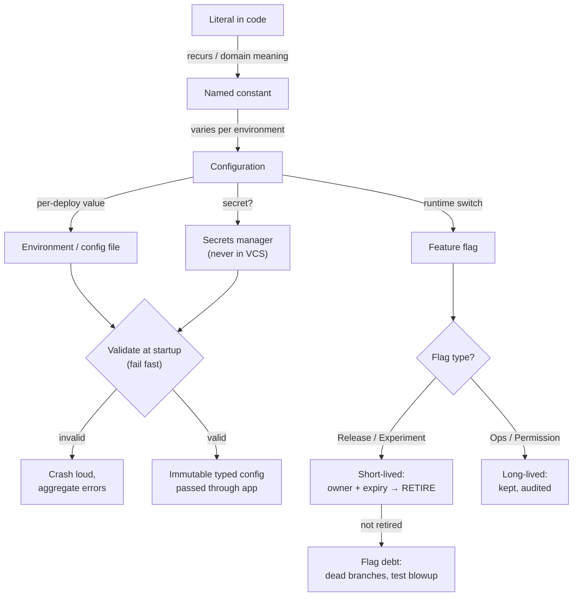

# Configuration, Constants & Feature Flags — Interview Questions

> 50+ questions across all tiers (Junior → Staff). Configuration is where logic meets the outside world: the value that lives outside the code, the constant that names a magic number, the flag that decouples deploy from release. Most production outages with a single root cause trace back to a *config* change, not a code change. Use this as self-review or interview prep.

## Table of Contents

- [Junior (14 questions)](#junior-14-questions)
- [Mid (15 questions)](#mid-15-questions)
- [Senior (14 questions)](#senior-14-questions)
- [Staff (10 questions)](#staff-10-questions)
- [Rapid-Fire](#rapid-fire)
- [Summary](#summary)
- [Further Reading](#further-reading)
- [Related Topics](#related-topics)

---

## Junior (14 questions)

### J1. What is a magic number?

<details><summary>Answer</summary>

A bare literal in code whose meaning isn't obvious — `if (retries > 3)`, `sleep(86400)`, `total * 0.15`. The reader has to guess what `3`, `86400`, or `0.15` *mean*. Replace with a named constant: `MAX_RETRIES`, `SECONDS_PER_DAY`, `VAT_RATE`. The name documents intent, and the single declaration becomes the one place to change the value.

</details>

### J2. Are `0`, `1`, and `-1` magic numbers?

<details><summary>Answer</summary>

Usually not. They're idiomatic structural values: `i = 0`, `len - 1`, `count + 1`, `return -1` for "not found." Naming them (`const ZERO = 0`) adds noise without intent. The test is *semantic*: does the literal carry **domain** meaning a name would clarify? `0.15` (a tax rate) does; `0` (a loop start index) doesn't.

</details>

### J3. What's wrong with copy-pasting the same constant value into three files?

<details><summary>Answer</summary>

It violates single source of truth. When the value changes you must find and update every copy — and you *will* miss one. The copies silently drift apart, and the system behaves inconsistently depending on which file's value executes. Declare the constant once and import it everywhere.

</details>

### J4. What is a feature flag?

<details><summary>Answer</summary>

A runtime switch that turns a code path on or off without redeploying. `if (flags.enabled("new-checkout")) { newCheckout() } else { oldCheckout() }`. It decouples **deploy** (shipping code) from **release** (exposing behavior to users), enabling gradual rollout, instant rollback without a redeploy, and A/B testing.

</details>

### J5. What is configuration?

<details><summary>Answer</summary>

Any value that governs behavior but lives *outside* the compiled logic: database URLs, timeouts, port numbers, API keys, feature toggles, log levels. The discriminator is that it varies between environments or over time without changing the program's meaning. Configuration is *data the program reads*, not logic the program executes.

</details>

### J6. Why should the database URL be configuration rather than hard-coded?

<details><summary>Answer</summary>

Because it differs per environment — `localhost` in dev, a private endpoint in staging, a clustered host in prod. Hard-coding it forces a code change and redeploy to point at a different database, and (worse) tempts developers to commit a production host into source. Configuration lets the same artifact run anywhere.

</details>

### J7. What does "fail fast" mean for configuration?

<details><summary>Answer</summary>

Validate all required config at **startup** and crash immediately with a clear message if anything is missing or malformed — *before* serving a single request. The alternative ("fail late") is a `NullPointerException` at 3 a.m. on the first request that happens to read a missing setting. Fail fast turns a runtime mystery into a deterministic boot-time error.

</details>

### J8. Where should secrets like API keys live?

<details><summary>Answer</summary>

**Never in version control.** Inject them at runtime from the environment or a secrets manager (Vault, AWS Secrets Manager, Kubernetes Secrets). Source files (and `.env` files) get cloned, forked, and leaked. A key committed to Git is compromised forever — Git history is permanent, so you must *rotate* the key, not just delete the line.

</details>

### J9. What is a `.env` file and what's the catch?

<details><summary>Answer</summary>

A local file of `KEY=value` pairs loaded into the environment for development convenience. The catch: it tends to drift toward holding real secrets, and someone always commits it by accident. Always `.gitignore` it, commit a `.env.example` with dummy values, and never use it in production — prod reads from the real environment or a secrets store.

</details>

### J10. What's the difference between a constant and configuration?

<details><summary>Answer</summary>

A **constant** is a fixed value baked into the build that never varies at runtime (`PI`, `MAX_UPLOAD_SIZE`, an HTTP status code). **Configuration** varies between environments or deployments without recompiling. Rule of thumb: if it changes per environment, it's config; if it's a universal truth of the program, it's a constant.

</details>

### J11. What is "stringly-typed" configuration?

<details><summary>Answer</summary>

Treating every config value as a raw `String` and parsing it ad hoc at the point of use: `Integer.parseInt(config.get("timeout"))` scattered across the code. It pushes type errors (`"thirty"` instead of `30`) to runtime, far from the source. The cure is *typed* config: parse and validate once into a struct with real types.

</details>

### J12. Should a feature flag's name say what it does?

<details><summary>Answer</summary>

Yes — and it should also encode *intent and ownership*. `new-checkout` is vague; `release-2024q3-checkout-v2` or `ops-disable-recommendations` tells you the flag's purpose, era, and type. A good name makes the flag's eventual *retirement* obvious: nobody can tell when `flag_x` is safe to delete.

</details>

### J13. What's a boolean-trap flag?

<details><summary>Answer</summary>

A boolean argument that toggles behavior, making the call site opaque: `createUser(true, false)`. What do `true` and `false` mean? You can't tell without checking the signature. The same trap applies to flags wired straight into a parameter. Cure: named options/enums, or separate methods. Self-documenting call sites beat positional booleans.

</details>

### J14. Why not just read environment variables directly wherever you need them?

<details><summary>Answer</summary>

Because `os.getenv("TIMEOUT")` sprinkled across the codebase has no central validation, no defaults, no types, and no single place to see what the app needs to run. Read the environment **once** at startup into a typed config object, validate it, then pass that object around. The rest of the code never touches the environment directly.

</details>

---

## Mid (15 questions)

### M1. Explain the 12-factor app's "config in the environment."

<details><summary>Answer</summary>

Factor III of the 12-factor methodology: store config that varies between deploys (credentials, hostnames, resource handles) in **environment variables**, not in code or committed config files. Benefits: strict separation of code and config, language-agnostic access, no risk of committing a prod config file, and the same build artifact promoted unchanged from staging to prod. The litmus test: *could you open-source the repo right now without leaking credentials?*

</details>

### M2. What's the criticism of pure environment-variable config?

<details><summary>Answer</summary>

Env vars are a flat, untyped, string-only namespace with no structure, no comments, no nesting. For large config (dozens of nested settings, lists, per-tenant maps) they get unwieldy and error-prone. Many teams use a hybrid: structured config files (YAML/TOML) for the *shape*, env vars (or a secrets store) for *secrets and per-environment overrides*. 12-factor's "everything in env" is a guideline, not dogma.

</details>

### M3. Describe a sane config precedence order.

<details><summary>Answer</summary>

From lowest to highest priority: **built-in defaults → config file → environment variables → command-line flags**. More specific and more operationally immediate sources override more general ones. The key requirements: the order is *documented*, *deterministic*, and the effective merged config can be *dumped/logged* (with secrets redacted) so an operator can answer "what value is actually in effect, and where did it come from?"

</details>

### M4. What does typed config look like, and why prefer it?

<details><summary>Answer</summary>

Parse the raw key-value soup *once* into a struct with real types, then pass that struct around:

```go
type Config struct {
    Port    int           `env:"PORT" default:"8080"`
    Timeout time.Duration `env:"TIMEOUT" default:"30s"`
    DBURL   string        `env:"DATABASE_URL,required"`
    Debug   bool          `env:"DEBUG" default:"false"`
}
```

A parse failure (`PORT=abc`) is caught at load time, in one place, with a clear error — not at the call site, in production, on the unlucky request. The rest of the code consumes `cfg.Timeout` as a real `Duration` with no parsing.

</details>

### M5. What's the difference between release flags and ops flags?

<details><summary>Answer</summary>

A **release flag** hides in-progress work and enables gradual rollout of a new feature; it is *short-lived* and should be removed once the feature is fully shipped. An **ops flag** (operational toggle / kill switch) lets operators degrade or disable a subsystem under load or during an incident; it may live for the *lifetime of the subsystem*. They have opposite lifetimes, which is why conflating "all flags" into one bucket leads to flag debt.

</details>

### M6. Name the four canonical feature-flag types and their lifetimes.

<details><summary>Answer</summary>

From Pete Hodgson's taxonomy:

| Type | Purpose | Lifetime | Dynamism |
|---|---|---|---|
| **Release** | hide in-progress features, gradual rollout | days–weeks (delete after launch) | static per deploy |
| **Experiment** | A/B test, multivariate | days–weeks (delete after decision) | per-request (per user) |
| **Ops** | kill switch, degrade under load | months–years (lives with the system) | runtime, by operators |
| **Permission** | gate features by user/plan/region | long-lived / permanent | per-request (per user) |

The mistake is treating a release flag like a permanent one — it should die, not graduate to permanent.

</details>

### M7. What is flag debt and how do you control it?

<details><summary>Answer</summary>

Flag debt is the accumulation of flags that have outlived their purpose: each adds a branch, doubles the logical test matrix, and rots into dead-but-scary code nobody dares delete. Control it by treating every release/experiment flag as *temporary by construction*: give it an owner and an expiry date at creation, file a retirement ticket the moment it launches, alert on flags older than N days, and make removing the flag part of the feature's "definition of done."

</details>

### M8. How do you retire a feature flag safely?

<details><summary>Answer</summary>

1. Confirm the flag is fully rolled out (100% on) and stable for a soak period.
2. Delete the *losing* branch and the conditional, keeping only the winning path.
3. Remove the flag's definition from the flag system.
4. Delete config, tests, and dashboards referencing it.

Do it as a dedicated PR, not bundled with new work, so it's trivially reviewable and revertible. The hardest part is organizational: someone must own the deletion, or it never happens.

</details>

### M9. Knight Capital lost $440M in 45 minutes. What's the config lesson?

<details><summary>Answer</summary>

In 2012 Knight deployed new code to 7 of 8 servers. The 8th still ran code that *reused an old, repurposed feature flag* — a flag whose meaning had silently changed. On the un-updated server the flag activated dead, eight-year-old "Power Peg" order-routing logic, which fired millions of erroneous trades. Lessons: (1) **never reuse a flag for a new meaning** — retire the old one and create a new name; (2) deploys must be all-or-nothing and verified per node; (3) dead code behind a flag is a loaded gun. A config/flag discrepancy across nodes bankrupted a company in under an hour.

</details>

### M10. What is the "configuration complexity clock"?

<details><summary>Answer</summary>

Mike Hadlow's observation that configurability moves in a circle. You start with **hard-coded values** (simplest). Requirements grow, so you move to a **config file**. Then you need conditional logic in config, so you build a **rules engine**. Then non-developers need to author rules, so you build a **DSL**. The DSL grows until it's a badly-designed programming language — at which point the simplest thing would be... **hard-coded values in real code** again. The lesson: every step toward configurability has a cost; don't make things configurable speculatively.

</details>

### M11. Should everything be configurable? (trick)

<details><summary>Answer</summary>

No. Every config knob is a surface for misconfiguration, a branch to test, and a decision deferred to whoever sets it (often at 3 a.m. during an incident, with no context). Configurability has real cost — see the complexity clock. Make something configurable only when there's a *concrete, demonstrated* need for it to vary (per environment, per customer, by operators in an incident). A hard-coded sensible default beats an unused, untested knob. "We might need to change it someday" is not a need.

</details>

### M12. Is a feature flag free? (trick)

<details><summary>Answer</summary>

No. Each flag adds a code branch, doubles the test combinations for that path (2 flags = 4 paths, 10 flags = 1024), adds a lookup at runtime, and creates debt that must be actively retired. Flags are a powerful tool with a *carrying cost* paid over the flag's whole life, not just at creation. Adding the `if` is the cheapest moment; deleting it later is the expensive part everyone forgets to budget for.

</details>

### M13. Config file or environment variable? (trick)

<details><summary>Answer</summary>

It depends on the value's nature, and the honest answer is "usually both." **Env vars** for per-deploy secrets and environment-specific handles (12-factor) — injectable, never committed. **Config files** for structured, non-secret, version-controllable settings (feature defaults, route tables, log formats) where you want comments, nesting, and a reviewable diff. The anti-pattern is forcing all config into one mechanism: secrets in a committed YAML file, or a 40-field nested structure flattened into 40 env vars.

</details>

### M14. When does a constant belong inline rather than extracted? (trick)

<details><summary>Answer</summary>

When the literal is *self-explanatory in context* and naming it would add indirection without clarity. `for (i = 0; i < n; i++)`, `array[len - 1]`, `x / 2` — extracting `LOOP_START`, `HALF_DIVISOR` hurts readability. Extract when the value (a) recurs, (b) carries non-obvious domain meaning, or (c) is likely to change. A single, obvious, locally-scoped literal can stay inline.

</details>

### M15. What's the danger of mutable global config read at arbitrary times?

<details><summary>Answer</summary>

Non-determinism. If config is a mutable global that any code can read at any moment — and something can mutate it mid-flight — two requests in the same process can see different values, and behavior depends on *when* the read happened relative to the write. This produces Heisenbugs that vanish on retry. Cure: load config into an **immutable** object at startup; if it must change at runtime (flags), make updates atomic and snapshot the value at the start of a request so one request sees one consistent view.

</details>

---

## Senior (14 questions)

### S1. How do you design config validation that fails fast *and* helpfully?

<details><summary>Answer</summary>

Validate the entire config at startup and **aggregate** errors rather than dying on the first one:

```go
var errs []string
if cfg.Port < 1 || cfg.Port > 65535 { errs = append(errs, "PORT must be 1–65535") }
if cfg.DBURL == "" { errs = append(errs, "DATABASE_URL is required") }
if cfg.Timeout <= 0 { errs = append(errs, "TIMEOUT must be positive") }
if len(errs) > 0 { log.Fatalf("invalid config:\n  - %s", strings.Join(errs, "\n  - ")) }
```

> **What the interviewer is really checking:** do you treat operator experience as part of reliability? Dying with all errors in one shot lets an operator fix everything in one edit; dying on the first error forces N restart cycles. Validation is a UX surface for whoever boots the service.

</details>

### S2. How do you keep a single source of truth across services that share config?

<details><summary>Answer</summary>

Options, roughly by scale: (1) a **shared library** of constants imported by each service (monorepo, same language); (2) a **generated artifact** — define values once in a schema (protobuf, JSON Schema) and code-gen typed constants per language; (3) a **central config service** (Consul, etcd, AppConfig) services fetch at startup, with the schema versioned. The trap is duplication-by-copy across repos. Whatever the mechanism, exactly one place is authoritative and the rest *derive* from it.

</details>

### S3. How do you do percentage-based / canary rollout with a flag?

<details><summary>Answer</summary>

Hash a stable key (user ID) into a bucket 0–99 and compare against the rollout percentage: `bucket(userID) < rolloutPct`. Hashing the *user* (not a random number) ensures a given user gets a *consistent* experience across requests — sticky, not flickering. Ramp the percentage up (1% → 5% → 25% → 100%) while watching error rates and latency, ready to drop back to 0% instantly. This is the mechanical core of progressive delivery.

</details>

### S4. What is progressive delivery?

<details><summary>Answer</summary>

The practice of rolling out changes *gradually* and *controllably* rather than to everyone at once — canary releases, percentage rollouts, ring deployments (internal → beta → general), and automatic rollback gated on metrics. Feature flags are the control plane; observability is the feedback loop. The goal is to limit the blast radius of a bad change to a small population you can recover before it becomes an incident.

</details>

### S5. How do you make feature-flag evaluation testable?

<details><summary>Answer</summary>

Hide the flag system behind an interface (`FlagProvider.enabled(key, context)`) and inject it. Tests supply a fake provider with flags pinned on/off, so you can test both branches deterministically without touching the real flag service. The corollary: don't call a global flag singleton directly from business logic — that's an untestable hidden dependency, the flag equivalent of a hard-coded global.

</details>

### S6. How should config errors be surfaced in observability?

<details><summary>Answer</summary>

(1) Log the full effective config at boot with secrets **redacted**, so an incident responder can confirm what's actually in effect. (2) Emit a metric/event on every flag flip and config reload, with who/what/when, so a config change is correlatable with a metrics anomaly. (3) Tag spans/logs with the active flag variants. Because config changes cause outages disproportionately, "what config was live at time T?" must be answerable from telemetry, not from guessing.

</details>

### S7. A required secret is missing in prod. Fail fast or use a default? (trick)

<details><summary>Answer</summary>

Fail fast — crash at boot with a loud, specific error. A "silent default" for a *required* secret (an empty string, a dummy key) is the worst case: the service starts, looks healthy, and fails subtly later — authenticating as nobody, writing to the wrong store, or serving with security disabled. A missing *required* setting should fail closed and loud. Defaults are only legitimate for genuinely *optional* settings with a safe fallback.

</details>

### S8. How do you handle config changes without a redeploy, safely?

<details><summary>Answer</summary>

Watch the source (a file, a config service, a flag SDK with streaming) and reload atomically into a *new* immutable config object, then swap the pointer in one operation — never mutate fields in place. **Validate the new config before swapping**, and reject the reload (keeping the old config) if validation fails, logging loudly. The dangerous version is partial in-place mutation that leaves the system in a half-old, half-new state mid-request.

</details>

### S9. Flag in the data layer or in the application layer?

<details><summary>Answer</summary>

Generally the application layer, as high up the call stack as practical — ideally one clear branch point near the request boundary, not flag checks scattered through deep functions. A flag sprinkled across ten call sites is ten places to get the logic wrong and ten things to delete at retirement. Concentrate the toggle: one `if` selecting a strategy/implementation, with the two paths cleanly separated, so retirement is "delete one branch."

</details>

### S10. How do you avoid a combinatorial explosion of flag interactions?

<details><summary>Answer</summary>

Keep flags **independent** (orthogonal) by design; avoid flags whose correct value depends on another flag's value. Minimize the number of *simultaneously active* release flags (retire aggressively). Test the *realistic* combinations, not all 2^n — the on/on and the current-prod state plus the target state. If two flags are genuinely coupled, that's a smell that they should be one flag with an enum variant, not two booleans.

</details>

### S11. What's the difference between a flag and a config setting?

<details><summary>Answer</summary>

Overlapping but distinct. A **feature flag** is typically boolean/enum, often evaluated per-request with targeting (this user, this region), and frequently *temporary*. A **config setting** is typically a typed scalar/structure, evaluated per-deploy or per-process, and *long-lived*. A flag system adds targeting, gradual rollout, and audit on top of plain config. Using a heavyweight flag platform for a static timeout is overkill; using a static config value for a per-user A/B test doesn't work.

</details>

### S12. How do constants interact with API/wire compatibility?

<details><summary>Answer</summary>

A constant that is *purely internal* can change freely. A constant that crosses a boundary — serialized into a message, persisted to a DB, exposed in an API, or used as an enum's wire value — is part of a **contract**. Changing `STATUS_ACTIVE = 1` to `2` silently breaks every persisted row and every client. Such "constants" must be versioned and migrated like schema, never edited in place. Know which of your constants are private and which are contracts.

</details>

### S13. How do you prevent config drift across environments?

<details><summary>Answer</summary>

Make config declarative and version-controlled (config-as-code / GitOps): the environments differ only by a small, explicit set of overrides layered on a shared base, and all of it is reviewed and diffable. Periodically reconcile actual running config against the declared source and alert on drift. The failure mode to prevent is someone hand-editing prod config via a console, after which prod no longer matches what's in Git and nobody knows the real state.

</details>

### S14. Where do you draw the line between a constant and an enum?

<details><summary>Answer</summary>

When a set of related named constants represents a *closed set of mutually exclusive values* (order states, log levels, currencies), promote them from scattered `int`/`String` constants to an **enum**. The enum gives exhaustiveness checking (the compiler flags an unhandled case), type safety (you can't pass an arbitrary int), and a natural home for per-value behavior. Loose `int` constants for a closed set are a flavor of Primitive Obsession.

</details>

---

## Staff (10 questions)

### S15. Design a feature-flag platform for a 200-engineer org. What are the non-negotiables?

<details><summary>Answer</summary>

- **Targeting**: by user, segment, percentage, region, plan — evaluated client-side from a streamed ruleset for low latency.
- **Audit**: every flag change records who/what/when/why; flips are first-class events correlatable with metrics.
- **Lifecycle governance**: required owner + type + expiry at creation; automated nagging/reporting on stale flags; CI check that fails on flags past expiry.
- **Safe defaults & fallbacks**: if the flag service is unreachable, the SDK serves a baked-in default — never blocks or crashes the app.
- **Consistency**: same evaluation logic across languages (shared SDK / spec), so a flag means the same thing everywhere.
- **Local & test overrides**: trivially force flag states in tests and locally.

> **What the interviewer is really checking:** that you treat flags as a *governed system with a lifecycle*, not a key-value bag — and that resilience (fail-open to a default) and debt control are designed in, not bolted on.

</details>

### S16. A bad config push takes down prod. How do you make config changes as safe as code changes?

<details><summary>Answer</summary>

Treat config as a first-class deployable: version it in Git, require code review, validate it in CI (schema + semantic checks), and roll it out *progressively* with automatic rollback gated on health metrics — exactly like canary code deploys. Config should never bypass the safety machinery that code goes through. Add a fast, well-rehearsed rollback (revert the previous known-good config in one action). Historically, more outages come from config than code precisely *because* config often skips review and canary — close that gap.

</details>

### S17. How do you migrate from a stringly-typed config blob to typed config across a large legacy codebase?

<details><summary>Answer</summary>

Strangler-fig style: introduce a typed `Config` object that parses/validates the existing blob at startup, then migrate consumers from `config.get("x")` to `cfg.X` PR by PR. The typed object reads the *same* underlying source initially, so there's no behavior change — only the access pattern migrates. Once all consumers use the typed object, you can change the underlying source freely. Add a lint rule banning new raw `config.get(...)` calls so the legacy access doesn't grow back.

</details>

### S18. When is the configuration complexity clock telling you to stop and ship code instead?

<details><summary>Answer</summary>

When you find yourself building conditionals, expression evaluation, or a mini-language *inside* config to express logic. That's the clock striking noon: you've reinvented programming, badly, in YAML. At that point the simplest, most testable, most debuggable option is to express the logic in actual code (behind a flag if it needs to vary). Config should hold *values and switches*, not *behavior*. The signal is "our config file now needs its own test suite."

</details>

### S19. How do you reason about flag evaluation latency and resilience at scale?

<details><summary>Answer</summary>

Flag checks are on the request hot path, so evaluation must be **local and in-memory**: the SDK streams the ruleset and evaluates with no network call per check. The flag service is therefore a *control plane*, not a data-plane dependency. Critically, the SDK must **fail open to a configured default** if it can't reach the service or has no cached ruleset — a flag platform outage must never cascade into an application outage. You design the default value of every flag for the "flag system is down" scenario.

</details>

### S20. How do constants and config relate to deterministic, reproducible builds?

<details><summary>Answer</summary>

Constants are part of the build artifact; config is injected at runtime. For reproducibility, the *same artifact* must run in every environment, with all environment-specific values supplied externally (12-factor). If environment-specific values get *baked into the build* (a prod URL compiled in), you now have N artifacts, can't promote staging-to-prod with confidence, and lose the "test exactly what you ship" guarantee. The dividing line — compile-time constant vs runtime config — is precisely the line between "same everywhere" and "varies per deploy."

</details>

### S21. An ops flag (kill switch) hasn't been touched in two years. Delete it? (trick)

<details><summary>Answer</summary>

No — not on age alone. Unlike release flags, an ops kill switch is *meant* to be long-lived; its value is precisely that it's there, unused, until the incident when you desperately need it. "Hasn't been flipped in two years" is a feature, not flag debt. The age-based retirement heuristic applies to *release and experiment* flags. This is why typing your flags matters: the retirement policy is type-dependent, and a blanket "delete old flags" job would remove your emergency brakes.

</details>

### S22. How do you handle secrets rotation without downtime?

<details><summary>Answer</summary>

Support *two valid secrets at once* during the rotation window: the service accepts both the old and new credential, you roll the new one out everywhere, then retire the old. For outbound credentials, fetch from a secrets manager that supports versioned secrets and short-lived/leased credentials (Vault dynamic secrets), so rotation is the manager's job and the app just re-reads. The anti-pattern is a hard cutover that assumes every node updates atomically — it never does, and the gap is an outage.

</details>

### S23. How do you audit config and flags for security and compliance?

<details><summary>Answer</summary>

(1) Secret scanning in CI and pre-commit (gitleaks, trufflehog) to block secrets from ever entering history. (2) An immutable audit log of every config/flag change (who, what, when) for compliance and incident forensics. (3) Least-privilege access to the secrets store and flag console, separated from code access. (4) Periodic review of permission-type flags (they encode authorization and never expire, so they accumulate quietly). Config and flags are an attack surface and a compliance scope, not just developer convenience.

</details>

### S24. Your org has 4,000 live flags. Diagnose and fix.

<details><summary>Answer</summary>

That's pathological flag debt — flags were created freely and never retired. Fix culturally and structurally: (1) classify every flag by type (most "release" flags are long-overdue for deletion); (2) require owner + expiry on all *new* flags and block creation without them; (3) build a dashboard of stale flags and assign retirement to owning teams with a deadline; (4) add a CI gate failing on expired flags; (5) make flag removal part of "done." The root cause is always organizational: creating flags is rewarded (ships features), deleting them is invisible work — so make deletion visible, owned, and required.

</details>

---

## Rapid-Fire

| Question | Answer |
|---|---|
| Magic number cure? | Named constant at the right scope |
| Secrets in Git? | Never — inject at runtime; rotate if leaked |
| 12-factor config rule? | Config in the environment, separate from code |
| Fail fast on config means? | Validate at startup, crash loud if invalid |
| Stringly-typed config cure? | Parse once into a typed struct |
| Four flag types? | Release, Experiment, Ops, Permission |
| Shortest-lived flag? | Release / Experiment (delete after launch) |
| Longest-lived flag? | Ops kill switch / Permission |
| Flag debt cure? | Owner + expiry at creation; retire aggressively |
| Knight Capital cause? | Reused an old flag's meaning; per-node deploy mismatch |
| Complexity clock peak? | A DSL that became a bad programming language |
| Everything configurable? | No — every knob has a carrying cost |
| Is a flag free? | No — branch + test matrix + retirement debt |
| Config file vs env var? | Both — files for structure, env for secrets/overrides |
| Constant inline when? | Self-explanatory, local, single-use, won't change |
| Missing required secret? | Fail fast, never silent default |
| Canary rollout key? | Hash a stable user ID into buckets (sticky) |
| Flag SDK loses connection? | Fail open to a baked-in default |
| Boolean-trap cure? | Named enums/options or separate methods |
| Config change safety? | Treat like code: review, validate, canary, rollback |

---

## Summary

Configuration discipline is lifecycle discipline. A value's journey — *where it lives, who may change it, when it is read, and (for flags) when it must die* — matters more than its momentary value.



The throughlines:

1. **Name what matters; inline what's obvious.** Constants document intent and centralize change, but `i = 0` needs no name.
2. **Single source of truth.** Every value declared once; everything else derives from it.
3. **Config in the environment, validated fast, typed once.** The same artifact runs everywhere; bad config dies at boot, loudly and completely.
4. **Secrets never touch source control.** Inject at runtime; rotate, don't just delete, on leak.
5. **Flags have types and lifetimes.** Release and experiment flags are *temporary by construction*; ops and permission flags are long-lived. Reusing or mislabeling a flag is how Knight Capital lost $440M.
6. **Nothing is free.** Every knob and every flag carries a cost paid over its whole life — configurability and toggles are tools, not defaults. Treat config changes with the same review/canary/rollback rigor as code, because config causes outages disproportionately.

---

## Further Reading

- *The Twelve-Factor App* — Factor III: Config (Adam Wiggins)
- "Feature Toggles (aka Feature Flags)" — Pete Hodgson, martinfowler.com (the canonical taxonomy)
- "The Configuration Complexity Clock" — Mike Hadlow
- SEC report on the Knight Capital 2012 trading incident
- *Release It!* — Michael Nygard (stability patterns, config as an outage source)
- *Clean Code* — Robert C. Martin, Ch. 17 (smells: magic numbers, configuration)

---

## Related Topics

- [Junior questions](junior.md) · [Professional questions](professional.md) — same chapter, by depth
- [Chapter README](../README.md) — positive rules for configuration, constants, and flags
- [Defensive vs Offensive Programming](../16-defensive-vs-offensive/README.md) — fail-fast validation as a discipline
- [Anti-Patterns](../../anti-patterns/README.md) — magic numbers, hard-coded environment checks, mutable global config
- [Refactoring — Code Smells](../../refactoring/README.md) — Primitive Obsession and the boolean-trap parameter
