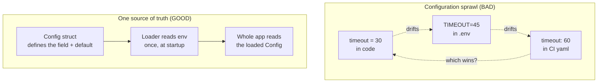
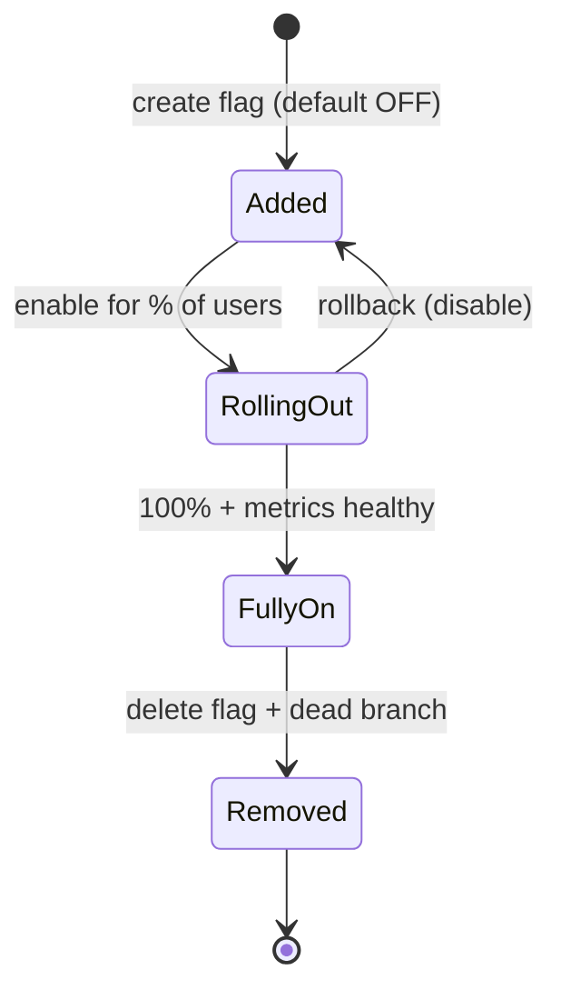
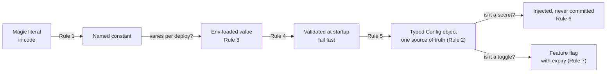

# Configuration, Constants & Feature Flags — Junior Level

> **Level:** Junior — "What's the rule? Show me a clean example."
> This file teaches the everyday rules: name your magic numbers, keep one source of truth, read config from the environment, validate it at startup, type it, never commit secrets, and treat a feature flag as a switch with an expiry date.

---

## Table of Contents

1. [Why this chapter exists](#why-this-chapter-exists)
2. [Real-world analogy](#real-world-analogy)
3. [Rule 1 — Replace magic numbers and strings with named constants](#rule-1--replace-magic-numbers-and-strings-with-named-constants)
4. [Rule 2 — One source of truth per setting](#rule-2--one-source-of-truth-per-setting)
5. [Rule 3 — Load config from the environment, not from code](#rule-3--load-config-from-the-environment-not-from-code)
6. [Rule 4 — Validate config at startup and fail fast](#rule-4--validate-config-at-startup-and-fail-fast)
7. [Rule 5 — Typed config over a stringly-typed map](#rule-5--typed-config-over-a-stringly-typed-map)
8. [Rule 6 — Never commit secrets; inject them](#rule-6--never-commit-secrets-inject-them)
9. [Rule 7 — A feature flag is a temporary switch with a lifecycle](#rule-7--a-feature-flag-is-a-temporary-switch-with-a-lifecycle)
10. [How the rules fit together](#how-the-rules-fit-together)
11. [Common Mistakes](#common-mistakes)
12. [Test Yourself](#test-yourself)
13. [Cheat Sheet](#cheat-sheet)
14. [Summary](#summary)
15. [Further Reading](#further-reading)
16. [Related Topics](#related-topics)

---

## Why this chapter exists

Most code is logic: it computes, branches, loops. But every program also carries values that *govern* the logic without being logic themselves — a timeout, a retry count, a database URL, an API key, a toggle that turns a half-built feature on for 5% of users. These are **configuration, constants, and feature flags**.

They look harmless. A `30` here, a `"https://api.example.com"` there, an `if env == "prod"` in one handler. Individually trivial. Collectively, they are where production incidents are born:

- A magic `30` that's actually a timeout in seconds — changed in one place, missed in three.
- A database password committed to Git in 2019, still live in 2026, found by a scraper bot.
- A feature flag added "just for the rollout," never removed, now a dead `if` branch nobody dares delete.
- A missing `REDIS_URL` that defaults silently to `localhost`, so production quietly talks to nothing.

This chapter is about the **lifecycle of a setting**: where a value lives, who may change it, when it is read, and — for flags — when it must die. It is *not* about naming code symbols (that's [Meaningful Names](../01-meaningful-names/README.md)); it's about the values that sit *outside* your logic and steer it.

> **Key idea:** A setting is data with a home, an owner, a validation step, and (for flags) an expiry date. Code that scatters settings inline, reads them at random times, or trusts them unvalidated is treating governance as an afterthought.

---

## Real-world analogy

### The thermostat vs. the soldering iron

Imagine a house where the temperature is controlled by soldering wires together. To make it warmer, you re-solder the heater coil. It works — but only an electrician can change it, every change risks a fire, and there's no single dial that says "this house is set to 21°C."

Now imagine a **thermostat**: one labelled dial, one source of truth, readable at a glance, changeable by anyone without touching the wiring. The heater (the logic) stays untouched; only the *setting* changes.

Hard-coded magic numbers are the soldering iron. Named constants and environment config are the thermostat. The job of this chapter is to move every governing value out of the wiring and onto a labelled dial.

### The hotel key card

A **secret** is like a hotel key card. The hotel doesn't print your room number on the card in permanent ink and reuse it forever — it issues a card at check-in, it can revoke it instantly, and it never tapes a master key to the front door. Secrets in config files committed to Git are exactly that taped-up master key: permanent, visible, and impossible to revoke without re-keying every lock.

### The "temporary" road sign

A **feature flag** is a temporary detour sign. It's useful while the road crew works. But a detour sign left up for three years, long after the road reopened, sends drivers the wrong way and erodes trust in every sign. A flag with no removal date is a permanent detour sign.

---

## Rule 1 — Replace magic numbers and strings with named constants

A **magic number** (or magic string) is a literal value embedded in code whose meaning isn't obvious. `if attempts > 3` — three what? `time.Sleep(30)` — 30 what, and why 30?

The rule: **give the value a name at the right scope, and define it once.** The name documents intent; the single definition means a change happens in exactly one place.

"Right scope" matters: a constant used by one function lives in that function or file; a constant shared across a package lives at package level; a value that operators must tune at deploy time isn't a constant at all — it's *config* (see Rule 3).

### Go — before

```go
func fetchWithRetry(url string) ([]byte, error) {
    for attempt := 0; attempt < 3; attempt++ { // 3 what?
        body, err := get(url)
        if err == nil {
            return body, nil
        }
        time.Sleep(500 * time.Millisecond) // why 500?
    }
    return nil, errors.New("failed after retries")
}
```

### Go — after

```go
const (
    maxFetchAttempts = 3
    retryBackoff     = 500 * time.Millisecond
)

func fetchWithRetry(url string) ([]byte, error) {
    for attempt := 0; attempt < maxFetchAttempts; attempt++ {
        body, err := get(url)
        if err == nil {
            return body, nil
        }
        time.Sleep(retryBackoff)
    }
    return nil, fmt.Errorf("failed after %d attempts", maxFetchAttempts)
}
```

The named constants explain *what* and *how many*; the error message now stays in sync automatically.

### Java — before

```java
if (user.getRole().equals("admin")) { ... }      // string repeated everywhere
if (cart.getTotal() > 100) applyFreeShipping();  // 100 what currency? why 100?
```

### Java — after

```java
public final class Roles {
    public static final String ADMIN = "admin";
    private Roles() {}                       // not instantiable
}

public final class ShippingRules {
    public static final BigDecimal FREE_SHIPPING_THRESHOLD = new BigDecimal("100.00");
    private ShippingRules() {}
}

if (user.getRole().equals(Roles.ADMIN)) { ... }
if (cart.getTotal().compareTo(ShippingRules.FREE_SHIPPING_THRESHOLD) > 0) {
    applyFreeShipping();
}
```

`static final` gives a compile-time constant. For a closed set of string roles, an `enum` is even better — see [Generics and Types](../13-generics-and-types/README.md).

### Python — before

```python
def password_is_valid(pw: str) -> bool:
    return len(pw) >= 8 and len(pw) <= 128   # 8 and 128 are unexplained
```

### Python — after

```python
# module-level constants: UPPER_SNAKE_CASE, defined once
MIN_PASSWORD_LENGTH = 8
MAX_PASSWORD_LENGTH = 128

def password_is_valid(pw: str) -> bool:
    return MIN_PASSWORD_LENGTH <= len(pw) <= MAX_PASSWORD_LENGTH
```

> **When NOT to name it:** the literals `0`, `1`, `-1`, `2`, and the empty string `""` in their obvious roles (loop start, increment, "not found", halving) are idiomatic and usually clearer left as-is. `for i := 0; i < n; i++` does not need a `const loopStart = 0`. Name a literal when it carries *domain meaning*, not when it's structural.

---

## Rule 2 — One source of truth per setting

A setting must be defined in **exactly one place**. The moment the same value lives in two places — a default in code *and* a value in an env file *and* a value in the CI pipeline — they drift, and the bug that follows ("works locally, broken in staging") is maddening to track down.

This is the [DRY principle](../../refactoring/README.md) applied to configuration. Each setting has one canonical home. Other layers may *override* it through a defined precedence (e.g. env var beats built-in default), but the *definition* of "what this setting is and what its default means" lives once.



**The fix:** define every setting on one typed config object (Rule 5), load it once at startup from a known precedence (env over default), and have the rest of the program read *that object* — never re-read raw env vars or re-declare defaults scattered in handlers.

```go
// BAD: the default "30s" is duplicated in two functions; change one, forget the other.
func dialA() { d := getEnvInt("TIMEOUT", 30); ... }
func dialB() { d := getEnvInt("TIMEOUT", 60); ... } // drifted!

// GOOD: one Config, loaded once, passed everywhere.
type Config struct{ Timeout time.Duration }
func dialA(cfg Config) { ... cfg.Timeout ... }
func dialB(cfg Config) { ... cfg.Timeout ... }
```

---

## Rule 3 — Load config from the environment, not from code

This is the **12-factor** rule: anything that varies between deploys — database URLs, credentials, hostnames, ports, log levels, feature toggles — belongs in the **environment**, not baked into the source.

Why? Because the *same build artifact* should run in dev, staging, and production. If `https://api.prod.example.com` is hard-coded, you cannot run the binary against staging without recompiling. Config that lives in the environment lets one image behave differently per deploy, with no code change.

### Go — reading env at startup

```go
func LoadConfig() (Config, error) {
    port := os.Getenv("PORT")
    if port == "" {
        port = "8080" // explicit default for a non-required value
    }
    dbURL := os.Getenv("DATABASE_URL") // required; validated in Rule 4
    return Config{Port: port, DatabaseURL: dbURL}, nil
}
```

### Java — Spring `@ConfigurationProperties`

```java
@ConfigurationProperties(prefix = "app")
public record AppConfig(
        @DefaultValue("8080") int port,
        String databaseUrl,        // bound from APP_DATABASE_URL / app.database-url
        Duration requestTimeout) {
}
```

Spring binds `APP_DATABASE_URL` (env) or `app.database-url` (yaml) to the field. The source is external; the code just declares the shape.

### Python — `pydantic-settings`

```python
from pydantic_settings import BaseSettings

class Settings(BaseSettings):
    port: int = 8080                 # default for non-required
    database_url: str                # required; no default
    request_timeout_s: int = 30

    model_config = {"env_prefix": "APP_"}   # reads APP_DATABASE_URL, etc.

settings = Settings()   # populated from environment at import/startup
```

> **The anti-pattern this kills:** `if env == "prod"` scattered through handlers. Don't branch on the environment *name* — branch on a *setting*. Instead of `if env == "prod" { useRealPaymentGateway() }`, expose a `cfg.PaymentGatewayURL` that is set to the sandbox URL in dev and the live URL in prod. The code stays environment-agnostic; the *value* changes per deploy.

---

## Rule 4 — Validate config at startup and fail fast

A missing or malformed setting should **stop the program immediately, loudly**, at startup — not three hours later when the first request hits the code path that needed it.

The opposite — a **silent default** — is one of the most dangerous patterns in this chapter. If `DATABASE_URL` is missing and the code silently falls back to `localhost`, the app boots "successfully" and then quietly fails (or worse, writes to the wrong place). Fail-fast turns a silent 3 a.m. data-corruption incident into an obvious "won't start, here's why" message at deploy time.

### Go — validate and fail fast

```go
func LoadConfig() (Config, error) {
    cfg := Config{
        Port:        getEnvOr("PORT", "8080"),
        DatabaseURL: os.Getenv("DATABASE_URL"),
        APIKey:      os.Getenv("API_KEY"),
    }
    var missing []string
    if cfg.DatabaseURL == "" {
        missing = append(missing, "DATABASE_URL")
    }
    if cfg.APIKey == "" {
        missing = append(missing, "API_KEY")
    }
    if len(missing) > 0 {
        return Config{}, fmt.Errorf("missing required config: %s", strings.Join(missing, ", "))
    }
    return cfg, nil
}

func main() {
    cfg, err := LoadConfig()
    if err != nil {
        log.Fatalf("config error: %v", err) // exits non-zero, before serving traffic
    }
    run(cfg)
}
```

### Java — Bean Validation at boot

```java
@Validated
@ConfigurationProperties(prefix = "app")
public record AppConfig(
        @NotBlank String databaseUrl,
        @NotBlank String apiKey,
        @Positive int port,
        @NotNull Duration requestTimeout) {
}
// Spring runs the validators at startup; an invalid value aborts the boot with a clear message.
```

### Python — pydantic validates on construction

```python
from pydantic import PositiveInt, field_validator
from pydantic_settings import BaseSettings

class Settings(BaseSettings):
    database_url: str                # required: ValidationError if absent
    api_key: str
    port: PositiveInt = 8080
    request_timeout_s: PositiveInt = 30

    @field_validator("database_url")
    @classmethod
    def must_be_postgres(cls, v: str) -> str:
        if not v.startswith("postgres://"):
            raise ValueError("database_url must be a postgres:// URL")
        return v

# At startup:
try:
    settings = Settings()
except Exception as exc:
    raise SystemExit(f"Invalid configuration: {exc}")  # fail fast, exit non-zero
```

> **Rule of thumb:** there are only two acceptable behaviours for a required setting that is missing — refuse to start, or (only when a default is genuinely safe) use a clearly logged default. Silently inventing a value is never acceptable. See [Defensive vs. Offensive Programming](../16-defensive-vs-offensive/README.md) for the broader fail-fast philosophy.

---

## Rule 5 — Typed config over a stringly-typed map

A **stringly-typed** config is one where every value is a string in a big map: `config["timeout"]`, `config["max_retries"]`, `config["debug"]`. Every read site must remember the key spelling, parse the string, and handle the parse failing. Nothing checks that `"timuot"` (typo) is wrong until runtime.

The rule: **parse once into a typed struct/record/dataclass.** After loading, `cfg.RequestTimeout` is a `Duration`, `cfg.MaxRetries` is an `int`, `cfg.Debug` is a `bool`. The compiler (Go/Java) or the type checker (Python) catches typos and type errors. There is one place where strings become values, and one place where parsing can fail.

### Go — stringly-typed vs. typed

```go
// BAD: stringly-typed map, parsed (and re-parsed) at every use.
cfg := map[string]string{"timeout": "30", "max_retries": "3", "debug": "true"}
t, _ := strconv.Atoi(cfg["timeout"]) // ignored error; "timuot" key -> "" -> 0

// GOOD: a typed struct, parsed once.
type Config struct {
    RequestTimeout time.Duration
    MaxRetries     int
    Debug          bool
}
```

### Java — typed record

```java
// BAD
Map<String, String> config = loadConfigMap();
int retries = Integer.parseInt(config.get("max_retries")); // NPE if key missing/typo

// GOOD
public record Config(Duration requestTimeout, int maxRetries, boolean debug) {}
```

### Python — typed dataclass / pydantic

```python
# BAD
config = {"timeout": "30", "max_retries": "3", "debug": "true"}
timeout = int(config["timeout"])  # KeyError on typo, ValueError on bad value, everywhere

# GOOD
from dataclasses import dataclass

@dataclass(frozen=True)
class Config:
    request_timeout_s: int
    max_retries: int
    debug: bool
```

Typed config pairs naturally with [Generics and Types](../13-generics-and-types/README.md): you push correctness into the type system instead of into runtime checks scattered across the codebase.

---

## Rule 6 — Never commit secrets; inject them

A **secret** is any value that grants access: a database password, an API key, a signing key, a TLS private key, an OAuth client secret. The rule is absolute at junior level: **secrets never go into source control, ever** — not in `.py`/`.go`/`.java` files, not in committed `.env` files, not in `application.yml` checked into Git.

Why so strict? Git never forgets. A secret committed once lives in the repository history forever, even after you "delete" it in a later commit. Anyone who ever clones the repo — including a leaked laptop or a public-fork bot — has it. Rotating a leaked DB password means re-keying production under pressure.

**Where secrets go instead:** injected at runtime through the environment (Rule 3), from a secrets manager (Vault, AWS Secrets Manager, your platform's secret store). The code reads `os.Getenv("API_KEY")`; the *value* is supplied by the deploy environment and never touches the repo.

```go
// The code references the secret by name only — the value comes from the environment.
apiKey := os.Getenv("API_KEY")
if apiKey == "" {
    log.Fatal("API_KEY not set") // fail fast (Rule 4)
}
```

**Minimum hygiene checklist for a junior:**

- Add `.env`, `*.pem`, `*.key`, `secrets.*` to `.gitignore` *before* the first commit.
- Commit a `.env.example` with the *keys* and dummy values, never the real ones.
- If you ever commit a real secret: treat it as compromised, rotate it immediately — don't just delete the line.

> A full treatment of secret storage, rotation, and managers lives in [middle.md](middle.md) and [senior.md](senior.md). At junior level, the one rule that must be reflexive: **the value of a secret never appears in a file you commit.**

---

## Rule 7 — A feature flag is a temporary switch with a lifecycle

A **feature flag** is a runtime toggle that turns a piece of behaviour on or off without a code deploy. It exists to *decouple deploy from release*: ship the code dark, turn it on for 1% of users, watch metrics, ramp to 100%, then **remove the flag**.

The critical word is **temporary**. A feature flag has a lifecycle:



The failure mode is the **immortal flag**: it reaches 100%, and then nobody deletes it. A year later the codebase is full of `if isNewCheckoutEnabled()` branches that are always true, doubling every code path and confusing every reader. A flag without a removal owner and a removal date is technical debt the moment it ships.

### A clean feature flag — Go

```go
// Flags are read from config (Rule 3/5), not hard-coded.
type Flags struct {
    NewCheckout bool // TODO(remove by 2026-Q3): cleanup after full rollout
}

func (s *Server) checkout(w http.ResponseWriter, r *http.Request) {
    if s.flags.NewCheckout {
        s.newCheckout(w, r)
        return
    }
    s.legacyCheckout(w, r)
}
```

### A clean feature flag — Java

```java
public record Flags(boolean newCheckout) {} // bound from config

public Response checkout(Request req) {
    // TODO(remove by 2026-Q3): delete legacy path after rollout
    return flags.newCheckout() ? newCheckout(req) : legacyCheckout(req);
}
```

### A clean feature flag — Python

```python
@dataclass(frozen=True)
class Flags:
    new_checkout: bool = False   # TODO(remove by 2026-Q3): cleanup after rollout

def checkout(req, flags: Flags):
    if flags.new_checkout:
        return new_checkout(req)
    return legacy_checkout(req)
```

**Three habits that keep flags healthy:**

1. **Name it for the feature, default OFF:** `new_checkout`, not `flag_1` or a bare boolean.
2. **Read it from config**, the same as any other setting — never `if os.Getenv("X") == "on"` inline.
3. **Tag it with a removal date and owner** (the `TODO(remove by ...)` comment) so cleanup is scheduled, not forgotten.

> **Avoid the boolean trap:** `doThing(true, false, true)` at the call site is meaningless — which `true` is the flag? Pass a named flag value or a small options object, never a row of bare booleans. (More on this in [middle.md](middle.md).)

---

## How the rules fit together

The seven rules form a pipeline from "literal in code" to "governed, validated, typed setting":



A value starts as a literal. If it's purely structural, leave it (Rule 1's exception). If it carries meaning but never changes, name it as a constant. If it varies per environment, lift it to env config (Rule 3), validate it at startup (Rule 4), and store it typed in one config object (Rules 2 & 5). If it grants access, it's a secret — inject it (Rule 6). If it's a toggle, treat it as a flag with an expiry date (Rule 7).

---

## Common Mistakes

| # | Anti-pattern | Why it hurts | Fix |
|---|---|---|---|
| 1 | **Magic numbers/strings inline** (`if attempts > 3`) | Meaning is invisible; changing it means hunting every copy | Name the constant once at the right scope (Rule 1) |
| 2 | **Configuration sprawl** — same setting in env *and* code *and* CI | Values drift; "works locally, broken in prod" | One source of truth, loaded once (Rule 2) |
| 3 | **Boolean-trap flags** (`doThing(true, false, true)`) | Call site is unreadable; easy to swap arguments | Named flag value or options object (Rule 7) |
| 4 | **Immortal feature flags** — never removed | Dead branches double every path; confuse readers | Tag with removal date + owner; delete after rollout (Rule 7) |
| 5 | **Hard-coded `if env == "prod"`** | Environment logic smears through the codebase | Branch on a *setting*, not the environment name (Rule 3) |
| 6 | **Secrets in config files / VCS** | Git history is forever; leak is permanent | Inject from environment / secrets manager (Rule 6) |
| 7 | **Mutable global config** read at random times | Non-deterministic behaviour; hard to test | Load once at startup into an immutable object; pass it down |
| 8 | **Stringly-typed config** validated nowhere | Typos & type errors surface at runtime, scattered | Parse once into a typed struct (Rule 5) |
| 9 | **Silent defaults** for a missing required value | App "boots" then quietly does the wrong thing | Fail fast at startup with a loud error (Rule 4) |

---

## Test Yourself

**1. You see `time.Sleep(5000)` in a retry loop. What's wrong, and what's the minimal fix?**

<details><summary>Answer</summary>

`5000` is a magic number — no unit, no reason given. The minimal fix is a named constant with the unit in the name or type: `const retryBackoff = 5 * time.Second` (Go makes the unit explicit via `time.Duration`). The name documents *what* and *why*, and changing the backoff is now a one-line edit in one place.
</details>

**2. The same timeout value `30` appears as a default in code, as `TIMEOUT=45` in `.env`, and as `timeout: 60` in the CI config. What's the smell and the fix?**

<details><summary>Answer</summary>

This is **configuration sprawl** — the setting has three definitions that have already drifted (30 vs 45 vs 60), and nobody can tell which wins. The fix is **one source of truth**: define the field once on a typed config object, load it once at startup from a defined precedence (env overrides built-in default), and have all code read that object. Delete the duplicate definitions.
</details>

**3. Why is reading config from the environment (12-factor) better than hard-coding `https://api.prod.example.com`?**

<details><summary>Answer</summary>

The *same build artifact* can then run in dev, staging, and prod by changing only the environment — no recompile, no separate builds, no risk of shipping the wrong hard-coded URL. Hard-coding ties the binary to one environment and forces a code change (and a new build) to point it elsewhere.
</details>

**4. `DATABASE_URL` is unset, and the app falls back to `localhost` and boots fine. Why is "boots fine" the problem?**

<details><summary>Answer</summary>

Because the app is now running *successfully wrong*. It connects to a `localhost` database that in production is empty or nonexistent — so it either errors on the first real query (hours later, far from the cause) or, worse, silently reads/writes the wrong store. A **silent default** for a required value hides a deploy mistake. The fix is **fail-fast**: if `DATABASE_URL` is required and missing, refuse to start and print exactly which variable is missing.
</details>

**5. A teammate writes `if os.Getenv("ENV") == "prod": use_live_payments()` in three different handlers. What's the cleaner design?**

<details><summary>Answer</summary>

Don't branch on the environment *name* — branch on a *setting*. Expose a config value like `payment_gateway_url` (sandbox URL in dev, live URL in prod) and have the code use it unconditionally. The environment-specific value is supplied per deploy; the code stays environment-agnostic, and there's no `"prod"` string smeared across three handlers to keep in sync.
</details>

**6. You find a flag `is_new_search_enabled` that has been at 100% for over a year. What should happen to it?**

<details><summary>Answer</summary>

It's an **immortal flag** and should be removed. Delete the flag, delete the old branch it guarded, and keep only the new code path. A flag's job ends when the rollout completes; leaving it in place keeps a dead `if`/`else` that doubles the code paths a reader must understand and that a future bug could accidentally flip back on.
</details>

**7. Why is a typed `Config` struct better than `config["timeout"]` everywhere?**

<details><summary>Answer</summary>

A stringly-typed map parses (and can mis-parse) the value at every read site, and a typo in the key (`"timuot"`) isn't caught until runtime. A typed config object parses each value **once** at startup, gives every field a checked type (`Duration`, `int`, `bool`), and lets the compiler/type checker catch typos and type errors. One place to parse, one place for parsing to fail.
</details>

**8. Is it ever OK to commit a `.env` file?**

<details><summary>Answer</summary>

Not if it contains real secret values — that's the rule. It *is* fine (and helpful) to commit a `.env.example` listing the required *keys* with dummy or placeholder values, so new developers know what to set. Add the real `.env` to `.gitignore` before the first commit. A secret committed even once must be treated as compromised and rotated, because Git history is permanent.
</details>

---

## Cheat Sheet

| Concept | Rule | One-liner |
|---|---|---|
| **Magic literal** | Name it | A literal with domain meaning becomes a named constant, defined once |
| **Scope** | Right home | Function-local → file → package; tunable-per-deploy → it's config, not a constant |
| **One source of truth** | No duplication | Each setting defined once; layers may *override*, not redefine |
| **12-factor** | Env, not code | Anything that varies per deploy reads from the environment |
| **Fail fast** | Validate at startup | Missing/invalid required config → refuse to start, loudly |
| **Typed config** | Parse once | Strings become typed fields on a struct/record/dataclass at load time |
| **Secrets** | Inject, never commit | Reference by name; the value comes from env/secrets manager, never the repo |
| **Feature flag** | Temporary switch | Add → roll out → **remove**; tag with owner + removal date; default OFF |
| **Boolean trap** | Name the toggle | Never `doThing(true, false, true)`; pass a named value or options object |

**Quick decision flow for any governing value:**

1. Does it carry domain meaning? → name it as a constant.
2. Does it vary per environment? → load it from env config.
3. Is it required? → validate at startup, fail fast if missing.
4. Store it typed, in one config object, read everywhere.
5. Does it grant access? → it's a secret; inject it, never commit it.
6. Is it a toggle for an in-progress feature? → it's a flag; give it an expiry.

---

## Summary

Configuration, constants, and feature flags are the values that *govern* logic without being logic. Handled carelessly they become the quiet source of production incidents; handled with discipline they become a clean, labelled control panel for your system.

The junior-level rules:

- **Name magic numbers and strings** at the right scope, defined once — but leave purely structural literals (`0`, `1`, `-1`) alone.
- **Keep one source of truth** per setting; configuration sprawl across code, env, and CI is where drift bugs are born.
- **Load per-deploy config from the environment** (12-factor), so one artifact runs everywhere; branch on *settings*, never on an `env == "prod"` name.
- **Validate config at startup and fail fast**; a silent default for a missing required value is a hidden time bomb.
- **Use typed config** (a struct/record/dataclass), parsed once, instead of a stringly-typed map validated nowhere.
- **Never commit secrets** — Git history is forever; inject them from the environment or a secrets manager.
- **Treat every feature flag as temporary**: add it, roll it out, and *remove* it; an immortal flag is dead-branch debt.

Master these and you'll have eliminated an entire category of "works on my machine" and "how did this even get to prod" incidents.

---

## Further Reading

- **The Twelve-Factor App** — [12factor.net/config](https://12factor.net/config): the canonical statement of "store config in the environment."
- **Robert C. Martin, *Clean Code*** — the chapters on meaningful names and boundaries underpin constant naming and config edges.
- **Martin Fowler, "Feature Toggles (aka Feature Flags)"** — [martinfowler.com/articles/feature-toggles.html](https://martinfowler.com/articles/feature-toggles.html): flag categories and, crucially, retirement.
- **OWASP — Secrets Management Cheat Sheet** — practical guidance on keeping secrets out of source control.

---

## Related Topics

- [middle.md](middle.md) — config across services, secret managers, flag platforms, and percentage rollouts.
- [senior.md](senior.md) — config as a system concern: precedence design, dynamic config, flag governance at scale.
- [Chapter README](../README.md) — the full set of positive rules and anti-patterns for this chapter.
- [Meaningful Names](../01-meaningful-names/README.md) — naming code symbols; this chapter is the *value* counterpart.
- [Generics and Types](../13-generics-and-types/README.md) — pushing config correctness into the type system.
- [Defensive vs. Offensive Programming](../16-defensive-vs-offensive/README.md) — the fail-fast philosophy behind startup validation.
- [Anti-Patterns](../../anti-patterns/README.md) — magic numbers, sprawl, and immortal flags as recognized anti-patterns.
- [Refactoring](../../refactoring/README.md) — DRY and the mechanics of pulling literals into named, single-source constants.
