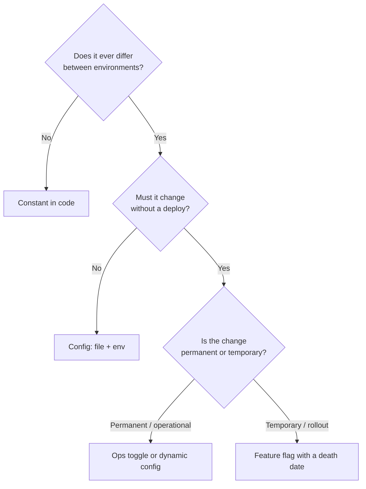
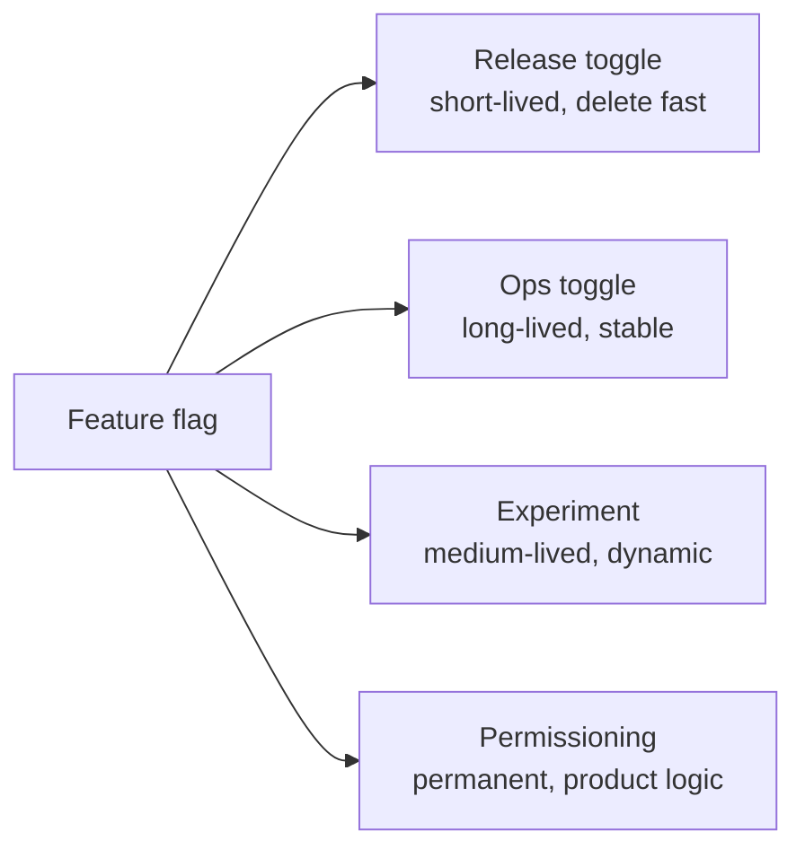

# Configuration, Constants & Feature Flags — Middle Level

> Focus: "Why?" and "When does it bend?" — config precedence, where each value belongs, the 12-factor rule and its limits, the four flag types and their lifetimes, and why every option you add is a cost you pay forever.

---

## Table of Contents

1. [The core distinction: constant vs. config vs. flag](#the-core-distinction-constant-vs-config-vs-flag)
2. [Config precedence: defaults < file < env < flags](#config-precedence-defaults--file--env--flags)
3. [Build-time, runtime, and dynamic config](#build-time-runtime-and-dynamic-config)
4. ["Config in the environment" — the rule and its limits](#config-in-the-environment--the-rule-and-its-limits)
5. [The four flag types and their lifetimes](#the-four-flag-types-and-their-lifetimes)
6. [Flag debt and retirement discipline](#flag-debt-and-retirement-discipline)
7. [Don't over-configure: YAGNI for config](#dont-over-configure-yagni-for-config)
8. [Validating and typing config](#validating-and-typing-config)
9. [Where a constant should live: locality vs. single source](#where-a-constant-should-live-locality-vs-single-source)
10. [Secrets handling basics](#secrets-handling-basics)
11. [Common Mistakes](#common-mistakes)
12. [Test Yourself](#test-yourself)
13. [Cheat Sheet](#cheat-sheet)
14. [Summary](#summary)
15. [Further Reading](#further-reading)
16. [Related Topics](#related-topics)

---

## The core distinction: constant vs. config vs. flag

These three look similar — a name bound to a value — but they differ in *who may change the value* and *when*. Getting the category wrong is the root of most configuration smells.

| Kind | Who changes it | When it changes | Example |
|---|---|---|---|
| **Constant** | A developer, in a PR | At build/release time | `MaxRetries = 3`, `PI`, an HTTP status code |
| **Config** | An operator, per environment | At deploy/restart time | DB URL, pool size, log level |
| **Flag** | A product/ops owner, at runtime | Live, without deploy | "enable new checkout", kill-switch |

The mistake is treating a constant as config ("make the retry count an env var, just in case") or treating a flag as config ("we'll redeploy to flip it"). Each wrong placement adds a surface you must document, validate, and test.



The decisive question is never "could this conceivably vary?" — almost anything could. It is "does a real stakeholder need to vary it, and how fast?"

---

## Config precedence: defaults < file < env < flags

Real systems layer configuration. The standard precedence, lowest to highest, is:

1. **Compiled defaults** — sane values baked into the binary so the app starts with zero external config.
2. **Config file** — `config.yaml`, `application.yml`, checked into the repo or shipped with the artifact; holds the bulk of structured, non-secret settings.
3. **Environment variables** — override file values per environment (staging vs. prod) and inject secrets.
4. **Command-line flags / runtime flag service** — the last word, for operator overrides and live toggles.

Higher layers override lower ones. The invariant: **the app must run with only layer 1**, and each higher layer is an *override*, not a *requirement* — except for secrets and environment-specific endpoints, which legitimately have no safe default.

```go
// Go: explicit precedence, defaults first, then each layer overrides.
type Config struct {
    Port        int           `yaml:"port"`
    LogLevel    string        `yaml:"log_level"`
    DialTimeout time.Duration `yaml:"dial_timeout"`
}

func Load(path string) (Config, error) {
    cfg := Config{Port: 8080, LogLevel: "info", DialTimeout: 5 * time.Second} // 1. defaults

    if data, err := os.ReadFile(path); err == nil { // 2. file
        if err := yaml.Unmarshal(data, &cfg); err != nil {
            return cfg, fmt.Errorf("parse %s: %w", path, err)
        }
    }
    if v := os.Getenv("PORT"); v != "" { // 3. env override
        p, err := strconv.Atoi(v)
        if err != nil {
            return cfg, fmt.Errorf("PORT must be an int, got %q: %w", v, err)
        }
        cfg.Port = p
    }
    return cfg, nil // 4. CLI flags applied by caller
}
```

**Why this order?** It moves from *most static and trustworthy* (compiled-in) to *most situational* (a flag flipped at 2 a.m. during an incident). Lower layers are reviewed in PRs; higher layers are operational and need to win. The trade-off is **discoverability**: a value seen in the config file may actually be overridden by an env var three layers up. Mitigate by logging the *effective* config (secrets redacted) at startup, so the resolved values are visible in one place.

---

## Build-time, runtime, and dynamic config

The same setting behaves very differently depending on *when it is read*. Three tiers:

- **Build-time constants** — resolved when the artifact is built; cannot change without a rebuild. Cheapest and safest (the value is fixed and the compiler can optimize around it), but the slowest to change. Use for things that are genuinely fixed per release: API version strings, embedded feature sets, the schema version a binary speaks.
- **Runtime config (read once at startup)** — read when the process boots and held immutable for the process lifetime. Changing it requires a restart. This is the sweet spot for most config: DB URLs, pool sizes, timeouts. Reading once and freezing it makes behavior **deterministic** — the value can't shift under you mid-request.
- **Dynamic / hot-reloaded config** — re-read live, without restart (file-watch, polling a config service, a flag SDK). Powerful but the most expensive: you now have *time-varying behavior*, so you must reason about consistency (what if two values change between two reads?), staleness, and the failure mode when the config source is unreachable.

> **Rule of thumb:** Read config once at startup unless you have a concrete reason for live changes. "Mutable global config read at arbitrary times" is an explicit anti-pattern in the [chapter README](../README.md) — it produces non-deterministic behavior that is brutal to reproduce in a bug report.

The trade-off ladder is **flexibility vs. predictability**. Each step toward dynamic buys faster change at the cost of harder-to-reason-about behavior. Don't pay for dynamic config you won't use.

---

## "Config in the environment" — the rule and its limits

The [12-factor app](https://12factor.net/config) rule is: *store config in environment variables*, not in code, because config varies between deploys and code does not. This cleanly separates the artifact (one immutable build) from the deploy (env-specific values), and it keeps secrets out of the repo. It is a good default.

But the rule has real limits — and senior engineers know exactly where it bends:

- **Large or structured config.** Env vars are a flat `string → string` map. Encoding a list of upstream services, each with a URL, weight, and timeout, into `UPSTREAM_0_URL`, `UPSTREAM_0_WEIGHT`, ... is miserable and error-prone. Structured config belongs in a **file** (YAML/JSON/TOML); use env vars to point at the file or to override individual leaves.
- **Secrets.** 12-factor lumps secrets in with config, but env vars are a weak secret store: they leak into crash dumps, child processes, `/proc`, and logs that dump the environment. Real secrets belong in a **secrets manager** (Vault, AWS Secrets Manager, Kubernetes Secrets mounted as files), with env vars holding at most a *reference* to the secret, not the secret itself.
- **Many values.** Dozens of unrelated env vars are hard to document, validate, and discover. A typed config object loaded from a file is more maintainable past a handful of settings.

So the refined rule is: **env vars for the small set of values that vary per deploy and for secret injection; files for structured/bulk config; a secrets manager for actual secrets.** The 12-factor principle — *separate config from code* — still holds; the *mechanism* is what flexes.

---

## The four flag types and their lifetimes

Not all feature flags are the same thing. Pete Hodgson's taxonomy splits them by *why they exist*, and the crucial insight is that **each type has a different lifetime** — conflating them is how flag debt accumulates.

| Type | Purpose | Lifetime | Changes how often |
|---|---|---|---|
| **Release toggle** | Hide unfinished work; enable trunk-based dev / continuous delivery | Days to weeks — **delete after rollout** | Rarely (off → on, once) |
| **Ops toggle** | Operational control: kill-switch, degrade-gracefully, circuit breaker | Long-lived or permanent | Occasionally, during incidents |
| **Experiment toggle** | A/B test; route cohorts to variants to measure impact | Weeks — life of the experiment | Per-request, per-user |
| **Permissioning toggle** | Entitlements: premium features, beta access, regional gating | Permanent (it's product logic) | Per-user, slowly |



**Why the distinction matters for code, not just bookkeeping:**

- A **release toggle** should be flipped per *deploy* and read at a few well-defined points; it is temporary scaffolding. Treat it as dynamic but expect it to vanish.
- An **experiment toggle** is read *per user/request* and changes frequently — it needs an SDK, a targeting engine, and analytics wiring. You would never build that machinery for a release toggle.
- A **permissioning toggle** is really *business logic in disguise*. It is permanent, so it deserves a first-class home (an entitlements service or domain model), not the temporary flag table you use for rollouts.

The danger is using one mechanism for all four. A release toggle left in the flag system "because it was easy" becomes immortal; a permissioning rule modeled as a quick boolean flag rots into untracked product behavior.

---

## Flag debt and retirement discipline

A feature flag adds a branch — `if flag on { A } else { B }` — which **doubles the number of code paths** through that section. Every flag is an open `if` you must keep both sides of working, test on both sides, and reason about in combination with every other flag. *n* independent flags create up to 2ⁿ states.

Release toggles are the main source of debt because they are *meant* to be temporary but nobody owns their death. Six months later you have dead branches, the "old" path is unmaintained but still reachable, and no one dares delete the flag because they're unsure what reads it.

**Retirement discipline — concrete practices:**

- **Give every release/experiment flag an expiry from birth.** A `created` date and an owner, recorded where the flag is defined.
- **Fail the build (or alert) on stale flags.** A scheduled job that lists flags older than, say, 60 days and pings the owner. Some teams make a stale release flag a CI failure.
- **Make retirement a task in the rollout plan**, not an afterthought. "Ship behind flag" must be paired with "remove flag" as an explicit follow-up.
- **Retire = remove both the flag check and the dead branch.** Deleting the flag config while leaving `if oldFlag` in code (defaulting to false) is half a job — the dead branch still confuses readers and still has to compile.

```python
# Python: a release toggle wired so its eventual removal is a localized edit.
# When the flag retires, delete this function and inline the "on" branch.
def use_new_checkout(flags: FlagService, user: User) -> bool:
    # FLAG: new-checkout-flow | owner: payments | created: 2026-04-01 | remove-by: 2026-06-01
    return flags.enabled("new-checkout-flow", user_id=user.id)
```

Keeping every flag check behind a single named function (rather than scattering `flags.enabled("new-checkout-flow")` across 30 files) means retirement touches one place. That locality is the whole game.

---

## Don't over-configure: YAGNI for config

The instinct "let's make this configurable, just in case" feels prudent and is usually wrong. **Every option is a permanent liability:**

- It is a code path: `if optionA { ... } else { ... }` multiplies states, exactly like a flag.
- It must be documented, or it's a mystery setting no one understands.
- It must be **validated** — an unvalidated option is a runtime crash waiting for the one operator who sets it wrong.
- It must be **tested** in its meaningful combinations, and combinations explode.
- It is a **support burden**: every knob is something a customer can misconfigure and then file a ticket about.

The asymmetry: adding a config option later (when a *real* second use case appears) is cheap and informed by a concrete need. Adding it speculatively is expensive and usually guesses wrong about what should actually vary.

**Heuristics for "should this be configurable?"**

- Is there a *current, concrete* second value someone needs? If not, hard-code it as a named constant. You can promote it to config the day a real need appears.
- Would changing it require code changes anyway (because of coupled assumptions)? Then it's a false knob — pretending it's independent is a lie.
- Is the "configurable" value actually a *decision* with one right answer (e.g., a security setting)? Don't expose it; bake in the correct value.

> The honest framing: a config option is YAGNI until proven otherwise, just like a speculative abstraction. The cost is not the line that reads the value — it's the testing, docs, and support tail that follows it forever.

---

## Validating and typing config

The README names two related anti-patterns: **stringly-typed config** (every value a string, validated nowhere, blowing up deep in a request) and **silent defaults** (a missing required setting that fails closed quietly). The cure for both is the same: **parse and validate config into a typed structure at startup, and fail fast and loud if it's wrong.**

The principle is *parse, don't validate* — convert the untrusted string map into a typed object once, at the boundary, so the rest of the code receives values that are already correct by construction. Compare:

```java
// BAD — stringly-typed, validated nowhere. Blows up mid-request, far from the cause.
int timeout = Integer.parseInt(env.get("TIMEOUT_MS")); // NPE if unset, NFE if "abc"
// ...500 lines and one network call later, the failure surfaces with no context.
```

```java
// GOOD — parse + validate once at startup into a typed, immutable config.
public record AppConfig(int port, Duration timeout, LogLevel logLevel) {
    public static AppConfig load(Map<String, String> env) {
        var errors = new ArrayList<String>();

        int port = parseInt(env, "PORT", 8080, errors);
        Duration timeout = parseDuration(env, "TIMEOUT_MS", Duration.ofSeconds(5), errors);
        LogLevel level = parseEnum(env, "LOG_LEVEL", LogLevel.INFO, errors, LogLevel.class);

        if (!errors.isEmpty()) {
            // Fail fast and LOUD: report ALL problems at once, then refuse to start.
            throw new ConfigException("Invalid configuration:\n  " + String.join("\n  ", errors));
        }
        return new AppConfig(port, timeout, level);
    }
}
```

Two details that separate good from adequate:

- **Aggregate errors.** Don't crash on the first bad value. Collect every problem and report them together, so an operator fixes all of them in one pass instead of restart-fix-restart.
- **Distinguish "missing required" from "missing optional."** An optional value falls back to a documented default. A *required* value with no safe default (a DB URL, a secret) must abort startup with a clear message — never start in a degraded mystery state. That's the antidote to silent defaults.

Most ecosystems have a typed-config library that does the heavy lifting: `viper`/`envconfig` (Go), `@ConfigurationProperties` with `@Validated` (Spring), `pydantic-settings` (Python). Lean on them — they give you typing, defaults, and validation in one declaration.

```python
# Python: pydantic-settings — types, env binding, and validation declaratively.
from pydantic import Field
from pydantic_settings import BaseSettings

class Settings(BaseSettings):
    port: int = 8080
    timeout_ms: int = Field(default=5000, gt=0)        # validated: must be positive
    log_level: str = Field(default="info", pattern="^(debug|info|warn|error)$")

# At startup: raises a clear ValidationError listing every bad field if config is wrong.
settings = Settings()
```

---

## Where a constant should live: locality vs. single source

For a magic number or string, two forces pull in opposite directions:

- **Locality** — define the constant next to where it's used, so a reader sees its meaning without jumping files.
- **Single source of truth** — define it once, so a value used in many places can't drift out of sync.

The resolution depends on **how many places use it and whether they must agree:**

- **Used in one place / one module:** keep it local — a `private static final` / module-level constant right there. Hoisting a single-use constant into a global `Constants` file *reduces* clarity; the reader now has to navigate away to learn the value. Locality wins.
- **Used in multiple places that must agree:** single source. The classic bug is the same magic value (`MAX_UPLOAD_SIZE = 10_000_000`) copy-pasted into the validator, the error message, and the client — change one, miss another, and they silently disagree. Define it once and import it.
- **A shared *contract* between systems** (a wire constant, a protocol limit): single source, and ideally generated from one schema so producer and consumer literally cannot diverge.

> **Anti-pattern to avoid:** the god `Constants` class that hoards every literal in the codebase. It violates locality for the single-use cases *and* creates a low-cohesion dumping ground with no namespacing. Group constants by the concept they belong to, at the narrowest scope that all their users share — not "all constants in one bucket."

```go
// Go: scope each constant to the package that owns the concept.
package upload

// Single source: the validator, the handler, and the error message all read this.
const MaxBytes = 10 << 20 // 10 MiB

func validate(size int64) error {
    if size > MaxBytes {
        return fmt.Errorf("file exceeds %d-byte limit", MaxBytes) // same source, no drift
    }
    return nil
}
```

---

## Secrets handling basics

Secrets are config with a sharp edge: leaking one is a security incident, not a bug. The README flags **"secrets in config files committed to version control"** as a core anti-pattern — and once a secret is in git history, it's compromised forever, even after you delete it.

The middle-level rules:

- **Never commit secrets.** No passwords, API keys, or tokens in source, config files, or CI YAML. Keep a `.env.example` with *placeholder* values; keep real `.env` files in `.gitignore`.
- **Separate secrets from ordinary config.** Ordinary config can live in a checked-in file; secrets must come from a dedicated source — a secrets manager (Vault, AWS/GCP Secrets Manager), or for Kubernetes, secrets mounted as files (preferable to env vars, which leak more easily).
- **Inject at runtime, hold in memory, don't log.** Load the secret when the process starts; never write it to logs or error messages. Redact secret fields in any "effective config" dump.
- **Reference, don't embed.** In env-based setups, the env var should hold a *reference or short-lived token*, with the actual secret fetched from the manager — not the long-lived secret pasted into an env var.
- **Rotate.** Secrets should be rotatable without a code change, which is another reason they belong in a manager rather than baked into an artifact.

This is a deep topic with its own security disciplines; the goal here is to recognize that secrets are a *different category* from config and never to treat a config file as a safe place for them. See the chapter on [defensive vs. offensive programming](../16-defensive-vs-offensive/README.md) for the boundary-validation mindset that secrets handling extends.

---

## Common Mistakes

1. **Promoting every constant to config "just in case."** A retry count that has been `3` for three years and is never deployed differently is a constant. Making it an env var adds a validation path, a doc line, and a misconfiguration risk for zero benefit. (See [YAGNI for config](#dont-over-configure-yagni-for-config).)

2. **Treating a flag as config.** "We'll redeploy to flip it" defeats the purpose of a flag (live change without deploy). If it truly needs a deploy to change, it's config, not a flag — name it accordingly.

3. **One mechanism for all flag types.** Running a permanent permissioning rule through the temporary release-flag system, or building per-user experiment machinery for a one-shot release toggle. Match the mechanism to the flag's lifetime.

4. **Flags with no death date.** Shipping behind a release toggle and never scheduling its removal. The branch lives forever, the "off" path rots, and the flag count climbs into combinatorial unmanageability.

5. **Stringly-typed config read deep in a request.** Parsing `Integer.parseInt(env.get("X"))` at the point of use means a typo in `X` surfaces as a cryptic 500 mid-request, far from the cause. Parse and validate once, at startup.

6. **Silent defaults for required values.** Falling back to `""` or `0` when a required secret/URL is missing, then starting up "successfully" into a broken state. A missing *required* value must abort startup loudly.

7. **The god `Constants` file.** Hoarding every literal in one global bucket destroys locality (single-use constants now require a file jump) and cohesion. Scope constants to the concept that owns them.

8. **Secrets in the repo.** Committing a real key, even briefly. Git history makes the leak permanent; the only fix is to rotate the secret, not to delete the commit.

9. **Hidden effective config.** Layering defaults < file < env < flags but never logging the *resolved* values, so nobody can tell which layer won. Log the effective config (secrets redacted) at startup.

10. **Hot-reloading config you never need to change live.** Paying the determinism cost of dynamic config for a value that changes once a year. Read it once at startup unless live change is a real requirement.

---

## Test Yourself

<details>
<summary>1. Your team wants the request timeout to be tunable. Constant, config, or flag?</summary>

**Config**, almost certainly. A timeout legitimately varies between environments (a slow staging dependency vs. fast prod) and operators tune it without code changes — but it does *not* need to change live without a restart, so it's not a flag. Read it once at startup into a typed `Duration`, with a sane compiled default. Only promote it to dynamic/flag if you have a concrete need to retune it during an incident without redeploying.
</details>

<details>
<summary>2. Why is the precedence defaults < file < env < flags, and not the reverse?</summary>

It orders layers from *most static and reviewed* to *most situational and operational*. Compiled defaults are vetted in code review and should be the baseline. The config file holds the bulk of vetted, environment-shaped values. Env vars override per deploy and inject secrets. Flags/CLI are the operator's last word — the override you reach for at 2 a.m. during an incident must win over everything below it. Reversing it would let a static default silently override an operator's emergency change.
</details>

<details>
<summary>3. The 12-factor rule says "config in the environment." When does that rule bend?</summary>

For **structured/large config** (env vars are a flat string map — encoding a list of upstreams into `UPSTREAM_0_URL`... is miserable; use a file), for **secrets** (env vars leak into crash dumps, `/proc`, and child processes; use a secrets manager), and when there are **many values** (dozens of flat env vars are unmaintainable vs. a typed file). The underlying principle — *separate config from code* — still holds; only the mechanism changes.
</details>

<details>
<summary>4. A release toggle and a permissioning toggle are both "just a boolean." Why treat them differently?</summary>

Their **lifetimes and natures differ**. A release toggle is temporary scaffolding that must be *deleted* days/weeks after rollout; leaving it creates flag debt. A permissioning toggle is *permanent product logic* (who gets the premium feature) and deserves a first-class home — an entitlements model — not the temporary rollout-flag table. Using one mechanism for both means either the release flag becomes immortal or the entitlement rule rots as an untracked boolean.
</details>

<details>
<summary>5. Why is each feature flag a maintenance cost even when it's "off"?</summary>

A flag is a live `if/else` — it doubles the code paths through that section. Both branches must compile, be tested, and keep working; *n* independent flags create up to 2ⁿ combined states to reason about. An "off" release flag still leaves a dead branch that confuses readers and still has to be maintained. That's why retirement (removing the check *and* the dead branch) is the discipline that matters, not just flipping flags.
</details>

<details>
<summary>6. A magic number `10_000_000` appears in a validator, an error message, and a client. Local or single-source constant?</summary>

**Single source.** These three places must *agree* — changing the limit in one and forgetting another makes them silently diverge (the validator rejects what the message says is allowed). Define it once (`MaxBytes`) and import it everywhere. Contrast with a value used in exactly one function: there, locality wins and you keep it next to its use rather than hoisting it into a global bucket.
</details>

<details>
<summary>7. An operator sets LOG_LEVEL=verbos (typo). What's the right behavior, and why?</summary>

**Fail fast at startup** with a clear message naming the bad value and the allowed set — not silently fall back to a default (the operator's intent is lost and they don't know it) and not crash later mid-request (cryptic, far from the cause). Validate config into a typed object at boot; ideally aggregate all such errors so the operator fixes everything in one restart cycle.
</details>

<details>
<summary>8. Is it safe to put a low-risk API key in a committed config file if the repo is private?</summary>

No. "Private repo" is not a secret store — access widens over time, history is cloned to every developer's laptop and CI, and once a secret is in git history it's compromised permanently (deleting the commit doesn't help; you must rotate the key). Secrets belong in a secrets manager or a runtime-mounted secret, referenced — not embedded — from config. Keep only a placeholder `.env.example` in the repo.
</details>

---

## Cheat Sheet

| Decision | Heuristic |
|---|---|
| Constant vs. config | Differs per environment? → config. Otherwise → named constant in code. |
| Config vs. flag | Must change *without a deploy*? → flag. Otherwise → config. |
| Precedence | defaults < file < env < flags; app must run on defaults alone; log effective config. |
| When to read config | Once at startup (immutable) unless live change is a concrete requirement. |
| Env vars vs. file | Small/per-deploy values + secret injection → env. Structured/bulk → file. |
| Secrets | Never in the repo; secrets manager or mounted file; reference, don't embed; rotate. |
| Flag type | Release (delete fast) · Ops (long-lived) · Experiment (per-user) · Permissioning (permanent). |
| Flag hygiene | Owner + created date + remove-by on every release/experiment flag; alert on stale. |
| Add a config option? | Only for a concrete *current* need. Speculative config = YAGNI liability. |
| Validate config | Parse into a typed object at startup; aggregate errors; fail fast and loud. |
| Constant placement | One user → local. Many users that must agree → single source. Avoid the god `Constants` file. |

---

## Summary

Configuration, constants, and feature flags are the same idea — a named value — split by **who may change it and when**. Misclassifying them is the root cause behind most config smells: a constant promoted to config "just in case," a flag that needed a deploy, a permissioning rule modeled as a throwaway boolean.

The middle-level judgment calls:

- **Layer config** defaults < file < env < flags, ensure the app runs on defaults alone, and log the *effective* resolved config so the winning layer is visible.
- **Read config once at startup** into a *typed, validated* object that fails fast and loud — moving from static to dynamic config trades predictability for flexibility, so don't buy dynamic you won't use.
- **Honor "config in the environment"** as a default, but bend it for structured config (files), secrets (a manager), and large value sets (typed files).
- **Match each flag to its lifetime** (release / ops / experiment / permissioning) and treat release-flag *retirement* as a first-class, scheduled task — because every flag doubles code paths and unmanaged flags compound into combinatorial debt.
- **Resist over-configuration:** every knob is a permanent testing, documentation, and support cost. Config is YAGNI until a concrete need proves otherwise.
- **Place constants by who must agree:** local for single use, single-source for shared values — never a god `Constants` bucket.
- **Treat secrets as a separate category** from config and never let them touch the repo.

---

## Further Reading

- Pete Hodgson, *Feature Toggles (aka Feature Flags)* — the four-type taxonomy and lifetime guidance (martinfowler.com).
- *The Twelve-Factor App*, Factor III: Config — the "config in the environment" rule (12factor.net).
- Alexis King, *Parse, Don't Validate* — the principle behind typed config at the boundary.
- Martin Fowler, *Refactoring* — Replace Magic Literal, for moving inline literals to named constants.

---

## Related Topics

- [`junior.md`](junior.md) — the mechanical rules: name your constants, no magic numbers, no secrets in code.
- [`senior.md`](senior.md) — architecture-level config: config services, flag platforms, progressive delivery, and config governance at scale.
- [Chapter README](../README.md) — the positive rules and the full anti-pattern list for this chapter.
- [Meaningful Names](../01-meaningful-names/README.md) — naming code symbols; this chapter builds on it for naming constants and flags well.
- [Defensive vs. Offensive Programming](../16-defensive-vs-offensive/README.md) — fail-fast validation at boundaries, which startup config validation applies.
- [Anti-Patterns](../../anti-patterns/README.md) — magic numbers, boolean traps, and global mutable state as recognized anti-patterns.
- [Refactoring](../../refactoring/README.md) — mechanics for extracting magic literals and untangling flag branches safely.
