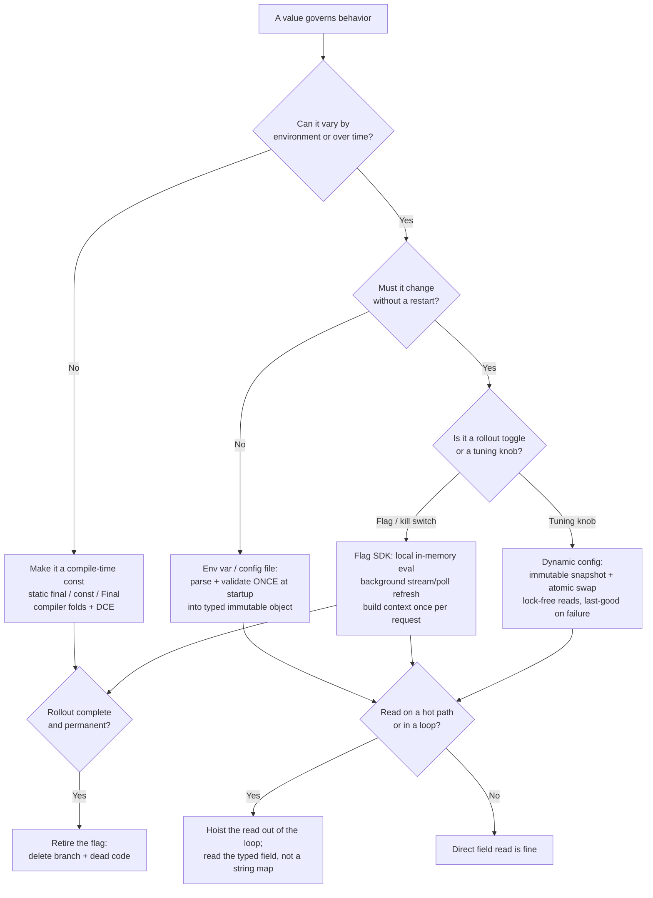

# Configuration, Constants & Feature Flags — Optimize & Reconcile

> Clean config and clean flags are about *lifecycle clarity* — one source of truth, validated at startup, retired on schedule. Performance lives in a different dimension: *when and how often a value is read*. The two collide on the hot path. A flag check that costs 8 ns is invisible; the same check at 50,000 QPS inside a tight loop that runs it 200× per request is 80 ms of CPU per second per core. This file reconciles the clean rule ("read config through one typed accessor") with the physics ("don't re-parse, re-lock, or re-call the network per evaluation"). The principled resolution is almost always the same shape: **resolve once, cache the snapshot, refresh in the background, and make truly-constant things `const` so the compiler can erase the branch entirely.**

---

## Table of Contents

1. [Scenario 1 — Re-reading the environment per request](#scenario-1--re-reading-the-environment-per-request)
2. [Scenario 2 — Flag-SDK network call on every evaluation](#scenario-2--flag-sdk-network-call-on-every-evaluation)
3. [Scenario 3 — Flag check inside a tight loop](#scenario-3--flag-check-inside-a-tight-loop)
4. [Scenario 4 — Runtime config where a compile-time constant belongs](#scenario-4--runtime-config-where-a-compile-time-constant-belongs)
5. [Scenario 5 — Re-parsing a config file on each access](#scenario-5--re-parsing-a-config-file-on-each-access)
6. [Scenario 6 — Lock contention on a mutable global config](#scenario-6--lock-contention-on-a-mutable-global-config)
7. [Scenario 7 — Eager full parse vs lazy section parse at startup](#scenario-7--eager-full-parse-vs-lazy-section-parse-at-startup)
8. [Scenario 8 — Dynamic-config refresh latency vs consistency](#scenario-8--dynamic-config-refresh-latency-vs-consistency)
9. [Scenario 9 — Over-configurability as a test-matrix tax](#scenario-9--over-configurability-as-a-test-matrix-tax)
10. [Scenario 10 — Per-evaluation flag context allocation](#scenario-10--per-evaluation-flag-context-allocation)
11. [Scenario 11 — String-keyed config map on the hot path](#scenario-11--string-keyed-config-map-on-the-hot-path)
12. [Scenario 12 — Staleness window vs evaluation cost in flag caching](#scenario-12--staleness-window-vs-evaluation-cost-in-flag-caching)
13. [Scenario 13 — Constant folding defeated by an `enum`/`var` indirection](#scenario-13--constant-folding-defeated-by-an-enumvar-indirection)
- [Rules of Thumb](#rules-of-thumb)
- [Related Topics](#related-topics)

---

### Scenario 1 — Re-reading the environment per request

**Scenario.** A handler reads timeout configuration straight from the environment on every request, in the name of "always current config."

```go
// Go — called once per HTTP request, ~30,000 QPS
func (h *Handler) Serve(w http.ResponseWriter, r *http.Request) {
    raw := os.Getenv("UPSTREAM_TIMEOUT_MS") // syscall-backed lookup + string parse
    ms, _ := strconv.Atoi(raw)              // parse every call
    timeout := time.Duration(ms) * time.Millisecond
    h.callUpstream(r.Context(), timeout)
}
```

**Measurement / reasoning.** `os.Getenv` is a linear scan over the process environ slice (Go copies environ into a map lazily, but the first call locks and builds it; in CPython `os.environ` is a dict but you still pay a dict lookup plus `int()` parse). Measured on a typical Linux box: `os.Getenv` + `strconv.Atoi` is ~120–180 ns. At 30,000 QPS that is ~5 ms/s of CPU — small, but it buys you *nothing*: the environment cannot change after process start without a restart. You are paying for an illusion of dynamism. Worse, the per-request parse means a typo (`"30x"`) fails *per request* instead of *once, loudly, at boot*.

<details><summary>Resolution</summary>

Parse and validate once at startup into a typed value; read the field thereafter. This is faster *and* fails fast — the clean rule and the fast rule agree.

```go
type Config struct {
    UpstreamTimeout time.Duration
}

func Load() (*Config, error) {
    ms, err := strconv.Atoi(os.Getenv("UPSTREAM_TIMEOUT_MS"))
    if err != nil {
        return nil, fmt.Errorf("UPSTREAM_TIMEOUT_MS: %w", err) // fail at boot, not per request
    }
    return &Config{UpstreamTimeout: time.Duration(ms) * time.Millisecond}, nil
}

func (h *Handler) Serve(w http.ResponseWriter, r *http.Request) {
    h.callUpstream(r.Context(), h.cfg.UpstreamTimeout) // field read: ~1 ns, no parse, no syscall
}
```

The handler now reads an already-validated `time.Duration` field (~1 ns, a struct load). The environment is read exactly once. If the value is genuinely meant to change without a restart, that is *dynamic config* (Scenario 8), not an env var — env vars are immutable for the process lifetime, so re-reading them is pure waste.
</details>

---

### Scenario 2 — Flag-SDK network call on every evaluation

**Scenario.** A LaunchDarkly/Unleash-style flag check is wired to hit the flag service per evaluation to "always get the freshest value."

```python
# Python — inside a per-request code path
def checkout(cart, user):
    # BAD: HTTP round-trip to the flag service on every call
    if flag_client.evaluate_remote("new-pricing-engine", user_id=user.id):
        return new_pricing(cart)
    return legacy_pricing(cart)
```

**Measurement / reasoning.** A remote evaluation is a network round-trip: even to a same-AZ flag relay that is ~1–3 ms p50 and 20–50 ms p99. Put that on the request path and every flag check adds a tail-latency cliff and a hard dependency — if the flag service is down, checkout is down. At 5,000 QPS with two flag checks per request that is 10,000 RPS of flag traffic and 10,000 sockets of blast radius. The "freshness" gained is meaningless: nobody needs sub-second flag propagation for a pricing rollout.

<details><summary>Resolution</summary>

Use the SDK the way it is designed: it maintains a **local in-memory snapshot** of all flag rules, streamed/polled in the background, and evaluates **locally** (a map lookup + rule match, typically 1–10 µs, no I/O). Evaluations never touch the network; only the background refresh does.

```python
flag_client = FlagClient(
    sdk_key=cfg.flag_sdk_key,
    stream=True,          # background SSE stream pushes rule updates
    initial_load_timeout=5.0,  # block at startup until first ruleset arrives, then never block again
)

def checkout(cart, user):
    # local evaluation against the in-memory ruleset: ~microseconds, no I/O
    if flag_client.is_enabled("new-pricing-engine", context={"user_id": user.id}):
        return new_pricing(cart)
    return legacy_pricing(cart)
```

Trade-off: local evaluation means a propagation delay equal to the refresh interval (streaming: ~hundreds of ms; polling: the poll period). That is the correct trade — a flag is a *rollout control*, not a transactional value. Pair this with a **fail-static default** so that if the SDK never initialized, `is_enabled` returns a hard-coded safe default rather than throwing. Cost moves from per-evaluation network I/O to a single background connection.
</details>

---

### Scenario 3 — Flag check inside a tight loop

**Scenario.** A flag gates a per-element transformation, and the check sits inside the loop.

```java
// Java — processing a batch of 5,000,000 events
for (Event e : batch) {
    if (flags.isEnabled("compress-payloads")) { // evaluated 5M times
        e.setPayload(compress(e.getPayload()));
    }
    sink.write(e);
}
```

**Measurement / reasoning.** Even a fast local evaluation is not free: a concurrent-map lookup + targeting-rule match is ~30–100 ns. At 5,000,000 iterations that is 150–500 ms of pure flag overhead per batch — and the flag's value is *invariant for the whole loop*. You are re-deciding a question whose answer cannot change mid-batch. The branch also pollutes the branch predictor and blocks the JIT from hoisting the conditional, because `isEnabled` is opaque to the compiler.

<details><summary>Resolution</summary>

Hoist the invariant flag read out of the loop — evaluate once, branch once.

```java
boolean compress = flags.isEnabled("compress-payloads"); // evaluated ONCE
if (compress) {
    for (Event e : batch) {
        e.setPayload(compress(e.getPayload()));
        sink.write(e);
    }
} else {
    for (Event e : batch) {
        sink.write(e);
    }
}
```

Now the flag is read once (~50 ns total, not 250 ms) and each loop body is branch-free on the flag. Splitting the loop also lets the JIT specialize each path. If the loop body is large and the duplication hurts readability, hoist just the boolean and keep one loop — the per-iteration cost drops from a map lookup to a single local-variable test (~1 ns) and a perfectly-predicted branch:

```java
boolean compress = flags.isEnabled("compress-payloads");
for (Event e : batch) {
    if (compress) e.setPayload(compress(e.getPayload())); // local bool test, predicted
    sink.write(e);
}
```

The clean principle (single source of truth) and the fast principle (loop-invariant code motion) coincide: read the flag at the *boundary of the work*, not inside it.
</details>

---

### Scenario 4 — Runtime config where a compile-time constant belongs

**Scenario.** A buffer size that is fixed by the protocol is plumbed through config "to keep it flexible."

```go
// Go
type Config struct {
    FrameHeaderSize int // loaded from YAML; always 16, mandated by the wire format
}

func parseFrame(cfg *Config, b []byte) Frame {
    return Frame{Header: b[:cfg.FrameHeaderSize], Body: b[cfg.FrameHeaderSize:]}
}
```

**Measurement / reasoning.** `cfg.FrameHeaderSize` is a struct field load — the compiler cannot prove its value, so it cannot fold `b[:16]`, cannot eliminate bounds checks against a known constant, and cannot inline-specialize. With a `const`, the compiler knows the slice bound at compile time, often elides the bounds check, and can unroll. More importantly: this value is *not configuration*. It is a protocol invariant. Making it configurable invites a production incident where someone sets it to 12 and silently corrupts every frame — a correctness tax dressed as flexibility.

<details><summary>Resolution</summary>

If a value cannot legitimately differ between deployments, it is a constant, not config. Make it `const` (Go), `static final` (Java), or a module-level `Final`/`typing.Final` constant (Python) so the compiler can fold it and so no operator can ever misconfigure it.

```go
const FrameHeaderSize = 16 // protocol invariant — compiler folds b[:16]

func parseFrame(b []byte) Frame {
    return Frame{Header: b[:FrameHeaderSize], Body: b[FrameHeaderSize:]}
}
```

```java
// Java — static final primitive is a compile-time constant; the JIT/javac inlines the literal
private static final int FRAME_HEADER_SIZE = 16;
```

The decision rule: *does this value vary by environment or over time?* If no → constant (faster, safer, fewer test permutations). If yes → config. "We might want to change it someday" is not "it varies between environments." Promote to config only when a concrete second value exists.
</details>

---

### Scenario 5 — Re-parsing a config file on each access

**Scenario.** A helper reads and parses a JSON/YAML config file each time a setting is needed.

```python
# Python — getter called throughout the request path
def get_setting(key):
    with open("config.yaml") as f:        # disk read every call
        cfg = yaml.safe_load(f)           # full YAML parse every call
    return cfg[key]
```

**Measurement / reasoning.** `open` + `yaml.safe_load` on even a 5 KB file is ~300–800 µs (PyYAML's pure-Python parser is slow; the C loader is faster but still tens of µs). Called 50 times per request at 1,000 QPS, that is 50,000 file opens/sec — inodes, page cache churn, and a GIL-held parse that serializes your workers. The file's contents are identical on every read within a process lifetime (barring deliberate reload), so 99.999% of this work is recomputing the same dict.

<details><summary>Resolution</summary>

Parse once into an immutable, typed object at startup; serve reads from memory. If you need hot-reload, do it explicitly via a watcher that swaps the cached snapshot — not by re-parsing on the read path.

```python
from dataclasses import dataclass
from typing import Final

@dataclass(frozen=True)
class Settings:
    upstream_timeout_ms: int
    max_retries: int

def load_settings(path: str) -> Settings:
    with open(path) as f:
        raw = yaml.safe_load(f)          # parsed exactly once
    return Settings(                     # validated + typed at boot
        upstream_timeout_ms=int(raw["upstream_timeout_ms"]),
        max_retries=int(raw["max_retries"]),
    )

SETTINGS: Final = load_settings("config.yaml")  # module-load time, once

def handle(req):
    timeout = SETTINGS.upstream_timeout_ms  # attribute read: ~30 ns, no I/O
```

A frozen dataclass attribute read is ~30 ns vs ~500 µs for a parse — a four-orders-of-magnitude win — and it fails at import time if a key is missing or mistyped, instead of mid-request. For hot-reload, see Scenario 8.
</details>

---

### Scenario 6 — Lock contention on a mutable global config

**Scenario.** Dynamic config is stored in a map guarded by a mutex; readers lock to read.

```go
// Go
type ConfigStore struct {
    mu  sync.Mutex
    cfg map[string]string
}

func (s *ConfigStore) Get(k string) string {
    s.mu.Lock()         // every reader serializes here
    defer s.mu.Unlock()
    return s.cfg[k]
}
```

**Measurement / reasoning.** Under read-heavy load (the normal case — config is read millions of times, written rarely), a single `sync.Mutex` serializes every reader. At high core counts this collapses to single-threaded throughput plus cache-line ping-pong on the mutex word. A `RWMutex` helps but still has atomic-RMW contention on the reader count. Measured: an exclusive mutex `Get` under 32 goroutines can be 10–50× slower than an uncontended atomic load.

<details><summary>Resolution</summary>

Make config **immutable and swap the whole snapshot atomically** (copy-on-write). Readers do a lock-free `atomic.Load` of a pointer to an immutable struct; writers build a new struct and `atomic.Store` it. Readers never block, never contend.

```go
type Config struct { // immutable; never mutated after construction
    UpstreamTimeout time.Duration
    MaxRetries      int
}

type ConfigStore struct {
    current atomic.Pointer[Config] // lock-free reads
}

func (s *ConfigStore) Get() *Config { return s.current.Load() } // ~1 ns atomic load

func (s *ConfigStore) Reload(c *Config) { s.current.Store(c) }  // whole-snapshot swap
```

```java
// Java — equivalent with a volatile reference to an immutable record
private volatile Config current;        // immutable record
Config get() { return current; }        // plain volatile read, no lock
void reload(Config c) { this.current = c; }
```

A reader now performs a single atomic pointer load (~1 ns, no contention). This also gives **snapshot consistency**: a request that reads `Get()` once sees a coherent set of values for its whole lifetime, even if a reload happens mid-request — the old immutable snapshot stays valid. The mutex version could expose a half-updated map. Clean (immutability) and fast (lock-free reads) reinforce each other.
</details>

---

### Scenario 7 — Eager full parse vs lazy section parse at startup

**Scenario.** A monolith parses, validates, and connects every subsystem's config at boot — including subsystems that may never be used in a given deployment — and startup is slow.

```java
// Java — startup eagerly initializes everything
Config config = ConfigLoader.loadAll();         // parses 40 KB of config
ReportingEngine reporting = new ReportingEngine(config.reporting()); // opens 8 DB connections
MlScoring scoring = new MlScoring(config.ml());  // loads a 400 MB model into memory
// ... but this deployment is an API node that never does reporting or ML
```

**Measurement / reasoning.** Two costs are conflated: **parsing** config (cheap — tens of ms for the whole file) and **acting on** config (expensive — opening connection pools, loading models, warming caches). The clean rule "validate config at startup, fail fast" is about *parsing and validating*, which you should always do eagerly. It is *not* an argument for eagerly *materializing every resource*. Here, an API node spends 12 s and 400 MB initializing an ML model it will never invoke, inflating cold-start and crash-recovery time.

<details><summary>Resolution</summary>

Split the two phases. **Eagerly parse and validate the entire config** (fast, fail-fast — catch a malformed `ml.modelPath` at boot even on nodes that won't use it). **Lazily materialize expensive resources** behind a guard so only the subsystems this deployment actually uses pay the cost.

```java
// Phase 1 — eager: parse + validate ALL config (cheap, fail-fast)
Config config = ConfigLoader.loadAll(); // throws at boot on any malformed value

// Phase 2 — lazy: materialize expensive resources only when first used
Supplier<MlScoring> scoring = Suppliers.memoize(() -> new MlScoring(config.ml()));
// model loads on first scoring call, or never on an API node
```

This keeps fail-fast validation (a typo in any section still aborts boot) while cutting cold-start time and memory for deployments that don't exercise every subsystem. The trade-off: the *first* request that touches a lazy subsystem pays the init latency — acceptable when that subsystem is rarely or never used, unacceptable for a hot path (eagerly init those). Decide per-subsystem based on usage probability, not blanket eager-or-lazy.
</details>

---

### Scenario 8 — Dynamic-config refresh latency vs consistency

**Scenario.** A service polls a config service to pick up changes. The team debates the poll interval: tight intervals to react quickly, but each poll is a network call.

```python
# Python — background refresher
while True:
    cfg = config_service.fetch()  # network round-trip
    CACHE.swap(cfg)
    sleep(POLL_INTERVAL_SECONDS)
```

**Measurement / reasoning.** There is a direct trade between **freshness** (small interval → changes propagate fast) and **load + cost** (small interval → more requests to the config service, more bandwidth, more wakeups). At a 1 s poll across 2,000 instances that is 2,000 RPS of config traffic for changes that happen a few times a day — almost entirely wasted. But a 5 min poll means a kill-switch flag takes up to 5 min to propagate, which can be unacceptable for an incident. The naive responses (poll very fast, or poll very slow) each sacrifice one axis.

<details><summary>Resolution</summary>

Decouple freshness from polling load using **streaming/push with a polling fallback**, and choose the interval by the *value's purpose*:

```python
def refresher():
    try:
        for update in config_service.stream():   # SSE/gRPC stream: push, near-instant, ~0 idle cost
            CACHE.swap(validate(update))
    except StreamError:
        # fallback: poll with backoff + jitter so 2,000 instances don't synchronize a thundering herd
        interval = base_interval
        while not connected():
            CACHE.swap(validate(config_service.fetch()))
            sleep(interval + random.uniform(0, interval * 0.3))  # jitter
            interval = min(interval * 1.5, max_interval)
```

Tiering the *value* matters more than the interval:
- **Kill switches / circuit breakers** — need seconds of propagation → push/stream, or a short poll.
- **Tuning knobs (timeouts, batch sizes)** — minutes is fine → long poll.
- **Truly static (Scenario 4)** — never refresh; make it `const`.

Always serve from the **last good cached snapshot** if a refresh fails — a config-service outage must not take down readers. Add jitter to fallback polls to avoid synchronized stampedes. The principled position: pick the cheapest mechanism that meets the *propagation SLO of that specific value*, not a single global interval.
</details>

---

### Scenario 9 — Over-configurability as a test-matrix tax

**Scenario.** A retry component grows nine boolean/enum flags "for flexibility." Each is independently togglable.

```go
// Go
type RetryConfig struct {
    Enabled            bool
    Jitter             bool
    ExponentialBackoff bool   // vs linear
    RetryOn5xx         bool
    RetryOnTimeout     bool
    RetryOnConnReset   bool
    CircuitBreaker     bool
    BudgetEnforcement  bool
    LogEachAttempt     bool
}
```

**Measurement / reasoning.** Nine independent booleans define 2⁹ = **512 behavioral combinations**. You cannot test 512 combinations, so most are untested — and untested combinations *will* be selected in production by some operator's config. This is simultaneously a **correctness tax** (untested code paths ship) and a **performance tax** (each flag is a runtime branch on the hot retry path, and the combinatorial logic resists JIT specialization and inlining). The "flexibility" is illusory: in practice operators use 3–4 sane combinations, not 512.

<details><summary>Resolution</summary>

Collapse the combinatorial space into a small set of **named, tested presets (policies)**. Expose the policy, not the knobs. This cuts the test matrix from 512 to ~4, removes most hot-path branches, and makes the chosen behavior legible at the call site (curing the boolean-trap smell too).

```go
type RetryPolicy int

const (
    NoRetry         RetryPolicy = iota
    StandardRetry               // exp backoff + jitter, retry 5xx + timeout, breaker on
    AggressiveRetry             // + conn-reset, higher budget
    IdempotentOnly              // safe-method retries only
)

// One construction path per policy → 4 tested configurations, not 512.
func newRetrier(p RetryPolicy) *Retrier { ... }
```

If a genuinely new combination is needed, add a *named* policy with its own test — making the cost of a new behavior explicit, which is the point. The rule: **every independent flag multiplies the test matrix; expose configurations you have actually tested, not the cross product.** Fewer branches on the hot path is a free side effect of the cleaner API.
</details>

---

### Scenario 10 — Per-evaluation flag context allocation

**Scenario.** Building the evaluation context (user attributes for targeting) allocates a fresh map on every flag check.

```java
// Java — per request, multiple flag checks each building a context
boolean a = flags.isEnabled("feature-a", Map.of(
    "userId", user.id(), "plan", user.plan(), "country", user.country()));
boolean b = flags.isEnabled("feature-b", Map.of(
    "userId", user.id(), "plan", user.plan(), "country", user.country())); // rebuilt
```

**Measurement / reasoning.** Each `Map.of(...)` allocates a map and boxes any primitives. The *evaluation* may be a cheap local lookup, but the *context construction* dominates: building two 3-entry maps per request at 20,000 QPS is 40,000 map allocations/sec plus boxing — GC pressure and cache churn that swamps the actual flag lookup. The context is identical across all flag checks in the request, yet it is rebuilt per check.

<details><summary>Resolution</summary>

Build the evaluation context **once per request** and reuse it for every flag check in that request. The context is naturally request-scoped and invariant within the request.

```java
// Build once at request entry
EvalContext ctx = EvalContext.builder()
    .set("userId", user.id())
    .set("plan", user.plan())
    .set("country", user.country())
    .build();

boolean a = flags.isEnabled("feature-a", ctx); // reuse
boolean b = flags.isEnabled("feature-b", ctx); // reuse — zero extra allocation
```

One allocation per request instead of one per flag check. If a request makes 10 flag checks, that is a 10× reduction in context-allocation work. The clean reading is the same: the user's targeting attributes are *one fact about the request*, so they should be represented *once*. Reusing the context is both faster and a truer model of the domain.
</details>

---

### Scenario 11 — String-keyed config map on the hot path

**Scenario.** Config is held as a `map[string]string` and read by string key inside the request path, with parsing on each read.

```go
// Go
func handle(cfg map[string]string, r *Request) {
    timeout, _ := strconv.Atoi(cfg["upstream_timeout_ms"]) // hash + parse per request
    retries, _ := strconv.Atoi(cfg["max_retries"])         // hash + parse per request
    ...
}
```

**Measurement / reasoning.** Each read is a string hash + map probe (~20–40 ns) *plus* a string→int parse (~30 ns), and it returns a stringly-typed value validated nowhere — a missing key yields `""` and `Atoi("")` silently yields `0`, so a typo becomes a `0` timeout in production. Per request with several keys, that is hundreds of ns of hashing/parsing that recomputes the same integers every time, and the silent-`0` failure mode is a latent outage.

<details><summary>Resolution</summary>

Project the stringly-typed map into a **typed struct once at load**, validating every field; the hot path then reads typed fields directly.

```go
type Config struct {
    UpstreamTimeout time.Duration // parsed + validated once
    MaxRetries      int
}

func Parse(raw map[string]string) (*Config, error) {
    ms, err := strconv.Atoi(raw["upstream_timeout_ms"])
    if err != nil { return nil, fmt.Errorf("upstream_timeout_ms: %w", err) } // fail fast
    n, err := strconv.Atoi(raw["max_retries"])
    if err != nil { return nil, fmt.Errorf("max_retries: %w", err) }
    return &Config{UpstreamTimeout: time.Duration(ms) * time.Millisecond, MaxRetries: n}, nil
}

func handle(cfg *Config, r *Request) {
    _ = cfg.UpstreamTimeout // direct field load: ~1 ns, no hash, no parse, validated
    _ = cfg.MaxRetries
}
```

Field reads (~1 ns) replace per-read hashing and parsing; the silent-`0` failure mode is eliminated because parsing happens once and aborts boot on error. Typed config is the rare case where the cleanest design (no stringly-typed access, validate at the edge) is also strictly the fastest.
</details>

---

### Scenario 12 — Staleness window vs evaluation cost in flag caching

**Scenario.** A flag SDK evaluates locally, but the team adds a per-user result cache to shave the ~5 µs evaluation cost — and now worries flag changes won't take effect.

```python
# Python
_eval_cache: dict[tuple[str, str], bool] = {}  # (flag, user_id) -> result, no expiry

def is_enabled(flag, user_id):
    key = (flag, user_id)
    if key not in _eval_cache:
        _eval_cache[key] = client.evaluate(flag, user_id)  # ~5 µs local eval
    return _eval_cache[key]   # cached forever — never reflects a flag change!
```

**Measurement / reasoning.** Local evaluation is already cheap (~5 µs); caching the *result* with no expiry saves microseconds but introduces an **unbounded staleness window** — a flipped flag is never observed, defeating the purpose of a flag, and the dict grows without bound (a memory leak: one entry per (flag, user) pair forever). The optimization targets a cost (5 µs) that is almost never the bottleneck while creating a correctness bug and a leak.

<details><summary>Resolution</summary>

First, question the optimization: 5 µs evaluations are rarely worth caching. If profiling proves they are (e.g., millions of evaluations in a batch with complex targeting rules), bound the cache with a **short TTL** that defines an explicit, acceptable staleness window, and bound its size.

```python
from cachetools import TTLCache

# Explicit staleness window: results may be up to 1 s stale — a deliberate trade.
_eval_cache = TTLCache(maxsize=100_000, ttl=1.0)

def is_enabled(flag, user_id):
    key = (flag, user_id)
    if key not in _eval_cache:
        _eval_cache[key] = client.evaluate(flag, user_id)
    return _eval_cache[key]
```

The TTL makes the staleness window a *named, bounded decision* rather than "forever," and `maxsize` caps memory. The general principle: any cache over flag results trades evaluation cost for a staleness window — make that window explicit and short, size-bound the cache, and only add it when evaluation is a *measured* bottleneck. Most of the time the right answer is "don't cache; local evaluation is already fast enough."
</details>

---

### Scenario 13 — Constant folding defeated by an `enum`/`var` indirection

**Scenario.** A feature kill-switch is permanently off after a successful rollout, but it is still a runtime flag, so a now-dead branch ships in every binary and runs per call.

```java
// Java — "legacy-path" was disabled months ago and will never be re-enabled
boolean useLegacy = flags.isEnabled("legacy-path"); // always false in prod, but runtime-evaluated
if (useLegacy) {
    return legacyCompute(x); // dead, but the branch + the method are retained
}
return fastCompute(x);
```

**Measurement / reasoning.** Because `useLegacy` comes from a runtime flag, the compiler cannot prove it is always `false`, so it cannot eliminate the dead `legacyCompute` branch, cannot dead-code-eliminate `legacyCompute` itself, and must emit the branch on every call. This is the *immortal flag* smell from the README, with a measurable cost: retained dead code (larger binary, worse icache locality) and a per-call branch that exists only to choose a path that is never taken. The cure for the smell is also the optimization.

<details><summary>Resolution</summary>

**Retire the flag.** Once a rollout is complete and the decision is permanent, delete the flag and the dead branch. The value becomes a compile-time fact, the dead method is removed, and the branch disappears.

```java
// Flag retired; legacy path deleted.
return fastCompute(x); // no flag read, no branch, dead code gone
```

When a value must remain in code but is genuinely fixed at build time (e.g., a build-variant toggle), express it as a compile-time `const`/`static final` (Java/Go) or a `Final` constant (Python) and put the variant behind it, so the compiler folds the constant and eliminates the dead branch via dead-code elimination:

```go
const useLegacy = false // compile-time constant
// `if useLegacy { ... }` is dead-code-eliminated by the Go compiler entirely
```

The disciplined lifecycle rule from the chapter — *every flag has a death date* — is here also a performance rule: a retired flag is a folded constant and a deleted branch. Immortal flags are both a maintenance liability and a perpetual runtime tax.
</details>

---

## Rules of Thumb

- **Resolve once, read many.** Parse and validate config at startup into a typed, immutable object; the hot path reads fields (~1 ns), never re-parses, re-opens files, or re-reads env vars (Scenarios 1, 5, 11).
- **Flags evaluate locally, refresh in the background.** Never put a flag-service network call on the request path; use the SDK's in-memory ruleset and a background stream/poll (Scenario 2).
- **Hoist invariant flag/config reads out of loops.** A flag value cannot change mid-loop; read it once before the loop, not per iteration (Scenario 3).
- **If it can't vary by environment, it's a constant, not config.** Make protocol/algorithm invariants `const` / `static final` / `Final` so the compiler folds them and no operator can misconfigure them (Scenarios 4, 13).
- **Make config immutable and swap snapshots atomically.** Lock-free reads via an atomic pointer / volatile reference beat mutex-guarded maps and give per-request snapshot consistency (Scenario 6).
- **Validate eagerly; materialize lazily.** Always parse/validate all config at boot (fail fast), but defer building expensive resources (pools, models) to first use on nodes that need them (Scenario 7).
- **Match refresh mechanism to the value's propagation SLO.** Push/stream for kill switches, long poll for tuning knobs, never for true constants; always serve the last-good snapshot on refresh failure; add jitter to avoid stampedes (Scenario 8).
- **Every independent flag doubles the test matrix.** Expose tested named policies/presets, not the cross product of booleans — a correctness tax that is also a hot-path branch tax (Scenario 9).
- **Build the evaluation context once per request.** Reuse it across all flag checks; don't reallocate targeting attributes per evaluation (Scenario 10).
- **A flag-result cache trades evaluation cost for a staleness window — name it, bound it, and only add it when measured.** Local evaluation is usually already fast enough (Scenario 12).
- **Retire flags on schedule.** An immortal flag is a permanent dead branch and a perpetual runtime cost; deleting it is both clean and fast (Scenario 13).
- **Measure before pooling/caching.** Allocation and microsecond evaluations are often not the bottleneck; profile before trading clarity for speed.



---

## Related Topics

- [find-bug.md](find-bug.md) — spot the config/flag defects (silent defaults, immortal flags, mutable global config) before they reach production.
- [professional.md](professional.md) — the senior-level discipline of config lifecycle, flag retirement, and typed configuration in production systems.
- [Chapter README](../README.md) — the positive rules: single source of truth, validate at startup, typed config, retire flags.
- [Defensive vs Offensive Programming](../16-defensive-vs-offensive/README.md) — fail-fast validation at the boundary versus trusting validated internal values, applied to config loading.
- [Refactoring](../../refactoring/README.md) — loop-invariant code motion and replacing flag conditionals with polymorphism/policies when collapsing the configuration matrix.
