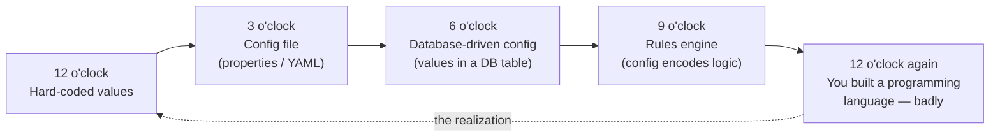
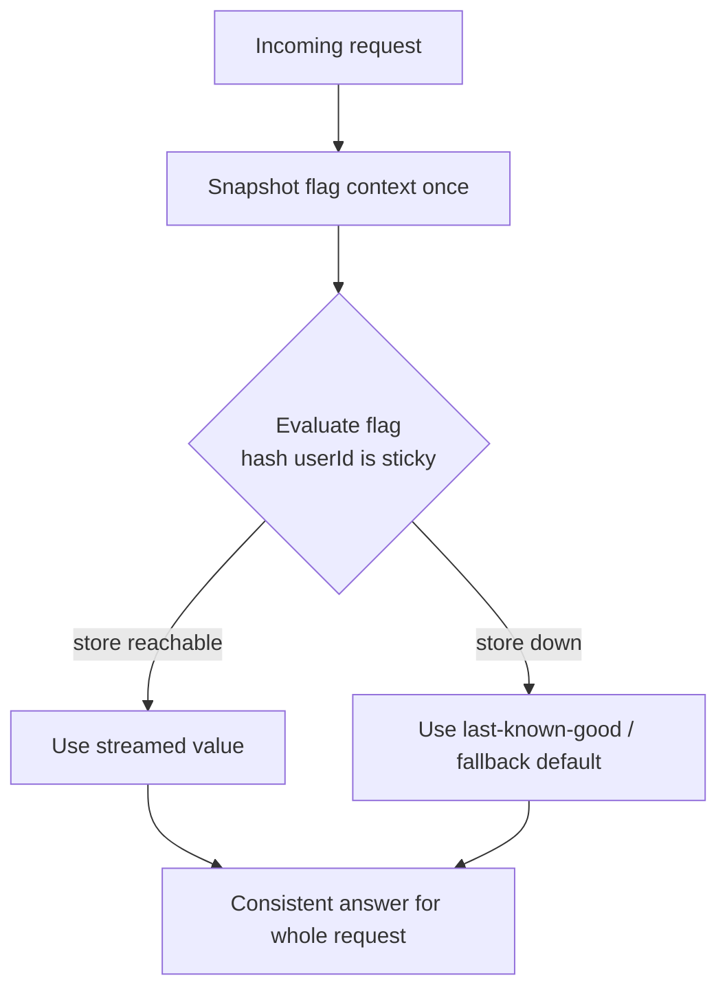

# Configuration, Constants & Feature Flags — Professional Level

> Focus: configuration as a *first-class source of complexity and incident risk*. The configuration complexity clock, the "config is a programming language" trap, feature flags as distributed mutable state, the statistics of flag-driven experiments, and the discipline of treating config changes with the same rigor — review, types, staged rollout, kill switches — as code changes.

---

## Table of Contents

1. [Config is the leading cause of outages](#config-is-the-leading-cause-of-outages)
2. [The configuration complexity clock](#the-configuration-complexity-clock)
3. [The "config is a programming language" trap](#the-config-is-a-programming-language-trap)
4. [Typed, total, fail-fast configuration](#typed-total-fail-fast-configuration)
5. [Feature flags as distributed state](#feature-flags-as-distributed-state)
6. [The statistics flags forget: experimentation rigor](#the-statistics-flags-forget-experimentation-rigor)
7. [Flags as technical debt: Knight Capital and the immortal flag](#flags-as-technical-debt-knight-capital-and-the-immortal-flag)
8. [Treating config changes like code changes](#treating-config-changes-like-code-changes)
9. [Common Mistakes](#common-mistakes)
10. [Test Yourself](#test-yourself)
11. [Cheat Sheet](#cheat-sheet)
12. [Summary](#summary)
13. [Further Reading](#further-reading)
14. [Related Topics](#related-topics)

---

## Config is the leading cause of outages

The uncomfortable empirical finding: a large fraction of production incidents originate not in code but in **configuration**. The academic literature is blunt. Yin et al., *"An Empirical Study on Configuration Errors in Commercial and Open Source Systems"* (SOSP 2011), found configuration errors among the dominant causes of system failures, and showed that a large share were **parameter mistakes** that a simple validation check could have caught. Xu et al., *"Do Not Blame Users for Misconfigurations"* (SOSP 2013), demonstrated that most misconfigurations are *latent* — the bad value is accepted silently and only manifests under specific conditions, often long after the change. Their earlier survey, *"Early Detection of Configuration Errors to Reduce Failure Damage"* (OSDI 2016), argued for catching these errors at the *earliest possible point* — ideally at load — rather than letting them propagate.

The industry postmortems echo the research:

- **Facebook, 2021-10-04.** A configuration change issued during routine maintenance withdrew BGP routes, disconnecting Facebook's data centers from the internet for roughly six hours. A command intended to assess backbone capacity, combined with an audit tool that failed to stop it, took the whole company offline. (Facebook engineering postmortem, "More details about the October 4 outage.")
- **Google, 2020-12-14.** An automated quota system, fed a configuration that under-counted usage, throttled the identity service to zero, taking down Gmail, YouTube, and Workspace for ~45 minutes. (Google Cloud incident report.)
- **AWS, Cloudflare, Azure** — recurring root causes in public postmortems are config pushes that bypassed the validation and staged-rollout discipline applied to code.

The lesson that runs through all of them: **a config change is a production change.** It deserves a type system, a review, a canary, and a rollback plan. Treating `config/` as "just data you can edit live" is treating an unguarded `eval()` as safe.

> The deepest insight from the research is that the failures are *silent*. The system does not reject the bad value; it accepts it and fails closed somewhere downstream. This is why **total, fail-fast parsing at startup** (Section 4) is not a nicety — it is the single highest-leverage defense.

---

## The configuration complexity clock

Mike Hadlow's 2012 essay *"The Configuration Complexity Clock"* is the canonical model for why config grows out of control. The clock has positions, and a system tends to walk them clockwise, accumulating complexity at each step, until it arrives back where it started — but worse.



The progression:

1. **12 o'clock — hard-coded.** A literal `0.07` tax rate in the source. Simple, but changing it requires a deploy.
2. **3 o'clock — config file.** Move it to `config.yaml`. Now ops can change it without a deploy. Reasonable.
3. **6 o'clock — database.** "We need to change it without restarting / per-tenant." Values move to a DB table with an admin UI.
4. **9 o'clock — rules engine.** "Different rates for different conditions." The config now contains *conditionals*, *expressions*, *dispatch*. You are writing a DSL.
5. **12 o'clock again.** The rules engine is now Turing-complete and undebuggable. You have reinvented programming — without a type checker, a debugger, version control, or tests. **The cure is to go back to code**: express the logic in your actual programming language, which already has all those tools.

> Hadlow's punchline: *"The point is that as you give more flexibility to your config, you eventually reach the point where your config is your code, but expressed in the worst possible language."* The professional skill is recognizing **which position on the clock a given setting belongs at** — and resisting the gravitational pull to the next position. A tax rate is 3 o'clock data. A pricing *algorithm* is code; do not push it into a rules engine because someone wants to "change it without a deploy."

---

## The "config is a programming language" trap

YAML and JSON were designed as data formats. The moment teams need *abstraction* (DRY across environments), *computation* (derive a port from base + offset), or *conditionals* (different replica count per region), they bolt these on — first with copy-paste, then with templating (Helm's Go templates over YAML), then with anchors and merge keys. The result is the worst of both worlds: a data format performing computation it was never designed for, with no type checker and string-templating bugs.

This is not hypothetical; it is the daily reality of Kubernetes manifests. The principled responses are **purpose-built configuration languages**:

| Language | Origin | Key property |
|---|---|---|
| **Dhall** | Gabriel Gonzalez, 2017 | **Total** (guaranteed to terminate — not Turing-complete by design), strongly typed, has functions and imports. Cannot infinite-loop or run arbitrary effects. |
| **CUE** | Marcel van Lohuizen (ex-Google, BCL/GCL lineage) | Types *are* values; constraints unify. Excellent for validation and schema + data in one language. |
| **Jsonnet** | Google (derived from internal GCL) | Turing-complete data templating; powerful but can loop forever. |
| **Starlark** | Google (Bazel's config language) | A deliberately-restricted Python dialect: **deterministic, hermetic, no I/O, no recursion**. The "principled subset" answer. |

The design axis that matters is **totality**. Dhall's defining choice — being *not* Turing-complete — is the whole point: a Dhall config is guaranteed to terminate and produce a value or a type error, never hang or perform a side effect. Starlark makes the same bet for Bazel: configuration evaluation must be deterministic and reproducible, so the language forbids the constructs (unbounded recursion, I/O, nondeterminism) that would break that guarantee.

> **The rule:** if you find yourself writing loops, conditionals, and functions in YAML via templating hacks, you have arrived at 9 o'clock on Hadlow's clock. You have two honest exits: (a) move the logic back into your application code, or (b) adopt a *real, ideally total* configuration language (Dhall/CUE/Starlark) that brings types and termination guarantees. The dishonest exit — more YAML templating — is how the outages in Section 1 happen.

---

## Typed, total, fail-fast configuration

The single most effective defense against the silent-misconfiguration finding (Yin/Xu) is **parse, don't validate** (Alexis King's framing): turn the untyped environment into a typed, validated value *once*, at startup, and let the rest of the program consume only the typed value. A missing or malformed setting becomes a loud crash on boot — before the service accepts traffic — not a `NullPointerException` at 3 a.m. under load.

### Go — struct tags + validation, fail fast

```go
type Config struct {
    Port        int           `env:"PORT" validate:"required,min=1,max=65535"`
    DatabaseURL string        `env:"DATABASE_URL" validate:"required,url"`
    ReadTimeout time.Duration `env:"READ_TIMEOUT" envDefault:"5s"`
    Env         Environment   `env:"APP_ENV" validate:"required,oneof=dev staging prod"`
}

// Loaded ONCE at startup. If it returns an error, the process refuses to start.
func Load() (*Config, error) {
    var c Config
    if err := env.Parse(&c); err != nil {
        return nil, fmt.Errorf("config parse: %w", err)
    }
    if err := validate.Struct(&c); err != nil {
        return nil, fmt.Errorf("config invalid: %w", err) // fail fast, loud
    }
    return &c, nil
}
```

`Environment` is a *named type*, not a bare string — the same Primitive Obsession cure discussed in [13-generics-and-types](../13-generics-and-types/README.md). `if env == "prod"` smeared through the codebase is a smell; a typed `Environment` with an exhaustive switch is the fix.

### Java — `@ConfigurationProperties`, validated, immutable record

```java
@ConfigurationProperties("app")
@Validated
public record AppConfig(
    @Min(1) @Max(65535) int port,
    @NotBlank String databaseUrl,
    @NotNull Duration readTimeout,
    @NotNull Environment env   // enum: DEV, STAGING, PROD
) {}
// Spring Boot binds and validates at startup; a violation fails the
// ApplicationContext refresh — the app never reaches a serving state.
```

### Python — Pydantic Settings, frozen

```python
class Settings(BaseSettings):
    port: int = Field(ge=1, le=65535)
    database_url: PostgresDsn
    read_timeout: timedelta = timedelta(seconds=5)
    env: Literal["dev", "staging", "prod"]

    model_config = SettingsConfigDict(frozen=True)  # immutable after load

settings = Settings()  # raises ValidationError at import time if malformed
```

Three properties make this safe:

1. **Total parsing.** Every field has a type and a constraint; the loader is a *total function* from environment to either a valid `Config` or a fatal error. There is no "valid-looking but wrong" middle state that reaches request handling.
2. **Immutability.** The config is read once and frozen. This directly kills the **mutable-global-config** anti-pattern — config re-read at arbitrary times produces non-deterministic behavior and untestable code (see [16-defensive-vs-offensive](../16-defensive-vs-offensive/README.md) on offensive fail-fast).
3. **Single source of truth.** One typed object, injected; not a `Map<String,String>` consulted ad hoc across the codebase (the **stringly-typed config** anti-pattern).

> Secrets are the exception that proves the rule: they are config, but they must *not* live in the config file under version control. They load from a secrets manager (Vault, AWS Secrets Manager, KMS-encrypted) into the same typed object at startup. The type system treats them identically; the *provenance* differs.

---

## Feature flags as distributed state

A feature flag is not a boolean. It is a piece of **mutable, distributed state** read on the hot path of every request, often thousands of times per second, across many processes. This reframing — from "an `if`" to "a distributed system" — is what separates senior from professional flag use. Three properties follow.

### Evaluation consistency and staleness

Flag values are typically served from a flag-management plane (LaunchDarkly, Unleash, Flagsmith, or homegrown on Redis/etcd) and **cached in-process** for performance. This creates a CAP-style tension:

- **Fresh but slow:** evaluate against the central store on every call → adds network latency to every request and a hard dependency on the flag service's availability.
- **Fast but stale:** cache locally with a TTL or streamed updates → reads are nanoseconds, but during the propagation window different replicas see different values.

The professional pattern is **streamed updates with a bounded staleness SLO**: the SDK holds a local snapshot, subscribes to a change stream, and applies updates within (say) a few seconds. Critically, the flag store must be a *soft dependency* — if it is unreachable, the SDK serves the **last known good** values or hard-coded **fallback defaults**, never blocks the request. A flag system that can take down your service when *it* is down has inverted the entire point of flags.

### Within-request consistency

If a single request evaluates the same flag twice and gets two different answers (because a streamed update landed mid-request), you get torn behavior. The fix is to **snapshot the flag context once per request** and evaluate all flags against that immutable snapshot. Same discipline as immutable config, applied per request.

### Targeting must be deterministic

User-targeted rollouts ("10% of users") must be *sticky*: the same user gets the same answer on every request and across replicas. This requires a deterministic hash — `hash(flagKey + userId) % 100 < rolloutPercentage` — not a random draw per evaluation. A non-deterministic rollout makes the feature flicker for users and makes any downstream experiment uninterpretable.



---

## The statistics flags forget: experimentation rigor

Feature flags are the delivery mechanism for **A/B experiments**, and here a software engineer collides with experimental statistics. Getting the plumbing right and the statistics wrong yields confident, wrong conclusions.

**Peeking / sequential testing.** The classic mistake is checking the p-value continuously and stopping the moment it crosses 0.05. Under repeated looks, the false-positive rate inflates dramatically — a "significant" result is often noise. The fixes are pre-registered sample sizes with a fixed-horizon test, or **always-valid inference / sequential testing** (Johari et al., *"Peeking at A/B Tests,"* KDD 2017), which is what Optimizely and similar platforms adopted to make continuous monitoring statistically honest.

**SUTVA and experiment leakage.** A/B analysis assumes the **Stable Unit Treatment Value Assumption**: a unit's outcome depends only on *its own* treatment, not on others'. Flags routinely violate it:

- **Network/marketplace interference.** In a social or marketplace product, treating one user (e.g., a new ranking) affects control users they interact with — the treatment "leaks." Bid pacing, two-sided markets, and social feeds are notorious. Cluster-randomized or switchback designs are the mitigation. (See Kohavi, Tang, Xu, *Trustworthy Online Controlled Experiments*, 2020.)
- **Shared-resource interference.** Treatment and control share a cache, a database connection pool, or a rate limiter; a treatment that hammers the cache degrades control's latency, biasing the metric.

**Carryover and overlapping experiments.** When many flags run simultaneously (large orgs run hundreds), one experiment's effect can contaminate another. Platforms address this with **layered / orthogonal experiment design** (Google's overlapping-experiments infrastructure, Tang et al., *"Overlapping Experiment Infrastructure,"* KDD 2010), which partitions traffic so concurrent experiments are statistically independent.

> The professional takeaway: a feature flag that drives a business decision is a *scientific instrument*. The engineering correctness (deterministic, sticky, consistent evaluation) is necessary but not sufficient — the analysis must respect peeking, SUTVA, and concurrency, or the "data-driven" decision is data-shaped superstition.

---

## Flags as technical debt: Knight Capital and the immortal flag

Every flag is a runtime `if` that doubles the test surface and the cognitive load of the code it guards. A flag is debt the moment it is created; the only question is whether you pay it down by **retiring** the flag, or let it become immortal.

### Knight Capital, 2012 — the $440M dead flag

The canonical disaster. Knight Capital, a major market maker, deployed new code (SMARS — Smart Market Access Routing System) to its production servers. The deployment **reused a feature flag** that had controlled functionality (`Power Peg`) dead and unused since 2003. The flag's bit was repurposed to activate the new code. Two failures combined:

1. The deploy was applied to 7 of 8 servers; the **8th still ran the old code**, where that flag bit still triggered the obsolete *Power Peg* logic.
2. *Power Peg* was a test routine that bought high and sold low — harmless in 2003 because it was paired with a position-counting function, which was removed in 2005, but the *Power Peg* code itself was never deleted.

When trading opened, the 8th server's repurposed flag fired the dormant *Power Peg*, which began sending millions of erroneous orders. In roughly **45 minutes, Knight executed ~4 million trades and accumulated a multi-billion-dollar erroneous position, realizing a ~$460M loss** (~$440M net). The firm — a 17-year-old institution — was effectively destroyed within days and acquired. (SEC Release No. 70694, the official enforcement order, is the primary source.)

The root causes are a checklist of this chapter's anti-patterns:

- An **immortal flag**: dead code (`Power Peg`) left in the binary for ~9 years instead of being deleted.
- A **repurposed flag bit**: reusing a still-live identifier for new meaning — a config aliasing bug.
- No **kill switch / automated halt** when order rates went anomalous.
- A non-atomic deploy that left flag *meaning* inconsistent across the fleet.

> The discipline the disaster teaches: **a flag has a death date.** When the rollout completes (100% or 0%), the flag and the *losing* branch must be deleted from the code, not just flipped. "Dead flag, live code" and "live flag, dead code" are both bombs. Repurposing a flag identifier is never acceptable; create a new one and delete the old.

### Operationalizing flag retirement

- **Categorize at birth.** Release flags (short-lived, delete after rollout) vs. ops/kill switches (long-lived by design) vs. permission/entitlement flags (not really feature flags). Conflating them is why release flags become immortal. (Pete Hodgson, *"Feature Toggles (aka Feature Flags),"* martinfowler.com, articulates this taxonomy.)
- **Expiry dates.** Tools like LaunchDarkly's flag status, Unleash's "stale" reports, and `git`-based flag-usage scanners flag candidates for removal. Some teams enforce a **CI check that fails if a release flag exceeds its TTL** (e.g., 60–90 days).
- **Cleanup is a first-class task**, scheduled in the same sprint as the rollout completion — not "later," which is never.

---

## Treating config changes like code changes

The synthesis of everything above is one operating principle, drawn straight from the SOSP research and the FAANG postmortems: **configuration is code, so apply the engineering lifecycle of code to it.**

| Practice for code | The config equivalent |
|---|---|
| Type checker | Typed, validated config schema (Section 4); Dhall/CUE for files |
| Compile error | Fail-fast at startup; CI validation of config files against schema |
| Code review (PR) | Config-change PR with reviewer; **GitOps** — config in version control, not edited live |
| Unit tests | Tests asserting config parses and invariants hold (port ranges, mutually-exclusive flags) |
| Canary / staged rollout | Percentage flag rollout; config canary to one region before fleet-wide |
| Rollback | Versioned config with one-click revert; **last-known-good** on the flag plane |
| Kill switch | Ops flags / circuit breakers that disable a feature without a deploy |
| Delete dead code | **Retire flags** on rollout completion; never repurpose identifiers (Knight Capital) |

The Facebook and Google outages happened in the gap between "we apply this rigor to code" and "we let config bypass it." Closing that gap — config-as-code in version control, validated in CI, rolled out by canary, reversible by a button — is the professional standard.

---

## Common Mistakes

1. **Pushing logic into config to "avoid a deploy."** This walks Hadlow's clock from 3 o'clock toward 9. A *value* (a rate, a timeout, a limit) belongs in config; an *algorithm* belongs in code. A YAML/rules-engine DSL is a worse programming language than the one you already have.
2. **Stringly-typed config consumed everywhere.** A global `Map<String,String>` read ad hoc means every consumer re-parses, re-validates (or doesn't), and bugs surface at runtime. Parse once into a typed, immutable object at startup.
3. **Silent defaults for required settings.** A missing `DATABASE_URL` that defaults to `localhost` lets the app "start" and then corrupt or fail mysteriously. Required settings must have *no* default and must fail boot loudly (the Xu et al. latent-error finding).
4. **Mutable global config re-read at runtime.** Non-deterministic behavior, untestable code, and config-reload races. Snapshot once; for genuinely dynamic values use a flag system with explicit, consistent evaluation semantics — not a re-read of a mutable global.
5. **Treating flags as free.** Each flag doubles a code path and the test matrix. Ten independent flags = up to 1024 behavioral combinations, almost none tested.
6. **Immortal flags / repurposed flag bits.** The Knight Capital failure mode. Flags need death dates; identifiers must never be reused.
7. **Flag plane as a hard dependency.** If the feature-flag service being down can take your service down, you have a new single point of failure. Always serve last-known-good or fallback defaults.
8. **Peeking at A/B results.** Stopping an experiment the moment p < 0.05 inflates false positives. Use fixed sample sizes or always-valid sequential tests.
9. **Ignoring SUTVA.** Running a marketplace or social experiment with naive user-level randomization when treatment leaks across units — the resulting numbers are biased and unactionable.
10. **Secrets in config files in git.** Even in a private repo, this is a credential leak waiting for a fork, a backup, or a breach. Secrets load from a manager into the typed config at runtime.

---

## Test Yourself

**1. A team's `pricing.yaml` has grown to include `if`/`else` blocks, variable references, and a `discount_formula` field evaluated by an in-house interpreter. Which position on Hadlow's clock are they at, and what is the cure?**

<details><summary>Answer</summary>

They are at roughly 9 o'clock — config encoding *logic*, a homegrown rules engine. The next tick (12 o'clock) is realizing they have built a Turing-complete programming language with no debugger, type checker, or tests. The honest cure is to **move the pricing logic back into application code** (the real programming language, which has all those tools) and keep only the *parameters* (rates, thresholds) in `pricing.yaml`. If multi-tenant per-config logic is genuinely required, adopt a *total* config language (Dhall/CUE) rather than expanding the homegrown interpreter — but first question whether the flexibility is real or speculative.

</details>

**2. Why is Dhall's *not* being Turing-complete considered a feature rather than a limitation?**

<details><summary>Answer</summary>

Because configuration evaluation has two properties you never want to lose: it must **always terminate** and must **never perform side effects**. A Turing-complete config language (Jsonnet, or YAML+templating taken far enough) can infinite-loop or perform I/O during evaluation, making config rendering nondeterministic and unsafe. Dhall is deliberately *total* — every program provably terminates — so rendering config can never hang and always yields either a value or a static type error. Starlark makes the same trade for Bazel (no recursion, no I/O, deterministic). The "limitation" is precisely the safety guarantee.

</details>

**3. Explain the exact role the repurposed flag played in the Knight Capital loss.**

<details><summary>Answer</summary>

A deploy reused a flag bit that, in old code still running on one un-updated server, activated `Power Peg` — a dead test routine (buy high, sell low) left in the binary since 2003 and decoupled from its safety counter in 2005. The new deploy intended the bit to enable SMARS. On 7 servers it did; on the 8th, still on old code, it resurrected *Power Peg*, which fired millions of erroneous orders. Two anti-patterns combined: an **immortal flag/dead code** never deleted, and a **repurposed identifier**. The fix would have been to delete the dead *Power Peg* code years earlier and to *never* reuse a flag bit — create a new identifier instead. ~$440M lost in ~45 minutes; the firm did not survive.

</details>

**4. Your service reads feature flags from a central store on every request to guarantee freshness. What is the hidden failure mode, and what is the correct design?**

<details><summary>Answer</summary>

You have made the flag service a **hard, synchronous dependency on the hot path**. Two failures result: (1) every request pays a network round-trip, inflating latency; (2) if the flag service is slow or down, *your* service degrades or fails — you inherited its availability as a ceiling on your own. The correct design is an in-process SDK holding a **local snapshot updated via a streamed change feed** with a bounded staleness SLO, and **last-known-good / fallback defaults** when the store is unreachable. Flag evaluation becomes a local, nanosecond, never-failing operation; freshness is eventual but bounded.

</details>

**5. An experiment shows the treatment "wins" with p = 0.03. The PM checked the dashboard daily for two weeks and called it the moment it crossed 0.05. What is wrong?**

<details><summary>Answer</summary>

**Peeking.** Each look at the data is another chance to cross the threshold by noise; with daily looks over two weeks the effective false-positive rate is far above the nominal 5%. A single fixed-horizon test at a pre-registered sample size is valid; continuous monitoring against a fixed 0.05 line is not. Use **always-valid / sequential inference** (Johari et al., KDD 2017) — confidence sequences that remain valid under continuous monitoring — or commit to a sample size up front and only decide at the end.

</details>

**6. Why is a typed, immutable, fail-fast config object strictly better than a mutable `Map<String,String>` read throughout the app, beyond mere aesthetics?**

<details><summary>Answer</summary>

Three concrete reasons. (1) **Correctness timing:** a typed loader is a total function that fails at *startup* on a bad value — before serving traffic — matching the Xu/OSDI "early detection" finding; the map fails at an arbitrary later moment, possibly after partial side effects. (2) **Determinism/testability:** an immutable object read once cannot change underfoot; a mutable global re-read at unknown times produces non-deterministic behavior and reload races. (3) **Single source of truth:** every consumer shares one validated representation, so a constraint (port range, mutually exclusive flags) is enforced in one place rather than re-checked, inconsistently, at each call site.

</details>

**7. A treatment in a ride-sharing marketplace boosts driver earnings in the test group. The metric looks great, but rollout to 100% shows no effect. What likely happened?**

<details><summary>Answer</summary>

**SUTVA violation via marketplace interference.** In the experiment, treated drivers captured rides that *would have gone to control drivers* — the treatment's gain was partly a transfer from control, not net new value. User-level randomization assumes one unit's outcome is independent of others' treatment; in a two-sided market with a shared pool of riders, that fails. At 100% there is no control to cannibalize, so the apparent lift evaporates. The mitigation is **cluster-randomized or switchback designs** (randomize by city/time-window, not by individual driver) so the units are genuinely independent.

</details>

---

## Cheat Sheet

| Decision | Rule |
|---|---|
| Where does a setting live? | Pick the *lowest* Hadlow-clock position that works. Value → config file (3 o'clock). Algorithm → code. Resist the next tick. |
| Config format with logic needs | Stop templating YAML. Use a *total* language (Dhall/CUE/Starlark), or move logic to code. |
| Loading config | Parse once at startup into a **typed, immutable** object. Fail fast and loud on any invalid/missing required value. |
| Required vs. optional | Required settings have **no default** and crash boot if absent. Optional settings have explicit, documented defaults. |
| Secrets | Never in version control. Load from a secrets manager into the typed config at runtime. |
| Flag evaluation | Local snapshot + streamed updates; **last-known-good fallback**; flag store is a *soft* dependency. |
| Flag consistency | Snapshot context once per request; deterministic sticky hashing for rollouts. |
| Flag lifecycle | Categorize at birth (release/ops/permission). Release flags get a **death date** and a CI staleness check. |
| Flag retirement | On rollout completion, delete the flag *and the losing branch*. Never repurpose an identifier (Knight Capital). |
| Experiment analysis | No peeking; respect SUTVA (cluster/switchback when units interfere); use layered design for concurrent tests. |
| Config change process | Treat as a code change: PR review, CI validation, canary rollout, one-click rollback. |

---

## Summary

Configuration is not the boring part of a system; it is, per the SOSP/OSDI research and the Facebook/Google/Knight Capital postmortems, one of the **leading causes of catastrophic failure** — precisely because teams treat it as inert data exempt from the rigor they apply to code. The professional view rests on a few load-bearing ideas. **Hadlow's complexity clock** explains why config metastasizes into a homegrown, undebuggable programming language, and prescribes resisting each tick — keeping values in config and logic in code, or adopting a *total* config language when real complexity demands it. **Total, typed, fail-fast loading** turns the silent-misconfiguration failure mode into a loud startup crash, the single highest-leverage defense. **Feature flags are distributed mutable state**, demanding consistency, bounded staleness, soft-dependency fallbacks, and deterministic sticky targeting — and, when they drive experiments, statistical rigor around peeking and SUTVA that engineers routinely neglect. Finally, **every flag is debt with a death date**: the Knight Capital loss is the eternal reminder that an immortal flag and a repurposed identifier can erase a firm in 45 minutes. Tie it together with one principle — **a config change is a production change** — and apply types, review, canary, and rollback to config exactly as you do to code.

---

## Further Reading

- Mike Hadlow — *"The Configuration Complexity Clock"* (mikehadlow.blogspot.com, 2012). The origin of the clock model.
- Yin, Ma, Zheng, Zhou, Bairavasundaram, Pasupathy — *"An Empirical Study on Configuration Errors in Commercial and Open Source Systems"* (SOSP 2011).
- Xu, Jin, Zhang, Zhou et al. — *"Do Not Blame Users for Misconfigurations"* (SOSP 2013); and *"Early Detection of Configuration Errors to Reduce Failure Damage"* (OSDI 2016).
- U.S. SEC — *In the Matter of Knight Capital Americas LLC*, Release No. 34-70694 (2013). Primary source for the $440M loss.
- Pete Hodgson — *"Feature Toggles (aka Feature Flags)"* (martinfowler.com). The release/ops/permission taxonomy and retirement discipline.
- Johari, Pekelis, Walsh — *"Peeking at A/B Tests: Why It Matters, and What to Do About It"* (KDD 2017).
- Tang, Agarwal, O'Brien, Meyer — *"Overlapping Experiment Infrastructure: More, Better, Faster Experimentation"* (Google, KDD 2010).
- Kohavi, Tang, Xu — *Trustworthy Online Controlled Experiments: A Practical Guide to A/B Testing* (Cambridge, 2020).
- Alexis King — *"Parse, Don't Validate"* (lexi-lambda.github.io, 2019).
- Dhall (dhall-lang.org) and CUE (cuelang.org) language documentation; Bazel's Starlark spec.
- Facebook Engineering — *"More details about the October 4 outage"* (engineering.fb.com, 2021).

---

## Related Topics

- [senior.md](senior.md) — design-level rules: scoping constants, single source of truth, flag taxonomy.
- [interview.md](interview.md) — Q&A across all levels on configuration and feature flags.
- [Chapter README](../README.md) — the positive rules for this chapter.
- [16 — Defensive vs. Offensive Programming](../16-defensive-vs-offensive/README.md) — fail-fast and offensive checks, the basis of total config loading.
- [13 — Generics and Types](../13-generics-and-types/README.md) — typed config over stringly-typed maps; named types over bare strings.
- [Anti-Patterns](../../anti-patterns/README.md) — magic numbers, boolean traps, and global mutable state as catalogued smells.
