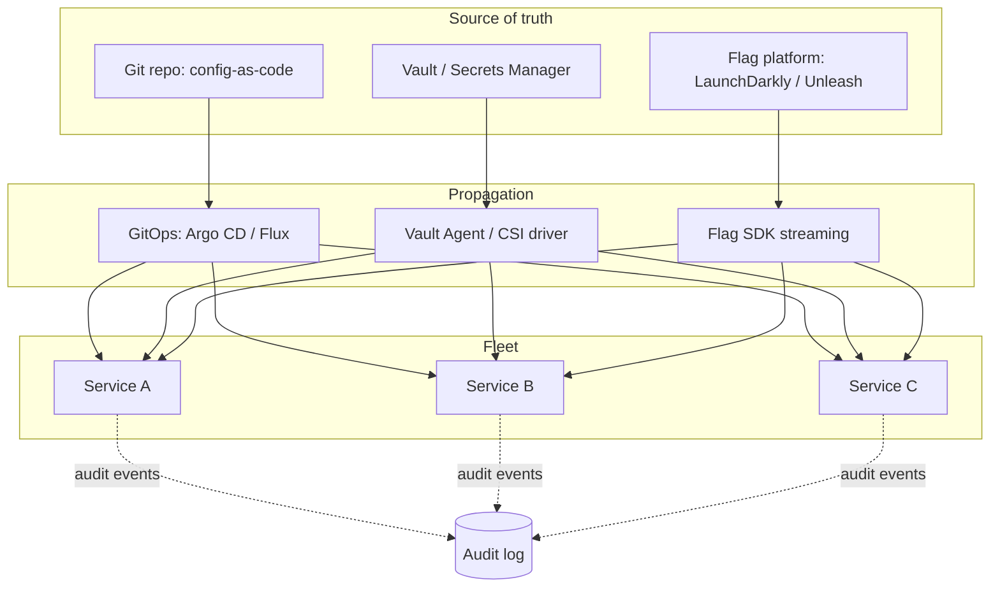
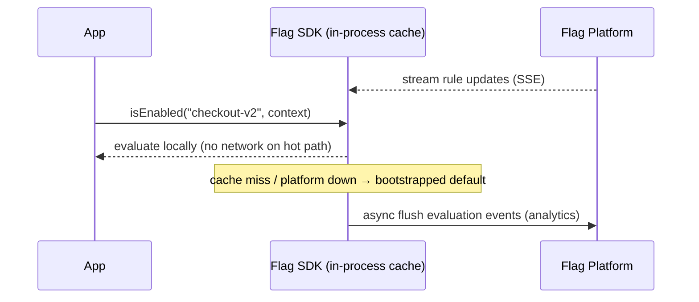
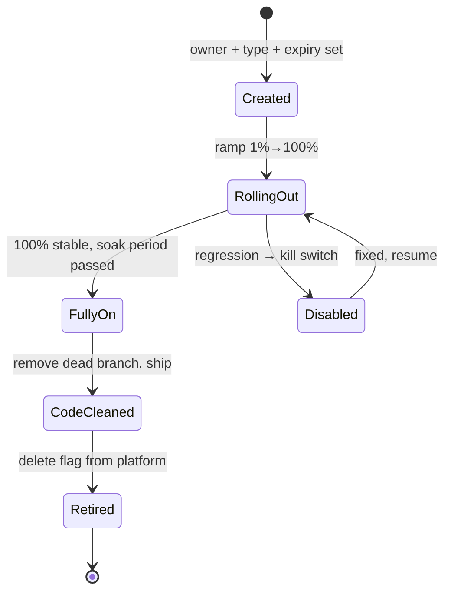
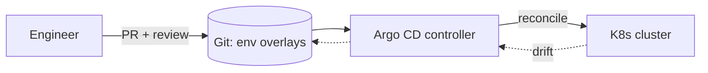

# Configuration, Constants & Feature Flags — Senior Level

> Focus: "How do we run this across a fleet?" Configuration and flags as **platform concerns** — centralized config and secrets, dynamic reload with validation, a feature-flag platform with targeting and governance, progressive delivery, config-as-code under GitOps, auditing, and CI-gated config testing. Team scale, multiple environments, blast-radius thinking.

---

## Table of Contents

1. [The shift: config as a platform concern](#the-shift-config-as-a-platform-concern)
2. [Centralized configuration and secrets](#centralized-configuration-and-secrets)
3. [Secret rotation without downtime](#secret-rotation-without-downtime)
4. [Dynamic config: safe reload and validation](#dynamic-config-safe-reload-and-validation)
5. [A feature-flag platform, not scattered booleans](#a-feature-flag-platform-not-scattered-booleans)
6. [Targeting, gradual rollout, kill switches](#targeting-gradual-rollout-kill-switches)
7. [Flag lifecycle governance and the retirement process](#flag-lifecycle-governance-and-the-retirement-process)
8. [Progressive delivery: canary and ring deploys gated by flags](#progressive-delivery-canary-and-ring-deploys-gated-by-flags)
9. [Config as code and GitOps](#config-as-code-and-gitops)
10. [Auditing config changes](#auditing-config-changes)
11. [Testing config in CI](#testing-config-in-ci)
12. [Environment parity](#environment-parity)
13. [Common Mistakes](#common-mistakes)
14. [Test Yourself](#test-yourself)
15. [Cheat Sheet](#cheat-sheet)
16. [Summary](#summary)
17. [Further Reading](#further-reading)
18. [Related Topics](#related-topics)

---

## The shift: config as a platform concern

At junior and middle level, configuration is a per-service activity: read environment variables, validate them at startup, name your constants. At senior level the unit of concern changes from *one service* to *a fleet of services across multiple environments*, and three questions dominate:

- **Where does the truth live, and who may change it?** A value that is correct in code but stale in production is wrong. The platform decides the single source of truth and the propagation path.
- **What is the blast radius of a change?** Flipping a flag, rotating a secret, or pushing a config diff can take down every service that reads it. Senior work is about making changes *gradual* and *reversible*.
- **Can we prove what was running, and roll back to it?** Auditability and reproducibility are non-negotiable once a config change can cause an incident.



The three planes are deliberately separate. **Non-secret config** lives in Git (reviewable, diffable). **Secrets** live in a secrets manager (encrypted, access-controlled, rotatable). **Behavioral toggles** live in a flag platform (runtime-changeable without deploy). Mixing them — a secret in Git, a flag in a ConfigMap — is the root of most config incidents.

---

## Centralized configuration and secrets

The decision is not "files vs. env vars" but **which backend owns which class of value**.

| Backend | Owns | Strength | Watch out for |
|---|---|---|---|
| **Git (config-as-code)** | Non-secret config: timeouts, feature defaults, routing | Reviewable, diffable, GitOps-native | Never put secrets here, even encrypted-in-history |
| **HashiCorp Vault** | Secrets, dynamic DB creds, PKI, transit encryption | Leasing, dynamic short-lived creds, audit log | Operational weight; needs unseal/HA strategy |
| **AWS Secrets Manager** | Static + auto-rotated secrets | Native rotation, IAM-scoped, KMS-backed | Per-secret cost; API rate limits at fleet scale |
| **AWS Parameter Store** | Non-secret params + `SecureString` | Cheap, IAM-scoped, hierarchical paths | Throughput limits; weaker rotation story than Secrets Manager |
| **K8s ConfigMap** | Non-secret config mounted into pods | Native, GitOps-friendly | Plaintext in etcd; not for secrets |
| **K8s Secret** | Secrets injected into pods | Native API | base64 is *encoding*, not encryption; enable etcd encryption-at-rest + RBAC |
| **Sealed Secrets / SOPS** | Encrypted secrets *stored in Git* | Lets you GitOps secrets safely | Key management is on you; rotation requires re-encrypt |

A common, defensible layout: **Parameter Store/ConfigMap for non-secret config, Vault or Secrets Manager for secrets, Sealed Secrets/SOPS when you must keep encrypted secrets in Git for GitOps**.

### Reading secrets without baking them into the image

Inject at runtime, never at build time. The Vault Agent and the Secrets Store CSI driver both write secrets to a tmpfs volume so they never touch the container image or the pod spec.

```yaml
# K8s: Secrets Store CSI driver mounts AWS Secrets Manager into a tmpfs volume
apiVersion: secrets-store.csi.x-k8s.io/v1
kind: SecretProviderClass
metadata:
  name: orders-db
spec:
  provider: aws
  parameters:
    objects: |
      - objectName: "prod/orders/db-password"
        objectType: "secretsmanager"
```

```go
// Go: read the mounted secret at startup; the path is config, the value is not.
func loadDBPassword() (string, error) {
    b, err := os.ReadFile("/mnt/secrets/db-password")
    if err != nil {
        return "", fmt.Errorf("read db password: %w", err) // fail fast, fail loud
    }
    return strings.TrimSpace(string(b)), nil
}
```

The application never sees the secret store's credentials — only the projected file. That keeps the secret out of `kubectl describe pod`, out of logs, and out of crash dumps if you scrub the path.

---

## Secret rotation without downtime

Rotation is the test that separates "we have a secrets manager" from "we use it correctly." A rotated secret that requires a redeploy to take effect is a half-built feature.

Three patterns, in increasing maturity:

1. **Static secret + restart.** Rotate in the manager, redeploy the service. Simple; causes a deploy per rotation. Acceptable for rarely rotated secrets.
2. **Dynamic short-lived credentials.** Vault's database secrets engine issues a *unique, expiring* DB credential per service instance. There is nothing long-lived to rotate — the lease expires. This is the strongest model.
3. **Dual-secret (versioned) rotation.** During rotation, both the old and new secret are valid. Services pick up the new one on their next refresh; once all instances have rotated, the old version is disabled.

```java
// Java: AWS Secrets Manager rotation with caching; the cache refreshes
// without restart, so a rotated secret propagates within the cache TTL.
SecretCache cache = new SecretCache(
    SecretCacheConfiguration.builder()
        .cacheItemTTL(Duration.ofMinutes(5).toMillis()) // bound staleness window
        .build());

String password = cache.getSecretString("prod/orders/db-password");
// On AWSSecretsManagerException with InvalidSignature, force-refresh and retry once:
// the secret rotated mid-request and the cached value is now the *previous* version.
```

The non-obvious senior rule: **rotation must overlap.** If the new secret becomes valid the instant the old one is revoked, every in-flight connection breaks. The rotation window where *both* are valid is what makes it zero-downtime. AWS's rotation Lambda models exactly this with `AWSCURRENT` and `AWSPENDING`/`AWSPREVIOUS` staging labels.

---

## Dynamic config: safe reload and validation

Some config must change without a deploy (log levels, rate limits, circuit-breaker thresholds). Dynamic config is powerful and dangerous: a bad reload is an outage with no deploy to point at.

Three rules make it safe:

1. **Validate before swap.** Parse and validate the new config into a fully-formed object. Only if validation passes do you atomically swap the live pointer. A failed reload keeps the last-known-good config.
2. **Atomic swap, never partial mutation.** Readers must see either the entire old config or the entire new config — never a half-applied state.
3. **Log the version and source of every reload.** When behavior changes at 3 a.m., you need to know *which* config generation was live.

```go
// Go: atomic, validated hot-reload. Readers never block; a bad config is rejected.
type Holder struct{ v atomic.Pointer[Config] }

func (h *Holder) Get() *Config { return h.v.Load() }

func (h *Holder) Reload(raw []byte, gen int) error {
    cfg, err := Parse(raw)
    if err != nil {
        return fmt.Errorf("parse config gen=%d: %w", gen, err) // keep last-good
    }
    if err := cfg.Validate(); err != nil {
        return fmt.Errorf("validate config gen=%d: %w", gen, err) // keep last-good
    }
    cfg.Generation = gen
    h.v.Store(cfg) // atomic swap; in-flight readers keep the old pointer
    slog.Info("config reloaded", "generation", gen, "source", "parameter-store")
    return nil
}
```

```python
# Python: same discipline — validate with Pydantic, then swap a module-level holder.
from pydantic import BaseModel, ValidationError

class Settings(BaseModel):
    rate_limit_rps: int
    log_level: str

_current: Settings | None = None

def reload(raw: dict, generation: int) -> None:
    global _current
    try:
        new = Settings(**raw)            # validation happens here
    except ValidationError as e:
        log.error("config reload rejected", generation=generation, errors=e.errors())
        return                           # last-known-good stays live
    _current = new                       # atomic rebind
    log.info("config reloaded", generation=generation)
```

Note the symmetry with [defensive programming](../16-defensive-vs-offensive/README.md): the reload boundary is a trust boundary. Anything coming from the config plane is untrusted input until validated.

---

## A feature-flag platform, not scattered booleans

A boolean in a ConfigMap is a flag the way a `print` statement is observability. At team scale you need a **flag platform** — LaunchDarkly, Unleash, Flagsmith, or a well-built in-house service — that provides:

- **Runtime evaluation** without redeploy, with streaming updates (SSE/websocket) so changes propagate in seconds.
- **Targeting rules**: by user segment, percentage, region, plan tier, or arbitrary attributes.
- **A local default / fallback** so a flag-service outage degrades gracefully instead of taking the app down.
- **An audit trail**: who flipped what, when, and why.
- **An SDK per language** with consistent evaluation semantics across Go, Java, and Python.



The architectural rule: **flag evaluation must be local and cheap.** The SDK keeps an in-memory ruleset, updated by a background stream. A network call on every `isEnabled` puts the flag platform in your request critical path — and now its availability is your availability.

```java
// Java: Unleash. Provide a context for targeting and a default for graceful degradation.
UnleashContext ctx = UnleashContext.builder()
    .userId(user.id())
    .addProperty("plan", user.plan())
    .addProperty("region", region)
    .build();

boolean newCheckout = unleash.isEnabled("checkout-v2", ctx, /* defaultValue */ false);
```

```python
# Python: Flagsmith. Always pass a default; never let a flag lookup throw on the hot path.
flags = flagsmith.get_identity_flags(identifier=user.id, traits={"plan": user.plan})
new_checkout = flags.is_feature_enabled("checkout_v2")  # SDK returns local default if offline
```

---

## Targeting, gradual rollout, kill switches

Three distinct flag *uses*, each with different lifecycle expectations:

| Flag type | Purpose | Lifetime | Example |
|---|---|---|---|
| **Release flag** | Decouple deploy from release; ramp gradually | Days to weeks → **retire** | `checkout-v2` rolled 1% → 100% |
| **Ops / kill switch** | Disable a feature or dependency under load | Long-lived, *permanent by design* | `disable-recommendations` |
| **Experiment flag** | A/B test, measure a metric | Length of the experiment → retire | `pricing-experiment-q3` |
| **Permission / entitlement** | Gate by plan or contract | Permanent, owned by product | `enterprise-sso` |

The mistake is treating all four the same. A release flag that is never retired becomes permanent dead-branch complexity (an *immortal flag*). A kill switch that someone "cleans up" removes your only lever during the next incident.

**Gradual rollout** is a percentage attached to a stable hash of the targeting key, so the *same* user stays in the same bucket as you ramp:

```go
// Go: deterministic bucketing — a user doesn't flip in and out as you raise the %.
func inRollout(key string, percent int) bool {
    h := fnv.New32a()
    _, _ = h.Write([]byte("checkout-v2:" + key)) // salt with flag name
    return int(h.Sum32()%100) < percent
}
```

A **kill switch** is the inverse of a rollout: a single boolean, owned by on-call, that disables an expensive or fragile path immediately. It pairs naturally with circuit-breaker logic — the flag is the manual override the breaker's automation cannot infer.

---

## Flag lifecycle governance and the retirement process

Flag debt is real debt. Every live flag doubles the number of code paths to reason about; *N* flags imply up to 2^N combinations, most untested. The discipline that distinguishes a senior team:

1. **Every flag has an owner and a type at creation.** No anonymous flags. The platform should refuse a flag with no owner.
2. **Release and experiment flags carry an expiry date.** A flag past its expiry shows up on a dashboard and pages its owner.
3. **A retirement process, not a vague intention.** Retiring a flag is: (a) confirm it is at 100% (or 0%), (b) delete the dead branch in code, (c) ship that change, (d) delete the flag from the platform — *in that order*. Deleting the platform flag first leaves the code reading a now-missing flag.
4. **Flag debt is tracked like any backlog.** A monthly "flag cleanup" with a hard cap on live release flags (e.g. "no more than 20 active release flags") keeps it bounded.



You can enforce part of this with tooling: a CI job that greps the codebase for flag keys, cross-references the platform's API for flags older than their expiry, and fails or warns. Open-source linters and LaunchDarkly's `code references` feature do exactly this — they map every flag to its call sites so you know what is safe to delete.

---

## Progressive delivery: canary and ring deploys gated by flags

Progressive delivery separates **deploy** (code is running) from **release** (users see it). Flags are the gate; the deployment system is the engine.

- **Canary**: route a small slice of traffic to the new version, watch SLOs, ramp or roll back. Argo Rollouts and Flagger automate the ramp-and-watch loop against Prometheus metrics.
- **Ring deploys** (Microsoft's term): concentric audiences — ring 0 = internal, ring 1 = early adopters, ring 2 = everyone. A flag's targeting rule *is* the ring boundary.

```yaml
# Argo Rollouts: canary that auto-aborts on a bad analysis run.
strategy:
  canary:
    steps:
      - setWeight: 5
      - pause: { duration: 10m }
      - analysis: { templates: [{ templateName: error-rate }] }  # rollback if SLO breached
      - setWeight: 25
      - pause: { duration: 10m }
      - setWeight: 100
```

The combination is powerful: deploy to all rings behind a flag-off, then *release* by ramping the flag — so the rollback path is "flip the flag," which is seconds, instead of "redeploy the old version," which is minutes. This is the operational reason flags and progressive delivery belong in the same chapter.

---

## Config as code and GitOps

Config-as-code means **the desired state of every environment is a reviewable, versioned artifact in Git**, and a controller (Argo CD, Flux) continuously reconciles the cluster to match it. The implications:

- **A config change is a pull request.** It gets reviewed, it has an author, it has a diff. This is where you catch "this timeout is 3000 in staging but 300 in prod."
- **Drift detection is automatic.** If someone `kubectl edit`s a live resource, the controller flags or reverts the drift. The Git repo is the only legitimate way to change state.
- **Rollback is `git revert`.** The previous good state is a commit away, and the controller applies it.
- **Environments are folders/overlays, not copy-paste.** Kustomize overlays or Helm value files express *differences* from a shared base, which keeps environment parity honest (see below).



Secrets need the SOPS/Sealed-Secrets bridge here: GitOps wants everything in Git, but raw secrets cannot go in Git. SOPS encrypts only the *values* (leaving keys diffable), and the controller decrypts at apply time using a KMS key the cluster can access but reviewers cannot.

---

## Auditing config changes

When a config change causes an incident, the first question is "what changed and who changed it?" The audit story must cover all three planes:

- **Git-backed config**: `git log` *is* the audit trail — author, timestamp, diff, PR review. Free, and the gold standard.
- **Flag platform**: every platform worth using logs flag changes (who, when, old value → new value). Wire these into your incident timeline; a flag flip is a deploy.
- **Secrets manager**: Vault's audit device and AWS CloudTrail record every read and write of a secret. This is also your detection surface for credential misuse.

The senior expectation is a **unified change timeline**: deploys, flag flips, and config diffs on one timeline correlated with your SLO dashboards, so "the error rate jumped at 14:32" lines up with "flag `checkout-v2` went to 50% at 14:31." Without this correlation, every config-induced incident is a manual archaeology dig.

---

## Testing config in CI

Config is code that runs in production; it deserves CI like code.

1. **Schema validation in CI.** Every config file is validated against a schema (JSON Schema, Pydantic model, protobuf) on every PR. A typo'd key or a string-where-int-expected fails the build, not production.

```python
# Python: validate every env's config file against the schema in CI.
import sys, yaml
from settings import Settings  # Pydantic model = the schema

for path in sys.argv[1:]:
    data = yaml.safe_load(open(path))
    try:
        Settings(**data)
    except Exception as e:
        print(f"INVALID {path}: {e}", file=sys.stderr)
        sys.exit(1)
```

2. **Contract tests for config consumers.** If service A reads a value that service B's config produces, a contract test asserts the shape stays compatible — the same idea as API contract testing applied to shared config.
3. **Required-key tests.** Assert that production config provides *every* required key with no silent default. A missing required secret should fail CI when the manifest is rendered, not fail closed at 3 a.m.
4. **Flag-default tests.** Unit tests that exercise both flag states. A flag that has only ever been tested in its "off" path is a latent outage when it turns on.

```go
// Go: table test both sides of a flag so neither path rots.
func TestCheckout(t *testing.T) {
    for _, tc := range []struct{ name string; v2 bool }{
        {"legacy", false}, {"v2", true},
    } {
        t.Run(tc.name, func(t *testing.T) {
            got := Checkout(Cart{}, flagsWith("checkout-v2", tc.v2))
            // assert behavior for BOTH flag states
            _ = got
        })
    }
}
```

---

## Environment parity

The Twelve-Factor "dev/prod parity" rule: keep environments as similar as possible so a change that works in staging works in prod. At team scale this means:

- **One base config, environment *overlays*.** Each environment expresses only its *differences*. If staging and prod configs are full copies, they drift silently.
- **Same backing services, scaled down — not substituted.** Use a real Postgres in staging, not SQLite; a real Redis, not an in-memory map. Substitution hides bugs that only the real service exhibits.
- **Parity tests.** A CI check that diffs the *keys* (not values) of every environment's config and fails if one environment has a key another lacks. The values differ legitimately; the *shape* should not.
- **No environment-conditional logic in code.** `if env == "prod"` smeared through the codebase is the anti-parity smell — it means staging never exercises the prod path. Push the difference into config values, not code branches. (See [Boundaries](../07-boundaries/README.md): the environment is a boundary, and conditionals on it leak that boundary everywhere.)

---

## Common Mistakes

- **Secrets in Git "because it's a private repo."** Once committed, a secret is in history forever and on every clone. Use a secrets manager; if you must GitOps it, encrypt with SOPS/Sealed Secrets.
- **Flag evaluation in the request critical path.** Calling the flag platform synchronously per request makes its uptime your uptime. Evaluate from a streamed in-memory cache with a local default.
- **No flag retirement process.** Flags accumulate; 2^N untested path combinations accumulate faster. Without expiry dates and a cleanup cadence, flag debt compounds silently.
- **Rotation without an overlap window.** Revoking the old secret the instant the new one is valid breaks every in-flight connection. Both must be valid during the rotation window.
- **Hot-reload that mutates live config in place.** A partial swap means readers see a half-applied state. Validate fully, then swap an atomic pointer.
- **Full config copies per environment.** Copy-paste configs drift. Use a shared base plus overlays so differences are explicit and reviewable.
- **Silent defaults for required settings.** A missing required secret that falls back to a default fails *closed and quiet* in prod. Fail fast and loud at startup.
- **Treating kill switches as cleanup targets.** Removing an ops flag because "it's always on" deletes your only manual override for the next incident.
- **`if env == "prod"` in business logic.** It means staging never runs the prod path, defeating the point of having a staging environment.

---

## Test Yourself

1. **Why must feature-flag evaluation be local and in-memory rather than a synchronous call to the flag platform?**

<details><summary>Answer</summary>

A synchronous lookup per request puts the flag platform's latency and availability directly in your request critical path — its outage becomes your outage, and its p99 adds to yours. The SDK should keep an in-memory ruleset updated by a background stream (SSE/websocket) and evaluate locally with a bootstrapped default, so a flag-platform outage degrades to "flags hold their last-known value" instead of "the app is down." Evaluation events are flushed asynchronously for analytics, off the hot path.

</details>

2. **What makes a secret rotation zero-downtime, and what breaks it?**

<details><summary>Answer</summary>

An *overlap window* where both the old and new secret are valid. Services pick up the new value on their next cache refresh; only after all instances have rotated is the old version disabled. It breaks when the old secret is revoked the instant the new one is created — every connection or request still holding the old credential fails. AWS models this with `AWSCURRENT`/`AWSPENDING`/`AWSPREVIOUS` staging labels; Vault sidesteps it entirely with short-lived dynamic credentials that simply expire.

</details>

3. **Your team has 60 live feature flags and growing. What's the governance problem and the fix?**

<details><summary>Answer</summary>

Flag debt: each flag adds code paths and, combinatorially, up to 2^N state combinations, most untested. The fix is a lifecycle policy: every flag has an owner and a type at creation; release and experiment flags carry expiry dates; a CI job maps flag keys to call sites and flags expired ones; a retirement process deletes the dead code branch *before* deleting the platform flag; and a cap on active release flags forces regular cleanup. Permanent ops/kill switches and entitlement flags are exempt by design.

</details>

4. **In a GitOps setup, how do you handle secrets, given that GitOps wants everything in Git but raw secrets cannot go in Git?**

<details><summary>Answer</summary>

Use a Git-safe encryption bridge: SOPS or Sealed Secrets encrypt the secret *values* (SOPS leaves the keys plaintext so diffs are reviewable) using a KMS key. The encrypted artifact is committed; the GitOps controller decrypts at apply time using a key the cluster can access but human reviewers cannot. This preserves the GitOps invariant (Git is the source of truth, rollback is `git revert`) without ever exposing plaintext secrets in the repo.

</details>

5. **Why is `if env == "prod"` scattered through code an environment-parity anti-pattern?**

<details><summary>Answer</summary>

Because the prod-only branch never executes anywhere except prod — staging exercises the *other* branch, so staging gives no confidence about the prod path. The whole point of a staging environment is to run the same code path with safe values. The fix is to push the difference into config *values* (a timeout, an endpoint, a feature default) injected per environment, so all environments run identical code and only the injected values differ. Difference belongs in config, not in code branches.

</details>

6. **What's the relationship between progressive delivery and feature flags, and why does it make rollback faster?**

<details><summary>Answer</summary>

Progressive delivery separates deploy (code running) from release (users seeing it). You deploy the new code to all rings behind a flag that's off, then *release* by ramping the flag. Because the gate is a flag, rollback is "flip the flag back" — seconds — rather than "redeploy the previous version" — minutes, plus image pull and rollout time. Canary tooling (Argo Rollouts, Flagger) automates the ramp-and-watch against SLOs and can auto-abort, but the human-grade emergency lever is still the flag.

</details>

---

## Cheat Sheet

| Concern | Senior default |
|---|---|
| Non-secret config | Git (config-as-code) + GitOps reconciliation |
| Secrets | Vault dynamic creds, or Secrets Manager with rotation; never in Git unless SOPS/Sealed |
| Secret injection | Runtime mount (CSI driver / Vault Agent) into tmpfs — never in the image |
| Rotation | Overlap window (both valid) or short-lived dynamic creds; never instant cutover |
| Dynamic reload | Validate fully → atomic pointer swap → keep last-known-good on failure |
| Flag evaluation | In-memory, streamed updates, local default; off the request critical path |
| Flag lifecycle | Owner + type + expiry at creation; retirement deletes code branch *before* flag |
| Rollout | Deterministic hash bucketing; stable per-user assignment as % ramps |
| Kill switch | Single boolean owned by on-call; permanent by design |
| Progressive delivery | Deploy off → release by flag ramp; rollback = flip flag |
| Audit | Unified timeline: deploys + flag flips + config diffs vs. SLO dashboards |
| CI | Schema validation, required-key checks, both-flag-state tests, parity (key) diff |
| Environments | Shared base + overlays; real backing services scaled down; no `if env==` in logic |

---

## Summary

At senior level, configuration and feature flags stop being a per-service chore and become **platform concerns** governed by blast radius, auditability, and reversibility. The three planes stay separate: non-secret config in Git under GitOps, secrets in a manager with rotation and runtime injection, behavioral toggles in a flag platform with local evaluation. Dynamic config is made safe by validate-then-atomic-swap with last-known-good fallback. Feature flags become a platform with targeting, deterministic gradual rollout, kill switches, and — critically — a *governance and retirement process* that keeps flag debt bounded. Progressive delivery uses flags as the release gate so rollback is a flag flip, not a redeploy. Everything is testable in CI (schema, required keys, both flag states, parity) and observable on a unified change timeline. The throughline: a config or flag change is a production change, and every production change deserves review, gradual rollout, audit, and a fast way back.

---

## Further Reading

- *The Twelve-Factor App* — Factor III (Config) and Factor X (Dev/Prod Parity).
- Pete Hodgson, "Feature Toggles (aka Feature Flags)" — martinfowler.com; the canonical taxonomy (release/ops/experiment/permission) and the retirement argument.
- HashiCorp Vault docs — dynamic secrets, database secrets engine, audit devices.
- AWS Secrets Manager docs — rotation Lambda, `AWSCURRENT`/`AWSPENDING`/`AWSPREVIOUS` staging labels.
- Argo CD and Argo Rollouts docs — GitOps reconciliation, canary analysis, auto-rollback.
- Unleash and LaunchDarkly docs — SDK evaluation model, streaming, code references for flag cleanup.
- SOPS and Sealed Secrets — encrypting secrets safely inside a Git repo for GitOps.

---

## Related Topics

- [junior.md](junior.md) — magic numbers, named constants, basic env-var config.
- [middle.md](middle.md) — typed config, fail-fast validation, boolean-trap flags, single source of truth.
- [professional.md](professional.md) — designing the config/flag library API a whole codebase consumes.
- [Chapter README](../README.md) — the positive rules for configuration, constants, and flags.
- [Defensive vs. Offensive Programming](../16-defensive-vs-offensive/README.md) — the config reload boundary is a trust boundary.
- [Boundaries](../07-boundaries/README.md) — the environment is a boundary; don't leak `env ==` checks across it.
- [Anti-Patterns](../../anti-patterns/README.md) — magic strings, configuration sprawl, and immortal flags as named smells.
- [Refactoring](../../refactoring/README.md) — retiring an immortal flag is dead-branch removal; branch-by-abstraction gates rollout with a flag.
