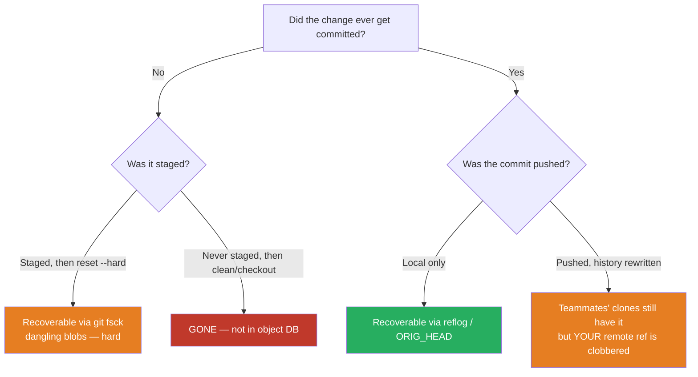

# Clean Commits & Version-Control Hygiene — Find the Bug

> 12 git scenarios where a command, a history, or a config hides a real hazard — one that loses work, rewrites history under teammates, or leaks a secret into the permanent record. Find what goes wrong before reading the answer; the fix is almost always "trust the tool and use the safe variant," not "be more careful next time."

---

## Table of Contents

1. [Snippet 1 — Force-push to a shared branch](#snippet-1--force-push-to-a-shared-branch-shell)
2. [Snippet 2 — `reset --hard` over uncommitted work](#snippet-2--reset---hard-over-uncommitted-work-shell)
3. [Snippet 3 — Rebasing an already-pushed branch](#snippet-3--rebasing-an-already-pushed-branch-shell)
4. [Snippet 4 — "Removing" a committed secret](#snippet-4--removing-a-committed-secret-shell)
5. [Snippet 5 — `git clean -fd` after a checkout](#snippet-5--git-clean--fd-after-a-checkout-shell)
6. [Snippet 6 — The conflict resolution that drops a change](#snippet-6--the-conflict-resolution-that-drops-a-change-shell)
7. [Snippet 7 — `.gitignore` added after the file was tracked](#snippet-7--gitignore-added-after-the-file-was-tracked-shell)
8. [Snippet 8 — Amending a commit you already pushed](#snippet-8--amending-a-commit-you-already-pushed-shell)
9. [Snippet 9 — Squash-merge that drops the co-author and sign-off](#snippet-9--squash-merge-that-drops-the-co-author-and-sign-off-shell)
10. [Snippet 10 — The kitchen-sink commit that breaks `git bisect`](#snippet-10--the-kitchen-sink-commit-that-breaks-git-bisect-shell)
11. [Snippet 11 — `checkout .` discards a teammate's stashless work](#snippet-11--checkout--discards-a-teammates-stashless-work-shell)
12. [Snippet 12 — The CI hook that auto-commits to `main`](#snippet-12--the-ci-hook-that-auto-commits-to-main-yaml)
13. [Scorecard](#scorecard)
14. [Related Topics](#related-topics)

---

## How to Use

Read the commands and the surrounding scenario. State of the world matters as much as the command itself — the same `git reset --hard` is harmless on a clean tree and catastrophic on a dirty one. For each snippet:

1. Trace what git actually does — not what the author *intended*. Distinguish the **working tree**, the **index/staging area**, the **local branch ref**, and the **remote ref**. Most VCS incidents are a confusion between two of these.
2. Decide whether the damage is **recoverable** (still in the object database — reflog, dangling commits, `ORIG_HEAD`) or **gone** (never committed, or garbage-collected, or pushed over).
3. Name the safe alternative. "Be careful" is never the answer; the answer is a command or workflow that makes the mistake impossible or recoverable.

The recoverability map below is the lens for every snippet:



---

### Snippet 1 — Force-push to a shared branch (shell)

**Difficulty:** ⭐⭐ Easy

Two engineers, Maya and Sam, both work off `release/2.4`. Maya rebases her local copy to clean up her commits, then:

```bash
git checkout release/2.4
git rebase -i HEAD~4        # squashed her 4 commits into 2
git push --force origin release/2.4
```

Meanwhile, twenty minutes earlier, Sam had pushed a hotfix commit to `release/2.4` that Maya never pulled.

**What goes wrong?**

<details><summary>Answer</summary>

**Consequence:** Sam's hotfix commit is erased from `origin/release/2.4`. `git push --force` tells the remote "make the branch point at *my* ref, whatever was there before." Maya's local branch never contained Sam's commit, so the forced update moves the remote ref back past it. The commit becomes unreachable on the remote; the next person who clones or hard-resets to `origin/release/2.4` will not have the hotfix.

**Why:** `--force` is unconditional. It does not check whether the remote moved since you last fetched. Maya rewrote her *own* history with rebase (legitimate locally), but pushing that rewrite onto a **shared** branch clobbered everyone else's contribution.

**Safe alternative — two independent fixes, both needed:**

1. Never rewrite history on a shared branch at all. Rebase is for *your* unpushed, local work. Shared branches move forward only.
2. When you must force-push your own branch (e.g. after rebasing your feature branch onto fresh `main`), use the leasing variant:

```bash
git push --force-with-lease origin feature/my-thing
```

`--force-with-lease` refuses the push if the remote ref is not where your last fetch said it was — i.e. if someone pushed in the meantime. It would have **rejected** Maya's push, surfacing Sam's commit instead of destroying it. Pair it with `--force-if-includes` (Git ≥ 2.30) to also guard against a stale local-tracking ref:

```bash
git push --force-with-lease --force-if-includes origin feature/my-thing
```

**Recovery if it already happened:** Sam's commit is still in his local clone and in any clone that fetched before the force-push. `git reflog` on the remote (if you host it and have server-side reflogs) or any developer's `git reflog show origin/release/2.4` can recover the SHA; then `git push` it back. The lesson stands: prevention via `--force-with-lease` beats archaeology.

</details>

---

### Snippet 2 — `reset --hard` over uncommitted work (shell)

**Difficulty:** ⭐⭐ Easy

An engineer has spent two hours editing `parser.go`. They never committed or staged it. They want to "undo the last commit" because it was a mistake:

```bash
git log --oneline
# a1b2c3d (HEAD) bad commit I want gone
# 9f8e7d6 good commit

git reset --hard HEAD~1
```

**What goes wrong?**

<details><summary>Answer</summary>

**Consequence:** The two hours of uncommitted edits in `parser.go` are **permanently destroyed**, in addition to undoing the commit. `git reset --hard` resets *three* things to the target commit: the branch ref, the index, **and the working tree**. The unstaged, uncommitted changes never existed in the object database, so there is nothing to recover them from. The reflog can bring back the *commit* `a1b2c3d`, but not the working-tree edits.

**Why:** `--hard` is the only `reset` mode that touches the working tree. The engineer wanted to move only the branch ref. They reached for the most destructive flag for a non-destructive intent.

**Safe alternatives, by intent:**

- *Undo the commit but keep its changes staged:* `git reset --soft HEAD~1`
- *Undo the commit, keep changes in the working tree (unstaged):* `git reset HEAD~1` (mixed, the default) — and this preserves the unrelated `parser.go` edits because mixed reset does not touch tracked files' working-tree content beyond unstaging.
- *Always, before any `--hard`:* stash or commit what you have.

```bash
git stash push -m "wip parser" parser.go
git reset --hard HEAD~1     # now safe — parser.go work is in the stash
git stash pop
```

Better still, if the commit was already pushed and others have it, don't reset at all — use `git revert a1b2c3d`, which adds a new commit undoing the bad one and rewrites no history.

**Recovery if it already happened:** the *commit* is recoverable (`git reflog`, find `a1b2c3d`, `git reset --hard a1b2c3d`). The *uncommitted edits* are likely gone. Long shot: `git fsck --lost-found` surfaces dangling blobs only if the file was ever staged. If it was never `git add`-ed, the bytes only existed on disk and are overwritten. This is why "stage early, stage often" is itself a safety practice.

</details>

---

### Snippet 3 — Rebasing an already-pushed branch (shell)

**Difficulty:** ⭐⭐⭐ Medium

A feature branch `feature/checkout-v2` has been pushed and is under review. Three other engineers have based small follow-up branches on it. To "tidy up before merge," the author does:

```bash
git checkout feature/checkout-v2
git fetch origin
git rebase origin/main          # replays 12 commits onto new main
git push --force-with-lease origin feature/checkout-v2
```

The author used `--force-with-lease` and it succeeded. They feel safe. Then the three downstream engineers run `git pull` on their follow-up branches.

**What goes wrong?**

<details><summary>Answer</summary>

**Consequence:** Every commit on `feature/checkout-v2` now has a new SHA (rebase rewrites commit hashes because the parent changed). The three downstream branches were forked from the *old* SHAs. When those engineers `git pull`, git sees their base commits and the rewritten base commits as **divergent** histories. Their pull produces a tangle of duplicate commits and conflicts — the same diffs appearing twice, once under the old SHA they branched from and once under the new rebased SHA. Hours of confused untangling follow.

`--force-with-lease` protected against clobbering *the remote ref* of `feature/checkout-v2` itself, but it does nothing about **downstream branches** built on the old history.

**Why:** Rebasing changes commit identity. Anyone whose work descends from the old commits is stranded. The branch was *public* (pushed, reviewed, built upon) — and the cardinal rule is **do not rebase public history**. `--force-with-lease` is a safety belt for force-pushing *your own* private branch, not a license to rewrite a branch others depend on.

**Safe alternatives:**

- To integrate fresh `main` into a public, depended-upon branch, **merge** instead of rebase:

```bash
git checkout feature/checkout-v2
git merge origin/main           # no SHA rewrite; downstream stays valid
git push origin feature/checkout-v2   # plain push, no force
```

- If you genuinely must rebase a shared branch (rare — e.g. removing a leaked secret), coordinate: announce it, have everyone push their work first, and after the rebase everyone runs `git rebase --onto new-base old-base their-branch` to replant. Treat it as a scheduled migration, not a casual tidy-up.
- Keep "tidy-up" rebases for the period **before** you first push and before anyone builds on your branch.

</details>

---

### Snippet 4 — "Removing" a committed secret (shell)

**Difficulty:** ⭐⭐⭐ Medium

An engineer notices they committed `.env` containing `AWS_SECRET_ACCESS_KEY=...` and pushed it. They fix it:

```bash
git rm .env
echo ".env" >> .gitignore
git add .gitignore
git commit -m "remove .env, add to gitignore"
git push
```

The PR is approved with a comment: "good catch, secret removed."

**What goes wrong?**

<details><summary>Answer</summary>

**Consequence:** The secret is **not removed**. It still lives in the commit where it was first added — and that commit is still in history, reachable by `git log -p`, `git show <old-sha>:.env`, on every clone, on the remote, in every CI cache, and in GitHub's own forever-retained dangling-commit views. The new commit only deletes the file *going forward*. Anyone with the repo can `git log --all --full-history -p -- .env` and read the key.

**Why:** Git history is append-only by default. Deleting a file in a new commit does not retroactively scrub earlier commits. The blob containing the secret is immutable content addressed by its hash; it remains in the object database.

**Safe alternative — two non-negotiable steps, in this order:**

1. **Rotate the secret immediately.** Treat it as compromised the moment it was pushed; assume it is already scraped. No history surgery substitutes for rotation. Revoke the AWS key and issue a new one *first*.
2. **Then** purge it from history so it stops leaking further:

```bash
# Preferred modern tool: git-filter-repo
git filter-repo --path .env --invert-paths

# or scrub just the secret value across all blobs:
git filter-repo --replace-text <(echo 'AWS_SECRET_ACCESS_KEY==>REMOVED')
```

This rewrites every commit, so it is a force-push that rewrites public history — coordinate with the team (see Snippet 3): everyone re-clones or re-bases, and the old remote refs are expired. On GitHub, also contact support to expunge cached views, because forks and dangling refs can retain the object.

**Prevention:** a pre-commit secret scanner (e.g. `gitleaks`, `detect-secrets`) and a committed `.gitignore` that lists `.env` *before* the first commit. The cheapest fix is the one that stops the secret from ever being staged.

</details>

---

### Snippet 5 — `git clean -fd` after a checkout (shell)

**Difficulty:** ⭐⭐ Easy

An engineer's working tree is messy with stray build output. They want a pristine tree matching `main`:

```bash
git checkout main
git clean -fd
```

Their project has a local `config/secrets.local.yml` (git-ignored, holds their dev DB password and a personal API token) and a `notes/` directory with three weeks of design notes — neither is tracked, both are deliberately untracked-and-kept.

**What goes wrong?**

<details><summary>Answer</summary>

**Consequence:** `git clean -fd` deletes all **untracked** files and directories. By default it does *not* touch git-ignored files — but here's the trap: many engineers reach for `git clean -fdx` (the `-x` adds ignored files) out of habit to "really clean everything," which would also delete `config/secrets.local.yml`. Even without `-x`, the **`notes/` directory is untracked**, so `-fd` removes it outright. Three weeks of design notes — never committed, never staged, git-ignored or not — are gone, with no reflog and no object-database copy.

**Why:** `clean` operates on the filesystem, not on git objects. Anything it deletes was, by definition, never in version control, so there is nothing to recover from. `-f` (force) bypasses the safety refusal, `-d` extends to directories, `-x` extends to ignored files.

**Safe alternatives:**

- **Always dry-run first.** `clean` supports `-n`:

```bash
git clean -nd      # prints exactly what WOULD be deleted; deletes nothing
```

Read the list, *then* decide. This single habit prevents the majority of `clean` disasters.

- Use `-e` to exclude things you want to keep, or rely on the default (no `-x`) to spare ignored files:

```bash
git clean -fd -e notes/ -e config/
```

- Better: don't store irreplaceable artifacts (design notes, local secrets) inside the repo's working tree at all. If they must live there, **commit the notes** to a branch or a separate repo, and keep secrets in a path outside the worktree or in a secrets manager. Anything not in git is one stray command away from deletion.

</details>

---

### Snippet 6 — The conflict resolution that drops a change (shell)

**Difficulty:** ⭐⭐⭐⭐ Hard

Two branches both edited `pricing.go`. On `main`, a teammate added a tax cap. On the feature branch, the author changed the discount tiers. The author merges `main` in:

```bash
git merge main
# Auto-merging pricing.go
# CONFLICT (content): Merge conflict in pricing.go
```

They open the file, see the conflict markers, and resolve by keeping "their side" wholesale because it's the part they understand:

```bash
git checkout --ours pricing.go
git add pricing.go
git commit --no-edit
```

`go build` passes, tests pass (the tests don't cover the tax cap). The merge is pushed.

**What goes wrong?**

<details><summary>Answer</summary>

**Consequence:** The teammate's **tax cap is silently dropped**. `git checkout --ours pricing.go` discards the entire incoming version of the file and keeps the feature branch's version verbatim — including throwing away the tax-cap change that conflicted. The merge commit *looks* legitimate (it has both parents), `git log main` shows the tax-cap commit as merged, and `git blame` will even credit the teammate — but the actual line is gone. The bug surfaces in production weeks later as an uncapped tax charge, and nobody suspects the merge because the history says the change is present.

**Why:** A merge conflict means *both sides changed the same region and git can't decide*. Resolving with `--ours` (or `--theirs`) at the **file** level is a blunt instrument that throws away one whole side of the file, not just the conflicting hunk. It is almost never the right resolution for a content conflict — it is for binary files or full-file regenerations. The merge commit's two-parent structure makes the loss invisible to history tooling.

**Safe alternative:**

- Resolve **by hand, hunk by hunk**, integrating *both* intents: apply the tax cap *and* the new discount tiers. Read the conflict markers, understand each side, write the combined correct code.
- Use a three-way merge tool so you see base/ours/theirs and don't blindly favor one:

```bash
git mergetool          # opens base | ours | theirs
```

- Make the loss detectable: enable `merge.conflictStyle = zdiff3` (Git ≥ 2.35) so conflicts show the common ancestor, making it obvious what each side changed:

```bash
git config merge.conflictStyle zdiff3
```

- Review the merge diff before committing: `git diff main...HEAD -- pricing.go` and ask "does this contain *both* changes?" A merge that drops a side will show the teammate's lines missing.
- Long term: smaller, shorter-lived branches conflict less and conflict in smaller regions, making correct resolution tractable.

</details>

---

### Snippet 7 — `.gitignore` added after the file was tracked (shell)

**Difficulty:** ⭐⭐ Easy

A repo has been committing `build/output.bin` and `local.config` by accident for months. An engineer cleans it up:

```bash
cat >> .gitignore <<'EOF'
build/
local.config
EOF
git add .gitignore
git commit -m "ignore build output and local config"
git push
```

They verify: `git status` shows nothing about `build/` or `local.config`. They declare victory.

**What goes wrong?**

<details><summary>Answer</summary>

**Consequence:** `.gitignore` only affects **untracked** files. `build/output.bin` and `local.config` are already **tracked** (committed months ago), so git keeps versioning them — every future change to them is still committed, the 40 MB binary still bloats every clone, and the `local.config` with per-developer settings still gets pushed and overwrites teammates' local versions when they pull. `git status` is quiet only because the files happen to be unchanged *right now*; the moment someone edits `local.config`, it shows up as a tracked modification again.

**Why:** `.gitignore` is a filter for files git is *not yet tracking*. It has zero effect on files already in the index. The engineer confused "ignore from now on" with "stop tracking."

**Safe alternative — untrack them explicitly while keeping the local copies:**

```bash
git rm --cached -r build/
git rm --cached local.config
git commit -m "stop tracking build output and local config"
git push
```

`git rm --cached` removes the files from the index (so git stops tracking them) but leaves them on disk (so you don't lose your local `local.config`). Combined with the `.gitignore` entries, future runs of `git add .` won't re-add them.

**Note on history:** this stops tracking *going forward* but the 40 MB binary still exists in every historical commit, bloating clones. If clone size matters, that requires a history rewrite (`git filter-repo --path build/ --invert-paths`) — the same heavyweight, coordinate-with-the-team operation as scrubbing a secret (Snippet 4). For `local.config`, untracking is usually enough; for the large binary, decide whether the history bloat justifies a rewrite.

</details>

---

### Snippet 8 — Amending a commit you already pushed (shell)

**Difficulty:** ⭐⭐⭐ Medium

An engineer pushed a commit, then noticed a typo in the commit message. They fix it the way they fix local typos:

```bash
git commit --amend -m "fix: correct the discount rounding (was off by a cent)"
git push                 # rejected: non-fast-forward
git push --force         # "fixed"
```

A teammate had already pulled the original commit and built one local commit on top of it.

**What goes wrong?**

<details><summary>Answer</summary>

**Consequence:** `git commit --amend` does not edit a commit — it **replaces** it with a brand-new commit that has a different SHA (different message and/or tree means different hash). The original pushed commit and the amended one are two distinct objects. The plain `push` was correctly rejected (the remote's commit is not an ancestor of yours). The `git push --force` then clobbered the remote ref. Now the teammate who built on the *original* commit has a local history whose base no longer exists on the remote: their next `git pull` diverges, duplicating the commit (original SHA locally, amended SHA remotely) and forcing a messy reconcile — the same downstream-divergence damage as Snippet 3, triggered by what felt like a trivial message fix.

**Why:** Amending is a history rewrite. On a *local, unpushed* commit it's perfectly fine and idiomatic. On a *pushed* commit it has the full blast radius of any rewrite of public history, and `--force` (without lease) makes it unconditional.

**Safe alternatives:**

- For a *pushed* commit, accept the typo, or fix it with a new commit if the message genuinely matters:

```bash
git commit --allow-empty -m "note: previous message had a typo; meant 'discount rounding'"
```

- Reserve `--amend` for commits you have not pushed. The clean rule: **amend before push, never after.**
- If you must rewrite a pushed commit (e.g. it leaked a secret), use `--force-with-lease` and coordinate downstream (Snippets 3–4). Even then, a message typo is never worth that cost.

</details>

---

### Snippet 9 — Squash-merge that drops the co-author and sign-off (shell)

**Difficulty:** ⭐⭐⭐ Medium

A feature was pair-programmed. The branch has six commits; several include trailers:

```
fix: handle empty cart edge case

Signed-off-by: Lena Ortiz <lena@corp.com>
Co-authored-by: Raj Patel <raj@corp.com>
```

The maintainer merges via the platform "Squash and merge" button, which collapses all six into one commit with the default generated message — the PR title and a bulleted list of commit subjects. They merge and move on.

**What goes wrong?**

<details><summary>Answer</summary>

**Consequence:** The squash collapses six commits into one whose message is auto-generated from commit *subjects* only. The **`Co-authored-by` and `Signed-off-by` trailers are dropped**. Result: Raj loses all attribution — his contribution graph won't reflect the work, and any audit asking "who co-authored this?" comes up empty. The `Signed-off-by` (a Developer Certificate of Origin attestation, legally meaningful in many projects) vanishes, which in a DCO-gated repo means the squashed commit is technically non-compliant and the provenance record is broken.

**Why:** A squash discards the individual commits and their full messages, keeping only what the squash template assembles — which by default is subjects, not bodies or trailers. Trailers live in commit *bodies*, so they're silently lost.

**Safe alternative:**

- When squashing, **edit the squash commit message** to carry the trailers forward. GitHub/GitLab squash dialogs let you edit the body before confirming — paste the trailers in:

```
fix: handle empty cart edge case

Co-authored-by: Raj Patel <raj@corp.com>
Co-authored-by: Lena Ortiz <lena@corp.com>
Signed-off-by: Lena Ortiz <lena@corp.com>
Signed-off-by: Raj Patel <raj@corp.com>
```

GitHub specifically renders `Co-authored-by` trailers as shared authorship on the squashed commit.

- Doing it locally? `git merge --squash` stages the changes but lets you author the message yourself:

```bash
git merge --squash feature/cart
git commit          # write the message, including all trailers
```

- For DCO-gated repos, prefer a merge or rebase strategy that preserves each commit's sign-off, or configure the bot to validate the squashed result's trailers.

</details>

---

### Snippet 10 — The kitchen-sink commit that breaks `git bisect` (shell)

**Difficulty:** ⭐⭐⭐⭐ Hard

A regression appears: checkout totals are off by a few cents in production. The team reaches for `git bisect` to find the culprit:

```bash
git bisect start
git bisect bad HEAD
git bisect good v3.1.0
# git checks out a midpoint commit...
git log -1 --stat <midpoint>
```

The midpoint commit looks like this:

```
commit 7a3f9c2
    misc updates

 src/pricing.go         | 312 +++++++++++--------------
 src/pricing_test.go    |  88 ++++----
 src/checkout.go        | 145 ++++++------
 src/format.go          | 410 ++++++++++++++++++++++--------
 go.mod                 |  14 +-
 vendor/...             | 9620 +++++++++++++++++++++++++++++++++++++...
 .prettierrc            |   2 +-
 README.md              |  31 +-
```

`git bisect` correctly identifies `7a3f9c2` as the first bad commit.

**What goes wrong?**

<details><summary>Answer</summary>

**Consequence:** `git bisect` did its job perfectly — it found the *commit* — but the commit is a **kitchen-sink commit**: a feature change to pricing, a refactor of `format.go`, a dependency bump (`go.mod` + 9,620 lines of vendored code), a formatting-config tweak, and doc edits, all in one. Knowing the bug is "somewhere in 7a3f9c2" narrows the search from the whole repo to ten thousand mixed lines spanning five unrelated concerns. The bisect's value — *localizing* the defect — is destroyed. The team now manually re-bisects *within* the commit by hand, the exact work bisect was supposed to automate.

**Why:** Bisect's precision is bounded by commit granularity. A commit that mixes a logic change, a refactor, a dependency upgrade, and formatting cannot be localized further than "this blob." The message `misc updates` compounds the problem — it gives zero hint about which concern to suspect first.

**Safe alternative — atomic commits:**

- One logical change per commit. The pricing change, the `format.go` refactor, the dependency bump, the formatting tweak, and the docs each get their own commit. Bisect then lands on, say, a 12-line pricing-only commit titled `fix: round line totals half-up instead of half-even` — and the bug is essentially named for you.
- Never mix a **formatting/whitespace** pass with a **behavioral** change in the same commit; the formatting noise hides the real diff from review *and* from bisect. Do formatting in its own commit (ideally tracked in `.git-blame-ignore-revs` so it doesn't pollute blame).
- Keep dependency bumps separate so a bisect can attribute a regression to "the upgrade" vs "our code" without untangling them.
- If you're mid-bisect on an existing bad kitchen-sink commit, `git bisect` can't help further, but you can sometimes split the investigation with `git revert -n <commit>` and selectively re-applying hunks — slow, and exactly the cost atomic commits would have avoided.

</details>

---

### Snippet 11 — `checkout .` discards a teammate's stashless work (shell)

**Difficulty:** ⭐⭐⭐ Medium

A developer is pairing on a teammate's laptop to debug. The tree has uncommitted edits across several files — the teammate's in-progress fix. A test is failing and the developer wants to "reset just the tracked files to a clean state" to rule out local changes:

```bash
git checkout .
# or, the modern spelling:
git restore .
```

**What goes wrong?**

<details><summary>Answer</summary>

**Consequence:** `git checkout .` (equivalently `git restore .`) overwrites **all tracked files in the working tree** with their committed (HEAD/index) versions, discarding every uncommitted modification. The teammate's entire in-progress fix — never committed, never stashed — is wiped from the working tree with no confirmation prompt. As in Snippet 2, uncommitted changes are not in the object database, so there is no reflog entry and no dangling blob (unless something was previously staged). The work is gone.

**Why:** `checkout .` / `restore .` is a destructive working-tree operation that silently discards modifications. It feels innocuous ("just resetting files") but it's the working-tree equivalent of `reset --hard` for tracked files. The `.` makes it apply to everything, maximizing blast radius.

**Safe alternatives:**

- **Stash, don't discard,** when you want to set work aside and possibly get it back:

```bash
git stash push -m "set aside teammate fix while I rule out local changes"
# investigate on a clean tree...
git stash pop          # restore the work when done
```

A stash is a real commit in the object database — fully recoverable via `git stash list` / `git fsck` even if dropped.

- To inspect a clean state *without* destroying anything, use a fresh worktree or a throwaway clone rather than mutating the shared tree:

```bash
git worktree add ../clean-tree HEAD
```

- If you only want to discard a *specific* known-junk file, name it (`git restore path/to/file`) rather than `.`, and pause before doing it on someone else's tree.

**Recovery if it already happened:** if any of the discarded changes had been `git add`-ed at some earlier point, `git fsck --lost-found` may surface the staged blobs. Otherwise, unrecoverable. The habit that prevents it: reach for `git stash`, never `git checkout .`, when the goal is "temporarily clean."

</details>

---

### Snippet 12 — The CI hook that auto-commits to `main` (yaml)

**Difficulty:** ⭐⭐⭐⭐ Hard

To keep generated API docs in sync, a team adds a CI job that regenerates docs and commits them back:

```yaml
# .github/workflows/docs.yml
on:
  push:
    branches: [main]
jobs:
  regen-docs:
    runs-on: ubuntu-latest
    steps:
      - uses: actions/checkout@v4
      - run: make generate-docs
      - run: |
          git config user.name "docs-bot"
          git config user.email "bot@corp.com"
          git add docs/
          git commit -m "chore: regenerate docs [skip ci]"
          git push origin main
```

It works for weeks. Then one Monday, two PRs merge to `main` within the same minute.

**What goes wrong?**

<details><summary>Answer</summary>

**Consequence:** Two `regen-docs` jobs run concurrently, each checked out from a slightly different `main`. The first pushes its docs commit and advances `main`. The second job's `git push origin main` is **rejected as non-fast-forward** — its local `main` no longer matches the remote. The job fails red, blocking the pipeline; *or*, worse, if a previous engineer "fixed" the flakiness by adding `git push --force origin main` (a tempting one-line patch for the rejection), the second job **force-pushes over the first merge**, erasing one of the two PRs' merge commits from `main` entirely. Either way, an automated process is now rewriting the most protected branch in the repo, racing against itself.

**Why:** A push-to-`main` triggered *by* pushes to `main` is a feedback loop with a race condition. `[skip ci]` prevents the bot's own commit from re-triggering, but it doesn't serialize concurrent human merges. The fundamental error is **CI mutating the branch that triggers CI**, on a shared, protected branch, with no concurrency control — and the "fix" for the resulting rejection (`--force`) turns a failed job into data loss.

**Safe alternatives:**

- **Don't commit generated artifacts to `main` at all.** Generate docs in the job and publish them to a *different* destination (GitHub Pages branch, an artifact, an object store). The source branch stays human-owned and never gets bot commits.

```yaml
      - run: make generate-docs
      - uses: actions/upload-pages-artifact@v3   # publish, don't commit back
```

- If docs genuinely must live in the repo, generate them on a **separate branch / PR**, not a direct push to `main`, so they go through the same review and protection rules as any change.
- Serialize the job so two runs can't race:

```yaml
concurrency:
  group: regen-docs-main
  cancel-in-progress: false
```

- Never put `git push --force` in automation against a protected branch. If a push is rejected, the correct response is to re-fetch and retry the *non-destructive* push, not to clobber the remote.
- Enforce branch protection (require PRs, disallow force-push to `main`) at the platform level so even a misconfigured bot *cannot* rewrite `main`.

</details>

---

## Scorecard

Score one point per snippet where you identified **both** the hazard and the correct safe alternative (not merely "be careful").

| Snippet | Hazard | Core lesson |
|--------:|--------|-------------|
| 1 | `--force` clobbers a shared branch | `--force-with-lease`; never rewrite shared history |
| 2 | `reset --hard` destroys uncommitted work | stash first; use `--soft`/mixed for ref-only undo |
| 3 | Rebasing a public, depended-upon branch | merge into public branches; rebase only private/unpushed |
| 4 | "Removing" a secret leaves it in history | rotate first, then `filter-repo`; scan pre-commit |
| 5 | `clean -fd(x)` deletes untracked/ignored files | `clean -nd` dry-run; don't keep irreplaceables untracked |
| 6 | `checkout --ours` drops a whole side of a conflict | resolve by hand; `zdiff3`; review the merge diff |
| 7 | `.gitignore` doesn't untrack tracked files | `git rm --cached`; ignore *before* first commit |
| 8 | Amending a pushed commit rewrites public history | amend before push, never after |
| 9 | Squash drops `Co-authored-by` / `Signed-off-by` | carry trailers into the squash message |
| 10 | Kitchen-sink commit defeats `git bisect` | one logical change per commit; isolate formatting/deps |
| 11 | `checkout .` / `restore .` wipes uncommitted work | `git stash`, never `checkout .`, to set work aside |
| 12 | CI pushing to `main` races and can force over merges | publish artifacts, don't commit back; serialize; protect `main` |

- **11–12:** You have internalized the working-tree / index / local-ref / remote-ref model and the recoverability map. Ship with confidence.
- **8–10:** Solid. Re-read the rewrite-vs-recoverable distinction (Snippets 1, 3, 8) — that's where shared-history incidents originate.
- **5–7:** You spot the obvious hazards. Drill the "what's actually in the object database?" question on Snippets 2, 5, 11 — destruction of uncommitted work is the most common irreversible loss.
- **0–4:** Make `git status`, `git reflog`, and a dry-run (`-n`) habit before any destructive command, and never type `--force` without `--force-with-lease`.

---

## Related Topics

- [README.md](../README.md) — the positive rules for clean commits and version-control hygiene
- [junior.md](junior.md) — foundations: atomic commits, message structure, and the safe-by-default workflow
- [tasks.md](tasks.md) — hands-on exercises rewriting messy histories into clean, bisectable ones
- [../../refactoring/README.md](../../refactoring/README.md) — many history hazards (kitchen-sink commits, mixed formatting+behavior) mirror code smells; clean history and clean code share the same "one change, clearly expressed" discipline
- [../../anti-patterns/README.md](../../anti-patterns/README.md) — the process anti-patterns (force-push culture, "just in case" commits) that produce the hazards above
