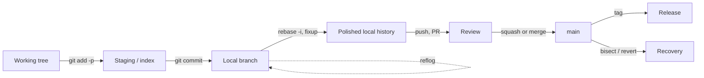

# Clean Commits & Version-Control Hygiene — Interview Questions

> 50+ questions across four tiers (Junior → Mid → Senior → Staff). Each answer is crisp; harder ones include **what the interviewer is really checking**. Use for self-review or interview prep. The companion theory lives in [junior.md](junior.md) and [professional.md](professional.md); the chapter overview is in [README.md](../README.md).

---

## Table of Contents

- [Junior (14)](#junior-14)
- [Mid (14)](#mid-14)
- [Senior (13)](#senior-13)
- [Staff (12)](#staff-12)
- [Rapid-Fire](#rapid-fire)
- [Summary](#summary)
- [Further Reading](#further-reading)
- [Related Topics](#related-topics)

The lifecycle a clean commit moves through:

---

## Junior (14)

### J1. What is an atomic commit?

Answer

A commit that contains exactly **one logical change** and nothing else. It builds, it passes tests on its own, and it can be described in a single sentence without the word "and." Renaming a variable, adding a feature, and reformatting a file are three commits, not one.

### J2. What does the 50/72 rule mean?

Answer

Subject line ≤ **50 characters**; body wrapped at **72 columns**, separated from the subject by one blank line. Fifty keeps the subject readable in `git log --oneline`, GitHub lists, and `git shortlog`. Seventy-two leaves room for the four-space indent `git log` adds without wrapping in an 80-column terminal.

### J3. Why imperative mood in the subject line ("Add", not "Added")?

Answer

A commit completes the sentence **"If applied, this commit will ___."** "Add login throttling" reads correctly; "Added login throttling" does not. Git's own generated messages ("Merge", "Revert") use the imperative, so your commits match the tooling.

### J4. "Why, not what" — what does that mean for a commit message?

Answer

The diff already shows *what* changed; the reader can see it. The message exists to record *why* — the motivation, the constraint, the bug it fixes, the rejected alternative. "Bump timeout to 30s" is what. "Bump timeout to 30s — payment gateway p99 is 22s under load, 10s was timing out legitimate charges" is why.

### J5. What is `.gitignore` for, and what belongs in it?

Answer

It tells Git which untracked paths to never stage. Put build artifacts (`dist/`, `target/`, `*.class`), dependencies (`node_modules/`), local config (`.env`, `.idea/`), OS cruft (`.DS_Store`), and secrets. It does **not** un-track files already committed — for that you need `git rm --cached`.

### J6. What's the difference between `git fetch` and `git pull`?

Answer

`fetch` downloads remote refs and objects but touches nothing in your working tree. `pull` is `fetch` followed by a `merge` (or `rebase` if configured) into your current branch. `fetch` is always safe; `pull` changes your working state.

### J7. What's the difference between `git reset` and `git revert`?

Answer

`revert` creates a **new** commit that undoes a previous one — history is preserved and it's safe on shared branches. `reset` **moves the branch pointer** backward, rewriting local history. Use `revert` for anything already pushed; `reset` only for local cleanup.

### J8. What are `--soft`, `--mixed`, and `--hard` on `git reset`?

Answer

All three move the branch pointer; they differ in what else they touch:
- `--soft`: move pointer only; staged changes and working tree kept (commits become staged).
- `--mixed` (default): move pointer, un-stage changes; working tree kept.
- `--hard`: move pointer, discard staged changes **and** working-tree changes. Destructive.

### J9. What is a merge conflict and how do you resolve one?

Answer

It happens when two branches change the same lines and Git can't auto-merge. Git inserts `<<<<<<<`, `=======`, `>>>>>>>` markers. You edit the file to the correct combined result, remove the markers, `git add` it, then continue the merge or rebase. The point is to produce *correct code*, not to mechanically keep one side.

### J10. Why should you never commit secrets?

Answer

Git history is permanent and distributed — once a key is committed and pushed, it lives in every clone forever. Deleting it in a later commit does **not** remove it from history. A leaked key must be treated as compromised: rotate it immediately, then purge the history.

### J11. What's wrong with the commit message "fix"?

Answer

It carries zero context. Six months later, "fix" tells a reader nothing about what was broken, why, or how. Multiply by a hundred commits and the history is useless for `git log`, `git blame`, and `bisect`. A message should name the problem and the reason for the change.

### J12. What's a branch, and why use feature branches?

Answer

A branch is a movable pointer to a commit. Feature branches isolate in-progress work so `main` stays releasable, let work be reviewed before integration, and let multiple people work in parallel without stepping on each other.

### J13. What does `git stash` do?

Answer

It shelves your uncommitted changes (staged and unstaged) onto a stack and reverts your working tree to `HEAD`, so you can switch context cleanly. `git stash pop` reapplies and drops the top entry. Useful for "I need to switch branches but I'm mid-change."

### J14. Should you commit commented-out code "just in case"?

Answer

No. Version control already remembers every deleted line forever — that *is* the "just in case." Commented-out code rots, confuses readers, and breaks searches. Delete it; if you ever need it, `git log -p` or `git blame` will retrieve it.

---

## Mid (14)

### M1. Rebase vs merge — what's the actual difference?

Answer

`merge` joins two branches with a **merge commit** that has two parents, preserving the true topology. `rebase` **replays** your commits on top of the target's tip, producing a linear history and **new commit SHAs** (the originals are abandoned). Merge preserves history as it happened; rebase rewrites it to look tidy.

### M2. State the golden rule of rebasing.

Answer

**Never rebase (or otherwise rewrite) commits that have been pushed to a shared branch and that others may have based work on.** Rebasing rewrites SHAs; collaborators who pulled the old commits now have a divergent history, and the next person to push triggers conflicts and lost work. Rewrite only local, unpushed, or strictly personal branches.

### M3. When would you choose merge over rebase, and vice versa?

Answer

- **Rebase** local feature branches before opening/updating a PR to get a clean, linear, reviewable history.
- **Merge** when integrating a completed branch into a shared branch where you want to preserve the fact that a set of commits belonged together, or whenever the branch is already shared.

> **What the interviewer is really checking:** that you don't treat this as a religious war. They want "rebase locally, merge to integrate, never rewrite shared history" — a policy, not a preference.

### M4. What does interactive rebase (`git rebase -i`) let you do?

Answer

Replays a range of commits while letting you `pick`, `reword` (edit message), `edit` (amend the snapshot), `squash` (combine, merge messages), `fixup` (combine, discard message), `drop`, and reorder them. It's the primary tool for polishing local history into atomic, well-described commits before review.

### M5. What are `--fixup` and `--autosquash`?

Answer

`git commit --fixup=<sha>` creates a commit titled `fixup! <subject>` targeting an earlier commit. `git rebase -i --autosquash` then automatically reorders that fixup next to its target and marks it `fixup`, so the correction folds into the original commit with no manual reordering. The everyday workflow for "I forgot something in commit three."

### M6. Squash-merge vs a true merge commit — trade-offs?

Answer

**Squash** collapses a whole PR into one commit on `main`: tidy, one-line-per-feature history, easy to revert as a unit — but loses the intermediate commits and their granularity. **Merge commit** keeps every commit and records the branch topology — richer history, but noisier and only useful if the branch's commits were already atomic. Many teams squash messy branches and merge clean ones.

### M7. How does `git bisect` work, and why does it depend on atomic commits?

Answer

`bisect` binary-searches history for the commit that introduced a bug: you mark a known-good and known-bad commit, and Git checks out the midpoint repeatedly (you mark each good/bad) until it pins the culprit in `log₂(n)` steps. It only works if **each commit builds and runs** — if commits are broken half-states or giant kitchen-sink blobs, the result is useless or untestable. Atomic commits make `bisect` precise.

### M8. What is `git cherry-pick` and when is it appropriate?

Answer

It applies the change introduced by a specific commit onto your current branch as a new commit. Legitimate uses: back-porting a hotfix to a release branch, pulling one fix out of an unfinished branch. Smell: cherry-picking routinely to move work between long-lived branches — that usually means your branching model is wrong, and it creates duplicate-but-different commits that confuse merges later.

### M9. What is the reflog and how does it save you?

Answer

`git reflog` records every movement of `HEAD` and branch tips locally — including commits "lost" by a bad `reset --hard`, `rebase`, or branch deletion. The commit objects aren't gone until garbage-collected (default ~30–90 days), so you can find the old SHA in the reflog and `git reset --hard <sha>` or `git branch recovered <sha>` to restore it. It's the undo button people don't know they have.

> **What the interviewer is really checking:** whether you'll panic and re-do lost work, or calmly recover it. Knowing reflog signals composure under a "I just destroyed my branch" incident.

### M10. What is Conventional Commits?

Answer

A message convention: `type(scope): subject`, e.g. `feat(auth): add refresh-token rotation`. Common types: `feat`, `fix`, `docs`, `refactor`, `test`, `chore`, `perf`, `build`, `ci`. A `!` or `BREAKING CHANGE:` footer marks breaking changes. It makes history machine-parseable for automated changelogs and **semantic-version bumps** (`feat` → minor, `fix` → patch, breaking → major).

### M11. You committed to the wrong branch. How do you fix it?

Answer

If unpushed: create/checkout the right branch from the current commit, then `git reset --hard <previous-sha>` (or `git reset --soft HEAD~1`) on the wrong branch to drop it. Concretely: `git branch feature; git reset --hard HEAD~1; git checkout feature`. Or `git cherry-pick` the commit onto the right branch and reset the wrong one. The reflog has your back if you mis-step.

### M12. How do you amend the most recent commit, and when must you not?

Answer

`git commit --amend` rewrites the last commit (message and/or staged content), producing a new SHA. Fine while the commit is local. **Don't amend a pushed, shared commit** — same golden-rule violation as rebase, because it rewrites history others may have.

### M13. What's a "kitchen-sink" commit and why is it harmful?

Answer

One commit mixing a feature, a refactor, and reformatting. It's unreviewable (reviewers can't separate the risky logic from the noise), un-revertable (reverting the feature also reverts the refactor), and poisons `bisect` and `blame`. Split with `git add -p` to stage hunks selectively.

### M14. How do you stage only part of a file?

Answer

`git add -p` (patch mode) walks each hunk and asks whether to stage it; `s` splits a hunk, `e` lets you edit it line-by-line. It's the core skill for producing atomic commits when one file accidentally accumulated two unrelated changes.

---

## Senior (13)

### S1. Walk through purging a secret that was committed and pushed.

Answer

1. **Rotate first.** The credential is compromised the moment it hit a remote; revoke/regenerate it before anything else. Purging history without rotating is theater.
2. **Rewrite history** to remove the blob, with `git filter-repo --path secrets.env --invert-paths` (preferred) or BFG Repo-Cleaner (`bfg --delete-files secrets.env`). `git filter-branch` is deprecated/slow.
3. **Force-push** all rewritten refs and tags; have collaborators **re-clone** (their old history still contains the secret).
4. **Invalidate caches** — GitHub etc. may keep the old object reachable via cached views/forks; contact support if needed and assume the secret is public.

> **What the interviewer is really checking:** that "rotate the credential" is your *first* word, not "rewrite history." The history is the lesser problem; the live key is the breach.

### S2. Trunk-based development vs GitFlow — compare them.

Answer

- **Trunk-based:** everyone integrates to `main` continuously via short-lived branches (hours to a day), guarded by feature flags and strong CI. Optimizes for continuous delivery and minimal merge pain. Fits teams with mature automation.
- **GitFlow:** long-lived `develop`, `release/*`, `hotfix/*`, and feature branches with prescribed merge paths. Optimizes for scheduled, versioned releases. Heavier, more merge overhead, branches drift.

Modern high-velocity teams trend toward trunk-based; GitFlow suits packaged software with multiple supported versions.

### S3. What problems do long-lived feature branches cause, and how do you avoid them?

Answer

They **drift** from `main`, so the eventual merge is a high-risk big-bang conflict resolution ("merge hell"); they hide work from CI and reviewers; and they delay integration feedback. Avoid with trunk-based development, feature flags to merge incomplete work safely, branch-by-abstraction for large refactors, and a hard cap on branch age.

### S4. How do you protect `main`?

Answer

Branch-protection rules: require PRs (no direct pushes), require passing status checks, require ≥1–2 approvals and review of new commits, require the branch be up to date or use a merge queue, forbid force-push and deletion, optionally require signed commits and linear history. CODEOWNERS can require domain-owner review for sensitive paths.

### S5. What is a merge queue and what problem does it solve?

Answer

It solves the **semantic merge conflict / "passed CI in isolation but breaks on main"** problem. PRs that each pass against an older `main` can still break together. A merge queue serializes merges, re-running CI against the actual prospective `main` (the queue's tip) before each merge, so `main` stays green. Examples: GitHub Merge Queue, Bors, Mergify, Zuul.

### S6. Is force-push ever acceptable?

Answer

Yes — on **your own** unshared branch (e.g., after rebasing your PR branch to address review). Always prefer `git push --force-with-lease`, which refuses to push if the remote moved since you last fetched, protecting against clobbering a teammate's pushed work. **Never** force-push `main` or any shared/protected branch.

> **What the interviewer is really checking:** that you don't answer a flat "never" (dogmatic) or "sure" (reckless). The senior answer is "on my own branch, with `--force-with-lease`, never on shared."

### S7. What are signed commits and why do they matter?

Answer

A GPG/SSH/S-MIME signature cryptographically binds a commit to an identity, proving authorship and integrity. Commit authorship is otherwise just a freely-set name/email — trivially spoofable. Signed commits (with `git config commit.gpgsign true`, surfaced as "Verified" on GitHub, enforceable via branch protection) defend the supply chain against impersonation and tampering.

### S8. How does Conventional Commits drive automated release tooling?

Answer

Tools like `semantic-release`, `release-please`, and `changesets` parse commit types since the last tag to compute the next SemVer (`fix` → patch, `feat` → minor, `BREAKING CHANGE` → major), generate the changelog, tag the release, and publish — all from commit messages. This makes message discipline a release-correctness requirement, not just aesthetics, and is usually enforced with a commit-lint hook.

### S9. How do you enforce commit hygiene mechanically?

Answer

Layer the checks so humans aren't the gate:
- **Local pre-commit hooks** (e.g., `pre-commit`, `lefthook`, Husky): lint, format, secret-scan (`gitleaks`, `detect-secrets`), reject WIP messages.
- **commit-msg hook** (`commitlint`): enforce Conventional Commits / 50-char subject.
- **CI checks**: re-run the same gates server-side (hooks are bypassable with `--no-verify`).
- **Branch protection**: make those CI checks required to merge.

Local hooks give fast feedback; server-side checks are the actual enforcement.

### S10. A teammate force-pushed a shared branch and your work is "gone." Recover it.

Answer

The commits aren't gone, just unreferenced. Find your old tip in `git reflog` (or `git fsck --lost-found`) and re-anchor it: `git branch rescue <old-sha>`, then merge/rebase your reflog tip onto the new remote history. Going forward, set up branch protection to forbid force-push and use `--force-with-lease` so this can't happen silently.

### S11. How should merge-commit messages and merge noise be handled?

Answer

Avoid the "Merge branch 'main' into feature" churn by **rebasing your branch onto `main`** instead of repeatedly merging `main` into it. When you do create a merge commit (integrating a PR), write a real message summarizing the change set, not the default. Prefer rebase-to-update + squash-or-merge-to-integrate so history reads as a sequence of meaningful changes, not a tangle of catch-up merges.

### S12. How do `git rerere` and `git worktree` help with version-control hygiene?

Answer

- **`rerere`** ("reuse recorded resolution") records how you resolved a conflict and replays it automatically next time the same conflict recurs — invaluable during long rebases or repeated merges of a long-lived branch.
- **`git worktree`** checks out multiple branches into separate directories from one repo, so you can hotfix `main` without stashing or clobbering your in-progress feature branch — cleaner than thrashing one working tree.

### S13. Why is `git blame` only as good as your commit discipline?

Answer

`blame` attributes each line to its last-touching commit. If history is full of kitchen-sink commits and "fix" messages, blame points to a giant unrelated change with no rationale — useless for archaeology. Atomic commits with "why" messages make blame a precise tool: every line traces to a single intent. (`git blame -w -C` ignores whitespace and tracks moved code to see past reformatting.)

---

## Staff (12)

### ST1. Design a version-control workflow for a 200-engineer monorepo shipping continuously.

Answer

Trunk-based on a single `main`; short-lived branches; **merge queue** mandatory to keep `main` green under high concurrency; CI sharded and affected-targets-only (Bazel/Nx) so checks stay fast; feature flags for incomplete work; CODEOWNERS routing reviews per directory; required signed commits; secret-scanning and commit-lint as required checks; squash-merge to keep `main` history one-commit-per-PR and revertable. Tag and release via Conventional-Commit-driven tooling per affected package.

> **What the interviewer is really checking:** can you reason about scale — merge-queue throughput, CI cost, review routing, flag discipline — rather than reciting `git` commands.

### ST2. The "squash everything" debate — should every PR be squashed to one commit?

Answer

No, not universally. Squash when the branch's intermediate commits are noise ("wip", "address review"). **Don't** squash a branch whose commits are already atomic and tell a story (e.g., "extract interface" then "swap implementation" then "delete old") — squashing destroys bisect granularity and the reasoning trail. The right rule: *one logical change per commit on `main`*. Sometimes that's one commit per PR; sometimes a PR is several logical changes that each deserve to survive.

> **What the interviewer is really checking:** that you optimize for the *future reader and bisector*, not for a uniform-looking log. "Always squash" and "never squash" are both wrong.

### ST3. "Rebase or merge?" — give the staff-level answer.

Answer

It's a false binary; the answer is a policy. **Rebase to update** a branch you own onto the latest `main` (linear, conflict-resolved early, with `--force-with-lease`). **Merge or squash to integrate** the finished branch into `main`. **Never rewrite shared history.** The deciding question is always "has anyone else based work on these commits?" — if yes, only additive operations (merge, revert) are allowed.

### ST4. What is "what makes a commit atomic" really testing?

<parameter name="">undefined