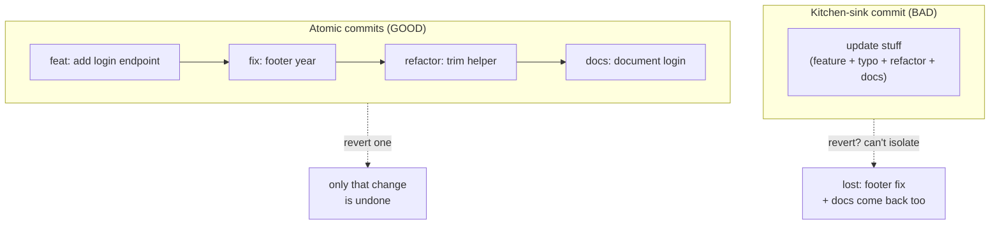
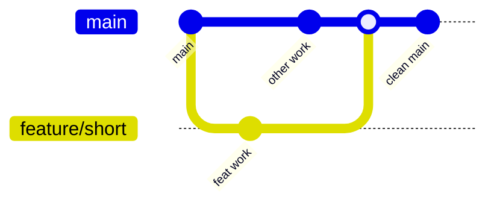

# Clean Commits & Version-Control Hygiene — Junior Level

> **Level:** Junior — "What's the rule? Show me a clean example."
> You already know `git add`, `git commit`, and `git push`. This file is about doing them *well*: making each commit a clean, self-contained story so that `git log` reads like documentation and `git blame` tells the truth.

---

## Table of Contents

1. [Why commit hygiene matters](#why-commit-hygiene-matters)
2. [Real-world analogy](#real-world-analogy)
3. [Rule 1 — One logical change per commit (atomic commits)](#rule-1--one-logical-change-per-commit-atomic-commits)
4. [Rule 2 — Write intent-revealing messages (the 50/72 rule)](#rule-2--write-intent-revealing-messages-the-5072-rule)
5. [Rule 3 — Say WHY, not WHAT](#rule-3--say-why-not-what)
6. [Rule 4 — Use Conventional Commits](#rule-4--use-conventional-commits)
7. [Rule 5 — Self-review your diff before committing](#rule-5--self-review-your-diff-before-committing)
8. [Rule 6 — Keep history readable and bisectable](#rule-6--keep-history-readable-and-bisectable)
9. [Rule 7 — Never commit secrets, generated files, or large binaries](#rule-7--never-commit-secrets-generated-files-or-large-binaries)
10. [Rule 8 — Short-lived branches, never rewrite shared history](#rule-8--short-lived-branches-never-rewrite-shared-history)
11. [Rule 9 — Trust version control instead of commenting out code](#rule-9--trust-version-control-instead-of-commenting-out-code)
12. [What a clean PR looks like](#what-a-clean-pr-looks-like)
13. [Common Mistakes](#common-mistakes)
14. [Test Yourself](#test-yourself)
15. [Cheat Sheet](#cheat-sheet)
16. [Summary](#summary)
17. [Further Reading](#further-reading)
18. [Related Topics](#related-topics)

---

## Why commit hygiene matters

Clean code is not only the code in the working tree — it is also the **history** that produced it. Every commit you write is read far more often than it is written:

- A teammate runs `git log` to understand how a feature came to be.
- Someone runs `git blame` on a confusing line and lands on *your* commit message — that message is now the only explanation they get.
- A release breaks, and someone runs `git bisect` to find the commit that introduced the bug. If your commits are atomic, they find it in minutes. If you bundled five unrelated changes into one commit, they find a 600-line haystack.

The commit message and the commit boundary are **the smallest unit of documentation you write**, and they outlive almost everything else. A variable gets renamed, a function gets deleted — but the commit that did it stays in history forever.

> **Key idea:** A commit is not a "save button." It is a sentence in the story of your codebase. Make each sentence true, complete, and about one thing.

---

## Real-world analogy

### The lab notebook

A scientist keeps a lab notebook. Each entry records **one experiment**: what they did, and crucially *why* they did it ("switched to buffer B because buffer A precipitated at 4°C"). Entries are dated, ordered, and never erased — if an experiment was wrong, they write a new entry correcting it; they do not scribble out the old page.

Months later, a colleague reproducing the work reads the notebook top to bottom and understands the entire reasoning chain. The notebook is trustworthy because each entry is **atomic** (one experiment), **explained** (why, not just what), and **append-only** (history is never falsified).

Your git history is a lab notebook for your codebase. The same three properties apply:

| Lab notebook | Git history |
|---|---|
| One experiment per entry | One logical change per commit |
| Records *why*, not just *what* | Commit body explains the reason |
| Pages are never erased | Don't rewrite shared history |

### The bad alternative

Now imagine a notebook where one entry reads: *"Did some stuff. Fixed it. Also changed the labels and reorganized the shelf and ran the centrifuge."* That entry is useless. Nobody can reproduce it, nobody can trust it, and if one part was wrong, you cannot tell which. That is the "WIP — fixed stuff" commit.

---

## Rule 1 — One logical change per commit (atomic commits)

**The rule:** each commit should contain exactly one logical change, and the codebase should still build and pass tests at that commit.

An **atomic commit** is one you could describe in a single sentence without using the word "and." If you need "and" — "add login endpoint **and** fix the typo in the footer **and** reformat the utils file" — that is three commits.

### BAD — a kitchen-sink commit

```text
$ git log --stat
commit a1b2c3d
    update stuff

 src/auth/login.go          | 87 +++++++++++++++++
 src/auth/login_test.go     | 64 +++++++++++++
 src/ui/footer.html         |  2 +-      ← unrelated typo fix
 src/utils/strings.go       | 41 +++++----   ← unrelated reformat
 README.md                  | 18 ++++--      ← unrelated doc tweak
 package-lock.json          | 312 +++++++++   ← accidental dependency churn
```

One commit, five unrelated changes. If the login feature has a bug and someone wants to revert it, they cannot — reverting also undoes the footer fix and the docs. If someone bisects to this commit, they have 500+ lines to inspect.

### GOOD — the same work split into atomic commits

```text
$ git log --oneline
9f3a1c2  feat(auth): add email/password login endpoint
4e8b7d0  fix(ui): correct copyright year in footer
2c5f9a1  refactor(utils): simplify string trimming helper
0a1d3e8  docs: document the login endpoint in README
```

Now each commit is revertable, reviewable, and bisectable on its own. The login feature is one commit; reverting it touches nothing else.

### How to split a messy working tree

When you have already made several changes and want to commit them separately, stage **selectively** instead of `git add .`:

```bash
# Stage only specific files
git add src/auth/login.go src/auth/login_test.go
git commit -m "feat(auth): add email/password login endpoint"

# Stage the footer fix on its own
git add src/ui/footer.html
git commit -m "fix(ui): correct copyright year in footer"

# Stage individual *hunks* within a file interactively
git add -p src/utils/strings.go   # choose y/n per chunk
git commit -m "refactor(utils): simplify string trimming helper"
```

`git add -p` (patch mode) lets you stage *parts* of a file — essential when one file accidentally contains two unrelated changes.

> **Junior tip:** Commit *more often than feels necessary*, in small pieces. It is trivial to combine small commits later; splitting a giant commit after the fact is painful.

### Atomic vs kitchen-sink, visualized



---

## Rule 2 — Write intent-revealing messages (the 50/72 rule)

**The rule:** the commit subject is a short, imperative summary (≤ 50 characters); leave a blank line; then a body wrapped at 72 characters that explains the change.

This is the classic **50/72 rule**, and it shapes the message structure:

```text
Capitalized, imperative subject — 50 chars or fewer
                                  ← one blank line (required)
The body explains the reasoning. Wrap it at 72 columns so it
reads cleanly in `git log` and in terminals. Use the body to
answer the question a future reader will ask: "why was this
change made, and what alternatives were considered?"

- Bullet points are fine in the body.
- Reference issues at the end: Closes #482.
```

### Imperative mood

Write the subject as a command — as if completing the sentence *"If applied, this commit will…"*:

| BAD (past / noun) | GOOD (imperative) |
|---|---|
| `Added retry logic` | `Add retry logic to the payment client` |
| `Fixes the null check` | `Fix null check in `parseUser`` |
| `changing the config` | `Move timeout config to environment variable` |
| `more tests` | `Add tests for the expired-token branch` |

The imperative is the convention git itself uses ("Merge branch…", "Revert…"), so your messages read consistently with the tooling.

### Why 50 and 72?

- **50 chars** keeps the subject readable in `git log --oneline`, GitHub's PR list, and `git shortlog` without truncation.
- **72 chars** for the body leaves room for git's 4-space indent in `git log` (which is 80-column-friendly) and avoids ugly wrapping in terminals.

### BAD vs GOOD subjects

```text
# BAD — useless, no context, will haunt blame forever
wip
fix
stuff
asdf
final
final2
update
.
```

```text
# GOOD — specific, imperative, scoped
Fix race condition in connection pool shutdown
Add pagination to the /orders endpoint
Remove dead feature flag `legacy_checkout`
Bump pq driver to 1.10.9 to fix TLS handshake hang
```

> **Configure your editor.** Run `git config --global core.editor "code --wait"` (or `nvim`, etc.) so you write messages in a real editor with a blank-line body — not crammed into a one-line `-m`.

---

## Rule 3 — Say WHY, not WHAT

**The rule:** the diff already shows *what* changed. The message — especially the body — must explain *why*.

A reviewer can read the diff. What they cannot read is your reasoning: why this approach, what was broken before, what constraint forced this. That context lives only in your head until you write it down.

### BAD — restating the diff

```text
Change timeout from 30 to 60

Changed the timeout value from 30 to 60.
```

This is worthless. The reader can see the number changed; the message adds nothing. It answers *what* (which the diff already shows) and omits *why*.

### GOOD — explaining the reason

```text
Increase HTTP client timeout to 60s

The payment gateway's p99 latency spiked to ~45s during the
Black Friday load test. The previous 30s timeout caused ~3% of
checkouts to fail with spurious timeouts even though the gateway
eventually responded successfully.

60s covers observed p99 with headroom. Tracked in PAY-1187;
revisit once the gateway team ships their latency fix.
```

Now a future engineer who finds this line knows *why* it is 60 and not 30, what would justify changing it back, and where to read more. That is the message doing its job.

### The litmus test

Before committing, ask: **"If a teammate reads this message six months from now with no other context, will they understand why I did this?"** If the answer relies on knowledge that is not in the message or the diff, put it in the body.

> Trivial changes (`Fix typo in README`) need no body — the subject says it all. Reserve bodies for changes where the *why* is non-obvious.

---

## Rule 4 — Use Conventional Commits

**The rule:** prefix the subject with a type and optional scope: `type(scope): description`.

[Conventional Commits](https://www.conventionalcommits.org/) is a widely adopted format that makes history machine-readable (for changelogs and automated version bumps) and human-scannable.

```text
<type>(<optional scope>): <description>

[optional body]

[optional footer(s)]
```

### Common types

| Type | Use for |
|---|---|
| `feat` | A new feature |
| `fix` | A bug fix |
| `docs` | Documentation only |
| `refactor` | Code change that neither fixes a bug nor adds a feature |
| `test` | Adding or fixing tests |
| `chore` | Build process, tooling, dependency bumps |
| `perf` | A performance improvement |
| `style` | Formatting only (whitespace, semicolons) — no logic change |

### Examples

```text
feat(auth): support login via one-time email link
fix(orders): prevent double-charge on retried submissions
docs: add architecture diagram to README
refactor(parser): extract token scanner into its own type
test(cart): cover the empty-cart checkout path
chore(deps): bump go from 1.21 to 1.22
perf(search): cache compiled regex across requests
```

### Breaking changes

Mark an API-breaking change with `!` after the type/scope, and explain it in a `BREAKING CHANGE:` footer:

```text
feat(api)!: remove deprecated v1 /users endpoint

BREAKING CHANGE: clients must migrate to /v2/users. The v1
endpoint has returned 410 Gone since the 3.0 release.
```

The Conventional Commits prefix pairs perfectly with **Rule 1 (atomic)**: if you cannot pick a single type for your commit, that is a sign you bundled multiple logical changes.

---

## Rule 5 — Self-review your diff before committing

**The rule:** read your own diff before every commit. You are the first reviewer.

You will be amazed how often you catch a stray `console.log`, a leftover `TODO`, a debug `time.Sleep`, or an accidental file before anyone else sees it.

```bash
git status        # what's staged vs unstaged vs untracked?
git diff          # review unstaged changes
git diff --staged # review exactly what will be committed
```

`git diff --staged` (alias: `--cached`) is the one that matters: it shows the *exact* snapshot you are about to commit. Read it line by line and ask:

- Is there any debug output, commented-out code, or `// TODO: remove this`?
- Did a secret, API key, or local config file sneak in?
- Is everything here part of *one* logical change? (Rule 1)
- Did I stage a generated file or a huge binary by accident? (Rule 7)

### Example: catching a mistake before committing

```bash
$ git diff --staged
diff --git a/src/payments/client.go b/src/payments/client.go
+func Charge(amount Money) error {
+    fmt.Println("DEBUG amount:", amount)   // ← caught it! remove before commit
+    return gateway.Submit(amount)
+}
diff --git a/config/secrets.env b/config/secrets.env
+STRIPE_SECRET_KEY=sk_live_51H...          // ← never commit this!
```

Both problems caught *before* the commit. Unstage the secret file and delete the debug line:

```bash
git restore --staged config/secrets.env   # unstage the secret
# then edit client.go to remove the Println, re-stage, and commit
```

> **Habit to build:** make `git diff --staged` the muscle-memory step between `git add` and `git commit`. It is the cheapest code review you will ever get.

---

## Rule 6 — Keep history readable and bisectable

**The rule:** every commit on the main line should build and pass tests, so `git bisect` can find a bug fast.

`git bisect` is a binary search over history: you tell git a "good" old commit and a "bad" recent commit, and it checks out the midpoint so you can test it. In ~10 steps it pinpoints which of 1,000 commits introduced a bug.

```bash
git bisect start
git bisect bad                 # current HEAD is broken
git bisect good v1.4.0         # this old release worked
# git checks out the midpoint; you build & test it, then:
git bisect good                # or: git bisect bad
# ... repeat ~log2(N) times ...
# git: "abc1234 is the first bad commit"
git bisect reset
```

This only works if **each commit builds and passes tests**. If half your commits are broken mid-feature ("WIP, doesn't compile"), bisect lands on a broken commit and you cannot tell whether *your* bug or the WIP breakage is the failure.

### Readable history reads like a story

```text
$ git log --oneline   # GOOD — each line is a coherent step
3f9a2c1  feat(cart): add quantity selector to line items
8b1d4e7  test(cart): cover quantity-zero removes the item
1c7f0a3  refactor(cart): extract price recalculation
9e2b8d5  fix(cart): round subtotal to cents before tax
```

Versus history that tells you nothing:

```text
$ git log --oneline   # BAD
0fa1b2c  wip
9c3d4e5  more wip
2a1f6b7  fix
8e9d0a1  fix the fix
4b2c3d8  actually fix
1f0e9d2  ok now it works
```

> **Junior tip:** It is fine to make messy "WIP" commits *while you work on your own local branch*. Before you open a PR, tidy them into clean atomic commits. You will learn the tools for that (`rebase -i`, `commit --amend`) at the middle level — for now, just know that the *published* history is what must be clean.

---

## Rule 7 — Never commit secrets, generated files, or large binaries

**The rule:** the repository tracks **source**, not secrets, build output, or large binaries. Use `.gitignore` to keep them out.

### Why each is harmful

- **Secrets** (API keys, passwords, tokens): once committed and pushed, they are in history *forever* — even if you delete them in a later commit, `git log -p` still shows them. A leaked key must be **rotated**, not just deleted. Treat any committed secret as compromised.
- **Generated files** (`node_modules/`, `dist/`, `build/`, compiled binaries, `*.pyc`): they bloat the repo, cause constant merge conflicts, and can always be regenerated from source. Tracking them is noise.
- **Large binaries** (videos, datasets, `.zip` archives): git stores the full history of every binary version, so a 50 MB file edited 20 times becomes a 1 GB repo that clones slowly forever. Use [Git LFS](https://git-lfs.com/) or external storage instead.

### A clean `.gitignore`

```gitignore
# Secrets & local config
.env
.env.local
*.pem
secrets.yaml

# Dependencies (regenerated from manifests)
node_modules/
vendor/

# Build output
dist/
build/
*.exe
*.out

# Language artifacts
__pycache__/
*.pyc
*.class
target/

# OS / editor cruft
.DS_Store
.idea/
.vscode/
*.swp

# Logs & local databases
*.log
*.sqlite3
```

> Commit a `.gitignore` to the repo root **before** your first real commit. Pre-made templates for every language live at [github.com/github/gitignore](https://github.com/github/gitignore).

### If you already committed something you shouldn't have

```bash
# Stop tracking a file but keep it on disk (common for an accidentally
# committed config that should have been ignored from the start):
git rm --cached config/secrets.env
echo "config/secrets.env" >> .gitignore
git commit -m "chore: stop tracking local secrets file"
```

This removes it from *future* commits, but it is **still in history**. If it was a real secret, you must **rotate the credential** and (with help) scrub history — deletion alone is not enough.

---

## Rule 8 — Short-lived branches, never rewrite shared history

**The rule:** branches should live days, not weeks; and once you have pushed a branch others may have pulled, do not rewrite its history.

### Short-lived branches

A feature branch that lives for three weeks drifts far from `main`. Every day it diverges, the eventual merge gets more painful, and conflicts pile up. The cure is to keep branches **small and short-lived**: one focused change, merged within a day or two.



Long-lived branches force you to repeatedly merge `main` back in, producing **merge noise** — a log full of `Merge branch 'main' into feature` commits that drown out the real work. Small branches merged quickly avoid this entirely.

### Never rewrite *shared* history

Commands like `git rebase`, `git commit --amend`, and `git push --force` *rewrite* commits — they replace commits with new ones that have different IDs. That is fine on a **private** branch only you have. It is dangerous on a **shared** branch.

```bash
# DANGEROUS on a shared branch — others have based work on these commits
git push --force origin main          # ← rewrites history under collaborators

# If you must force-push your OWN feature branch after a rebase,
# use the safe variant that refuses to clobber others' new work:
git push --force-with-lease origin feature/my-branch
```

If you force-push a branch someone else has pulled, their next `git pull` produces a tangled mess of duplicated and conflicting commits. **Golden rule:** *rewrite freely before you share; never rewrite after.*

```text
SAFE to rewrite          │  NEVER rewrite
─────────────────────────┼───────────────────────────────
local-only commits       │  main / master / develop
your unpushed branch     │  any branch teammates pulled
                         │  released tags
```

To *undo* a commit that is already public, don't rewrite — add a **new** commit that reverses it:

```bash
git revert abc1234   # creates a new commit undoing abc1234, history preserved
```

---

## Rule 9 — Trust version control instead of commenting out code

**The rule:** delete dead code. Git already remembers it.

The whole point of version control is that nothing is ever truly lost. So when you replace or remove code, **delete it** — don't comment it out "just in case."

### BAD — commented-out code committed "just in case"

```python
def total_price(items):
    # old logic, keeping in case we need it
    # total = 0
    # for item in items:
    #     total += item.price
    # return total

    return sum(item.price for item in items)
```

That dead block now rots forever: it confuses readers, breaks search results, never gets updated when the real code changes, and silently lies. Nobody dares delete it because nobody remembers why it is there.

### GOOD — just delete it

```python
def total_price(items):
    return sum(item.price for item in items)
```

If you ever need the old version, it is one command away:

```bash
git log -p -- src/pricing.py   # see every past version of this file
git show HEAD~5:src/pricing.py # view the file as it was 5 commits ago
```

> **The principle:** commented-out code is a comment that says *"I don't trust git."* But git is trustworthy. Delete with confidence; history has your back.

---

## What a clean PR looks like

A pull request is the unit your reviewer actually sees. A clean one:

1. **Is small and focused** — one feature or fix, ideally under ~400 lines of diff. Reviewers do a genuine review of 50 lines and rubber-stamp 1,500.
2. **Has atomic commits** — each commit is one logical step (Rule 1), so the reviewer can read commit-by-commit.
3. **Has a descriptive title and body** — the title follows the same intent-revealing rule as a commit subject; the body explains *why* and links the issue.
4. **Contains no noise** — no generated files, no formatting-only churn mixed with logic, no debug code, no merge-noise commits.

### A clean PR description

```markdown
## What
Add pagination to the `GET /orders` endpoint.

## Why
The endpoint returns the customer's entire order history in one
response. For high-volume accounts this exceeds 4 MB and times out.

## How
- Add `limit` and `cursor` query params (default limit 50, max 200).
- Return a `next_cursor` in the response envelope.
- Index `orders(customer_id, created_at)` to back the cursor scan.

## Testing
- Unit tests for cursor encoding/decoding.
- Integration test paginating a 10k-order account.

Closes #482.
```

> Keep formatting-only changes in their **own** PR (or at least their own commit). A PR that mixes a one-line logic fix with a 2,000-line reformat is unreviewable — the real change hides in the diff noise.

---

## Common Mistakes

| # | Mistake | Why it hurts | Fix |
|---|---|---|---|
| 1 | `git commit -m "wip"` / `"fix"` / `"stuff"` | No context; useless in `blame`/`log` | Write an imperative, specific subject (Rule 2) |
| 2 | Kitchen-sink commit (feature + format + refactor) | Unrevertable, unreviewable, unbisectable | Split with `git add -p` (Rule 1) |
| 3 | Message restates the diff | Adds no information beyond the diff | Explain *why* in the body (Rule 3) |
| 4 | `git add .` without looking | Stages secrets, debug code, junk | Run `git diff --staged` first (Rule 5) |
| 5 | Committing `.env` / API keys | Secret is in history forever; must rotate | `.gitignore` + rotate the key (Rule 7) |
| 6 | Committing `node_modules/`, `dist/` | Bloat + endless merge conflicts | Add to `.gitignore` (Rule 7) |
| 7 | Three-week feature branch | Painful merge, constant drift | Keep branches short-lived (Rule 8) |
| 8 | `git push --force` on `main` | Destroys teammates' history | `git revert`; use `--force-with-lease` on own branch only (Rule 8) |
| 9 | Commenting out old code | Dead code rots; git already remembers it | Delete it (Rule 9) |
| 10 | Repeated `Merge main into feature` commits | Merge noise drowns real history | Short branches; rebase your *private* branch |

---

## Test Yourself

**1. You have edited five files: a new feature (2 files), an unrelated typo fix, and a reformatted util file. How many commits, and how do you create them?**

<details><summary>Answer</summary>

At least **three** commits — one per logical change:
- `feat(...): <the feature>` (the 2 feature files),
- `fix(...): correct typo in ...`,
- `style(...): reformat util` (or `refactor`).

Stage selectively rather than `git add .`:
```bash
git add feature_a.go feature_b.go && git commit -m "feat: ..."
git add docs.md && git commit -m "fix: correct typo in docs"
git add util.go && git commit -m "style: reformat util"
```
If a single file holds two unrelated changes, split it with `git add -p`.
</details>

**2. Which of these subjects follow the rule, and why? (a) `Fixed login bug` (b) `Fix null deref in token refresh` (c) `updates` (d) `feat(cart): add quantity selector`**

<details><summary>Answer</summary>

- (a) **Weak** — past tense, not imperative, and vague ("which bug?"). Better: `Fix login crash on empty password`.
- (b) **Good** — imperative, specific, ≤ 50 chars.
- (c) **Bad** — zero information, the classic "stuff" anti-pattern.
- (d) **Good** — Conventional Commits format, imperative, scoped, specific.
</details>

**3. Your commit message body says "Changed retryCount from 3 to 5." What rule does this break, and what should it say?**

<details><summary>Answer</summary>

It breaks **Rule 3 — say WHY, not WHAT.** The diff already shows the number changed. The body should explain the reason: e.g. *"The upstream API returns 503 under brief load spikes; 3 retries left ~1% of requests failing. 5 retries (with backoff) covers the observed spike window. See INFRA-204."*
</details>

**4. You committed `config/secrets.env` containing a live API key and pushed it. Deleting it in a new commit — is that enough?**

<details><summary>Answer</summary>

**No.** The secret is still visible in history (`git log -p` shows it), and once pushed it must be considered compromised. You must:
1. **Rotate the credential** (revoke the old key, issue a new one) — this is the critical step.
2. Add the file to `.gitignore` and `git rm --cached` it going forward.
3. With team help, scrub it from history (e.g. `git filter-repo`) and coordinate the force-push.

Treat any pushed secret as leaked, regardless of how fast you delete it.
</details>

**5. A teammate force-pushed `main` to "clean up history." What likely broke, and what should they have done instead?**

<details><summary>Answer</summary>

Rewriting **shared** history breaks every teammate who had pulled `main`: their next `git pull` produces duplicated/conflicting commits because the old commit IDs were replaced. Instead they should:
- Never rewrite shared branches; to undo a public commit, use `git revert` (a new, additive commit).
- Do cleanup only on **private, unpushed** branches.
- If rewriting their *own* feature branch, use `git push --force-with-lease`, never plain `--force`.
</details>

**6. Why does `git bisect` depend on atomic, building commits?**

<details><summary>Answer</summary>

`git bisect` binary-searches history, checking out commits for you to test. If some commits don't build (mid-feature "WIP" commits), bisect lands on a broken commit and you can't tell whether your bug or the WIP breakage caused the failure — the search becomes useless. When every commit builds and passes tests, bisect pinpoints the offending commit in ~log₂(N) steps.
</details>

**7. Is committing commented-out code "just in case" ever justified?**

<details><summary>Answer</summary>

No. Version control already preserves every past version — `git log -p` and `git show <commit>:<file>` recover it instantly. Commented-out code rots, confuses readers, pollutes search, and never gets maintained. Delete it; trust git.
</details>

---

## Cheat Sheet

**The commit message template (50/72):**
```text
type(scope): imperative subject, ≤ 50 chars
                                      ← blank line
Body wrapped at 72 cols explaining WHY this change was made,
what was wrong before, and any context the diff can't show.

Closes #123.
```

**Conventional Commit types:** `feat` · `fix` · `docs` · `refactor` · `test` · `chore` · `perf` · `style`

**Before every commit:**
```bash
git status            # what's staged / unstaged / untracked
git diff --staged     # READ the exact snapshot you're committing
```

**Stage selectively (for atomic commits):**
```bash
git add <file>        # specific files only
git add -p            # specific hunks within a file
```

**Undo & rewrite — safely:**
```bash
git revert <sha>                 # undo a PUBLIC commit (additive, safe)
git commit --amend               # fix the last LOCAL commit only
git push --force-with-lease      # for your OWN branch only; never plain --force on shared
```

**The rules at a glance:**

| Do | Don't |
|---|---|
| One logical change per commit | Kitchen-sink commits |
| Imperative subject ≤ 50 chars | `wip` / `fix` / `stuff` |
| Explain WHY in the body | Restate the diff |
| `git diff --staged` before committing | `git add .` blindly |
| `.gitignore` secrets & build output | Commit `.env`, `node_modules/`, binaries |
| Short-lived branches | Three-week branches; merge noise |
| `git revert` public mistakes | Force-push shared branches |
| Delete dead code | Comment it out "just in case" |

---

## Summary

A commit is the smallest unit of documentation you write, and it outlives the code itself. Clean version-control hygiene comes down to a handful of habits:

- **Atomic commits** — one logical change each, building and testable, so history is revertable and bisectable.
- **Intent-revealing messages** — imperative subject ≤ 50 chars, a 72-wrapped body that explains **why**, ideally in Conventional Commits format.
- **Self-review** — read `git diff --staged` before every commit; you are the first reviewer.
- **Protect the tree** — keep secrets, generated files, and large binaries out with `.gitignore`; a leaked secret must be rotated, not just deleted.
- **Respect shared history** — short-lived branches, `git revert` (not force-push) to undo public commits, and delete dead code instead of commenting it out.

Do these consistently and your `git log` becomes a clean, trustworthy record — a lab notebook future engineers (including you) will thank you for.

---

## Further Reading

- [Conventional Commits specification](https://www.conventionalcommits.org/) — the `type(scope): description` standard.
- [How to Write a Git Commit Message](https://cbea.ms/git-commit/) — Chris Beams' canonical essay on the 50/72 rule and imperative mood.
- [Pro Git book](https://git-scm.com/book/en/v2) — free, authoritative; see "Distributed Git" and "Git Tools" for bisect and history.
- [github/gitignore](https://github.com/github/gitignore) — ready-made `.gitignore` templates per language.
- [Git LFS](https://git-lfs.com/) — the right way to version large binaries.

---

## Related Topics

- [middle.md](middle.md) — interactive rebase, squashing, fixup commits, and tidying a branch before a PR.
- [senior.md](senior.md) — branching strategies, history-rewriting policy, and team-scale version-control conventions.
- [Chapter README](../README.md) — the positive rules for clean commits and version control.
- [Code Reviews](../17-code-reviews/README.md) — the etiquette of reviewing the history this chapter teaches you to produce.
- [Formatting](../04-formatting/README.md) — why formatting-only changes belong in their own commit, away from logic.
- [Comments](../03-comments/README.md) — why commented-out code is a comment that doesn't trust git.
- [Refactoring](../../refactoring/README.md) — keep refactoring commits separate from behavior-changing ones.
- [Anti-Patterns](../../anti-patterns/README.md) — the broader catalog of habits that erode a codebase.
