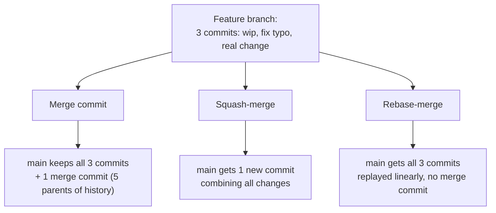
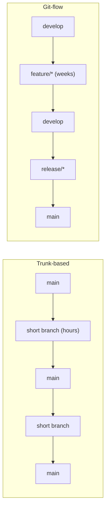
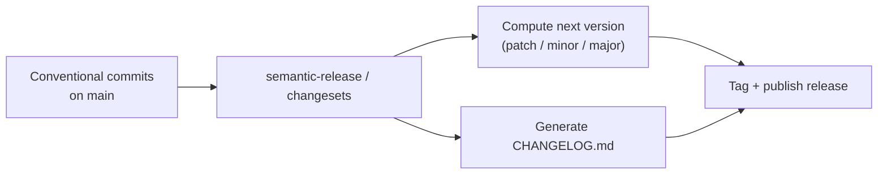

# Clean Commits & Version-Control Hygiene — Middle Level

> Focus: "Why?" and "When does it bend?" — the trade-offs behind rebase vs. merge, squash policies, branch lifetimes, and the conventions that turn history into automation.

---

## Table of Contents

1. [Rebase vs. merge: what each does, and the golden rule](#rebase-vs-merge-what-each-does-and-the-golden-rule)
2. [Squash-merge vs. merge-commit vs. rebase-merge](#squash-merge-vs-merge-commit-vs-rebase-merge)
3. [Cleaning a messy local branch before pushing](#cleaning-a-messy-local-branch-before-pushing)
4. [Atomic commits: what they buy you](#atomic-commits-what-they-buy-you)
5. [Trunk-based development vs. git-flow](#trunk-based-development-vs-git-flow)
6. [When WIP commits are fine — and when they aren't](#when-wip-commits-are-fine--and-when-they-arent)
7. [`.gitignore` vs. `.git/info/exclude` vs. global ignore](#gitignore-vs-gitinfoexclude-vs-global-ignore)
8. [Conventional Commits: history as machine-readable input](#conventional-commits-history-as-machine-readable-input)
9. [Common Mistakes](#common-mistakes)
10. [Test Yourself](#test-yourself)
11. [Cheat Sheet](#cheat-sheet)
12. [Summary](#summary)
13. [Further Reading](#further-reading)
14. [Related Topics](#related-topics)

---

## Rebase vs. merge: what each does, and the golden rule

Both integrate one branch into another. They differ in what they do to *the shape of history*.

**Merge** creates a new commit with two parents. It records, faithfully, that two lines of work existed in parallel and were joined at a point in time. Nothing moves; existing commits keep their hashes.

```
A---B---C  main
     \
      D---E  feature

git checkout main && git merge feature

A---B---C-------M  main
     \         /
      D---E---'
```

**Rebase** replays your commits on top of a new base. It rewrites them — `D` and `E` become brand-new commits `D'` and `E'` with new parents and new hashes. The parallel history disappears; it looks as if you started from the latest `main`.

```
A---B---C  main
     \
      D---E  feature

git checkout feature && git rebase main

A---B---C  main
         \
          D'---E'  feature   (linear, no merge commit)
```

### When to rebase a feature branch

Rebase your *own, unpushed* feature branch onto `main` to:

- Keep a linear, readable history before opening a PR.
- Pull in upstream changes without sprinkling "merge main into branch" commits through your work.
- Resolve conflicts incrementally, commit by commit, instead of all at once in a merge.

```bash
git checkout feature
git fetch origin
git rebase origin/main      # replay feature on top of latest main
# resolve conflicts per commit, then:
git rebase --continue
```

### When merge is the right call

- **Integrating a completed feature into `main`** — a merge commit is an honest record that "this body of work landed here." Many teams *want* that marker.
- **The branch is shared.** If a teammate has based work on your branch, rebasing yanks the ground out from under them.
- **You value an audit trail** of when and how integration happened (regulated environments, release branches).

### The golden rule of rebase

> **Never rebase commits that exist outside your local repository.** Once you've pushed a branch that others may have pulled, rewriting it forces everyone downstream into a painful recovery. Rebase is for *private* history; merge is for *public* history.

The mechanical reason: rebase changes commit hashes. A collaborator who pulled `D` and `E` now has commits your rewritten branch no longer contains. Their next pull tries to merge the old and new lines, producing duplicated commits and conflicts that look like sorcery.

---

## Squash-merge vs. merge-commit vs. rebase-merge

When a PR lands, the platform (GitHub/GitLab) offers three strategies. Each produces a different `main` history.



| Strategy | What lands on `main` | History shape | Best when |
|---|---|---|---|
| **Merge commit** | Every branch commit + a merge commit | Branchy, full detail | You want the complete development record; long-lived branches |
| **Squash-merge** | One commit per PR | Flat, one-PR-one-commit | Messy local history; PR is the atomic unit; easy `revert` |
| **Rebase-merge** | Every branch commit, replayed | Flat but multi-commit per PR | Branch commits are *already* clean and atomic |

### The team-policy trade-offs

- **Squash-merge** gives you a `main` where each commit maps to exactly one reviewed PR. This makes `git revert <pr>` trivially undo a whole feature, and `git log --oneline` reads like a changelog. The cost: intra-PR granularity is lost — `git bisect` can only narrow down to the PR, not the individual commit, and a 2,000-line squashed commit is a poor bisect target.
- **Merge-commit** preserves everything, including the "fix typo" and "address review" commits. Honest, but `main` fills with noise and `git log` is harder to scan. First-parent traversal (`git log --first-parent`) mitigates this by showing only the merge commits.
- **Rebase-merge** gives linear history *and* per-commit granularity — but only pays off if the author curated their commits first (see next section). Rebase-merging a sloppy branch just spreads the mess across `main`.

> **The honest decision:** Squash-merge if your team treats the PR as the unit of change and doesn't curate intra-PR commits. Rebase-merge if your team *does* curate commits and wants fine-grained `bisect`. Merge-commit if you have a reason to preserve the exact development timeline.

---

## Cleaning a messy local branch before pushing

Your local branch is a scratchpad: `wip`, `oops`, `fix the fix`, `actually fix it`. That's fine *locally*. Before it becomes public, curate it with **interactive rebase**.

```bash
git rebase -i origin/main
```

This opens an editor listing your commits with a command per line:

```
pick   a1b2c3  Add user export endpoint
squash d4e5f6  oops forgot import
reword 7g8h9i  fix validation
fixup  j0k1l2  address review comment
drop   m3n4o5  debug logging (delete this entirely)
```

- **`pick`** — keep as-is.
- **`reword`** — keep the change, edit the message.
- **`squash`** — fold into the previous commit, combining both messages.
- **`fixup`** — fold into the previous commit, *discarding* this message (the common case for "address review" commits).
- **`drop`** — delete the commit entirely.
- **`edit`** — pause to amend the snapshot itself (split a commit, fix a file).

### Autosquash: the automated workflow

When you make a follow-up change that belongs in an earlier commit, mark it at commit time:

```bash
git commit --fixup a1b2c3      # message becomes "fixup! Add user export endpoint"
git commit --squash a1b2c3     # for squash semantics

# later, before pushing:
git rebase -i --autosquash origin/main
```

`--autosquash` automatically reorders the `fixup!`/`squash!` commits next to their targets and pre-sets the right commands. You just save and exit. This is the cleanest way to keep a branch tidy as you respond to review without manual reordering.

> **The line to hold:** Interactive rebase rewrites history, so it's subject to the golden rule. Curate *before* pushing, or only on a branch you alone own. Once it's shared, leave it.

---

## Atomic commits: what they buy you

An **atomic commit** is one logical change — it compiles, passes tests, and does exactly one thing. The payoff isn't aesthetic; three core git tools only work well on atomic history.

### `git bisect` — binary search for the breaking commit

`bisect` checks out commits between a known-good and known-bad point, asks "good or bad?", and halves the range each time. With atomic commits, it pinpoints *the exact change* that introduced a bug.

```bash
git bisect start
git bisect bad                 # current HEAD is broken
git bisect good v2.3.0         # this tag worked
# git checks out the midpoint; you test and answer:
git bisect good                # or: git bisect bad
# ... a few rounds later:
# b4d c0mm17 is the first bad commit
git bisect reset
```

This only works if **every commit builds and runs**. A "WIP, half-finished" commit in the middle poisons the search — you can't answer "good or bad" on code that doesn't compile.

### `git revert` — undo cleanly

A clean atomic commit can be reverted in isolation: `git revert <hash>` creates a new commit undoing exactly that change, without touching unrelated work. A kitchen-sink commit (formatting + feature + refactor) can't be reverted to remove just the feature — you'd lose the formatting and refactor too.

### `git cherry-pick` — port one change across branches

Need just the bugfix from a feature branch on your release branch? `git cherry-pick <hash>` copies one commit. This is clean only if that commit *is* the bugfix and nothing else. A commit that also reformats 40 files drags all of it along.

> **The throughline:** atomicity is what makes the three "surgical" git operations precise. The discipline costs a little at commit time and saves hours during incidents.

---

## Trunk-based development vs. git-flow

The central variable is **branch lifetime**.

### Git-flow

Long-lived branches: `main`, `develop`, `feature/*`, `release/*`, `hotfix/*`. Features branch off `develop`, merge back, then a `release` branch stabilizes before merging to `main`.

- **Fits:** scheduled releases, multiple supported versions, formal QA gates, shipping installable software with versioned releases.
- **Costs:** feature branches live for days or weeks, drifting from the trunk. Integration is deferred, so merge conflicts and "works on my branch" surprises pile up. The branch model itself is heavyweight.

### Trunk-based development

Everyone integrates into one branch (`main`/trunk) constantly. Branches are *short-lived* — hours to a day or two — and merge back fast. Unfinished work hides behind **feature flags** rather than long branches.

- **Fits:** continuous delivery, web services deployed many times a day, teams practicing CI in the literal sense (integrate continuously).
- **Costs:** demands strong test automation and feature-flag discipline. Half-done work on trunk must be inert.



> **The trade-off in one line:** short branches mean cheap, frequent integration but require flags and tests; long branches mean isolated work but expensive, deferred integration. Most modern web teams trend trunk-based; the longer your release cycle and the more versions you support, the more git-flow earns its weight.

---

## When WIP commits are fine — and when they aren't

A `WIP` ("work in progress") commit is a snapshot with no real message — a save point.

**Fine, locally:**
- End of day: `git commit -m "WIP"` to checkpoint before logging off.
- Before a risky experiment, so you can `git reset` back.
- As scaffolding you'll later `fixup`/`squash` away with interactive rebase.

**Not fine, shared:**
- A `WIP` on `main` or any shared branch poisons `bisect` (doesn't build) and pollutes the changelog.
- A `WIP` that survives into a squash-merged PR title — now your `main` literally says "WIP".

The rule is simply the public/private boundary again: WIP is a tool for your local scratchpad. **Curate it out before it goes public.** Interactive rebase (above) is exactly how you erase the WIP trail.

---

## `.gitignore` vs. `.git/info/exclude` vs. global ignore

All three tell git to ignore files, but they differ in **scope and who they affect**.

| Mechanism | Scope | Committed to repo? | Use for |
|---|---|---|---|
| `.gitignore` | The repo (per directory) | **Yes** — shared with everyone | Project-wide artifacts: `node_modules/`, `dist/`, `*.log`, build output |
| `.git/info/exclude` | Your local clone only | **No** — never shared | *Your personal* clutter you don't want to impose on the team |
| Global ignore (`core.excludesFile`) | All your repos | No (it's a user config) | Editor/OS junk tied to *you*: `.DS_Store`, `.idea/`, `*.swp` |

```bash
# project-wide, shared (commit this file):
echo "dist/" >> .gitignore

# personal, this repo only (not shared, not committed):
echo "scratch-notes.md" >> .git/info/exclude

# personal, all your repos:
git config --global core.excludesFile ~/.gitignore_global
echo ".DS_Store" >> ~/.gitignore_global
```

> **The distinction that matters:** `.gitignore` is a *team decision* — `dist/` is irrelevant to everyone, so it belongs in the shared file. Your editor's swap files are *your* problem; putting `.idea/` in the project `.gitignore` litters it with every contributor's personal tooling. Push that to your global ignore instead.

A trap: `.gitignore` only affects **untracked** files. If a file is already tracked, ignoring it does nothing — you must `git rm --cached <file>` first to stop tracking it.

---

## Conventional Commits: history as machine-readable input

A plain commit message is for humans. A **Conventional Commit** is *also* for machines. The format:

```
<type>[optional scope]: <description>

[optional body]

[optional footer(s)]
```

```
feat(auth): add OAuth2 PKCE flow

Browser clients can't keep a client secret, so the implicit
flow was the only option and it leaks tokens via the URL.
PKCE closes that gap.

BREAKING CHANGE: removes the deprecated /token-implicit endpoint
Closes #482
```

Common types: `feat`, `fix`, `docs`, `refactor`, `test`, `chore`, `perf`, `build`, `ci`.

### Why a convention earns its keep

The structure lets tooling derive things automatically:

- **Changelog generation** — group commits by type into release notes. `feat`s become "Features," `fix`es become "Bug Fixes."
- **Semantic versioning** — `fix` → patch bump (`1.2.3 → 1.2.4`), `feat` → minor bump (`1.2.3 → 1.3.0`), `BREAKING CHANGE` footer → major bump (`1.2.3 → 2.0.0`). Tools like `semantic-release` read the log and tag the release with zero human input.



> **Note the link back to the body:** the *type* drives automation, but the **body still has to explain *why***. `feat(auth): add OAuth2 PKCE flow` tells the tooling it's a minor bump; the body tells the next engineer *why implicit flow wasn't enough*. The convention doesn't replace a good message — it adds a machine-readable header on top of one.

### The trade-off

Conventional Commits add ceremony to every commit and only pay off if you actually run the automation (release tooling, a commit-lint hook). For a solo prototype, it's overhead. For a published library or a service with automated releases, it removes an entire class of manual, error-prone release work.

---

## Common Mistakes

1. **Rebasing a shared branch and force-pushing.** The single most destructive habit. You rewrite history others have pulled; their next pull duplicates commits and conflicts incomprehensibly. Use `--force-with-lease` at minimum (it refuses if someone pushed in the meantime), and never on `main`/`develop`.

2. **Squash-merging then expecting fine-grained bisect.** If your policy squashes every PR, `git bisect` lands you on a 1,500-line commit. You traded intra-PR granularity for a clean log — fine, but know you made that trade.

3. **Committing the kitchen sink.** "Add feature + reformat the file + rename a variable" in one commit can't be reverted or cherry-picked surgically. Stage selectively (`git add -p`) and split.

4. **What-not-why messages.** `git commit -m "change timeout to 30s"` restates the diff. The reader can see the timeout changed; they need to know *the upstream service's p99 was 22s and 10s was causing spurious failures*.

5. **Putting personal tooling in the shared `.gitignore`.** `.idea/`, `.vscode/`, `.DS_Store` belong in your global ignore, not the project's — don't impose your editor on the team.

6. **Ignoring an already-tracked file.** Adding it to `.gitignore` does nothing; you must `git rm --cached` it first.

7. **Long-lived feature branches.** A branch alive for three weeks diverges so far that the merge is a project of its own. Integrate small and often, or hide unfinished work behind a flag.

8. **Committing generated files, secrets, or large binaries.** A leaked `.env` lives in history forever, even after deletion, unless you rewrite the whole history. Ignore them *before* the first commit; use a secrets manager.

---

## Test Yourself

1. **You've pushed a feature branch and a teammate has started reviewing it. You realize commit 2 of 5 has a typo in its message. Do you rebase to fix it?**

<details><summary>Answer</summary>

No — not while it's shared and being reviewed. Rewording requires rebase, which rewrites hashes and breaks your teammate's checked-out copy. Either leave it (a typo in an old message is harmless) or, if your team squash-merges, the message dies at merge anyway so it doesn't matter. The golden rule wins: don't rewrite history others depend on.

</details>

2. **Your team wants `git revert <PR>` to cleanly undo any feature, and nobody curates intra-PR commits. Which merge strategy?**

<details><summary>Answer</summary>

Squash-merge. One commit per PR makes `git revert` trivial and gives a clean, changelog-like `main`. The cost — losing per-commit bisect granularity — is acceptable precisely *because* nobody curates intra-PR commits, so that granularity was worthless noise anyway.

</details>

3. **`git bisect` keeps landing on commits that don't compile, so you can't mark them good or bad. What went wrong upstream?**

<details><summary>Answer</summary>

Commits aren't atomic — some are mid-feature snapshots (WIP) that don't build. Bisect requires every commit to be runnable. The fix is upstream discipline: curate WIP commits out with interactive rebase before they reach the shared branch. As a workaround, `git bisect skip` passes over a broken commit, but it widens the result.

</details>

4. **You added `secrets.json` to `.gitignore`, but git still shows it as modified. Why?**

<details><summary>Answer</summary>

It was already tracked. `.gitignore` only affects *untracked* files. Run `git rm --cached secrets.json` to stop tracking it (keeping it on disk), then commit. And if it had real secrets, they're still in history — you need to purge history and rotate the secret.

</details>

5. **When is it correct to merge a feature branch into `main` with a merge commit rather than rebasing?**

<details><summary>Answer</summary>

When you want an honest record that this body of work integrated at a point in time (audit trails, release branches), when the branch is shared so rebasing would disrupt collaborators, or when your team policy values the full development timeline. Rebase is for cleaning *private* history; merge is the safe, honest choice for *public* integration.

</details>

6. **A `feat:` commit and a `fix:` commit both landed since the last release. What version bump does semantic-release compute from `1.4.2`?**

<details><summary>Answer</summary>

`1.5.0` — a minor bump. The highest-impact change wins: a `feat` triggers a minor bump (which outranks the patch a `fix` alone would trigger). Only a `BREAKING CHANGE` footer would push it to `2.0.0`.

</details>

7. **Why is `git commit --fixup <hash>` plus `rebase -i --autosquash` better than just amending or manually squashing?**

<details><summary>Answer</summary>

`--amend` only works on the *most recent* commit; `--fixup` targets *any* earlier commit and defers the actual folding until you rebase. `--autosquash` then reorders and marks everything automatically, so you respond to review with normal commits and clean up in one batch — without manually dragging lines around in the rebase editor.

</details>

---

## Cheat Sheet

```bash
# --- Rebase vs merge ---
git rebase origin/main              # replay MY branch on latest main (private only!)
git merge feature                   # integrate, keep a merge commit (public-safe)
git push --force-with-lease         # safe-ish force push (refuses if upstream moved)

# --- Curate before pushing ---
git rebase -i origin/main           # reorder / squash / fixup / reword / drop
git commit --fixup <hash>           # mark a fix for a past commit
git rebase -i --autosquash main     # auto-arrange fixup!/squash! commits

# --- Atomic-commit superpowers ---
git add -p                          # stage selectively -> atomic commits
git bisect start / good / bad       # binary-search the breaking commit
git revert <hash>                   # cleanly undo one commit
git cherry-pick <hash>              # copy one commit to another branch

# --- Ignore scope ---
.gitignore                          # shared, team-wide artifacts
.git/info/exclude                   # local clone only, not shared
git config --global core.excludesFile ~/.gitignore_global  # all your repos
git rm --cached <file>              # stop tracking an already-tracked file
```

| Decision | Rule of thumb |
|---|---|
| Rebase or merge? | Rebase private history; merge public history. Never rewrite shared commits. |
| Squash / merge / rebase-merge? | Squash if PR is the unit; rebase-merge if commits are curated; merge-commit to keep the timeline. |
| WIP commit? | Fine locally; curate it out before pushing. |
| Branch lifetime? | Hours-to-a-day (trunk-based) unless you have a real release-train reason for git-flow. |
| `.gitignore` or global? | Team artifact → `.gitignore`. Your editor/OS junk → global ignore. |

---

## Summary

- **Rebase rewrites, merge records.** Rebase your private branch for a linear history; merge to integrate public work. The golden rule: never rebase commits anyone else has pulled.
- **Merge strategy is a team trade-off.** Squash-merge = clean log + easy revert, coarse bisect. Rebase-merge = linear + fine bisect, but only if commits are curated. Merge-commit = full timeline + noise.
- **Curate locally with interactive rebase.** `rebase -i`, `--fixup`, and `--autosquash` turn a messy scratchpad branch into clean, atomic commits before it goes public.
- **Atomicity powers `bisect`, `revert`, and `cherry-pick`.** Each commit should build and do one thing; that discipline pays off during incidents.
- **Branch lifetime is the real variable.** Trunk-based favors short branches + feature flags; git-flow favors isolation for release trains. Shorter branches mean cheaper integration.
- **Ignore files have scopes.** Shared artifacts in `.gitignore`; personal clutter in global ignore or `.git/info/exclude`.
- **Conventional Commits make history machine-readable**, driving changelogs and semver — but they layer on top of a good "why" message, not in place of one.

---

## Further Reading

- *Pro Git* (Chacon & Straub) — chapters on rebasing, branching workflows, and `bisect`.
- [Conventional Commits specification](https://www.conventionalcommits.org/)
- [Trunk Based Development](https://trunkbaseddevelopment.com/)
- Linus Torvalds' original notes on the rebase golden rule (git mailing list lore).

---

## Related Topics

- [`junior.md`](junior.md) — the rules: atomic commits, good messages, short branches.
- [`senior.md`](senior.md) — history-rewriting at scale, monorepo strategies, release engineering.
- [`../README.md`](../README.md) — the Clean Commits chapter overview and positive rules.
- [`../17-code-reviews/README.md`](../17-code-reviews/README.md) — the etiquette of reviewing the record you hand over.
- [`../10-emergence/README.md`](../10-emergence/README.md) — how incremental, well-shaped changes let design emerge.
- [`../../refactoring/README.md`](../../refactoring/README.md) — atomic commits are how you make refactors reviewable and revertible.
- [`../../anti-patterns/README.md`](../../anti-patterns/README.md) — kitchen-sink commits and commented-out code as version-control anti-patterns.