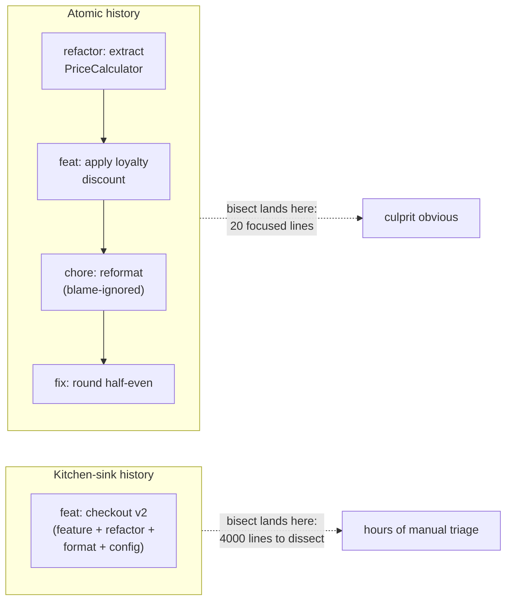
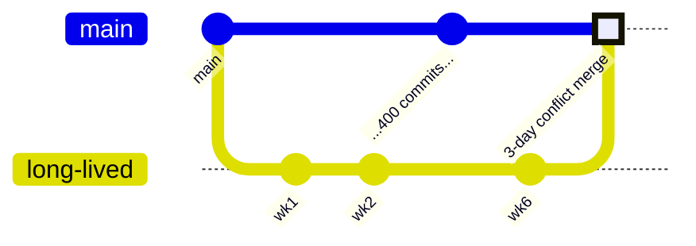
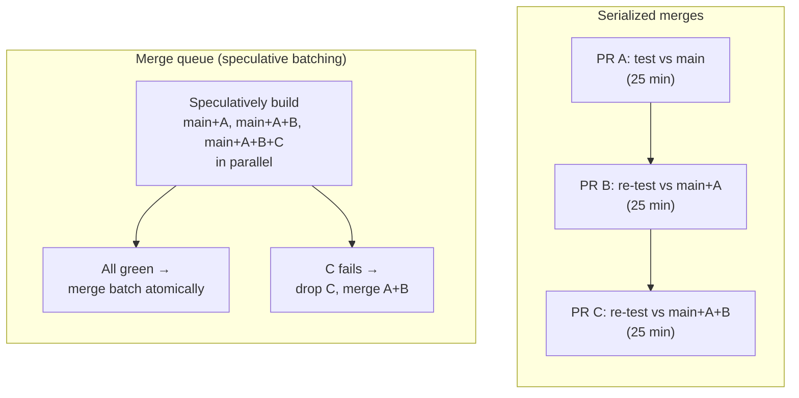

# Clean Commits & Version-Control Hygiene — Optimize & Reconcile

> Clean history is not just an aesthetic. The *shape* of the record — blob size, commit count, branch lifetime, atomicity — is a load-bearing input to clone time, CI pipeline duration, `bisect` resolution, review throughput, and merge-queue capacity. This file reconciles the human-facing discipline of clean commits with the machine-facing economics of operating a Git repository at scale. Each scenario states a concrete workflow, measures the cost in repo size / clone seconds / pipeline minutes, then resolves it on principle — keep blobs out of history, commit atomically, and let CI fetch only what it needs.

---

## Table of Contents

1. [A committed `node_modules` triples clone time](#scenario-1--a-committed-node_modules-triples-clone-time)
2. [A deleted 400 MB binary is still in the clone](#scenario-2--a-deleted-400-mb-binary-is-still-in-the-clone)
3. [Generated artifacts in history defeat delta compression](#scenario-3--generated-artifacts-in-history-defeat-delta-compression)
4. [CI clones full history on every job](#scenario-4--ci-clones-full-history-on-every-job)
5. [A 12 GB monorepo nobody can clone in under 20 minutes](#scenario-5--a-12-gb-monorepo-nobody-can-clone-in-under-20-minutes)
6. [`git log`/`git blame` are slow because the commit-graph is missing](#scenario-6--git-loggit-blame-are-slow-because-the-commit-graph-is-missing)
7. [A repo-wide reformat poisons every `git blame`](#scenario-7--a-repo-wide-reformat-poisons-every-git-blame)
8. [`git status` takes 8 seconds on a working tree of 300k files](#scenario-8--git-status-takes-8-seconds-on-a-working-tree-of-300k-files)
9. [Kitchen-sink commits make `git bisect` useless](#scenario-9--kitchen-sink-commits-make-git-bisect-useless)
10. [A 6-week feature branch costs 3 days to merge](#scenario-10--a-6-week-feature-branch-costs-3-days-to-merge)
11. [Serialized merges throttle a 40-engineer team](#scenario-11--serialized-merges-throttle-a-40-engineer-team)
12. [A pre-commit hook lints the whole repo on every commit](#scenario-12--a-pre-commit-hook-lints-the-whole-repo-on-every-commit)
13. [Giant PRs stall review and inflate cycle time](#scenario-13--giant-prs-stall-review-and-inflate-cycle-time)
14. [Binary assets churn in history instead of Git LFS](#scenario-14--binary-assets-churn-in-history-instead-of-git-lfs)

---

### Scenario 1 — A committed `node_modules` triples clone time

A front-end team committed `node_modules/` "so the build is reproducible." The directory holds 240 MB across ~180,000 small files. The repo `.git` directory is 1.9 GB; a fresh `git clone` over a corporate VPN takes ~6 minutes and checks out 190,000 files.

**Measurement / reasoning.** The cost is twofold. Network: every byte of every version of every package is packed and transferred. Filesystem: checkout writes 180k inodes — on a spinning disk or a networked filesystem the *checkout* phase alone dominates. `git count-objects -vH` shows `size-pack: 1.9 GiB`; `git verify-pack` reveals the bulk is `.js`/`.map` text under `node_modules`. Worse, each `npm install` that changes a sub-dependency rewrites thousands of blobs, so history grows ~50 MB per dependency bump.

<details><summary>Resolution</summary>

Dependencies are *generated* from a lockfile; they are reproducible without being recorded. The principle: **commit the source of truth (`package-lock.json`), never the derived tree.**

```gitignore
# .gitignore
node_modules/
dist/
*.tsbuildinfo
```

Then purge the directory from the working tree and stop tracking it:

```bash
git rm -r --cached node_modules
git commit -m "build: stop tracking node_modules; rely on lockfile"
```

This removes it going forward. Note the *history* is unchanged — the 1.9 GB is still in old packs (see [Scenario 2](#scenario-2--a-deleted-400-mb-binary-is-still-in-the-clone) for the permanent fix). After a follow-up `filter-repo` purge and `gc`, the same repo packs to ~140 MB and clones in ~25 seconds. The build stays reproducible because `npm ci` reconstructs `node_modules` deterministically from the lockfile in CI.

Reproducibility lives in the lockfile + a pinned toolchain, not in committed artifacts.

</details>

---

### Scenario 2 — A deleted 400 MB binary is still in the clone

Six months ago someone committed `assets/demo-build.dmg` (400 MB), realized the mistake, and ran `git rm demo-build.dmg` in the next commit. The file no longer appears in the working tree or in `HEAD`. Yet new clones still transfer 400 MB and take 4× longer than the codebase justifies.

**Measurement / reasoning.** Git history is an append-only DAG of immutable objects. A `git rm` adds a *new* commit whose tree omits the file — it does **not** delete the blob, which remains reachable from the ancestor commit that introduced it. Every full clone walks all reachable objects, so the 400 MB blob ships forever. `git rev-list --objects --all | git cat-file --batch-check | sort -k3 -n` (or the tool below) surfaces it instantly:

```bash
git rev-list --objects --all \
  | git cat-file --batch-check='%(objecttype) %(objectname) %(objectsize) %(rest)' \
  | awk '/^blob/ {print $3, $4}' | sort -rn | head
# 419430400 assets/demo-build.dmg   <-- 400 MB still here
```

<details><summary>Resolution</summary>

Large blobs in history are **forever** until you rewrite history to remove them. The modern, fast, safe tool is [`git filter-repo`](https://github.com/newren/git-filter-repo) (the `filter-branch` of old is ~100× slower and error-prone, and BFG is a narrower alternative):

```bash
# Operate on a fresh mirror clone — this REWRITES every commit hash.
git clone --mirror git@host:org/repo.git repo-clean.git
cd repo-clean.git
git filter-repo --invert-paths --path assets/demo-build.dmg
git reflog expire --expire=now --all && git gc --prune=now --aggressive
```

Then force-push the rewritten refs and have **every** collaborator re-clone. This is a destructive, coordinated operation: every commit downstream of the blob's introduction gets a new SHA, so it is the one time history rewriting is justified — and it must be announced (see [professional.md](professional.md) on coordinating shared-history rewrites). The cure is cheaper than the disease only because you do it *once*; the right move is preventing it in the first place via a `pre-receive` hook that rejects pushes containing blobs over, say, 10 MB.

The lesson generalizes: a blob's clone-time cost is paid by every developer, every CI job, forever — not just by the person who committed it.

</details>

---

### Scenario 3 — Generated artifacts in history defeat delta compression

A backend repo commits the compiled `bundle.min.js` (1.2 MB) on every release. Over 300 releases that is, naively, 360 MB. The team assumes Git's delta compression will dedupe it. It does not, and `.git` is 280 MB.

**Measurement / reasoning.** Git's packfile delta compression works well on *text that changes incrementally*. Minified/bundled output is a different beast: a one-line source change can reorder the entire minifier output, shift every hash in the bundle, and produce a blob with almost no byte-level overlap with the prior version. The delta is nearly as large as the full object. The same pathology hits compiled binaries, encrypted files, and pre-compressed assets (`.zip`, `.png`, `.jpg`) — Git cannot delta two already-compressed streams. `git verify-pack -v .git/objects/pack/*.idx | sort -k3 -rn` shows these blobs storing full size, not deltas.

<details><summary>Resolution</summary>

Two complementary moves. First, **stop committing generated output** — it is derived from source and reproducible by the build, exactly as in [Scenario 1](#scenario-1--a-committed-node_modules-triples-clone-time). Releases publish artifacts to an artifact registry (npm, a package repo, S3, GitHub Releases), not into Git.

Second, for the genuinely-binary inputs you *must* version (design assets, ML weights), route them to **Git LFS** so the repo stores a 130-byte text pointer and the binary lives in LFS storage:

```bash
git lfs track "*.psd" "*.onnx" "*.png"
git add .gitattributes
```

```gitattributes
# .gitattributes
*.psd  filter=lfs diff=lfs merge=lfs -text
*.onnx filter=lfs diff=lfs merge=lfs -text
```

LFS turns clone cost from "every version of every binary" into "the pointers, plus the binaries you actually check out" — and `git lfs clone`/partial fetch pulls only the LFS objects for the checked-out commit. The principle holds: **the repo records pointers and source; bulk bytes live where bulk bytes belong.**

</details>

---

### Scenario 4 — CI clones full history on every job

A CI pipeline runs lint, unit, integration, and build as four parallel jobs. Each job starts with a default `git clone`, pulling the full 800 MB history with 40,000 commits. Clone alone is ~70 seconds × 4 jobs × ~400 pipelines/day = roughly **31 hours of runner time per day spent cloning.**

**Measurement / reasoning.** CI almost never needs history — it needs the *tip* of one ref to build and test. A full clone transfers every commit, every tree, every blob version ever. Time the difference:

```bash
time git clone               git@host:org/repo.git   # ~70s, 800 MB
time git clone --depth=1     git@host:org/repo.git   # ~6s,  60 MB
```

<details><summary>Resolution</summary>

Use a **shallow clone** in CI. A shallow clone fetches only the commits you ask for — `--depth=1` gets just the tip:

```yaml
# CI config (provider-agnostic)
steps:
  - uses: checkout
    with:
      fetch-depth: 1   # shallow: tip commit only
```

This cuts the 70 s clone to ~6 s, saving ~26 hours of runner time per day in the example. Caveats that dictate when to go slightly deeper:

- **Merge-base / diff-against-base** steps (e.g. "lint only changed files since `main`") need both tips reachable: `fetch-depth: 0` *or* fetch the base ref specifically. Prefer fetching the single base ref over full depth.
- **Version derivation from tags** (`git describe`) needs tag history; fetch tags explicitly rather than deepening.
- **`git blame`/changelog generation** genuinely needs history — run those in a dedicated, non-shallow job, not in every job.

For very large repos, combine shallow with **partial clone** (`--filter=blob:none`, see [Scenario 5](#scenario-5--a-12-gb-monorepo-nobody-can-clone-in-under-20-minutes)) so even the deep-history jobs avoid downloading blobs they won't read.

</details>

---

### Scenario 5 — A 12 GB monorepo nobody can clone in under 20 minutes

A 1,000-engineer monorepo has 12 GB of history, 2.1 million files at HEAD, and 600k commits. A cold clone takes 22 minutes; the working-tree checkout adds another 4. New hires lose half a morning; CI provisioning is brutal.

**Measurement / reasoning.** The total cost decomposes into: (a) downloading all historical blobs, (b) downloading the commit/tree graph, (c) writing 2.1M files to disk. Most developers touch a few directories and rarely need historical blob *content* — Git fetched it all anyway because the protocol historically required a complete object closure.

<details><summary>Resolution</summary>

Three layered features, each attacking one cost:

1. **Partial clone** — skip historical blob content; fetch blobs lazily on demand:
   ```bash
   git clone --filter=blob:none git@host:org/repo.git
   ```
   This downloads the full commit+tree graph but **no blobs except those needed for the checkout**. In the example this drops the clone from 12 GB to ~1.5 GB and ~22 min to ~3 min. When you later `git log -p` or `blame` an old file, Git transparently fetches the missing blobs.

2. **Sparse-checkout** — materialize only the directories you work in, cutting the 2.1M-file checkout to the few thousand files your team owns:
   ```bash
   git sparse-checkout init --cone
   git sparse-checkout set services/payments libs/common
   ```
   The 4-minute checkout becomes seconds, and `git status` no longer stats 2.1M paths.

3. **`commit-graph`** — accelerate graph walks (`log`, `merge-base`, `bisect`) by precomputing generation numbers (see [Scenario 6](#scenario-6--git-loggit-blame-are-slow-because-the-commit-graph-is-missing)).

For Windows/macOS fleets, **Scalar** (now shipped with Git) wires all three together plus background maintenance and `fsmonitor`; Microsoft's earlier **GVFS** was the precursor that made the Windows monorepo (~270 GB, 3.5M files) usable. The combined effect on the example: a 22-minute clone becomes a ~2–3 minute partial+sparse clone, and daily commands stay sub-second.

```bash
scalar clone git@host:org/repo.git   # partial clone + sparse + commit-graph + maintenance, configured
```

The principle: **fetch the graph, defer the blobs, materialize only what you touch.** Clean history (Scenarios 1–3) keeps even the graph small.

</details>

---

### Scenario 6 — `git log`/`git blame` are slow because the commit-graph is missing

On a 600k-commit repo, `git log --oneline -20 -- some/file.go` takes 5–8 seconds and `git merge-base main feature` is similarly sluggish. Engineers blame "the big repo," but the working set is small.

**Measurement / reasoning.** Without a commit-graph file, history-traversal commands must `zlib`-inflate and parse each commit object to learn its parents and dates — millions of small reads. Reachability queries (`merge-base`, `--ancestry-path`, `bisect`) cannot prune the DAG efficiently. The commit-graph stores parent pointers and **generation numbers** in a flat, mmap-able file, letting Git answer "is A an ancestor of B?" without walking the whole graph.

<details><summary>Resolution</summary>

Build and enable the commit-graph, with automatic upkeep:

```bash
git config fetch.writeCommitGraph true
git commit-graph write --reachable --changed-paths
git config core.commitGraph true
```

`--changed-paths` adds a Bloom filter of modified paths per commit, which is exactly what `git log -- <path>` and `git blame` need — they can skip commits that provably didn't touch the file without inflating their trees. In the example, `git log -- some/file.go` drops from ~6 s to ~150 ms.

Even better, let Git maintain it in the background:

```bash
git maintenance start   # schedules commit-graph, gc, prefetch, loose-object packing
```

This is free performance with zero workflow change — and it compounds with the clean-history disciplines: fewer junk commits (Scenario 9) means a smaller graph to traverse in the first place.

</details>

---

### Scenario 7 — A repo-wide reformat poisons every `git blame`

A team adopts an auto-formatter and lands one 90,000-line commit reformatting the whole codebase. Now `git blame` on almost any line points at "chore: apply prettier" by one engineer on one date. The *real* authorship and intent — the data `blame` exists to surface — is buried one layer down.

**Measurement / reasoning.** `git blame` attributes each line to the last commit that changed it. A mass-reformat changes every line, so it becomes the blame target everywhere. Engineers must now run `git blame <sha>^ -- file` repeatedly to dig past it — slow and error-prone. This is the version-control cost of a kitchen-sink commit, paid on every future investigation.

<details><summary>Resolution</summary>

Two-part fix. First, **isolate mechanical changes into their own commit** that does nothing else — never mix a reformat with a behavior change (an atomic-commit principle covered in [find-bug.md](find-bug.md)). Second, tell Git's archaeology tools to *skip* that commit:

```bash
# .git-blame-ignore-revs  (committed to the repo root)
# Apply Prettier across the codebase
a1b2c3d4e5f6a7b8c9d0e1f2a3b4c5d6e7f8a9b0
```

```bash
git config blame.ignoreRevsFile .git-blame-ignore-revs
```

Now `git blame` (and the GitHub/GitLab blame UIs, which honor this file) transparently looks *through* the reformat to the line's true last meaningful change. Authorship is restored; investigations stay fast. Keep one rev per mechanical commit; this scales to repeated bulk migrations.

</details>

---

### Scenario 8 — `git status` takes 8 seconds on a working tree of 300k files

A monorepo checkout has 300,000 files. `git status`, `git checkout`, and even shell prompts that show branch state take 6–8 seconds, because each must `lstat()` every tracked path to detect changes.

**Measurement / reasoning.** Git's default change detection scans the entire working tree against the index — O(files) `lstat` syscalls per invocation. At 300k files on macOS/Windows (slower stat than Linux) this is several seconds, repeated dozens of times an hour. The OS already *knows* which files changed via its filesystem-event API; Git just wasn't asking.

<details><summary>Resolution</summary>

Enable the **filesystem monitor**, which subscribes to OS change notifications (FSEvents on macOS, ReadDirectoryChangesW on Windows, fanotify on Linux) so Git only re-stats files the OS reports as touched:

```bash
git config core.fsmonitor true
git config core.untrackedCache true   # cache untracked-file scan results
```

The built-in `fsmonitor` daemon (Git ≥ 2.37) brings `git status` from ~8 s to ~200 ms on the example. Pair it with sparse-checkout (Scenario 5) to shrink the tree itself, and with `git maintenance start` (Scenario 6) for background packing. `untrackedCache` separately memoizes the untracked-file scan, which is otherwise a second full-tree walk.

These are pure-throughput configs — they change no history and no workflow, only how fast the daily inner loop feels.

</details>

---

### Scenario 9 — Kitchen-sink commits make `git bisect` useless

A regression appears: a checkout total is off by a cent. The team reaches for `git bisect` to find the offending commit across 200 candidates. But the history is full of commits like "implement checkout v2" — each a 4,000-line mix of a feature, a refactor, formatting, and a config change. Bisect lands on one such commit. Now what?

**Measurement / reasoning.** `git bisect` is a binary search — log₂(N) steps to find the culprit. With 200 commits that is ~8 test runs, a beautiful speedup *if each commit is a single logical change.* When a commit bundles five unrelated changes, "this commit is bad" tells you almost nothing: you must manually dissect 4,000 lines to find which sliver caused the bug. The binary search succeeds in pinpointing a commit and then fails at its real job — pinpointing a *change*.

<details><summary>Resolution</summary>

**Atomic commits** are what make bisect — and every other history tool — pay off. One logical change per commit, each independently buildable and testable:



When bisect lands on `feat: apply loyalty discount`, the diff is 20 lines and the bug is obvious. Atomic commits also make `git revert` surgical — you can revert the one bad change without unwinding a feature. And because each commit builds, you can fully **automate** bisect:

```bash
git bisect start HEAD v1.0
git bisect run ./scripts/check-checkout-total.sh   # exit 0 = good, non-0 = bad
```

The same discipline that makes review humane (small, focused diffs) makes machine-assisted debugging fast. See [find-bug.md](find-bug.md) for spotting non-atomic commits before they land.

</details>

---

### Scenario 10 — A 6-week feature branch costs 3 days to merge

An engineer takes a "big rewrite" onto a branch and works it alone for six weeks. Meanwhile `main` advances 400 commits. When the branch finally opens a PR, the merge has 60 conflicting files, the rewrite assumes interfaces that have since changed, and reconciliation takes three engineer-days plus a tense review.

**Measurement / reasoning.** Merge cost grows super-linearly with branch age. The probability that branch and `main` touch overlapping code rises with both the branch's diff size and `main`'s churn; conflict-resolution effort then scales with the product. A branch that diverges for 6 weeks against an active `main` accumulates **merge debt** the way an un-rebalanced loan accrues interest — and the interest is paid in a single painful lump at the end, exactly when context has decayed. Empirically, conflict count and resolution time both rise sharply past ~1 week of divergence on an active repo.

<details><summary>Resolution</summary>

**Keep branches short-lived** — hours to a few days — and integrate continuously. The principled techniques:

- **Slice the work.** A six-week rewrite becomes a sequence of small, independently-mergeable PRs (Scenario 13). Each lands within a day, so divergence never accumulates.
- **Decouple "merge to main" from "release to users"** with **feature flags**, so incomplete work can land behind a flag instead of festering on a branch. This is the core of trunk-based development.
- **Integrate frequently the right way.** Pull `main` into the branch (or rebase a *private* branch onto it) at least daily, so conflicts surface in small, fresh, resolvable increments instead of one stale avalanche.



The avoided alternative — small PRs merging into a continuously-green `main` — keeps each integration trivial. One caveat: integrating by **merging** `main` in repeatedly creates merge-noise commits ("Merge branch 'main' into feature"), which clutter history and slow `log`/`blame`. On a *private, unshared* branch, prefer `git rebase main` to keep a linear, readable history; **never rebase a branch others have pulled** (see [professional.md](professional.md)).

</details>

---

### Scenario 11 — Serialized merges throttle a 40-engineer team

The team enforces "PR must be green against the latest `main` before merge." With 40 engineers landing ~50 PRs/day, each merge invalidates everyone else's "tested against `main`" status, so PRs must re-run CI and re-merge one at a time. CI takes 25 minutes. The integration pipeline becomes a single-lane bridge; PRs queue up and some authors re-base 4–5 times before landing.

**Measurement / reasoning.** Strict "rebase-and-retest before each merge" serializes integration: throughput is capped at one PR per CI cycle, i.e. `60/25 ≈ 2.4` merges/hour, ~19 over an 8-hour day — well under the 50 demanded. The backlog grows, and engineers burn time babysitting the queue. The bottleneck is *serialization*, not CI speed alone.

<details><summary>Resolution</summary>

Adopt a **merge queue** (GitHub merge queue, GitLab merge trains, Bors/Zuul). The queue batches and speculatively tests PRs *together* against the projected post-merge state, then merges the batch atomically when green:



By testing batches in parallel and only ever merging proven-green combinations, the queue lifts throughput from ~2.4 to dozens of merges/hour while preserving the invariant that `main` is always green. Two levers compound it: **faster CI** (shallow clones from Scenario 4, cached builds) shrinks the cycle, and **smaller PRs** (Scenario 13) make speculative batches less likely to conflict and cheaper to drop-and-retry on failure. Clean atomic commits make a dropped-from-batch PR easy to re-queue without entangling unrelated work.

</details>

---

### Scenario 12 — A pre-commit hook lints the whole repo on every commit

A team installs a `pre-commit` hook that runs ESLint + Prettier + type-check over the *entire* repository. On a medium repo this adds 40–90 seconds to every `git commit`. Developers start committing with `--no-verify` to escape it, so the hook protects nothing.

**Measurement / reasoning.** A commit changes a handful of files, but the hook processes thousands. Cost scales with repo size instead of changeset size — exactly backwards. The friction is so high it trains developers to bypass the hook, which is worse than having no hook (false sense of safety). The fix is to scope work to the *staged* set.

<details><summary>Resolution</summary>

Run hooks **only on staged files**, and keep the hook fast enough to be invisible. The `pre-commit` framework or `lint-staged` does exactly this:

```json
// package.json
"lint-staged": {
  "*.{ts,tsx}": ["eslint --fix", "prettier --write"],
  "*.{md,json}": ["prettier --write"]
}
```

```yaml
# .pre-commit-config.yaml  (Python ecosystem)
repos:
  - repo: local
    hooks:
      - id: ruff
        entry: ruff check --fix
        language: system
        types: [python]   # framework passes only staged, matching files
```

Now a commit touching 3 files lints 3 files — sub-second. Guidance to keep it healthy:

- **Pre-commit = fast, local-only checks** (format, lint, secret-scan on the diff). Heavy, slow, or cross-cutting checks (full type-check, test suite, integration) belong in **CI/pre-push**, where latency is tolerable and parallelizable.
- **Scope to the changeset** everywhere — `git diff --cached --name-only` is the canonical input.
- A secret-scan on staged content (e.g. `gitleaks protect --staged`) is the one hook worth its weight, because it prevents the irreversible [Scenario 2](#scenario-2--a-deleted-400-mb-binary-is-still-in-the-clone)-class mistake of committing a credential that then lives in history forever.

A fast hook is a hook developers leave enabled. Speed is what makes the safety real.

</details>

---

### Scenario 13 — Giant PRs stall review and inflate cycle time

A 2,800-line PR sits open for nine days. Reviewers keep deferring it ("need a 2-hour block"); when review finally happens it is shallow, the PR has drifted from `main` and needs re-testing, and the round-trip repeats. Meanwhile the author context-switches away and loses the thread.

**Measurement / reasoning.** Review quality and speed degrade non-linearly with diff size. Studies of review effectiveness (and most teams' own data) show defect-detection drops sharply past a few hundred changed lines — reviewers skim. A large PR is also a large merge target: longer open time means more `main` drift, more conflicts, and more re-runs of CI. Cycle time (open → merged) balloons, which directly suppresses deployment frequency.

<details><summary>Resolution</summary>

**Small, atomic PRs** — ideally under ~200–400 lines of meaningful diff — reviewed within hours. The same atomicity that helps `bisect` (Scenario 9) helps the human reviewer: a focused diff has one thing to reason about. Tactics:

- **Stack the work.** Land enabling refactors as their own PRs first (each green, each revertable), then the feature on top. Stacked-PR tooling (Graphite, `git-branchless`, `gh` stacks) automates rebasing the stack as lower PRs merge.
- **Separate mechanical from semantic.** A reformat or rename goes in its own PR (and into `.git-blame-ignore-revs`, Scenario 7) so the semantic PR stays readable.
- **Optimize for review latency, not PR count.** Small PRs merge fast, so they spend little time diverging from `main` — which feeds directly into a healthy [merge queue](#scenario-11--serialized-merges-throttle-a-40-engineer-team) and avoids the [long-lived-branch](#scenario-10--a-6-week-feature-branch-costs-3-days-to-merge) tax.

The throughput math is the inverse of Scenario 10: small units integrate cheaply and continuously, so the whole team's cycle time drops even though the *number* of PRs rises. See [find-bug.md](find-bug.md) for recognizing a PR that should have been three, and the [Code Reviews chapter](../17-code-reviews/README.md) for the reviewing side of the same coin.

</details>

---

### Scenario 14 — Binary assets churn in history instead of Git LFS

A game/ML repo versions `.fbx` models, `.png` textures, and `.onnx` weights directly in Git. Each is 5–80 MB, and artists update them weekly. After a year the repo is 30 GB and a clone is a coffee-break-and-a-half. Branch checkouts that swap asset versions rewrite hundreds of MB on disk.

**Measurement / reasoning.** As in [Scenario 3](#scenario-3--generated-artifacts-in-history-defeat-delta-compression), binaries don't delta-compress, so every revision of every asset is stored in full and shipped in every full clone. Unlike build output, these assets are genuine *source* — they must be versioned. The cost isn't "don't commit them," it's "don't put their *bytes* in the main object store."

<details><summary>Resolution</summary>

Move large binary *inputs* to **Git LFS**, which keeps Git tracking a tiny pointer while the bytes live in a dedicated LFS store fetched on demand:

```bash
git lfs install
git lfs track "*.fbx" "*.png" "*.onnx"
git add .gitattributes
```

A clone now downloads the commit graph + pointers + only the LFS objects for the checked-out commit — not every historical revision. On the example, a fresh clone drops from 30 GB to ~2 GB; `git lfs prune` reclaims local LFS cache of unreferenced revisions.

Two important reconciliations:

- **Adopting LFS does not shrink existing history** — assets already committed as normal blobs stay in the packs. To actually reclaim the 30 GB you must rewrite history with `git filter-repo --path-glob '*.png' --to-lfs` (or `git lfs migrate import`), the same one-time coordinated rewrite as [Scenario 2](#scenario-2--a-deleted-400-mb-binary-is-still-in-the-clone). Set it up *before* the first binary lands when you can.
- **For very large or rarely-touched assets**, combine LFS with **partial clone** (`--filter=blob:none`) and sparse-checkout (Scenario 5) so even pointers' backing objects are fetched lazily and only the asset directories you work in are materialized.

The unifying principle across Scenarios 1–3 and 14: **the Git object store is for source and pointers; bulk and derived bytes live elsewhere (LFS, artifact registries, lazy fetch).** Honor that line and clone time stays a function of the code, not the cruft.

</details>

---

## Rules of Thumb

- **Blobs in history are forever.** A `git rm` hides a file; only a history rewrite (`git filter-repo`) removes its clone-time cost. Prevent with `.gitignore` + a server-side size-limit hook; never rely on cleanup.
- **Commit source, not derivatives.** Lockfiles, not `node_modules`; build configs, not `dist/`. Anything reproducible by the build does not belong in the object store.
- **Binaries don't delta-compress.** Route versioned binary *inputs* to Git LFS; publish build *outputs* to an artifact registry.
- **Shallow in CI, partial for big repos.** `--depth=1` for ephemeral jobs; `--filter=blob:none` + sparse-checkout + Scalar for large multi-team clones. Fetch the graph, defer the blobs.
- **Turn on the free speed.** `git maintenance start` gives you `commit-graph`, background `gc`, and prefetch; `core.fsmonitor true` makes `status`/`checkout` instant. Zero workflow change.
- **Atomic commits pay compound interest.** They make `bisect` pinpoint a *change* not a SHA, make `revert` surgical, and make review humane. One logical change per commit.
- **Short branches, small PRs.** Divergence cost is super-linear; integrate within a day. Use feature flags to decouple merge from release.
- **Isolate mechanical changes** (reformats, renames) into dedicated commits and add their SHAs to `.git-blame-ignore-revs` so archaeology stays fast and accurate.
- **Scale hooks to the changeset, not the repo.** Pre-commit runs only on staged files and only fast checks; heavy verification lives in CI. A slow hook gets `--no-verify`'d into uselessness.
- **Merge queues beat serialized merges** for busy teams — speculative batching lifts throughput while keeping `main` green.
- **Measure before rewriting history.** Rewrites are destructive and force re-clones; do them once, deliberately, and announce them.

---

## Related Topics

- [README.md](../README.md) — the positive rules of clean commits and version control this file optimizes against.
- [find-bug.md](find-bug.md) — spotting non-atomic commits, kitchen-sink PRs, and committed artifacts before they land.
- [professional.md](professional.md) — coordinating history rewrites and never force-pushing shared branches.
- [Code Reviews](../17-code-reviews/README.md) — the reviewing side of small, atomic PRs; review latency vs. PR size.
- [Refactoring](../../refactoring/README.md) — why isolating mechanical refactors into their own commits keeps blame and bisect clean.
