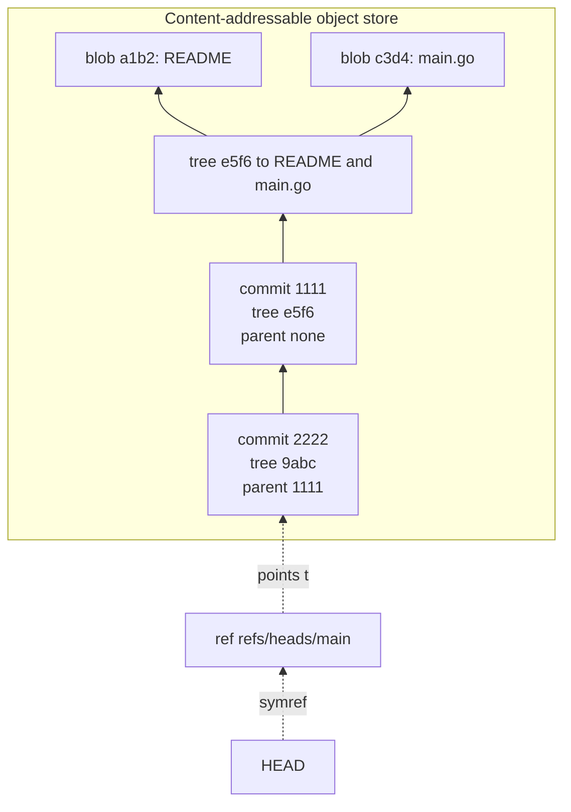
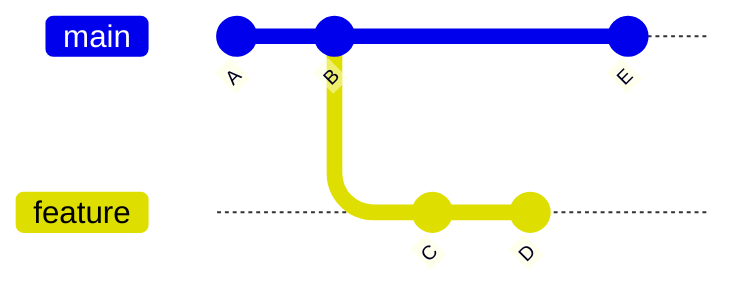

# Clean Commits & Version-Control Hygiene — Professional Level

> Focus: the deep end. Git's data model as the foundation of "clean history"; history as documentation and forensics; the rebase-vs-merge debate at the level of true topology; commit messages as machine-readable supply-chain data; scaling git past the point where its assumptions break; and rewriting history safely — with full awareness of the blast radius.

---

## Table of Contents

1. [The data model is the whole game](#the-data-model-is-the-whole-game)
2. [Refs, the reflog, and why nothing is ever truly lost](#refs-the-reflog-and-why-nothing-is-ever-truly-lost)
3. [Rebase creates new objects — force-push is the danger](#rebase-creates-new-objects--force-push-is-the-danger)
4. [History as documentation and forensics](#history-as-documentation-and-forensics)
5. [The rebase-vs-merge debate at depth](#the-rebase-vs-merge-debate-at-depth)
6. [Commit messages as machine-readable data](#commit-messages-as-machine-readable-data)
7. [Signed commits and supply-chain provenance](#signed-commits-and-supply-chain-provenance)
8. [Scaling git past its design point](#scaling-git-past-its-design-point)
9. [Rewriting history safely — secret removal](#rewriting-history-safely--secret-removal)
10. [Common Mistakes](#common-mistakes)
11. [Test Yourself](#test-yourself)
12. [Cheat Sheet](#cheat-sheet)
13. [Summary](#summary)
14. [Further Reading](#further-reading)
15. [Related Topics](#related-topics)

---

## The data model is the whole game

Everything in this chapter — atomicity, bisectability, the rebase/merge debate, the danger of force-push — falls out of one fact: **git is a content-addressable filesystem with a DAG of immutable objects layered on top.** Master the model and the rules stop being rituals.

There are four object types, each stored once, keyed by the hash of its content (SHA-1, migrating to SHA-256):

- **blob** — file contents (no name, no mode).
- **tree** — a directory listing: names, modes, and the hashes of the blobs/trees it contains.
- **commit** — a snapshot pointer (one root tree) + zero or more **parent** commit hashes + author/committer + message.
- **tag** — an annotated, optionally signed pointer to another object.

Two consequences matter enormously:

1. **A commit is a full snapshot, not a diff.** The "diff" you see is *computed* on demand between a commit's tree and its parent's tree. This is why `git log -p`, `git show`, and `git diff` are all derived views — the stored truth is immutable trees.
2. **The hash covers everything reachable.** A commit's hash incorporates its tree hash *and* its parent hashes *and* its metadata. Change a byte in an ancestor's message and every descendant's hash changes. This is a Merkle DAG — the same structure underpinning Bitcoin and Certificate Transparency logs — and it is *why git history is tamper-evident* and why "editing an old commit" is impossible without producing entirely new objects.



Inspect it directly — this is not a metaphor:

```bash
git cat-file -t HEAD          # commit
git cat-file -p HEAD          # tree <hash>, parent <hash>, author ..., message
git cat-file -p HEAD^{tree}   # the directory listing (mode, type, hash, name)
git rev-parse HEAD            # the 40-char (SHA-1) object name
```

A **branch is a 41-byte file** (`refs/heads/main`) containing a hash. `HEAD` is usually a symbolic ref pointing at a branch. "Switching branches" rewrites one small file and checks out the corresponding tree. Understanding this dissolves most git mysticism: branches are cheap because they are just labels on an immutable DAG.

> Reference: the Git internals chapter of *Pro Git* (Chacon & Straub, 2nd ed., ch. 10), the canonical description of the object model, freely available at <https://git-scm.com/book/en/v2/Git-Internals-Git-Objects>.

---

## Refs, the reflog, and why nothing is ever truly lost

Commits are immutable, but **refs move.** When you `commit`, `reset`, `rebase`, or `merge`, git updates a ref to point at a different commit. The old commit object still exists in the object store — it is merely *unreachable* from any branch or tag.

The **reflog** is git's record of every position a ref has held locally:

```bash
git reflog                       # HEAD's movement history
git reflog show main             # one branch's movements
# 8a3f201 HEAD@{0}: reset: moving to HEAD~3
# 4c9e8d7 HEAD@{1}: commit: add retry policy
```

This is the single most important safety net in git, and it is why "I lost my work with `git reset --hard`" is almost always recoverable:

```bash
git reset --hard HEAD~5          # "lost" 5 commits
git reflog                       # find the pre-reset HEAD@{1}
git reset --hard HEAD@{1}        # they are back
```

Unreachable objects are not collected immediately. They survive until `git gc` runs and a grace period passes (`gc.reflogExpireUnreachable`, default **30 days**; reachable reflog entries expire at `gc.reflogExpire`, default **90 days**). To hunt for a commit not even in the reflog (e.g. a dropped stash):

```bash
git fsck --lost-found --no-reflogs   # dangling commits/blobs land in .git/lost-found
```

> **Professional mental model:** in git, "destructive" operations are destructive to *reachability*, not to *objects*. The reflog is local-only and per-clone — it does **not** travel on push/fetch. That asymmetry is the seed of the force-push danger below.

---

## Rebase creates new objects — force-push is the danger

Because the hash covers parents and metadata, **rebase cannot move a commit** — it can only *copy* it. `git rebase main` reads each commit on your branch, re-applies its diff onto a new base, and writes a **brand-new commit** with a new parent and therefore a new hash. The originals become unreachable (recoverable via reflog).



After `git rebase main` on `feature`, commits `C` and `D` are gone; new commits `C'` and `D'` exist with `E` as their ancestor. Same diffs, different identities.

This is fine for a *private* branch. It becomes dangerous the instant the branch is **shared**:

- A teammate has `C` and `D` in their clone, with their own work `F` built on `D`.
- You `git push --force`. The remote `feature` now points at `D'`.
- Your teammate's `git pull` sees divergent history. Their `D` is now unreachable on the remote; their `F` is stranded on an orphaned base. Best case: a confusing merge. Worst case: they re-introduce `C`/`D` and you get duplicated commits.

The professional rules:

1. **Never force-push a branch others build on** (especially not `main`/`release`). Rewriting *published* history is the cardinal sin of this chapter.
2. When you *must* update a shared review branch after a rebase, use **`git push --force-with-lease`** (and ideally `--force-if-includes`). `--force-with-lease` refuses the push if the remote ref moved since your last fetch — it protects against clobbering a teammate's just-pushed commit, which raw `--force` will happily destroy.
3. **Protect the trunk at the server.** GitHub/GitLab branch protection that denies force-push and deletion makes the cardinal sin physically impossible on the branches that matter.

```bash
# Safe update of your own review branch after rebase:
git push --force-with-lease --force-if-includes origin feature
```

> Reference: `git help push` (`--force-with-lease`, `--force-if-includes`); Atlassian's "Rewriting history" tutorial, <https://www.atlassian.com/git/tutorials/rewriting-history>.

---

## History as documentation and forensics

Clean history is not an aesthetic preference — it is a **read-optimized data structure for the questions you ask during an incident.** Three of git's most underused tools turn the log into a debugger.

### `git bisect` — binary search over the DAG

When "it worked last release, it's broken now," bisect finds the first bad commit in `O(log n)` steps instead of `O(n)`:

```bash
git bisect start
git bisect bad                 # current HEAD is broken
git bisect good v2.3.0         # this tag was fine
# git checks out the midpoint; you test and mark good/bad...
```

The decisive professional move is **automation**. If you can write a script that exits `0` for good and non-zero for bad, bisect runs unattended:

```bash
git bisect run ./scripts/repro.sh
# git walks the ~log2(N) midpoints, runs the script at each,
# and prints: <hash> is the first bad commit
```

Use exit code **125** in the script to signal "untestable, skip this commit" (e.g. it doesn't compile). **This is where atomic commits pay for themselves:** if a single commit mixed a feature, a refactor, and reformatting, bisect lands you on a 2,000-line haystack instead of a 20-line needle.

### `git log -S` / `-G` — the pickaxe

To find *when a string entered or left the codebase* — a function name, a magic constant, a leaked token pattern:

```bash
git log -S 'AWS_SECRET_ACCESS_KEY' --oneline    # commits that changed the COUNT of this string
git log -G 'retry.*backoff' --oneline           # commits whose diff text MATCHES this regex
```

`-S` (pickaxe) tracks additions/removals of a literal; `-G` matches the diff hunk against a regex. Together they answer "who deleted the rate limiter and when?" without reading every diff.

### `git log -L` — line-history archaeology

Track the evolution of a single function or line range across renames:

```bash
git log -L :computeBackoff:client/retry.go      # full history of one function
git log -L 40,55:app/server.go                  # history of a line range
```

### Blame, and ignoring noise commits

`git blame` answers "who last touched this line, in which commit, why." Its enemy is the mass-reformatting commit (a Prettier run, a license-header sweep) that makes every line blame to a robot. The cure is **`.git-blame-ignore-revs`**:

```bash
# .git-blame-ignore-revs — one commit hash per line, the bulk-format commits
8c3a1f9e2b...   # ran gofmt across the repo
1d4b77a90c...   # applied new import ordering

git config blame.ignoreRevsFile .git-blame-ignore-revs
```

GitHub honors this file automatically; blame then skips through the formatting commit to the real author of the logic. (`git blame --ignore-revs-file` arrived in Git 2.23.)

### Atomic, revertable commits in incident response

The payoff for "one logical change per commit" is `git revert`. A *clean* atomic commit can be reverted with a single command that produces a new commit undoing exactly that change — no merge conflicts with unrelated work, no collateral rollback:

```bash
git revert 8a3f201           # creates a new commit that inverts the diff; history preserved
git revert -m 1 <merge-sha>  # revert a whole merged PR, keeping mainline parent 1
```

Revert (forward fix) is the correct incident tool, not `reset` — because revert is itself a commit and never rewrites shared history.

---

## The rebase-vs-merge debate at depth

This is a genuine engineering trade-off, not a style war — and the right answer depends on what you want the **first-parent topology** to mean.

### Two philosophies

**The Linux-kernel / "every commit must build" school** treats history as a curated narrative for `git bisect` and `git blame`. Contributors rebase and clean their series *before* it is accepted; the maintainer's tree stays close to linear per topic. Linus Torvalds' position is precise: rebasing your *own* not-yet-published work is good hygiene; rebasing work *others have pulled* is the unforgivable act. (See `Documentation/maintainer/rebasing-and-merging.rst` in the kernel source.)

**The "GitHub-flow / true history" school** merges feature branches with explicit merge commits and never rebases shared work. The log shows topology that actually happened — when each branch forked and joined. This loses linearity but preserves audit fidelity and avoids any history rewriting.

### What `--first-parent` buys you

A merge commit has two parents: **parent 1** is the branch you were *on* (the trunk), **parent 2** is the branch you *merged in*. `git log --first-parent` follows only parent 1, collapsing each merged PR into a single line:

```bash
git log --first-parent --oneline main
# e4f12a9 Merge PR #482: add idempotency keys
# 9c0d3b1 Merge PR #481: fix retry jitter
```

This is the killer argument for the **merge-with-`--first-parent`** model: you get a clean, PR-granular trunk history for reading and `git bisect --first-parent` (Git 2.29+) for incident response, *while* the full intra-PR detail remains available when you want it. The squash-merge model throws that detail away permanently.

### The three integration strategies, compared

| Strategy | Trunk shape | Intra-PR commits | `git revert` of a PR | History rewritten? |
|---|---|---|---|---|
| **Merge commit** (`--no-ff`) | Topology preserved | Kept | `revert -m 1 <merge>` | No |
| **Squash merge** | Linear | **Discarded** | `revert <squash>` | Yes (on the branch) |
| **Rebase merge** | Linear | Kept, replayed | `revert` each commit | Yes (branch rebased) |

Pragmatic synthesis used by mature teams: **rebase your local feature branch onto fresh trunk to keep it current and clean, then integrate with a `--no-ff` merge commit** that records the PR as a unit. You get clean individual commits *and* a meaningful first-parent line. Squash is the right default only when contributors' intermediate commits are genuinely noise ("wip", "fix typo", "address review") that no one cleaned up.

> The kernel position: <https://www.kernel.org/doc/html/latest/maintainer/rebasing-and-merging.html>. The opposing pragmatic case: Atlassian, "Merging vs. Rebasing," <https://www.atlassian.com/git/tutorials/merging-vs-rebasing>.

---

## Commit messages as machine-readable data

A commit message is the only place the **why** of a change is recorded. Tim Pope's seven-rule format (50-char imperative subject, blank line, 72-wrapped body explaining motivation and contrast with previous behavior) is still the human-readable baseline. The professional addition is treating the message as **structured, parseable data**.

### Trailers — git's built-in key-value footer

Git natively understands RFC-2822-style trailers in the message footer and exposes them to tooling via `git interpret-trailers` and `git log --format='%(trailers)'`:

```
Refactor retry policy to use exponential backoff with jitter

The fixed 1s retry caused thundering-herd retries against the
payments gateway during the May incident (INC-2241). Decorrelated
jitter spreads retries and cut p99 reconnection time by ~40%.

Fixes: INC-2241
Reviewed-by: Jordan Lee <jlee@example.com>
Co-authored-by: Sam Ortiz <sortiz@example.com>
Signed-off-by: Bakhodir Yashin Mansur <byashin@example.com>
```

`Co-authored-by` is honored by GitHub for credit on a single commit; `Signed-off-by` (the **Developer Certificate of Origin**) is a legal attestation, enforced in the kernel and many corporate repos via the DCO bot.

### Conventional Commits → automated semver and changelogs

The [Conventional Commits](https://www.conventionalcommits.org/) spec makes the subject line a typed grammar — `<type>(<scope>)!: <description>` — that tooling parses to **derive the next version automatically**:

```
feat(api): add idempotency key support      -> MINOR bump (new feature)
fix(retry): clamp backoff to 30s            -> PATCH bump
refactor(db)!: drop legacy connection pool  -> MAJOR bump (! = breaking)
```

`semantic-release`, `release-please`, and `git-cliff` read the log, compute the next version per SemVer, generate a grouped CHANGELOG, tag, and publish — with zero human version-bumping. The discipline of the commit message *becomes* the release pipeline. The flip side: this only works if commits are atomic and correctly typed, which is why CI lints commit messages (`commitlint`, `gitlint`) and the squash-merge title becomes the canonical typed message.

> Conventional Commits 1.0.0: <https://www.conventionalcommits.org/en/v1.0.0/>. SemVer 2.0.0: <https://semver.org/>.

---

## Signed commits and supply-chain provenance

Hashes make history *tamper-evident*; signatures make authorship *non-repudiable*. After incidents like the 2024 XZ Utils backdoor (CVE-2024-3094), provenance moved from nice-to-have to compliance requirement.

### Signing mechanisms

```bash
git config commit.gpgsign true                   # sign all commits
git config gpg.format ssh                         # sign with an SSH key instead of GPG (Git 2.34+)
git config user.signingkey ~/.ssh/id_ed25519.pub
git log --show-signature                          # verify
```

Three signing backends are in common use:

- **GPG** — the historical default; key-management burden is real.
- **SSH signing** (Git 2.34+) — reuse the key you already have; an `allowed_signers` file maps identities to keys.
- **gitsign / Sigstore** — **keyless** signing. You authenticate via OIDC (your Google/GitHub identity); Sigstore's Fulcio issues a short-lived (~10 min) certificate, the signature is recorded in the **Rekor** transparency log, and the ephemeral key is discarded. No long-lived private key to leak. This is the model behind modern supply-chain attestation.

### SLSA and provenance

**SLSA** (Supply-chain Levels for Software Artifacts) defines build-integrity levels. Signed, verified commits feed the chain: a verified commit -> a build with signed provenance (who built what, from which source, with which toolchain) -> an artifact whose origin can be cryptographically traced. GitHub's **vigilant mode** flags any unsigned or unverifiable commit on your account, closing the "spoofed author email" gap: anyone can set `user.email` to yours; only a signature proves it was you.

> SLSA: <https://slsa.dev/>. Sigstore/gitsign: <https://docs.sigstore.dev/>. GitHub commit-signature verification: <https://docs.github.com/en/authentication/managing-commit-signature-verification>.

---

## Scaling git past its design point

Git was designed for the kernel: large, but text, and *fully cloned*. At Google/Microsoft monorepo scale (millions of files, terabytes of history), several assumptions break — every command that walks the working tree or the full object graph degrades.

### Where git hurts at scale

- **`git status` / `git checkout`** are `O(working-tree size)` — they `lstat` every tracked file. Millions of files means multi-second status.
- **`clone`** copies the *entire* object history. A repo with a long binary-heavy past makes initial clone enormous.
- **Pack/graph walks** for `git log --graph` get slow without precomputed structures.

### The scaling toolkit (mostly built into modern git)

| Technique | What it does | Command |
|---|---|---|
| **Partial clone** | Skip downloading blobs until accessed (lazy fetch) | `git clone --filter=blob:none <url>` |
| **Shallow clone** | Truncate history to recent commits | `git clone --depth=1 <url>` |
| **Sparse checkout** | Materialize only a subtree of the working dir | `git sparse-checkout set <dirs>` |
| **commit-graph** | Precomputed commit metadata + generation numbers; near-instant `git log`/merge-base | `git commit-graph write --reachable` |
| **FS Monitor** | OS file-watching (Watchman / built-in fsmonitor) so `status` skips unchanged dirs | `git config core.fsmonitor true` |
| **multi-pack-index** | Index across many packfiles for fast lookup | `git multi-pack-index write` |

**Scalar** (now shipped *with* git) is the umbrella that turns all of these on with sane defaults — `scalar clone <url>` sets up partial clone + sparse checkout + background maintenance. It is the productized descendant of Microsoft's **GVFS** (Git Virtual File System), built so that the Windows source tree (~3.5M files, ~300 GB) could live in a single git repo by virtualizing the working directory and fetching objects on demand.

> Microsoft's scaling story: Brian Harry, "The largest Git repo on the planet," <https://devblogs.microsoft.com/bharry/the-largest-git-repo-on-the-planet/>. Scalar docs: <https://git-scm.com/docs/scalar>. commit-graph design: `Documentation/technical/commit-graph.txt` in git's source.

**The hygiene angle:** large binaries and generated files are the usual reason a repo bloats past comfort. They belong in **Git LFS** (pointer files in git, blobs in a separate store) or out of the repo entirely. A `.gitignore` for build artifacts and a `.gitattributes` routing binaries to LFS *before* the first commit is far cheaper than the history rewrite required to remove them later.

---

## Rewriting history safely — secret removal

Sometimes you must rewrite *published* history: a private key, an AWS credential, or a customer dump was committed. Deleting it in a *new* commit is useless — the secret lives forever in the historical object and `git log -S` (or any attacker with a clone) will find it. You must **excise the blob from every reachable commit**, which rewrites every descendant.

### The right tools — never `filter-branch`

`git filter-branch` is officially discouraged (slow, dangerously easy to misuse; the man page now recommends against it). Use:

- **git-filter-repo** (the recommended modern tool) — fast, written for exactly this:

```bash
git filter-repo --replace-text <(echo 'literal:AKIA...==>***REMOVED***')
git filter-repo --invert-paths --path config/secrets.yml   # purge a file from all history
```

- **BFG Repo-Cleaner** — simpler, JVM-based, optimized for the common cases:

```bash
bfg --replace-text passwords.txt              # redact matching strings everywhere
bfg --delete-files id_rsa                     # remove a file from all commits
```

### The consequences — what rewriting actually costs

Rewriting history is irreversible coordination work, and the chapter's golden rule still bites:

1. **Every commit hash downstream of the change changes.** Every fork, every open PR, every local clone now has divergent history. Everyone must re-clone or carefully rebase. Tags, signatures, and CI caches keyed on old hashes break.
2. **The secret is still public.** The instant it touched a remote, assume it is compromised. History rewriting limits *future* exposure but cannot un-leak. **Rotate the credential immediately** — that is the real remediation; the rewrite is cleanup.
3. **Hosting platforms cache aggressively.** GitHub keeps unreachable commits accessible via direct SHA URLs and in forks for a long time; you must contact support to purge cached views and ask forks to be removed.
4. **`git filter-repo` deliberately removes the origin remote** after rewriting, to force you to confirm before pushing the rewritten history — a guardrail against accidentally clobbering the wrong remote.

> GitHub's runbook: "Removing sensitive data from a repository," <https://docs.github.com/en/authentication/keeping-your-account-and-data-secure/removing-sensitive-data-from-a-repository>. git-filter-repo: <https://github.com/newren/git-filter-repo>. The deeper fix is prevention — pre-commit secret scanning (`gitleaks`, `git-secrets`, GitHub push protection) keeps the blob from ever entering the object store.

---

## Common Mistakes

1. **Force-pushing a shared branch.** Using `git push --force` instead of `--force-with-lease` on a branch others build on; rewriting `main`'s published history. The fix to a bad commit on a public branch is `git revert`, never `reset` + `force`.
2. **Believing `reset --hard` lost the work.** Panicking instead of checking `git reflog`, where the pre-reset HEAD sits at `HEAD@{1}` for 30–90 days.
3. **Kitchen-sink commits that destroy bisectability.** Mixing a reformat, a feature, and a refactor in one commit so `git bisect` and `git revert` land on a giant blast radius.
4. **What-not-why messages.** "Updated retry logic" restates the diff. The reader can see *what* changed; only the message can record *why* (the incident, the constraint, the rejected alternative).
5. **Committing secrets, then "deleting" them in a follow-up commit.** The blob remains in history. Real fix: rotate the credential, then `filter-repo`/BFG, and add push protection.
6. **Reformatting the world without `.git-blame-ignore-revs`.** A repo-wide `gofmt`/Prettier commit makes `git blame` useless until you register the noise commit in the ignore-revs file.
7. **Squash-merging everything reflexively.** Discarding genuinely meaningful intra-PR history. Squash is for noise, not for well-curated commit series.
8. **Long-lived feature branches.** Weeks of drift from `main` turn the eventual merge into a high-risk conflict marathon. Integrate small and often; rebase onto fresh trunk.
9. **Untyped or unlinted commit subjects in a Conventional-Commits pipeline.** A mistyped `feat:` vs `fix:` silently produces the wrong semver bump and a wrong changelog entry.

---

## Test Yourself

1. **Why is it physically impossible to "edit" an old commit's message without changing every descendant's hash?**

<details><summary>Answer</summary>
A commit's hash is computed over its content *including its tree hash, parent hashes, and full metadata (author, committer, message)*. Change the message and the commit's own hash changes. Every child commit stored its parent's *old* hash, so to point at the rewritten commit each child must itself be rewritten — and so on transitively up to the branch tip. Git's Merkle-DAG structure makes history tamper-evident exactly because of this propagation. You are never editing; you are creating a new chain of objects and moving a ref to it.
</details>

2. **A teammate rebased and `git push --force`-ed a shared branch; your local commits on the old base vanished from the remote. How do you recover, and what should they have done?**

<details><summary>Answer</summary>
Your commits are not gone locally — `git reflog` (or the branch's own reflog) still has them, and they're reachable as objects for 30+ days. Find your last good commit and replay it onto the new remote tip (`git rebase --onto origin/feature <old-base> <your-work>`). The teammate should have (a) not rewritten a shared branch at all, or (b) at minimum used `--force-with-lease` so the push would have been *rejected* because the remote moved under them, then coordinated the rewrite explicitly.
</details>

3. **What does `git bisect run ./test.sh` require of your commit history to be effective, and what is exit code 125 for?**

<details><summary>Answer</summary>
It requires that commits be **atomic and individually buildable/testable** — each commit one logical change. If commits mix concerns or don't compile, bisect either lands you on a huge multi-purpose diff or can't test a midpoint at all. Exit code **125** is the "untestable — skip this commit" signal (e.g. it doesn't compile); git excludes it and picks an adjacent commit. Exit 0 = good; 1–124 and 126–127 = bad.
</details>

4. **In a merge commit, what distinguishes parent 1 from parent 2, and why does `git log --first-parent` matter for incident response?**

<details><summary>Answer</summary>
Parent 1 is the commit you were *on* when you merged (the trunk/mainline); parent 2 is the tip of the branch you merged *in*. `git log --first-parent main` follows only parent 1, collapsing each merged PR to one line — a clean, PR-granular trunk history. For incidents this means `git bisect --first-parent` searches at PR granularity (find the bad PR fast) instead of wading through every intra-PR commit, and `git revert -m 1 <merge>` cleanly backs out a whole PR while keeping the mainline parent.
</details>

5. **Why does deleting a leaked secret in a new commit fail to remediate the leak, and what is the correct sequence?**

<details><summary>Answer</summary>
A commit is a snapshot; the old commit (and its blob containing the secret) remains permanently in history and is trivially recovered with `git log -S`, `git show <old-sha>`, or any existing clone/fork. The correct sequence: (1) **rotate the credential immediately** — once it hit a remote, treat it as compromised; the rewrite cannot un-leak it. (2) Excise the blob from all history with `git filter-repo` or BFG. (3) Force-push the rewrite (coordinated, since every downstream hash changes) and ask the host to purge caches/forks. (4) Add prevention: push protection / `gitleaks` so it never re-enters.
</details>

6. **Your team wants both clean per-commit history for `git bisect` and a readable PR-granular trunk. Which integration strategy delivers both, and why not squash?**

<details><summary>Answer</summary>
Rebase the feature branch onto fresh trunk to curate clean atomic commits, then integrate with a **`--no-ff` merge commit**. `git log --first-parent` then reads as one line per PR, while the individual commits remain for fine-grained bisect/blame. Squash discards the intra-PR commits permanently, so you lose the ability to bisect *within* a PR and to revert a sub-change independently — fine when the intra-PR commits were noise, harmful when they were a curated narrative.
</details>

7. **What single git feature most improves `git status` latency in a multi-million-file monorepo, and what does Scalar add on top?**

<details><summary>Answer</summary>
`core.fsmonitor` (FS Monitor) — using OS file-change notifications (Watchman or the built-in monitor) so `git status` only stats the directories that actually changed, instead of `lstat`-ing every tracked file. Scalar bundles this with partial clone (`--filter=blob:none`), sparse checkout, commit-graph, and scheduled background maintenance, giving the GVFS-style experience without manual configuration. The combination is what makes the Windows/Office monorepos usable in git.
</details>

8. **Why is `.git-blame-ignore-revs` necessary, and what is its limitation?**

<details><summary>Answer</summary>
A bulk-formatting commit (e.g. a repo-wide `gofmt`) rewrites every line, so `git blame` attributes all logic to that mechanical commit instead of the real author. Listing those commit SHAs in `.git-blame-ignore-revs` and setting `blame.ignoreRevsFile` makes blame skip *through* them to the prior meaningful change; GitHub honors it automatically. Limitation: it only helps when the ignored commit is purely mechanical (no logic change) — and you must keep adding new format-sweep SHAs to the file as they happen.
</details>

---

## Cheat Sheet

```bash
# --- Inspect the data model ---
git cat-file -p HEAD                 # commit object (tree, parent, author, message)
git rev-parse HEAD                   # object name (hash)

# --- Recovery / safety net ---
git reflog                           # every position HEAD has held (local, 30-90d)
git reset --hard HEAD@{1}            # undo a bad reset/rebase
git fsck --lost-found --no-reflogs   # find dangling objects

# --- Safe sharing ---
git push --force-with-lease --force-if-includes origin feature
git revert <sha>                     # forward-fix a public mistake (never reset+force)
git revert -m 1 <merge-sha>          # back out an entire merged PR

# --- Forensics ---
git bisect start && git bisect bad && git bisect good <tag>
git bisect run ./repro.sh            # automated regression hunt (exit 125 = skip)
git log -S '<literal>' --oneline     # when a string was added/removed (pickaxe)
git log -G '<regex>'  --oneline      # when a diff matched a regex
git log -L :func:file.go             # history of one function
git log --first-parent --oneline     # PR-granular trunk view

# --- Messages as data ---
git interpret-trailers --trailer 'Fixes: INC-2241'
# Conventional Commits: feat / fix / refactor(scope)!: ...  -> semver + changelog

# --- Provenance ---
git config commit.gpgsign true
git config gpg.format ssh            # SSH signing (Git 2.34+); or gitsign for keyless

# --- Scale ---
git clone --filter=blob:none <url>   # partial clone
git sparse-checkout set <dirs>
git commit-graph write --reachable
scalar clone <url>                   # all of the above, configured

# --- Rewrite (last resort) ---
git filter-repo --invert-paths --path secrets.yml   # purge a file from ALL history
bfg --delete-files id_rsa
# then: ROTATE the credential, force-push, purge host caches
```

---

## Summary

- **The model explains the rules.** Git is a Merkle DAG of immutable, content-addressed objects; refs are mutable labels. Rebase *copies* commits into new objects; force-push *moves a shared label* out from under collaborators — that is the whole danger.
- **Nothing is lost locally.** The reflog and `git fsck` recover almost any "destroyed" work for 30–90 days. The reflog is per-clone and never pushed, which is exactly why rewriting *published* history is unrecoverable for others.
- **Clean history is a forensic instrument.** Atomic commits make `git bisect`, `git revert`, and `git blame` precise. `git log -S/-G/-L` turns the log into a code-archaeology engine. `.git-blame-ignore-revs` keeps blame honest.
- **Rebase vs. merge is about topology, not taste.** `--first-parent` + `--no-ff` merges give a PR-granular trunk *and* full intra-PR detail; squash trades that detail for linearity.
- **Messages are data.** Trailers and Conventional Commits drive credit, DCO, semver, and changelogs automatically — but only if commits are atomic and typed correctly, so CI lints them.
- **Signatures and provenance** (GPG/SSH/gitsign + SLSA + Rekor) make authorship non-repudiable and supply chains traceable.
- **Git breaks at monorepo scale**; partial clone, sparse checkout, commit-graph, FS Monitor, and Scalar/GVFS push that limit out.
- **History rewriting is a last resort.** For leaked secrets the real fix is *rotation*; `filter-repo`/BFG is cleanup, and it invalidates every downstream hash, so coordinate it.

---

## Further Reading

- Chacon & Straub, *Pro Git*, 2nd ed. — esp. ch. 7 (Tools) and ch. 10 (Internals): <https://git-scm.com/book/en/v2>
- Linux kernel, "Rebasing and merging" (maintainer docs): <https://www.kernel.org/doc/html/latest/maintainer/rebasing-and-merging.html>
- Atlassian, "Merging vs. Rebasing" and "Rewriting history": <https://www.atlassian.com/git/tutorials/merging-vs-rebasing>
- Conventional Commits 1.0.0: <https://www.conventionalcommits.org/en/v1.0.0/> · Semantic Versioning 2.0.0: <https://semver.org/>
- Tim Pope, "A Note About Git Commit Messages": <https://tbaggery.com/2008/04/19/a-note-about-git-commit-messages.html>
- SLSA framework: <https://slsa.dev/> · Sigstore / gitsign: <https://docs.sigstore.dev/>
- Brian Harry, "The largest Git repo on the planet" (GVFS): <https://devblogs.microsoft.com/bharry/the-largest-git-repo-on-the-planet/> · Scalar: <https://git-scm.com/docs/scalar>
- git-filter-repo: <https://github.com/newren/git-filter-repo> · GitHub, "Removing sensitive data from a repository": <https://docs.github.com/en/authentication/keeping-your-account-and-data-secure/removing-sensitive-data-from-a-repository>

---

## Related Topics

- [Clean Commits & Version-Control — Senior](senior.md) — workflow-level practice: atomic commits, message conventions, branch strategy in a team.
- [Clean Commits & Version-Control — Interview](interview.md) — Q&A across all levels.
- [Chapter README](../README.md) — the positive rules of clean commits.
- [Code Reviews](../17-code-reviews/README.md) — the etiquette and tempo of reviewing the history you produce.
- [Boy Scout Rule](../21-boy-scout-rule/README.md) — leave the code (and the history) cleaner than you found it.
- [Refactoring](../../refactoring/README.md) — why atomic, revertable commits make large refactors safe.
