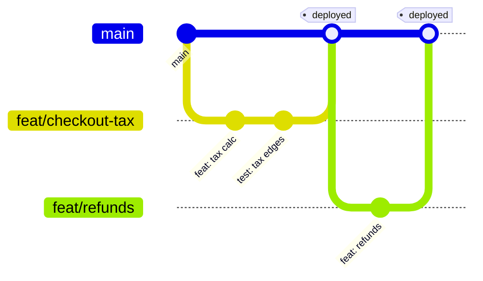
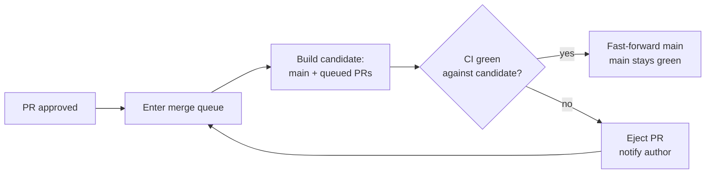

# Clean Commits & Version-Control Hygiene — Senior Level

> Focus: "Which branching model, and what does it cost the team?" "How do we keep `main` green at scale?" "How do we automate the hygiene so humans don't have to police it?" — VCS as team infrastructure: branching strategy, merge queues, enforced conventions, protected branches, secret prevention, monorepo scaling, and bisectable history as a debugging asset.

At junior and middle levels, clean commits are a personal discipline. At senior level they become **team infrastructure**: a branching model with measurable delivery consequences, automation that enforces conventions so review bandwidth isn't spent on them, and guardrails (protected branches, merge queues, secret scanning) that make the *cheap* path also the *correct* path. The job is no longer "write a good commit" — it's "design a system where good commits are the only commits that reach `main`."

---

## Table of Contents

1. [Branching model as a delivery decision](#branching-model-as-a-delivery-decision)
2. [Keeping `main` green: merge queues and the not-rocket-science rule](#keeping-main-green-merge-queues-and-the-not-rocket-science-rule)
3. [Enforcing commit conventions: commitlint, Conventional Commits, semantic-release](#enforcing-commit-conventions-commitlint-conventional-commits-semantic-release)
4. [Protected branches, required checks, and signed commits](#protected-branches-required-checks-and-signed-commits)
5. [`.git-blame-ignore-revs`: keeping blame honest through reformats](#git-blame-ignore-revs-keeping-blame-honest-through-reformats)
6. [Monorepo VCS hygiene at scale](#monorepo-vcs-hygiene-at-scale)
7. [Preventing secret commits — and purging them when they leak](#preventing-secret-commits--and-purging-them-when-they-leak)
8. [Bisect-driven debugging on a clean history](#bisect-driven-debugging-on-a-clean-history)
9. [Release tagging and semantic versioning](#release-tagging-and-semantic-versioning)
10. [Common Mistakes](#common-mistakes)
11. [Test Yourself](#test-yourself)
12. [Cheat Sheet](#cheat-sheet)
13. [Summary](#summary)
14. [Further Reading](#further-reading)
15. [Related Topics](#related-topics)

---

## Branching model as a delivery decision

Branching strategy is not a style preference. It directly shapes the four DORA metrics (deployment frequency, lead time for changes, change-fail rate, time to restore). The two dominant models trade off in opposite directions.

| | **Trunk-based development** | **GitFlow** |
|---|---|---|
| Integration | All work merges to `main` (trunk) within hours to ~1 day | Work lives on `develop`, `feature/*`, `release/*`, `hotfix/*` |
| Branch lifetime | Hours to a day | Days to weeks |
| Merge conflicts | Small, frequent, cheap | Large, infrequent, expensive |
| Release | Continuous; deploy from `main` behind flags | Cut from `release/*`, stabilize, then merge to `main` |
| Best fit | CI/CD, feature flags, high deploy frequency | Scheduled releases, versioned/installed software, manual QA gates |
| DORA correlation | Strongly correlated with **elite** performers | Associated with lower deploy frequency, longer lead time |

The DORA research program (*Accelerate*, Forsgren/Humble/Kim, and the annual *State of DevOps* reports) consistently finds that teams integrating to trunk at least daily, with branches living less than a day, outperform on deployment frequency and lead time. The mechanism is mechanical, not cultural: **short-lived branches diverge less, so they merge cleanly, so integration stops being an event.** GitFlow's `develop`/`release` ceremony is the opposite — divergence is the default and integration is a scheduled crisis.

### Trunk-based + short-lived branches + CI

The pragmatic team default for SaaS:



The decoupling trick that makes this work: **deploy is not release.** Merge incomplete features behind a flag (see [`../23-configuration-and-feature-flags/README.md`](../23-configuration-and-feature-flags/README.md)). Code reaches `main` and production continuously; the *feature* turns on independently. This is what lets branches stay short without forcing half-built features on users.

> **When GitFlow is still right:** you ship versioned artifacts to customers who install them (desktop apps, libraries, on-prem appliances, firmware). You genuinely maintain multiple versions in parallel (1.x security fixes while 2.x develops). There, `release/*` and `hotfix/*` branches model real, long-lived release lines — they aren't ceremony, they're the domain.

---

## Keeping `main` green: merge queues and the not-rocket-science rule

A green `main` is the foundation everything else rests on: if `main` is broken, every branch cut from it inherits the breakage, every bisect is poisoned, and "is this my bug or a pre-existing one?" becomes unanswerable.

### Why "CI passed on the branch" is not enough

CI green on a feature branch only proves the branch passes **against the `main` it branched from**. But by merge time, `main` has moved. Two PRs can each pass independently yet break when combined — a *semantic* conflict that Git's textual merge happily accepts:

```
main:     def total(items): return sum(i.price for i in items)
PR #1:    renames .price -> .amount    (passes alone)
PR #2:    adds  discount(items, items[0].price)  (passes alone)
merge both -> AttributeError: 'Item' has no attribute 'price'
```

No textual conflict. Both PRs green. `main` red.

### The not-rocket-science rule

Graydon Hoare's formulation, the engine behind Rust's `bors`/`homu` and the original "merge bot":

> **The not-rocket-science rule of software engineering: automatically maintain a repository of code that always passes all the tests.**

The implementation: never merge a PR by testing it in isolation. Test it **against the exact code that will be `main` after the merge**, and only merge if that passes. A merge queue does this automatically.

### Merge queues (GitHub merge queue, Mergify, Rust's bors)

A merge queue serializes integration. When a PR is approved and queued, the queue:

1. Creates a candidate = `main` + this PR (+ any PRs ahead of it in the queue).
2. Runs the full CI suite against that candidate.
3. If green, fast-forwards `main` to the candidate. If red, ejects the offending PR and tells the author.



GitHub merge queue configuration (enabled in the `main` branch-protection rule):

```yaml
# Settings -> Branches -> branch protection for `main`: "Require merge queue"
merge_queue:
  merge_method: squash            # one tidy commit per PR on main
  min_entries_to_merge: 1
  max_entries_to_merge: 5         # batch up to 5 PRs per CI run for throughput
  min_entries_to_merge_wait_minutes: 5
  status_check_failure_action: REMOVE_FROM_QUEUE
```

The **batching** (`max_entries_to_merge`) is the throughput lever: testing 5 PRs as one candidate costs one CI run instead of five. If the batch fails, the queue bisects the batch to find the culprit and re-queues the innocents. This is how high-volume monorepos (hundreds of merges/day) keep `main` green without serializing every single PR through a full CI run.

> **Trade-off:** a merge queue adds latency between "approved" and "merged" (you wait for a CI run on the candidate). For elite teams this is acceptable insurance; the alternative — a red `main` blocking the whole team — is far more expensive. Tune batch size to balance latency vs. CI cost.

---

## Enforcing commit conventions: commitlint, Conventional Commits, semantic-release

A convention nobody enforces is a suggestion. Senior-level hygiene means the convention is checked by a machine, and the machine's output *does work for you* — generating changelogs and version bumps automatically.

### Conventional Commits

A lightweight grammar over the commit subject:

```
<type>[optional scope][!]: <description>

[optional body]

[optional footer(s)]
```

```
feat(checkout): add VAT calculation for EU orders

Adds per-country VAT rates loaded from config. Falls back to
zero-rate for non-EU regions to preserve existing behavior.

Refs: PROJ-1421
```

Types carry semantic-version meaning: `fix:` → patch, `feat:` → minor, and a `!` or `BREAKING CHANGE:` footer → major. The full set typically used: `feat`, `fix`, `docs`, `style`, `refactor`, `perf`, `test`, `build`, `ci`, `chore`, `revert`.

### Enforce with commitlint + Husky

`commitlint.config.js`:

```js
module.exports = {
  extends: ['@commitlint/config-conventional'],
  rules: {
    'type-enum': [2, 'always', [
      'feat', 'fix', 'docs', 'style', 'refactor',
      'perf', 'test', 'build', 'ci', 'chore', 'revert',
    ]],
    'scope-empty': [2, 'never'],            // require a scope
    'subject-case': [2, 'never', ['sentence-case', 'start-case', 'pascal-case', 'upper-case']],
    'subject-full-stop': [2, 'never', '.'], // no trailing period
    'header-max-length': [2, 'always', 72],
    'body-max-line-length': [2, 'always', 100],
  },
};
```

Wire it to the `commit-msg` hook (Husky):

```bash
# .husky/commit-msg
npx --no -- commitlint --edit "$1"
```

Belt-and-suspenders in CI — local hooks can be skipped with `--no-verify`, so check on the server too:

```yaml
# .github/workflows/commitlint.yml
name: Lint commits
on: [pull_request]
jobs:
  commitlint:
    runs-on: ubuntu-latest
    steps:
      - uses: actions/checkout@v4
        with: { fetch-depth: 0 }
      - uses: wagoid/commitlint-github-action@v6
```

### Automated changelog and releases: semantic-release

Once messages are structured, releases become a pure function of history. `semantic-release` reads commits since the last tag, computes the next version per SemVer, generates the changelog, tags, and publishes — with **no human deciding the version number**.

`.releaserc.json`:

```json
{
  "branches": ["main", { "name": "next", "prerelease": true }],
  "plugins": [
    "@semantic-release/commit-analyzer",
    "@semantic-release/release-notes-generator",
    ["@semantic-release/changelog", { "changelogFile": "CHANGELOG.md" }],
    "@semantic-release/npm",
    ["@semantic-release/github", { "successComment": false }],
    ["@semantic-release/git", {
      "assets": ["CHANGELOG.md", "package.json"],
      "message": "chore(release): ${nextRelease.version} [skip ci]\n\n${nextRelease.notes}"
    }]
  ]
}
```

```yaml
# .github/workflows/release.yml
name: Release
on:
  push:
    branches: [main]
permissions:
  contents: write        # tag + push CHANGELOG
  issues: write          # comment on resolved issues
jobs:
  release:
    runs-on: ubuntu-latest
    steps:
      - uses: actions/checkout@v4
        with: { fetch-depth: 0, persist-credentials: false }
      - uses: actions/setup-node@v4
        with: { node-version: 20 }
      - run: npm ci
      - run: npx semantic-release
        env:
          GITHUB_TOKEN: ${{ secrets.GITHUB_TOKEN }}
          NPM_TOKEN: ${{ secrets.NPM_TOKEN }}
```

The payoff: a `fix:` commit silently ships a patch; a `feat:` ships a minor; a `BREAKING CHANGE:` footer ships a major and headlines the changelog. The convention is no longer paperwork — it *is* the release pipeline. This closes the loop with squash-merge: each PR becomes one Conventional Commit on `main`, so the PR title is the unit semantic-release reads.

---

## Protected branches, required checks, and signed commits

Branch protection is the policy layer that makes the rules above non-optional.

```yaml
# Branch protection for `main` (GitHub REST: PUT /repos/{owner}/{repo}/branches/main/protection)
required_status_checks:
  strict: true                      # branch must be up to date before merge
  contexts:
    - "ci/build"
    - "ci/test"
    - "commitlint"
    - "gitleaks"
enforce_admins: true                # rules apply to admins too — no bypass
required_pull_request_reviews:
  required_approving_review_count: 1
  require_code_owner_reviews: true  # CODEOWNERS must approve
  dismiss_stale_reviews: true       # new pushes invalidate old approvals
required_signatures: true           # all commits must be signed
required_linear_history: true       # no merge commits — squash/rebase only
allow_force_pushes: false           # cannot rewrite shared history
allow_deletions: false
required_conversation_resolution: true
```

Key choices and why:

- **`enforce_admins: true`** — the most-skipped setting and the most important. Rules that admins can bypass are rules that get bypassed at 2 a.m. under pressure.
- **`dismiss_stale_reviews: true`** — an approval is for the code that was reviewed; a force-push of new code is not that code.
- **`required_linear_history`** — keeps `main` a straight line, which is what makes `git bisect` and `git log --oneline` legible. Pairs with squash or rebase merging.
- **`require_code_owner_reviews`** — the people who own a path must sign off on changes to it (see CODEOWNERS below).

Branch protection is what mechanically enforces "never rewrite shared history" — the rule introduced in [`junior.md`](junior.md) becomes server-side policy rather than a hope.

### Signed commits

Signing proves *who* authored a commit — Git's `author` field is free text and trivially forged (`git commit --author="Linus Torvalds <torvalds@example.com>"`). Two mechanisms:

```bash
# GPG signing
git config --global user.signingkey <KEYID>
git config --global commit.gpgsign true

# SSH signing (simpler — reuses your SSH key, supported since Git 2.34)
git config --global gpg.format ssh
git config --global user.signingkey ~/.ssh/id_ed25519.pub
git config --global commit.gpgsign true
```

With `required_signatures: true`, GitHub shows a green **Verified** badge and *rejects* unsigned pushes to `main`. For supply-chain integrity, pair with Sigstore `gitsign` for keyless signing — ephemeral certs tied to an OIDC identity, so there are no long-lived keys to leak.

---

## `.git-blame-ignore-revs`: keeping blame honest through reformats

The single biggest enemy of `git blame` is the bulk reformat. The day you adopt Prettier, Black, or gofmt across the repo, one commit rewrites every line — and `git blame` now attributes the entire codebase to "chore: apply formatter" by one person on one day. Years of authorship context, gone.

The fix: a file listing format-only commits that blame should *skip through*.

```
# .git-blame-ignore-revs
# Bulk-applied Prettier across the codebase
a1b2c3d4e5f6a7b8c9d0e1f2a3b4c5d6e7f8a9b0
# Migrated to Black 24.x
0f1e2d3c4b5a69788776655443322110ffeeddcc
```

Configure Git to honor it always (committed config so the whole team benefits):

```bash
git config blame.ignoreRevsFile .git-blame-ignore-revs
```

GitHub's blame view honors this file automatically. Now `git blame` skips the reformat commit and shows the *real* last author of each line's content. This is what lets you treat formatting as a settled, automated concern (see [`../04-formatting/README.md`](../04-formatting/README.md)) without sacrificing history.

> **Discipline:** a commit listed here must be **purely** mechanical — formatter output only, zero logic changes. Mixing a real change into a format commit poisons the well: blame skips it, hiding a genuine authorship. Keep format commits separate and atomic.

---

## Monorepo VCS hygiene at scale

A monorepo concentrates the entire org's history in one repo. Without specific hygiene, clone time, CI cost, and ownership ambiguity all explode.

### Sparse-checkout and partial clone

You rarely need the whole monorepo on disk. Modern Git lets you fetch only what you touch:

```bash
# Partial clone: skip blob contents until needed (history graph only)
git clone --filter=blob:none --sparse https://github.com/org/monorepo.git
cd monorepo

# Sparse-checkout: only materialize the directories you work in
git sparse-checkout init --cone
git sparse-checkout set services/checkout libs/money
```

`--filter=blob:none` defers downloading file *contents* (blobs) until a command actually needs them — turning a multi-GB clone into seconds. `--sparse` with cone mode populates only the listed subtrees in the working directory. Together they make a 50 GB monorepo feel like a small repo for someone working on one service.

### CODEOWNERS — ownership as code

```
# .github/CODEOWNERS  (matched bottom-to-top; last match wins)
*                       @org/platform-team
/services/checkout/     @org/payments-team
/services/checkout/tax/ @org/tax-squad     @alice
/libs/money/            @org/payments-team
*.tf                    @org/infra-team
/.github/               @org/platform-team
```

With `require_code_owner_reviews` enabled, a PR touching `/services/checkout/tax/` *cannot merge* without an approval from `@org/tax-squad` or `@alice`. Ownership stops being tribal knowledge and becomes an enforced, greppable contract.

### Path-based CI

The cardinal monorepo CI sin is running every test for every change. Scope CI to what changed:

```yaml
# .github/workflows/checkout-ci.yml
name: Checkout CI
on:
  pull_request:
    paths:
      - 'services/checkout/**'
      - 'libs/money/**'          # checkout depends on money
      - '.github/workflows/checkout-ci.yml'
jobs:
  test:
    runs-on: ubuntu-latest
    steps:
      - uses: actions/checkout@v4
      - run: make -C services/checkout test
```

For dependency-aware selection beyond glob paths, dedicated build tools (Bazel, Nx, Turborepo, Pants) compute the *actual* affected target graph from the dependency DAG — far more precise than path globs, and the standard at large scale. The principle is the same: **a one-line change to one service must not trigger the org's entire test suite.**

---

## Preventing secret commits — and purging them when they leak

A committed secret is a leaked secret — Git history is forever, and a force-push to hide it doesn't help once anyone has fetched it or it hit a public mirror. Defense is layered: stop it at commit time, catch it in CI, scan at the platform, and have a tested purge-and-rotate runbook for when all three fail.

### Layer 1 — pre-commit hook (stop it on the developer's machine)

```yaml
# .pre-commit-config.yaml  (https://pre-commit.com)
repos:
  - repo: https://github.com/gitleaks/gitleaks
    rev: v8.18.4
    hooks:
      - id: gitleaks
  - repo: https://github.com/Yelp/detect-secrets
    rev: v1.5.0
    hooks:
      - id: detect-secrets
        args: ['--baseline', '.secrets.baseline']
```

```bash
pre-commit install   # installs the git hook; runs on every commit
```

### Layer 2 — CI scan (catch what `--no-verify` skipped)

```yaml
# .github/workflows/gitleaks.yml
name: gitleaks
on: [pull_request]
jobs:
  scan:
    runs-on: ubuntu-latest
    steps:
      - uses: actions/checkout@v4
        with: { fetch-depth: 0 }      # full history so it scans the whole diff range
      - uses: gitleaks/gitleaks-action@v2
        env:
          GITLEAKS_LICENSE: ${{ secrets.GITLEAKS_LICENSE }}
```

`gitleaks` and `trufflehog` both scan diffs and history for high-entropy strings and known credential patterns (AWS keys, JWTs, private keys). `trufflehog` additionally **verifies** found credentials against the live provider API — distinguishing a real, active AWS key from a defused example string, which slashes false positives.

### Layer 3 — platform scanning

Enable **GitHub secret scanning** + **push protection** at the org level. Push protection *blocks the push itself* when it detects a recognized secret pattern, and partner providers (AWS, Stripe, etc.) auto-revoke leaked tokens GitHub reports to them.

### Layer 4 — the leak happened. Purge history and rotate.

If a secret reaches a shared branch, the *first* action is **rotate the credential** — assume it's compromised. Purging history is secondary cleanup, not the fix.

```bash
# BFG Repo-Cleaner — purpose-built, far faster than git filter-branch
java -jar bfg.jar --replace-text secrets.txt repo.git
# or remove a file entirely:
java -jar bfg.jar --delete-files id_rsa repo.git

cd repo.git
git reflog expire --expire=now --all
git gc --prune=now --aggressive
git push --force --all     # rewrites history — coordinate with the whole team
```

> **Order of operations:** **rotate first, purge second.** History rewriting is destructive and disruptive (everyone must re-clone or hard-reset), and it does nothing about copies already pulled by attackers. The leaked key must be dead before you spend a minute on the rewrite. Modern alternative to BFG: `git filter-repo` (the maintained successor to `git filter-branch`).

---

## Bisect-driven debugging on a clean history

`git bisect` binary-searches your history for the commit that introduced a bug: O(log n) commits to check among n. A regression hidden somewhere in 1,000 commits is found in ~10 steps. **But bisect is only as good as your history.** Every kitchen-sink commit, every red `main`, every "WIP" commit degrades or breaks it — which is the practical, dollars-and-cents argument for atomic commits and a green trunk.

```bash
git bisect start
git bisect bad                 # current HEAD is broken
git bisect good v2.3.0         # this tag was fine
# Git checks out the midpoint; you test and tell it:
git bisect good                # ... or `git bisect bad`
# repeat until Git names the first bad commit
git bisect reset
```

Automate it fully with a script that exits 0 (good) / 1 (bad):

```bash
git bisect start HEAD v2.3.0
git bisect run ./scripts/repro-bug.sh
# Git drives the whole search; prints "<sha> is the first bad commit"
```

Why clean history makes or breaks this:

- **Atomic commits** → the named commit is a *single logical change*, so you know exactly what broke. A kitchen-sink commit identifies "the commit where I did five things" — useless.
- **Green `main`** → every midpoint is buildable and testable. If random commits don't even compile, `git bisect run` returns "skip" storms and the search stalls. (Use `git bisect skip` for the unavoidable broken ones, but a clean trunk has almost none.)
- **Linear history** → no merge-commit ambiguity about which parent introduced the change.

This is the concrete return on every hygiene rule in this chapter: when production breaks at 3 a.m., a clean history turns an all-hands archaeology dig into a ten-minute automated search.

---

## Release tagging and semantic versioning

### SemVer as a contract

`MAJOR.MINOR.PATCH` is a promise to consumers, not a vibe:

- **MAJOR** — incompatible API changes. You may break callers.
- **MINOR** — backward-compatible new functionality.
- **PATCH** — backward-compatible bug fixes.

The Conventional Commits → semantic-release pipeline above *derives* this automatically: `fix:` bumps PATCH, `feat:` bumps MINOR, `BREAKING CHANGE:` bumps MAJOR. The version number stops being a judgment call and becomes a deterministic function of the commit log.

### Annotated, signed tags

Tag releases with **annotated** tags (they carry a message, tagger, and date and are themselves objects), not lightweight tags:

```bash
git tag -s v2.4.0 -m "Release 2.4.0"   # -s signs the tag
git push origin v2.4.0
```

Annotated + signed tags are the verifiable anchor a release artifact is built from. CI builds *from the tag*, attaches the changelog, and publishes — the tag is the immutable provenance record. Never move a published tag; consumers and build caches treat `v2.4.0` as permanent. If a release is bad, ship `v2.4.1`, don't re-point `v2.4.0`.

---

## Common Mistakes

- **Treating branching strategy as a style choice.** It's a delivery-performance decision with DORA evidence behind it. Defaulting to GitFlow for a SaaS app that deploys daily imposes integration ceremony the team doesn't need and pays for in lead time.
- **Trusting "CI green on the branch" to keep `main` green.** It only proves the branch passed against an *old* `main`. Semantic conflicts merge cleanly and break trunk. A merge queue testing the post-merge candidate is the only real guarantee.
- **Enforcing commit conventions by code review.** Humans policing `feat:` vs `fix:` is wasted review bandwidth and inconsistent. Machine-enforce with commitlint locally *and* in CI (local hooks are skippable with `--no-verify`).
- **Leaving `enforce_admins` off.** Branch protection that admins can bypass is theater. The bypass *will* be used under deadline pressure, by exactly the senior people whose mistakes are costliest.
- **Bulk-reformatting without `.git-blame-ignore-revs`.** One Prettier/Black commit destroys years of blame context. Always pair a mechanical reformat with a blame-ignore entry — and keep that commit free of any logic change.
- **Hiding a leaked secret by force-pushing.** The credential is already compromised the moment it's pushed. Rotate first, always; purge history second; never assume the rewrite "cleaned" it.
- **Running the whole test suite for every monorepo change.** Without path-based or dependency-graph-scoped CI, a typo fix in one service runs the org's entire suite — minutes of feedback become hours, and CI cost balloons.
- **Long-lived feature branches as a habit.** Weeks of divergence guarantee a painful merge and a non-bisectable mega-commit. If the feature is big, merge it incrementally behind a flag — don't hoard it on a branch.
- **Moving a published tag.** `v2.4.0` is immutable provenance. Re-pointing it silently changes what consumers and caches resolve to. Always cut a new version.

---

## Test Yourself

1. **Two PRs each pass CI on their own branch, both get approved and merged within a minute of each other, and `main` immediately goes red. What happened, and what mechanism prevents it?**

<details><summary>Answer</summary>

A **semantic conflict**: each PR passed against the `main` it branched from, but combined they break (e.g., one renames a field the other now references). Git's textual merge finds no conflict, so both merge cleanly and trunk breaks. The prevention is a **merge queue** implementing the not-rocket-science rule: instead of testing each PR in isolation, it builds a candidate = `main` + the queued PR(s) and runs CI against *that*, fast-forwarding `main` only if the post-merge state is green. The second PR would have been tested against `main`-with-PR-#1 and ejected before it could break trunk.

</details>

2. **Your team is adopting trunk-based development but worries that merging incomplete features to `main` will ship broken functionality to users. How do you reconcile short-lived branches with not shipping half-built features?**

<details><summary>Answer</summary>

Decouple **deploy** from **release**. Merge incomplete work to `main` behind a **feature flag** that defaults off. The code reaches `main` and production continuously (so branches stay short and integration stays cheap), but the *feature* is dark until you flip the flag — independent of deployment. This is the central enabling practice of trunk-based development; without it, "merge to trunk daily" and "don't ship unfinished features" genuinely do conflict.

</details>

3. **Why does a merge queue let you batch multiple PRs into a single CI run, and what does it do when a batch of five fails?**

<details><summary>Answer</summary>

Batching builds one candidate = `main` + all five queued PRs and runs CI once instead of five times — a throughput optimization for high-volume repos. If the batch fails, a single PR has poisoned it, so the queue **bisects the batch** to identify the culprit, ejects it (notifies the author), and re-queues the four innocent PRs to merge. Net effect: cheap CI in the common (passing) case, with correctness preserved when something breaks.

</details>

4. **A developer applies Black across the entire repo in one commit. Six months later you `git blame` a file and every line points to that reformat commit. What went wrong and what's the fix?**

<details><summary>Answer</summary>

The bulk reformat rewrote every line, so blame attributes all content to the format commit — destroying real authorship history. The fix: add that commit's SHA to **`.git-blame-ignore-revs`** and set `git config blame.ignoreRevsFile .git-blame-ignore-revs` (committed so the team and GitHub both honor it). Blame then skips through the reformat to the real last author of each line's content. The prerequisite discipline: the reformat commit must be *purely mechanical* — no logic mixed in — or skipping it would hide a genuine change.

</details>

5. **A secret was committed and pushed to a shared branch an hour ago. List your actions in order and justify the ordering.**

<details><summary>Answer</summary>

(1) **Rotate the credential immediately** — it's compromised the moment it's pushed; anyone who fetched it, or any mirror/log, may have it. (2) **Purge it from history** with BFG or `git filter-repo`, then `reflog expire` + `gc --prune=now` + force-push, coordinating with the team to re-clone. (3) **Add prevention** so it can't recur: pre-commit gitleaks hook, CI scan, and GitHub push protection. Rotation is first because history rewriting is destructive, disruptive, and does *nothing* about copies already taken — only killing the live credential actually closes the exposure.

</details>

6. **Explain concretely how atomic commits and a green `main` change the cost of finding a regression introduced somewhere in the last 1,000 commits.**

<details><summary>Answer</summary>

`git bisect` binary-searches the range, so it finds the culprit in ~log₂(1000) ≈ 10 checks regardless of range size. Two hygiene properties make that work. **Green `main`** guarantees every midpoint commit builds and runs, so `git bisect run <script>` can drive the whole search automatically instead of stalling on commits that don't compile. **Atomic commits** mean the commit `bisect` names is a single logical change — you immediately know *what* broke. Without them, bisect either stalls on broken midpoints or fingers a kitchen-sink commit that did five things, leaving you no wiser. So clean history turns an O(n) manual hunt into an O(log n) automated one.

</details>

7. **Why enforce commit conventions in CI when you already have a local Husky `commit-msg` hook?**

<details><summary>Answer</summary>

Local hooks are advisory — any developer can bypass them with `git commit --no-verify`, and they don't run at all for commits made via the web UI or other tooling. CI runs on the server where it can't be skipped, so it's the actual gate. The local hook gives fast feedback (catch it before pushing); the CI check gives the guarantee. You want both: the hook for ergonomics, the CI check (wired into branch protection's `required_status_checks`) for enforcement. Because semantic-release derives versions from those messages, an unchecked bad message can corrupt the release pipeline.

</details>

8. **When is GitFlow the right choice over trunk-based development, despite its weaker DORA numbers?**

<details><summary>Answer</summary>

When you ship versioned, installed artifacts to customers (desktop apps, libraries, on-prem appliances, firmware) and must maintain multiple released versions in parallel — e.g., security patches to 1.x while 2.x is in development. There, `release/*` and `hotfix/*` branches model genuinely long-lived release lines, not ceremony. DORA's deploy-frequency advantage assumes you *can* deploy continuously to one production environment; a vendor maintaining five supported major versions in the field has a different problem that long-lived branches actually fit. The lesson is to match the model to the delivery context, not to cargo-cult either one.

</details>

---

## Cheat Sheet

| Concern | Tool / mechanism | Key setting |
|---|---|---|
| Branching model | Trunk-based + short-lived branches | Branch lifetime < 1 day; merge behind feature flags |
| Keep `main` green | Merge queue (GitHub / Mergify / bors) | Test the post-merge candidate; batch + bisect on failure |
| Commit grammar | Conventional Commits + commitlint | `commit-msg` hook **and** CI check |
| Automated releases | semantic-release | Version derived from `fix:`/`feat:`/`BREAKING CHANGE:` |
| Branch policy | GitHub branch protection | `enforce_admins`, `required_signatures`, `required_linear_history`, no force-push |
| Authorship integrity | GPG / SSH / Sigstore `gitsign` | `commit.gpgsign true` + `required_signatures` |
| Honest blame | `.git-blame-ignore-revs` | `git config blame.ignoreRevsFile`; format commits only |
| Monorepo clone size | Partial clone + sparse-checkout | `--filter=blob:none --sparse`; cone mode |
| Monorepo ownership | CODEOWNERS + `require_code_owner_reviews` | Last matching pattern wins |
| Monorepo CI cost | Path-based triggers / Bazel/Nx affected graph | `on.pull_request.paths` or dependency DAG |
| Stop secrets | pre-commit gitleaks/detect-secrets + CI scan + push protection | `fetch-depth: 0` for history scans |
| Verify secrets | trufflehog | Live-API verification cuts false positives |
| Purge a leak | Rotate first, then BFG / `git filter-repo` | `reflog expire` + `gc --prune=now` + force-push |
| Find a regression | `git bisect run <script>` | Needs green, atomic, linear history |
| Release marking | Annotated **signed** tags + SemVer | `git tag -s`; never move a published tag |

---

## Summary

At senior scale, version-control hygiene is a system you design, not a habit you practice. The branching model is a delivery decision with DORA evidence behind it: trunk-based development with short-lived branches and feature flags drives deploy frequency and lead time, while GitFlow earns its keep only for versioned, installed software with parallel release lines. A green `main` is the load-bearing invariant, and the not-rocket-science rule — test the post-merge candidate, never the isolated branch — implemented by a merge queue is what guarantees it against semantic conflicts that pass on each branch alone. Conventions stop being suggestions when commitlint enforces Conventional Commits both locally and in CI, and that structure pays for itself by powering automated changelogs and semantic-release. Protected branches (`enforce_admins`, signed commits, linear history, no force-push) make the rules non-optional; `.git-blame-ignore-revs` keeps blame honest through unavoidable reformats; monorepo hygiene (partial clone, sparse-checkout, CODEOWNERS, path-based CI) keeps a giant repo fast and accountable. Layered secret defenses — and a rotate-first purge runbook — keep credentials out of history. The dividend on all of it is `git bisect`: a clean, atomic, green, linear history turns a 3 a.m. regression hunt into a ten-minute automated search.

---

## Further Reading

- *Accelerate: The Science of Lean Software and DevOps* — Forsgren, Humble, Kim. The empirical basis for trunk-based development's delivery advantages.
- Google's annual *State of DevOps* (DORA) reports — branching and delivery metrics over time.
- "The Not Rocket Science Rule of Software Engineering" — Graydon Hoare's original post on always-green repositories.
- Conventional Commits specification — `conventionalcommits.org`.
- semantic-release documentation — automated, commit-driven releases.
- "Trunk-Based Development" — Paul Hammant, `trunkbaseddevelopment.com`.
- Pro Git, chapters on `git bisect`, signed tags, and history rewriting.
- gitleaks, trufflehog, and BFG Repo-Cleaner project documentation; GitHub secret scanning + push protection docs.
- Sigstore `gitsign` — keyless commit signing tied to OIDC identity.

---

## Related Topics

- [`junior.md`](junior.md) — atomic commits, message anatomy, never rewriting shared history.
- [`middle.md`](middle.md) — interactive rebase, squashing, conflict resolution, PR hygiene.
- [`professional.md`](professional.md) — org-wide policy, supply-chain provenance, governance at scale.
- [`../README.md`](../README.md) — the Clean Code chapter index and positive rules for commits.
- [`../17-code-reviews/README.md`](../17-code-reviews/README.md) — the etiquette and tempo of reviewing; this chapter shapes the record you hand the reviewer.
- [`../04-formatting/README.md`](../04-formatting/README.md) — automated formatting, the precondition for clean format-only commits and `.git-blame-ignore-revs`.
- [`../23-configuration-and-feature-flags/README.md`](../23-configuration-and-feature-flags/README.md) — feature flags, the practice that makes short-lived trunk branches safe.
- [`../../refactoring/README.md`](../../refactoring/README.md) — refactors belong in their own commits, separate from behavior changes.
- [`../../anti-patterns/README.md`](../../anti-patterns/README.md) — the smells (kitchen-sink commits, commented-out code) this chapter prevents.
