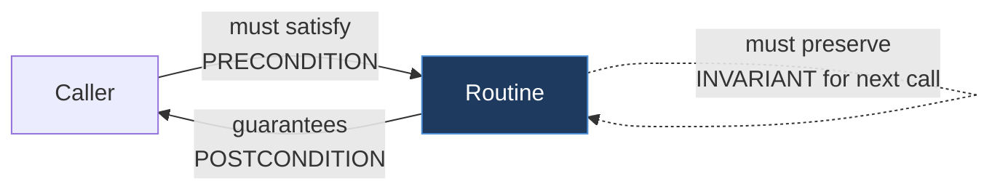

# Design by Contract — Find the Bug

> 12 buggy snippets where a **broken or missing contract** causes a real bug. A precondition the callee never checked, a postcondition the method silently violates, a class invariant one method leaves out of sync, a subtype that strengthens a precondition and crashes polymorphic code. Find the broken clause first; the fix is almost always *state the contract and enforce it at the right end*.

A contract has three clauses:

- **Precondition** — what the *caller* must guarantee before calling. Violating it is the **caller's** fault.
- **Postcondition** — what the *callee* guarantees on return, given the precondition held. Violating it is the **callee's** fault.
- **Invariant** — what every public method must preserve for the object between calls. Violating it is the **method's** fault and poisons the *next* call.



When an assertion at one of these three points fails, the clause tells you *who to blame* — which is exactly the information a stack trace alone hides.

---

## Table of Contents

1. [Postcondition lie: `@return never null` returns null](#snippet-1--postcondition-lie-return-never-null-returns-null-java) — Java
2. [Unchecked precondition corrupts state downstream](#snippet-2--unchecked-precondition-corrupts-state-downstream-python) — Python
3. [Invariant drift: balance and history out of sync](#snippet-3--invariant-drift-balance-and-history-out-of-sync-java) — Java
4. [LSP break: subtype strengthens a precondition](#snippet-4--lsp-break-subtype-strengthens-a-precondition-python) — Python
5. [Assertion validates external input, stripped in prod](#snippet-5--assertion-validates-external-input-stripped-in-prod-python) — Python
6. [Postcondition true at return, invariant broken for next call](#snippet-6--postcondition-true-at-return-invariant-broken-for-next-call-go) — Go
7. [Over-strict precondition rejects a valid edge case](#snippet-7--over-strict-precondition-rejects-a-valid-edge-case-java) — Java
8. [`old`/before-vs-after expectation broken by aliasing](#snippet-8--oldbefore-vs-after-expectation-broken-by-aliasing-python) — Python
9. [Double-checking that drifts: caller and callee disagree](#snippet-9--double-checking-that-drifts-caller-and-callee-disagree-go) — Go
10. [Subtype weakens a postcondition](#snippet-10--subtype-weakens-a-postcondition-java) — Java
11. [Contract-as-comment never enforced or tested](#snippet-11--contract-as-comment-never-enforced-or-tested-go) — Go
12. [Precondition checked after the side effect](#snippet-12--precondition-checked-after-the-side-effect-python) — Python

---

## How to Use

For each snippet: read the code and its stated (or implied) contract, decide **which clause is broken and who is to blame**, then open the answer. The answer names the violated clause, traces the resulting bug to where it surfaces, and gives the fix. The hard part is usually not spotting the crash — it is locating the *contract* the crash descends from, often several frames away.

Track your score in the [Scorecard](#scorecard).

---

## Snippet 1 — Postcondition lie: `@return never null` returns null (Java)

**Difficulty: ●○○ (warm-up)**

```java
public final class UserDirectory {

    private final Map<String, User> byId = new HashMap<>();

    /**
     * Look up a user by id.
     *
     * @param id non-null, non-blank user id (precondition)
     * @return the user; never null — callers may dereference safely (postcondition)
     */
    public User find(String id) {
        return byId.get(id);
    }
}

// Caller relies on the documented postcondition:
String displayName = directory.find(currentUserId).getName().toUpperCase();
```

**What's wrong?**

<details><summary>Answer</summary>

**Broken clause: postcondition.** The Javadoc promises `@return ... never null`, but `Map.get` returns `null` for an absent key. The method ships a guarantee it does not keep.

**The bug:** the caller trusts the contract and chains `.getName()` directly with no null check — exactly what "never null" invites. The first lookup of an unknown id throws `NullPointerException` at `.getName()`, *one frame away from the real fault*. The stack trace blames the caller; the contract violation is in `find`.

**Who is to blame:** the callee. It advertised a postcondition it cannot satisfy with this implementation.

**Fix — make the signature honest.** Either *enforce* the postcondition (throw on miss) or *change* it to admit absence. Pick based on whether "not found" is a programmer bug or an expected case.

```java
/** @return the user; never null. @throws NoSuchElementException if no such user. */
public User find(String id) {
    User u = byId.get(id);
    if (u == null) {
        throw new NoSuchElementException("no user: " + id);
    }
    return u; // postcondition now genuinely holds
}

/** @return the user, or empty if absent. */
public Optional<User> lookup(String id) {
    return Optional.ofNullable(byId.get(id));
}
```

The type now carries the contract. `Optional` makes the absence case un-ignorable; the throwing variant keeps the "never null" promise true.
</details>

---

## Snippet 2 — Unchecked precondition corrupts state downstream (Python)

**Difficulty: ●●○ (medium)**

```python
class Ledger:
    def __init__(self):
        self.entries: list[tuple[str, int]] = []
        self.balance_cents = 0

    def post(self, memo: str, amount_cents: int) -> None:
        """
        Precondition: amount_cents is a whole number of cents (int), may be
        negative for debits. Caller must convert dollars to cents first.
        """
        self.entries.append((memo, amount_cents))
        self.balance_cents += amount_cents


# Caller in a different module, written by someone who forgot the unit:
ledger = Ledger()
ledger.post("coffee", 4.50)        # dollars, not cents
ledger.post("refund", -1.25)       # dollars, not cents
print(ledger.balance_cents)         # 3.25 ... a float, in a "cents" field
```

**What's wrong?**

<details><summary>Answer</summary>

**Broken clause: precondition, unchecked.** The contract says `amount_cents` is a whole number of cents (`int`). The caller passes dollars as `float`. The callee never validates, so the violation flows straight into state.

**The bug:** `balance_cents` becomes `3.25` — a float in a field whose entire contract is "integer cents." Nothing crashes *here*. The corruption surfaces far downstream: a later `assert isinstance(balance_cents, int)`, a database column rejecting a non-integer, or a rounding step that turns `3.25` cents into `3` and silently loses money. The post that violated the precondition is long gone from the stack by then.

**Who is to blame:** the *caller* violated the precondition — but the callee made the violation undetectable by failing fast. In DbC, an unchecked precondition that corrupts shared state is the worst case: blame is unassignable once the bad value spreads.

**Fix — assert the precondition at the boundary so the violation is caught at its source.**

```python
def post(self, memo: str, amount_cents: int) -> None:
    if type(amount_cents) is not int:
        raise TypeError(f"amount_cents must be int cents, got {amount_cents!r}")
    self.entries.append((memo, amount_cents))
    self.balance_cents += amount_cents
```

Use `type(...) is int` rather than `isinstance` because `bool` is a subclass of `int` and `True` should not pass as 1 cent. Now `post("coffee", 4.50)` throws *at the call site*, pointing the finger at the caller who broke the contract — instead of poisoning `balance_cents` for every reader that follows.
</details>

---

## Snippet 3 — Invariant drift: balance and history out of sync (Java)

**Difficulty: ●●○ (medium)**

```java
public final class Wallet {

    private final List<Transaction> history = new ArrayList<>();
    private long balanceCents;

    // Class invariant (stated in the design doc, not the code):
    //   balanceCents == sum of every transaction amount in history

    public void deposit(long cents) {
        history.add(new Transaction("deposit", cents));
        balanceCents += cents;
    }

    public void withdraw(long cents) {
        if (cents > balanceCents) {
            throw new IllegalStateException("insufficient funds");
        }
        balanceCents -= cents;            // updates the field...
        // ...but forgets to record the transaction in history
    }

    public long balance() { return balanceCents; }

    public List<Transaction> statement() { return List.copyOf(history); }
}
```

**What's wrong?**

<details><summary>Answer</summary>

**Broken clause: class invariant.** The invariant is `balanceCents == sum(history)`. `deposit` preserves it; `withdraw` updates `balanceCents` but never appends to `history`. After any withdrawal the two fields drift apart.

**The bug:** `balance()` keeps returning the correct number, so the bug hides. It surfaces in a *different* method on a *later* call: `statement()` lists deposits only, so the printed statement's running total no longer matches `balance()`. Reconciliation, audit export, or a "sum the statement" test fails — and the method that broke the invariant (`withdraw`) is nowhere in that call's stack. Invariant bugs are non-local by nature: one method breaks the contract, a *different* method misbehaves.

**Who is to blame:** the callee — specifically the one method (`withdraw`) that failed to preserve the invariant every public method is obliged to maintain.

**Fix — funnel every mutation through a single point that preserves the invariant, and check it.**

```java
private void apply(String kind, long signedCents) {
    history.add(new Transaction(kind, signedCents));
    balanceCents += signedCents;
    assert balanceCents == history.stream().mapToLong(Transaction::amount).sum()
        : "invariant broken: balance != sum(history)";
}

public void deposit(long cents)  { apply("deposit", cents); }

public void withdraw(long cents) {
    if (cents > balanceCents) throw new IllegalStateException("insufficient funds");
    apply("withdraw", -cents);
}
```

Now there is exactly one way to mutate state, and it cannot update one field without the other. The `assert` documents the invariant *in code* and catches any future method that tries to bypass `apply`.
</details>

---

## Snippet 4 — LSP break: subtype strengthens a precondition (Python)

**Difficulty: ●●● (hard)**

```python
class RateLimiter:
    """Base contract:
       precondition for allow(): cost >= 0  (any non-negative cost accepted)
       postcondition: returns True if the request fits in the budget, else False
    """
    def __init__(self, budget: int):
        self.remaining = budget

    def allow(self, cost: int) -> bool:
        if cost <= self.remaining:
            self.remaining -= cost
            return True
        return False


class StrictRateLimiter(RateLimiter):
    def allow(self, cost: int) -> bool:
        if cost == 0:
            raise ValueError("zero-cost requests are not allowed")  # stronger precondition
        return super().allow(cost)


# Polymorphic consumer written against the BASE contract:
def admit_all(limiter: RateLimiter, requests: list[int]) -> int:
    admitted = 0
    for cost in requests:
        if limiter.allow(cost):   # base contract says cost >= 0 is always safe
            admitted += 1
    return admitted

# Works fine:        admit_all(RateLimiter(100), [10, 0, 20, 0])  -> 4
# Crashes in prod:   admit_all(StrictRateLimiter(100), [10, 0, 20, 0])
```

**What's wrong?**

<details><summary>Answer</summary>

**Broken clause: precondition, under inheritance (a Liskov Substitution violation).** The Liskov rule for contracts: a subtype may **weaken** a precondition (accept *more*) but never **strengthen** it (accept *less*). `StrictRateLimiter.allow` rejects `cost == 0`, which the base contract explicitly accepts. It demands *more* of its callers than the base did.

**The bug:** `admit_all` is written against the base contract — "any `cost >= 0` is safe to pass." It is handed a `StrictRateLimiter` (legal: it is-a `RateLimiter`) and the first `cost == 0` request throws `ValueError`, crashing a function that did everything the base contract allowed. The polymorphic caller cannot defend against this because the whole point of subtyping is that it should not need to know the concrete type.

**Who is to blame:** the subtype. It violated the substitutability contract its base type promised to every polymorphic consumer.

**Fix — a subtype must honor the base precondition.** If "zero cost" is genuinely meaningless, the right move is to handle it within the accepted domain (e.g., treat it as a trivially-allowed no-op), not to reject it:

```python
class StrictRateLimiter(RateLimiter):
    def allow(self, cost: int) -> bool:
        if cost == 0:
            return True          # honor base precondition: zero cost trivially fits
        return super().allow(cost)
```

If a stricter input domain is a real requirement, it does **not** belong on a subtype of `RateLimiter` — it is a *different* type with a *different* contract, and code that requires it should depend on that type explicitly, not receive it through a `RateLimiter`-typed parameter.
</details>

---

## Snippet 5 — Assertion validates external input, stripped in prod (Python)

**Difficulty: ●●○ (medium)**

```python
def create_account(payload: dict) -> "Account":
    """payload comes straight from an HTTP request body (untrusted)."""
    email = payload["email"]
    age = payload["age"]

    # "Validation":
    assert "@" in email, "invalid email"
    assert isinstance(age, int) and age >= 18, "must be 18+"

    return Account(email=email, age=age)
```

Deployed with `python -O app.py` (optimized mode).

**What's wrong?**

<details><summary>Answer</summary>

**Broken clause: precondition used as input validation, then compiled out.** `assert` statements are removed entirely when Python runs under `-O` (and Java's `assert` is disabled unless `-ea` is passed). Assertions are a tool for checking *programmer-error preconditions* — facts that should be impossible if the code is correct. They are **not** input validation.

**The bug:** in development the asserts fire and everything looks validated. In production under `-O`, both `assert` lines vanish. `create_account` now accepts an `email` with no `@`, a 7-year-old, or `age="banana"` — whatever the untrusted client sent. The invalid data is constructed into an `Account` and persisted. The check that "passed every test" is simply not present in the deployed binary.

**Who is to blame:** the author conflated two different contracts. A *precondition the caller must satisfy* (assert-able, may be stripped) versus *validation of data crossing a trust boundary* (must always run). External input is never a precondition you assume — it is data you validate.

**Fix — validate untrusted input with code that always runs; reserve `assert` for internal invariants.**

```python
def create_account(payload: dict) -> "Account":
    email = payload.get("email")
    age = payload.get("age")

    if not isinstance(email, str) or "@" not in email:
        raise ValidationError("invalid email")
    if not isinstance(age, int) or age < 18:
        raise ValidationError("must be 18+")

    acct = Account(email=email, age=age)
    assert acct.age >= 18  # OK: internal invariant, fine to strip in prod
    return acct
```

Rule of thumb: if removing the check would let bad *external* data through, it must be a real `if/raise`. `assert` is only for "this can't happen unless our own code is broken."
</details>

---

## Snippet 6 — Postcondition true at return, invariant broken for next call (Go)

**Difficulty: ●●● (hard)**

```go
// RingBuffer holds up to cap ints. Invariant: 0 <= size <= cap,
// and head always points at the oldest element when size > 0.
type RingBuffer struct {
	data []int
	head int // index of oldest element
	size int
	cap  int
}

func NewRingBuffer(cap int) *RingBuffer {
	return &RingBuffer{data: make([]int, cap), cap: cap}
}

// Push appends v. Postcondition: the value is stored and Len() reflects it.
func (r *RingBuffer) Push(v int) {
	tail := (r.head + r.size) % r.cap
	r.data[tail] = v
	if r.size < r.cap {
		r.size++
	} else {
		r.head++ // buffer full: overwrite oldest, advance head
	}
}

func (r *RingBuffer) Len() int { return r.size }
```

**What's wrong?**

<details><summary>Answer</summary>

**Broken clause: invariant — preserved only for the immediate caller, broken for the next one.** Look at `Push` when the buffer is full: it overwrites `data[tail]` (correct), then does `r.head++`. The postcondition for *this* call holds: the value is stored, `Len()` returns `cap`. But the invariant says `head` is an index into `data`, i.e. `0 <= head < cap`. After enough full-buffer pushes, `head` grows past `cap` (it is never taken modulo `cap`).

**The bug:** the violation is invisible on the call that causes it — that `Push` returns fine. It detonates on a *later* call. Once `head == cap`, the next `Push` computes `tail = (cap + size) % cap` from a now-out-of-range `head`, and a subsequent read at `data[head]` indexes out of bounds: `panic: index out of range`. The faulting call's stack does not contain the `Push` that let `head` escape its range. This is the signature of an invariant bug: correct postcondition *now*, broken object *later*.

**Who is to blame:** the callee — the one method that left the object in a state violating its own invariant.

**Fix — keep `head` inside its legal range so the invariant holds after every call.**

```go
func (r *RingBuffer) Push(v int) {
	tail := (r.head + r.size) % r.cap
	r.data[tail] = v
	if r.size < r.cap {
		r.size++
	} else {
		r.head = (r.head + 1) % r.cap // stay within [0, cap)
	}
}
```

A cheap invariant check in tests makes the contract executable:

```go
func (r *RingBuffer) checkInvariant() {
	if r.head < 0 || r.head >= r.cap || r.size < 0 || r.size > r.cap {
		panic(fmt.Sprintf("invariant broken: head=%d size=%d cap=%d", r.head, r.size, r.cap))
	}
}
```
</details>

---

## Snippet 7 — Over-strict precondition rejects a valid edge case (Java)

**Difficulty: ●●○ (medium)**

```java
public final class DateRange {

    private final LocalDate start;
    private final LocalDate end;

    /**
     * @param start range start
     * @param end   range end
     * Precondition: start is strictly before end.
     */
    public DateRange(LocalDate start, LocalDate end) {
        if (!start.isBefore(end)) {
            throw new IllegalArgumentException("start must be before end");
        }
        this.start = start;
        this.end = end;
    }

    public long days() {
        return ChronoUnit.DAYS.between(start, end);
    }
}

// A perfectly valid business event:
DateRange singleDayHoliday = new DateRange(
    LocalDate.of(2026, 12, 25),
    LocalDate.of(2026, 12, 25)   // a holiday that is exactly one day
);
```

**What's wrong?**

<details><summary>Answer</summary>

**Broken clause: precondition, too strong.** The precondition demands `start` *strictly* before `end`. But a one-day range — a single-day holiday, a same-day booking, an empty range with `start == end` — is a legitimate, well-defined input the class could handle perfectly (`days()` would return 0 or 1 depending on the half-open convention). The contract excludes a domain the routine can correctly serve.

**The bug:** an over-strict precondition is still a bug, just a false-negative one. Every same-day event throws `IllegalArgumentException`, forcing callers into ugly workarounds (`end.plusDays(1)`) that corrupt the data, or special-casing around the constructor. The class is harder to use *and* less correct than it needs to be. DbC's guidance is to make preconditions **as weak as the routine can soundly support** — never reject inputs you could handle.

**Who is to blame:** the callee, for an unnecessarily narrow contract. (The Liskov direction is a hint here: weaker preconditions are *better*, more reusable; you only tighten when the routine genuinely cannot cope.)

**Fix — admit the edge case the routine can handle; reject only what it truly cannot.**

```java
public DateRange(LocalDate start, LocalDate end) {
    if (start.isAfter(end)) {                       // reject only inverted ranges
        throw new IllegalArgumentException("start must not be after end");
    }
    this.start = start;
    this.end = end;
}

/** @return number of days in this half-open range; 0 for a same-day range. */
public long days() {
    return ChronoUnit.DAYS.between(start, end);
}
```

`start == end` now constructs a valid zero-length range. The precondition forbids only the case the class genuinely cannot represent (`start` after `end`), which is the smallest sound precondition.
</details>

---

## Snippet 8 — `old`/before-vs-after expectation broken by aliasing (Python)

**Difficulty: ●●● (hard)**

```python
class ShoppingCart:
    def __init__(self, items: list[str]):
        self._items = items

    def snapshot(self) -> list[str]:
        """Return the current items for an audit log.

        Postcondition: the returned list reflects the cart at the moment
        of the call and is NOT affected by later mutations (it is an
        'old' value captured for the audit trail).
        """
        return self._items   # hand back the items

    def add(self, item: str) -> None:
        self._items.append(item)


cart = ShoppingCart(["apple"])
before = cart.snapshot()     # intended to freeze the "before" state
cart.add("banana")
after = cart.snapshot()

print("before:", before)     # expected ['apple']
print("after :", after)      # expected ['apple', 'banana']
assert before != after, "audit log must distinguish before vs after"
```

**What's wrong?**

<details><summary>Answer</summary>

**Broken clause: postcondition about an `old`/captured value, defeated by aliasing.** `snapshot` promises the returned list is a frozen "before" value, unaffected by later mutation. But it returns `self._items` *by reference*. `before`, `after`, and `self._items` are all the **same list object**.

**The bug:** `cart.add("banana")` mutates that shared list in place, so `before` retroactively becomes `['apple', 'banana']` too. The audit "before" and "after" are identical, the `assert` fails, and — worse in production without the assert — the audit log records the *post*-mutation state as the pre-mutation state. The whole point of capturing an `old` value (compare state before vs after, as DbC postconditions like `result == old self.balance + amount` require) is silently broken by sharing mutable structure.

**Who is to blame:** the callee. A method that promises a stable snapshot must not leak an alias to live internal state.

**Fix — return a defensive copy so the captured value is genuinely independent.**

```python
def snapshot(self) -> list[str]:
    return list(self._items)   # independent copy: immune to later mutation
```

Now `before == ['apple']` stays true forever. The deeper lesson: any postcondition that talks about a value *as it was* requires either immutability or a copy at the boundary — aliasing turns "old" and "new" into the same object. For deeply nested structures use `copy.deepcopy`, or better, make the internal state immutable (`tuple`, frozen dataclass) so no copy is needed.
</details>

---

## Snippet 9 — Double-checking that drifts: caller and callee disagree (Go)

**Difficulty: ●●● (hard)**

```go
// withdraw is the single authority on the withdrawal precondition.
// Precondition: 0 < amount <= balance.
func (a *Account) withdraw(amount int64) error {
	if amount <= 0 {
		return errors.New("amount must be positive")
	}
	if amount > a.balance {
		return errors.New("insufficient funds")
	}
	a.balance -= amount
	return nil
}

// Caller re-checks the same precondition before calling (defensive copy of the rule):
func TransferOut(a *Account, amount int64) error {
	// guard so we never even attempt an invalid withdrawal
	if amount <= 0 || amount >= a.balance { // note: >= , and someone "improved" it
		return errors.New("invalid transfer amount")
	}
	return a.withdraw(amount)
}
```

**What's wrong?**

<details><summary>Answer</summary>

**Broken clause: a duplicated precondition that has drifted out of sync (the "double-checking" anti-pattern).** The precondition for `withdraw` is `amount <= balance`. `TransferOut` re-implements the same check — but as `amount >= a.balance`. The two copies of "the same rule" now disagree on the boundary case `amount == balance`.

**The bug:** the precondition lives in two places, and one was "improved" without the other. A customer trying to transfer out their *entire* balance is rejected by `TransferOut` (`amount >= balance` is true), even though `withdraw` would happily and correctly allow it (`amount <= balance`). The behavior depends on which copy of the rule runs first. Tests against `withdraw` pass; the bug is only visible when going through `TransferOut`. This is precisely why DbC says a precondition should be asserted in **one** place — the callee — so the caller never needs (or gets a chance) to reimplement and desync it.

**Who is to blame:** the design. Splitting a single precondition across caller and callee guarantees they eventually drift. Both are "right" locally; together they are inconsistent.

**Fix — state the precondition once, in the callee, and let the caller simply propagate the error.**

```go
func TransferOut(a *Account, amount int64) error {
	// no duplicated rule: withdraw is the single source of truth
	if err := a.withdraw(amount); err != nil {
		return fmt.Errorf("transfer failed: %w", err)
	}
	return nil
}
```

The boundary case is now decided in exactly one place. There is no second copy to drift.
</details>

---

## Snippet 10 — Subtype weakens a postcondition (Java)

**Difficulty: ●●● (hard)**

```java
public class Parser {
    /**
     * Parse the source into tokens.
     * Postcondition: the returned list is non-null and contains no null elements;
     * every element is a fully-initialized Token.
     */
    public List<Token> parse(String source) {
        List<Token> out = new ArrayList<>();
        for (String chunk : source.split("\\s+")) {
            if (!chunk.isEmpty()) out.add(new Token(chunk));
        }
        return out;
    }
}

public class LenientParser extends Parser {
    @Override
    public List<Token> parse(String source) {
        List<Token> out = new ArrayList<>();
        for (String chunk : source.split("\\s+")) {
            out.add(chunk.isEmpty() ? null : new Token(chunk)); // keeps positional slots
        }
        return out; // may contain nulls
    }
}

// Consumer written against the BASE postcondition ("no null elements"):
void render(Parser parser, String src) {
    for (Token t : parser.parse(src)) {
        System.out.println(t.text().toUpperCase()); // safe per base contract
    }
}
```

**What's wrong?**

<details><summary>Answer</summary>

**Broken clause: postcondition, under inheritance (a Liskov violation).** The Liskov rule: a subtype may **strengthen** a postcondition (promise *more*) but never **weaken** it (promise *less*). The base `parse` guarantees "no null elements." `LenientParser.parse` returns a list that *can* contain nulls — it delivers *less* than the base promised.

**The bug:** `render` is written against the base contract; "no null elements" means it can safely call `t.text()` on every element. Hand it a `LenientParser` (legal — it is-a `Parser`) over input with a blank chunk, and `t` is `null`, so `t.text()` throws `NullPointerException`. The consumer obeyed the contract it was given; the subtype quietly relaxed that contract underneath it. As with the precondition case, the polymorphic caller has no way to defend, because subtyping is supposed to make the concrete type irrelevant.

**Who is to blame:** the subtype, for promising less than its base type guaranteed to every consumer.

**Fix — the subtype must honor (or strengthen) the base postcondition.** If "preserve positional slots" is a real need, it is a *different* contract and belongs on a method that advertises it — not on an override of `parse`:

```java
public class LenientParser extends Parser {
    @Override
    public List<Token> parse(String source) {
        // honor base postcondition: never emit nulls
        List<Token> out = new ArrayList<>();
        for (String chunk : source.split("\\s+")) {
            if (!chunk.isEmpty()) out.add(new Token(chunk));
        }
        return out;
    }

    /** Distinct contract, distinct name: positional, may contain nulls. */
    public List<Token> parsePositional(String source) {
        List<Token> out = new ArrayList<>();
        for (String chunk : source.split("\\s+")) {
            out.add(chunk.isEmpty() ? null : new Token(chunk));
        }
        return out;
    }
}
```

Code that wants the nullable, positional behavior depends on `parsePositional` explicitly and checks for nulls. Code holding a `Parser` reference keeps its "no nulls" guarantee.
</details>

---

## Snippet 11 — Contract-as-comment never enforced or tested (Go)

**Difficulty: ●●○ (medium)**

```go
// Percentile returns the p-th percentile of values.
//
// Precondition: values is sorted ascending and non-empty; p is in [0, 100].
// Postcondition: result is one of the elements of values.
func Percentile(values []float64, p float64) float64 {
	idx := int(p / 100 * float64(len(values)-1))
	return values[idx]
}

// Caller, six months later, in a hot reporting path:
func p95(latencies []float64) float64 {
	// latencies arrive in arrival order — NOT sorted
	return Percentile(latencies, 95)
}
```

**What's wrong?**

<details><summary>Answer</summary>

**Broken clause: a precondition that exists only as a comment — never enforced, never tested.** The doc says `values` must be sorted ascending. Nothing in the code checks it, no test exercises the unsorted case, and the type `[]float64` carries no such guarantee. The contract lives entirely in the author's head and a comment nobody re-reads.

**The bug:** `p95` passes latencies in *arrival* order. `Percentile` indexes into an unsorted slice and returns an essentially random element as "the 95th percentile." It never errors — it returns a confidently wrong number that feeds dashboards, SLO alerts, and capacity decisions. A comment-only precondition is invisible at the call site: the caller had no signal, the compiler had no signal, the test suite had no signal. The "p95" reported is garbage and no one knows.

**Who is to blame:** both ends share it, which is the real lesson — a contract that is *only* a comment assigns blame to no one and protects nothing. Make it executable.

**Fix — enforce the precondition in code (cheaply), or remove it by absorbing the work.**

```go
func Percentile(values []float64, p float64) (float64, error) {
	if len(values) == 0 {
		return 0, errors.New("values must be non-empty")
	}
	if p < 0 || p > 100 {
		return 0, fmt.Errorf("p out of range: %v", p)
	}
	if !sort.Float64sAreSorted(values) {     // make the precondition executable
		return 0, errors.New("values must be sorted ascending")
	}
	idx := int(p / 100 * float64(len(values)-1))
	return values[idx], nil
}
```

If the sortedness check is too costly for a hot path, the safer design is to make the precondition *impossible to violate* — accept the responsibility internally by sorting a copy, or require a dedicated `SortedFloats` type whose constructor guarantees order. Either way the contract is now machine-checked, not a comment.
</details>

---

## Snippet 12 — Precondition checked after the side effect (Python)

**Difficulty: ●●○ (medium)**

```python
class InventoryService:
    def __init__(self, repo, emailer):
        self.repo = repo
        self.emailer = emailer

    def reserve(self, sku: str, qty: int) -> None:
        """
        Precondition: qty > 0 and the SKU has at least qty units in stock.
        Postcondition: stock is decremented by qty and a confirmation is sent;
                       on any precondition failure, NOTHING changes (no partial effect).
        """
        item = self.repo.get(sku)
        item.stock -= qty                       # decrement first
        self.emailer.send_reservation(sku, qty) # notify

        if qty <= 0 or item.stock < 0:          # ...validate afterward
            raise ValueError("invalid reservation")

        self.repo.save(item)
```

**What's wrong?**

<details><summary>Answer</summary>

**Broken clause: precondition, *and* the "no partial effect" postcondition — because the check runs after the side effects.** The precondition (`qty > 0`, enough stock) is verified *after* the stock has already been decremented and the confirmation email already sent. By the time the `ValueError` fires, the damage is done.

**The bug:** for an over-reservation (`qty` greater than stock), `item.stock` goes negative, the customer gets a "reservation confirmed" email, *then* the method raises. The exception propagates as if nothing happened, but two side effects already escaped: the in-memory stock is now negative, and a false confirmation email is out the door (un-sendable). The postcondition explicitly promised "on failure, nothing changes" — the ordering makes that impossible. Even though `self.repo.save(item)` is skipped, the email and the mutated in-memory object have already leaked.

**Who is to blame:** the callee, for checking the precondition too late — a contract must be validated *before* any observable effect.

**Fix — check preconditions first; perform effects only once they hold; make the irreversible effect (email) last.**

```python
def reserve(self, sku: str, qty: int) -> None:
    if qty <= 0:
        raise ValueError("qty must be positive")
    item = self.repo.get(sku)
    if item.stock < qty:
        raise ValueError("insufficient stock")     # fail before ANY effect

    item.stock -= qty
    self.repo.save(item)                            # persist the reversible state first
    self.emailer.send_reservation(sku, qty)         # irreversible effect strictly last
```

Now a precondition failure raises before stock is touched or any email is sent, so the postcondition "on failure, nothing changes" genuinely holds. Ordering the irreversible side effect (the email) after the reversible one (the save) also limits blast radius if the *save* itself fails.
</details>

---

## Scorecard

| # | Snippet | Difficulty | Broken clause | Got it? |
|---|---------|------------|---------------|---------|
| 1 | Postcondition lie: `never null` returns null | ●○○ | Postcondition | ☐ |
| 2 | Unchecked precondition corrupts state | ●●○ | Precondition (unchecked) | ☐ |
| 3 | Balance / history out of sync | ●●○ | Invariant | ☐ |
| 4 | Subtype strengthens a precondition | ●●● | Precondition (LSP) | ☐ |
| 5 | Assertion as input validation, stripped in prod | ●●○ | Precondition vs validation | ☐ |
| 6 | Postcondition OK now, invariant broken later | ●●● | Invariant | ☐ |
| 7 | Over-strict precondition rejects valid edge | ●●○ | Precondition (too strong) | ☐ |
| 8 | `old` value defeated by aliasing | ●●● | Postcondition (`old`) | ☐ |
| 9 | Double-checked precondition drifts | ●●● | Precondition (duplicated) | ☐ |
| 10 | Subtype weakens a postcondition | ●●● | Postcondition (LSP) | ☐ |
| 11 | Contract-as-comment, never enforced | ●●○ | Precondition (comment-only) | ☐ |
| 12 | Precondition checked after side effect | ●●○ | Precondition ordering | ☐ |

**Scoring:**

- **10–12** — You diagnose by clause, not by symptom. You can name who is to blame from the contract alone.
- **7–9** — Strong. Re-study the LSP pair (4, 10) and the invariant-drift pair (3, 6) — non-local bugs are the hardest to trace back to their clause.
- **4–6** — You spot crashes but not always the *contract* behind them. Re-read [junior.md](junior.md) on the precondition/postcondition/invariant split.
- **0–3** — Start with the [chapter README](../README.md), then work the snippets in order; difficulty rises deliberately.

---

## Related Topics

- [junior.md](junior.md) — the precondition / postcondition / invariant fundamentals these bugs violate
- [tasks.md](tasks.md) — practice writing and enforcing contracts from scratch
- [Chapter README](../README.md) — the positive rules of Design by Contract
- [Defensive vs Offensive Programming](../16-defensive-vs-offensive/README.md) — the *stance* toward bad input; complements the *formal contract* here
- [Refactoring](../../refactoring/README.md) — many fixes above are Extract Method / Introduce Parameter Object in disguise
- [Anti-Patterns](../../anti-patterns/README.md) — implicit contracts and contract-as-comment as recurring smells
