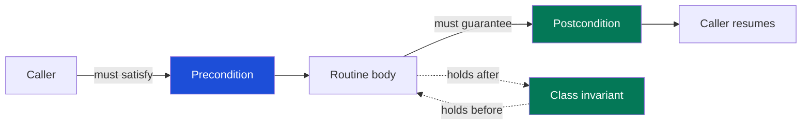

# Design by Contract — Interview Questions

> 50+ questions across all tiers (Junior → Staff). Each answer is crisp; harder ones note **what the interviewer is really checking**. Use as self-review or interview prep.

## Table of Contents

- [Junior (14)](#junior-14-questions)
- [Mid (14)](#mid-14-questions)
- [Senior (14)](#senior-14-questions)
- [Staff (10)](#staff-10-questions)
- [Rapid-Fire](#rapid-fire)
- [Summary](#summary)
- [Further Reading](#further-reading)
- [Related Topics](#related-topics)

---

## The contract at a glance

Blue = the **caller's** obligation. Green = the **callee's** obligation. The invariant brackets every public method: true on entry, true on exit.

---

## Junior (14 questions)

### J1. What is Design by Contract?

Answer

A method, introduced by Bertrand Meyer in Eiffel, for specifying the *obligations* and *guarantees* between a routine and its caller as three formal assertions: **preconditions**, **postconditions**, and **class invariants**. The routine and its callers form a contract, exactly like a business one: each side has duties and benefits.

### J2. Define precondition.

Answer

A condition the **caller must guarantee is true before** calling the routine. Example: `sqrt(x)` requires `x >= 0`. If the precondition is false, the routine owes nothing — its behavior is undefined. Satisfying it is the caller's job.

### J3. Define postcondition.

Answer

A condition the **routine guarantees is true after** it returns, *provided the precondition held on entry*. Example: `sqrt(x)` guarantees `result * result ≈ x` and `result >= 0`. Honoring it is the callee's job.

### J4. Define class invariant.

Answer

A condition that holds **before and after every public method** of an object — its "always true" property. Example: a `BankAccount` invariant might be `balance >= 0`; for a sorted list, "elements are in ascending order." It may be temporarily violated *inside* a method but must be restored before control returns to a caller.

### J5. Who is responsible for the precondition — caller or callee?

Answer

The **caller**. That is the whole point: the routine assumes the precondition and does not re-check it as part of its logic. The caller must establish it first. (Whether the routine *also* checks it as a safety net is a separate, defensive concern — see J11 and M5.)

### J6. Who is responsible for the postcondition?

Answer

The **callee** (the routine). If it accepted the call (precondition satisfied), it must deliver the postcondition. Failure to do so is a bug in the routine, not the caller.

### J7. What's the benefit/obligation symmetry of a contract?

Answer

Each party's obligation is the other's benefit:

| | Obligation | Benefit |
|---|---|---|
| **Caller** | Satisfy precondition | Gets postcondition guaranteed |
| **Callee** | Deliver postcondition | May assume precondition |

The caller's duty (precondition) frees the callee from checking it; the callee's duty (postcondition) frees the caller from re-verifying the result.

### J8. Give a one-line example of all three.

Answer

`pop()` on a stack:
- **Precondition:** stack is non-empty.
- **Postcondition:** size decreased by one; returns the former top element.
- **Invariant:** `0 <= size <= capacity`.

### J9. How does a contract differ from a comment like `// x must be > 0`?

Answer

A comment is *contract-as-comment* — an unenforced wish that drifts out of date and is never checked. A real contract is **executable**: an assertion, an assertion library, a type, or a test enforces it, so violations surface instead of silently corrupting state.

### J10. What is an assertion?

Answer

A boolean check embedded in code stating "this must be true here." If false, it aborts (raises `AssertionError`, panics, etc.). Assertions are the most direct way to *encode* a contract clause in code: `assert x >= 0`.

### J11. What does "fail fast" mean in DbC?

Answer

When a contract is breached, stop **immediately and loudly** rather than limping on with corrupt state. A precondition violation means a *bug* exists somewhere; the closer you crash to the cause, the easier the fix. Silently continuing turns a clear bug into a mysterious one three layers away.

### J12. Precondition vs input validation — same thing?

Answer

No, and conflating them is a classic mistake. A precondition is a **contract between two pieces of your own code**; its violation is a programmer bug → fail fast. Input validation handles **untrusted external data** (user, network, file); invalid input is *expected* and must be handled gracefully (error message, 400 response), not treated as a crash.

### J13. Where is an invariant first established?

Answer

In the **constructor**. A well-designed constructor must leave the object in a state where the invariant holds. From then on, every public method must preserve it. If a constructor cannot guarantee the invariant for the given arguments, it should reject them (throw) rather than build a broken object.

### J14. Why are contracts useful even when not formally checked?

Answer

They make assumptions **explicit**. The biggest source of integration bugs is implicit assumptions — "I assumed it was never null," "I assumed the list was sorted." Writing the contract down (even as a docstring backed by a test) turns a hidden assumption into a shared, reviewable agreement.

---

## Mid (14 questions)

### M1. Walk through the caller-vs-callee responsibility division with an example.

Answer

`withdraw(amount)` on an account:
- **Caller** must ensure `amount > 0 && amount <= balance` (precondition).
- **Callee** guarantees `new balance == old balance - amount` (postcondition) and preserves `balance >= 0` (invariant).

Because the caller owns the precondition, `withdraw` need not contain "what if amount is negative?" business logic — that case is simply a bug if it ever happens between trusted code.

**What the interviewer is checking:** that you don't reflexively stuff every guard into the callee. DbC pushes the *responsibility* to whoever is best placed to know — for an internal API, that's often the caller.

### M2. A contract breach versus an invalid input — how do you handle each?

Answer

- **Contract breach** (precondition violated by *your own code*): a **bug**. Fail fast — assert, panic, or throw an unchecked exception. Don't catch it; let it crash in test/CI so you fix the caller.
- **Invalid input** (bad data from *outside the trust boundary*): an **expected condition**. Validate and return a structured error / HTTP 4xx / typed `Result`. Never crash the process over data a user can control.

The dividing line is the **trust boundary**.

### M3. Assertions vs validation — when each, and what's the disabled-assertion hazard?

Answer

Use **assertions** to check internal contracts (programmer errors); use **validation** for external input (expected errors).

The hazard: in many runtimes assertions can be **stripped in production** — Java's `assert` is off unless `-ea` is set; C's `assert` vanishes under `NDEBUG`; Python's `assert` is removed with `-O`. So **never put load-bearing checks — especially security or untrusted-input validation — in an `assert`.** If the check must always run, use an explicit `if (...) throw`.

### M4. Trick: are assertions enough to validate user input?

Answer

**No.** Assertions may be compiled out in production (`-ea` off, `NDEBUG`, Python `-O`), so an `assert request.amount > 0` guarding *user-supplied* data can silently vanish and let bad/hostile input through — a correctness and security hole. Untrusted input needs unconditional `if/throw` (or a typed validator). Assertions are only for *can-never-happen-if-the-code-is-correct* conditions, never for attacker-controlled data.

### M5. How does DbC differ from defensive programming?

Answer

**Defensive programming** assumes every caller is hostile or buggy and re-checks all inputs everywhere ("offensive" sibling: crash on anything unexpected). **DbC** instead assigns responsibility: the caller guarantees preconditions, so the callee need *not* defensively re-check them between trusted components. DbC reduces redundant checking; pure defensiveness multiplies it. In practice you mix them: defensive at the trust boundary, contract-based within it. See [Defensive vs Offensive](../16-defensive-vs-offensive/README.md).

### M6. What is "double-checking" and why is it a smell?

Answer

The *same* precondition verified in both the caller and the callee. It's a smell because it signals **unclear ownership** of the contract — and the duplicated checks drift apart over time. DbC says: decide who owns it. Between trusted internal code, the caller owns the precondition and the callee assumes it (optionally guarded by an assert that's stripped in prod, so it costs nothing live).

### M7. What is an implicit contract and why is it dangerous?

Answer

An assumption about valid inputs/state that lives **only in the author's head** — never written, never enforced. It's dangerous because the next maintainer (or the author six months later) violates it without warning, and the failure surfaces far from the cause. Making contracts explicit is the cheapest bug-prevention DbC offers.

### M8. How do contracts relate to Hoare triples?

Answer

A Hoare triple `{P} C {Q}` reads "if precondition `P` holds and command `C` terminates, then postcondition `Q` holds." DbC is essentially Hoare logic made practical: `P` = precondition, `Q` = postcondition, `C` = the routine body. The class invariant is an extra clause conjoined to both `P` and `Q` for every public method. DbC borrows the *idea* without demanding full formal proof.

### M9. What does "make illegal states unrepresentable" mean?

Answer

Design types so a violated contract **cannot even be constructed**, removing the need for a runtime check. Instead of `String email` + a precondition "must contain @", use an `Email` value type whose constructor is the *only* way to make one and that rejects bad input. The compiler now enforces what was a runtime precondition. It's the strongest form of contract: shift the check from runtime to the type system.

### M10. Give examples of pushing a contract into the type system.

Answer

- `NonEmptyList<T>` — precondition "list is non-empty" becomes unrepresentable when empty.
- `PositiveInt` / refinement types — "must be > 0" enforced at construction.
- A sum type `enum PaymentState { Pending, Paid(receipt), Refunded(reason) }` — illegal field combinations can't exist.
- Non-nullable types (Kotlin `String` vs `String?`) — the "must not be null" precondition vanishes.

Each converts a runtime precondition into a compile-time guarantee.

### M11. What is invariant drift?

Answer

When some method quietly leaves the class invariant broken — e.g., a setter that updates `total` but not the cached `count`, so `count == items.size()` no longer holds. The object now lies. Cures: funnel all mutation through methods that re-establish the invariant, check the invariant in an assertion at method exit during tests, or make the object immutable so no method *can* drift it.

### M12. How does immutability simplify contracts?

Answer

If an object never changes after construction, its invariant only has to be **established once** (in the constructor) and can never drift. There are no mutating methods to preserve it across. This is why DbC pairs naturally with value objects and immutable data — the hardest part (maintaining invariants over time) disappears.

### M13. Should a precondition failure be a checked or unchecked exception?

Answer

**Unchecked** (e.g., `IllegalArgumentException`, `IllegalStateException`, panic). A precondition breach is a *bug*, not a recoverable condition; forcing every caller to `catch` it would be wrong — callers should fix the bug, not handle it. Checked exceptions / `Result` types are for *expected* failures (I/O, validation of external input).

### M14. How do you document a contract in a language without DbC support?

Answer

Three layers, strongest first: (1) **types** — encode what you can (`Email`, non-null, `Positive`); (2) **runtime checks** — `assert`/`require` for internal preconditions, `if/throw` for external; (3) **docstring + test** — state the contract in the doc comment *and* back it with a test that fails if the contract is broken. The test is what keeps the doc honest.

---

## Senior (14 questions)

### S1. State the Liskov Substitution Principle in contract terms.

Answer

A subtype must be usable wherever its supertype is expected, without the caller noticing. In contract terms: an overriding method may **weaken (not strengthen) the precondition** and **strengthen (not weaken) the postcondition**, and must **preserve the supertype's invariants**. The subtype may demand *no more* of callers and promise *no less* than the parent.

**What the interviewer is checking:** that you understand LSP is fundamentally about *behavioral* substitutability — i.e., contracts — not just method signatures.

### S2. Trick: should a subclass be allowed to *require more* of its callers?

Answer

**No.** Strengthening a precondition breaks LSP. A caller written against the base type satisfies the *base* precondition; if the subclass demands more, that previously-valid call now fails — substitutability is broken. Subclasses may only **weaken** preconditions (accept *at least* what the parent accepted, possibly more).

**What the interviewer is checking:** the single most common LSP misconception. Many candidates instinctively say "yes, it can be stricter" — which is exactly backwards.

### S3. Why does strengthening a postcondition in a subclass *not* break LSP?

Answer

Because a caller relying on the base postcondition is still fully satisfied — it gets *at least* what was promised, plus more. Promising more never surprises a caller expecting less. (Conversely, *weakening* a postcondition breaks LSP: the caller relied on a guarantee the subclass no longer keeps.)

### S4. Give a concrete LSP-via-contracts violation.

Answer

`Rectangle.setWidth(w)` has postcondition "width == w, height unchanged." `Square extends Rectangle` overrides `setWidth` to also change height (to stay square), **weakening that postcondition**. Code holding a `Rectangle` that calls `setWidth(5)` then asserts height unchanged now fails. The fix: a square is not a behavioral subtype of a mutable rectangle — make them separate types.

### S5. How are contracts and property-based tests related?

Answer

A property-based test *is* an executable postcondition/invariant checked over many generated inputs. "For all valid inputs `x`, `decode(encode(x)) == x`" is a round-trip postcondition. "Sorting preserves length and is ordered" is a postcondition + invariant. PBT is the natural way to *verify* a contract you can't fully encode in types: state the contract as a property, let the framework hunt for a counterexample. See property-based testing.

### S6. Trick: is checking the precondition the callee's job?

Answer

**Strictly, no** — *satisfying* it is the caller's job; the callee may *assume* it. But callees often *also check* it as a fail-fast safety net (an assert that may be stripped in prod). The distinction: the check inside the callee is a debugging aid, not part of its contractual logic. For an external/untrusted boundary the answer flips — there the callee must validate, because there is no trusted caller to rely on.

**What the interviewer is checking:** whether you can separate "whose *responsibility*" from "where the *check* physically sits," and whether you adjust for the trust boundary.

### S7. When is DbC overkill?

Answer

- Trivial code with obvious behavior (a one-line getter doesn't need ceremony).
- Pure UI/glue with no invariants worth stating.
- Throwaway scripts or prototypes.
- When the contract is already fully enforced by types — adding a redundant `assert` is noise.

DbC pays off where invariants are non-trivial, where many callers share an API, and where a violated assumption would corrupt important state. Don't gold-plate simple code with assertions.

### S8. How do you preserve an invariant across a sequence of mutating methods?

Answer

Treat the invariant as a contract on *every* public method: true on entry, true on exit, free to be violated only in between. Practically: keep mutation behind a small set of methods that each restore the invariant before returning; never expose internal mutable state that lets a caller break it from outside; and assert the invariant at method exit in debug/test builds to catch drift early.

### S9. What's the difference between a class invariant and a loop invariant?

Answer

A **class invariant** holds across the *object's* public-method boundaries (a property of state). A **loop invariant** holds before and after each *iteration* of a loop (a property used to reason about an algorithm's correctness, e.g., "after iteration k, `result` holds the max of the first k elements"). Same conceptual tool (an always-true assertion at a control boundary), different scope.

### S10. How do contracts interact with concurrency?

Answer

An invariant must hold at every point another thread could observe the object — which is *between* operations, not just at method boundaries of a single thread. So a "balance never negative" invariant is only safe if the check-and-mutate is **atomic** (lock, CAS, or transaction). Immutable objects sidestep this entirely: their invariant is fixed at construction and no thread can violate it. Mutable shared state turns invariant maintenance into a synchronization problem.

### S11. A method's postcondition depends on its precondition. How do you express that?

Answer

The postcondition is only owed *if the precondition held*. Formally `{P} C {Q}` — `Q` is conditional on `P`. So you never write "always returns a sorted list"; you write "given a non-null list (pre), returns a sorted permutation of it (post)." If the precondition is false, all bets are off — the routine's behavior is undefined, which is exactly why fail-fast on precondition breach is acceptable.

### S12. How does the "old value" (`old expr`) notation help postconditions?

Answer

Many postconditions compare post-state to pre-state: "balance decreased by amount" needs the *original* balance. Eiffel's `old balance` captures the entry value so the postcondition can reference it. In languages without it, you snapshot the needed values at method entry and compare at exit (often inside a test). It makes *change*-based contracts expressible, not just absolute-state ones.

### S13. Why is "exceptions for contract breaches that are really bugs" an anti-pattern when caught?

Answer

If a precondition breach throws and some outer layer **catches and swallows** it, the bug is hidden: the program continues with corrupt or default state, and the real defect surfaces later, far from its cause. Contract-breach exceptions should propagate to a crash / alert, not be handled like expected errors. Catching them defeats fail-fast. (Expected, recoverable failures — bad user input, network errors — are a different category and *should* be caught.)

### S14. How do you retrofit contracts onto a legacy codebase?

Answer

Incrementally and at the seams. (1) Add **characterization tests** to pin current behavior. (2) Make the most dangerous implicit assumptions explicit first — null/empty/range preconditions on widely-called APIs, guarded with `require`/`assert`. (3) Introduce value types at the boundary to kill primitive-obsession-driven implicit contracts. (4) Add property tests for the gnarliest invariants. Don't try to contract everything at once — prioritize hotspots and trust boundaries.

---

## Staff (10 questions)

### St1. How do contracts function as machine-checkable specifications, and what are the limits?

Answer

A contract is a partial *spec* the machine can check: types check statically, assertions check dynamically, property tests check probabilistically over generated inputs, and tools like formal verifiers (Dafny, Frama-C, JML + checkers) can sometimes *prove* `{P} C {Q}`. Limits: dynamic assertions only catch violations on paths you actually execute; property tests sample, they don't prove; full formal proof is expensive and rarely justified outside safety-critical code. The pragmatic stance: types > properties > assertions > docstrings, applied where the risk warrants.

### St2. How do contracts compose across service / API boundaries?

Answer

Within a process, DbC assumes a trusted caller. Across a network boundary there is no trusted caller: the "precondition" becomes **request validation** the server *must* enforce (defensive), and the "postcondition" becomes the server's documented response guarantee, ideally pinned by **consumer-driven contract tests** (e.g., Pact). The DbC vocabulary maps cleanly — pre = request schema, post = response schema, invariant = resource invariants — but responsibility shifts entirely to the callee because the caller is untrusted.

### St3. How do you choose between encoding a rule as a type, an assertion, or a validator?

Answer

By *who* can violate it and *when* you want to know.
- **Type** — when the rule is structural and a violation should be *impossible to compile* (best; zero runtime cost, total coverage).
- **Assertion** — internal invariant violable only by a *bug*; you want a loud crash in dev/CI; fine to strip in prod.
- **Validator (if/throw, Result)** — rule can be violated by *untrusted input* or must *always* run in prod; failure is expected and handled.

The decision tree is: can a type express it? If yes, prefer that. If not, is the violator trusted code (assert) or the outside world (validate)?

### St4. Eiffel enforces contracts in the language. Why didn't DbC win mainstream adoption, and what replaced it?

Answer

Mainstream languages lacked first-class pre/post/invariant syntax, runtime contract checking has a cost, and inheritance-rule enforcement (LSP weakening/strengthening) is hard to police automatically. What "won" instead are the *ideas* in other clothing: strong/expressive type systems and "make illegal states unrepresentable" (the static end of DbC), property-based testing and fuzzing (the dynamic-verification end), and assertion/`require` libraries. The contract concept thrives; the Eiffel-style syntax mostly didn't.

### St5. How would you design an API so that misuse is a compile error rather than a runtime contract breach?

Answer

Shift preconditions into the type system:
- **Required-order construction** via a type-state / step-builder so you *cannot* call `build()` before required fields are set.
- **Phantom/marker types** to encode state (`Connection<Open>` vs `Connection<Closed>`) so `send` only compiles on an open connection.
- **Value types** for every constrained primitive so "valid" is the only constructible state.
- **Non-nullable references** and sum types to delete null/illegal-combination preconditions.

The goal: the largest class of misuse becomes unrepresentable, leaving only genuinely dynamic conditions for runtime checks.

### St6. How do contracts and observability relate in production?

Answer

Production-stripped assertions buy nothing at runtime, so for invariants that *matter live* you don't assert — you **monitor**. Emit a metric/alert when an invariant is found violated (e.g., "ledger debits != credits"), with enough context to trace the cause. This is fail-fast adapted to production: you can't crash a payment system on every anomaly, but you can detect contract violation, quarantine the affected entity, and alert. The contract becomes an SLO/alert rather than an abort.

### St7. What's the relationship between DbC and total vs partial functions?

Answer

A **partial function** is undefined for some inputs — i.e., it carries a precondition (`head` requires non-empty; `divide` requires non-zero divisor). DbC makes that precondition explicit. A **total function** is defined for all inputs of its type and needs no precondition. A powerful design move is to *totalize* a partial function by changing its type: `head: List<T> -> T` (partial) becomes `head: NonEmptyList<T> -> T` (total) or `headOption: List<T> -> Option<T>` (total). Totalization eliminates the precondition.

### St8. How do you contract-check at the boundary between typed and untyped worlds (e.g., deserialization, FFI)?

Answer

This boundary is exactly where types stop protecting you, so it's the one place you *must* validate, not assert. Parse-don't-validate: convert the untyped blob into your typed, invariant-satisfying domain objects in one gatekeeping layer that rejects anything illegal (returning errors, not crashing). After that layer, internal code can rely on DbC and trusted callers. The boundary turns external uncertainty into internal guarantees — every illegal state is caught once, at the edge.

### St9. When does adding contracts *reduce* reliability?

Answer

- Putting must-always-run checks in strippable assertions → silent gaps in prod.
- Over-strict preconditions that reject inputs the routine could handle → callers add workarounds or duplicate logic.
- Contract checks with side effects or heavy cost on the hot path.
- A flood of assertions that crash on benign edge cases, training the team to wrap everything in catch-all handlers (which then swallow real bugs).

Contracts add reliability only when they encode *true* invariants, run where they need to, and fail in a way the team respects.

### St10. How do you enforce the LSP contract rules in a large codebase mechanically?

Answer

Pure tooling can't fully prove behavioral substitutability, but you can approximate it: (1) **shared contract test suites** run against *every* implementation of an interface — if a subtype can't pass the supertype's tests, it violated the contract; (2) **property tests** stated against the interface, executed for each implementation; (3) review/lint rules flagging overrides that add `throw`/guard clauses (precondition strengthening) at the top of a method; (4) prefer composition or sealed hierarchies to limit where substitution can go wrong. The supertype's test suite *is* its executable contract.

---

## Rapid-Fire

| Question | Answer |
|---|---|
| Who satisfies the precondition? | The caller. |
| Who guarantees the postcondition? | The callee. |
| When must an invariant hold? | Before and after every public method. |
| Contract breach = ? | A bug → fail fast (unchecked throw/panic). |
| Invalid external input = ? | Expected → validate, return error. |
| Can a subclass strengthen a precondition? | No (breaks LSP). |
| Can a subclass strengthen a postcondition? | Yes. |
| Can a subclass weaken a postcondition? | No (breaks LSP). |
| Validate user input with `assert`? | No — may be stripped in prod. |
| Where is an invariant first established? | The constructor. |
| Strongest form of a contract? | Make illegal states unrepresentable (types). |
| Hoare triple? | `{P} C {Q}`. |
| Property test ≈ ? | Executable postcondition over many inputs. |
| Precondition failure exception type? | Unchecked. |
| DbC overkill when? | Trivial code already covered by types. |
| Double-checking smell = ? | Same precondition checked in caller and callee. |
| Partial function carries a ___? | Precondition. |
| Immutability helps invariants because? | Established once, can't drift. |

---

## Summary

Design by Contract formalizes the implicit agreements between code: the **caller** satisfies **preconditions**, the **callee** guarantees **postconditions**, and **class invariants** hold across every public method. The pivotal distinction is responsibility — a precondition breach between trusted code is a **bug** (fail fast, unchecked, don't catch), while bad data from outside the **trust boundary** is **expected input** (validate, return an error). Assertions encode internal contracts but may be stripped in production, so they must never guard untrusted input or security. Under inheritance, LSP *is* a contract rule: subtypes may **weaken preconditions and strengthen postconditions**, never the reverse. The strongest contracts aren't checked at runtime at all — they're encoded in **types** so illegal states are unrepresentable. Property-based testing verifies the contracts types can't express. Apply DbC where invariants are real and shared; skip the ceremony on trivial code.

---

## Further Reading

- Bertrand Meyer, *Object-Oriented Software Construction* (2nd ed.) — the origin of DbC.
- Barbara Liskov & Jeannette Wing, "A Behavioral Notion of Subtyping" — LSP as contracts.
- C.A.R. Hoare, "An Axiomatic Basis for Computer Programming" — Hoare triples.
- Andrew Hunt & David Thomas, *The Pragmatic Programmer* — "Design by Contract" and "Dead Programs Tell No Lies" (fail fast).
- Scott Wlaschin, "Parse, Don't Validate" / *Domain Modeling Made Functional* — making illegal states unrepresentable.

---

## Related Topics

- [Design by Contract — README](../README.md)
- [Junior notes](junior.md) · [Professional notes](professional.md)
- [Defensive vs Offensive Programming](../16-defensive-vs-offensive/README.md)
- [Anti-Patterns](../../anti-patterns/README.md)
