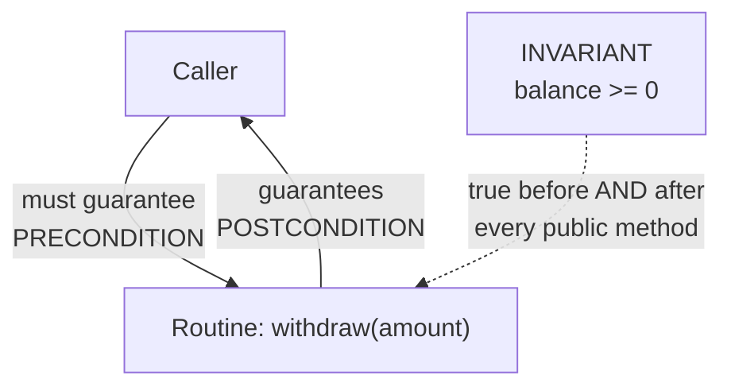
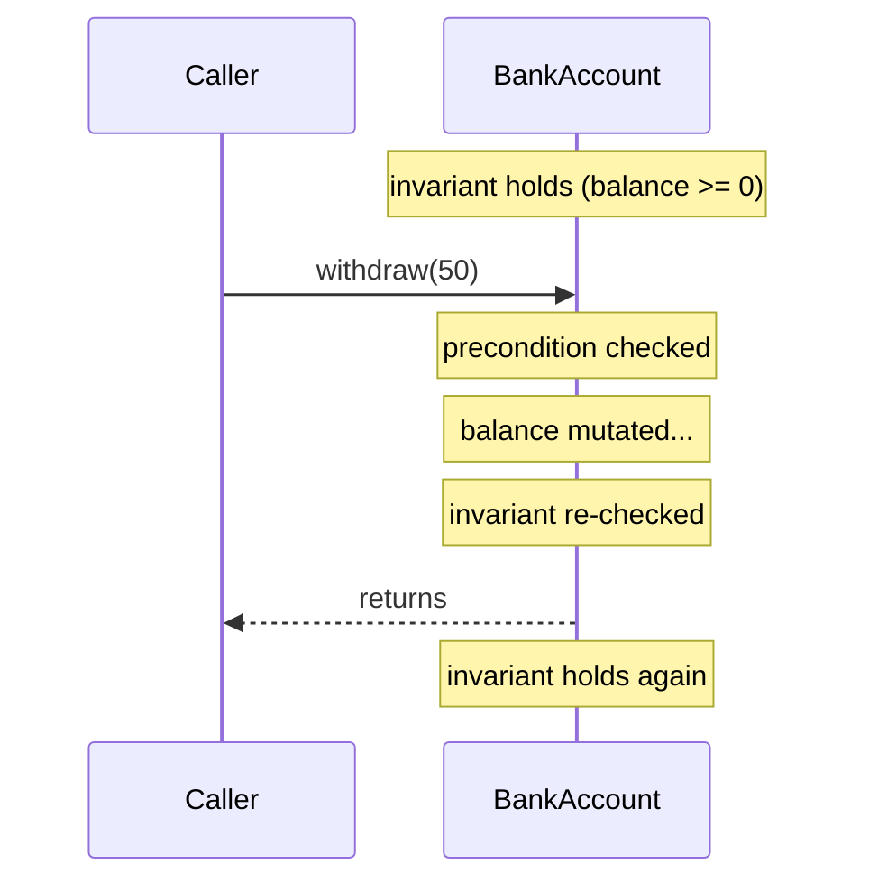

# Design by Contract — Junior Level

> **Level:** Junior — "What's the rule? Show me a clean example."
> **Scope:** [chapter README](../README.md). Next levels: [middle.md](middle.md), [senior.md](senior.md).

---

## Table of Contents

1. [The one-sentence rule](#the-one-sentence-rule)
2. [Analogy: a shipping contract](#analogy-a-shipping-contract)
3. [The three parts of a contract](#the-three-parts-of-a-contract)
4. [Preconditions — the caller's obligation](#preconditions--the-callers-obligation)
5. [Postconditions — the routine's guarantee](#postconditions--the-routines-guarantee)
6. [Class invariants — always true of a valid object](#class-invariants--always-true-of-a-valid-object)
7. [Division of responsibility — don't double-check](#division-of-responsibility--dont-double-check)
8. [A contract is a specification, not defensive code](#a-contract-is-a-specification-not-defensive-code)
9. [A violated contract is a BUG — fail fast](#a-violated-contract-is-a-bug--fail-fast)
10. [The languages](#the-languages)
11. [Dirty → clean: from implicit to explicit contract](#dirty--clean-from-implicit-to-explicit-contract)
12. [Common Mistakes](#common-mistakes)
13. [Test Yourself](#test-yourself)
14. [Cheat Sheet](#cheat-sheet)
15. [Summary](#summary)
16. [Further Reading](#further-reading)
17. [Related Topics](#related-topics)

---

## The one-sentence rule

> **Every routine has a contract: the caller promises the preconditions, the routine promises the postconditions, and the object promises its invariants. Write the contract down and check it — a broken contract is a bug, not an error you handle.**

**Design by Contract (DbC)** was introduced by Bertrand Meyer in the Eiffel language. The idea borrows from business: when two parties agree to do work, they write a contract that says what each side must deliver. Software routines have the same shape — `withdraw(amount)` only works if you give it a sensible `amount`, and in return it promises your balance goes down by exactly that much.

Most code carries these promises **implicitly** — in the author's head, maybe in a comment nobody reads. DbC says: make them **explicit and checkable**.

---

## Analogy: a shipping contract

You hire a courier to deliver a package.

- **Precondition (your obligation):** the package must be sealed, under 20 kg, and have a valid address. If you hand them an open box with no label, that's *your* fault — the courier is not obligated to do anything sensible.
- **Postcondition (their guarantee):** *given* a valid package, they guarantee it arrives at the address within 48 hours, undamaged.
- **Invariant (always true of the courier):** the truck never carries more than its rated weight — true before pickup, true after, true between every stop.

The contract makes blame unambiguous. If you hand over a 50 kg unlabeled box and it gets lost, you can't sue — *you* broke the precondition. If the package was perfect and it arrives smashed, *they* broke the postcondition.

That clarity is the whole point. In code, when something blows up, the contract tells you **which side has the bug**.

---

## The three parts of a contract



| Part | Question it answers | Who is responsible | If it fails, whose bug? |
|---|---|---|---|
| **Precondition** | What must be true *before* the routine runs? | The **caller** | The caller's |
| **Postcondition** | What does the routine promise *after* it runs? | The **routine** (callee) | The routine's |
| **Invariant** | What is *always* true of a valid object? | The **class** (every method) | Whichever method left it broken |

Keep this table in your head. Almost every DbC mistake is a confusion about *who is responsible*.

---

## Preconditions — the caller's obligation

A **precondition** states what must hold for the routine to do its job. It is a demand on the **caller**.

> "Don't call `sqrt(x)` with a negative `x`. If you do, that's your bug — I won't pretend to return a sensible answer."

```python
def withdraw(account, amount):
    # PRECONDITION: amount must be positive and not exceed the balance.
    assert amount > 0, f"amount must be positive, got {amount}"
    assert amount <= account.balance, f"insufficient funds: {amount} > {account.balance}"
    account.balance -= amount
    return account.balance
```

The two `assert` lines *are* the precondition, written in code. They are not there to gracefully handle user mistakes — they are there to catch a **programmer** who called `withdraw` wrong.

> **Key distinction:** "the user typed a negative number in a form" is **expected input**, validated and handled with a real error message. "Another function in our code passed a negative number to `withdraw`" is a **bug** — caught by the precondition. See [error handling](../06-error-handling/README.md) for the user-facing side.

---

## Postconditions — the routine's guarantee

A **postcondition** states what the routine guarantees *when its preconditions were met*. It is a promise to the caller.

```python
def withdraw(account, amount):
    assert amount > 0 and amount <= account.balance       # precondition
    old_balance = account.balance
    account.balance -= amount
    # POSTCONDITION: balance dropped by exactly `amount`, never below zero.
    assert account.balance == old_balance - amount
    assert account.balance >= 0
    return account.balance
```

The postcondition is a self-test: "I claim I did my job correctly." If it fails, the bug is *inside* `withdraw`, not at the call site. This is enormously valuable — it pins the bug to one routine instead of letting a corrupted balance leak across the whole system.

A useful postcondition relates the **result** to the **inputs** (`balance == old_balance - amount`), not just "the result is some number."

---

## Class invariants — always true of a valid object

A **class invariant** is a condition that holds for every valid object of the class: true right after construction, and true again after **every public method returns**. A method may *temporarily* break it mid-execution, but must restore it before handing control back.

```python
class BankAccount:
    def __init__(self, balance):
        self._balance = balance
        self._check_invariant()

    def _check_invariant(self):
        # INVARIANT: balance is never negative.
        assert self._balance >= 0, f"invariant broken: balance={self._balance}"

    def withdraw(self, amount):
        assert 0 < amount <= self._balance      # precondition
        self._balance -= amount
        self._check_invariant()                 # invariant restored before returning
        return self._balance
```

The invariant is the object's "always true" rule. `balance >= 0` should never be observable as false from outside. Checking it at the end of each mutator catches the *one method* that forgot to maintain it.



---

## Division of responsibility — don't double-check

This is the rule juniors most often get wrong. The contract **divides** the work:

- The **caller** guarantees the precondition.
- The **callee** can therefore *assume* it and does **not** re-validate it as normal control flow.

If both sides check the same thing as ordinary `if`-logic, you have **double-checking**: duplicated, drift-prone, and it muddies who is to blame.

```python
# DOUBLE-CHECKING (smell): caller validates, then callee validates the same thing again.
def transfer(src, dst, amount):
    if amount <= 0:                      # caller-side guard
        return
    withdraw(src, amount)

def withdraw(account, amount):
    if amount <= 0:                      # SAME check repeated — which one owns it?
        return
    account.balance -= amount
```

```python
# CLEAR CONTRACT: the precondition is stated once, in withdraw. The caller's job
# is to satisfy it; withdraw's job is to assume it (and assert it to catch bugs).
def transfer(src, dst, amount):
    # caller's obligation: only call with a sensible amount
    if amount <= 0:
        raise ValueError("transfer amount must be positive")  # this is INPUT handling
    withdraw(src, amount)

def withdraw(account, amount):
    assert amount > 0, "withdraw precondition violated"  # bug-catcher, not input handling
    account.balance -= amount
```

The `assert` in `withdraw` is **not** a duplicate guard — it never fires in correct code. It is a tripwire that catches a *caller bug*. The `raise ValueError` in `transfer` handles the *external boundary* where bad input legitimately arrives.

> **The shape:** validate untrusted input **once, at the boundary** (turn it into a typed/clean value). Inside, routines trust the contract and assert preconditions only to catch internal bugs.

---

## A contract is a specification, not defensive code

A contract is **documentation that runs**. It says what the routine *means*, independent of how it's implemented. That is different from defensive programming, which is about *surviving* bad input.

| | Contract (DbC) | Defensive code |
|---|---|---|
| Purpose | Specify correctness; locate bugs | Tolerate/recover from bad input |
| Audience | Other programmers (your own code) | Hostile or untrusted callers |
| When it fires | Only when there's a **bug** | During normal operation |
| Right reaction | Crash loudly (fail fast) | Return error, log, degrade |

These are complementary stances, not competitors — see [defensive vs offensive programming](../16-defensive-vs-offensive/README.md). At the trust boundary, validate defensively. Behind it, specify with contracts.

Because contracts state properties (`balance == old - amount`, `result is sorted`), they also feed naturally into **property-based testing**: the postcondition becomes the property your tests assert across many random inputs.

---

## A violated contract is a BUG — fail fast

When a precondition or invariant fails, the program is in a state the author proved impossible. Continuing would corrupt more state. So you **fail fast**: crash with a clear message, near the cause.

Do **not** wrap contract checks in `try/except` to "keep going." Catching a contract breach hides the bug and lets corruption spread.

```python
# WRONG: swallowing a contract breach
try:
    withdraw(account, amount)
except AssertionError:
    pass   # the bug is now invisible AND the balance may be corrupt
```

```python
# RIGHT: let it crash in dev/test; fix the caller that violated the precondition.
withdraw(account, amount)   # AssertionError here = stop, find the buggy caller
```

> **Rule of thumb:** *expected* failures (network down, file missing, user typo) are **exceptions/errors you handle**. *Impossible* failures (a precondition you guaranteed can't happen) are **assertions you let crash**. Don't blur the two.

---

## The languages

### Eiffel — the origin

Eiffel has DbC built into the language with `require` (pre), `ensure` (post), and `invariant`. `old` refers to a value as it was on entry. This is where the vocabulary comes from:

```eiffel
class ACCOUNT
feature
    balance: INTEGER

    withdraw (amount: INTEGER)
        require                                  -- preconditions
            amount_positive: amount > 0
            sufficient_funds: amount <= balance
        do
            balance := balance - amount
        ensure                                   -- postconditions
            balance_reduced: balance = old balance - amount
            non_negative: balance >= 0
        end

invariant                                        -- class invariant
    balance_non_negative: balance >= 0
end
```

The compiler can check these at runtime; subclasses inherit and must respect them. No mainstream language matches this, so the others below *approximate* it.

### Java — `Objects.requireNonNull`, `assert`, Guava `Preconditions`, JML comments

```java
import com.google.common.base.Preconditions;   // Guava
import java.util.Objects;

class BankAccount {
    private long balanceCents;

    BankAccount(long balanceCents) {
        Preconditions.checkArgument(balanceCents >= 0, "balance must be >= 0");
        this.balanceCents = balanceCents;
    }

    /**
     * Withdraws money from the account.
     *
     * @param amountCents amount to withdraw
     * @pre  amountCents > 0 && amountCents <= balanceCents   // JML-style contract
     * @post balanceCents == \old(balanceCents) - amountCents
     * @inv  balanceCents >= 0
     */
    long withdraw(long amountCents) {
        // Precondition. requireNonNull / checkArgument for caller obligations.
        Preconditions.checkArgument(amountCents > 0, "amount must be > 0");
        Preconditions.checkArgument(amountCents <= balanceCents, "insufficient funds");

        long oldBalance = balanceCents;
        balanceCents -= amountCents;

        // Postcondition + invariant. `assert` for things only a bug can break.
        assert balanceCents == oldBalance - amountCents : "postcondition broken";
        assert balanceCents >= 0 : "invariant broken";
        return balanceCents;
    }
}
```

> Java's `assert` is **disabled by default** — enable it with the `-ea` JVM flag in tests/dev. Use `assert` for post/invariants (internal bugs) and `Objects.requireNonNull` / Guava `Preconditions` for preconditions on public APIs (these throw even in production, which is what you want for caller-facing checks). JML (`@pre/@post/@inv` in a structured comment) is a documentation convention with optional tooling.

### Python — `assert` and `icontract`

Plain `assert` works, but the [`icontract`](https://github.com/Parquery/icontract) library expresses contracts as decorators with access to arguments, the result (`result`), and the entry-time value (`OLD`):

```python
import icontract

class BankAccount:
    def __init__(self, balance: int):
        assert balance >= 0
        self._balance = balance

    @property
    def balance(self) -> int:
        return self._balance

    @icontract.require(lambda amount: amount > 0)
    @icontract.require(lambda self, amount: amount <= self._balance)
    @icontract.ensure(lambda self, amount, OLD: self._balance == OLD._balance - amount)
    @icontract.ensure(lambda self: self._balance >= 0)
    def withdraw(self, amount: int) -> int:
        self._balance -= amount
        return self._balance
```

> Like Java's `assert`, Python's `assert` is stripped when you run with `python -O`. Use it for contracts (bug-catchers), never for validating untrusted input — for that, raise a real exception.

### Go — manual guard + `panic` for programmer errors

Go has no assertions and no DbC syntax. The idiom: return `error` for *expected* failures, but `panic` for *contract violations* (programmer bugs), since a panic crashes loudly like an assertion.

```go
package bank

import "fmt"

type Account struct {
    balanceCents int64
}

func NewAccount(balanceCents int64) *Account {
    if balanceCents < 0 {
        panic(fmt.Sprintf("invariant: balance must be >= 0, got %d", balanceCents))
    }
    return &Account{balanceCents: balanceCents}
}

// Withdraw's contract:
//   precondition:  amount > 0 && amount <= balance  (caller's obligation -> panic on breach)
//   postcondition: balance == old - amount
//   invariant:     balance >= 0
func (a *Account) Withdraw(amount int64) int64 {
    if amount <= 0 || amount > a.balanceCents {
        panic(fmt.Sprintf("precondition violated: amount=%d balance=%d", amount, a.balanceCents))
    }

    old := a.balanceCents
    a.balanceCents -= amount

    if a.balanceCents != old-amount || a.balanceCents < 0 {
        panic("postcondition/invariant broken in Withdraw")
    }
    return a.balanceCents
}
```

> Use `panic` *only* for things that can't happen unless code is buggy. Anything a real user or remote system can cause (bad request, missing file) must be a returned `error`, not a panic.

---

## Dirty → clean: from implicit to explicit contract

### Dirty — the contract lives in the author's head

```python
def apply_discount(price, percent):
    # percent is "obviously" between 0 and 100... right?
    return price - price * percent / 100
```

What happens if `percent` is `150`? You sell at a negative price and ship money to the customer. If `percent` is `-20`? You silently overcharge. The function *assumes* `0 <= percent <= 100` but never says so and never checks. The first sign of trouble will be a wrong number deep in a report, far from this function.

### Clean — the contract is explicit and checked

```python
def apply_discount(price: float, percent: float) -> float:
    # PRECONDITION (caller's obligation):
    assert price >= 0, f"price must be >= 0, got {price}"
    assert 0 <= percent <= 100, f"percent must be in [0, 100], got {percent}"

    result = price - price * percent / 100

    # POSTCONDITION (this function's guarantee):
    assert 0 <= result <= price, f"discounted price escaped [0, price]: {result}"
    return result
```

Now:
- The precondition documents *and enforces* the valid range.
- A buggy caller (`percent=150`) crashes **here**, at the cause, with a clear message.
- The postcondition catches an implementation slip (e.g. a `+`/`-` typo) before the bad number escapes.
- The contract reads as a runnable specification: "give me a price and a percent in range; I'll return a value between 0 and the original price."

Same logic, but the assumptions are no longer invisible.

---

## Common Mistakes

1. **Implicit contracts.** The valid range lives only in your head or a stale comment. Nobody can call the routine correctly without reading its body. *Fix:* write the precondition as a checked assertion.

2. **Double-checking.** Caller validates `amount > 0`, then callee validates `amount > 0` again as normal control flow. Duplication that drifts. *Fix:* validate untrusted input once at the boundary; inside, `assert` the precondition only to catch bugs.

3. **Contract-as-comment.** `// param must be > 0` with no enforcement. Comments don't run; they rot. *Fix:* turn the comment into an assertion or a `Preconditions.checkArgument`.

4. **Strengthening a precondition in a subtype.** Base `Account.withdraw` accepts any `amount <= balance`; a `SavingsAccount` subclass additionally demands `amount >= 100`. Now code written against `Account` breaks when handed a `SavingsAccount`. This is a Liskov Substitution violation — subtypes may only **weaken** preconditions. (Covered in depth in [middle.md](middle.md).)

5. **Weakening a postcondition in a subtype.** Base promises `result is sorted`; subclass returns unsorted. Same LSP break from the other side — subtypes may only **strengthen** postconditions.

6. **Invariant drift.** A method temporarily breaks the invariant (e.g. sets balance negative mid-update) and forgets to restore it before returning, leaving the object in an invalid state. *Fix:* re-check the invariant at the end of every public mutator.

7. **Catching contract breaches.** Wrapping a precondition `assert`/`panic` in `try/except` (or `recover`) to "keep running." This hides bugs and spreads corruption. *Fix:* let contract breaches crash; only catch *expected* errors.

8. **Over-strict preconditions.** Demanding `list must be non-empty` when the routine could perfectly well return `0` for an empty list. An overly strict precondition rejects inputs you should handle and pushes guard code onto every caller. *Fix:* require only what you genuinely cannot work without.

9. **Using `assert` for user input.** `assert` is stripped under `python -O` / disabled by default in Java. If you `assert` a form field, validation vanishes in production. *Fix:* `assert` for internal bugs only; raise real exceptions for untrusted input.

---

## Test Yourself

**1. Who is responsible for satisfying a precondition — the caller or the routine?**

<details><summary>Answer</summary>

The **caller**. The precondition is the caller's obligation: it must establish the required conditions before calling. The routine is then allowed to *assume* the precondition holds (and may `assert` it to catch a buggy caller, but does not treat the violation as normal control flow).
</details>

**2. A precondition `assert amount > 0` fails in production. Is that an error to handle gracefully, or a bug?**

<details><summary>Answer</summary>

A **bug**. A failed precondition means some caller violated the contract — that's a programmer error. The right reaction is to **fail fast** (crash with a clear message) so the buggy caller is found and fixed. It is *not* something to catch and recover from. (If the bad value came from untrusted user input, that should have been validated and rejected at the boundary *before* reaching this routine — as a real error, not an assertion.)
</details>

**3. The caller already checks `amount > 0`. Why might the routine still `assert amount > 0`?**

<details><summary>Answer</summary>

That `assert` is **not** double-checking — it's a tripwire. In correct code it never fires. Its job is to catch a *different* caller, or a future bug, that forgets the precondition. The difference from double-checking: double-checking duplicates the same *handling logic* (two `if`s that both try to cope with bad input); the `assert` doesn't cope, it crashes — it's a bug detector, not a second line of input handling.
</details>

**4. What's a class invariant, and when must it hold?**

<details><summary>Answer</summary>

A class invariant is a condition that's true of every *valid* object of the class. It must hold right after construction and again after **every public method returns**. A method may break it temporarily mid-execution, but must restore it before returning control to the caller. Example: `balance >= 0` for a `BankAccount`.
</details>

**5. Is a contract the same as defensive programming?**

<details><summary>Answer</summary>

No — they're complementary. A **contract** is a *specification* that locates bugs in your own code; it fires only when something is broken and you let it crash. **Defensive programming** is about *surviving* untrusted/hostile input during normal operation, returning errors and degrading gracefully. Use defensive validation at the trust boundary; use contracts behind it. See [defensive vs offensive](../16-defensive-vs-offensive/README.md).
</details>

**6. A subclass `withdraw` adds a new requirement: `amount >= 100`. Why is that a contract violation?**

<details><summary>Answer</summary>

It **strengthens** the precondition. Code written against the base class assumes any `amount <= balance` works; substitute the subclass and that assumption breaks — a Liskov Substitution Principle violation. Subtypes may only *weaken* preconditions (accept more) and *strengthen* postconditions (promise more), never the reverse.
</details>

**7. Should you `assert` that a web form's email field is non-empty?**

<details><summary>Answer</summary>

No. A form field is *untrusted user input* — empty/garbage is *expected*, not a bug. Validate it at the boundary and return a real error message to the user (raise an exception / return an error). Reserve `assert` for conditions only a *programmer bug* can violate. Also, `assert` is disabled under `python -O` and off-by-default in Java, so production validation would silently vanish.
</details>

---

## Cheat Sheet

| Concept | What it is | Whose obligation | On failure |
|---|---|---|---|
| **Precondition** | Must be true before the routine runs | Caller | Caller's bug → fail fast |
| **Postcondition** | Routine guarantees this after running | Callee | Callee's bug → fail fast |
| **Invariant** | Always true of a valid object | Every method | The method that broke it → fail fast |

**Mental rules:**
- Caller satisfies preconditions; callee guarantees postconditions; **don't both check the same thing**.
- A contract is a **specification**, not defensive code — write it down, make it run.
- A violated contract is a **bug** → fail fast; don't catch it.
- Validate **untrusted input once at the boundary**; behind it, trust the contract and `assert` only to catch internal bugs.
- Subtypes: **weaken** preconditions, **strengthen** postconditions (LSP).
- Don't over-specify: require only what you truly need.

**Language quick-map:**

| Language | Precondition | Postcondition / Invariant | Notes |
|---|---|---|---|
| Eiffel | `require` | `ensure` / `invariant` | Built in; `old` for entry values |
| Java | `Objects.requireNonNull`, Guava `Preconditions` | `assert` | `assert` needs `-ea`; JML for `@pre/@post` docs |
| Python | `assert`, `icontract.@require` | `assert`, `icontract.@ensure` (`result`, `OLD`) | `assert` stripped under `-O` |
| Go | manual `if` + `panic` | `if` + `panic` | `panic` for bugs only; `error` for expected failures |

---

## Summary

Design by Contract makes the hidden agreement between a routine and its callers **explicit and checkable**. A routine's contract has three parts: **preconditions** (what the caller must guarantee), **postconditions** (what the routine guarantees in return), and **class invariants** (what's always true of a valid object). The responsibility is *divided* — the caller satisfies preconditions, the callee guarantees postconditions — so neither side has to defensively re-check the other's job.

A contract is a **specification that runs**, not defensive armor against bad input: it documents intent, locates bugs precisely, and feeds property-based tests. When a contract is violated, that's a **bug** — fail fast, don't catch it. The biggest junior traps are leaving contracts implicit, double-checking the same condition on both sides, writing contracts as comments that never run, and confusing untrusted-input validation (handle gracefully) with contract enforcement (crash loudly).

Master these and you'll write routines whose meaning is obvious, whose bugs surface at the cause, and whose callers know exactly how to use them.

---

## Further Reading

- Bertrand Meyer, *Object-Oriented Software Construction* (2nd ed.) — the original, definitive treatment of Design by Contract.
- *Eiffel: The Language* — the `require` / `ensure` / `invariant` constructs in their native habitat.
- Andrew Hunt & David Thomas, *The Pragmatic Programmer* — "Design by Contract" and "Assertive Programming" sections.
- [`icontract`](https://github.com/Parquery/icontract) — Python DbC library used in the examples above.
- Guava [`Preconditions`](https://github.com/google/guava/wiki/PreconditionsExplained) — argument-checking utilities for Java.

---

## Related Topics

- [Chapter README](../README.md) — the full set of positive rules for this chapter.
- [middle.md](middle.md) — contracts in real codebases, the Liskov rules under inheritance, and contracts as property-based tests.
- [senior.md](senior.md) — system-level contracts, enforcement strategies, and trade-offs.
- [Defensive vs Offensive Programming](../16-defensive-vs-offensive/README.md) — the *stance* you take toward bad input; complements DbC's *specification* view.
- [Error Handling](../06-error-handling/README.md) — how to handle *expected* failures (vs. contract breaches, which are bugs).
- [Classes](../09-classes/README.md) — where class invariants live and how to keep objects always-valid.
- [Anti-Patterns](../../anti-patterns/README.md) — recurring failures that DbC helps you avoid.
- [Refactoring](../../refactoring/README.md) — turning implicit assumptions into explicit, checked contracts.