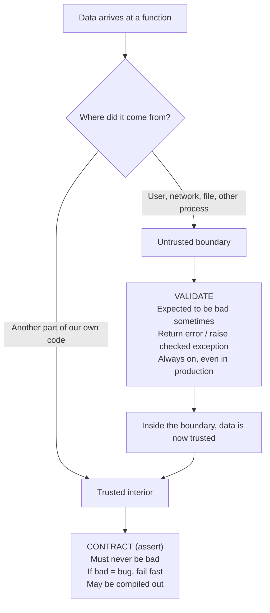
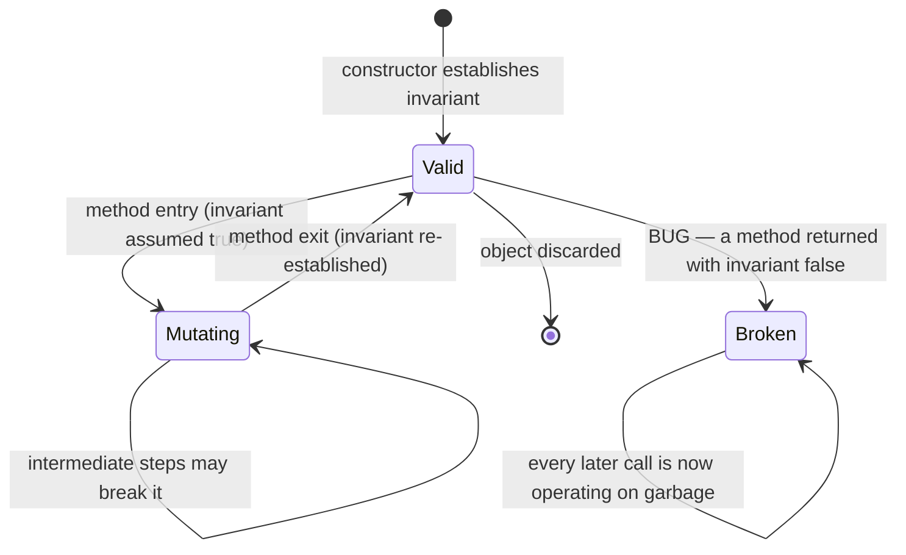

# Design by Contract — Middle Level

> Focus: "Why?" and "When does it bend?" — the trade-offs behind contracts, where the checks belong, what they cost, and the precise boundary between a contract breach (a bug) and invalid input (an expected event).

---

## Table of Contents

1. [The one distinction that drives everything: bug vs. expected input](#the-one-distinction-that-drives-everything-bug-vs-expected-input)
2. [Where the check goes: caller vs. callee](#where-the-check-goes-caller-vs-callee)
3. [Assertions that can be compiled out](#assertions-that-can-be-compiled-out)
4. [Postconditions: the half everyone skips](#postconditions-the-half-everyone-skips)
5. [Invariants and how to keep them alive across mutations](#invariants-and-how-to-keep-them-alive-across-mutations)
6. [Liskov substitution, stated as contracts](#liskov-substitution-stated-as-contracts)
7. [Contracts as living documentation](#contracts-as-living-documentation)
8. [When full DbC is overkill](#when-full-dbc-is-overkill)
9. [Common Mistakes](#common-mistakes)
10. [Test Yourself](#test-yourself)
11. [Cheat Sheet](#cheat-sheet)
12. [Summary](#summary)
13. [Further Reading](#further-reading)
14. [Related Topics](#related-topics)

---

## The one distinction that drives everything: bug vs. expected input

Almost every confused conversation about contracts comes from collapsing two different things into one word, "check." They are not the same:

- A **contract breach** is a *bug in the program*. The caller promised something (`index >= 0`) and broke the promise. There is no sensible recovery — the program is in a state its author swore could not happen. The right response is to **fail fast**: crash loudly, with a stack trace, in the developer's face, ideally before the code ships.
- **Invalid external input** is an *expected runtime event*. A user typed a negative age into a form; a JSON payload arrived malformed; a file is missing. Nothing is broken — the world is simply doing what the world does. The right response is to **validate and return an error** the caller can act on.



The same physical line of code — `if amount < 0` — means opposite things depending on which side of the boundary it sits. Outside, it is a guard clause that returns `400 Bad Request`. Inside, after validation, the equivalent assertion exists only to catch *our own* mistakes, and may be disabled in production.

This boundary is exactly the subject of [Defensive vs Offensive](../16-defensive-vs-offensive/README.md). The short version: **be defensive at the boundary, offensive in the interior.** DbC is the formalism for the offensive interior — it names the obligations so "trusted" is not just a vibe.

> **The blame test.** When an assertion fails, ask: "Whose fault is this?" If the answer is "the caller violated the documented precondition," it is a contract breach — fail fast. If the answer is "a human or external system sent us garbage," it is input — validate and respond. The fix lives in different places, so the mechanism must differ.

---

## Where the check goes: caller vs. callee

A contract has two parties, and each owns one side:

| Clause | Who must satisfy it | Who may assume it |
|---|---|---|
| **Precondition** | the **caller** (before the call) | the **callee** (on entry) |
| **Postcondition** | the **callee** (before returning) | the **caller** (after the call) |
| **Invariant** | the **callee** (the class) | everyone, always, between calls |

The practical consequence is the rule that beginners get wrong constantly: **the callee does not have to handle a violated precondition gracefully.** If `sqrt(x)` documents `requires x >= 0`, it is the *caller's* job to ensure that. `sqrt` may assert it and crash; it is not obligated to return `NaN` or throw a recoverable exception.

### Don't double-check trusted internal calls

If `validateAndStore()` already checked that `email` is non-null and well-formed, the private helper `persist(email)` it calls should *not* re-validate. Re-checking is not "extra safety" — it is:

- **Confusing.** A reader sees the check in `persist` and infers `email` might be null here, contradicting the caller's guarantee. The code now lies about its own invariants.
- **A maintenance tax.** Two copies of the rule drift apart; one gets a fix the other doesn't.
- **A performance cost** in hot paths, multiplied by every layer that re-validates.

The fix: validate **once**, at the trust boundary. Everything inside trusts the boundary. If you feel the urge to re-check internally, encode the guarantee in the *type* instead — a `ValidatedEmail` value object that cannot be constructed from a bad string makes the check unrepeatable because it already happened.

```python
# Boundary: validate, produce a trusted type
def parse_email(raw: str) -> ValidatedEmail:
    if "@" not in raw:
        raise ValueError(f"not an email: {raw!r}")   # expected input failure
    return ValidatedEmail(raw)

# Interior: assume the type's guarantee. No re-check.
def persist(email: ValidatedEmail) -> None:
    assert email is not None          # contract: a bug if violated, never user input
    db.write(email.value)
```

Once `ValidatedEmail` exists, even the `assert` is arguably redundant — the type system carries the guarantee. That is the endgame of DbC: **push contracts into types until there is nothing left to assert.**

---

## Assertions that can be compiled out

Most languages let you disable assertions in production:

- **Java:** assertions are off by default; `-ea` enables them, `-da` disables. Production typically runs without `-ea`.
- **Python:** `assert` statements are stripped when the interpreter runs with `-O` (optimized).
- **Go:** has no `assert`; people simulate it, but the idiomatic move is an explicit `panic` (always on) for true invariants — there is nothing to compile out.
- **C/C++:** `assert` from `<cassert>` is removed when `NDEBUG` is defined.

This compile-out behavior is **fine for contracts and fatal for validation.** Here is the rule, and it is not negotiable:

> **Use `assert` only for things that, if false, mean your own code has a bug. Never use `assert` for input validation, and *never* for a security check.**

Why it is safe for contracts: a precondition like `assert index >= 0` exists to catch *developer* mistakes during development and test. If your tests are good, the assertion already fired in CI; in production it is a backstop. Disabling it trades a tiny safety margin for speed, which is a reasonable bet for internal invariants.

Why it is catastrophic for validation: if you write `assert user.is_authorized()` and ship to production with `-O`, the check *vanishes* and every request is authorized. Security and input validation must be **ordinary control flow** — `if`/raise/return — that the optimizer cannot delete.

```java
// WRONG — disappears under -da (which is the default!)
public void transfer(Account from, BigDecimal amount) {
    assert from.balance().compareTo(amount) >= 0 : "insufficient funds";  // BUG WAITING
}

// RIGHT — overdraft is an expected business condition, not a contract breach
public void transfer(Account from, BigDecimal amount) {
    if (from.balance().compareTo(amount) < 0) {
        throw new InsufficientFundsException(from, amount);   // always enforced
    }
}
```

Insufficient funds is something the world *will* do; it is input, not a bug. The assertion form is doubly wrong: wrong category, and silently gone in production.

---

## Postconditions: the half everyone skips

Preconditions get all the attention because they protect the function from the world. **Postconditions protect the world from the function** — they assert what the routine guarantees on the way out. They are skipped because they feel redundant ("I just wrote the code, of course it's sorted"). They are valuable precisely when that confidence is misplaced.

```python
def insert_sorted(items: list[int], value: int) -> list[int]:
    result = _do_insert(items, value)   # the real, fallible logic
    assert result == sorted(result), "postcondition: result must be sorted"
    assert len(result) == len(items) + 1, "postcondition: exactly one element added"
    return result
```

A postcondition is the cheapest possible regression test: it runs on *every* call during development, against *real* data, not just the inputs your test author imagined. When someone refactors `_do_insert` and breaks sortedness, the postcondition fires immediately, at the scene of the crime — not three layers downstream where the symptom finally surfaces.

This is also the bridge to **property-based testing**. A postcondition *is* a property. "The result is always sorted" and "the length grows by exactly one" are exactly the invariants a property test would generate hundreds of random inputs to probe. Writing them as postconditions means your assertions do double duty: live in-process checks *and* the specification a fuzzer checks. (See `../../refactoring/README.md` for where this fits in a refactoring-with-confidence workflow.)

---

## Invariants and how to keep them alive across mutations

A **class invariant** is a property that holds for every instance, observable by any client, *between* method calls. Example: in a `BankAccount`, `balance == sum(transactions)`. Or in a `Rectangle`, `width >= 0 && height >= 0`.

The hard part is not stating the invariant — it is keeping it true across every mutating method. Each method may *temporarily* break it mid-execution but **must restore it before returning**.



The danger is the `Broken` state: once a method returns having quietly left the invariant false, *every subsequent method* runs on a corrupt object, and the eventual crash is far from the real cause. This is **invariant drift**, and it is one of the nastiest debugging experiences in software.

Two practical defenses:

1. **Funnel mutation through few methods.** If only three methods can change state, you only have three places to verify the invariant on exit. A class with 20 public setters has 20 chances to drift. This is one more reason cohesive classes with narrow mutation surfaces are easier to keep correct (see [classes](../09-classes/README.md)).
2. **Check the invariant on exit of mutators**, behind an assertion so it can be compiled out:

```python
class BankAccount:
    def __init__(self, opening: int):
        self._balance = opening
        self._txns: list[int] = []
        self._check_invariant()

    def _check_invariant(self) -> None:
        assert self._balance == sum(self._txns) + self._opening_balance, \
            "invariant: balance must equal opening + transactions"

    def post(self, amount: int) -> None:
        self._txns.append(amount)       # invariant temporarily... still holds here actually
        self._balance += amount         # restored
        self._check_invariant()         # verify before returning
```

The deepest fix is **immutability**: an object that never mutates cannot drift, because the invariant is established once in the constructor and can never be violated afterward. When you can afford it, immutable value objects make whole categories of invariant bugs impossible.

---

## Liskov substitution, stated as contracts

The Liskov Substitution Principle (LSP) is usually stated abstractly: "subtypes must be substitutable for their base types." Contracts make it *precise and checkable*. A subtype may override a method, but the override's contract is constrained:

> A subtype may **weaken** the precondition (accept *more*) and **strengthen** the postcondition (promise *more*) — **never the reverse.**

The intuition: a caller wrote code against the *base* contract. It guarantees only the base precondition and relies on only the base postcondition. If the subtype:

- **Strengthens the precondition** (demands *more* than the base), the caller's perfectly-legal input is now rejected. Substitutability broken.
- **Weakens the postcondition** (promises *less* than the base), the caller's code that relied on the base guarantee now gets less than it counted on. Substitutability broken.

```
                       Precondition          Postcondition
Base contract:         x >= 0                result is sorted
-----------------------------------------------------------------
Legal subtype:         x >= -10  (weaker)    result is sorted AND deduped (stronger)   ✓
ILLEGAL subtype:       x >= 5    (stronger)  result is "some order" (weaker)           ✗
```

A concrete classic: `Rectangle` with independent `setWidth`/`setHeight`, and `Square extends Rectangle` that forces width == height. `Square.setWidth` strengthens the precondition (it secretly also constrains height) and breaks the postcondition a caller expects (`setWidth(5)` no longer leaves height unchanged). Code written for `Rectangle` malfunctions when handed a `Square`. The LSP-as-contracts lens tells you *why* before you ever hit the bug: the override narrowed what callers were promised.

This is not academic. Every time you override a method, you are editing a contract. If you tighten what it accepts or loosen what it returns, you have created a landmine for anyone using the base type.

---

## Contracts as living documentation

A comment like `// amount must be positive` is **contract-as-comment**: it rots, because nothing enforces it. The day someone passes a negative amount and the comment is wrong, the comment stays wrong forever. Worse, comments are invisible to tools.

An executable contract is documentation that *cannot* lie, because it runs:

```go
// Go: no assert, so an explicit panic for a true contract breach.
// Withdraw requires amount > 0 and amount <= balance; violating the first is a
// programming bug (the caller should have validated), the second is business logic.
func (a *Account) Withdraw(amount int) {
    if amount <= 0 {
        panic(fmt.Sprintf("contract violation: Withdraw amount must be positive, got %d", amount))
    }
    if amount > a.balance {
        // expected condition, not a bug — but in this internal API we model it as caller error
        panic(fmt.Sprintf("contract violation: insufficient funds: %d > %d", amount, a.balance))
    }
    a.balance -= amount
}
```

In **Eiffel**, the language where DbC was born, this is first-class syntax — `require`, `ensure`, and `invariant` clauses are part of the method declaration, checked at runtime, *and* extracted automatically into the API documentation. The same contract is the spec, the runtime check, and the docs, with zero duplication. Modern languages approximate this with assertions plus docstrings/Javadoc; the discipline is to keep the prose and the assertion in sync — or better, let the assertion *be* the spec and write prose only for the "why."

The payoff: a new engineer reading `Withdraw` learns the rules *from code that is guaranteed current*, not from a comment that may be three years stale.

---

## When full DbC is overkill

DbC is a discipline with a cost, and it has a sweet spot. Apply it heavily at **module and component boundaries** — the public API others depend on. Apply it lightly, or not at all, in the **small private interior**.

Skip or minimize contracts when:

- **Tiny private helpers.** A two-line private function `_double(x int) int { return x*2 }` does not need a precondition. The caller is right there, in the same file, written by the same person. The contract is obvious and the audience is one.
- **The type already enforces it.** If a parameter is a non-nullable `PositiveInt`, asserting `x > 0` is redundant — the type made the bad value unconstructible. Prefer the type.
- **The check is more complex than the code.** If verifying the postcondition costs more than recomputing the answer (e.g., re-sorting to assert sortedness on a hot path of millions of calls), measure, and consider sampling the check or gating it behind a debug-only build.
- **Throwaway code.** A migration script that runs once does not need a contract suite.

The reverse failure mode is real too: over-contracting clutters code and trains readers to ignore assertions. **Contract the boundaries and the invariants; trust the interior.** That single sentence captures most of good DbC practice.

---

## Common Mistakes

1. **Using `assert` for input validation.** It vanishes under `-O`/`-da`/`NDEBUG`. User input must be checked with real control flow. Reserve `assert` for "this can only be false if *my* code is buggy."
2. **Catching a contract violation.** A breach means the program is in an impossible state. Wrapping it in `try/except` and "recovering" hides the bug and continues on corrupt data. Let it crash.
3. **Double-checking across trusted layers.** Validating the same thing in five nested internal functions. Validate once at the boundary; trust the interior; encode guarantees in types.
4. **Stating only preconditions.** Skipping postconditions throws away the cheapest regression check you have. Assert what you guarantee, not just what you require.
5. **Letting invariants drift.** A mutator that returns with the invariant broken corrupts every later call. Funnel mutation, check on exit, or go immutable.
6. **Strengthening a precondition in an override.** The textbook LSP break. A subtype that accepts *less* than its base is not substitutable, no matter what `extends` says.
7. **Contract-as-comment.** `// must be > 0` enforced by nothing. If it matters, make it executable; if it doesn't, delete the comment.
8. **Contracting every private one-liner.** Ceremony with no payoff that desensitizes readers to the assertions that *do* matter.

---

## Test Yourself

<details>
<summary>1. A function receives a string from an HTTP request body. Should you guard it with an <code>assert</code> or with an <code>if</code>/raise? Why?</summary>

With `if`/raise (or a checked exception / error return). The HTTP body is **untrusted external input** — bad data is *expected*, not a bug. `assert` is wrong twice: it categorizes the failure as a programmer bug, and it is compiled out in production (`-O`, `-da`, `NDEBUG`), so the check disappears exactly where you need it most. Validate input with ordinary control flow that the optimizer cannot remove.
</details>

<details>
<summary>2. Your service validates an order at the API boundary. A private method three layers deep re-validates the same fields. Good defensive programming?</summary>

No — it is harmful double-checking. The re-check implies the data might be bad here, contradicting the boundary's guarantee, so the code now lies about its invariants. The two copies of the rule will drift, and you pay the cost on every call. Validate once at the boundary; trust the interior. If you want a hard guarantee, give the interior a *validated type* (e.g. `ValidatedOrder`) that cannot be constructed from bad data — then there is nothing to re-check.
</details>

<details>
<summary>3. Why is it safe to disable contract assertions in production but never input validation?</summary>

A contract assertion guards against *your own bugs*; if your tests are good it already fired in CI, so in production it is a backstop you can trade for speed. Input validation guards against *the world*, which never stops sending bad data; disabling it means malformed or malicious input flows straight through. The categories are different, so the mechanisms must be: `assert` (removable) for contracts, real control flow (permanent) for validation and especially security.
</details>

<details>
<summary>4. State the Liskov rule for an overridden method in terms of pre/postconditions, and explain the direction.</summary>

An override may **weaken** the precondition (accept more) and **strengthen** the postcondition (promise more), never the reverse. The caller wrote code against the *base* contract: it supplies only what the base precondition required and relies on only what the base postcondition promised. Strengthening the precondition rejects input the caller is allowed to send; weakening the postcondition delivers less than the caller relied on. Either one breaks substitutability.
</details>

<details>
<summary>5. A <code>BankAccount.post()</code> appends a transaction and updates the balance, but a refactor reorders the two lines so the method returns with <code>balance != sum(txns)</code>. What does this category of bug do, and how does an invariant check help?</summary>

It is **invariant drift**: the object returns from a mutator in an impossible state, so every *subsequent* method runs on corrupt data and the eventual crash is far from the cause — a brutal debugging session. An invariant check (`_check_invariant()` asserted on exit of every mutator) fires *immediately*, at the method that broke it, turning a distant mysterious symptom into a local, obvious failure. Funneling all mutation through few methods minimizes the places drift can originate.
</details>

<details>
<summary>6. When is writing a contract genuinely a waste of effort?</summary>

For tiny private helpers whose only caller is right beside them; when the parameter type already makes bad values unconstructible (prefer the type over a redundant assert); when checking the postcondition costs more than computing the answer on a hot path (measure, sample, or debug-gate it); and for throwaway/run-once code. Contract the public boundaries and the class invariants; trust the small interior. Over-contracting trains readers to ignore assertions.
</details>

<details>
<summary>7. Why is a postcondition described as "the cheapest regression test"?</summary>

Because it runs on *every* real call during development, against real production-shaped data, not just the handful of inputs a test author imagined. When a later refactor breaks the guarantee, the postcondition fires at the scene of the crime instead of letting a corrupted result propagate. And since a postcondition *is* a property ("result is always sorted"), it doubles as the specification a property-based test would check.
</details>

---

## Cheat Sheet

| Situation | Mechanism | Always on in prod? |
|---|---|---|
| Untrusted external input (user, network, file) | `if` / raise / error return — **validate** | Yes |
| Security / authorization check | Ordinary control flow | **Yes — never `assert`** |
| Internal precondition (our code must satisfy) | `assert` / `panic` for true breach | Optional (compile-out OK) |
| Postcondition (what we guarantee on return) | `assert` | Optional (compile-out OK) |
| Class invariant | `assert` on mutator exit, or immutability | Optional (compile-out OK) |
| Guarantee you want *unconditionally* | Encode in a **type** (validated value object) | Yes (structural) |

| Clause | Caller's job | Callee's job |
|---|---|---|
| Precondition | **satisfy it** before calling | may assume it; assert as backstop |
| Postcondition | may assume it after the call | **guarantee it** before returning |
| Invariant | — | hold it between every public call |

| LSP for overrides | Allowed | Forbidden |
|---|---|---|
| Precondition | weaken (accept more) | strengthen (accept less) |
| Postcondition | strengthen (promise more) | weaken (promise less) |

---

## Summary

The whole subject turns on one distinction: a **contract breach is a bug** (fail fast, `assert`, may compile out) while **invalid external input is expected** (validate, real control flow, always on). Put the check at the **trust boundary once**, and trust the interior — re-checking trusted internal calls is confusing duplication, not safety; encode hard guarantees in **types** so the check becomes unrepeatable. Each clause has an owner: callers satisfy preconditions, callees guarantee postconditions, classes hold invariants between calls. Don't skip postconditions — they are the cheapest regression check and the bridge to property-based testing. Keep invariants alive by funneling mutation and checking on exit, or sidestep the problem with immutability. Under inheritance, the **Liskov rule** is just contract math: weaken preconditions, strengthen postconditions, never the reverse. Executable contracts are documentation that cannot rot. And apply all of this at the boundaries and invariants — full DbC on every private one-liner is ceremony that trains people to ignore your assertions.

---

## Further Reading

- `junior.md` — the mechanics: how to write a precondition, postcondition, and invariant from scratch.
- `senior.md` — contracts at architectural scale: service contracts, schema/consumer-driven contracts, and DbC in CI.
- [Defensive vs Offensive](../16-defensive-vs-offensive/README.md) — the stance behind the boundary: where to be paranoid and where to be trusting.
- [Classes](../09-classes/README.md) — cohesion and narrow mutation surfaces, which make invariants tractable.
- Bertrand Meyer, *Object-Oriented Software Construction* (2nd ed.) — the original, definitive treatment of Design by Contract in Eiffel.

---

## Related Topics

- [Defensive vs Offensive Programming](../16-defensive-vs-offensive/README.md) — the trust-boundary stance DbC formalizes.
- [Classes](../09-classes/README.md) — where invariants live and how cohesion keeps them honest.
- [Chapter README](../README.md) — the positive rules and the full anti-pattern list for this chapter.
- [Anti-Patterns](../../anti-patterns/README.md) — implicit contracts and invariant drift as recurring failure modes.
- [Refactoring](../../refactoring/README.md) — postconditions and invariants as the safety net that makes refactoring safe.
