# Design by Contract — Optimize & Reconcile

> Contracts make code correct. Naively checked, they also make it slow. This file reconciles the two: 12 scenarios where a precondition, postcondition, or invariant check sits on a hot path or costs more than the work it guards. For each: the scenario, a measurement or back-of-envelope cost, and a principled resolution that keeps the contract *checked where it matters* and *free where it doesn't*. The governing idea — a contract is a statement about what *must* be true for the program to be correct, so it can be verified offline, at a boundary, or by the type system, instead of re-verified on every call in production.

The non-negotiable line, repeated because it is the one mistake that turns a performance win into a CVE: **input validation is never a contract you may strip.** A contract guards against *programmer* error (a bug in your own code that should never ship); validation guards against *attacker/user* error (data crossing a trust boundary that absolutely will be malicious). Strip the former in production; keep the latter always. Confusing the two is how `assert authenticated` disappears under `python -O`.

---

## Table of Contents

1. [Precondition check on a 50M-calls/sec hot path (Java `-ea`)](#scenario-1)
2. [O(n log n) postcondition: "the array is sorted" (Python `-O`)](#scenario-2)
3. [Stripping a check that is actually validation — the security trap](#scenario-3)
4. [Caller and callee both check the same precondition (Go)](#scenario-4)
5. [Class invariant re-verified on every mutator (Java)](#scenario-5)
6. [Assertion levels: cheap always, expensive only in `debug` (Go build tags)](#scenario-6)
7. [Postcondition allocates to snapshot "old" state (Java)](#scenario-7)
8. [Property-based tests verify the contract offline at zero prod cost (Python)](#scenario-8)
9. [Compile-time contracts: types as zero-runtime-cost preconditions (Go)](#scenario-9)
10. [Boundary check once vs per-method invariant in a loop (Java)](#scenario-10)
11. [Expensive precondition lifted out of a tight loop (Go)](#scenario-11)
12. [`assert` with a side effect that vanishes under `-O` (Python)](#scenario-12)

---

<a name="scenario-1"></a>
### Scenario 1 — Precondition check on a 50M-calls/sec hot path (Java)

```java
public final class RingBuffer {
    private final long[] slots;
    public long get(int index) {
        if (index < 0 || index >= slots.length)        // precondition
            throw new IndexOutOfBoundsException(index);
        return slots[index];
    }
}
```

**Scenario:** `get` is called 50M times/sec inside a market-data decoder. `index` is always produced by an internal mask (`pos & (size - 1)`) that mathematically cannot go out of range — the bound is an *internal contract*, not external input.

**Measurement:** the explicit branch costs ~0.3–1 ns per call when well-predicted. At 50M calls/sec that is 15–50 ms/sec of pure check overhead — 1.5–5% of a core, burned re-proving something the caller already guarantees. Worse, the redundant branch is *also* checked by the JVM's own array-access bounds check, so you pay twice; the manual check can defeat the JIT's bounds-check elimination.

<details><summary>Resolution</summary>

Express the bound as a Java `assert`, which is stripped unless the JVM runs with `-ea`:

```java
public long get(int index) {
    assert index >= 0 && index < slots.length : "internal contract: masked index";
    return slots[index];   // JVM still bounds-checks; throws AIOOBE on real bug
}
```

- **Test/staging:** run with `-ea`. The assertion fires with a precise message the instant the masking logic is wrong.
- **Production:** run without `-ea`. The check compiles to nothing; the JIT is free to eliminate the *array* bounds check via loop-range analysis. Zero overhead, and a genuine bug still throws `ArrayIndexOutOfBoundsException` rather than corrupting memory (the JVM guarantees memory safety regardless).

This is the canonical DbC/performance reconciliation: the contract is *documented and enforced in test*, *free in prod*, and the language's own safety net catches the unthinkable. Do **not** do this if `index` comes from a network frame — then it is validation, see Scenario 3.
</details>

---

<a name="scenario-2"></a>
### Scenario 2 — An O(n log n) postcondition on an O(n) routine (Python)

```python
def merge_sorted(a: list[int], b: list[int]) -> list[int]:
    result = _two_pointer_merge(a, b)      # O(n) — the actual work
    assert result == sorted(result), "postcondition: output is sorted"
    return result
```

**Scenario:** `merge_sorted` is the inner step of a streaming merge over millions of small lists. The routine itself is O(n). The postcondition `result == sorted(result)` is O(n log n) — it does *more work than the function it checks*, and it allocates a full second copy.

**Measurement:** for n = 1000, the merge is ~1000 ops; `sorted(result)` is ~10,000 ops plus a 1000-element allocation. The check is ~10× the cost of the work, run on every call. A 30s job becomes a 5-minute job.

<details><summary>Resolution</summary>

Two moves. First, make the postcondition O(n) — *checking* sortedness is linear, even though *producing* a sort is not:

```python
def _is_sorted(xs: list[int]) -> bool:
    return all(xs[i] <= xs[i + 1] for i in range(len(xs) - 1))

def merge_sorted(a: list[int], b: list[int]) -> list[int]:
    result = _two_pointer_merge(a, b)
    assert _is_sorted(result), "postcondition: output is sorted"
    return result
```

Second, gate it so it vanishes in production. Python's `assert` is removed when the interpreter runs with `-O`:

```bash
# CI / staging — contract enforced
python -m pytest

# production
python -O app.py        # assert statements stripped, __debug__ == False
```

Now the contract is checked on every call in CI (where correctness matters and throughput doesn't), and costs nothing in prod. The general rule: **a checking algorithm is usually cheaper than the producing algorithm** (verify-sorted is O(n) vs sort O(n log n); verify-a-solution is often O(n) vs solve O(2ⁿ)). Reach for the cheap verifier, then gate even that.
</details>

---

<a name="scenario-3"></a>
### Scenario 3 — Stripping a check that is actually validation (the security trap)

```python
def transfer(from_acct, to_acct, amount_cents: int):
    assert amount_cents > 0, "amount must be positive"
    assert from_acct.balance_cents >= amount_cents, "insufficient funds"
    from_acct.balance_cents -= amount_cents
    to_acct.balance_cents   += amount_cents
```

**Scenario:** `amount_cents` arrives from an HTTP request body. A profiler shows the function is hot, so an engineer "optimizes" by deploying with `python -O` to strip the asserts. Both checks disappear. An attacker posts `amount_cents = -1_000_000` and *credits* their own account.

**Measurement:** the checks cost ~50 ns. The cost of removing them is unbounded financial loss. This is not a performance trade-off; it is a vulnerability introduced under the banner of performance.

<details><summary>Resolution</summary>

Draw the bright line. **Validation of data crossing a trust boundary must be a real, unconditional statement — never `assert`, never behind a build tag, never `-ea`/`-O`-gated.**

```python
def transfer(from_acct, to_acct, amount_cents: int):
    if amount_cents <= 0:
        raise ValueError("amount must be positive")          # validation — always runs
    if from_acct.balance_cents < amount_cents:
        raise InsufficientFunds()                            # validation — always runs

    # Now an internal contract is legitimately assertable:
    assert from_acct.balance_cents >= amount_cents           # re-stated invariant, debug-only
    from_acct.balance_cents -= amount_cents
    to_acct.balance_cents   += amount_cents
```

The litmus test for "may I strip this?":

| Question | If yes → contract (strippable) | If no → validation (keep always) |
|---|---|---|
| Could only a *bug in my own code* make this false? | yes | — |
| Could a *user/attacker/foreign system* make this false? | — | yes |
| Is the input still inside my trust boundary? | yes | — |

A precondition and a validation can look byte-identical (`x > 0`). The difference is *who can violate it*. Audit every `assert` and every `-ea`-guarded check against this table before shipping a strip. CWE-617 catalogs the assert-misuse failure mode directly.
</details>

---

<a name="scenario-4"></a>
### Scenario 4 — Caller and callee both check the same precondition (Go)

```go
func ProcessBatch(items []Item) {
    if items == nil {
        panic("items must not be nil")
    }
    for _, it := range items {
        normalize(&it)
    }
}

func normalize(it *Item) {
    if it == nil {                      // redundant: ProcessBatch already ruled out nil items
        panic("item must not be nil")
    }
    it.Name = strings.TrimSpace(it.Name)
}
```

**Scenario:** `normalize` re-checks `it != nil` on every iteration, but its only caller (`ProcessBatch`) iterates a slice it already proved non-nil, and slice elements are never nil pointers here. The check is pure redundancy multiplied by batch size.

**Measurement:** for a 10K-item batch the inner nil check runs 10K times per batch, all guaranteed to pass. Beyond the cycles, it muddies the contract: a reader can't tell whether `normalize` is *meant* to be called with nil (defensive) or whether nil is a *bug* (contract). Double-checking obscures ownership.

<details><summary>Resolution</summary>

Assign the precondition to **one** party and document the division. In DbC the *caller* satisfies the precondition; the callee may assume it. Make that explicit and remove the redundant guard:

```go
// normalize trims the item's name in place.
// Precondition: it != nil (caller's responsibility).
func normalize(it *Item) {
    it.Name = strings.TrimSpace(it.Name)
}
```

If you want the contract enforced during development but free in production, gate it with a build tag rather than checking on every call:

```go
//go:build contracts

package order
func assertNonNil(it *Item) {
    if it == nil { panic("contract: item must not be nil") }
}
```

```go
//go:build !contracts

package order
func assertNonNil(it *Item) {}   // compiles to nothing; inlined away
```

Build CI with `go test -tags contracts`; ship the production binary without the tag. The result is **both faster and clearer**: fewer instructions *and* a single, documented owner for the precondition. Redundant defensive checks are a code smell precisely because they hide *who is to blame* when the contract breaks.
</details>

---

<a name="scenario-5"></a>
### Scenario 5 — Class invariant re-verified on every mutator (Java)

```java
final class Portfolio {
    private final Map<String, Long> shares = new HashMap<>();
    private long cashCents;

    void buy(String sym, long qty, long priceCents) {
        cashCents -= qty * priceCents;
        shares.merge(sym, qty, Long::sum);
        checkInvariant();                 // runs after every mutation
    }

    private void checkInvariant() {
        long marketValue = shares.entrySet().stream()
            .mapToLong(e -> e.getValue() * priceOf(e.getKey()))   // priceOf hits a cache/feed
            .sum();
        if (cashCents + marketValue < 0)
            throw new IllegalStateException("portfolio underwater");
    }
}
```

**Scenario:** `checkInvariant` walks every holding and looks up a price for each — O(positions) with a (cached) feed call per symbol. It runs after *every* `buy`/`sell`. During a bulk rebalance of 500 trades over a 200-position portfolio that is 500 × 200 = 100K price lookups, almost all redundant.

**Measurement:** at ~200 ns per cached `priceOf`, one `checkInvariant` is ~40 µs; 500 of them is ~20 ms of pure invariant-checking on an operation whose useful work is microseconds. The check is O(n) and runs O(m) times → O(n·m).

<details><summary>Resolution</summary>

An invariant must hold at every *observable* boundary — not after every *internal* step. Check it **once** when control returns to the client, and gate it as an assertion:

```java
void rebalance(List<Trade> trades) {
    for (Trade t : trades) {
        applyRaw(t);                  // mutates without per-step invariant check
    }
    assert invariantHolds() : "portfolio underwater after rebalance";   // once, -ea only
}

private void applyRaw(Trade t) {
    cashCents -= t.qty() * t.priceCents();
    shares.merge(t.sym(), t.qty(), Long::sum);
}
```

This collapses O(n·m) to O(n) and moves the cost behind `-ea`. The principle: **invariants are guaranteed across public-method boundaries, and methods are permitted to break the invariant transiently in between.** A private `applyRaw` that leaves the invariant temporarily false is fine *as long as no client can observe that state*. Where you genuinely need per-mutation enforcement (concurrent readers can observe intermediate state), keep an incremental running total instead of recomputing — maintain `cachedMarketValue` as a field updated by ±`qty * price` so the check is O(1).
</details>

---

<a name="scenario-6"></a>
### Scenario 6 — Assertion levels: cheap always, expensive only in debug (Go)

```go
func (t *BTree) Insert(key, val []byte) {
    t.insertInternal(key, val)
    if err := t.verifyBalanced(); err != nil {   // O(n) full-tree walk, every insert
        panic(err)
    }
}
```

**Scenario:** `verifyBalanced` walks the entire B-tree checking node fill factors and key ordering — a beautiful, thorough invariant. Run on every insert it makes insertion O(n) instead of O(log n), turning a 1M-row bulk load from seconds into minutes.

**Measurement:** insert work is ~log₂(1M) ≈ 20 comparisons; `verifyBalanced` is ~1M node visits. The check is ~50,000× the cost of the operation it guards. Even in CI a full-walk-per-insert can make the test suite unusably slow.

<details><summary>Resolution</summary>

Introduce **assertion levels** — cheap checks always on, expensive checks behind a tunable. Some checks are too costly even for normal test runs and belong to a "paranoid" tier exercised only by dedicated invariant tests or fuzzing.

```go
// AssertLevel: 0 = off (prod), 1 = cheap contracts (test), 2 = expensive invariants (fuzz/CI-nightly)
var AssertLevel = 0

func (t *BTree) Insert(key, val []byte) {
    if AssertLevel >= 1 && key == nil {
        panic("contract: key must not be nil")       // O(1) — affordable in every test
    }
    t.insertInternal(key, val)
    if AssertLevel >= 2 {
        if err := t.verifyBalanced(); err != nil {   // O(n) — only paranoid tier
            panic(err)
        }
    }
}
```

- **Prod:** `AssertLevel = 0` (or compile the whole block out with a build tag for guaranteed zero cost).
- **Unit tests:** `AssertLevel = 1` — cheap preconditions on every operation.
- **Nightly fuzz / property tests:** `AssertLevel = 2` — full structural verification, accepting the slowdown because correctness is the goal and throughput isn't.

The reconciliation: you keep the strong O(n) invariant *as code that runs*, but you choose *when* its cost is acceptable. The expensive check still earns its keep — it just runs against thousands of fuzzed operations overnight rather than on the customer's bulk load. This tiering mirrors how production databases gate consistency checks behind a verification mode rather than the write path.
</details>

---

<a name="scenario-7"></a>
### Scenario 7 — Postcondition allocates to snapshot "old" state (Java)

```java
void deposit(long amountCents) {
    long oldBalance = balanceCents;                    // snapshot for postcondition
    List<Txn> oldLog = new ArrayList<>(this.log);      // deep-ish copy, every call
    balanceCents += amountCents;
    log.add(new Txn(amountCents));
    assert balanceCents == oldBalance + amountCents;
    assert log.size() == oldLog.size() + 1;
}
```

**Scenario:** the postcondition compares post-state to pre-state, so the code snapshots `old` values up front — including copying the entire transaction log. The copy happens **unconditionally**, even in production where the assert is stripped, because the snapshot is plain code, not part of the `assert`.

**Measurement:** copying a 10K-entry log on every deposit is ~10K-element allocation + copy per call. With `-da` (assertions disabled) the comparison is gone but the expensive snapshot still runs — you pay the full setup cost for a check that no longer executes. This is the subtle trap: *only the `assert` expression is stripped; surrounding setup is not.*

<details><summary>Resolution</summary>

Push the entire `old`-state capture inside an `assert` expression (or a method called only from one) so the JVM elides it together with the check when assertions are off:

```java
void deposit(long amountCents) {
    assert checkDeposit(amountCents);   // whole thing vanishes under -da
    balanceCents += amountCents;
    log.add(new Txn(amountCents));
    assert balanceCents >= 0;           // cheap O(1) post-check stays
}

// Returns true or throws; only invoked when -ea. The expensive snapshot
// lives here, so it is never allocated in production.
private boolean checkDeposit(long amountCents) {
    int oldSize = log.size();           // capture cheap derived facts, not deep copies
    // ... record what the postcondition needs ...
    return true;
}
```

Two lessons. (1) **Keep the snapshot inside the assertion's evaluation** so the dead-code elimination that removes the check also removes its setup. (2) **Snapshot derived scalars (`size()`, a checksum, a count), not deep copies of structures.** A postcondition rarely needs the whole old list — it needs "the list grew by one," which is a single `int`. Cheap O(1) postconditions can even stay unconditional; reserve the strip for the expensive ones. The cost of a contract is the cost of its *setup* as much as the check — measure both.
</details>

---

<a name="scenario-8"></a>
### Scenario 8 — Move contract verification offline into property-based tests (Python)

```python
def encode(frame: Frame) -> bytes: ...
def decode(data: bytes) -> Frame: ...

# Tempting "contract": verify the round-trip on every encode in prod.
def encode_checked(frame: Frame) -> bytes:
    data = encode(frame)
    assert decode(data) == frame, "round-trip postcondition"   # decode on every encode!
    return data
```

**Scenario:** the real contract is *"decode is the inverse of encode."* Verifying it inline means *decoding every frame you encode* — doubling work on the wire-serialization hot path even when the assert is `-O`-stripped, if the decode call sits outside the assert.

**Measurement:** inline round-trip verification at minimum doubles serialization cost (encode + decode per frame) and allocates the decoded frame. On a 100K-frames/sec link that is 100K wasted decodes/sec.

<details><summary>Resolution</summary>

The round-trip is a *universal property*, not a per-call obligation. Verify it **once, offline, over thousands of generated inputs** with property-based testing — then the production path carries zero verification cost:

```python
from hypothesis import given, strategies as st

@given(st.builds(Frame, id=st.integers(0, 2**32 - 1),
                        payload=st.binary(max_size=1500)))
def test_encode_decode_round_trip(frame):
    assert decode(encode(frame)) == frame      # the contract, proven over ~hundreds of cases
```

Production `encode` stays a bare, fast `encode(frame)` with no inline check. The contract is *still rigorously enforced* — just at CI time, against a far wider range of inputs than any single production call would exercise, at **zero production cost**. Property-based testing is the natural home for postconditions and invariants that are too expensive to check per call: round-trips (`decode∘encode == id`), idempotence (`f(f(x)) == f(x)`), commutativity, and "the output is sorted/balanced/conserved." See [`../../testing` property-based testing](../../refactoring/README.md) patterns and the `property-based-testing` discipline. The mental shift: **a contract is a specification; a property test is that specification executed against a generator — same statement, paid offline.**
</details>

---

<a name="scenario-9"></a>
### Scenario 9 — Compile-time contracts: types as zero-runtime-cost preconditions (Go)

```go
// Runtime precondition, checked on every call.
func Withdraw(amountCents int64) error {
    if amountCents < 0 {
        return errors.New("amount must be non-negative")   // runtime check, every call
    }
    ...
}
```

**Scenario:** every numeric argument that "must be non-negative," "must be one of {OPEN, CLOSED}," or "must be a valid currency code" is re-checked at runtime on every call across the codebase. Thousands of such guards, each a branch, each a place the contract can be forgotten.

**Measurement:** each guard is cheap individually (~1 ns) but they are everywhere and, more importantly, they are *checked at the wrong time* — at call time, possibly in production, repeatedly — when the fact could be guaranteed *once, at compile time, for free*.

<details><summary>Resolution</summary>

Encode the precondition in a **type**, so the compiler proves it and the runtime never checks it. A value that cannot be constructed in an invalid state needs no per-call guard.

```go
// A constrained constructor is the single validation point.
type Amount struct{ cents int64 }   // unexported field — cannot be built directly

func NewAmount(cents int64) (Amount, error) {
    if cents < 0 {
        return Amount{}, errors.New("amount must be non-negative")  // validated ONCE, at the boundary
    }
    return Amount{cents}, nil
}

// Now Withdraw needs no check — the type IS the precondition.
func Withdraw(a Amount) { ... }     // a.cents is non-negative by construction
```

Likewise replace stringly-typed enums with a closed type, and `func f(x *T)` "x must not be nil" with `func f(x T)` (a value parameter that *cannot* be nil). The contract moves from a runtime branch executed on every call to a **compile-time guarantee verified once during build, with zero runtime cost** — the cheapest possible contract. This is "parse, don't validate": validate at the boundary to *produce* a trustworthy type, then let every interior function trust the type instead of re-checking. Java enums and `record`s, and Python `@dataclass(frozen=True)` with a validating `__post_init__`, achieve the same: a single construction-time check replaces N call-time checks. See also [Defensive vs Offensive](../16-defensive-vs-offensive/README.md) for where the validating boundary belongs.
</details>

---

<a name="scenario-10"></a>
### Scenario 10 — Boundary check once vs per-method invariant in a loop (Java)

```java
class Matrix {
    private final double[][] rows;
    boolean isSquare() {                      // O(rows) check
        for (double[] r : rows)
            if (r.length != rows.length) return false;
        return true;
    }
    double determinant() {
        if (!isSquare()) throw new IllegalStateException();   // re-checked here
        ...
    }
    Matrix multiply(Matrix o) {
        if (!isSquare() || !o.isSquare()) throw new IllegalStateException();  // and here
        ...
    }
}
```

**Scenario:** "the matrix is square" is a class invariant, yet every operation re-derives it with an O(rows) scan. In a numerical loop calling `multiply` 1M times, the squareness scan dominates.

**Measurement:** for a 1000×1000 matrix, `isSquare()` is a 1000-iteration scan. Called twice per `multiply`, over 1M multiplies, that is 2 billion redundant length comparisons — checking a property that *cannot change* after construction.

<details><summary>Resolution</summary>

If a property is established at construction and the object is immutable, it is an **invariant to verify once at the boundary**, not a precondition to re-check per method:

```java
final class Matrix {
    private final double[][] rows;
    private final boolean square;      // computed once

    Matrix(double[][] rows) {
        this.rows = deepCopy(rows);
        this.square = computeSquare(this.rows);   // O(rows) — ONCE
    }

    double determinant() {
        assert square : "invariant: matrix is square";   // O(1), -ea only
        ...
    }
}
```

The O(rows) verification happens exactly once, at the trust boundary (the constructor). Every method then reads a cached `boolean` in O(1), gated behind `-ea` if you want it free in prod. The principle generalizes: **verify an expensive invariant once where the object enters a well-formed state, then trust it.** For mutable objects, verify at each public entry point but maintain the property incrementally (update a flag on mutation) rather than recomputing. The anti-pattern — recomputing an unchanging fact on every call — is the contract equivalent of hoisting a loop invariant, and the fix is the same: compute once, reuse.
</details>

---

<a name="scenario-11"></a>
### Scenario 11 — Expensive precondition lifted out of a tight loop (Go)

```go
func RenderAll(tmpl *Template, rows []Row) []string {
    out := make([]string, 0, len(rows))
    for _, r := range rows {
        if !tmpl.IsValid() {            // O(template size) parse-check, EVERY iteration
            panic("contract: template must be valid")
        }
        out = append(out, tmpl.Render(r))
    }
    return out
}
```

**Scenario:** `tmpl.IsValid()` re-parses and validates the template (an expensive O(template) precondition of `Render`). It is invariant across the loop — the template doesn't change — yet it runs once per row.

**Measurement:** for a 5KB template validated in ~20 µs, over 1M rows, that's 20 seconds of pure re-validation guarding a render that takes 2 µs. The check is 10× the work and 100% redundant after the first iteration.

<details><summary>Resolution</summary>

Hoist the loop-invariant precondition above the loop — check it **once** before iterating, exactly as you'd hoist any invariant computation:

```go
func RenderAll(tmpl *Template, rows []Row) []string {
    if !tmpl.IsValid() {                 // ONCE — caller's precondition, verified at entry
        panic("contract: template must be valid")
    }
    out := make([]string, 0, len(rows))
    for _, r := range rows {
        out = append(out, tmpl.Render(r))   // tmpl proven valid; no per-row check
    }
    return out
}
```

Better still, make validity a property of the *type* so it's checked at parse time and `Render` can assume it (Scenario 9): a `*ValidTemplate` returned only by `Parse() (*ValidTemplate, error)` cannot be invalid, so `RenderAll` accepts `*ValidTemplate` and drops the check entirely. The reconciliation theme recurs: a precondition that's invariant over a loop is checked once at the loop boundary; a precondition that's invariant over an object's lifetime is checked once at construction; a precondition expressible in the type system is checked once at compile time. **The optimal place to check a contract is the outermost scope where its truth is established.**
</details>

---

<a name="scenario-12"></a>
### Scenario 12 — `assert` with a side effect that vanishes under `-O` (Python)

```python
def commit(self, record):
    assert self._log.append(record) is None   # "always true" — but the append is the work!
    self._flush()
```

**Scenario:** an engineer folded a real mutation (`self._log.append(record)`) into an `assert` expression — perhaps to "save a line." `list.append` returns `None`, so `... is None` is always true and the assert passes in CI. But `python -O` strips the *entire* assert statement, including the `append`. In production, **records are silently never logged.**

**Measurement:** in CI (asserts on) everything works; tests pass. In production (`-O`) the append never runs — a 100% data-loss bug that no test catches because the test runs with assertions enabled. This is the dual of Scenario 7: there, useful work leaked *outside* the assert and ran needlessly; here, useful work hid *inside* the assert and vanished entirely.

<details><summary>Resolution</summary>

**Never put a side effect, mutation, or required computation inside an `assert`.** An assert must be a pure boolean predicate over existing state; stripping it must change *nothing* but the check itself.

```python
def commit(self, record):
    self._log.append(record)                      # real work — unconditional
    assert self._log[-1] is record, "log append postcondition"   # pure check, strippable
    self._flush()
```

This is the contract programmer's prime directive for assertions, and it dovetails with Scenario 3: an `assert` is only safe to strip if removing it leaves behavior identical in every respect except verification. To enforce it mechanically:

- Lint with rules that flag mutating calls inside `assert` (pylint `assert-on-tuple` and custom AST checks; Go vet has no `assert` so the build-tag pattern sidesteps this).
- In code review, treat any `assert someCall()` where `someCall` is not obviously pure as a defect.
- Test the production configuration in CI too: run a smoke suite under `python -O` so a stripped-assert behavior change surfaces before release.

The reconciliation: the performance win of strippable assertions is real and large, but it is *only* sound when assertions are pure. Side effects, validation (Scenario 3), and required work must live in unconditional code; assertions carry verification and nothing else.
</details>

---

## Rules of Thumb

- **Distinguish contract from validation before you optimize anything.** A contract guards against *your* bugs (strippable: `assert`, `-ea`, `-O`, build tags). Validation guards against *foreign* data crossing a trust boundary (never strippable). Identical-looking checks (`x > 0`) differ only in *who can violate them*. Audit every strip against this line.
- **Check at the outermost scope where the truth is established.** Loop-invariant precondition → hoist above the loop (once). Object-lifetime invariant → verify in the constructor (once). Type-expressible precondition → encode in the type (compile time, zero runtime cost). Re-checking an unchanging fact per call is a loop-invariant smell.
- **A checking algorithm is usually cheaper than the producing algorithm.** Verifying "sorted" is O(n) though sorting is O(n log n); verifying a solution is often O(n) though finding it is exponential. Reach for the verifier — then gate even that.
- **Gate expensive contracts behind assertion levels / build flags.** Cheap O(1) checks can stay always-on; O(n) and O(n log n) checks belong behind `-ea` (Java), `-O`/`__debug__` (Python), or build tags (Go) — enforced in test/staging/fuzz, free in prod.
- **Only the assert *expression* is stripped — surrounding setup is not.** Push expensive "old-state" snapshots *inside* the assert so they vanish with it; snapshot derived scalars (a count, a checksum), never deep copies.
- **Never put side effects, mutations, or required work inside an `assert`.** It must be a pure predicate; stripping it must change nothing but verification. Run a CI smoke suite under the production strip config (`python -O`) to catch violations.
- **Assign each precondition one owner.** Caller-satisfies / callee-assumes. Remove double-checks: fewer instructions *and* a clear answer to "who's to blame when it breaks."
- **Move universal properties offline.** Round-trips, idempotence, conservation, "output is sorted/balanced" → property-based tests over thousands of generated inputs at zero prod cost, instead of per-call inline verification.
- **Prefer compile-time contracts.** A type that cannot represent an invalid state is the cheapest contract: validated once at construction, trusted everywhere, zero runtime checks. "Parse, don't validate."
- **Measure both the check and its setup.** The cost of a contract includes snapshot allocation, redundant lookups, and defeated JIT optimizations — not just the comparison. Profile before stripping; profile after, to confirm the win.

```mermaid
flowchart TD
    A[A check sits on a hot path] --> B{Who can violate it?}
    B -->|User / attacker / foreign system| V[VALIDATION<br/>keep unconditional, always runs]
    B -->|Only a bug in my own code| C[CONTRACT]
    C --> D{Expressible in the type system?}
    D -->|Yes| T[Encode in type<br/>compile-time, zero runtime cost]
    D -->|No| E{Truth invariant over a scope?}
    E -->|Over a loop| L[Hoist above loop, check once]
    E -->|Over object lifetime| O[Verify in constructor, cache flag]
    E -->|Per call| F{Check cost?}
    F -->|Cheap O&#40;1&#41;| K[May stay always-on]
    F -->|Expensive O&#40;n&#41;+| G[Gate: assert / -ea / -O / build tag]
    G --> H{Is it a universal property?}
    H -->|Round-trip / idempotence / sorted| P[Move to property-based tests<br/>offline, zero prod cost]
    H -->|No| S[Keep gated; enable in test/fuzz only]
    V -.->|NEVER strip| X[Stripping = vulnerability CWE-617]
```



---

## Related Topics

- [README.md](../README.md) — the positive rules: stating pre/postconditions and invariants, the caller/callee division, contracts as executable specification, and the Liskov rule under inheritance.
- [find-bug.md](find-bug.md) — broken contracts in the wild: silent invariant drift, subtype contract violations, stripped validation.
- [professional.md](professional.md) — applying contracts on a team: where to draw the validation boundary, code-review checklists for assertions.
- [Defensive vs Offensive](../16-defensive-vs-offensive/README.md) — the *stance* toward bad input; this file's validation-vs-contract line is the performance-facing edge of that distinction.
- [Refactoring](../../refactoring/README.md) — "parse, don't validate" and Move Method patterns that turn runtime checks into type-level guarantees.
