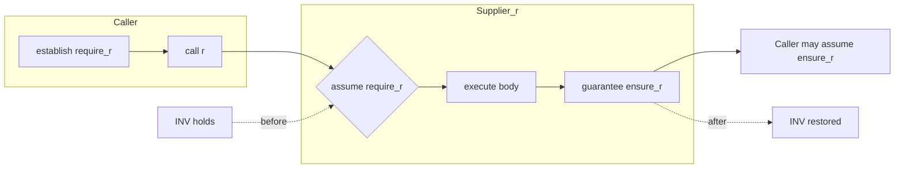
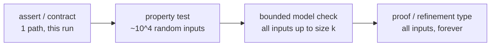

# Design by Contract — Professional Level

> Focus: the deep end and the lineage. Meyer's DbC as a Hoare triple, weakest-preconditions, Liskov & Wing behavioral subtyping, the slide from contracts into types (refinement/dependent), the verification spectrum (assert → property → model check → proof), the disappearing-assertions hazard, rely-guarantee for concurrency, and blame in gradual verification.

---

## Table of Contents

1. [The Hoare triple under the contract](#the-hoare-triple-under-the-contract)
2. [Weakest preconditions: the calculus Meyer compiled](#weakest-preconditions-the-calculus-meyer-compiled)
3. [Meyer's Eiffel: the original, formally](#meyers-eiffel-the-original-formally)
4. [Behavioral subtyping: Liskov & Wing 1994](#behavioral-subtyping-liskov--wing-1994)
5. [The verification spectrum: assert → property → model → proof](#the-verification-spectrum-assert--property--model--proof)
6. [Contracts dissolve into types: refinement and dependent types](#contracts-dissolve-into-types-refinement-and-dependent-types)
7. [The disappearing-assertions hazard](#the-disappearing-assertions-hazard)
8. [Contracts in concurrent code: rely-guarantee](#contracts-in-concurrent-code-rely-guarantee)
9. [Blame and gradual verification](#blame-and-gradual-verification)
10. [DbC across Java, Python, Go](#dbc-across-java-python-go)
11. [Common Mistakes](#common-mistakes)
12. [Test Yourself](#test-yourself)
13. [Cheat Sheet](#cheat-sheet)
14. [Summary](#summary)
15. [Further Reading](#further-reading)
16. [Related Topics](#related-topics)

---

## The Hoare triple under the contract

Design by Contract is not folklore; it is a thin executable layer over **Hoare logic**. C.A.R. Hoare's 1969 paper *An Axiomatic Basis for Computer Programming* introduced the triple:

```
{P} S {Q}
```

read as: *if predicate `P` (the precondition) holds before statement `S` executes, and `S` terminates, then predicate `Q` (the postcondition) holds afterward.* This is **partial correctness** — termination is a separate obligation. Add termination and you get **total correctness**, usually written `[P] S [Q]`.

Meyer's insight in *Object-Oriented Software Construction* (2nd ed., 1997, Ch. 11) was that a *routine* `r` of a class is exactly a Hoare triple with the names you already use:

```
{ require_r AND INV }   body_of_r   { ensure_r AND INV }
```

- `require_r` — the **precondition**: the caller's obligation. Blame the caller if it fails.
- `ensure_r` — the **postcondition**: the supplier's obligation. Blame the routine if it fails.
- `INV` — the **class invariant**: a predicate true before and after *every* exported routine, conjoined to both sides of every triple.

This is the famous "business contract" analogy: each party has obligations (which become the other party's benefits). The caller guarantees `require`; in return it *benefits* from `ensure`. The supplier may *assume* `require` (it need not re-check it — that is the entire economic argument for DbC over defensive programming) and in return is *obligated* to deliver `ensure`.



The asymmetry matters: a precondition violation is a **bug in the caller**; a postcondition or invariant violation is a **bug in the supplier**. This is the *blame* assignment, and it is the conceptual seed of everything in the gradual-verification literature below.

---

## Weakest preconditions: the calculus Meyer compiled

Hoare logic tells you how to *check* a triple. Dijkstra's **weakest precondition** calculus (*A Discipline of Programming*, 1976) tells you how to *compute* the required precondition mechanically. `wp(S, Q)` is the weakest predicate that, holding before `S`, guarantees `Q` after (and that `S` terminates — Dijkstra's `wp` is total-correctness). The triple `{P} S {Q}` is valid iff `P => wp(S, Q)`.

Key rules (the ones a designer actually reasons with):

| Statement | `wp` |
|---|---|
| `skip` | `wp(skip, Q) = Q` |
| assignment `x := e` | `wp(x := e, Q) = Q[x := e]` (substitute `e` for `x` in `Q`) |
| sequence `S1; S2` | `wp(S1; S2, Q) = wp(S1, wp(S2, Q))` |
| conditional `if B then S1 else S2` | `(B => wp(S1,Q)) AND (NOT B => wp(S2,Q))` |

The loop case is where contracts earn their keep: a `while B do S` needs a **loop invariant** `I` and a **variant** `V` (a strictly decreasing well-founded measure proving termination). Eiffel surfaces both as first-class syntax (`invariant` / `variant` inside loops) precisely because the `wp` of a loop is *not computable* without them — you must supply `I` and `V` as the human's proof obligation:

```
{ I }                       -- invariant holds on entry
while B loop
  { I AND B }  body  { I }  -- body preserves I and decreases V
end
{ I AND NOT B }             -- on exit
```

This is the theoretical reason a precondition is not just "input validation": a well-chosen contract is the *specification fragment from which a `wp`-style proof can be discharged*. When you write `require n >= 0` you are not being defensive — you are pinning down the predicate the proof needs.

---

## Meyer's Eiffel: the original, formally

Eiffel is the only mainstream language where the contract is *syntax*, not a library or comment. The canonical example (a bounded stack):

```eiffel
class STACK [G]
feature
    count: INTEGER
    capacity: INTEGER

    put (x: G) is
        require
            not_full: count < capacity        -- precondition
        do
            count := count + 1
            representation.put (x, count)
        ensure
            not_empty:  count > 0
            added:      item = x               -- postcondition
            one_more:   count = old count + 1  -- 'old' = value at entry
        end

    item: G is
        require
            not_empty: count > 0
        do ... end
invariant
    count_non_negative: count >= 0
    count_bounded:      count <= capacity      -- class invariant
end
```

Three formal features worth internalizing:

1. **`old`** — `old count` denotes the value of `count` *at routine entry*. It is what lets a postcondition relate before- and after-states (`count = old count + 1`). In Hoare-logic terms, `old e` is how you express the two-state relation `Q(sigma_pre, sigma_post)` that a single-state assertion cannot.
2. **Invariant conjunction.** The invariant is *implicitly* `and`-ed onto the pre- and postcondition of every exported routine — but it is allowed to be *temporarily broken inside* a routine body. It need only be restored at the public boundary. This is the formal license behind "an object may be transiently inconsistent mid-method."
3. **Contract inheritance.** Eiffel enforces behavioral subtyping *in the compiler*: a redefined routine may only **`require else`** (weaken — logical OR with the parent precondition) and **`ensure then`** (strengthen — logical AND with the parent postcondition). The language makes the Liskov rule unbreakable by construction.

---

## Behavioral subtyping: Liskov & Wing 1994

Barbara Liskov's 1987 OOPSLA keynote gave the intuition ("subtype objects substitutable for supertype objects"). The *formal* rule is Liskov & Wing's 1994 TOPLAS paper, *A Behavioral Notion of Subtyping*. A subtype `S` of `T` must satisfy, for each method:

| Obligation | Rule | Direction |
|---|---|---|
| **Precondition** | `pre_T => pre_S` | **contravariant** — subtype may *weaken* (require no more than the parent) |
| **Postcondition** | `post_S => post_T` | **covariant** — subtype may *strengthen* (promise at least as much) |
| **Invariant** | `inv_S => inv_T` | subtype preserves all supertype invariants |
| **History constraint** | state transitions allowed by `S` must be allowed by `T` | new — see below |

The mnemonic — *require no more, promise no less* — is the contract phrasing of LSP. A subclass that **strengthens** a precondition (e.g., a `Rectangle.setWidth` override that suddenly forbids negative widths the parent accepted) is a classic LSP break: a caller holding a `T` reference established only `pre_T`, calls through the `S` object, and `pre_S` is unmet. Blame lands on the supplier hierarchy, not the innocent caller.

The **history constraint** is the part most engineers forget and the genuine contribution of the 1994 paper over the pre/post rules alone. Pre/postconditions constrain *single* method calls; they cannot forbid a subtype from introducing *new mutation paths* a supertype's clients never anticipated. Liskov & Wing's example: an immutable supertype with no mutators and a subtype that adds a setter. Every method individually satisfies pre/post contravariance/covariance, yet substitutability still breaks — a client reasoning about the supertype assumes its state never changes after construction. The history constraint forbids exactly this: *the set of (pre-state, post-state) transitions reachable in the subtype must be a subset of those reachable in the supertype.* Immutability is a history constraint, not a pre/postcondition.

> The classic Rectangle/Square problem is a *history-constraint* violation as much as a precondition one: `Square` couples width and height so a transition `setWidth(5)` that leaves `height` unchanged — legal for `Rectangle` — becomes unreachable. The relation between consecutive states differs.

---

## The verification spectrum: assert → property → model → proof

DbC sits on a continuum of rigor. Each step trades engineering cost for stronger guarantees over a larger fraction of the input space.



1. **Runtime contract / `assert`.** Checks one predicate on the *one* path this execution took. Zero static guarantee; catches the violation only if the offending input actually arrives in test or prod. This is what `assert` in Java/Python and explicit `if !cond { panic }` in Go give you.
2. **Property-based testing.** Promote the contract to a *property* and let a generator (QuickCheck, Hypothesis, `jqwik`, `gopter`) throw thousands of inputs at it with shrinking. A postcondition `ensure result.sorted` becomes `@given(lists(integers())) def test_sort(xs): assert is_sorted(sort(xs))`. This is the single highest-ROI promotion of a contract — the *same predicate* now guards 10^4 inputs instead of one. (See [`../../functional-programming/README.md`](../../functional-programming/README.md).)
3. **Bounded model checking / symbolic execution.** Tools like JBMC, CBMC, or KLEE explore *all* inputs up to a size bound `k`, turning contracts into SMT queries. Java's JML + OpenJML can do extended static checking (ESC) — unsound/incomplete but finds real bugs without full proof.
4. **Proof / type-level encoding.** Dafny, Frama-C/ACSL, Why3, or KeY discharge the `wp` verification conditions with an SMT solver or interactive prover for *every* input, *forever*. Same triple `{P} S {Q}` — now machine-proved rather than sampled.

The professional point: **write the contract once, escalate the checking mechanism as the cost of a bug rises.** A precondition is the artifact that survives unchanged from `assert` to Dafny `requires`.

---

## Contracts dissolve into types: refinement and dependent types

Meyer's contracts are *predicates checked at boundaries*. A strictly more powerful approach moves the predicate **into the type**, so the compiler refuses to construct an illegal value at all — the design slogan "make illegal states unrepresentable" (Yaron Minsky, 2011).

**Refinement types** attach a predicate to a base type. Liquid Haskell:

```haskell
{-@ type Nat = {v:Int | 0 <= v} @-}
{-@ divide :: Int -> {d:Int | d /= 0} -> Int @-}   -- precondition d /= 0 in the type
divide x d = x `div` d
```

The `{d:Int | d /= 0}` *is* the precondition `require d /= 0`, but discharged statically by an SMT solver at compile time. A call site passing a possibly-zero divisor fails to typecheck — the contract is now unforgeable and zero-cost at runtime.

**Dependent types** (Idris, Agda, Coq, F\*) let types depend on *values*, subsuming both pre- and postconditions:

```idris
-- A vector whose length is in its type; append's postcondition (n+m) is in the return type.
append : Vect n a -> Vect m a -> Vect (n + m) a
```

The postcondition "the result length equals the sum of input lengths" is not asserted — it is *the type signature*, checked by construction. There is no run to fail; an incorrect implementation does not compile.

The trade-off versus runtime DbC:

| Property | Runtime contract | Refinement/dependent type |
|---|---|---|
| When checked | every execution (or disabled) | compile time, once |
| Coverage | only paths actually run | all inputs |
| Runtime cost | non-zero (and droppable — hazard below) | zero |
| Expressiveness | arbitrary executable predicate | predicate the solver/type system can decide |
| Cost to author | low | high (proof burden, solver tuning) |

The mainstream, pragmatic middle ground is **type-driven design** in ordinary languages: replace `validate(email: String)` precondition spread across call sites with a `NonEmptyList`, a smart-constructor `Email` (private ctor + `parse: String -> Result<Email>`), or a `PositiveInt`. The precondition is paid *once at the boundary* and the type then carries the guarantee — see [`../13-generics-and-types/README.md`](../13-generics-and-types/README.md) and [`../09-classes/README.md`](../09-classes/README.md) for the OO mechanics.

---

## The disappearing-assertions hazard

The defining operational risk of *runtime* DbC: assertions are routinely compiled out of production, so a contract you "rely on" may not execute where it matters.

- **Java.** The `assert` keyword is **disabled by default**. It runs only with `-ea` / `-enableassertions` on the JVM. Code that puts a *precondition* in `assert` ships with that precondition silently absent in prod. (Postconditions and *internal* invariants in `assert` are the intended use; *public* preconditions should use explicit `if (!cond) throw new IllegalArgumentException(...)`, which is never elided — see Bloch, *Effective Java*, Items 49 & 51.)
- **C/C++.** `assert` becomes a no-op under `-DNDEBUG`. The infamous corollary: never put a *side-effecting* expression inside `assert`, because the side effect vanishes in release builds.
- **Python.** `assert` statements are stripped under `python -O` (`__debug__ == False`). Using `assert` to validate untrusted *external* input is therefore a documented anti-pattern and even a security hazard (an authorization check in an `assert` disappears under `-O`).
- **Eiffel.** Contract monitoring is *configurable per assertion class* (`require` / `ensure` / `invariant` / `all`) via the compilation profile — Meyer's design explicitly anticipated turning preconditions on in test and possibly off in trusted production, *as a deliberate, audited choice*, not an accident of a flag.

The principle: **contracts that guard the trust boundary (untrusted input, security, public-API misuse) must use a non-elidable mechanism; contracts that document internal programmer assumptions may use elidable asserts.** Conflating the two is how a precondition becomes a contract-as-comment that "is never enforced." This is also the bridge to [`../16-defensive-vs-offensive/README.md`](../16-defensive-vs-offensive/README.md): the *stance* differs at the boundary versus inside.

---

## Contracts in concurrent code: rely-guarantee

Hoare logic assumes the state changes only via the statement under analysis — sequential, no interference. That assumption is false the moment another thread can mutate shared state, so plain pre/postconditions are *unsound* for concurrent code: a precondition established by the caller can be invalidated by an interleaving thread before the body reads it (a TOCTOU race at the contract level).

The compositional answer is Cliff Jones's **rely-guarantee** reasoning (1983). Each thread's specification gains two extra predicates over *transitions*:

- **Rely (`R`)** — the interference the thread *tolerates*: every state change other threads may make. Analogue of a precondition, but over the environment's steps rather than the initial state.
- **Guarantee (`G`)** — the interference this thread *imposes*: every state change it may make, which becomes other threads' rely.

A thread is correct if, assuming the environment only does `R`, its own steps stay within `G` while transforming `P` into `Q`. Composition is sound when each thread's `G` implies every sibling's `R`. This is the formal generalization of the informal contracts you already write on concurrent APIs: "callable from any thread" (a weak rely), "must hold the lock" (a rely that the lock invariant is maintained), `@GuardedBy("this")` in Java's `jcip` annotations (a guarantee about which transitions touch the field). Concurrent separation logic (O'Hearn) extends this with ownership for heap-manipulating concurrent programs.

> Practical takeaway: a precondition like `require connection.isOpen()` is *meaningless* on a shared connection without a rely clause saying "no other thread closes it during the call." If you cannot state the rely, the contract is a lie. Either narrow ownership (the type carries exclusive access) or move the check inside the lock.

---

## Blame and gradual verification

When part of a system is verified (typed, contract-checked) and part is not, and a failure occurs, **who is to blame?** This is the *blame* problem, formalized by Findler & Felleisen, *Contracts for Higher-Order Functions* (ICFP 2002) and the gradual-typing line (Wadler & Findler, *Well-Typed Programs Can't Be Blamed*, ESOP 2009).

The core results that a senior engineer should carry:

- **Higher-order contracts need blame labels.** When you attach a contract to a function value `f: (Int -> Int)` and `f` is passed across a boundary, a violation might be the *caller* supplying a bad argument or the *callee* returning a bad result. Findler–Felleisen contracts tag each obligation with a *positive* (the value's producer) and *negative* (its context) blame party, so the runtime can name the guilty module precisely — exactly Meyer's caller/supplier asymmetry, generalized to functions-as-values.
- **"Well-typed programs can't be blamed."** In a gradually-typed program mixing static and dynamic regions, a runtime cast can fail — but Wadler–Findler proved blame *always* falls on the *less-precisely-typed* (dynamic) side. The static region is exonerated. This is the rigorous statement of why adding types/contracts at the edges of legacy code is safe: the new, more-precise code can never be the one blamed for a boundary failure.
- **Gradual verification** (Bader, Aldrich, et al.) extends this from types to *full pre/postcondition contracts*: you may specify only part of a system formally, run-check the unverified seams, and a sound theory tells you the static guarantees still hold where you proved them. This is the migration path from DbC-as-runtime-checks to DbC-as-proof without a big-bang rewrite.

The unifying thread from Hoare (1969) to gradual verification (2010s): **a contract is a blame-assignment device.** Pre/post/invariant told you *who* is responsible; gradual verification tells you the responsibility survives even when only some parties are formally checked.

---

## DbC across Java, Python, Go

No mainstream non-Eiffel language has native contracts; each emulates the pieces. Idiomatic patterns:

**Java** — Guava `Preconditions` / `Objects.requireNonNull` for non-elidable preconditions; `assert` *only* for internal invariants/postconditions; JML + OpenJML for tool-checked contracts.

```java
BigDecimal withdraw(BigDecimal amount) {
    // PRECONDITION (boundary, non-elidable):
    Objects.requireNonNull(amount, "amount");
    if (amount.signum() <= 0) throw new IllegalArgumentException("amount must be > 0");
    if (amount.compareTo(balance) > 0) throw new IllegalStateException("insufficient funds");

    BigDecimal old = balance;               // capture for postcondition ('old')
    balance = balance.subtract(amount);

    // POSTCONDITION + INVARIANT (internal, elidable assert is acceptable here):
    assert balance.equals(old.subtract(amount)) : "postcondition: balance debited";
    assert balance.signum() >= 0 : "invariant: balance non-negative";
    return balance;
}
```

**Python** — `assert` for internal invariants (knowing `-O` strips them); `icontract` or `deal` libraries for real decorator-based DbC with `@require`/`@ensure` and an `old`-snapshot facility; Hypothesis to promote the same predicates to properties.

```python
import icontract

@icontract.invariant(lambda self: self.balance >= 0)
class Account:
    @icontract.require(lambda amount: amount > 0)
    @icontract.ensure(lambda self, OLD, result: self.balance == OLD.balance - result)
    def withdraw(self, amount: int) -> int:
        self.balance -= amount
        return amount
```

**Go** — no assertions, no exceptions; the idiom is explicit guard + `panic` for *programmer* contract breaches (caller bug, fail fast) versus returned `error` for *expected* runtime conditions. The distinction *is* the contract's blame assignment: `panic` = "you violated my precondition" (bug); `error` = "a legitimate runtime outcome you must handle."

```go
func (a *Account) Withdraw(amount int64) int64 {
    if amount <= 0 {
        panic("contract: amount must be > 0") // precondition breach = caller bug
    }
    if amount > a.balance {
        panic("contract: insufficient funds")
    }
    old := a.balance
    a.balance -= amount
    // postcondition / invariant as a development-time check:
    if a.balance != old-amount || a.balance < 0 {
        panic("postcondition/invariant violated") // supplier bug
    }
    return a.balance
}
```

> Go deliberately omits an `assert` so that no contract silently disappears (the disappearing-assertions hazard is designed out); the cost is that you must choose `panic` vs `error` consciously on every guard.

---

## Common Mistakes

- **Putting public preconditions in elidable `assert`s.** Java `-ea`-off and Python `-O` ship the precondition absent. Use non-elidable throws / `requireNonNull` / `panic` at trust boundaries.
- **Strengthening a precondition in an override.** The textbook LSP break: a subtype that `require`s *more* than its parent breaks every caller holding a supertype reference. Eiffel forbids it (`require else` only weakens); other languages don't — you must self-police.
- **Forgetting the history constraint.** Per-method pre/postconditions can all check out while a subtype still violates substitutability by adding a mutation path (the immutable-supertype/mutable-subtype trap). Substitutability is about *sequences* of states, not single calls.
- **Contracts on shared state without a rely clause.** `require x.isValid()` is unsound under concurrency unless you state what interference is tolerated. Either own the value exclusively (types/locks) or check inside the critical section.
- **Double-checking.** Re-validating the same precondition in both caller and callee discards DbC's central economy: the supplier is *entitled to assume* `require`. Pick one owner of each check.
- **Side effects inside assertions.** A mutation or I/O inside `assert`/contract that vanishes under `-O` / `-DNDEBUG` changes behavior between debug and release. Contracts must be pure observations.
- **Treating a precondition as input validation.** A precondition documents a *caller bug* and should fail fast; input validation handles *expected* bad data and returns a recoverable error. Conflating them either crashes on legitimate input or swallows real bugs.

---

## Test Yourself

1. **State the contract for `binarySearch(a []int, target int) int` as a Hoare triple, including the loop invariant and variant.**

<details><summary>Answer</summary>

Precondition `P`: `a` is sorted ascending (`for all i<j. a[i] <= a[j]`). Postcondition `Q`: result `r` satisfies `(r >= 0 AND a[r] = target) OR (r < 0 AND target not in a)`. Loop invariant `I` over `lo, hi`: `target`, if present, lies in `a[lo..hi]`, with `0 <= lo` and `hi < len(a)`. Variant `V = hi - lo` — a non-negative integer strictly decreasing each iteration, proving termination. The triple is `{P} body {Q}`, and the `wp` of the loop is discharged via `I` + `V`. Note the precondition "sorted" is exactly the predicate the proof needs; it is not "defensive."

</details>

2. **A `Bird` superclass has `fly()` with postcondition `altitude > 0`. `Penguin extends Bird` overrides `fly()` to throw. Which behavioral-subtyping rule breaks, and is it a pre-, post-, or history violation?**

<details><summary>Answer</summary>

It is a **postcondition** violation. `post_Bird` is `altitude > 0`; `Penguin.fly` produces no such state (it throws), so `post_Penguin => post_Bird` is false — the subtype promises *less*. The deeper fix is modeling: `fly()` doesn't belong on `Bird` if not all birds satisfy its postcondition. (If `Penguin` instead silently returned with `altitude == 0` it would still violate the same covariance rule.)

</details>

3. **Why is `assert` the wrong tool for validating an HTTP request body in Python, beyond style?**

<details><summary>Answer</summary>

`python -O` (and `__debug__ == False`) strips every `assert` from the bytecode. A request body is *untrusted external input* crossing a trust boundary; under `-O` the validation vanishes, so malformed or malicious input flows straight through. This is a documented security anti-pattern. External-input checks must use explicit `if ...: raise` (or a validation library); `assert` is reserved for internal programmer-invariant checks where a failure means *our* bug, not bad input.

</details>

4. **Translate `require d != 0` from a runtime precondition into (a) a property-based test and (b) a type. What does each buy you?**

<details><summary>Answer</summary>

(a) Property test: `@given(integers(), integers().filter(lambda d: d != 0)) def test(x, d): divide(x, d)` — checks the predicate over ~10^4 generated inputs with shrinking, instead of one path. (b) Type: a refinement type `{d:Int | d /= 0}` (Liquid Haskell) or a `NonZeroInt` smart-constructor newtype — the compiler/solver rejects *every* zero divisor at compile time over *all* inputs, at zero runtime cost. The progression is the verification spectrum: same predicate, escalating coverage (one run → many inputs → all inputs).

</details>

5. **In a gradually-typed program, a runtime cast at a typed/untyped boundary fails. Wadler–Findler guarantees blame falls where, and why does that matter for incrementally adding contracts to legacy code?**

<details><summary>Answer</summary>

Blame falls on the **less-precisely-typed (dynamic/unverified) side** — "well-typed programs can't be blamed." It matters because it makes incremental adoption *sound*: when you wrap a legacy module with a contract or a typed interface, a boundary failure can never be attributed to your new, more-precise code. You can therefore harden a system edge-first, trusting that each newly-specified region cannot be the guilty party for a seam violation — the formal license for gradual verification.

</details>

6. **Why does a class invariant get to be temporarily false in the middle of a method, and what is the formal boundary at which it must hold?**

<details><summary>Answer</summary>

The invariant is conjoined to the pre- and postcondition of every *exported* (public) routine — it must hold at the *public boundary* (entry and exit of any client-callable method), not at every intermediate statement. Mid-method, an object may pass through inconsistent states (e.g., updating `count` before updating the backing array). Formally, the invariant `INV` appears in `{ require AND INV } body { ensure AND INV }`; the body is free to break and restore it internally. Private helpers called mid-update need not re-establish it. This is also why calling an overridable/public method on `this` mid-mutation is dangerous: it may observe a broken invariant.

</details>

---

## Cheat Sheet

| Concept | Statement | Source |
|---|---|---|
| Hoare triple | `{P} S {Q}` — partial correctness; `[P] S [Q]` total | Hoare 1969 |
| Routine contract | `{ require AND INV } body { ensure AND INV }` | Meyer, OOSC 1997 |
| Weakest precond. | `{P} S {Q}` valid iff `P => wp(S,Q)` | Dijkstra 1976 |
| Assignment `wp` | `wp(x:=e, Q) = Q[x:=e]` | Dijkstra 1976 |
| `old` | value of an expression at routine entry (two-state postcond.) | Eiffel |
| Loop obligation | supply invariant `I` + decreasing variant `V` | Dijkstra/Eiffel |
| Subtype precond. | contravariant: `pre_T => pre_S` (weaken) | Liskov & Wing 1994 |
| Subtype postcond. | covariant: `post_S => post_T` (strengthen) | Liskov & Wing 1994 |
| History constraint | subtype transitions subset of supertype transitions | Liskov & Wing 1994 |
| Verification ladder | assert → property test → bounded model check → proof | — |
| Concurrency | rely `R` / guarantee `G`; sound when each `G` implies siblings' `R` | Jones 1983 |
| Blame | falls on less-precisely-typed side | Wadler & Findler 2009 |

**Decision rules**

- Boundary / untrusted / security check → **non-elidable** (`throw`, `requireNonNull`, `panic`).
- Internal programmer invariant / postcondition → elidable `assert` is fine.
- Precondition breach = **caller bug**, fail fast. Expected bad data = **return error**.
- Override: *require no more, promise no less*; never add a new mutation the supertype forbade.
- Want all-input coverage with no runtime cost → push the predicate into a type.

---

## Summary

Design by Contract is Hoare logic with ergonomic names. A routine is the triple `{ require AND INV } body { ensure AND INV }`; the precondition is the caller's obligation and the postcondition/invariant the supplier's, so an assertion failure *names the guilty party*. Dijkstra's weakest-precondition calculus is the machinery that makes contracts a proof-discharging specification rather than mere input checks — and the loop case shows why you must hand-author invariants and variants. Liskov & Wing 1994 give the formal subtyping law (contravariant preconditions, covariant postconditions, invariant preservation, and the often-forgotten history constraint that makes immutability substitutable). From there the same predicate scales up a verification ladder — runtime assert, property test, bounded model check, full proof — or dissolves into refinement and dependent types that make illegal states unrepresentable at zero runtime cost. Two professional hazards dominate practice: assertions silently disappear in production (`-ea` off, `python -O`, `-DNDEBUG`), so trust-boundary contracts must be non-elidable; and sequential contracts are unsound under concurrency without a rely-guarantee discipline. The whole lineage, from Hoare (1969) to gradual verification, is one idea refined: a contract is a blame-assignment device, and that blame stays sound even when only part of the system is formally checked.

---

## Further Reading

- Bertrand Meyer, *Object-Oriented Software Construction*, 2nd ed. (1997) — Chs. 11–12, the canonical DbC treatment.
- C.A.R. Hoare, *An Axiomatic Basis for Computer Programming*, CACM 12(10), 1969.
- E.W. Dijkstra, *A Discipline of Programming* (1976) — weakest preconditions.
- Barbara Liskov & Jeannette Wing, *A Behavioral Notion of Subtyping*, ACM TOPLAS 16(6), 1994.
- C.B. Jones, *Tentative Steps Toward a Development Method for Interfering Programs*, ACM TOPLAS 5(4), 1983 — rely-guarantee.
- Findler & Felleisen, *Contracts for Higher-Order Functions*, ICFP 2002.
- Wadler & Findler, *Well-Typed Programs Can't Be Blamed*, ESOP 2009.
- Vazou et al., *Refinement Types for Haskell* (Liquid Haskell), ICFP 2014.
- Joshua Bloch, *Effective Java*, 3rd ed. — Items 49 (check parameters) and 51 (API design).
- K. Rustan M. Leino, *Dafny* documentation — `requires` / `ensures` / `invariant` / `decreases` in a verifier.

---

## Related Topics

- [senior.md](senior.md) — DbC applied: writing and inheriting contracts across a real codebase.
- [interview.md](interview.md) — Q&A spanning all levels for interview prep.
- [Chapter README](../README.md) — the positive rules and anti-patterns for Design by Contract.
- [Defensive vs Offensive](../16-defensive-vs-offensive/README.md) — the *stance* toward bad input; DbC is about the *formal contract* itself.
- [Generics and Types](../13-generics-and-types/README.md) — pushing contracts into the type system.
- [Classes](../09-classes/README.md) — invariants, smart constructors, and where contracts live in OO design.
- [Functional Programming](../../functional-programming/README.md) — property-based testing and total functions as the FP route to the same guarantees.
