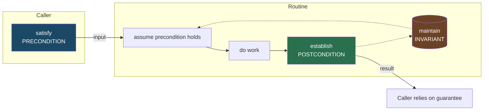
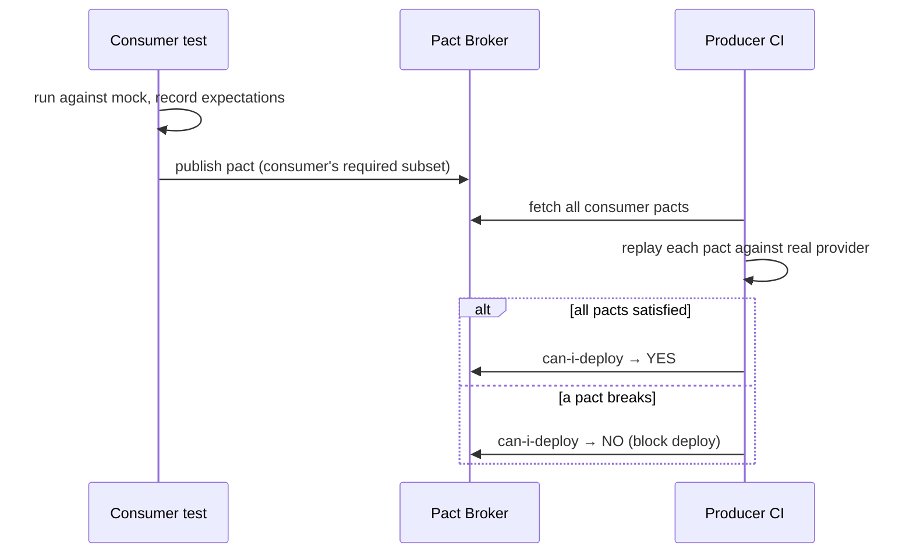

# Design by Contract — Senior Level

> Focus: "How do contracts work across a codebase and at boundaries?" — contracts as the *spec* for module and service APIs, the tooling that enforces them, their fusion with property-based testing, and how they survive inheritance, deployment, and the network.

---

## Table of Contents

1. [The shift: contract as the API spec](#the-shift-contract-as-the-api-spec)
2. [Contracts as documented, checked obligations](#contracts-as-documented-checked-obligations)
3. [Tooling per language](#tooling-per-language)
4. [Contracts + property-based testing: the postcondition IS the property](#contracts--property-based-testing-the-postcondition-is-the-property)
5. [Assertions in test/staging, stripped in prod — and the security caveat](#assertions-in-teststaging-stripped-in-prod--and-the-security-caveat)
6. [Contracts under inheritance: enforcing LSP in review](#contracts-under-inheritance-enforcing-lsp-in-review)
7. [Make illegal states unrepresentable: compile-time contracts](#make-illegal-states-unrepresentable-compile-time-contracts)
8. [Contracts at service boundaries](#contracts-at-service-boundaries)
9. [Common Mistakes](#common-mistakes)
10. [Test Yourself](#test-yourself)
11. [Cheat Sheet](#cheat-sheet)
12. [Summary](#summary)
13. [Further Reading](#further-reading)
14. [Related Topics](#related-topics)

---

## The shift: contract as the API spec

At junior scale a contract is "this function expects a non-empty list." At team scale a contract is **the published specification of a module or service API** — the thing other engineers code against without reading your implementation. Three obligations make up that spec:

| Clause | Who owns it | Meaning |
|---|---|---|
| **Precondition** | the **caller** must satisfy it | input requirements: what must be true on entry |
| **Postcondition** | the **callee** guarantees it | the promise: what is true on return if the precondition held |
| **Invariant** | the **type** maintains it | what is always true of an object between public calls |

The blame assignment is the whole point. If a precondition fails, the *caller* has the bug — you do not validate, you *abort* and point upstream. If a postcondition fails, *you* have the bug. This is the line that separates Design by Contract from generic [defensive programming](../16-defensive-vs-offensive/README.md): defensive code asks "how do I cope with bad input?"; a contract asks "whose fault is it, and is this a programmer error or a runtime condition?"

The senior responsibility is making this spec **explicit, machine-checkable, and consistent across a codebase** — not living in one author's head (the "implicit contract" anti-pattern), not duplicated in every caller (the "double-checking" anti-pattern), and not rotting as an unenforced comment (the "contract-as-comment" anti-pattern).



---

## Contracts as documented, checked obligations

A contract that is only documented drifts; a contract that is only checked is invisible to the people coding against it. You need **both**: the contract appears in the API documentation *and* a runtime/compile-time check enforces it. The two must be generated from, or verified against, the same source so they cannot diverge.

A practical layering, weakest to strongest:

1. **Type signature** — the cheapest contract. `Quantity` instead of `int` encodes "non-negative integer" in the type system; no runtime check needed.
2. **Compile-time check** — exhaustive `switch`, non-null types, sealed hierarchies. Caught before the code runs.
3. **Runtime assertion** — `require`/`assert`/`Preconditions.checkArgument`. Caught at the boundary the moment it is violated, with a clear blame.
4. **Property-based test** — the postcondition asserted over thousands of generated inputs in CI.
5. **Consumer-driven contract test** — for cross-service boundaries, verified in both producer and consumer pipelines.

Push every obligation as far up this list as it will go. A rule expressible as a type should never be a runtime assert; a rule expressible as an assert should never be a prose comment.

---

## Tooling per language

### Java

| Tool | Role |
|---|---|
| **Guava `Preconditions`** | `checkArgument` (precondition → `IllegalArgumentException`), `checkState` (invariant → `IllegalStateException`), `checkNotNull` (→ `NullPointerException`). The blame is encoded in the *exception type*. |
| **Bean Validation (Jakarta `jakarta.validation`)** | declarative runtime contracts on DTOs: `@NotNull`, `@Min`, `@Size`, `@Email`, custom `ConstraintValidator`. Enforced at the edge by Spring `@Valid`. |
| **JML + OpenJML** | formal `//@ requires` / `//@ ensures` / `//@ invariant` annotations, statically or runtime-checked. Heavyweight; used where correctness is contractual (finance, avionics). |
| **Error Prone** | compile-time bug-pattern checker; `@CheckReturnValue`, nullness via `@Nullable`/NullAway. Turns a class of contract violations into compile errors. |

```java
public Money withdraw(Money amount) {
    // Preconditions — caller's obligation. Failure = caller bug.
    checkArgument(amount.isPositive(), "amount must be positive: %s", amount);
    checkState(this.balance.gte(amount), "insufficient funds");   // invariant guard

    Money result = this.balance.minus(amount);

    // Postcondition — our guarantee. Failure = our bug.
    assert result.gte(Money.ZERO) : "balance went negative: " + result;
    this.balance = result;
    return result;
}
```

JML version of the same contract — now machine-checkable specification, not prose:

```java
//@ requires amount.isPositive();
//@ requires balance.gte(amount);
//@ ensures balance.gte(Money.ZERO);
//@ ensures balance.equals(\old(balance).minus(amount));
public Money withdraw(Money amount) { ... }
```

Bean Validation expresses the *edge* contract declaratively:

```java
public record TransferRequest(
    @NotNull @Pattern(regexp = "\\d{10}") String fromAccount,
    @NotNull @Pattern(regexp = "\\d{10}") String toAccount,
    @NotNull @DecimalMin(value = "0.01") BigDecimal amount) {}

@PostMapping("/transfers")
public ResponseEntity<?> transfer(@Valid @RequestBody TransferRequest req) { ... }
```

### Python

| Tool | Role |
|---|---|
| **`icontract`** | decorators `@require`, `@ensure`, `@invariant` with lambdas; `result` and `OLD` available in postconditions. Toggle off in prod via `icontract.SLOW`. |
| **`deal`** | similar contracts plus a static linter and a property-test generator from the contracts themselves. |
| **`pydantic`** | the edge contract: validate and coerce request/config models. Use **at the boundary only**, not threaded through every internal call. |

```python
import icontract

@icontract.require(lambda amount: amount > 0, "amount must be positive")
@icontract.require(lambda self, amount: self.balance >= amount, "insufficient funds")
@icontract.ensure(lambda self: self.balance >= 0, "balance must stay non-negative")
@icontract.ensure(lambda self, amount, OLD: self.balance == OLD.balance - amount)
def withdraw(self, amount: Decimal) -> Decimal:
    self.balance -= amount
    return self.balance
```

```python
from pydantic import BaseModel, Field, field_validator

class TransferRequest(BaseModel):
    from_account: str = Field(pattern=r"\d{10}")
    to_account: str   = Field(pattern=r"\d{10}")
    amount: Decimal   = Field(gt=0)

    @field_validator("to_account")
    @classmethod
    def not_self_transfer(cls, v, info):
        if v == info.data.get("from_account"):
            raise ValueError("cannot transfer to self")
        return v
```

### Go

Go has no contract framework; contracts are **manual, conventional, and type-driven**:

```go
// Withdraw subtracts amount from the account balance.
//
// Precondition:  amount > 0  (caller's responsibility — panics otherwise)
// Postcondition: returned balance >= 0
func (a *Account) Withdraw(amount Money) (Money, error) {
	if amount <= 0 {
		panic(fmt.Sprintf("Withdraw precondition violated: amount=%d", amount)) // programmer bug
	}
	if a.balance < amount {
		return 0, ErrInsufficientFunds // runtime condition, not a bug → error
	}
	a.balance -= amount
	if a.balance < 0 { // postcondition self-check
		panic(fmt.Sprintf("Withdraw postcondition violated: balance=%d", a.balance))
	}
	return a.balance, nil
}
```

The senior discipline in Go: **panic for contract breaches (programmer bugs), return `error` for expected runtime conditions.** `go vet` and `staticcheck` catch a subset (nil derefs, unreachable code, lock-copy invariants); the rest lives in code review and the type system (a `Money` type instead of bare `int64`).

> Note the recurring split across all three languages: **precondition breach → fail fast (panic / unchecked exception / assert)**; **expected bad-but-possible input → typed error/exception the caller handles**. Conflating these is the "exceptions for contract breaches" anti-pattern — it lets a programmer bug masquerade as a recoverable condition.

---

## Contracts + property-based testing: the postcondition IS the property

This is the most leveraged idea at senior level. A postcondition is a statement that holds for *all* valid inputs — which is exactly the definition of a property. So your contract doubles as the oracle for a property-based test, and you get thousands of test cases for free.

| Language | PBT tool |
|---|---|
| Python | **Hypothesis** |
| Java | **jqwik** |
| Go | **gopter** (or `testing/quick`) |

Take the classic round-trip postcondition `decode(encode(x)) == x`:

```python
from hypothesis import given, strategies as st

@given(st.binary())
def test_encode_decode_round_trip(data):
    assert decode(encode(data)) == data          # the postcondition, as a property
```

jqwik, asserting a sort's postconditions (output is a permutation of input and is ordered):

```java
@Property
void sortedOutputIsOrderedPermutation(@ForAll List<@IntRange(min = -1000, max = 1000) Integer> xs) {
    List<Integer> out = mySort(xs);
    assertThat(out).isSorted();                                  // postcondition 1: ordered
    assertThat(out).containsExactlyInAnyOrderElementsOf(xs);     // postcondition 2: same multiset
}
```

gopter, asserting a withdraw invariant:

```go
func TestWithdrawNeverNegative(t *testing.T) {
	props := gopter.NewProperties(nil)
	props.Property("balance stays non-negative", prop.ForAll(
		func(start, amt uint32) bool {
			acc := &Account{balance: Money(start)}
			if Money(amt) > acc.balance {
				return true // precondition not met; skip
			}
			bal, _ := acc.Withdraw(Money(amt))
			return bal >= 0 // postcondition
		},
		gen.UInt32(), gen.UInt32(),
	))
	props.TestingRun(t)
}
```

The senior move: when reviewing a PR that adds a contract, ask "is this postcondition also a property test?" If the obligation is universal, an example-based test under-covers it. See [unit tests](../08-unit-tests/README.md) for where example-based and property-based tests each belong.

---

## Assertions in test/staging, stripped in prod — and the security caveat

Contract checks have a cost. The standard production posture: **run assertions everywhere in test and staging, strip the expensive ones in prod, keep the cheap boundary validation always.**

| Language | How prod-stripping works |
|---|---|
| Java | `assert` keyword is **disabled by default**; enabled with the `-ea` JVM flag. Run CI/staging with `-ea`, prod without. |
| Python | `assert` statements are removed when the interpreter runs with `-O`. `icontract` honors a `SLOW`/level toggle. |
| Go | No built-in toggle; gate expensive checks behind a build tag (`//go:build assertions`) or a package-level `const assertionsEnabled`. |

```python
# staging:  python app.py            → asserts + icontract run
# prod:     python -O app.py         → asserts compiled away
```

> **Security caveat — this is the trap.** *Never gate input validation, authorization, or any security-relevant check on an assertion.* Assertions can be — and in prod *are* — compiled out. If you write `assert user.is_admin()` and ship with `-O`, the check vanishes and everyone is an admin. The rule:
>
> - **Assertions** = checks for *programmer* errors and internal invariants. Safe to strip.
> - **Validation** (Bean Validation, pydantic at the edge, explicit `if` + error) = checks for *untrusted external* input. **Always on, never an assert.**
>
> A precondition on a *trusted internal caller* can be an assert. A precondition on data from the network, a user, or a file is **validation** and must survive prod. Drawing this line correctly is a senior-level review responsibility — it is the highest-stakes distinction in this whole topic.

---

## Contracts under inheritance: enforcing LSP in review

The Liskov Substitution Principle, restated in contract terms (Meyer's rule): a subtype may **weaken preconditions** (demand no *more* than its parent) and **strengthen postconditions** (promise no *less*). Violating either breaks every caller written against the supertype — and no compiler in Java/Python/Go enforces it, so it is a **code-review responsibility**.

| Override does... | Precondition | Postcondition | Verdict |
|---|---|---|---|
| Accepts a wider input range | weakened | — | OK |
| Demands extra input constraint | **strengthened** | — | LSP break |
| Returns a tighter guarantee | — | strengthened | OK |
| Returns a looser/missing guarantee | — | **weakened** | LSP break |

```java
class FileStore {
    // precondition: path is non-null
    // postcondition: returns bytes, never null
    byte[] read(String path) { ... }
}

class ReadOnlyCachedStore extends FileStore {
    @Override
    byte[] read(String path) {
        // BUG: strengthened precondition — rejects paths the parent accepted.
        checkArgument(path.startsWith("/cache/"), "only /cache paths");  // LSP VIOLATION
        ...
    }
}
```

A caller holding a `FileStore` reference passes `/etc/config`, which the base contract permits — and the subclass throws. The substitution broke. **Review heuristic:** when you see a `@Override` that *adds* a `checkArgument`/`require` not present in the parent, or *removes* a guarantee the parent made (e.g., now returns `null`, or throws where the parent didn't), flag it as an LSP break. Tools like jqwik can encode this as a subtype-conformance property: any property that passes on the base must pass on every subtype instance.

---

## Make illegal states unrepresentable: compile-time contracts

The strongest contract is one the compiler enforces for free. Instead of checking "this order has been paid before shipping" at runtime in twenty methods, encode the lifecycle in the **type** so an unpaid order has no `ship()` method to call. This ties Design by Contract directly to [the type system](../13-generics-and-types/README.md): a precondition expressed as a type is checked once, at compile time, and can never be forgotten or stripped.

Patterns:

- **Typed wrappers over primitives** — `EmailAddress`, `Money`, `UserId` instead of `String`/`int`. The constructor is the single enforcement point; once you hold the type, the invariant is guaranteed (the "primitive obsession" cure, applied as a contract).
- **Sealed/sum types + exhaustive matching** — model state as a closed set of variants so the compiler forces you to handle each.
- **Phantom / state types** — `Order<Unpaid>` vs `Order<Paid>`, where `ship()` is only defined on `Order<Paid>`.
- **Non-empty collections** — a `NonEmptyList` type makes "the list has at least one element" a compile-time fact, not a runtime precondition.

```java
// Java: a sealed lifecycle. The compiler enforces exhaustive handling.
sealed interface Order permits Draft, Paid, Shipped {}
record Draft(Cart cart) implements Order {}
record Paid(Cart cart, PaymentId payment) implements Order {}
record Shipped(Cart cart, PaymentId payment, TrackingId tracking) implements Order {}

// ship() takes Paid, not Order — "must be paid before shipping" is now a type, not a comment.
Shipped ship(Paid order, TrackingId t) { return new Shipped(order.cart(), order.payment(), t); }
```

```python
# Python: a typed wrapper makes the precondition unrepresentable-if-violated.
@dataclass(frozen=True)
class EmailAddress:
    value: str
    def __post_init__(self):
        if "@" not in self.value:
            raise ValueError(f"invalid email: {self.value}")  # one enforcement point
# Anything typed EmailAddress is valid by construction. No downstream re-check needed.
```

> The progression to push for in design review: **runtime assert → type with a checked constructor → compile-time-only type**. Each step removes a class of bugs entirely rather than detecting them later. See the [anti-patterns guide](../../anti-patterns/README.md) for primitive obsession and stringly-typed APIs that this directly cures.

---

## Contracts at service boundaries

Across a network, the contract is no longer a function signature — it is a **schema plus a versioning policy**, and both producer and consumer must agree on it. The implicit-contract anti-pattern is lethal here: a field meaning that lives only in one team's head causes outages when the other team changes it.

**Schema as contract.** OpenAPI, Protobuf `.proto`, JSON Schema, or Avro `.avsc` *is* the precondition/postcondition spec for an HTTP/RPC call. Generate both server stubs and client code from it so the type system carries the contract across the wire. Schema evolution rules (add optional fields, never repurpose a tag/field, never tighten a constraint a client relies on) are exactly the Liskov rule applied to wire formats: a new schema version may weaken what it requires and strengthen what it promises, never the reverse.

**Consumer-driven contract tests (Pact).** The hard problem: the producer doesn't know which fields each consumer actually depends on, so it can't tell which changes are safe. Pact inverts this — each consumer records its expectations as a *pact* (the subset of the response it relies on), and the producer's CI verifies it satisfies every consumer's pact before deploy.



The Pact Broker's `can-i-deploy` gate is the network-scale equivalent of "the build fails if a postcondition regresses." It catches a producer breaking a contract *before* it reaches the consumer in production — which a producer-side schema test alone cannot, because it doesn't know what consumers truly need.

| Boundary contract mechanism | Catches | Where it runs |
|---|---|---|
| OpenAPI / Protobuf / Avro schema | shape mismatches, missing fields | code-gen + request validation |
| Schema-registry compatibility check (e.g. Avro `BACKWARD`) | breaking schema evolution | publish-time in CI |
| Consumer-driven contract test (Pact) | producer breaking a field a consumer needs | producer CI before deploy |
| Bean Validation / pydantic at the edge | malformed individual requests at runtime | request handler |

---

## Common Mistakes

- **Validating untrusted input with `assert`.** It compiles out in prod (`-O`, no `-ea`) and your security/validation check silently vanishes. External input is *validation*, always on; only internal-invariant checks may be assertions.
- **Double-checking.** The caller validates the precondition, then the callee validates it again "to be safe." Pick one owner. Public boundary validates untrusted input; internal callees `assert` and trust. Re-checking everywhere is the cost the contract was supposed to eliminate.
- **Contract-as-comment.** `// amount must be > 0` with no `require`, no type, no test. It rots the first time someone changes the body. If it's worth stating, it's worth a check (type > assert > test).
- **Strengthening a subtype's precondition.** The most common silent LSP break; no compiler catches it. A `@Override` that adds a `require` not in the parent breaks polymorphic callers.
- **Over-strict preconditions.** Rejecting inputs the routine could handle fine (`require(list.size() > 0)` on a function whose loop already no-ops on empty). A precondition should be the *minimum* the routine genuinely needs.
- **Catching contract breaches.** Wrapping a precondition `panic`/`IllegalArgumentException` in a `try/catch` that swallows it converts a loud programmer-bug signal into a silent corruption. Let it crash in dev; it's a bug, not a condition.
- **Threading edge-validation types through the whole call stack.** pydantic/Bean Validation belong at the boundary. Once validated, convert to a clean domain type; don't make every internal function re-accept the raw request model.
- **A schema change that "only adds a field" but repurposes a tag/enum value.** Wire-format LSP break: it weakens a guarantee a consumer relied on. Pact / registry compatibility checks exist precisely to catch this.

---

## Test Yourself

**1. Why is `assert user.has_role("admin")` a security bug in a Python service, and what's the fix?**

<details><summary>Answer</summary>

`assert` statements are removed when Python runs with `-O`, which production often does. The authorization check then disappears and every request is treated as admin. Authorization is a check on untrusted external state, so it is **validation, not an assertion** — use an explicit `if not user.has_role("admin"): raise Forbidden()` that cannot be optimized away. Assertions are only for programmer-error/internal-invariant checks that are safe to strip.
</details>

**2. A postcondition states `result is sorted and is a permutation of the input`. How does this become a test that beats example-based testing?**

<details><summary>Answer</summary>

It *is* a property, so feed it to a property-based tester (Hypothesis/jqwik/gopter). The tool generates hundreds of random lists — empty, single-element, duplicates, already-sorted, reverse-sorted — and asserts both postconditions on each. Example-based tests check the handful of cases you thought of; the postcondition-as-property checks the universal claim the contract actually makes.
</details>

**3. A subclass `CachedStore.read(path)` adds `require(path.startsWith("/cache/"))`. Why does this break callers, and what contract rule is violated?**

<details><summary>Answer</summary>

It **strengthens the precondition** — Meyer's rule (and LSP) allows a subtype only to *weaken* preconditions. A caller holding the base `FileStore` reference legitimately passes `/etc/config`, which the base contract permits, but the subclass rejects it. Substitution is broken. No Java/Python/Go compiler catches this; it's a code-review responsibility — flag any `@Override` that adds a precondition or removes a postcondition guarantee.
</details>

**4. Two services exchange JSON. The producer's own schema tests pass, but a deploy still breaks a consumer. What contract mechanism was missing?**

<details><summary>Answer</summary>

A **consumer-driven contract test** (Pact). The producer's schema tests verify the response is well-formed but don't know *which fields each consumer actually depends on*, so they can't tell that removing/renaming one breaks a real client. Pact records each consumer's required subset and the producer's CI replays every pact via `can-i-deploy`, blocking the deploy before it reaches the consumer.
</details>

**5. When should a precondition violation be a `panic`/unchecked exception, and when should it be a returned `error`/checked exception?**

<details><summary>Answer</summary>

If the violation means *the calling code has a bug* (passed a negative amount, a null where the contract forbids it), fail fast — `panic` in Go, unchecked exception in Java, `assert`/raise in Python — so it surfaces loudly in dev and can't be papered over. If the situation is an *expected runtime condition* the caller should handle (insufficient funds, file not found), it's not a contract breach at all — return a typed `error`/throw a checked, documented exception. Conflating the two lets programmer bugs hide as recoverable conditions.
</details>

**6. You can express "quantity is a non-negative integer" as (a) a runtime `require`, (b) a `Quantity` type with a checked constructor, or (c) a compile-time-only type. Which do you push for in review, and why?**

<details><summary>Answer</summary>

Push as far up the chain as feasible. (c) compile-time-only removes the bug class entirely — it can't be forgotten, can't be stripped in prod, costs nothing at runtime. (b) a checked-constructor type centralizes enforcement at one point and guarantees validity everywhere the type flows. (a) a runtime `require` is the weakest — it must be repeated at every entry point and is the easiest to omit. Prefer type over assert over comment.
</details>

---

## Cheat Sheet

| Concern | Senior-level move |
|---|---|
| **Precondition fails** | Caller's bug. Fail fast (panic / unchecked exc / assert). Don't catch. |
| **Postcondition fails** | Your bug. Self-check with `assert`; make it a property test. |
| **Untrusted external input** | Validation, **always on** — Bean Validation / pydantic / explicit check. Never an `assert`. |
| **Internal invariant** | `assert` — safe to strip in prod (`-ea` off / `-O` / build tag). |
| **Universal postcondition** | Make it a property test (Hypothesis / jqwik / gopter). |
| **Subtype override** | May weaken preconditions, must not weaken postconditions. Enforce in review. |
| **Rule expressible as a type** | Make it a type — don't write a runtime check. |
| **Service boundary** | Schema (OpenAPI/Protobuf/Avro) + consumer-driven contract tests (Pact). |
| **Java tooling** | Guava `Preconditions`, Bean Validation, JML/OpenJML, Error Prone. |
| **Python tooling** | `icontract` / `deal` for contracts, pydantic at the edge only. |
| **Go tooling** | Manual panic/error split, typed wrappers, `go vet` + `staticcheck`. |

---

## Summary

At team scale, a contract is the **published spec** of a module or service API: preconditions (caller's obligation), postconditions (callee's guarantee), invariants (the type's promise) — documented *and* checked, never one without the other. The senior craft is pushing every obligation as far up the enforcement chain as it goes — compile-time type > runtime assert > prose comment — and assigning blame correctly: precondition breaches are programmer bugs that fail fast, expected runtime conditions are typed errors the caller handles.

Two ideas carry the most leverage. First, **the postcondition is a property**, so contracts and property-based testing are the same discipline — every universal guarantee should be exercised by Hypothesis/jqwik/gopter, not a few hand-picked examples. Second, the **assert-vs-validation line is a security boundary**: assertions are stripped in production, so anything guarding untrusted input or authorization must be validation that is always on. Under inheritance, the Liskov rule (weaken preconditions, strengthen postconditions) is unenforced by the compiler and lives in code review; at the network boundary, the same rule applies to schema evolution and is enforced by consumer-driven contract tests. The endgame is making illegal states unrepresentable so the strongest contracts cost nothing at runtime because the compiler already checked them.

---

## Further Reading

- Bertrand Meyer, *Object-Oriented Software Construction* (2nd ed.) — the original, definitive treatment of Design by Contract.
- Barbara Liskov & Jeannette Wing, *A Behavioral Notion of Subtyping* (1994) — the formal basis for the precondition/postcondition rule under inheritance.
- *OpenJML* documentation — JML contracts with static and runtime checking for Java.
- *Hypothesis* (Python) and *jqwik* (Java) docs — property-based testing; read the "stateful testing" sections for invariant-as-property.
- *Pact* documentation and the `can-i-deploy` / Pact Broker workflow — consumer-driven contracts for service boundaries.
- Scott Wlaschin, *Designing with Types* / "Make Illegal States Unrepresentable" — compile-time contracts via the type system.

---

## Related Topics

- [junior.md](junior.md) — the three clauses and writing your first preconditions.
- [middle.md](middle.md) — invariants, blame assignment, and contracts in everyday code.
- [professional.md](professional.md) — formal verification, contract performance cost, and contracts in concurrent code.
- [Defensive vs Offensive Programming](../16-defensive-vs-offensive/README.md) — the *stance* toward bad input; contracts decide *whose fault* it is.
- [Generics and Types](../13-generics-and-types/README.md) — types as compile-time contracts; making illegal states unrepresentable.
- [Unit Tests](../08-unit-tests/README.md) — where example-based vs. property-based tests belong.
- [Anti-Patterns](../../anti-patterns/README.md) — primitive obsession and stringly-typed APIs that typed contracts cure.
- [Chapter README](../README.md) — the positive rules and anti-patterns for this chapter.
