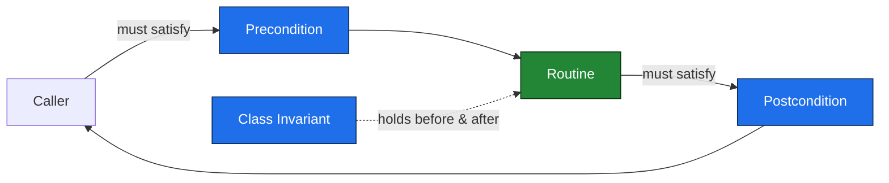
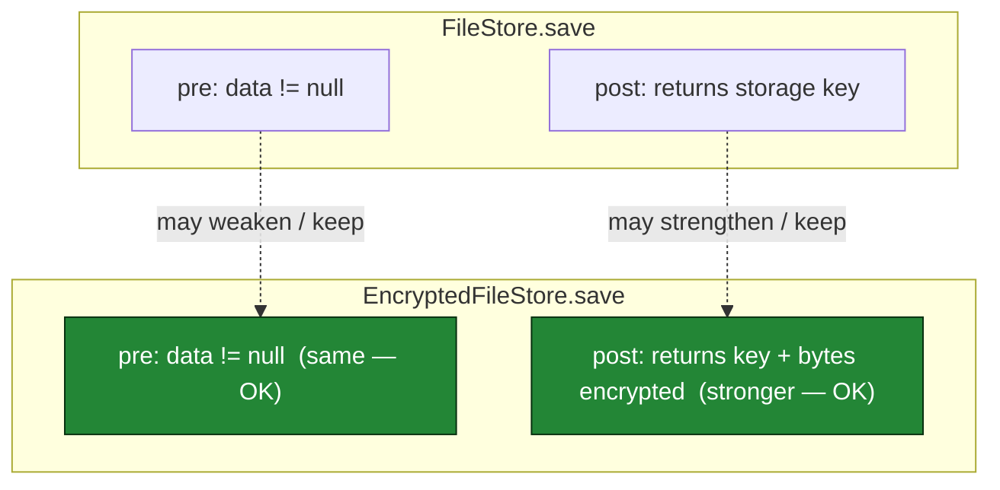
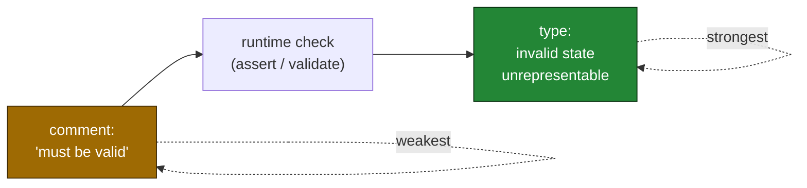

# Design by Contract — Practice Tasks

> 11 hands-on exercises on making contracts explicit, enforceable, and testable. Each task gives you a scenario, code with an implicit or violated contract, an instruction, and a full solution with reasoning. Languages vary (Java / Python / Go). Ordered easy → hard.

---

## Table of Contents

1. [Task 1 — Surface the hidden precondition (Python, Easy)](#task-1--surface-the-hidden-precondition-python-easy)
2. [Task 2 — Add a postcondition assertion (Go, Easy)](#task-2--add-a-postcondition-assertion-go-easy)
3. [Task 3 — Define and maintain a class invariant (Java, Medium)](#task-3--define-and-maintain-a-class-invariant-java-medium)
4. [Task 4 — Remove the double-check (Python, Medium)](#task-4--remove-the-double-check-python-medium)
5. [Task 5 — Promote a comment-contract to an enforced one (Java, Medium)](#task-5--promote-a-comment-contract-to-an-enforced-one-java-medium)
6. [Task 6 — Loosen an over-strict precondition (Go, Medium)](#task-6--loosen-an-over-strict-precondition-go-medium)
7. [Task 7 — Fix the LSP / contract break in a subtype (Java, Hard)](#task-7--fix-the-lsp--contract-break-in-a-subtype-java-hard)
8. [Task 8 — assert vs validate at a boundary (Python, Hard)](#task-8--assert-vs-validate-at-a-boundary-python-hard)
9. [Task 9 — Turn a postcondition into a property-based test (Python, Hard)](#task-9--turn-a-postcondition-into-a-property-based-test-python-hard)
10. [Task 10 — Push a runtime contract into the type system (Go, Hard)](#task-10--push-a-runtime-contract-into-the-type-system-go-hard)
11. [Task 11 — Contract audit (Java, open-ended)](#task-11--contract-audit-java-open-ended)
12. [Self-Assessment](#self-assessment)
13. [Related Topics](#related-topics)

---

## How to Use

Each task is a small unit of deliberate practice. Work it like this:

1. **Read the scenario and the code.** Before looking at the instruction, ask yourself: *what does this routine silently assume, and what does it silently promise?* Those two questions are the entire discipline of Design by Contract.
2. **Attempt the change in a scratch file** before expanding the solution. Run it if the language is at hand — every solution here is runnable.
3. **Open the solution** and compare not just the code but the *reasoning*: who owns each obligation (caller or callee), and what would break if the contract were stated differently.
4. **Re-check the blame assignment.** A failed precondition blames the *caller*; a failed postcondition or invariant blames the *callee*. If your fix points the finger in the wrong direction, it is the wrong fix.

The mental model for the whole chapter:



> Precondition broken → caller's bug. Postcondition or invariant broken → routine's bug. The contract is the line that decides who is at fault.

---

## Task 1 — Surface the hidden precondition (Python, Easy)

**Difficulty:** Easy

**Scenario:** This helper computes a moving average. It works in every test and demo, yet it carries an assumption the signature never reveals.

```python
def moving_average(values: list[float], window: int) -> list[float]:
    result = []
    for i in range(len(values) - window + 1):
        chunk = values[i:i + window]
        result.append(sum(chunk) / window)
    return result
```

**Instruction:** Identify the implicit preconditions and make them explicit at the top of the function. Choose an enforcement mechanism appropriate to a *programmer-facing* API (these are bugs in calling code, not untrusted external input). Document the contract.

<details>
<summary>Solution</summary>

There are two hidden assumptions and one quietly-wrong behaviour:

- `window` must be a positive integer. If `window == 0`, `sum(chunk) / window` raises `ZeroDivisionError` far from the cause. If `window` is negative, `range(...)` produces nonsense.
- `window` must not exceed `len(values)`. If it does, the loop body never runs and you get `[]` — a silent empty result that the caller probably did not expect.

Because the caller is *our own code* and a violation is a programming error, we fail fast with `assert`-style precondition checks expressed as explicit raises (so they survive `python -O`, which strips bare `assert`). The contract goes in the docstring.

```python
def moving_average(values: list[float], window: int) -> list[float]:
    """Return the simple moving average of `values` over `window` samples.

    Preconditions (caller's responsibility):
        - window >= 1
        - 1 <= window <= len(values)
    Postcondition (this function's guarantee):
        - len(result) == len(values) - window + 1
    """
    if window < 1:
        raise ValueError(f"window must be >= 1, got {window}")
    if window > len(values):
        raise ValueError(
            f"window ({window}) exceeds number of values ({len(values)})"
        )

    result = [
        sum(values[i:i + window]) / window
        for i in range(len(values) - window + 1)
    ]
    assert len(result) == len(values) - window + 1  # postcondition
    return result
```

**Reasoning.** The original "worked" only because no test exercised the boundary. A contract is not extra code — it is the specification that was always there, now written down where the compiler/runtime and the next reader can both see it. Naming the postcondition (`len(result) == len(values) - window + 1`) also documents the window semantics precisely, removing an off-by-one ambiguity.

</details>

---

## Task 2 — Add a postcondition assertion (Go, Easy)

**Difficulty:** Easy

**Scenario:** A function splits a slice into `n` near-equal contiguous chunks for parallel workers. The author *believes* it preserves every element, but nothing checks it.

```go
func chunk[T any](items []T, n int) [][]T {
    size := len(items) / n
    rem := len(items) % n
    out := make([][]T, 0, n)
    start := 0
    for i := 0; i < n; i++ {
        end := start + size
        if i < rem {
            end++ // distribute the remainder
        }
        out = append(out, items[start:end])
        start = end
    }
    return out
}
```

**Instruction:** State the precondition explicitly and add a postcondition assertion that the partition is *complete and disjoint* (every input element appears exactly once across the chunks). Use a panic for the contract breach — a violation here is a logic bug, not recoverable input.

<details>
<summary>Solution</summary>

The precondition is `n >= 1` (and, for this implementation, `n <= len(items)` if we want every chunk non-empty — but the algorithm tolerates empty trailing chunks, so we only require `n >= 1`). The postcondition is the real prize: a partition must be both *exhaustive* (counts sum to the input length) and *contiguous from zero* (no gaps, no overlap).

```go
func chunk[T any](items []T, n int) [][]T {
    if n < 1 {
        panic(fmt.Sprintf("chunk: n must be >= 1, got %d", n)) // precondition
    }

    size := len(items) / n
    rem := len(items) % n
    out := make([][]T, 0, n)
    start := 0
    for i := 0; i < n; i++ {
        end := start + size
        if i < rem {
            end++
        }
        out = append(out, items[start:end])
        start = end
    }

    // Postcondition: the chunks form a complete, disjoint, ordered partition.
    total := 0
    for _, c := range out {
        total += len(c)
    }
    if total != len(items) || start != len(items) || len(out) != n {
        panic(fmt.Sprintf(
            "chunk postcondition violated: covered=%d start=%d want=%d chunks=%d want=%d",
            total, start, len(items), len(out), n))
    }
    return out
}
```

**Reasoning.** Summing the lengths proves *completeness and disjointness together*: because the chunks are built from contiguous half-open ranges `[start, end)` with each `start` equal to the previous `end`, equal total length is sufficient to guarantee no element is dropped or duplicated. The cheap check `start == len(items)` catches the symmetric failure where the final cursor overshoots or stops short. A postcondition like this is worth far more than the line count suggests: it converts an off-by-one in the remainder distribution from a silent data-loss bug in a worker pool into an immediate, located panic.

In hot paths you would guard the assertion behind a build tag or `if debug` flag, but the *first* version should always carry the check until trust is earned.

</details>

---

## Task 3 — Define and maintain a class invariant (Java, Medium)

**Difficulty:** Medium

**Scenario:** A `TemperatureRange` is supposed to always satisfy `min <= max`. The class never says so, and one method quietly breaks it.

```java
class TemperatureRange {
    private double min;
    private double max;

    public TemperatureRange(double min, double max) {
        this.min = min;
        this.max = max;
    }

    public void setMin(double min) { this.min = min; }
    public void setMax(double max) { this.max = max; }

    public boolean contains(double t) { return t >= min && t <= max; }
    public double span() { return max - min; }
}
```

**Instruction:** Make `min <= max` an enforced **class invariant**. The invariant must hold after construction and after *every* mutating method. Add a single private check that each mutator calls, and prove the invariant cannot drift.

<details>
<summary>Solution</summary>

An invariant is a postcondition shared by the constructor and every public mutator. The cleanest enforcement is a single `checkInvariant()` called at the end of each state-changing operation; constructing in a broken state, or any setter that would break it, throws *before* the object escapes in a bad state.

```java
class TemperatureRange {
    private double min;
    private double max;

    public TemperatureRange(double min, double max) {
        this.min = min;
        this.max = max;
        checkInvariant();
    }

    public void setMin(double min) {
        double old = this.min;
        this.min = min;
        try {
            checkInvariant();
        } catch (IllegalStateException e) {
            this.min = old;          // roll back so the object stays valid
            throw e;
        }
    }

    public void setMax(double max) {
        double old = this.max;
        this.max = max;
        try {
            checkInvariant();
        } catch (IllegalStateException e) {
            this.max = old;
            throw e;
        }
    }

    public boolean contains(double t) { return t >= min && t <= max; }
    public double span() { return max - min; } // safe: invariant guarantees >= 0

    /** Class invariant: min <= max. Holds after construction and every mutation. */
    private void checkInvariant() {
        assert max >= min : "invariant violated: min=" + min + " max=" + max;
        if (max < min) {
            throw new IllegalStateException(
                "TemperatureRange invariant violated: min=" + min + " max=" + max);
        }
    }
}
```

**Reasoning.** The original `setMin(100)` on a `(0, 50)` range silently produced `min=100, max=50`, after which `span()` returns `-50` and `contains` is always `false` — a corrupt object that fails *later*, somewhere else. By routing every mutation through `checkInvariant()` and rolling back on violation, the type guarantees that *no observable state ever violates the invariant*. That is the contract a reader of `span()` relies on when they assume it is non-negative.

The strongest version of this design removes the setters entirely and makes `TemperatureRange` immutable (`withMin`/`withMax` returning new validated instances) — then the invariant is established once at construction and can never drift because the state never changes. Mutability is what forces the per-method re-check; see Task 10 for the type-system endgame of this idea.

</details>

---

## Task 4 — Remove the double-check (Python, Medium)

**Difficulty:** Medium

**Scenario:** A service validates that an order is payable, then calls a charge routine that validates the exact same thing again. The precondition is checked twice, on both sides of one call.

```python
def process_checkout(order: Order) -> Receipt:
    if order is None:
        raise ValueError("order is required")
    if order.total <= 0:
        raise ValueError("order total must be positive")
    if order.status != "CONFIRMED":
        raise ValueError("order must be confirmed")

    return charge(order)


def charge(order: Order) -> Receipt:
    # defensive re-validation of the caller's guarantees
    if order is None:
        raise ValueError("order is required")
    if order.total <= 0:
        raise ValueError("order total must be positive")
    if order.status != "CONFIRMED":
        raise ValueError("order must be confirmed")

    receipt = gateway.charge(order.total, order.payment_method)
    return receipt
```

**Instruction:** Both functions live in the same module and `charge` is *not* a public entry point — `process_checkout` is the only caller. Decide where the precondition belongs, remove the duplication, and document the contract so the deletion is safe.

<details>
<summary>Solution</summary>

Duplicated validation is not "extra safety" — it is two copies of one truth that will drift apart (one will gain a fourth rule the other lacks). Design by Contract resolves *where* a check belongs by asking **who is the caller, and is the caller trusted to satisfy the precondition?**

`charge` is an internal routine with exactly one caller. The contract is: *`process_checkout` validates; `charge` assumes a valid, confirmed, positive-total order.* So the validation lives once, in the public boundary, and `charge` states its precondition rather than re-checking it.

```python
def process_checkout(order: Order) -> Receipt:
    """Public entry point: validates the order, then charges it."""
    _require_payable(order)          # the single source of truth
    return charge(order)


def _require_payable(order: Order) -> None:
    if order is None:
        raise ValueError("order is required")
    if order.total <= 0:
        raise ValueError("order total must be positive")
    if order.status != "CONFIRMED":
        raise ValueError("order must be confirmed")


def charge(order: Order) -> Receipt:
    """Charge a payable order.

    Precondition (caller's responsibility): `order` is non-None, CONFIRMED,
    and has a positive total. The only caller, `process_checkout`, guarantees
    this via `_require_payable`. This routine does NOT re-validate.
    """
    assert order is not None and order.status == "CONFIRMED" and order.total > 0
    return gateway.charge(order.total, order.payment_method)
```

**Reasoning.** The `assert` in `charge` is not a third validation — it is a *cheap, optionally-disabled* statement of the contract that catches a future caller who forgets the precondition during development, then vanishes under `python -O` in production. Crucially it raises `AssertionError` (a programmer-bug signal), not `ValueError` (an input-rejection signal), so the *kind* of failure correctly reports *whose* fault it is.

The decision rule, stated generally: **validate once, at the trust boundary; assume (and optionally assert) everywhere inside it.** If `charge` later becomes a public API with untrusted callers, the boundary moves and the real validation moves with it. Re-checking on both sides is the symptom of an undecided contract.

</details>

---

## Task 5 — Promote a comment-contract to an enforced one (Java, Medium)

**Difficulty:** Medium

**Scenario:** This method's contract lives entirely in a Javadoc comment. Nothing enforces it, and nothing tests it.

```java
/**
 * Computes compound interest.
 *
 * @param principal the starting amount, must be > 0
 * @param annualRate the rate as a decimal, must be >= 0 (e.g. 0.05 for 5%)
 * @param years the term in years, must be > 0
 * @return the final balance, always >= principal
 */
public double compound(double principal, double annualRate, int years) {
    return principal * Math.pow(1 + annualRate, years);
}
```

**Instruction:** Turn each `@param ... must be` clause into an *enforced* precondition and the `@return ... always` clause into an *enforced* postcondition. Then sketch the test that proves the contract is real.

<details>
<summary>Solution</summary>

A comment-contract is a promise no machine has read. Each clause maps to executable code:

```java
import static java.util.Objects.requireNonNull;

/**
 * Computes compound interest.
 *
 * @param principal the starting amount, must be > 0
 * @param annualRate the rate as a decimal, must be >= 0 (e.g. 0.05 for 5%)
 * @param years      the term in years, must be > 0
 * @return the final balance, guaranteed >= principal
 * @throws IllegalArgumentException if any precondition is violated
 */
public double compound(double principal, double annualRate, int years) {
    // Preconditions — caller's obligations, enforced.
    if (principal <= 0) throw new IllegalArgumentException("principal must be > 0, got " + principal);
    if (annualRate < 0) throw new IllegalArgumentException("annualRate must be >= 0, got " + annualRate);
    if (years <= 0)     throw new IllegalArgumentException("years must be > 0, got " + years);

    double balance = principal * Math.pow(1 + annualRate, years);

    // Postcondition — this method's guarantee.
    assert balance >= principal
        : "postcondition violated: balance " + balance + " < principal " + principal;
    return balance;
}
```

Now the test that makes the contract real — it asserts both directions: violations are rejected, and the postcondition holds across the valid domain.

```java
@Test void rejectsNonPositivePrincipal() {
    assertThrows(IllegalArgumentException.class, () -> compound(0, 0.05, 10));
    assertThrows(IllegalArgumentException.class, () -> compound(-1, 0.05, 10));
}

@Test void rejectsNegativeRate() {
    assertThrows(IllegalArgumentException.class, () -> compound(100, -0.01, 10));
}

@Test void rejectsNonPositiveYears() {
    assertThrows(IllegalArgumentException.class, () -> compound(100, 0.05, 0));
}

@Test void balanceNeverDropsBelowPrincipal() {
    // With rate >= 0 and years > 0, the postcondition must always hold.
    assertTrue(compound(100, 0.0, 5) >= 100);   // zero rate: balance == principal
    assertTrue(compound(100, 0.05, 5) >= 100);  // positive rate: balance grows
}
```

**Reasoning.** Note that the *precondition* `annualRate >= 0` is exactly what makes the *postcondition* `balance >= principal` true: with a negative rate, `(1 + annualRate) < 1` and the balance would shrink, breaking the guarantee. This is the contract's internal consistency — a postcondition is only honest if the preconditions that support it are enforced. The comment claimed all of this; only the enforced version *means* it. The test is the proof that the words and the behaviour agree, and it locks the contract against future edits.

</details>

---

## Task 6 — Loosen an over-strict precondition (Go, Medium)

**Difficulty:** Medium

**Scenario:** A normalization helper rejects inputs it could perfectly well handle. The precondition is stricter than the routine actually requires, pushing needless ceremony onto every caller.

```go
// Normalize scales a vector to unit length.
// Precondition: v must have exactly 3 elements (x, y, z).
func Normalize(v []float64) ([]float64, error) {
    if len(v) != 3 {
        return nil, fmt.Errorf("vector must have exactly 3 elements, got %d", len(v))
    }
    var sumSq float64
    for _, x := range v {
        sumSq += x * x
    }
    mag := math.Sqrt(sumSq)
    out := make([]float64, len(v))
    for i, x := range v {
        out[i] = x / mag
    }
    return out, nil
}
```

**Instruction:** The `len(v) == 3` rule is a fiction — the algorithm works for any dimension. But there *is* a genuine precondition the code currently ignores. Replace the over-strict rule with the precondition the routine actually needs, and explain the difference.

<details>
<summary>Solution</summary>

The body never depends on `len(v) == 3`; it loops over whatever length it gets. The `== 3` check is an *over-strict precondition* — it rejects valid 2-D and N-D vectors for no reason and forces callers to pad or special-case. Meanwhile the *real* precondition is unstated: a zero vector has magnitude `0`, so the division produces `NaN`/`Inf` silently.

Loosen the false rule; enforce the true one.

```go
// Normalize scales a non-zero vector to unit length.
// Precondition: v is non-empty and not the zero vector (magnitude > 0).
// Postcondition: the returned vector has the same dimension as v and
// (within floating-point tolerance) unit length.
func Normalize(v []float64) ([]float64, error) {
    if len(v) == 0 {
        return nil, fmt.Errorf("vector must be non-empty")
    }
    var sumSq float64
    for _, x := range v {
        sumSq += x * x
    }
    if sumSq == 0 {
        return nil, fmt.Errorf("cannot normalize the zero vector")
    }
    mag := math.Sqrt(sumSq)
    out := make([]float64, len(v))
    for i, x := range v {
        out[i] = x / mag
    }
    return out, nil
}
```

**Reasoning.** A precondition should be the *weakest* condition under which the routine can keep its postcondition. `len(v) == 3` was too strong: it excluded inputs the routine handles correctly, which is a design defect because every over-strict precondition is a usability tax and a future change request. The zero-vector check is the precondition that was actually needed — it is the one input for which the postcondition ("unit length") is unachievable. Tightening the false rule and dropping the true one is exactly backwards from the original; getting the boundary right is the skill.

A useful heuristic: if you can delete a precondition check and no postcondition becomes false for any input the body accepts, the precondition was over-strict.

</details>

---

## Task 7 — Fix the LSP / contract break in a subtype (Java, Hard)

**Difficulty:** Hard

**Scenario:** `FileStore.save` accepts any non-null byte array. A subclass `EncryptedFileStore` overrides it but *strengthens the precondition* — it now also requires the payload to be a multiple of the cipher block size. Code written against `FileStore` breaks when handed an `EncryptedFileStore`.

```java
class FileStore {
    /** Precondition: data != null. Saves the bytes; returns the storage key. */
    public String save(byte[] data) {
        Objects.requireNonNull(data, "data");
        return write(data);
    }
}

class EncryptedFileStore extends FileStore {
    @Override
    public String save(byte[] data) {
        Objects.requireNonNull(data, "data");
        // STRENGTHENED precondition — not in the parent's contract:
        if (data.length % 16 != 0) {
            throw new IllegalArgumentException("data length must be a multiple of 16");
        }
        return write(encrypt(data));
    }
}
```

**Instruction:** Identify the Liskov violation precisely (precondition strengthened) and fix it so `EncryptedFileStore` is a true behavioural subtype — usable anywhere a `FileStore` is expected. State the LSP rule for contracts.

<details>
<summary>Solution</summary>

**The Liskov Substitution Principle, in contract terms:** a subtype may **weaken** preconditions (demand no *more* than the parent) and **strengthen** postconditions (promise no *less*). `EncryptedFileStore` does the forbidden thing — it *strengthens* the precondition by adding `data.length % 16 == 0`. A function holding a `FileStore` reference satisfied the parent contract (`data != null`) and is now rejected at runtime. That is the break.

The fix is to honour the parent's precondition: accept *any* non-null array, and absorb the block-size requirement *inside* the subtype via padding. The padding is an implementation detail of "I encrypt", not a new obligation on the caller.

```java
class EncryptedFileStore extends FileStore {
    private static final int BLOCK = 16;

    @Override
    public String save(byte[] data) {
        Objects.requireNonNull(data, "data"); // same precondition as parent — not stronger
        byte[] padded = pkcs7Pad(data, BLOCK); // subtype's job, not the caller's
        return write(encrypt(padded));
    }

    /** PKCS#7 padding: bring length up to a multiple of `block`. */
    private static byte[] pkcs7Pad(byte[] data, int block) {
        int padLen = block - (data.length % block);
        if (padLen == 0) padLen = block; // PKCS#7 always adds at least one block-marker
        byte[] out = Arrays.copyOf(data, data.length + padLen);
        for (int i = data.length; i < out.length; i++) {
            out[i] = (byte) padLen;
        }
        return out;
    }
}
```

**Reasoning.** The original design exported the cipher's block-size constraint to every caller — a leak of an implementation detail across a polymorphic boundary, and the textbook way to make a subtype that *looks* substitutable but explodes when actually substituted (e.g. inside a `List<FileStore>` loop). By padding internally, the subtype demands exactly what the parent demands (`data != null`) and delivers at least what the parent delivers (a storage key for the saved bytes). Substitution is now safe.

The contract diagram for a valid override:



If you ever feel the urge to add a precondition check in an override that the parent did not have, stop — that is an LSP break, and the requirement belongs either inside the subtype's implementation or, if it is truly the caller's concern, on a *different* type that is not a subtype of `FileStore`.

</details>

---

## Task 8 — assert vs validate at a boundary (Python, Hard)

**Difficulty:** Hard

**Scenario:** A single function mixes two fundamentally different kinds of check. One guards against *external, untrusted input*; the other guards against *internal programmer error*. The code treats them identically, which makes the failure modes lie about who is at fault.

```python
def apply_discount(request: dict, catalog: Catalog) -> Decimal:
    # 'request' arrives straight from an HTTP body (untrusted)
    code = request["coupon"]
    qty = request["quantity"]
    sku = request["sku"]

    product = catalog.find(sku)
    discount = DISCOUNTS[code]          # internal table, populated at startup
    price = product.price * qty
    final = price - (price * discount.rate)
    return final
```

**Instruction:** Two trust levels are tangled here. Separate them: external input must be **validated** (recoverable — return a 4xx-style error to the client), while internal invariants must be **asserted** (a contract breach is a bug — fail fast and loud). Classify every access and rewrite accordingly.

<details>
<summary>Solution</summary>

The discipline is: **validate what you do not control; assert what you do.** Crossing a trust boundary (HTTP body, file, DB row, another team's service) is *input handling* — failures are expected and recoverable. Inside the boundary, a violated assumption is a *contract breach* — a bug, surfaced immediately, never swallowed.

Classification of the original:

| Access | Source | Trust | Kind of check |
|---|---|---|---|
| `request["coupon"]` etc. | HTTP body | untrusted | **validate** (raise client error) |
| `qty` is a positive int | HTTP body | untrusted | **validate** |
| `DISCOUNTS[code]` | startup table | internal | **assert** the code resolves *after* it passed validation against known codes |
| `catalog.find(sku)` returns non-None | internal store | semi-trusted | **validate** (sku came from the client) |

```python
class BadRequest(Exception):
    """Recoverable: the client sent something invalid -> map to HTTP 400."""


def apply_discount(request: dict, catalog: Catalog) -> Decimal:
    # ---- boundary: VALIDATE untrusted input ----
    code = request.get("coupon")
    sku = request.get("sku")
    qty = request.get("quantity")

    if not isinstance(sku, str) or not sku:
        raise BadRequest("sku is required")
    if not isinstance(qty, int) or qty < 1:
        raise BadRequest("quantity must be a positive integer")
    if code not in DISCOUNTS:                 # validate against the known set
        raise BadRequest(f"unknown coupon: {code!r}")

    product = catalog.find(sku)
    if product is None:                       # sku is client-supplied -> validate
        raise BadRequest(f"unknown sku: {sku!r}")

    # ---- inside the boundary: ASSERT internal contracts ----
    discount = DISCOUNTS[code]
    # We already validated `code in DISCOUNTS`, so this lookup MUST succeed;
    # if a rate is out of range, our startup table is corrupt -> programmer bug.
    assert 0 <= discount.rate <= 1, f"corrupt discount rate for {code}: {discount.rate}"
    assert product.price >= 0, f"catalog returned negative price for {sku}"

    price = product.price * qty
    final = price - (price * discount.rate)

    # postcondition: a discount never increases the price, never goes negative
    assert 0 <= final <= price, f"discount postcondition violated: {final} not in [0, {price}]"
    return final
```

**Reasoning.** The original would raise a raw `KeyError` on a bad coupon — indistinguishable, to the operator, from a real bug, and likely surfaced to the user as a 500. After separation, a bad coupon is a `BadRequest` (the client's fault, recoverable, 400) while a discount rate of `1.5` in the startup table is an `AssertionError` (our fault, fail fast, paged at deploy time, *never* caught and retried). The `assert` statements double as documentation of internal invariants and vanish under `-O` once trust is established; the `BadRequest` validations are load-bearing and stay in production forever.

The single most important takeaway: **never assert on untrusted input** (an attacker would trigger your asserts at will, and `-O` would silently disable your only check), and **never validate-and-recover from a contract breach** (you would be hiding your own bug). Picking the right tool per check is the entire exercise. This is the formal-contract complement to the [Defensive vs Offensive](../16-defensive-vs-offensive/README.md) stance.

</details>

---

## Task 9 — Turn a postcondition into a property-based test (Python, Hard)

**Difficulty:** Hard

**Scenario:** A `roman` codec has a round-trip postcondition stated only in a comment: *decoding what we encoded yields the original number.* Example-based tests check a handful of cases and miss the gaps.

```python
def to_roman(n: int) -> str:
    # Precondition: 1 <= n <= 3999
    # Postcondition: from_roman(to_roman(n)) == n   (round-trip)
    numerals = [(1000,"M"),(900,"CM"),(500,"D"),(400,"CD"),(100,"C"),
                (90,"XC"),(50,"L"),(40,"XL"),(10,"X"),(9,"IX"),
                (5,"V"),(4,"IV"),(1,"I")]
    out = []
    for value, symbol in numerals:
        while n >= value:
            out.append(symbol)
            n -= value
    return "".join(out)

def from_roman(s: str) -> int: ...
```

**Instruction:** The round-trip postcondition is a *universal property* — it should hold for every valid `n`, not three examples. Convert it into a property-based test (use Hypothesis) that exercises the whole domain, and also encode the precondition as an enforced check. Explain why a property test is the natural home for a postcondition.

<details>
<summary>Solution</summary>

First, enforce the precondition (a comment is not a contract):

```python
def to_roman(n: int) -> str:
    if not (1 <= n <= 3999):
        raise ValueError(f"to_roman requires 1 <= n <= 3999, got {n}")
    numerals = [(1000,"M"),(900,"CM"),(500,"D"),(400,"CD"),(100,"C"),
                (90,"XC"),(50,"L"),(40,"XL"),(10,"X"),(9,"IX"),
                (5,"V"),(4,"IV"),(1,"I")]
    out = []
    for value, symbol in numerals:
        while n >= value:
            out.append(symbol)
            n -= value
    return "".join(out)
```

Now turn the postcondition into a property that holds across the *entire* legal domain:

```python
from hypothesis import given, strategies as st

# Postcondition as a universal property: round-trip is the identity.
@given(st.integers(min_value=1, max_value=3999))
def test_roman_round_trips(n):
    assert from_roman(to_roman(n)) == n

# Precondition is enforced: out-of-range input is rejected, never silently mishandled.
@given(st.integers().filter(lambda x: x < 1 or x > 3999))
def test_to_roman_rejects_out_of_range(n):
    import pytest
    with pytest.raises(ValueError):
        to_roman(n)

# A second postcondition worth stating: output uses only valid symbols.
@given(st.integers(min_value=1, max_value=3999))
def test_output_contains_only_roman_symbols(n):
    assert set(to_roman(n)) <= set("MDCLXVI")
```

**Reasoning.** A postcondition is a claim of the form *for all valid inputs, this property of the output holds.* That is **exactly** what a property-based test expresses: `@given` quantifies over the input domain (`1..3999`, which is also the enforced precondition), and the assertion is the postcondition. Example-based tests sample three points and hope the gaps are fine; a property test makes Hypothesis *search* for a counterexample — and when it finds one (say `to_roman` mishandles `4`, `9`, `40`, `900`), it *shrinks* it to the minimal failing input, handing you the smallest reproduction.

This is the deep link between Design by Contract and testing: **contracts are specifications, and a property-based test is an executable specification.** The precondition becomes the input generator's bounds; the postcondition becomes the assertion. Whenever you write a postcondition stronger than "returns something", ask whether it is really a property over the whole domain — if so, a property test verifies the contract far more thoroughly than any list of examples could. (See the property-based-testing material for generator design and shrinking.)

</details>

---

## Task 10 — Push a runtime contract into the type system (Go, Hard)

**Difficulty:** Hard

**Scenario:** An email-sending routine re-validates its address on every call. The precondition ("`to` is a syntactically valid email") is checked at *runtime*, in *every* function that takes an address, scattered and repeated.

```go
func SendWelcome(to string) error {
    if !isValidEmail(to) {
        return fmt.Errorf("invalid email: %q", to)
    }
    return smtp.Send(to, "Welcome!", body)
}

func SendReceipt(to string, r Receipt) error {
    if !isValidEmail(to) {                // same precondition, checked again
        return fmt.Errorf("invalid email: %q", to)
    }
    return smtp.Send(to, "Your receipt", render(r))
}
```

**Instruction:** A precondition that every function repeats is begging to become a *type*. Introduce a type that can only hold a valid email, so validation happens **once at construction** and the contract is then enforced by the compiler — `SendWelcome`/`SendReceipt` no longer need (or are able) to receive an invalid address. Show why this is strictly stronger than the runtime checks.

<details>
<summary>Solution</summary>

The repeated `isValidEmail` check is a runtime precondition copy-pasted across every consumer — Task 4's double-check, generalized to N callees. The fix is to make *invalidity unrepresentable*: a named type whose only constructor validates, so possessing a value of that type *is the proof* the precondition holds. This is "parse, don't validate."

```go
// Email is a string that has been validated at construction time.
// Its zero value is unusable; the only way to obtain a non-empty Email is
// through NewEmail, which enforces the precondition exactly once.
type Email struct {
    addr string
}

func NewEmail(raw string) (Email, error) {
    raw = strings.TrimSpace(raw)
    if !isValidEmail(raw) {
        return Email{}, fmt.Errorf("invalid email: %q", raw)
    }
    return Email{addr: raw}, nil
}

func (e Email) String() string { return e.addr }

// Consumers now state the contract in their *signature*. There is no runtime
// check because there is no way to construct an invalid Email to pass in.
func SendWelcome(to Email) error {
    return smtp.Send(to.String(), "Welcome!", body)
}

func SendReceipt(to Email, r Receipt) error {
    return smtp.Send(to.String(), "Your receipt", render(r))
}
```

Validation now happens once, at the edge where the raw string enters the system:

```go
to, err := NewEmail(request.FormValue("email")) // validate at the boundary
if err != nil {
    http.Error(w, err.Error(), http.StatusBadRequest)
    return
}
_ = SendWelcome(to) // and everywhere downstream the compiler guarantees validity
```

**Reasoning.** The runtime version checks the precondition `O(N)` times — once per consumer — and a *new* consumer that forgets the check is a latent bug the compiler cannot catch. The type-based version checks it *once* and then the *type system* propagates the guarantee for free to every function whose signature says `Email`. The contract `to is a valid email` has migrated from a comment/runtime-check into a static, compiler-enforced fact: it is now impossible to even *call* `SendWelcome` with an unvalidated string, so the precondition cannot be violated by construction.

This is the strongest form a contract can take. The progression across this chapter is a ladder:



Whenever a precondition appears in more than one place, ask whether a type can absorb it. Eliminating a check by making its violation unrepresentable beats enforcing the check correctly in every location.

</details>

---

## Task 11 — Contract audit (Java, open-ended)

**Difficulty:** Hard (open-ended)

**Scenario:** Below is a realistic `BankAccount`. It has implicit preconditions, an undeclared invariant, a comment-contract, a double-check, and a latent LSP trap waiting for a subclass. Audit it.

```java
class BankAccount {
    private long balanceCents;       // can go negative today — should it?
    private final String owner;
    private boolean frozen;

    public BankAccount(String owner, long openingCents) {
        this.owner = owner;
        this.balanceCents = openingCents;
    }

    /** Deposit money. amount must be positive. */
    public void deposit(long cents) {
        if (cents <= 0) throw new IllegalArgumentException("amount must be positive");
        balanceCents += cents;
    }

    public void withdraw(long cents) {
        if (cents <= 0) throw new IllegalArgumentException("amount must be positive");
        balanceCents -= cents;       // no overdraft guard
    }

    public void transfer(BankAccount to, long cents) {
        if (cents <= 0) throw new IllegalArgumentException("amount must be positive");
        if (cents > balanceCents) throw new IllegalStateException("insufficient funds");
        this.withdraw(cents);        // withdraw re-checks cents > 0  (double-check)
        to.deposit(cents);
    }
}
```

**Instruction:** List every contract defect (implicit precondition, missing invariant, comment-only contract, double-check, missing postcondition, LSP risk), then write a one-line fix plan for each. You do not need to produce the full rewritten class, but state the invariant precisely.

<details>
<summary>Solution</summary>

| Defect | Where | Fix |
|---|---|---|
| **Implicit precondition** | constructor: `owner` may be null/blank; `openingCents` may be negative | Enforce `owner != null && !owner.isBlank()` and `openingCents >= 0` in the constructor; fail fast. |
| **Undeclared class invariant** | `balanceCents` can be left negative by `withdraw` | Declare and enforce the invariant **`balanceCents >= 0`** (assuming no overdraft product). Add `private void checkInvariant()` called after every mutation. |
| **Comment-only contract** | `deposit`'s `/** amount must be positive */` | Already enforced in `deposit`/`withdraw` — but promote the *postcondition* (`balance increases by exactly `cents``) to an `assert`, and document it in Javadoc that matches the code. |
| **Missing precondition** | `withdraw` has no overdraft guard, so it can break the invariant | Add `if (cents > balanceCents) throw new IllegalStateException("insufficient funds");` *inside* `withdraw`, so the invariant holds regardless of caller. |
| **Double-check** | `transfer` checks `cents > 0` and `cents > balance`, then `withdraw` re-checks both | Decide ownership: make `withdraw` the single guardian of its own precondition (`cents > 0`) and invariant (`balance >= cents`); `transfer` should *not* duplicate the overdraft check — it should rely on `withdraw` throwing, or order operations so a failed `withdraw` aborts before `deposit`. |
| **Atomicity / postcondition gap** | `transfer` does `withdraw` then `deposit`; if `deposit` throws, money vanishes | State the postcondition **`this.balance + to.balance` is conserved**; guarantee it by performing both mutations under a lock / transaction and rolling back on failure. |
| **LSP trap (latent)** | a future `SavingsAccount extends BankAccount` that *strengthens* `withdraw` (e.g. min-balance, or limited withdrawals/month) | Forbid strengthening `withdraw`'s precondition in subclasses; if a savings product needs stricter rules, model it as a *separate* type or a composed policy, not a subclass that rejects inputs the parent accepts. |

**The invariant, stated precisely:**

> For every `BankAccount` not offering an overdraft facility: `balanceCents >= 0` holds immediately after construction and after the completion of every public method (`deposit`, `withdraw`, `transfer`). A method that cannot complete without violating it must throw *before* mutating state, leaving the object unchanged.

**Recommended order of attack:**

1. Enforce constructor preconditions so no account is *born* invalid.
2. Add the overdraft guard to `withdraw` and the `checkInvariant()` call — this establishes the invariant for the *whole* class, since `transfer` and every future method route through `withdraw`/`deposit`.
3. Remove `transfer`'s duplicate overdraft check; let `withdraw` own it, and reorder so `withdraw` (which can fail) happens first, before the irreversible `deposit`.
4. Add postcondition asserts (`balance increased/decreased by exactly cents`; conservation across `transfer`).
5. Make the value-conservation atomic (lock or transaction) so a partial failure cannot break the cross-account postcondition.
6. Document the LSP rule on `withdraw` so the inheritance trap is closed before someone springs it.

**Reasoning.** Each defect maps to one of the chapter's anti-patterns, and the fixes interlock: enforcing the precondition *inside* `withdraw` is what lets you delete the *double-check* in `transfer`, and it is also what *establishes the invariant* — because once `withdraw` cannot overdraw, no public path can leave `balanceCents` negative. That single change pays off three line items at once, which is the hallmark of getting the contract boundaries right rather than scattering checks.

</details>

---

## Self-Assessment

Rate yourself honestly after working the tasks. You have internalized Design by Contract when you can answer "yes" to all of these:

- [ ] Given any function, I can state its **precondition**, **postcondition**, and (for a class) **invariant** without running it.
- [ ] When an assertion fails, I can say immediately **who is to blame** — caller (precondition) or callee (postcondition/invariant).
- [ ] I can decide correctly between **`assert` (contract breach / programmer bug)** and **validate-and-recover (untrusted input)** at any boundary, and I never confuse the two.
- [ ] I can spot a **double-check** and decide which side legitimately owns the precondition.
- [ ] I can recognize an **LSP / contract violation** in a subtype (strengthened precondition or weakened postcondition) and fix it without breaking substitutability.
- [ ] I can turn a **postcondition into a property-based test** when it is a universal property over the input domain.
- [ ] I can identify when a repeated runtime precondition should be **promoted into the type system** so its violation becomes unrepresentable.
- [ ] I can spot an **over-strict precondition** — one that rejects inputs the routine could handle — and weaken it to the minimum the postcondition actually needs.

If any box is unchecked, re-do the matching task and read the reasoning, not just the code.

---

## Related Topics

- [junior.md](junior.md) — the entry-level walkthrough of preconditions, postconditions, and invariants for this chapter.
- [find-bug.md](find-bug.md) — buggy snippets where a broken or unstated contract is the root cause.
- [optimize.md](optimize.md) — tightening and relocating contracts (toward types and boundaries) for clarity and safety.
- [Chapter README](../README.md) — the positive rules of Design by Contract.
- [Defensive vs Offensive](../16-defensive-vs-offensive/README.md) — the *stance* toward bad input; the complement to this chapter's formal contracts.
- [Refactoring](../../refactoring/README.md) — many contract fixes (extract validation, introduce value object) are refactorings; this section catalogs the mechanics.

---

> **Next:** [find-bug.md](find-bug.md) — find the broken contracts hiding in code that looks correct.
