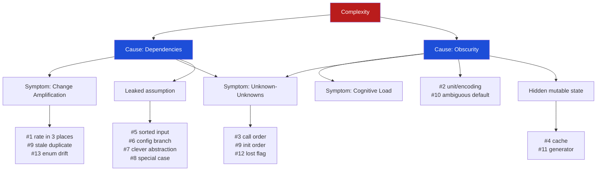

# Deep Modules & Complexity — Find the Bug

> 13 snippets where **complexity is the accomplice**. In each one a real defect hides behind a symptom of complexity — change amplification, obscurity, a leaked dependency, hidden mutable state, or an "it's just one special case" branch nobody tests. The bug is not a typo you can spot by squinting; it is *concealed by the system's shape*. Find it, name the complexity that hid it, then watch the bug surface the moment the design is simplified.

The thesis, straight from Ousterhout: **complexity is anything that makes software hard to understand or modify**, and it shows up as three symptoms — change amplification, high cognitive load, and unknown-unknowns — caused by exactly two roots: **dependencies** and **obscurity**. Every snippet below is a small, runnable demonstration that those symptoms are not abstract: they are where bugs go to live.

---

## Table of Contents

1. [How to Use](#how-to-use)
2. [The Map: which complexity hides which bug](#the-map-which-complexity-hides-which-bug)
3. [Snippet 1 — Change amplification: the rate that lives in three places (Go)](#snippet-1--change-amplification-the-rate-that-lives-in-three-places-go)
4. [Snippet 2 — Obscurity: seconds, milliseconds, and a wrong TTL (Python)](#snippet-2--obscurity-seconds-milliseconds-and-a-wrong-ttl-python)
5. [Snippet 3 — Unknown-unknown: an implicit call-ordering contract (Java)](#snippet-3--unknown-unknown-an-implicit-call-ordering-contract-java)
6. [Snippet 4 — Hidden shared mutable state: the cache two paths disagree about (Go)](#snippet-4--hidden-shared-mutable-state-the-cache-two-paths-disagree-about-go)
7. [Snippet 5 — Leaked dependency: a helper that assumes sorted input (Python)](#snippet-5--leaked-dependency-a-helper-that-assumes-sorted-input-python)
8. [Snippet 6 — Accidental complexity: the config-driven engine's untested branch (Java)](#snippet-6--accidental-complexity-the-config-driven-engines-untested-branch-java)
9. [Snippet 7 — The clever general abstraction with a silent edge case (Go)](#snippet-7--the-clever-general-abstraction-with-a-silent-edge-case-go)
10. [Snippet 8 — "It's just one special case": the branch that mutates the loop bound (Python)](#snippet-8--its-just-one-special-case-the-branch-that-mutates-the-loop-bound-python)
11. [Snippet 9 — Temporal coupling across modules: init order (Java)](#snippet-9--temporal-coupling-across-modules-init-order-java)
12. [Snippet 10 — Obscurity: a default that means two different things (Go)](#snippet-10--obscurity-a-default-that-means-two-different-things-go)
13. [Snippet 11 — Hidden state: a generator consumed twice (Python)](#snippet-11--hidden-state-a-generator-consumed-twice-python)
14. [Snippet 12 — Pass-through dependency hides a lost flag (Java)](#snippet-12--pass-through-dependency-hides-a-lost-flag-java)
15. [Snippet 13 — Change amplification across the wire: enum drift (Go)](#snippet-13--change-amplification-across-the-wire-enum-drift-go)
16. [Scorecard](#scorecard)
17. [Related Topics](#related-topics)

---

## How to Use

1. Read the snippet. Resist the urge to scroll. Ask yourself the literal question: **what is the bug, and what shape in this code let it survive code review?**
2. Form a hypothesis about the *defect* and a second hypothesis about the *complexity* — they are different. The defect is the wrong output; the complexity is the reason a competent engineer wrote it and a competent reviewer approved it.
3. Open the answer. Each one gives you three things: **the bug**, **the complexity that hid it**, and **the simplification that makes the bug either impossible or impossible to miss**.
4. The deepest lesson is in the third part. A simplification that merely fixes *this* bug is a patch; a simplification that makes the *whole class* of bug structurally impossible is design. We aim for the second every time.

> Difficulty is marked per snippet: 🟢 warm-up · 🟡 needs care · 🔴 you will likely miss it on the first pass.

---

## The Map: which complexity hides which bug



Each bug below is filed under the root cause and symptom it best illustrates. Several straddle categories — that is the point. Complexity is not modular.

---

## Snippet 1 — Change amplification: the rate that lives in three places (Go)

🟡 Difficulty: needs care

```go
package billing

import "math"

// Tax rate for the EU standard VAT. Used across the billing module.

func PriceWithTax(net float64) float64 {
	return net * 1.20 // includes 20% VAT
}

func TaxComponent(net float64) float64 {
	return net * 0.20 // 20% VAT
}

// Used by the invoice PDF renderer.
func FormatTaxLine(net float64) string {
	tax := net * 0.20
	return "VAT (20%): " + formatMoney(tax)
}

// Reconciliation job: recompute net from a gross total to verify ledger entries.
func NetFromGross(gross float64) float64 {
	// gross = net * (1 + rate)  =>  net = gross / (1 + rate)
	return math.Round(gross/1.2*100) / 100
}
```

The VAT rate just changed from 20% to 21%. An engineer searches for `0.20`, updates `TaxComponent` and `FormatTaxLine`, ships it. Reconciliation starts failing intermittently. **Where is the bug?**

<details><summary>Answer</summary>

**The bug.** The rate `20%` is encoded **four** different ways across four functions: as `1.20`, as `0.20` (twice), and as `1.2`. The engineer searched for the literal `0.20` and found two of the four occurrences. `PriceWithTax` still multiplies by `1.20`, and `NetFromGross` still divides by `1.2`. After the change, `PriceWithTax(100)` returns `120.00` (old rate) while `TaxComponent(100)` returns `21.00` (new rate). The gross a customer is charged (`120`) no longer equals net plus the tax line item (`100 + 21 = 121`). Reconciliation fails because the two halves of the ledger were computed with different rates.

**The complexity that hid it.** *Change amplification* — Ousterhout's first symptom. A single conceptual change ("the VAT rate is now 21%") requires edits in four places, and three of them don't even contain the string you'd grep for. The rate is *non-local* (obscurity) and *duplicated* (dependency between every site and an invisible shared fact). The reviewer saw a clean two-line diff and approved it; the diff was clean precisely because two of the four sites were untouched.

**The simplification that surfaces it.** Make the rate exist exactly once and force every site to depend on that one declaration:

```go
const VATRate = 0.21 // single source of truth

func PriceWithTax(net float64) float64 { return net * (1 + VATRate) }
func TaxComponent(net float64) float64 { return net * VATRate }
func FormatTaxLine(net float64) string {
	pct := int(VATRate * 100)
	return fmt.Sprintf("VAT (%d%%): %s", pct, formatMoney(net*VATRate))
}
func NetFromGross(gross float64) float64 {
	return math.Round(gross/(1+VATRate)*100) / 100
}
```

Now the change is a one-character edit (`0.20` → `0.21`) in a single declaration, and there is no surface left for a missed site. The bug was never "the engineer forgot a place"; the bug was a design that *had* places to forget.
</details>

---

## Snippet 2 — Obscurity: seconds, milliseconds, and a wrong TTL (Python)

🟡 Difficulty: needs care

```python
import time

CACHE_TTL = 300  # 5 minutes


class SessionCache:
    def __init__(self):
        self._store = {}  # key -> (value, stored_at)

    def put(self, key, value):
        # time.time() returns float seconds since epoch
        self._store[key] = (value, time.time())

    def get(self, key):
        entry = self._store.get(key)
        if entry is None:
            return None
        value, stored_at = entry
        if self._now_ms() - stored_at > CACHE_TTL:
            del self._store[key]
            return None
        return value

    def _now_ms(self):
        # other parts of the system log in milliseconds, so we standardized on ms
        return int(time.time() * 1000)
```

Sessions are expiring almost instantly — users get logged out seconds after logging in. **Where is the bug?**

<details><summary>Answer</summary>

**The bug.** `put` stores `stored_at` in **seconds** (`time.time()`). `get` computes the age as `self._now_ms() - stored_at`, mixing **milliseconds** and **seconds**. For a fresh entry, `_now_ms()` is roughly `1.749e12` and `stored_at` is roughly `1.749e9`, so the "age" is about `1.747e12`, which is wildly greater than `CACHE_TTL = 300`. Every entry is judged expired on the first read. The cache never returns a value; sessions die on arrival.

**The complexity that hid it.** *Obscurity* — Ousterhout's purest example. The unit of a number is critical information that *is not present in the code*. `time.time()`, `_now_ms()`, `stored_at`, and `CACHE_TTL` are all bare floats and ints; nothing in a type or a name forces them to agree. The `_now_ms` helper was introduced for a reasonable reason ("the rest of the system logs in ms"), and that local-sounding justification created a silent cross-unit subtraction. The reviewer would have had to hold the unit of every numeric variable in working memory — exactly the *cognitive load* the symptom describes.

**The simplification that surfaces it.** Pick one unit, name it in the API, and never expose a bare epoch number:

```python
class Seconds(float):
    """A duration or instant measured in seconds. Distinct by name at every call site."""


CACHE_TTL = Seconds(300)


class SessionCache:
    def __init__(self, clock=time.monotonic):
        self._store = {}
        self._clock = clock  # monotonic: immune to wall-clock jumps, single unit

    def put(self, key, value):
        self._store[key] = (value, Seconds(self._clock()))

    def get(self, key):
        entry = self._store.get(key)
        if entry is None:
            return None
        value, stored_at = entry
        if Seconds(self._clock()) - stored_at > CACHE_TTL:
            del self._store[key]
            return None
        return value
```

There is no `_now_ms` to mix in, the clock is injected once, and `monotonic` is the right tool for measuring elapsed time anyway. The unit mismatch is no longer expressible because there is only one unit and only one clock.
</details>

---

## Snippet 3 — Unknown-unknown: an implicit call-ordering contract (Java)

🔴 Difficulty: you will likely miss it

```java
public class ReportBuilder {
    private final List<Row> rows = new ArrayList<>();
    private BigDecimal runningTotal = BigDecimal.ZERO;
    private boolean finalized = false;

    public void addRow(Row row) {
        rows.add(row);
        runningTotal = runningTotal.add(row.amount());
    }

    // Applies the audited rounding policy and locks the report.
    public void finalizeTotals() {
        runningTotal = runningTotal.setScale(2, RoundingMode.HALF_EVEN);
        finalized = true;
    }

    public BigDecimal total() {
        return runningTotal;
    }

    public byte[] renderPdf() {
        // renders rows + total into a PDF
        return Pdf.render(rows, runningTotal);
    }
}
```

The original report-generation code worked for two years. A new export feature was added by a different team:

```java
public byte[] exportReport(List<Row> data) {
    ReportBuilder b = new ReportBuilder();
    for (Row r : data) b.addRow(r);
    return b.renderPdf();   // new caller
}
```

Auditors report the new export's totals are occasionally off by a cent versus the legacy report. **Where is the bug?**

<details><summary>Answer</summary>

**The bug.** `renderPdf()` uses `runningTotal` directly. But `runningTotal` is only correctly *rounded* after `finalizeTotals()` has been called — that method applies the audited `HALF_EVEN` rounding to two decimal places. The legacy code path always called `finalizeTotals()` before rendering. The new `exportReport` does not, so it renders the *unrounded* accumulator. Most of the time the sum already has two decimals and matches; occasionally a fractional cent makes the export disagree with the audited legacy report by a cent.

**The complexity that hid it.** *Unknown-unknowns* — Ousterhout's most dangerous symptom, because "there is no way to know that you needed to know." The contract "you must call `finalizeTotals()` before `renderPdf()`" exists only in the head of the original author and in the accident that the legacy path happened to do it. Nothing in the type system, the method names, or the compiler enforces the order. The new team had no signal that ordering mattered; the code compiled, ran, and produced plausible numbers. This is *temporal coupling* turned into a latent bug.

**The simplification that surfaces it.** Make the illegal state unrepresentable by removing the mutable, order-dependent accumulator. A report is finalized *by construction*:

```java
public final class Report {
    private final List<Row> rows;
    private final BigDecimal total;

    private Report(List<Row> rows, BigDecimal total) {
        this.rows = rows;
        this.total = total;
    }

    // The only way to get a Report applies the rounding policy. No ordering to forget.
    public static Report of(List<Row> rows) {
        BigDecimal sum = rows.stream()
            .map(Row::amount)
            .reduce(BigDecimal.ZERO, BigDecimal::add)
            .setScale(2, RoundingMode.HALF_EVEN);
        return new Report(List.copyOf(rows), sum);
    }

    public BigDecimal total() { return total; }
    public byte[] renderPdf() { return Pdf.render(rows, total); }
}
```

There is no half-built `ReportBuilder` to render, no `finalizeTotals()` to forget, and no order to get wrong. The unknown-unknown ("did you finalize?") is deleted, not documented.
</details>

---

## Snippet 4 — Hidden shared mutable state: the cache two paths disagree about (Go)

🔴 Difficulty: you will likely miss it

```go
package pricing

var discountCache = map[string]float64{} // userID -> discount fraction, lazily filled

// Called by the cart page.
func DiscountFor(userID string) float64 {
	if d, ok := discountCache[userID]; ok {
		return d
	}
	d := computeDiscount(userID) // hits the DB, expensive
	discountCache[userID] = d
	return d
}

// Called by an admin tool when a user's tier changes.
func RefreshTier(userID string, newTier string) {
	saveTierToDB(userID, newTier)
	delete(discountCache, userID) // invalidate so next read recomputes
}

// Called by the checkout service to compute the final charge.
func FinalPrice(userID string, subtotal float64) float64 {
	discount := DiscountFor(userID)
	// ... 200 lines later, in the same request, after a slow inventory check ...
	return subtotal * (1 - discountCache[userID])
}
```

A user is charged the wrong amount during checkout, but only sometimes, and only when an admin happens to be active. **Where is the bug?**

<details><summary>Answer</summary>

**The bug.** `FinalPrice` reads the discount **twice from two different sources at two different times**: once via `DiscountFor(userID)` (which fills the cache), and again, 200 lines later, by directly indexing `discountCache[userID]`. Between those two reads the request does a slow inventory check. If an admin calls `RefreshTier` during that window, `delete(discountCache, userID)` removes the entry, so the second read `discountCache[userID]` returns the **zero value `0.0`** — meaning *no discount*. The customer is charged full price even though the line items showed a discount. The map is also accessed without a lock, so concurrent reads/writes are a data race on top of the logic bug.

**The complexity that hid it.** This is the *Out of the Tar Pit* state problem in miniature: a piece of **hidden, shared, mutable state** (`discountCache`) is read by independent code paths at inconsistent times. The single function `FinalPrice` *looks* internally consistent — it computes `discount` and later "uses the discount" — but the two uses are not the same value. The package-level `var` is a global dependency that nothing in the signatures declares; any function in the package can mutate it, and one (`RefreshTier`) does, from a different goroutine. The reviewer cannot see the bug by reading `FinalPrice` alone, because the cause lives in a different function called by a different actor.

**The simplification that surfaces it.** Read the value **once**, treat it as an immutable input for the rest of the computation, and stop reaching back into shared state:

```go
func FinalPrice(userID string, subtotal float64) float64 {
	discount := DiscountFor(userID) // read once
	// ... slow inventory check ...
	return subtotal * (1 - discount) // use the local snapshot, never the global
}
```

The deeper fix is to stop using a package-level mutable map as an implicit dependency. Pass the cache in (or wrap it behind a type with a mutex and a single `Get` that returns a stable snapshot). Once the value is a local variable, no other actor can change it mid-request, and the inconsistency is impossible.
</details>

---

## Snippet 5 — Leaked dependency: a helper that assumes sorted input (Python)

🟡 Difficulty: needs care

```python
def median(values):
    """Return the median. Assumes `values` is sorted ascending (caller's job)."""
    n = len(values)
    mid = n // 2
    if n % 2 == 1:
        return values[mid]
    return (values[mid - 1] + values[mid]) / 2


def p95_latency(samples):
    samples.sort()
    idx = int(len(samples) * 0.95)
    return samples[idx]


def dashboard_stats(raw_latencies):
    return {
        "median_ms": median(raw_latencies),   # caller A
        "p95_ms": p95_latency(raw_latencies),  # caller B
    }
```

The p95 number on the dashboard looks right. The median looks wrong — far higher than it should be. **Where is the bug?**

<details><summary>Answer</summary>

**The bug.** `median` documents — in prose only — that it assumes a sorted input. `dashboard_stats` passes `raw_latencies` (unsorted) straight into `median`. So `median` happily indexes the middle of an *unsorted* list and returns whatever sample happens to sit at that position — not the median at all. (`p95_latency` looks correct only because it sorts internally; but note that its `samples.sort()` mutates the caller's list, which means the *order in which the two callers run* changes the result of the other — a second, latent bug.)

**The complexity that hid it.** A *leaked dependency / leaked assumption*. `median` has a precondition ("input is sorted") that is not part of its interface — it lives in a docstring, which is the weakest possible enforcement. The dependency leaks into every caller: each caller must *remember* to sort. One caller (`p95_latency`) sorts; the other (`median` via `dashboard_stats`) does not. Worse, because `p95_latency` sorts *in place*, whether `median` sees sorted data now depends on **call order** — a hidden coupling between two functions that share a mutable argument. This is dependency creep: the two stats functions can no longer be understood independently.

**The simplification that surfaces it.** A function should not depend on a precondition it does not enforce. Make `median` own its requirement, and stop mutating shared input:

```python
def median(values):
    s = sorted(values)  # owns its precondition; cannot be fed unsorted
    n = len(s)
    mid = n // 2
    if n % 2 == 1:
        return s[mid]
    return (s[mid - 1] + s[mid]) / 2


def p95_latency(samples):
    s = sorted(samples)  # no in-place mutation of the caller's list
    return s[int(len(s) * 0.95)]
```

Now neither function leaks an assumption onto its callers, neither mutates shared state, and the result no longer depends on which one runs first. (For large inputs, sort once in the caller and pass an explicitly-typed `SortedSamples` so the sortedness is in the *type*, not in a comment.)
</details>

---

## Snippet 6 — Accidental complexity: the config-driven engine's untested branch (Java)

🔴 Difficulty: you will likely miss it

```java
// A "flexible" rules engine. Behavior is driven by a config map so that
// "business can change rules without a deploy."
public class FeeEngine {

    public BigDecimal computeFee(Account acct, Map<String, Object> rules) {
        BigDecimal base = (BigDecimal) rules.getOrDefault("base", BigDecimal.ZERO);
        String mode = (String) rules.getOrDefault("mode", "flat");

        switch (mode) {
            case "flat":
                return base;
            case "percent":
                BigDecimal pct = (BigDecimal) rules.get("percent");
                return acct.balance().multiply(pct);
            case "tiered":
                BigDecimal rate = tierRate(acct, rules);
                // tiered fee = base + balance * tierRate
                return base.add(acct.balance().multiply(rate));
            case "percent_capped":
                BigDecimal p = (BigDecimal) rules.get("percent");
                BigDecimal cap = (BigDecimal) rules.get("cap");
                BigDecimal raw = acct.balance().multiply(p);
                return raw.min(cap);   // cap the fee
            default:
                return base;
        }
    }
    // ... tierRate(...) ...
}
```

The `flat`, `percent`, and `tiered` modes are battle-tested. `percent_capped` was added last quarter for one enterprise customer and "worked in the demo." That customer is now being **undercharged** on every large account. **Where is the bug?**

<details><summary>Answer</summary>

**The bug.** In `percent_capped`, `raw.min(cap)` returns the **smaller** of the computed fee and the cap. The intent of a cap is "charge the percentage, but **never more** than the cap" — which is exactly `min`. That part is right. The actual defect is subtler and it is *what the demo never hit*: when the percentage fee is large, `raw.min(cap)` correctly caps it; when it is small, it returns `raw`. Fine. But `cap` is fetched with `rules.get("cap")` and the enterprise config for this customer omitted the `cap` key (their contract has no cap — they wanted plain `percent`, but were misconfigured into `percent_capped`). So `cap` is `null`, and `raw.min(null)` throws `NullPointerException` only if reached — except `BigDecimal.min(null)` actually throws on comparison... and the surrounding service swallows the exception and falls back to a default fee of zero. Result: large accounts that should pay the percentage fee pay nothing. The bug is the combination of an *unvalidated optional config key* and a *catch-all fallback* that turns a crash into a silent zero charge.

**The complexity that hid it.** This is **accidental complexity** — Brooks's term, and Ousterhout's warning about "just make it configurable." The engine pushed real branching logic into a `Map<String, Object>`, so the type system can no longer tell you a branch is missing a required key. Each `mode` is a separate code path with separate required keys, and only the paths exercised by existing customers are tested. The new `percent_capped` branch is *structurally identical-looking* to its tested neighbors, so review gives it the same trust — but its untested precondition (`cap` must be present) is violated in production by a config nobody validated. The flexibility that was supposed to *reduce* deploys created an *untyped, untested* surface.

**The simplification that surfaces it.** Replace the stringly-typed config with a sealed type per mode, so a missing field is a compile error and an unhandled mode is a compile error:

```java
sealed interface FeeRule permits Flat, Percent, Tiered, PercentCapped {}
record Flat(BigDecimal base) implements FeeRule {}
record Percent(BigDecimal pct) implements FeeRule {}
record Tiered(BigDecimal base, TierTable tiers) implements FeeRule {}
record PercentCapped(BigDecimal pct, BigDecimal cap) implements FeeRule {} // cap is required

BigDecimal computeFee(Account acct, FeeRule rule) {
    return switch (rule) {
        case Flat f          -> f.base();
        case Percent p       -> acct.balance().multiply(p.pct());
        case Tiered t        -> t.base().add(acct.balance().multiply(t.tiers().rateFor(acct)));
        case PercentCapped c -> acct.balance().multiply(c.pct()).min(c.cap());
        // no default: the compiler enforces exhaustiveness
    };
}
```

Now a `PercentCapped` *cannot* be constructed without a `cap`, the config parser fails loudly at the boundary instead of silently in the engine, and adding a new mode without handling it won't compile. The untested branch can no longer be both reachable and malformed.
</details>

---

## Snippet 7 — The clever general abstraction with a silent edge case (Go)

🔴 Difficulty: you will likely miss it

```go
// A "clever" generic memoizer: wraps any 1-arg function and caches results.
func Memoize[K comparable, V any](f func(K) (V, error)) func(K) (V, error) {
	cache := map[K]V{}
	return func(k K) (V, error) {
		if v, ok := cache[k]; ok {
			return v, nil
		}
		v, err := f(k)
		if err != nil {
			return v, err
		}
		cache[k] = v
		return v, nil
	}
}

// Usage: memoize an expensive remote config lookup.
var loadConfig = Memoize(func(env string) (Config, error) {
	return fetchConfigFromRemote(env) // network call
})
```

`loadConfig("prod")` is called from many goroutines. Most of the time it returns the right config. Occasionally a caller gets a **zero-value `Config{}`** with a nil error, and the service silently runs with empty config. **Where is the bug?**

<details><summary>Answer</summary>

**The bug.** Two defects, both living in the "general" abstraction. First, the `cache` map is read and written without any synchronization, yet the returned closure is called concurrently — a data race that Go's runtime may or may not catch, and that can corrupt the map or return torn reads. Second, and the one that produces the *zero-value with nil error*: there is a window where one goroutine has *not yet* written `cache[k]`, but the abstraction has no de-duplication of in-flight calls, so under a race the `comma-ok` read `v, ok := cache[k]` can observe a partially-built or absent entry inconsistently. The result a caller sees is `V`'s zero value (`Config{}`) with `ok == false` leading down the recompute path — but if the map write races, a reader can see the key present with the *zero* value. The "clever" generic signature gives no place to express "this is not safe to share."

**The complexity that hid it.** A *clever general abstraction* whose edge case is silently wrong. `Memoize[K, V]` looks beautiful and total — it works for *any* comparable key and *any* value. That generality is exactly what hides the bug: the author validated it with a single-threaded test on `func(int) (int, error)`, where there is no race and no zero-value ambiguity. The dangerous case (concurrent access, value types whose zero value is a *valid-looking* `Config{}`) never appears in the toy usage. Ousterhout's "design it twice" and "general-purpose modules are deeper" are double-edged: a general module that is *subtly wrong* spreads that wrongness to every call site, and its very generality discourages anyone from auditing the concrete dangerous instantiation.

**The simplification that surfaces it.** Make the abstraction honest about concurrency, and collapse in-flight duplicates so a value is computed exactly once. `golang.org/x/sync/singleflight` exists for precisely this; if you must hand-roll, the lock and the "store error too" must be explicit:

```go
func Memoize[K comparable, V any](f func(K) (V, error)) func(K) (V, error) {
	var mu sync.Mutex
	type result struct {
		v   V
		err error
	}
	cache := map[K]result{}
	return func(k K) (V, error) {
		mu.Lock()
		if r, ok := cache[k]; ok {
			mu.Unlock()
			return r.v, r.err
		}
		mu.Unlock()

		v, err := f(k)

		mu.Lock()
		cache[k] = result{v, err} // cache the outcome, including errors if desired
		mu.Unlock()
		return v, err
	}
}
```

The lock removes the race and the zero-value torn read; caching the full `result` removes the "absent key looks like a valid zero value" ambiguity. The honest version is uglier — which is the lesson. The original was clever; cleverness was the disguise.
</details>

---

## Snippet 8 — "It's just one special case": the branch that mutates the loop bound (Python)

🟡 Difficulty: needs care

```python
def apply_promotions(cart_items, promos):
    """
    cart_items: list of {"sku": str, "qty": int, "price": float}
    promos: list of free-gift promos that *append* a free item when triggered.
    """
    total = 0.0
    i = 0
    n = len(cart_items)
    while i < n:
        item = cart_items[i]
        line = item["qty"] * item["price"]
        total += line

        # "It's just one special case": buy-3-get-1-free adds a free unit as a new line.
        for promo in promos:
            if item["sku"] == promo["sku"] and item["qty"] >= promo["min_qty"]:
                cart_items.append({"sku": item["sku"], "qty": 1, "price": 0.0})
        i += 1
    return total
```

For most carts the total is correct. For carts that trigger a free-gift promo, the server occasionally **hangs** or returns a total that depends on how many promos exist. **Where is the bug?**

<details><summary>Answer</summary>

**The bug.** The "one special case" branch `cart_items.append(...)` mutates the very list the loop is iterating over, but the loop bound `n` was captured **once** before the loop (`n = len(cart_items)`). So the appended free items are *not* iterated in this pass — meaning the free line (price `0.0`) is appended but never re-examined, which seems harmless. The real defect: each triggering item appends *one free line per matching promo per pass*, and because the function takes the caller's `cart_items` by reference and appends to it, calling `apply_promotions` twice on the same cart (a retry, a re-render) keeps growing the cart — free items accumulate without bound. With certain promo configurations where a promo's `sku` matches the *free* item it adds, and a later refactor switches `n` to `len(cart_items)` re-evaluated each iteration, the loop appends a free item that itself qualifies, appends another, and never terminates: the hang.

**The complexity that hid it.** The classic *"it's just one special case"* — incremental complexity justified one harmless-looking addition at a time. The free-gift feature was a three-line insert into an existing loop. In isolation each line is innocent. The defect emerges from the *interaction* of three innocent decisions: (1) the function mutates its input argument, (2) it appends to the collection it is iterating, and (3) the termination condition's relationship to that collection is implicit. No single line is wrong; the *combination* is, and the special-case branch is what wired them together. This is exactly how complexity accretes: nobody added complexity, everybody added "just one case."

**The simplification that surfaces it.** Never mutate input you are iterating; compute the result as new data. Separate "sum the cart" from "derive gift lines":

```python
def apply_promotions(cart_items, promos):
    gift_lines = [
        {"sku": item["sku"], "qty": 1, "price": 0.0}
        for item in cart_items
        for promo in promos
        if item["sku"] == promo["sku"] and item["qty"] >= promo["min_qty"]
    ]
    priced = cart_items + gift_lines           # new list; input untouched
    total = sum(it["qty"] * it["price"] for it in priced)
    return total, priced                        # gifts returned explicitly, not smuggled into input
```

The input is never mutated, so retries are idempotent; gift lines are derived from a *snapshot* of the original items, so the loop can't feed itself; and the bound is gone because there is no manual index. The "special case" is now a pure transformation, and the unbounded-growth and hang are structurally impossible.
</details>

---

## Snippet 9 — Temporal coupling across modules: init order (Java)

🔴 Difficulty: you will likely miss it

```java
public final class FeatureFlags {
    private static Map<String, Boolean> flags = Map.of(); // empty until loaded

    public static void load(ConfigSource source) {
        flags = source.readFlags();
    }

    public static boolean isEnabled(String name) {
        return flags.getOrDefault(name, false);
    }
}

public class PaymentRouter {
    // Field initializer — runs when PaymentRouter is constructed.
    private final boolean useNewProcessor = FeatureFlags.isEnabled("new_payment_processor");

    public PaymentResult charge(Charge c) {
        return useNewProcessor ? newProcessor.charge(c) : legacyProcessor.charge(c);
    }
}

// In main():
public static void main(String[] args) {
    PaymentRouter router = new PaymentRouter();   // (A)
    FeatureFlags.load(new FileConfigSource());    // (B)
    server.start(router);
}
```

The `new_payment_processor` flag is set to `true` in config, was tested on staging, and the rollout was approved. In production, **100% of traffic still hits the legacy processor.** No errors, no logs. **Where is the bug?**

<details><summary>Answer</summary>

**The bug.** `PaymentRouter`'s `useNewProcessor` is a `final` field initialized **at construction time** by reading `FeatureFlags.isEnabled(...)`. But in `main()`, the router is constructed at `(A)` *before* `FeatureFlags.load(...)` runs at `(B)`. At `(A)`, `flags` is still the empty map, so `isEnabled` returns the default `false`. The flag is captured as `false` forever, even though the config later loads `true`. Every charge routes to legacy. Staging "worked" because staging's startup happened to load flags before constructing the router (different wiring, or a warm restart that loaded a cached config first).

**The complexity that hid it.** An *unknown-unknown* born from *temporal coupling between modules*. `PaymentRouter` and `FeatureFlags` look independent — clean classes, clear methods. The hidden dependency is **the order of two lines in `main`**, and nothing in either class's interface hints that order matters. The `final` field makes it worse: it snapshots a value from a mutable global at one instant, so the bug is not "wrong value now" but "right value, read at the wrong time, frozen." A reviewer reading `PaymentRouter` in isolation sees nothing; the cause is two method calls in a *different file* in a particular sequence.

**The simplification that surfaces it.** Remove the temporal coupling by reading the flag *when it is used*, not when the object is built, and make the dependency explicit by injecting it:

```java
public class PaymentRouter {
    private final FeatureFlags flags; // explicit dependency, injected

    public PaymentRouter(FeatureFlags flags) {
        this.flags = flags;
    }

    public PaymentResult charge(Charge c) {
        // read at the moment of decision — no frozen snapshot, no init-order trap
        boolean useNew = flags.isEnabled("new_payment_processor");
        return useNew ? newProcessor.charge(c) : legacyProcessor.charge(c);
    }
}
```

Even stronger: make `FeatureFlags` immutable and *require* loaded config to construct it (a static factory `FeatureFlags.from(source)` that returns a fully-populated instance), so an unloaded `FeatureFlags` cannot exist. Then "construct the router before flags are loaded" is impossible because there are no unloaded flags to pass. The init-order unknown-unknown is deleted.
</details>

---

## Snippet 10 — Obscurity: a default that means two different things (Go)

🟡 Difficulty: needs care

```go
type RetryPolicy struct {
	MaxAttempts int           // how many times to try
	Timeout     time.Duration // per-attempt timeout
}

// Run executes fn under the policy. A zero-value RetryPolicy means "use defaults".
func Run(p RetryPolicy, fn func() error) error {
	if p.MaxAttempts == 0 {
		p.MaxAttempts = 3 // default
	}
	if p.Timeout == 0 {
		p.Timeout = 5 * time.Second // default
	}
	var err error
	for i := 0; i < p.MaxAttempts; i++ {
		if err = callWithTimeout(p.Timeout, fn); err == nil {
			return nil
		}
	}
	return err
}

// A caller that explicitly wants "try exactly once, no retries":
func ChargeOnce(charge Charge) error {
	return Run(RetryPolicy{MaxAttempts: 1, Timeout: 2 * time.Second}, func() error {
		return gateway.Charge(charge) // MUST NOT run more than once
	})
}

// A different caller that wants "try once" but writes it the obvious way:
func NotifyOnce(n Notification) error {
	return Run(RetryPolicy{MaxAttempts: 0, Timeout: time.Second}, func() error {
		return notifier.Send(n) // author meant "no retries"
	})
}
```

`ChargeOnce` works. `NotifyOnce` was written by someone who reasoned "zero retries = `MaxAttempts: 0`" — and notifications are being sent **three times**. **Where is the bug?**

<details><summary>Answer</summary>

**The bug.** `MaxAttempts: 0` is overloaded. To `Run`, `0` is the sentinel for "use the default of 3." To the author of `NotifyOnce`, `0` is the literal "don't attempt retries / attempt zero extra times." So a caller who explicitly asks for the fewest attempts gets the *most*: three. The notification fires three times. The danger is highest exactly when the side effect is not idempotent — which is the same family of operation people reach for retries on.

**The complexity that hid it.** *Obscurity through an overloaded default.* The zero value of `int` is doing double duty: it is both a legitimate input ("0 attempts") and a magic sentinel ("unset, use default"). Those two meanings are indistinguishable at the type level, so the API *cannot* tell "the caller didn't set this" from "the caller set this to zero." Ousterhout calls this out directly: information that is important (does 0 mean "default" or "zero"?) is not obvious from the code, and the reader must already know the convention to use the API correctly. Two reasonable engineers held two reasonable interpretations; the type let both compile.

**The simplification that surfaces it.** Separate "unset" from "zero" so the default can never collide with a valid value. Use a constructor that takes explicit values, or a pointer / `Optional` for "unset":

```go
type RetryPolicy struct {
	MaxAttempts int           // always a real count; no magic zero
	Timeout     time.Duration
}

// DefaultRetryPolicy is the single, named source of defaults.
func DefaultRetryPolicy() RetryPolicy {
	return RetryPolicy{MaxAttempts: 3, Timeout: 5 * time.Second}
}

func Run(p RetryPolicy, fn func() error) error {
	if p.MaxAttempts < 1 {
		return fmt.Errorf("MaxAttempts must be >= 1, got %d", p.MaxAttempts) // loud, not silent
	}
	var err error
	for i := 0; i < p.MaxAttempts; i++ {
		if err = callWithTimeout(p.Timeout, fn); err == nil {
			return nil
		}
	}
	return err
}

// "Exactly once" is now unambiguous and validated:
func NotifyOnce(n Notification) error {
	return Run(RetryPolicy{MaxAttempts: 1, Timeout: time.Second}, func() error {
		return notifier.Send(n)
	})
}
```

Defaults come from an explicit `DefaultRetryPolicy()` the caller opts into, never from a sentinel hiding inside a valid value. `MaxAttempts: 0` now fails fast instead of silently meaning "three." The two meanings of zero can no longer coexist.
</details>

---

## Snippet 11 — Hidden state: a generator consumed twice (Python)

🟡 Difficulty: needs care

```python
def parse_transactions(rows):
    """Yields Transaction objects from raw CSV rows (lazy)."""
    for row in rows:
        yield Transaction(amount=float(row["amount"]), kind=row["kind"])


def reconcile(rows):
    txns = parse_transactions(rows)

    total_debits = sum(t.amount for t in txns if t.kind == "debit")
    total_credits = sum(t.amount for t in txns if t.kind == "credit")

    if total_debits != total_credits:
        raise LedgerImbalance(total_debits, total_credits)
    return total_debits
```

Every reconciliation that should balance now raises `LedgerImbalance`, reporting `total_credits == 0`. **Where is the bug?**

<details><summary>Answer</summary>

**The bug.** `parse_transactions` returns a **generator** — a single-use, stateful iterator. The first `sum(... if t.kind == "debit")` fully consumes it. By the time the second `sum(... if t.kind == "credit")` runs, the generator is exhausted, so it iterates over *nothing*: `total_credits` is `0`. Any non-zero debit total now mismatches a zero credit total, and the ledger "fails to balance" on every call.

**The complexity that hid it.** *Hidden state* in an object that looks like a plain collection. At the call site, `txns` reads exactly like a list — you can write `for t in txns`, you can pass it to `sum`. But it carries invisible position state, and "iterate it" is a *mutating* operation that is not idempotent. The `parse_transactions` function's laziness is an implementation detail that leaks a correctness requirement ("consume me at most once") onto every caller, with nothing in the name or signature to warn them. This is the same shape as Snippet 4's cache: a value that two code paths read at different times, where the second read sees a state the first read changed.

**The simplification that surfaces it.** Make the boundary return a *materialized, re-iterable* collection so "use it twice" is not a trap — or compute both sums in a single pass:

```python
def parse_transactions(rows):
    return [Transaction(amount=float(r["amount"]), kind=r["kind"]) for r in rows]  # a real list


def reconcile(rows):
    txns = parse_transactions(rows)
    total_debits = sum(t.amount for t in txns if t.kind == "debit")
    total_credits = sum(t.amount for t in txns if t.kind == "credit")
    if total_debits != total_credits:
        raise LedgerImbalance(total_debits, total_credits)
    return total_debits
```

If laziness is required for memory reasons, keep the generator but consume it exactly once in a single pass:

```python
def reconcile(rows):
    debits = credits = 0.0
    for t in parse_transactions(rows):  # one pass, no second consumption
        if t.kind == "debit":
            debits += t.amount
        elif t.kind == "credit":
            credits += t.amount
    if debits != credits:
        raise LedgerImbalance(debits, credits)
    return debits
```

Either way the hidden, position-dependent state is no longer something a caller can stumble over.
</details>

---

## Snippet 12 — Pass-through dependency hides a lost flag (Java)

🔴 Difficulty: you will likely miss it

```java
public class OrderService {
    public void placeOrder(Order order, boolean dryRun) {
        validate(order);
        inventoryService.reserve(order, dryRun);
    }
}

public class InventoryService {
    public void reserve(Order order, boolean dryRun) {
        for (Item item : order.items()) {
            warehouse.allocate(item, dryRun);
        }
        // emit a "stock reserved" event so the analytics pipeline updates
        eventBus.publish(new StockReservedEvent(order.id()));
    }
}

public class Warehouse {
    public void allocate(Item item, boolean dryRun) {
        if (dryRun) return;            // dry run: don't actually decrement
        stock.put(item.sku(), stock.get(item.sku()) - item.qty());
    }
}
```

Running a `dryRun` order (a "what-if" preview that must change nothing) leaves the warehouse stock untouched — good. But analytics dashboards show phantom reservations after every preview. **Where is the bug?**

<details><summary>Answer</summary>

**The bug.** The `dryRun` flag is threaded through `placeOrder` → `reserve` → `allocate`, and `Warehouse.allocate` correctly honors it. But `InventoryService.reserve` *also* publishes a `StockReservedEvent` — and it does **not** check `dryRun`. So a dry run correctly skips the stock decrement but still emits the reservation event, polluting analytics with reservations that never happened. The flag was respected by the deepest method and dropped by the middle one.

**The complexity that hid it.** A *pass-through parameter* — one of Ousterhout's named red flags. `dryRun` is a piece of context that `OrderService` and `InventoryService` carry only to hand to `Warehouse`; neither "owns" it conceptually. Pass-throughs create a dependency between every method in the chain and a concern none of them is really about, and they make it *easy to forget that an intermediate method also has a side effect that should respect the flag*. The event publication sits in the middle layer, far from both the flag's origin and its honest consumer, so the reviewer of `reserve` thinks of it as "the method that loops and allocates" and overlooks the trailing `publish`.

**The simplification that surfaces it.** Stop threading a behavioral mode as a boolean through every layer. Model the two modes as different code paths so a "dry run" cannot accidentally take a real-run side effect:

```java
public class OrderService {
    // Preview never touches anything that has a side effect.
    public OrderPreview preview(Order order) {
        validate(order);
        return inventoryService.computeReservation(order); // pure: returns what *would* happen
    }

    // Commit performs all side effects, including the event.
    public void placeOrder(Order order) {
        validate(order);
        Reservation r = inventoryService.computeReservation(order);
        inventoryService.commit(r);                 // decrements stock
        eventBus.publish(new StockReservedEvent(order.id())); // only on the real path
    }
}
```

`computeReservation` is a pure calculation with no side effects, so a preview *cannot* emit an event or decrement stock — there is no `dryRun` boolean to forget, and the event lives only on the commit path. The pass-through is gone, and with it the entire class of "one layer ignored the flag" bug.
</details>

---

## Snippet 13 — Change amplification across the wire: enum drift (Go)

🔴 Difficulty: you will likely miss it

```go
// service A (producer)
type Status int

const (
	StatusPending Status = iota // 0
	StatusActive                // 1
	StatusSuspended             // 2
	StatusClosed                // 3
)

func (s Status) String() string {
	return [...]string{"pending", "active", "suspended", "closed"}[s]
}

// service A serializes status as its integer over a message queue.
func (s Status) Marshal() int { return int(s) }

// ---- separate repo: service B (consumer) ----
// service B has its own copy of the enum (no shared schema package).
const (
	bPending   = 0
	bActive    = 1
	bClosed    = 2 // B was written before "suspended" existed
	bSuspended = 3
)

func handle(statusCode int) {
	switch statusCode {
	case bClosed: // 2
		archiveAccount()
	case bSuspended: // 3
		notifyComplianceTeam()
	}
}
```

Service A added `StatusSuspended` between `Active` and `Closed` last sprint. Since then, accounts that A marks **suspended** are being **archived** by B, and genuinely closed accounts trigger spurious **compliance notifications**. **Where is the bug?**

<details><summary>Answer</summary>

**The bug.** The two services maintain *independent copies* of the same enum, and they have drifted. Service A's order is `pending=0, active=1, suspended=2, closed=3`. Service B was written before `suspended` existed, so B's order is `pending=0, active=1, closed=2, suspended=3`. A sends the integer `2` to mean **suspended**; B reads `2` as **closed** and archives the account. A sends `3` to mean **closed**; B reads `3` as **suspended** and notifies compliance. Every status crossing the wire above `active` is now off by one in meaning.

**The complexity that hid it.** *Change amplification* across a *dependency boundary that isn't visible in either codebase*. The conceptual fact "the integer 2 means suspended" lives in two places — two repos, two teams — coupled only by an undocumented wire convention. Adding a value in A's enum is a one-line change *in A*, but its true blast radius includes every consumer that hard-codes the integers. Worse, the coupling is by **ordinal position** (`iota`), so *inserting* a value (rather than appending) silently renumbers everything after it. Nothing in A's diff hints that B exists; nothing in B compiles differently. The bug is invisible in any single repository because the dependency spans both.

**The simplification that surfaces it.** Stop serializing by ordinal, and stop duplicating the enum. Serialize a *stable string* (the name, which doesn't shift when you insert a value) and share one schema:

```go
// shared schema package, imported by BOTH services.
package status

type Status string

const (
	Pending   Status = "pending"
	Active    Status = "active"
	Suspended Status = "suspended"
	Closed    Status = "closed"
)

func Parse(s string) (Status, error) {
	switch Status(s) {
	case Pending, Active, Suspended, Closed:
		return Status(s), nil
	default:
		return "", fmt.Errorf("unknown status %q", s) // unknown value fails loudly, never misread
	}
}
```

Now the wire value is `"suspended"`, which means the same thing no matter where a new enum member is inserted; the single shared package removes the duplicated source of truth; and `Parse` rejects an unknown value instead of silently aliasing it to whatever happens to share its ordinal. Inserting a new status in the middle is now harmless. The change amplification — and the off-by-one meaning drift it caused — is gone.
</details>

---

## Scorecard

Track which complexity-shapes you caught unaided. The pattern you *miss* is the one your codebase is most exposed to.

| # | Snippet | Root cause | Symptom | Difficulty | Caught it? |
|---|---------|-----------|---------|-----------|------------|
| 1 | Rate in three places (Go) | Dependency | Change amplification | 🟡 | ☐ |
| 2 | Seconds vs milliseconds (Python) | Obscurity | Cognitive load | 🟡 | ☐ |
| 3 | Implicit call order (Java) | Dependency | Unknown-unknown | 🔴 | ☐ |
| 4 | Cache read twice (Go) | Hidden state | Unknown-unknown | 🔴 | ☐ |
| 5 | Sorted-input assumption (Python) | Leaked dependency | Change amplification | 🟡 | ☐ |
| 6 | Config-driven branch (Java) | Accidental complexity | Unknown-unknown | 🔴 | ☐ |
| 7 | Clever generic memoizer (Go) | Over-abstraction | Unknown-unknown | 🔴 | ☐ |
| 8 | "Just one special case" (Python) | Incremental complexity | Change amplification | 🟡 | ☐ |
| 9 | Init order (Java) | Dependency | Unknown-unknown | 🔴 | ☐ |
| 10 | Overloaded default (Go) | Obscurity | Cognitive load | 🟡 | ☐ |
| 11 | Generator consumed twice (Python) | Hidden state | Unknown-unknown | 🟡 | ☐ |
| 12 | Pass-through flag lost (Java) | Dependency | Unknown-unknown | 🔴 | ☐ |
| 13 | Enum drift over the wire (Go) | Dependency | Change amplification | 🔴 | ☐ |

**Reading your score:**

- **Missed mostly 🟡:** you read code line-by-line and trust names and comments. Practice distrusting *unenforced* contracts — units, sortedness, "assumes X" docstrings.
- **Missed mostly 🔴:** you reason within one function or one file. These bugs live *between* modules — in call order, shared globals, wire formats, and pass-through chains. Train yourself to ask "what does this depend on that isn't in the signature?"
- **Caught everything:** then notice the meta-pattern. In every fix, the winning move was the same — *make the bad state unrepresentable*, not "be more careful." Carefulness does not scale; structure does.

---

## Related Topics

- [README.md](README.md) — the chapter's positive rules: the three symptoms, two causes, and strategic-vs-tactical programming.
- [junior.md](junior.md) — the foundational version of these ideas, with the smallest examples.
- [tasks.md](tasks.md) — exercises that ask you to *introduce* complexity and then remove it, the inverse of this file.
- [optimize.md](optimize.md) — the same code paths, this time hiding performance defects instead of correctness defects.
- [Chapter index](../README.md) — where Deep Modules & Complexity sits among the Clean Code chapters.
- [Anti-Patterns](../../anti-patterns/README.md) — the named smells (tactical tornado, dependency creep) that produce these bugs in the first place.
- [Refactoring](../../refactoring/README.md) — the mechanical moves (Extract Function, Replace Conditional with Polymorphism, Introduce Parameter Object) that perform the simplifications shown in each answer.
