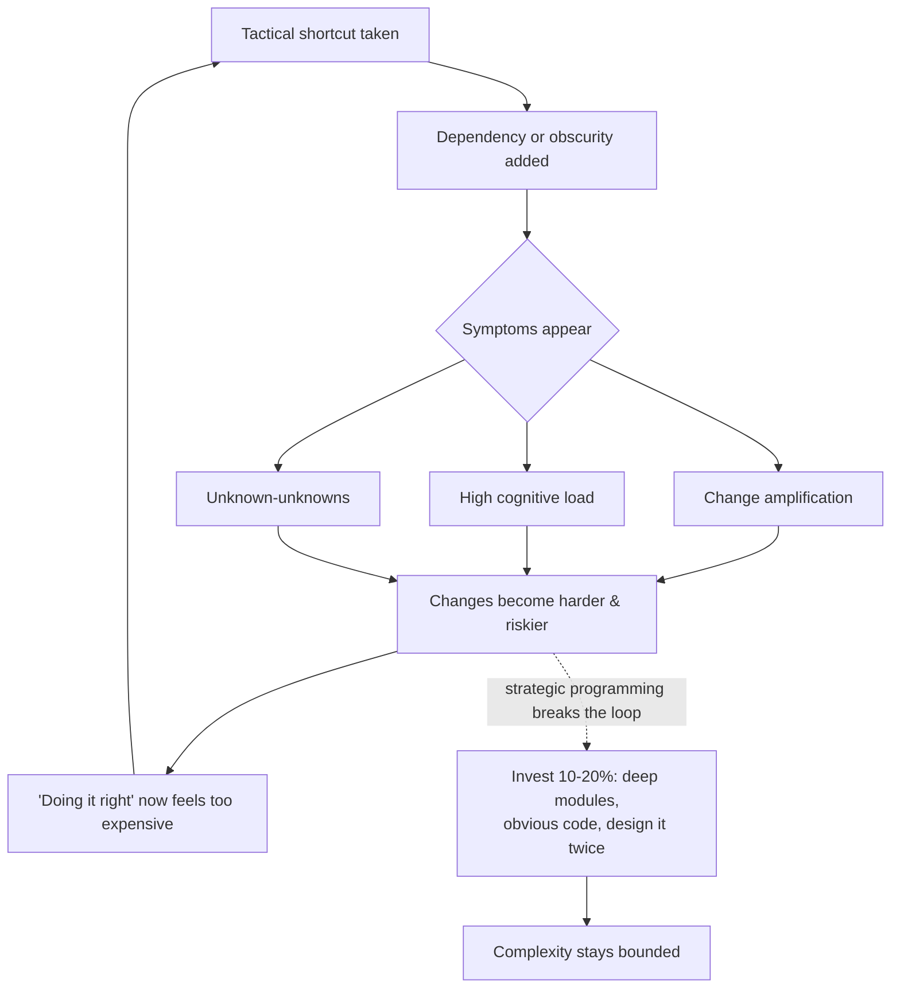

# Deep Modules & Complexity — Interview Questions

> 50+ questions across all skill levels (Junior → Staff). The vocabulary here is mostly John Ousterhout's *A Philosophy of Software Design*, cross-referenced with Brooks (*No Silver Bullet*) and Moseley & Marks (*Out of the Tar Pit*). Use as self-review or interview prep. Definitions matter — interviewers probe whether you can name a symptom *and* trace it to a cause.

---

## Table of Contents

- [Junior](#junior-level-14-questions)
- [Mid](#mid-level-14-questions)
- [Senior](#senior-level-12-questions)
- [Staff](#staff-level-10-questions)
- [Rapid-Fire](#rapid-fire)
- [Summary](#summary)
- [Further Reading](#further-reading)
- [Related Topics](#related-topics)

---

## Junior level (14 questions)

### J1. What is software complexity, in Ousterhout's definition?

Anything about the structure of a system that makes it **hard to understand or hard to modify**. It is defined by the experience of the reader/changer, not by the author. If the people working on a system find it easy to change, it is simple — even if it is large.

### J2. What are the three symptoms of complexity?

1. **Change amplification** — a simple conceptual change requires edits in many places.
2. **Cognitive load** — how much a developer must know to complete a task.
3. **Unknown-unknowns** — it is not obvious which code must change, or what knowledge is needed, to make a change correctly.

### J3. Which symptom is the worst, and why?

**Unknown-unknowns.** With the other two you at least know what you face: you can see the edits piling up, or feel the load. With unknown-unknowns you don't know what you don't know — you change something, it looks right, and it breaks production somewhere you never thought to look. The only cure is making the system *obvious*.

### J4. What are the two causes of complexity?

**Dependencies** and **obscurity**. Symptoms are what you feel; these two are what actually produce them. Every reduction in complexity ultimately reduces one of these.

### J5. Define a dependency in this context.

A dependency exists when a piece of code cannot be understood or modified in isolation — it only makes sense in relation to other code. Dependencies are unavoidable and often essential; the goal is to **reduce their number and make the ones that remain obvious**, not eliminate them.

### J6. Define obscurity.

Obscurity is when important information is **not obvious**. A misleading name, a magic constant, an undocumented dependency, state that must be set in a specific order with nothing saying so. Obscurity is the main cause of unknown-unknowns.

### J7. What is change amplification? Give an example.

One conceptual change forces edits in many places. Classic example: a hardcoded color or banner width copied into every page of a website. Changing the look means editing every file. The fix is to centralize the decision (one variable, one module) so the change touches one place.

### J8. What is cognitive load?

The amount a developer must hold in their head to get something done — APIs, side effects, global state, ordering rules, edge cases. More code is *not* automatically more cognitive load; sometimes more lines (clear, with good names) reduce it, while a clever one-liner raises it.

### J9. What is a deep module?

A module whose **interface is much simpler than its implementation** — a lot of functionality behind a small, simple interface. The Unix file I/O API (`open`, `read`, `write`, `close`, `lseek`) is the canonical example: five calls hide buffering, scheduling, device drivers, permissions. (Covered in depth in [Abstraction & Information Hiding](../22-abstraction-and-information-hiding/README.md).)

### J10. What is a shallow module?

One whose interface is nearly as complex as — or more complex than — its implementation. A method that just forwards to another method, or a class with many tiny methods each exposing internal detail. Shallow modules add interface cost without hiding much, so they don't pull their weight.

### J11. What is the difference between tactical and strategic programming?

- **Tactical:** the goal is to get the feature working as fast as possible. Design quality is secondary.
- **Strategic:** working code is not enough; the goal is a *clean design*, and you invest a little extra now to keep the system easy to change later.

### J12. What is a "tactical tornado"?

Ousterhout's term for a developer who churns out features at high speed by always taking the fastest shortcut, leaving a wake of complexity for everyone else. Management may love them ("so productive!"), but their teammates clean up after them and the system rots faster than it grows.

### J13. Is more code always more complex?

**No.** Complexity is about understanding and modification, not volume. A few extra lines that introduce a clear name, a guard clause, or an explanatory comment can *reduce* complexity. A dense, clever 3-liner with hidden assumptions can be far more complex than 15 obvious lines. (Trick question — see [T1](#t1-rapid-fire).)

### J14. Why does Ousterhout say "complexity is incremental"?

Because no single change makes a system complex. Complexity accumulates in tiny increments — one special case, one shortcut, one undocumented dependency at a time. That is what makes it dangerous: each step seems harmless, so there is never an obvious moment to say "stop." The defense is a zero-tolerance attitude toward small messes.

---

## Mid level (14 questions)

### M1. "It's just one special case" — why is this dangerous?

> **What the interviewer is checking:** whether you understand that complexity is death by a thousand cuts, not one bad decision.

Each special case is individually cheap and individually justified. But they compound: ten "harmless" special cases produce a method nobody can reason about, with branches whose interactions are untested. The discipline is to resist the *first* one — push the special case into the data, or eliminate it by generalizing the design, rather than bolting on an `if`.

### M2. Distinguish essential and accidental complexity (Brooks).

From *No Silver Bullet* (1986):

- **Essential complexity** is inherent in the problem itself — the irreducible difficulty of the domain. You cannot remove it; you can only model it well.
- **Accidental complexity** is introduced by our tools, languages, and design choices — it is *not* in the problem and *can* be removed.

The job of good design is to drive accidental complexity to zero so only the essential remains.

### M3. Why did Brooks argue there is "no silver bullet"?

Because past order-of-magnitude productivity gains (high-level languages, time-sharing, IDEs) attacked **accidental** complexity. Once accidental complexity is largely gone, what remains is **essential** complexity, which no tool can remove. Therefore no single technology will produce another 10× gain — the remaining difficulty is intrinsic to building software.

### M4. What does *Out of the Tar Pit* identify as the largest source of complexity?

**State** — specifically *mutable* state. Moseley & Marks (2006) argue the number of possible states explodes combinatorially, making systems impossible to reason about and test exhaustively. Their secondary culprit is **control** (explicit ordering/flow). Their prescribed cure: minimize state, prefer declarative descriptions, separate essential state/logic from accidental machinery.

### M5. How does that view relate to immutability and functional programming?

If state is the dominant complexity, then removing or constraining it directly attacks the root cause. Immutable data has no state-over-time to track; pure functions have no hidden state to reason about. This is why FP techniques reduce unknown-unknowns — there is simply less invisible state that a change could disturb. (See [refactoring techniques](../../refactoring/README.md) for state-reducing refactors.)

### M6. Why is the *fastest* solution often not the *simplest*?

> **What the interviewer is checking:** that you don't conflate "took the least time to write" with "least complex."

The fastest solution optimizes for time-to-working-code. The simplest optimizes for time-to-*understand-and-change*. These usually diverge: the quickest path adds a special case or a dependency that future readers pay for repeatedly. Simplicity is a property of the result; speed is a property of the act of writing. (Trick question — see [T4](#t4-rapid-fire).)

### M7. How do you reduce change amplification?

Centralize the knowledge that tends to change. Pull duplicated decisions into one place (a constant, a config, a single module) so a conceptual change maps to a single code change. Watch for "shotgun surgery" — the refactoring smell that *is* change amplification.

### M8. How do you reduce cognitive load?

Make modules deep (simple interfaces over complex internals), choose precise names, eliminate hidden state and special cases, and keep related information together so a reader doesn't have to gather context from five files. Crucially, prefer *general-purpose* interfaces — special-purpose ones force the caller to know more.

### M9. How do you reduce unknown-unknowns specifically?

Make the system **obvious**: good names, comments that document non-obvious dependencies and rationale, consistency (similar things look similar), and avoiding "non-obvious code." The test: a developer should be able to make a change with confidence that they have found everything affected.

### M10. What is "design it twice"?

Before committing to a design, sketch at least two genuinely different approaches and compare them. The first idea is rarely the best, and the act of comparing surfaces trade-offs you would otherwise miss. It costs little (you don't fully build both) and consistently produces better designs — even experienced engineers benefit.

### M11. A teammate says comments are a failure of self-documenting code. Respond.

Code can express *what* it does but rarely the *why*, the non-obvious dependencies, the rejected alternatives, or the contract that callers must honor. Those are exactly the obscurity-reducers that prevent unknown-unknowns. Self-documenting code handles the mechanics; comments carry the information that **cannot** be derived from reading the code. Both are needed.

### M12. How does complexity "compound"?

Two ways. First, dependencies multiply: each new dependency can interact with existing ones, so the reasoning burden grows super-linearly. Second, complexity makes further changes harder, which encourages *more* shortcuts (because doing it right is now expensive), which adds more complexity — a feedback loop. This is the mechanism behind "the system got bad so gradually no one noticed."

### M13. Is a shallow module ever justified?

Occasionally — e.g., a thin adapter that exists purely to satisfy a boundary (an interface seam for testing, an anti-corruption layer). The warning sign is *gratuitous* shallowness: classes split so small that the interface cost exceeds the hiding benefit ("classitis"). Depth is the default goal; shallowness needs a reason.

### M14. What's the relationship between this chapter and cognitive load / abstraction chapters?

They are three lenses on the same problem. [Cognitive Load](../20-cognitive-load/README.md) zooms in on the reader's working memory. [Abstraction & Information Hiding](../22-abstraction-and-information-hiding/README.md) is about *building* deep modules. This chapter zooms out to the **whole-system economics**: how complexity is diagnosed (symptoms), where it comes from (causes), and the mindset (strategic vs tactical) that governs whether it accumulates.

---

## Senior level (12 questions)

### S1. How would you measure complexity, and what's the catch?

> **What the interviewer is checking:** that you know the metrics *and* their limits — not someone who treats a number as truth.

Common metrics: cyclomatic complexity (decision points), cognitive complexity (Sonar — penalizes nesting), Halstead measures, lines of code, fan-in/fan-out, change coupling (files that change together). The catch: **none of them measures Ousterhout's definition** (hard to understand/modify), which is subjective and reader-dependent. Metrics are *proxies*. They are useful as trend indicators and gates on egregious cases, but a low cyclomatic score does not mean code is simple, and a high one does not always mean it is complex.

### S2. Walk through the metric-validity debate.

The honest position: complexity, as it actually hurts teams, is partly subjective — it depends on the reader's familiarity, the domain, and conventions. Metrics quantify *some* correlate of it (control-flow density, coupling), and studies show weak-to-moderate correlation with defect rates and maintenance cost. So metrics are defensible as **screening tools and trend lines**, indefensible as a definition of "good design." The mature view: instrument them, watch the direction, but never let a green dashboard substitute for the question "can a new engineer change this safely?"

### S3. Why is cognitive complexity often preferred over cyclomatic for maintainability gates?

Cyclomatic counts decision points but is blind to nesting — a flat `switch` with 10 cases scores the same as 10 deeply nested `if`s, though the latter is far harder to read. Cognitive complexity (Sonar's metric) penalizes nesting and rewards linear flow, so it tracks *human* difficulty better. Use cognitive for maintainability gates; cyclomatic still has a role in estimating the number of test paths.

### S4. A manager wants a single "complexity score" to gate merges. How do you advise?

Push back on a single hard gate as a *definition* of quality — it invites gaming (split methods to lower the number without lowering real complexity) and produces false confidence. Recommend: track several proxies as trends, gate only on extreme outliers, and pair metrics with human code review focused on the real questions (obvious? deep? few dependencies?). Use SonarQube baseline mode so a legacy codebase isn't flooded with day-one violations.

### S5. How does the tactical tornado damage a team beyond the code?

Three ways. (1) **Code rot** — they add complexity faster than others remove it. (2) **Incentive corruption** — if they're rewarded for visible output, others learn that careful work is punished, so the whole team goes tactical. (3) **Knowledge debt** — their shortcuts are full of unknown-unknowns, so every later change by anyone is riskier. The fix is cultural: make design quality a visible, rewarded part of "done."

### S6. Strategic programming costs more up front. How do you justify it?

Frame it as investment, not perfectionism. Ousterhout's rule of thumb: spend ~10–20% of development time on design improvement; it pays back because complexity compounds — every bit you prevent saves disproportionately later. The break-even is early: within the same project, tactical teams slow to a crawl as the system rots, while strategic teams keep a roughly constant pace. The mistake is treating "we'll clean it up later" as a real plan; later rarely comes.

### S7. How do you bring a tactical legacy codebase back toward strategic?

You can't stop and rewrite. Apply the **Boy Scout rule** plus targeted investment: every change leaves the touched code slightly better; reserve explicit budget for the worst **hotspots** (files that are both large and frequently changed — `size × churn`). Add characterization tests before refactoring untested code. Make depth and obviousness review criteria. The goal is to bend the curve, not erase the debt overnight.

### S8. What is a "non-obvious dependency," and why is it the most dangerous kind?

A dependency that exists but isn't visible from the code that depends on it — e.g., method B must be called only after A sets some field, but nothing in B's signature or name says so. It's dangerous because it's a textbook unknown-unknown: a future developer reorders calls, the type checker is silent, and it breaks subtly. Cures: encode the dependency in the type system or API where possible; document it explicitly where not.

### S9. How does complexity relate to the "pull complexity downward" principle?

When you face an unavoidable bit of complexity, it's better for the *module* to absorb it than to push it up to every caller. A module is written once and used many times, so internal complexity is paid once while interface complexity is paid by every user. This is the same idea as deep modules: a simple interface even at the cost of a more complex implementation.

### S10. Essential vs accidental — give a concrete code-level example of each.

**Essential:** a tax calculation that genuinely has 14 jurisdiction rules — the domain *is* that complicated; the best design models the 14 rules clearly. **Accidental:** that same calculation tangled with retry logic, JSON parsing, and thread-pool management in one method. The retry/parsing/threading aren't part of "calculate tax" — they're accidental complexity to be separated out (into deep modules), leaving only the essential rules.

### S11. How would you detect change amplification in a codebase before it bites?

Mine version-control history for **change coupling**: sets of files that are repeatedly committed together but live in different modules. High co-change between supposedly independent files is the signature of a centralization failure. Tools like CodeScene compute this. It surfaces amplification that static metrics miss entirely.

### S12. Reconcile "complexity is subjective" with the need for objective engineering practice.

Subjective doesn't mean arbitrary. The *experience* of complexity varies by reader, but its *causes* (dependencies, obscurity) are concrete and inspectable, and its *symptoms* (amplification, load, unknown-unknowns) leave measurable traces (co-change, defect density, time-to-onboard). So you engineer against the causes and instrument the symptoms, while accepting that the final arbiter — "can a competent engineer change this confidently?" — is a human judgment best made in review.

---

## Staff level (10 questions)

### St1. Map Ousterhout's symptoms onto organizational/architectural scale.

- **Change amplification → distributed monolith:** one business change touching seven services in lockstep.
- **Cognitive load → no service can be understood without a tribal-knowledge map.**
- **Unknown-unknowns → "we don't know what depends on this service, so we're scared to change it."**

The same three symptoms diagnose a microservice estate as diagnose a method. The cure also rhymes: deep services (simple contracts, rich internals), centralized ownership of changeable decisions, and obvious, documented dependencies.

### St2. Is the "fast solution = simple solution" fallacy ever true?

> **What the interviewer is checking:** nuance — that you won't dogmatically over-engineer.

Sometimes the fastest solution *is* the simplest: for a throwaway script, a one-off migration, or a hypothesis you'll discard in a week, the cheap direct route carries no future cost because there is no future. The fallacy is applying "ship the fastest thing" to code that will live and be changed. Staff judgment is knowing which world you're in — and being honest that most code outlives its author's estimate.

### St3. How do you decide how much to invest in design for a given component?

Tie investment to **expected change and blast radius**. Core domain modules that many things depend on and that change often warrant heavy strategic investment. Leaf code that's stable or rarely touched warrants less. This is just essential-vs-accidental applied economically: spend where complexity compounds, not uniformly. A staff engineer makes this explicit rather than gold-plating everything.

### St4. Critique: "We'll measure complexity with cyclomatic complexity and fail any PR over 10."

It's better than nothing but flawed: (1) it's gameable — split a method into two shallow ones and the score drops while real complexity (now spread across an awkward interface) rises; (2) it ignores nesting, naming, hidden state, and dependencies, which dominate real difficulty; (3) hard per-method gates miss whole-class and cross-module complexity. Better: trend the metric, gate only egregious outliers, prefer cognitive complexity, and rely on review for the qualities no metric captures.

### St5. How does state-as-complexity (*Tar Pit*) inform a system architecture decision?

It argues for shrinking the *amount* and *reach* of mutable state. Practically: prefer immutable events and derived views (event sourcing / CQRS) over many services mutating shared rows; isolate the unavoidable state into well-guarded modules; make as much of the system as possible pure transformations of inputs. Each design choice that removes a mutable state path removes a combinatorial chunk of states you'd otherwise have to reason about and test.

### St6. Strategic programming vs YAGNI — don't they conflict?

No — they target different things. YAGNI says don't build *features/abstractions* for hypothetical future requirements. Strategic programming says keep the *design* clean for the requirements you do have. You can be strict YAGNI on speculative generality while still investing in obvious names, deep modules, and low coupling. Confusing the two leads either to over-engineering (calling speculation "strategic") or to mess (calling laziness "YAGNI").

### St7. How do you make "design it twice" work in a real team under deadline pressure?

Lightweight and time-boxed: for any non-trivial design, require a short doc (or whiteboard) sketching ≥2 approaches with trade-offs, reviewed in 30 minutes before code is written. The cost is an hour; the saving is weeks of building the wrong thing. Normalize it so proposing an alternative isn't seen as criticism. The failure mode is teams that treat the first whiteboard sketch as final.

### St8. Defend the claim that comments reduce complexity, against a "comments rot" objection.

Comments *can* rot, but the conclusion "therefore avoid them" is wrong — it throws away the only mechanism for recording non-derivable information (why, contracts, non-obvious dependencies). The right response to rot is the same as for code: keep comments close to what they describe, review them in PRs, and delete comments that merely restate the code. The information that prevents unknown-unknowns is worth maintaining.

### St9. A complexity dashboard is all green but engineers say the code is painful. What's happening, and what do you do?

Goodhart's law plus the metric-validity gap: the team optimized the proxies (low cyclomatic, high coverage) while real complexity — bad names, hidden state, non-obvious dependencies, shallow over-decomposition — went unmeasured. Diagnose with *human* signals: time-to-onboard, PR review friction, change-failure rate, and developer survey. Then attack causes the dashboard can't see. The lesson: dashboards detect a subset of complexity; absence of red is not presence of simplicity.

### St10. How do you build a culture that keeps complexity down long-term?

Make design quality part of the definition of done and a first-class review criterion (is it deep? obvious? few dependencies?). Reward the people who *remove* complexity, not just those who add features — neutralize the tactical-tornado incentive. Allocate standing time (the ~10–20%) for design and hotspot cleanup. Instrument symptom-proxies as trends, not gates. And model it: senior engineers who take shortcuts teach everyone that shortcuts are fine.

---

## Rapid-Fire

### T1. (Rapid-Fire) Is more code always more complex?

**No.** Complexity is hardness-to-understand-and-change, not line count. Clarifying lines can lower it; clever density can raise it.

### T2. (Rapid-Fire) Can you measure complexity objectively?

**Not fully.** You can measure proxies (cyclomatic, cognitive, coupling, churn) objectively, but the thing they proxy is partly subjective. Treat metrics as trends and screens, never as the definition.

### T3. (Rapid-Fire) Which complexity symptom is scariest?

**Unknown-unknowns** — you can't see them coming, and the only defense is making the system obvious.

### T4. (Rapid-Fire) Is the fastest solution the simplest?

**Usually not.** Fastest optimizes writing time; simplest optimizes future understanding and change. They coincide only for throwaway code.

### T5. (Rapid-Fire) Can a single bad decision make a system complex?

**Rarely.** Complexity is incremental — it accumulates from many small "harmless" additions. That's why zero-tolerance for small messes matters.

### T6. (Rapid-Fire) Are dependencies bad?

**No** — they're unavoidable and often essential. The goal is fewer of them and the survivors made obvious, not zero.

### T7. (Rapid-Fire) Deep or shallow — which is the default goal?

**Deep.** Simple interface, substantial hidden implementation. Shallowness needs a justification.

### T8. (Rapid-Fire) Brooks: can a tool remove essential complexity?

**No.** Tools attack accidental complexity. Essential complexity is intrinsic to the problem and stays.

### T9. (Rapid-Fire) *Out of the Tar Pit*'s number-one villain?

**Mutable state.**

### T10. (Rapid-Fire) "We'll clean it up later." Verdict?

**Almost always a myth.** Later is when complexity has compounded and cleanup is most expensive. Strategic programming front-loads the small, cheap investment.

---

## The complexity feedback loop

---

## Summary

| Concept | One-line takeaway |
|---|---|
| **Definition** | Complexity = hard to understand or change; defined by the reader, not the author. |
| **Symptoms** | Change amplification, cognitive load, unknown-unknowns (the worst). |
| **Causes** | Dependencies and obscurity — fix these to fix the symptoms. |
| **Incremental** | Complexity accrues one "harmless" special case at a time; zero-tolerance is the defense. |
| **Tactical vs strategic** | Tactical = fastest working code; strategic = invest ~10–20% to keep design clean. |
| **Tactical tornado** | High visible output, high hidden cost; a cultural problem as much as a coding one. |
| **Essential vs accidental** (Brooks) | Essential is intrinsic and irreducible; accidental is ours to remove. No silver bullet. |
| **State** (*Tar Pit*) | Mutable state is the largest complexity source; minimize and isolate it. |
| **Deep vs shallow modules** | Deep = simple interface over rich internals; the default goal. |
| **Design it twice** | Compare ≥2 designs; the first idea is rarely the best; cheap insurance. |
| **Measuring** | Metrics are proxies and trend lines, never a definition of good design. |

---

## Further Reading

- John Ousterhout — *A Philosophy of Software Design* (the source for symptoms, causes, tactical/strategic, deep modules, design-it-twice).
- Frederick P. Brooks — *No Silver Bullet: Essence and Accidents of Software Engineering* (1986).
- Ben Moseley & Peter Marks — *Out of the Tar Pit* (2006) — state as the dominant complexity.
- Fred Brooks — *The Mythical Man-Month* (anniversary edition includes *No Silver Bullet*).
- G. Ann Campbell — *Cognitive Complexity* (SonarSource white paper).

---

## Related Topics

- [Deep Modules & Complexity — README](../README.md)
- [Junior notes](junior.md) · [Professional notes](professional.md)
- [Abstraction & Information Hiding](../22-abstraction-and-information-hiding/README.md) — building deep modules.
- [Cognitive Load](../20-cognitive-load/README.md) — the reader's working-memory cost.
- [Refactoring](../../refactoring/README.md) — techniques that remove accidental complexity and reduce state.
