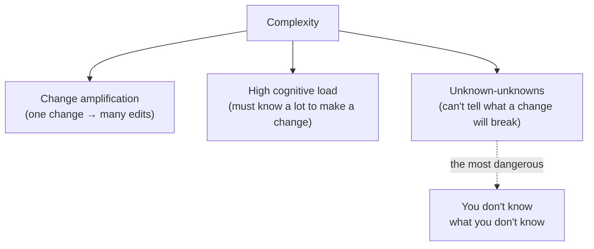
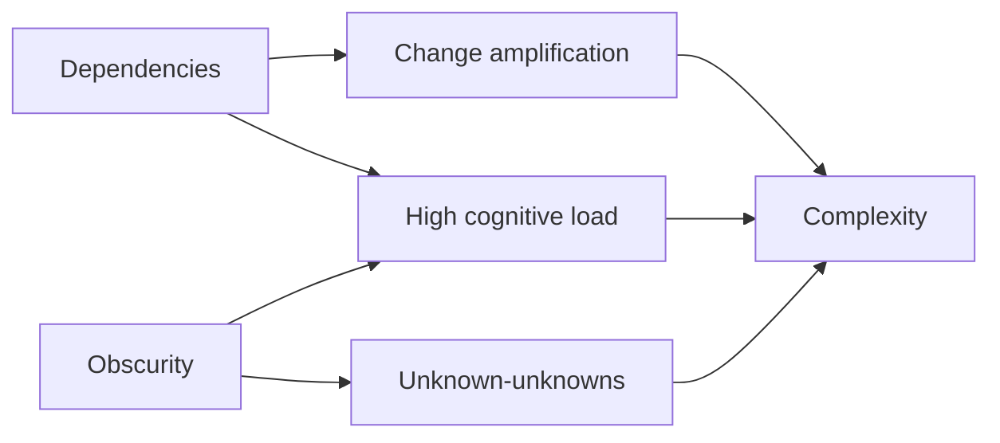
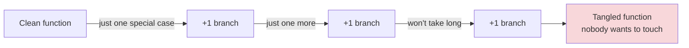

# Deep Modules & Complexity — Junior Level

> **Level:** Junior — "What's the rule? What's a clean example?"
> **Source:** John Ousterhout, *A Philosophy of Software Design* (the chapters on the nature of complexity and tactical-vs-strategic programming).
> **Scope:** This chapter is about **complexity itself** — what it is, how to *see* it, what *causes* it, and the daily choice that lets it grow or keeps it down. It is *not* a how-to for building deep modules — that lives in [Abstraction & Information Hiding](../22-abstraction-and-information-hiding/README.md). Here we learn to *diagnose*; there you learn to *cure*.

---

## Table of Contents

1. [What is complexity?](#what-is-complexity)
2. [Real-world analogy](#real-world-analogy)
3. [The three symptoms of complexity](#the-three-symptoms-of-complexity)
4. [Symptom 1 — Change amplification](#symptom-1--change-amplification)
5. [Symptom 2 — High cognitive load](#symptom-2--high-cognitive-load)
6. [Symptom 3 — Unknown-unknowns](#symptom-3--unknown-unknowns)
7. [The two causes of complexity](#the-two-causes-of-complexity)
8. [Cause A — Dependencies](#cause-a--dependencies)
9. [Cause B — Obscurity](#cause-b--obscurity)
10. [Complexity is incremental](#complexity-is-incremental)
11. [Tactical vs strategic programming](#tactical-vs-strategic-programming)
12. [Common Mistakes](#common-mistakes)
13. [Test Yourself](#test-yourself)
14. [Cheat Sheet](#cheat-sheet)
15. [Summary](#summary)
16. [Further Reading](#further-reading)
17. [Related Topics](#related-topics)

---

## What is complexity?

Ousterhout gives complexity a precise, working definition:

> **Complexity is anything related to the structure of a software system that makes it hard to understand and modify.**

Three things follow from that definition, and they are the backbone of this whole chapter:

- Complexity is about **the experience of working with code**, not about how clever the code is. A "simple" algorithm wrapped in a confusing interface is complex. A sophisticated algorithm behind a clear interface is *not*.
- Complexity is what **readers and editors** feel, not what the **author** feels. The author wrote it, so it feels obvious to them. The cost is paid later, by someone else (often future-you).
- Complexity is **measured by symptoms**, not by a gut feeling. If you can't point to a symptom, you can't argue that something is complex — and you can't justify cleaning it up. Learning the three symptoms is how you turn "this feels messy" into "this causes change amplification, here's the evidence."

The most important reframe at the junior level: **complexity is not a single big mistake. It is the sum of thousands of small ones.** Nobody designs a complex system on purpose. It grows, one "harmless" shortcut at a time. That is why fighting it is a *daily habit*, not a *project you schedule for next quarter*.

> **Key idea:** You cannot eliminate complexity by being smart in one heroic refactor. You keep it down by making slightly-better choices, thousands of times, every day.

---

## Real-world analogy

### The tangled headphone drawer

You have a drawer for cables. The first week, there is one charger in it. Easy: open drawer, grab charger, done.

Over a year, you toss in: a second charger, earbuds, an HDMI cable, a USB hub, three adapters, a tangle of zip-ties, a dead battery. You never *decided* to make a mess. Each addition was "just one more thing, I'll sort it later."

Now watch the three symptoms appear:

- **Change amplification:** you want to add a new cable, but first you have to untangle three others to make room.
- **High cognitive load:** to find the HDMI cable you must remember which corner you "usually" put it in, and that it looks like the DisplayPort one.
- **Unknown-unknowns:** you pull one cable and two others come with it, knocking the dead battery onto the floor. You had no way to know that would happen.

The fix is *not* "buy a bigger drawer" (more capacity hides the problem). The fix is **dividers + labels** — small, named compartments where each cable has an obvious home. That is exactly what good module boundaries and good names do for code.

### A 400-line `processOrder()` you inherited

Three years ago it was 30 clean lines. Today it is 400. No single engineer wrote 400 lines — each added "just one special case." Now changing the tax rule means reading the whole thing (cognitive load), editing tax logic that is copy-pasted in three places (change amplification), and hoping you didn't break the shipping calculation that secretly depends on a variable the tax code mutates (unknown-unknowns). All three symptoms, one method.

---

## The three symptoms of complexity

When complexity is present, it shows up as one or more of three observable symptoms. Memorize these — they are your diagnostic vocabulary.



| Symptom | The question it answers | Why it hurts |
|---|---|---|
| **Change amplification** | "How many places must I edit for one logical change?" | Wasted effort; easy to miss a spot. |
| **High cognitive load** | "How much must I learn before I can safely change this?" | Slow onboarding; slow everything. |
| **Unknown-unknowns** | "Can I even tell which code my change affects?" | The worst — you ship a bug you had no way to predict. |

Ousterhout calls unknown-unknowns the most dangerous, because the other two are at least *visible*: you can see that you're editing five files, you can feel that you're confused. With unknown-unknowns, **everything looks fine** right up until production breaks.

---

## Symptom 1 — Change amplification

**Definition:** a single conceptual change requires modifications in many different places.

The classic example: a magic number or rule duplicated across the code. Changing it "once" actually means changing it N times — and the bug is the one you forgot.

### Go — before (change amplification)

```go
package billing

// The tax rate 0.0875 is duplicated in every function that needs it.
func PriceWithTax(amount float64) float64 {
    return amount + amount*0.0875
}

func InvoiceTotal(lineItems []float64) float64 {
    var sum float64
    for _, item := range lineItems {
        sum += item
    }
    return sum + sum*0.0875 // same rate, copied
}

func EstimateShippingTax(shipping float64) float64 {
    return shipping * 0.0875 // copied again
}
```

When the tax rate changes to 9%, you must find and edit **three** call sites. Miss one and your invoices silently disagree with your estimates.

### Go — after (one place to change)

```go
package billing

const taxRate = 0.0875 // ONE place. Change it here, everything follows.

func PriceWithTax(amount float64) float64 {
    return amount + amount*taxRate
}

func InvoiceTotal(lineItems []float64) float64 {
    var sum float64
    for _, item := range lineItems {
        sum += item
    }
    return sum + sum*taxRate
}

func EstimateShippingTax(shipping float64) float64 {
    return shipping * taxRate
}
```

One logical change ("the tax rate") is now one physical edit. The amplification is gone.

### Java — before and after

```java
// BEFORE — the discount threshold "100" is scattered
class Cart {
    double shippingFor(double subtotal) {
        return subtotal > 100 ? 0 : 9.99;
    }
    boolean qualifiesForGift(double subtotal) {
        return subtotal > 100; // same threshold, restated
    }
    String banner(double subtotal) {
        return subtotal > 100 ? "Free shipping!" : "Spend more for free shipping";
    }
}

// AFTER — the rule lives in one named place
class Cart {
    private static final double FREE_SHIPPING_THRESHOLD = 100;

    boolean qualifiesForFreeShipping(double subtotal) {
        return subtotal >= FREE_SHIPPING_THRESHOLD;
    }
    double shippingFor(double subtotal) {
        return qualifiesForFreeShipping(subtotal) ? 0 : 9.99;
    }
    boolean qualifiesForGift(double subtotal) {
        return qualifiesForFreeShipping(subtotal);
    }
    String banner(double subtotal) {
        return qualifiesForFreeShipping(subtotal)
            ? "Free shipping!" : "Spend more for free shipping";
    }
}
```

Notice the *strategic* bonus: by naming the rule `qualifiesForFreeShipping`, we also removed the bug where one place used `>` and another used `>=`. Centralizing forces consistency.

### Python — before and after

```python
# BEFORE — currency formatting repeated; each spot can drift
def receipt_line(name, cents):
    return f"{name}: ${cents / 100:.2f}"

def total_line(cents):
    return f"Total: ${cents/100:0.2f}"  # subtly different format string

def refund_line(cents):
    return f"Refund: $ {cents / 100}"   # and this one is just wrong


# AFTER — one formatter, one truth
def format_money(cents: int) -> str:
    return f"${cents / 100:.2f}"

def receipt_line(name: str, cents: int) -> str:
    return f"{name}: {format_money(cents)}"

def total_line(cents: int) -> str:
    return f"Total: {format_money(cents)}"

def refund_line(cents: int) -> str:
    return f"Refund: {format_money(cents)}"
```

> **Rule:** A single decision (a rate, a threshold, a format, a rule) should have a single home. If you copy a decision, you have copied a future bug. This overlaps heavily with the [DRY principle](../../refactoring/README.md) — but the *reason* DRY matters is precisely change amplification.

---

## Symptom 2 — High cognitive load

**Definition:** how much a developer needs to know in their head to complete a task. The more facts you must hold to make a small change safely, the higher the load.

Cognitive load is *not* the same as lines of code. A long, repetitive function can have low load (you understand line 5, you understand all 500). A short, tricky function with hidden assumptions can have crushing load.

### Java — before (high load: caller must know hidden rules)

```java
// To call this correctly you must KNOW, from nowhere in the signature:
//  - timeout is in MILLISECONDS (not seconds)
//  - -1 means "no timeout" (but 0 means "fail immediately")
//  - you MUST call close() yourself or you leak a socket
//  - retries does nothing unless timeout > 0
class Client {
    Socket connect(String host, int port, int timeout, int retries) { ... }
}

client.connect("db", 5432, 5000, 3); // is 5000 ms? s? what's a sane retry count?
```

The signature hides four facts the caller must carry in their head. That is high cognitive load — and it's invisible until someone passes `5` thinking it's seconds.

### Java — after (the type and defaults carry the knowledge)

```java
class Client implements AutoCloseable {        // try-with-resources closes it for you
    Socket connect(String host, int port, Duration timeout) { ... }
    Socket connect(String host, int port) {     // sensible default, no magic -1
        return connect(host, port, Duration.ofSeconds(30));
    }
    public void close() { ... }
}

try (Client client = new Client()) {
    client.connect("db", 5432, Duration.ofSeconds(5)); // unit is unmistakable
}
```

`Duration` makes the unit impossible to get wrong. `AutoCloseable` removes the "remember to close" rule. The default overload removes the "what's `-1` mean" rule. Each removed rule is one less thing the caller must *know*.

### Python — before and after

```python
# BEFORE — to use this you must know that:
#   status 0=pending, 1=paid, 2=shipped, 3=cancelled (where is that written? nowhere)
#   you must set updated_at yourself or reports break
def update_order(order, status):
    order["status"] = status

update_order(o, 2)  # 2 means... shipped? you have to go read the DB schema


# AFTER — an enum names the values; the function enforces the invariant
from enum import IntEnum
from datetime import datetime, timezone

class OrderStatus(IntEnum):
    PENDING = 0
    PAID = 1
    SHIPPED = 2
    CANCELLED = 3

def update_order(order: dict, status: OrderStatus) -> None:
    order["status"] = status
    order["updated_at"] = datetime.now(timezone.utc)  # invariant guaranteed here

update_order(o, OrderStatus.SHIPPED)  # nothing to memorize, nothing to forget
```

### Go — before and after

```go
// BEFORE — the boolean parameters are a memory test at every call site
func SendEmail(to, subject, body string, html, urgent, retry bool) error { ... }

SendEmail("a@b.com", "Hi", "...", true, false, true) // which bool is which?

// AFTER — a named options struct; the caller reads, doesn't memorize
type EmailOptions struct {
    HTML   bool
    Urgent bool
    Retry  bool
}

func SendEmail(to, subject, body string, opts EmailOptions) error { ... }

SendEmail("a@b.com", "Hi", "...", EmailOptions{HTML: true, Retry: true})
```

> **Rule:** Every fact a caller *must know but cannot see in the signature* is cognitive load. Push that knowledge into types, names, defaults, and the function body so the caller has nothing to memorize.

---

## Symptom 3 — Unknown-unknowns

**Definition:** there is no obvious way to know *which* code you must change for a task, or *what* a change will affect. You don't know what you don't know.

This is the most dangerous symptom because **the code looks fine**. You make a reasonable-looking change, all the tests you thought of pass, and three weeks later a feature you'd never heard of breaks in production.

### Python — before (a hidden, action-at-a-distance dependency)

```python
# config.py
SETTINGS = {"currency": "USD"}

# pricing.py
import config
def format_price(amount):
    symbol = "$" if config.SETTINGS["currency"] == "USD" else "?"
    return f"{symbol}{amount:.2f}"

# admin.py — a junior adds a "switch to euros" feature
import config
def switch_to_euros():
    config.SETTINGS["currency"] = "EUR"   # looks harmless and local
```

Calling `switch_to_euros()` silently changes how *every price in the entire app* renders — and turns the symbol into `?` because `format_price` only handles `"USD"`. Nothing in `switch_to_euros` hints that it affects `pricing.py`. There was **no obvious way** to know. That is an unknown-unknown.

### Python — after (make the dependency explicit and total)

```python
# money.py — the dependency is now visible and the cases are exhaustive
from dataclasses import dataclass

SYMBOLS = {"USD": "$", "EUR": "€", "GBP": "£"}

@dataclass(frozen=True)
class Currency:
    code: str
    def symbol(self) -> str:
        try:
            return SYMBOLS[self.code]
        except KeyError:
            raise ValueError(f"Unsupported currency: {self.code}")

def format_price(amount: float, currency: Currency) -> str:
    return f"{currency.symbol()}{amount:.2f}"   # currency arrives EXPLICITLY
```

Now currency is a *parameter*, not hidden global state. To change a price's currency you change the argument at the one call site you intend — there is no spooky action at a distance. And a new currency that isn't supported fails loudly instead of silently printing `?`.

### Go — reducing unknown-unknowns with explicit, total handling

```go
// BEFORE — default branch silently swallows new cases.
// Add a "PARTIAL_REFUND" status later and this returns "" with no warning.
func label(status string) string {
    switch status {
    case "paid":
        return "Paid"
    case "shipped":
        return "Shipped"
    default:
        return "" // unknown-unknown: what statuses end up here? who knows?
    }
}

// AFTER — explicit error makes "I forgot a case" impossible to miss.
func label(status Status) (string, error) {
    switch status {
    case StatusPaid:
        return "Paid", nil
    case StatusShipped:
        return "Shipped", nil
    default:
        return "", fmt.Errorf("unhandled status %q — update label()", status)
    }
}
```

> **Rule:** Prefer code where a change's effects are *visible at the change site*. Explicit parameters beat hidden globals; loud failures beat silent defaults; exhaustive handling beats catch-all branches. Each one converts an unknown-unknown into a known.

---

## The two causes of complexity

The three symptoms are *what you feel*. Ousterhout traces them to exactly **two root causes**:



| Cause | One-line definition | Mainly produces |
|---|---|---|
| **Dependencies** | When code A can't be understood or changed without also understanding/changing code B. | Change amplification, cognitive load |
| **Obscurity** | When important information is not obvious — undocumented, non-local, or misnamed. | Cognitive load, unknown-unknowns |

If you can reduce dependencies and reduce obscurity, you reduce complexity. Everything else in this chapter is a tactic in service of those two.

---

## Cause A — Dependencies

A **dependency** exists when a piece of code cannot be understood or modified in isolation — changing one thing forces you to also touch (or at least understand) another. Some dependencies are necessary (a function depends on its inputs). The problem is *unnecessary* or *hidden* dependencies, and **dependency creep** — them quietly multiplying.

### Go — before (creeping, hidden dependency between two functions)

```go
// parseConfig must run BEFORE validateConfig, because parseConfig sets a
// package-level `loaded` flag that validateConfig secretly reads. This ordering
// rule is written nowhere. Call them in the wrong order → wrong behavior.
var loaded bool
var cfg map[string]string

func parseConfig(raw string) {
    cfg = parse(raw)
    loaded = true
}

func validateConfig() error {
    if !loaded {
        return errors.New("not loaded") // hidden temporal dependency
    }
    // ...
    return nil
}
```

### Go — after (pass the data; the dependency becomes obvious and enforced)

```go
type Config struct{ values map[string]string }

func ParseConfig(raw string) (Config, error) {
    return Config{values: parse(raw)}, nil
}

// You literally cannot call Validate without a parsed Config in hand.
// The compiler enforces the ordering that used to be a tribal rule.
func (c Config) Validate() error {
    // ...
    return nil
}
```

The dependency didn't disappear (validation *does* depend on parsing). But it went from **hidden and order-sensitive** to **explicit and compiler-enforced**. That is the goal: make necessary dependencies visible, and delete unnecessary ones.

### Python — reducing dependency surface

```python
# BEFORE — every function reaches into the global `db`, so all of them depend
# on db being initialized first, in the right module, at import time.
db = None

def save_user(u): db.insert("users", u)      # depends on global init order
def load_user(i): return db.find("users", i)  # depends on global init order

# AFTER — the dependency is passed in. Each function is understandable alone,
# and tests can hand it a fake. No hidden init-order requirement.
class UserRepo:
    def __init__(self, db):
        self._db = db
    def save(self, u): self._db.insert("users", u)
    def load(self, i): return self._db.find("users", i)
```

> **Rule:** Make dependencies *explicit* (parameters, return values, types) rather than *implicit* (globals, ordering rules, shared mutable state). The deeper version of this — designing modules so they barely depend on each other at all — is the subject of [Abstraction & Information Hiding](../22-abstraction-and-information-hiding/README.md).

---

## Cause B — Obscurity

**Obscurity** is when important information is not obvious. The three flavors you'll meet as a junior:

1. **Bad names** — a name that lies, or says nothing (`data`, `tmp`, `flag`, `mgr`, `process()`).
2. **Non-local information** — to understand line 10 you must know a fact established in another file (a hidden default, a magic value, an init-order rule).
3. **Undocumented assumptions** — an invariant the code relies on but never states ("this list is always sorted", "callers already validated the email").

Obscurity is the main feeder of **unknown-unknowns**: if a crucial fact isn't obvious, you can't know you needed it.

### Java — before (obscurity: misleading name + undocumented assumption)

```java
// What does "check" return? What's the assumption? Nothing tells you.
boolean check(List<User> users) {
    return users.get(0).isActive();   // assumes list is non-empty AND sorted by signup
}
```

### Java — after (name states intent; assumption is stated and enforced)

```java
/**
 * Returns true if the earliest-registered user is currently active.
 * @param usersBySignupDate non-empty, sorted ascending by signup date.
 */
boolean isFoundingUserActive(List<User> usersBySignupDate) {
    if (usersBySignupDate.isEmpty()) {
        throw new IllegalArgumentException("expected at least one user");
    }
    return usersBySignupDate.get(0).isActive();
}
```

The name now tells you *what* and the doc + guard tell you *the assumption*. The obscurity is gone: nothing critical is left to be guessed.

### Python — before and after (non-local magic value)

```python
# BEFORE — what is 86400? a reader must leave this code to find out.
def is_expired(token):
    return time.time() - token.created_at > 86400

# AFTER — the constant names itself; the fact is local.
SESSION_LIFETIME_SECONDS = 24 * 60 * 60  # 1 day

def is_expired(token) -> bool:
    return time.time() - token.created_at > SESSION_LIFETIME_SECONDS
```

### Go — before and after (a name that says nothing)

```go
// BEFORE
func proc(d []byte) ([]byte, error) { ... } // proc what? d of what?

// AFTER
func decompressGzip(payload []byte) ([]byte, error) { ... }
```

> **Rule:** If understanding a line requires a fact that isn't *right there or one well-named hop away*, that fact is obscure. Fix it with a precise name, a local constant, or a one-line comment stating the assumption. The detailed treatment of why obscurity drains the reader's working memory is in [Cognitive Load](../20-cognitive-load/README.md).

---

## Complexity is incremental

This is the single most important idea in the chapter, so it gets its own section.

> **Complexity isn't caused by one catastrophic decision. It accumulates from many small chunks — each one too tiny to seem worth worrying about.**

This is why complexity is so hard to fight: at no point does anyone make an obviously-bad call. Each step is a perfectly reasonable "it's just one special case." The danger is the *aggregate*.

### Watch it accrete

```python
# Day 1 — clean, one clear job.
def greet(user):
    return f"Hello, {user.name}!"

# Day 8 — "it's just one special case" for admins.
def greet(user):
    if user.is_admin:
        return f"Hello, Administrator {user.name}!"
    return f"Hello, {user.name}!"

# Day 20 — "just one more" for the holidays.
def greet(user):
    if user.is_admin:
        return f"Hello, Administrator {user.name}!"
    if is_holiday():                       # hidden non-local dependency on a calendar
        return f"Happy holidays, {user.name}!"
    return f"Hello, {user.name}!"

# Day 40 — locale, banned users, A/B test... each "harmless" addition.
def greet(user):
    if user.is_banned:
        return ""                          # silent empty string — unknown-unknown waiting to happen
    if user.is_admin:
        return f"Hello, Administrator {user.name}!"
    if is_holiday():
        return f"Happy holidays, {user.name}!"
    if user.locale == "es":
        return f"¡Hola, {user.name}!"
    if ab_test_bucket(user) == "B":        # now depends on the experiment system too
        return f"Hey {user.name} 👋"
    return f"Hello, {user.name}!"
```

No single edit was wrong. But `greet` now mixes greeting, authorization, calendar logic, localization, and experimentation — five concerns and three hidden dependencies, accreted one "harmless" line at a time. This is **incremental complexity**, and the person paying for it is whoever touches `greet` next.

The defense is a mindset: treat each small addition as if it *will* be the one that tips the balance. Ask "is there a cleaner shape that absorbs this case?" before you reach for `if user.is_whatever`.



---

## Tactical vs strategic programming

Ousterhout frames the daily choice as two mindsets:

| | **Tactical programming** | **Strategic programming** |
|---|---|---|
| **Goal** | Get this feature working *now*. | Produce a *good design*; working code is a by-product. |
| **Attitude to complexity** | Acceptable, if it ships faster today. | A cost to actively minimize. |
| **Investment** | Zero. Take the shortest path. | Small, continuous (~10–20% extra effort). |
| **Result over time** | Complexity compounds; the team slows down. | Complexity stays flat; the team stays fast. |

The **tactical tornado** is the cautionary character: the developer who produces features at blazing speed by always taking the fastest shortcut, leaving a wake of complexity that everyone else must clean up. Management may even reward them — until the system grinds to a halt.

The key insight is that **strategic programming is not "stop and rewrite everything."** It is a *small, continuous investment*: spend a little extra time now — better names, one less dependency, fix the broken window you just noticed — so the system stays cheap to change. Tactical programming feels faster but is a loan with brutal interest.

### A concrete strategic micro-investment

```go
// TACTICAL — works, ships in 30 seconds, leaves a landmine.
// The "-1 means unlimited" rule is undocumented; the magic 3 is unexplained.
func fetch(url string, retries int) ([]byte, error) {
    for i := 0; i <= retries || retries == -1; i++ {
        b, err := get(url)
        if err == nil {
            return b, nil
        }
    }
    return nil, errors.New("failed")
}

// STRATEGIC — ~2 extra minutes now, removes future cognitive load & a silent-loop bug.
const defaultRetries = 3

// Fetch retries the GET up to maxRetries times (use UnlimitedRetries for no cap).
// It returns the last underlying error so callers can see WHY it failed.
const UnlimitedRetries = -1

func Fetch(url string, maxRetries int) ([]byte, error) {
    var lastErr error
    for attempt := 0; maxRetries == UnlimitedRetries || attempt <= maxRetries; attempt++ {
        b, err := get(url)
        if err == nil {
            return b, nil
        }
        lastErr = err
    }
    return nil, fmt.Errorf("fetch %s failed after retries: %w", url, lastErr)
}
```

The strategic version cost a couple of minutes: a named constant for the magic `-1`, a doc comment for the contract, and wrapping the real error instead of discarding it. Every future reader and debugger is repaid that time many times over. That is the whole game: **many small strategic investments keep complexity flat.**

> **Junior takeaway:** You will not always have time for the perfect design. But you can almost always afford the *small* investment: a good name, one fewer dependency, a one-line comment stating an assumption. Default to strategic; reserve tactical for genuine emergencies, and pay the debt back soon.

---

## Common Mistakes

| # | Anti-pattern | What it looks like | The fix |
|---|---|---|---|
| 1 | **Tactical tornado** | "I shipped 5 features this week!" — and left 5 messes. | Default to strategic; measure value by *maintainability*, not just velocity. |
| 2 | **Change amplification** | One rule copy-pasted across many files. | Give every decision a single home (constant, function, type). |
| 3 | **High cognitive load** | Callers must memorize units, magic values, ordering, "remember to close". | Push knowledge into types, names, defaults, and the body. |
| 4 | **Unknown-unknowns** | Hidden globals, silent default branches, action-at-a-distance. | Explicit parameters, loud failures, exhaustive handling. |
| 5 | **Obscurity** | `data`, `tmp`, magic `86400`, unstated invariants. | Precise names, named constants, comment the assumption. |
| 6 | **Dependency creep** | "Just reach into the global." Functions that must run in a secret order. | Pass dependencies in; make ordering compiler-enforced. |
| 7 | **"It's just one special case"** | Branch after branch added to a once-clean function. | Pause: is there a shape that absorbs the case without an `if`? |
| 8 | **Confusing simple-to-write with simple** | "It was easy for *me* to write." | Complexity is what the *next reader* feels, not the author. |
| 9 | **Adding capacity instead of structure** | "I'll just make the function/class bigger." | Bigger drawer hides the mess; add dividers (modules, names), not capacity. |
| 10 | **Deferring all cleanup to "later"** | "We'll refactor next sprint." | Later never comes; invest the *small* amount continuously, now. |

---

## Test Yourself

**1. State Ousterhout's definition of complexity in one sentence.**

<details><summary>Answer</summary>

Anything about the structure of a system that makes it **hard to understand or modify**. It is defined by the experience of *working with* the code (especially as a reader/editor), not by how clever or large the code is.
</details>

**2. Name the three symptoms of complexity and which one is most dangerous, and why.**

<details><summary>Answer</summary>

**Change amplification** (one logical change → many edits), **high cognitive load** (must know a lot to change anything safely), and **unknown-unknowns** (no way to tell what a change will break). Unknown-unknowns is the most dangerous because the other two are *visible* — you can see the extra edits, you can feel the confusion — but with unknown-unknowns everything looks fine until something you never knew about breaks.
</details>

**3. What are the two root causes, and which symptoms does each tend to produce?**

<details><summary>Answer</summary>

**Dependencies** (code that can't be understood/changed in isolation) → mainly change amplification and cognitive load. **Obscurity** (important info that isn't obvious) → mainly cognitive load and unknown-unknowns.
</details>

**4. A magic number `0.0875` appears in five functions. Which symptom is this, which cause, and what's the fix?**

<details><summary>Answer</summary>

Symptom: **change amplification** (changing the rate means five edits, easy to miss one). Cause: a **dependency** — five places implicitly depend on the same decision, plus **obscurity** since `0.0875` doesn't name itself. Fix: a single named constant (`taxRate`) so the decision has one home.
</details>

**5. "I shipped it fast by skipping the abstraction — it works." What's the hidden cost, in this chapter's terms?**

<details><summary>Answer</summary>

That's **tactical programming**, and risks the **tactical tornado**. It looks faster today but adds complexity that compounds: future changes get slower, cognitive load rises, unknown-unknowns multiply. Strategic programming trades a small investment now (~10–20%) to keep complexity flat and the team fast over time.
</details>

**6. Why is "it's just one special case" dangerous if each addition really is small?**

<details><summary>Answer</summary>

Because complexity is **incremental** — it accrues from many tiny additions, none of which is individually alarming. The danger is the aggregate: ten "harmless" branches turn a clean function into one nobody dares touch. The defense is to treat each small case as potentially the tipping point and look for a shape that absorbs it without another `if`.
</details>

**7. Spot the obscurity:**
```python
def f(xs):
    return xs[0] / xs[-1]
```

<details><summary>Answer</summary>

Multiple obscurities: the **name** `f` (and `xs`) says nothing; there are **undocumented assumptions** that `xs` is non-empty and that `xs[-1]` is non-zero; and the *meaning* of "first divided by last" is unexplained. Fix with a precise name, stated assumptions/guards, and ideally a value type instead of a bare list.
</details>

**8. How is this chapter different from "Abstraction & Information Hiding"?**

<details><summary>Answer</summary>

This chapter is about **diagnosing complexity** — its definition, symptoms, causes, and the tactical-vs-strategic mindset. [Abstraction & Information Hiding](../22-abstraction-and-information-hiding/README.md) is about the **cure** — *how* to build deep modules with simple interfaces that hide complexity. Diagnose here; treat there.
</details>

---

## Cheat Sheet

```text
COMPLEXITY = anything that makes code hard to understand or modify.
  - Felt by READERS/EDITORS, not the author.
  - Accrues INCREMENTALLY, one shortcut at a time.

THREE SYMPTOMS (what you feel):
  1. Change amplification  → one change, many edits
  2. High cognitive load   → must know a lot to change anything
  3. Unknown-unknowns      → can't tell what a change breaks   (MOST DANGEROUS)

TWO CAUSES (what to attack):
  A. Dependencies → can't understand/change A without B
  B. Obscurity    → important info not obvious (bad names, non-local, undocumented)

DAILY CHOICE:
  Tactical  = make it work now, ignore complexity  → tactical tornado, compounds
  Strategic = small continuous investment (~10-20%) → complexity stays flat   (DEFAULT)

QUICK FIXES (junior toolkit):
  magic value      → named constant
  hidden global    → explicit parameter
  silent default   → loud error / exhaustive cases
  vague name       → precise name
  unstated rule    → comment the assumption / add a guard
  Nth special case → step back, find a shape with no extra if
```

---

## Summary

- **Complexity** is anything about a system's structure that makes it hard to understand or modify. It's measured by *symptoms*, felt by *readers*, and grows *incrementally*.
- The **three symptoms** are change amplification, high cognitive load, and unknown-unknowns. Learn them as your diagnostic vocabulary — they turn "this feels messy" into a concrete, defensible claim.
- The **two causes** are dependencies (can't change A without B) and obscurity (important info isn't obvious). Reduce these and complexity falls.
- Complexity is **incremental**: no single bad decision creates it. "It's just one special case," repeated, is how clean code rots.
- The daily lever is **tactical vs strategic** programming. The tactical tornado ships fast and leaves a mess; strategic programming makes small, continuous investments that keep complexity flat. **Default to strategic.**
- This chapter *diagnoses*; the *cure* — building deep modules with simple interfaces — lives in [Abstraction & Information Hiding](../22-abstraction-and-information-hiding/README.md).

---

## Further Reading

- John Ousterhout, *A Philosophy of Software Design* — the chapters "The Nature of Complexity" and "Working Code Isn't Enough" (tactical vs strategic). The primary source for this chapter.
- [middle.md](middle.md) — how the symptoms appear in real codebases, measuring complexity, and judgment calls on when to invest.
- [senior.md](senior.md) — complexity economics across a whole system, "design it twice," and leading a team toward strategic programming.

---

## Related Topics

- [Chapter README](../README.md) — the positive rules and anti-pattern list for this chapter.
- [Abstraction & Information Hiding](../22-abstraction-and-information-hiding/README.md) — the *cure*: deep modules, simple interfaces, hiding decisions.
- [Cognitive Load](../20-cognitive-load/README.md) — the reader's working-memory cost; zooms in on the second symptom.
- [Emergence](../10-emergence/README.md) — how simple, consistent rules let good design emerge instead of being imposed.
- [Refactoring](../../refactoring/README.md) — the behavior-preserving techniques you use to *remove* complexity once you've diagnosed it (Extract Function, Rename, DRY).
- [Anti-Patterns](../../anti-patterns/README.md) — catalogued ways complexity manifests at scale.
