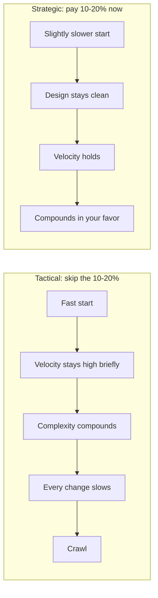

# Deep Modules & Complexity — Middle Level

> Focus: "Why does complexity grow?" and "When does a tactical shortcut bend the system?" — the economics of complexity, the strategic-vs-tactical investment, and which fix to reach for. For the *mechanics* of building deep modules (deep vs shallow interfaces, hiding decisions), see [`../22-abstraction-and-information-hiding/README.md`](../22-abstraction-and-information-hiding/README.md); this file is about *diagnosing and pricing* complexity.

---

## Table of Contents

1. [Complexity is in the eye of the reader](#complexity-is-in-the-eye-of-the-reader)
2. [Essential vs accidental complexity (Brooks)](#essential-vs-accidental-complexity-brooks)
3. [The strategic-vs-tactical investment trade-off](#the-strategic-vs-tactical-investment-trade-off)
4. [When a tactical hack is actually acceptable](#when-a-tactical-hack-is-actually-acceptable)
5. [The tactical tornado](#the-tactical-tornado)
6. [How dependencies create change amplification](#how-dependencies-create-change-amplification)
7. [Reducing dependencies — but not to zero](#reducing-dependencies--but-not-to-zero)
8. [Obscurity: documentation vs naming vs redesign](#obscurity-documentation-vs-naming-vs-redesign)
9. ["Design it twice" — the cheapest complexity reducer](#design-it-twice--the-cheapest-complexity-reducer)
10. [Common Mistakes](#common-mistakes)
11. [Test Yourself](#test-yourself)
12. [Cheat Sheet](#cheat-sheet)
13. [Summary](#summary)
14. [Further Reading](#further-reading)
15. [Related Topics](#related-topics)

---

## Complexity is in the eye of the reader

The single most counter-intuitive fact about complexity: **the person who writes the code is the worst judge of how complex it is.** The author holds the whole design in their head while writing — every implicit assumption, every reason a branch exists, the order things must happen in. To the author, the code reads as obvious. None of that context lives in the file. The reader, six months later, has only the text.

Ousterhout's definition is operational, not aesthetic: **complexity is anything about a system that makes it hard to understand or modify.** A module isn't complex because it's "ugly"; it's complex if a competent engineer needs an unreasonable amount of information to safely change it. That makes complexity *measurable by its symptoms*, and it explains why "I think this is clean" is worthless feedback — you are the one person who can't see the obscurity you created.

```python
# The author "knows" amount is already in cents and never negative.
# The reader knows neither.
def apply_fee(amount):
    return amount + (amount * 3 // 100) + 30   # what unit? what's 30? why integer //?
```

The fix is almost never "the reader should try harder." It's to push the author's private context into the code — through naming, types, or a one-line comment — so the next reader starts where the author finished.

```python
def apply_fee(amount_cents: int) -> int:
    """Stripe-style fee: 3% + 30c flat. Input/output in integer cents."""
    percentage_fee = amount_cents * 3 // 100
    FLAT_FEE_CENTS = 30
    return amount_cents + percentage_fee + FLAT_FEE_CENTS
```

> **Practical test:** the only reliable complexity meter is *another engineer reading your code without you in the room.* That is what code review is for. If a reviewer asks "what does the 30 mean?", you found complexity — not a dumb reviewer.

---

## Essential vs accidental complexity (Brooks)

Fred Brooks (*No Silver Bullet*, 1986) split complexity into two kinds, and the distinction governs where your effort should go:

- **Essential complexity** is inherent in the problem. Tax rules really do have hundreds of cases. A distributed system really must handle partial failure. You cannot delete essential complexity; you can only *organize* it so the reader meets it in digestible pieces.
- **Accidental complexity** is introduced by *how we chose to solve* the problem: a tangled control flow, a leaky abstraction, three different date formats, a config flag that interacts with another config flag. None of it is demanded by the domain.

The freeing realization for a mid-level engineer: **most of the complexity you fight day to day is accidental.** The domain rarely requires the 14-parameter function, the global mutable singleton, or the three layers of indirection that each forward one call. Those are choices. Accidental complexity is the part you can actually win against, so spend your energy there rather than lamenting that the domain is "just hard."

```go
// Accidental: the retry/backoff/logging plumbing has nothing to do with "fetch a user".
func GetUser(id string) (*User, error) {
    for attempt := 0; attempt < 3; attempt++ {
        log.Printf("attempt %d", attempt)
        u, err := db.Query(id)
        if err != nil {
            time.Sleep(time.Duration(attempt) * 100 * time.Millisecond)
            continue
        }
        return u, nil
    }
    return nil, errors.New("failed")
}
```

The retry logic is accidental complexity smeared across every data-access function. Hoisting it into a `withRetry` wrapper doesn't remove the retry behavior (it's needed) — it removes its *accidental* presence from every reader's view. Essential complexity stays; accidental complexity gets concentrated and hidden.

---

## The strategic-vs-tactical investment trade-off

This is the central economic choice of the chapter.

**Tactical programming** optimizes for getting *this* feature working *now*. Each task is a chance to add code and move on. Design quality is not a goal; it's a tax you skip. The result is correct today and a little worse structurally than yesterday.

**Strategic programming** treats *working code as not good enough.* The goal is a good design that also works. You invest a little extra on every change — a cleaner interface, one less special case, a better name — because the codebase is the asset, not the feature.

Ousterhout's concrete recommendation: spend roughly **10–20% of your time on continuous design investment.** Not a separate "refactor sprint" later — a tax paid per change. The math is the point:



Complexity is **incremental** — it almost never arrives in one bad decision. It arrives as a thousand "it's just one special case" additions, each individually defensible, each leaving the system slightly worse. That incrementality is exactly why it's dangerous: there is no single PR you can point at and block. The discipline is to refuse the *first* small degradation, because the cost curve is exponential, not linear. The tactical team feels faster for the first few months and is permanently slower after that — and crucially, *they can no longer afford to fix it*, because every fix now risks the unknown-unknowns the mess created.

The 10–20% is an *investment*, not a cost: it buys back future velocity. The trade-off bends the wrong way the moment you tell yourself "we'll clean it up later" — later is precisely when the codebase is too complex to clean cheaply.

---

## When a tactical hack is actually acceptable

Strategic does not mean gold-plating every line. There are legitimate cases for a quick, ugly solution:

1. **A true throwaway.** A migration script run once and deleted. A one-off data fix. A `curl | jq` glue script. If the code provably will not be maintained, design investment is wasted — *but be honest about "throwaway."* The famous failure mode is the "temporary" script that becomes load-bearing.
2. **A spike / prototype to learn something.** You're exploring whether an approach is feasible, not building the production version. The rule that keeps this honest: **a spike's job is knowledge, not code.** When the spike answers its question, you throw the code away and rebuild it strategically. A spike that ships unchanged is just tactical programming with a nicer name.
3. **A genuine deadline emergency**, taken *consciously and recorded.* If you must ship a hack to stop a fire, file the follow-up ticket in the same PR and add a `// HACK:` marker. The danger isn't the one hack — it's the hack that's invisible and forgotten.

> **The honest line:** "I don't have time to do it right" is almost never true over the lifetime of the code — the tactical version costs more in the maintenance you'll do next week. "This is a verified throwaway" *is* a real reason. The difference is whether the code has a future.

---

## The tactical tornado

The most expensive person on a team can look like the most productive. The **tactical tornado** ships features at a blistering pace by taking every shortcut: copy-paste instead of extract, special-case instead of redesign, global state instead of a clean seam. Management often *rewards* them — the demos work, the tickets close.

The cost is externalized onto everyone else. The tornado leaves a wake of complexity that the rest of the team must navigate forever after. Their velocity is real but borrowed against the future, and the bill is paid by whoever touches that code next — usually someone who *wasn't* in the room when the assumptions were made (see "complexity is in the eye of the reader").

```java
// Tornado's "fix" for a new client: copy the whole method, tweak two lines.
double calcPriceForClientA(Order o) { /* 60 lines */ }
double calcPriceForClientB(Order o) { /* 60 nearly-identical lines */ }
double calcPriceForClientC(Order o) { /* 60 nearly-identical lines */ }
// Three clients shipped "fast." Now a tax-rule change means editing three places,
// and nobody is sure they're still in sync. Change amplification, manufactured.
```

Recognizing a tornado matters for a mid-level engineer because the antidote is cultural, not technical: make design quality visible in review, count *cost of change* not *features shipped*, and resist the pressure to imitate the person who appears fastest. The strategic programmer is slower this quarter and faster every quarter after.

---

## How dependencies create change amplification

A **dependency** exists when you cannot understand or modify one piece of code in isolation — it's coupled to another. Dependencies are the first of complexity's two root causes (obscurity is the second).

The symptom dependencies produce is **change amplification**: one conceptual change forces edits in many physical places. The classic example is a single fact — a banner color, a magic number, a wire-format field — duplicated across N call sites. Changing the fact means finding and editing all N, and the N+1th that you missed is a bug.

```python
# One conceptual fact ("the page is 50 wide") encoded in 4 places.
def render_header():  print("=" * 50)
def render_row(r):    print(r.ljust(50))
def render_footer():  print("-" * 50)
MAX_WIDTH = 50  # and a fourth, hopefully consistent with the rest
```

A change to width amplifies into four edits. Concentrate the fact and the amplification collapses to one:

```python
PAGE_WIDTH = 50
def render_header(): print("=" * PAGE_WIDTH)
def render_row(r):   print(r.ljust(PAGE_WIDTH))
def render_footer(): print("-" * PAGE_WIDTH)
```

Dependencies also breed **unknown-unknowns** — the worst symptom. With change amplification you at least know there are N places; with unknown-unknowns you don't know *which* code a change will break or even that it can break. A hidden temporal coupling ("`init()` must run before `load()`") or a shared mutable global creates dependencies that no signature reveals. Those are the bugs that ship.

---

## Reducing dependencies — but not to zero

The instinct after learning this is to eliminate all coupling. **That's a mistake.** Some dependencies are *essential* — they reflect real relationships in the problem. An order genuinely depends on a customer. A parser genuinely depends on a grammar. Trying to sever an essential dependency produces worse complexity: indirection layers, event soup, "everything talks to everything through a bus," and an unfollowable control flow. You replaced an honest, visible dependency with a hidden one.

The goal is not zero dependencies; it's **fewer and more obvious** ones. Good design doesn't remove the essential coupling — it routes it through a single, well-named, deep interface so the dependency is explicit and localized.

```go
// Bad: every caller depends on the concrete SMTP details (a wide, leaky dependency).
smtp.SendMail("smtp.example.com:587", auth, from, to, body)

// Better: callers depend on one narrow concept. The SMTP coupling lives in ONE place.
type Notifier interface { Notify(to string, msg string) error }
// 40 call sites now depend on Notify(), not on SMTP. Swap the impl, edit one file.
```

The litmus test: a good dependency is one a reader *expects* from the names and types involved. A bad dependency is one that surprises them — a function that secretly reads a global, an "unrelated" module that breaks when you edit this one. Make the essential dependencies legible; delete the accidental ones.

---

## Obscurity: documentation vs naming vs redesign

**Obscurity** is the second root cause of complexity: important information that isn't obvious. The fix is not always "add a comment." There's a clear priority order, and reaching for the wrong tool leaves the obscurity in place.

| If the obscurity is... | Reach for... | Why |
|---|---|---|
| A misleading or vague name | **Better naming** | A correct name removes the obscurity for *every* reader at zero ongoing cost. Always try this first. |
| A non-obvious *what* that no name can carry (units, invariants, "must call before X") | **Documentation** | Some information genuinely cannot fit in an identifier. A one-line doc comment is the right tool — for the *why* and the *contract*, not a restatement of the code. |
| A structural problem (the design itself forces the reader to hold too much) | **Redesign** | If you find yourself writing a long comment to *apologize* for confusing code, that's a design smell. The comment is treating a symptom. |

```java
// Obscurity via bad name — fix with naming, not a comment:
int d;                  // elapsed time in days   <-- the comment is a band-aid
int elapsedDays;        // self-documenting

// Obscurity that naming CAN'T fix — documentation is correct here:
/** Caller must hold the account lock. Returns balance in minor units (cents). */
long readBalance(Account a) { ... }

// Obscurity that's really a DESIGN problem — neither name nor comment fixes it:
// "NOTE: call reset() between uses or the cached state leaks into the next call"
// The right fix is to remove the hidden state, not document the footgun.
```

> **Rule:** the existence of a comment that explains *how the code works* (rather than *why*) is usually evidence the code is too obscure and should be clarified or redesigned. Comments are for the information the code genuinely cannot express — see [`../../anti-patterns/README.md`](../../anti-patterns/README.md) for the comment-as-deodorant smell.

---

## "Design it twice" — the cheapest complexity reducer

The highest-leverage habit Ousterhout recommends is almost free: **before committing to an interface or design, sketch a meaningfully different second option.** Not two variations of the same idea — two genuinely different shapes (e.g., a callback-based API vs. a returned-iterator API; a single rich method vs. several primitives).

Why it works so well: your first design is rarely your best, but you can't see its flaws *in the abstract* — only by contrast. Producing a second candidate forces you to articulate the trade-offs, and the comparison usually reveals a third option better than both. The cost is 30 minutes of design thinking; the payoff is avoiding a bad interface that 40 call sites will be welded to.

```python
# Option A: caller-driven (returns everything, caller filters)
def search(query: str) -> list[Result]: ...

# Option B: streaming (caller can stop early, bounded memory)
def search(query: str) -> Iterator[Result]: ...

# Comparing A and B surfaces the real question: do callers usually want
# the first match, the top-k, or everything? That answer — not your first
# instinct — should pick the interface. You only see it by holding two up.
```

This is most valuable precisely at the points where mistakes are most expensive: interfaces between modules, public APIs, data schemas. Internal implementation you can rewrite cheaply later; an interface, once depended upon, is hard to change. Design those twice.

---

## Common Mistakes

1. **Judging your own code's complexity.** You're the one person who can't. Trust the reviewer's confusion as a signal, not a nuisance. ("Complexity is in the eye of the reader.")
2. **Treating the 10–20% as optional overhead.** It's an investment that buys velocity. The teams that skip it are slower within a year, not faster.
3. **Calling tactical work "pragmatic" by default.** Pragmatic means *fits the code's actual future.* For code with a future, tactical is the un-pragmatic choice.
4. **Mistaking the tactical tornado for your best engineer.** Features-shipped is the wrong metric; cost-to-change is the right one.
5. **Driving dependencies to zero.** You'll create worse, hidden complexity (event soup, indirection layers). Make essential dependencies *obvious*, don't sever them.
6. **Reaching for a comment when the real fix is a name or a redesign.** A comment that explains *how* the code works is usually a confession that the code is too obscure.
7. **Believing complexity comes from one big bad decision.** It accretes one "harmless special case" at a time. The defense is refusing the *first* small degradation.
8. **Skipping "design it twice" on interfaces.** The 30-minute cost is trivial against the cost of an API that 40 call sites depend on.
9. **Fighting essential complexity as if it were a bug.** You can't delete the domain's inherent hardness — only organize it. Spend your energy on the accidental complexity you *can* delete.

---

## Test Yourself

1. **Your teammate says "this module is clean, I wrote it last week and it's obvious." Why is that not evidence?**

<details><summary>Answer</summary>

Because complexity is in the eye of the *reader*, and the author is the worst-positioned reader. They still hold all the implicit context — invariants, ordering, the reasons branches exist — in their head; none of that is in the file. The only valid evidence is another engineer reading it cold. "It's obvious to me" is exactly the blind spot the concept names.

</details>

2. **Ousterhout recommends spending 10–20% of time on design investment. Why not 0% to ship faster, or 50% to be really clean?**

<details><summary>Answer</summary>

0% is tactical programming: complexity compounds and within a year the team is permanently slower *and* too tangled to cheaply fix it. 50% is gold-plating — you over-invest past the point of return and miss the deadline. The 10–20% is the band where the investment reliably buys back more future velocity than it costs, paid continuously per-change rather than as a doomed later "refactor sprint."

</details>

3. **A "tactical tornado" is your team's top feature-shipper. Why might they be a net negative?**

<details><summary>Answer</summary>

Their velocity is real but borrowed: every shortcut externalizes complexity onto everyone who touches that code later. Counting features-shipped rewards them; counting cost-to-change reveals the bill. They make the demo work and make the next ten changes harder — and those changes are made by people who weren't in the room and can't see the assumptions baked in.

</details>

4. **When is a tactical hack genuinely acceptable?**

<details><summary>Answer</summary>

For a *verified* throwaway (a script run once and deleted), a *spike* whose only product is knowledge (and whose code you then throw away), or a conscious, *recorded* deadline emergency (with a `// HACK:` marker and a same-PR follow-up ticket). The trap is the "temporary" hack with a future — that's just tactical programming renamed. The test is whether the code will be maintained.

</details>

5. **You learn dependencies cause change amplification. Should you architect to eliminate all dependencies?**

<details><summary>Answer</summary>

No. Essential dependencies reflect real relationships (an order depends on a customer) and severing them creates *worse*, hidden complexity — indirection layers, event soup, unfollowable flow. The goal is *fewer and more obvious* dependencies: route the essential coupling through one well-named deep interface so it's explicit and localized, and delete only the accidental coupling.

</details>

6. **You're about to add a comment explaining the steps a confusing function performs. What should you check first?**

<details><summary>Answer</summary>

Whether the obscurity should be fixed by a better *name* or by *redesign* instead. The priority order is naming → documentation → redesign. A comment that explains *how* the code works (rather than *why*) is usually a band-aid over code that's too obscure — clarify or restructure it. Documentation is the right tool only for information no name can carry: units, invariants, contracts, "must call X first."

</details>

7. **Most of the complexity you fight is accidental, not essential. Why does that matter for where you spend effort?**

<details><summary>Answer</summary>

Essential complexity (Brooks) is inherent in the domain — tax rules, partial failure — and can't be deleted, only organized into digestible pieces. Accidental complexity comes from *how* you chose to solve the problem (tangled flow, leaky abstractions, redundant config) and the domain never demanded it. Since accidental complexity is the part you can actually remove, that's where your refactoring energy pays off — don't burn it lamenting that the domain is "just hard."

</details>

8. **Why design an interface twice when the first design already works?**

<details><summary>Answer</summary>

"Works" doesn't mean "good design," and you can't see your first design's flaws in the abstract — only by contrast with a *meaningfully different* alternative. Producing a second candidate forces you to articulate trade-offs and usually reveals a third, better option. The 30-minute cost is trivial against the cost of a bad interface that many call sites get welded to. Reserve it for the expensive-to-change points: module interfaces, public APIs, schemas.

</details>

---

## Cheat Sheet

| Concept | One-liner |
|---|---|
| Complexity (Ousterhout) | Anything that makes code hard to understand or modify — measured by symptoms, not taste. |
| In the eye of the reader | The author is the worst judge; trust a cold reader / reviewer. |
| Three symptoms | Change amplification, high cognitive load, unknown-unknowns. |
| Two root causes | Dependencies + obscurity. |
| Essential complexity (Brooks) | Inherent in the problem; can't delete, only organize. |
| Accidental complexity | From *how* you solved it; deletable — spend effort here. |
| Strategic programming | Working code isn't enough; invest ~10–20% per change in design. |
| Tactical programming | Just make it work now; complexity compounds, velocity collapses. |
| Tactical tornado | Looks fastest, externalizes complexity onto everyone else. |
| Acceptable hack | Verified throwaway, knowledge-only spike, or recorded emergency. |
| Reduce dependencies | Fewer + *obvious*, not zero — keep essential coupling legible. |
| Obscurity fix order | Naming → documentation → redesign. |
| Design it twice | Sketch a different second option before committing to an interface. |
| Incremental accretion | Complexity arrives one "harmless special case" at a time. |

---

## Summary

Complexity is whatever makes a system hard to understand or change, and its defining trap is that **the author can't see the complexity they create** — only the reader can. Brooks's split tells you where to aim: essential complexity is the domain's and can only be organized, while the **accidental** complexity that makes up most of your daily pain is deletable. The economic decision underneath it all is **strategic vs tactical**: pay roughly 10–20% per change to keep the design clean and your velocity compounds in your favor; skip it and complexity accretes one defensible special-case at a time until the team is permanently slow and too tangled to recover. Tactical work is honest only for a verified throwaway, a knowledge-only spike, or a recorded emergency — and the **tactical tornado** who appears fastest is usually borrowing velocity from everyone downstream. Complexity's two root causes are **dependencies** (which cause change amplification and unknown-unknowns) and **obscurity** (fixed by naming, then documentation, then redesign — in that order). Don't try to delete dependencies; make the essential ones obvious. And before welding an interface in place, **design it twice** — the cheapest complexity reducer you have. For the mechanics of turning these diagnoses into deep modules, continue to [`senior.md`](senior.md) and [`../22-abstraction-and-information-hiding/README.md`](../22-abstraction-and-information-hiding/README.md).

---

## Further Reading

- John Ousterhout, *A Philosophy of Software Design* — Ch. 2 (nature of complexity), Ch. 3 (strategic vs tactical), Ch. 11 (design it twice).
- Fred Brooks, *No Silver Bullet — Essence and Accident in Software Engineering* (1986) — the essential/accidental distinction.
- Ben Moseley & Peter Marks, *Out of the Tar Pit* (2006) — a deeper treatment of state and accidental complexity.

---

## Related Topics

- [`junior.md`](junior.md) — the vocabulary: the three symptoms and two causes, with first examples.
- [`senior.md`](senior.md) — applying these diagnoses across a large codebase and over time.
- [`../README.md`](../README.md) — the chapter's positive rules.
- [`../22-abstraction-and-information-hiding/README.md`](../22-abstraction-and-information-hiding/README.md) — the mechanics of deep modules and hiding decisions.
- [`../20-cognitive-load/README.md`](../20-cognitive-load/README.md) — the reader's working-memory cost, one of the three symptoms up close.
- [`../../refactoring/README.md`](../../refactoring/README.md) — the concrete moves that remove accidental complexity.
- [`../../anti-patterns/README.md`](../../anti-patterns/README.md) — the failure modes (tactical tornado, comment-as-deodorant) catalogued.