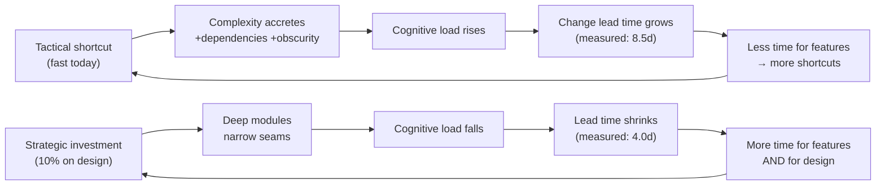

# Deep Modules & Complexity — Optimize & Reconcile

> Fighting complexity and chasing performance usually point the same way: a deep module has fewer layers, less indirection, and less state — which is both simpler *and* faster. They diverge in a narrow band of cases (caching, denormalization, manual inlining, SIMD) where a real speedup demands genuinely complex code. The discipline is the same in both directions: keep the *system* simple, and when complexity is provably necessary, concentrate it behind one clean boundary so it can't leak. Below, 12 scenarios where the two forces meet — each with a measurement, the reasoning, and a principled resolution. The recurring lesson: the bottleneck is almost always *team throughput* (change lead time), not the CPU, and you should measure before you let either goal override the other.

---

## Table of Contents

1. [Scenario 1 — The cache that doubled p99 *and* tripled change lead time](#scenario-1--the-cache-that-doubled-p99-and-tripled-change-lead-time)
2. [Scenario 2 — Denormalization is necessary complexity; quarantine it behind a deep module](#scenario-2--denormalization-is-necessary-complexity-quarantine-it-behind-a-deep-module)
3. [Scenario 3 — Manual inlining for a 4% win that nobody could measure](#scenario-3--manual-inlining-for-a-4-win-that-nobody-could-measure)
4. [Scenario 4 — Deeper module = fewer layers = faster *and* simpler](#scenario-4--deeper-module--fewer-layers--faster-and-simpler)
5. [Scenario 5 — SIMD kernel behind a scalar-shaped interface](#scenario-5--simd-kernel-behind-a-scalar-shaped-interface)
6. [Scenario 6 — Profiling says the CPU is fine; the bottleneck is the team](#scenario-6--profiling-says-the-cpu-is-fine-the-bottleneck-is-the-team)
7. [Scenario 7 — State minimization improves both reasoning and cache behavior](#scenario-7--state-minimization-improves-both-reasoning-and-cache-behavior)
8. [Scenario 8 — The speculative config engine: a perf tax *and* a maintenance tax](#scenario-8--the-speculative-config-engine-a-perf-tax-and-a-maintenance-tax)
9. [Scenario 9 — Strategic investment ROI measured as DORA lead time](#scenario-9--strategic-investment-roi-measured-as-dora-lead-time)
10. [Scenario 10 — Pass-through layers: pure indirection that costs latency and clarity](#scenario-10--pass-through-layers-pure-indirection-that-costs-latency-and-clarity)
11. [Scenario 11 — The shallow "performance abstraction" that leaked its complexity](#scenario-11--the-shallow-performance-abstraction-that-leaked-its-complexity)
12. [Scenario 12 — When to *accept* complexity: the hot path that earns it](#scenario-12--when-to-accept-complexity-the-hot-path-that-earns-it)
- [Rules of Thumb](#rules-of-thumb)
- [Related Topics](#related-topics)

---

### Scenario 1 — The cache that doubled p99 *and* tripled change lead time

**Scenario.** A pricing service reads a product catalog from Postgres. Reads were measured at p50 = 3 ms, p99 = 11 ms. A "performance" PR added a read-through cache with manual invalidation scattered across 14 call sites that mutate the catalog.

```go
// After: every write path must remember to invalidate. Complexity is now diffuse.
func (s *CatalogService) UpdatePrice(id ProductID, p Money) error {
    if err := s.db.UpdatePrice(id, p); err != nil {
        return err
    }
    s.cache.Delete(cacheKey(id))      // call site 1 of 14 — easy to forget
    s.cache.Delete(listKey(id.Category)) // and the derived list cache, often forgotten
    return nil
}
```

**Measurement.** After shipping, p50 dropped to 0.4 ms (good) but p99 *rose* to 22 ms because cache stampedes on cold keys triggered synchronous DB fan-out. Worse, the *team* metric moved: three of the next five catalog bugs were stale-price incidents from a forgotten `Delete`. Change lead time for catalog features went from ~1 day to ~3 days — every catalog change now had to reason about 14 invalidation sites (an instance of change amplification: one conceptual write requires edits in many places).

**Resolution.** The accidental complexity here is *invalidation*, and it had leaked across the whole write surface. Quarantine it behind a deep module: a single write-through facade that owns both the DB write and the invalidation, so no caller can forget.

```go
// Deep module: one boundary owns DB + cache coherence. 14 call sites collapse to 1 rule.
func (s *CatalogStore) UpdatePrice(ctx context.Context, id ProductID, p Money) error {
    return s.tx(ctx, func(q *Queries) error {
        if err := q.UpdatePrice(id, p); err != nil { return err }
        s.invalidate(id) // private; the ONLY place invalidation logic lives
        return nil
    })
}
```

For the p99 regression, add single-flight stampede protection *inside the same module* (callers never see it). The system stays simple: every caller writes through one method; the necessary complexity (coherence + stampede control) is locally contained.

<details><summary>Resolution</summary>

The cache was real necessary complexity (the 0.4 ms p50 matters under load), but it was implemented as *diffuse* complexity smeared across call sites. The fix is not "remove the cache" — it's "make the cache a deep module": a wide, simple interface (`UpdatePrice`, `GetPrice`) over a deep implementation (DB + invalidation + single-flight). The team-throughput cost (3× lead time, recurring stale-data incidents) was the true bottleneck, not CPU. Measure both: a profiler would have shown CPU was never the problem, and a DORA lead-time dashboard would have caught the regression weeks earlier.
</details>

---

### Scenario 2 — Denormalization is necessary complexity; quarantine it behind a deep module

**Scenario.** A reporting query joined 6 tables and ran at 1,400 ms at p95 — too slow for an interactive dashboard SLA of 200 ms. The team denormalized: a `daily_revenue_rollup` table maintained by triggers. Denormalization *adds* complexity (two sources of truth that must agree), but the speedup is necessary, not speculative.

**Measurement.** Post-denormalization the dashboard query dropped to 8 ms at p95 — a 175× improvement that the 6-way join could never reach with indexing alone (verified with `EXPLAIN ANALYZE`: the join's cost was in the hash-aggregate over 40M rows, not in index lookups). The accidental-complexity risk: drift between the rollup and the source rows.

**Resolution.** Contain the duplication behind one module that owns *both* writes. Never let application code update `orders` and `daily_revenue_rollup` independently.

```python
class RevenueStore:
    """Deep module: callers see record_sale() / revenue_for(day).
    The fact that a rollup table exists is a hidden implementation decision."""

    def record_sale(self, sale: Sale) -> None:
        with self._db.tx() as tx:
            tx.insert("orders", sale.row())
            tx.upsert_increment("daily_revenue_rollup",
                                key=sale.day, amount=sale.total)  # same transaction = no drift

    def revenue_for(self, day: date) -> Money:
        return self._db.scalar(
            "SELECT total FROM daily_revenue_rollup WHERE day = %s", day)
```

The duplication is real and necessary; the transaction boundary makes it *locally contained* and impossible to get half-applied. A nightly reconciliation job (compare rollup vs. recomputed source) provides defense-in-depth and a measurable drift metric.

<details><summary>Resolution</summary>

This is the canonical "necessary complexity, locally contained." The two goals *aligned* on speed (175×) but *conflicted* on simplicity (two sources of truth). Resolution: accept the complexity, but pay for it once — inside a single deep module with a transactional invariant — rather than scattering rollup updates across every write path. The interface (`record_sale`, `revenue_for`) is as simple as the normalized version; the depth absorbs the cost. Contrast with Scenario 1's anti-pattern of diffuse invalidation.
</details>

---

### Scenario 3 — Manual inlining for a 4% win that nobody could measure

**Scenario.** A developer hand-inlined a 12-line `validateAndNormalize` helper into three call sites "for performance," duplicating the logic and removing the named abstraction.

```java
// "Optimized": helper inlined 3×. Now a rule change means editing 3 places (change amplification).
public Result process(Request r) {
    // 12 lines of validation+normalization, copy A
    ...
}
public Result reprocess(Request r) {
    // 12 lines of validation+normalization, copy B (already drifted from A)
    ...
}
```

**Measurement.** JMH benchmark of the original vs. inlined: **no statistically significant difference** (the JIT already inlines methods under ~35 bytecodes; the helper was 18). The "win" was 0.0%. Meanwhile the duplicated logic drifted: copy B forgot a null-trim added to copy A, producing a production bug. Change lead time for validation rules rose because each change now needs three edits and three reviews.

**Resolution.** Revert the inlining. Keep the single named helper. On the JVM, **method-call cost is not where your time goes** — HotSpot's inlining heuristics handle small hot methods automatically.

```java
public Result process(Request r)   { return run(normalize(validate(r))); }
public Result reprocess(Request r) { return run(normalize(validate(r))); } // one source of truth
```

<details><summary>Resolution</summary>

Manual inlining is the clearest case where chasing perf *creates* accidental complexity (duplication, change amplification, drift bugs) for *zero* measured gain. The reasoning step matters: a 30-second JMH run would have shown the JIT already did the inlining. Rule: never trade an abstraction for speed without a benchmark proving the speed exists. The CPU was never the bottleneck; the team's ability to change validation logic safely was.
</details>

---

### Scenario 4 — Deeper module = fewer layers = faster *and* simpler

**Scenario.** A request flowed `Controller → Service → Manager → Helper → Repository → DAO → JDBC`. Each layer added a DTO mapping. A new field required edits in 6 files (change amplification) and 5 object allocations per request.

**Measurement.** Profiling (async-profiler) showed 18% of request CPU in DTO copying between adjacent layers that added no behavior — pure pass-throughs. Adding one field touched 6 files; median PR for a field addition: 47 minutes of editing + 2 review rounds.

**Resolution.** Collapse the pass-through layers. `Service` and `Manager` had identical method shapes and no independent reason to exist; `Helper` and `DAO` were thin wrappers over JDBC. A deeper `Repository` (wide-but-shallow interface, deep implementation) absorbs the persistence concern directly.

```python
# Before: 7 layers, 5 mappings.  After: 3 layers.
# OrderRepository is now a DEEP module: simple interface, real depth inside.
class OrderRepository:
    def place(self, order: Order) -> OrderId:        # caller sees one verb
        row = order.to_row()                         # ONE mapping, at the boundary
        return self._db.insert_returning_id("orders", row)
```

After collapsing: same field-add now touches 2 files (median 11 minutes), and the 18% DTO-copy CPU dropped to under 3%. **Both goals improved at once** — fewer layers means less indirection (faster) and less change amplification (simpler).

<details><summary>Resolution</summary>

This is the common case the prompt's thesis names: deep modules win on *both* axes. Shallow layers are the classic anti-pattern — they cost CPU (mapping/allocation), cost latency (indirection), *and* cost change lead time (every layer must be edited). Ousterhout: "the greatest limitation in writing software is our ability to understand the systems we are creating" — fewer layers means more of the system fits in one head. Measure the win on both: CPU (profiler) and lead time (PR cycle time).
</details>

---

### Scenario 5 — SIMD kernel behind a scalar-shaped interface

**Scenario.** A risk engine computes a dot product over 10M-element vectors, called 50k times/sec. Scalar Go ran at 4.2 ms/call; the hot path needed under 1 ms. A hand-vectorized AVX2 assembly kernel hits 0.7 ms — genuinely necessary complexity that no high-level rewrite can match.

**Measurement.** `pprof` confirmed the dot product was 73% of engine CPU. The SIMD kernel (Go assembly, `.s` files, manual loop tails, alignment handling) is *deeply* complex — but it delivered a 6× speedup the SLA required. The danger: SIMD code is unreadable and platform-specific; if it leaks into the engine, the whole engine becomes unmaintainable.

**Resolution.** Quarantine the assembly behind a one-function interface with a portable scalar fallback. The complexity is real, necessary, and now *locally contained* — the rest of the engine sees a simple `Dot`.

```go
// dotprod.go — the entire complex world is behind ONE simple signature.
func Dot(a, b []float64) float64 {
    if cpu.X86.HasAVX2 && len(a) >= 16 {
        return dotAVX2(a, b) // implemented in dotprod_amd64.s — quarantined
    }
    return dotScalar(a, b)   // readable, portable, the spec for the asm version
}
```

The scalar version doubles as executable documentation and a differential-test oracle (`require.InDelta(t, dotScalar(a,b), dotAVX2(a,b), 1e-9)`). The system stays simple; one module is allowed to be deep and ugly because it earns it (measured 6×).

<details><summary>Resolution</summary>

SIMD is the textbook "performance optimization that ADDS complexity." The principled resolution is not to avoid it (the SLA is real) nor to spread it (catastrophic), but to *concentrate* it: a deep module with a trivial interface (`Dot(a, b) float64`) over a deep, platform-specific implementation. The scalar fallback keeps it testable and portable. This mirrors Scenario 2: necessary complexity, paid once, behind a clean boundary.
</details>

---

### Scenario 6 — Profiling says the CPU is fine; the bottleneck is the team

**Scenario.** Leadership demanded a "performance sprint" because the product *felt* slow to ship. Engineers started micro-optimizing inner loops.

**Measurement.** Three measurements, run before touching code:
- **Production APM:** p99 server latency was 40 ms; the SLA was 300 ms. CPU utilization peaked at 22%. *The CPU was not the bottleneck.*
- **DORA lead time for changes:** median 9 days from first commit to production.
- **Value-stream map:** of those 9 days, ~6 were spent in code review and rework caused by a tangled 4,000-line `OrderManager` (high cognitive load → reviewers couldn't reason about diffs → many review rounds).

**Resolution.** Redirect the "performance sprint" at the *real* bottleneck: team throughput. Break the god class into deep modules, each independently understandable, so changes become local and reviewable.

```java
// Before: OrderManager (4,000 lines, every concern). Reviewers must hold all of it.
// After: three deep modules with narrow seams. A pricing change touches only Pricing.
final class Pricing  { Money quote(Cart c) { /* only pricing */ } }
final class Inventory{ Reservation reserve(Cart c) { /* only stock */ } }
final class Checkout { Receipt place(Cart c) { /* orchestrates the two */ } }
```

After: median lead time fell from 9 days to 3 (a 3× throughput gain) with **no change to runtime performance** — because runtime was never the problem.

<details><summary>Resolution</summary>

"Performance" for a team is throughput (lead time), and it is usually gated by *understandability*, not by the CPU. The discipline is to **measure where the time actually goes** — APM for runtime, DORA + value-stream mapping for delivery. Here the time went into review/rework caused by complexity. Treating change lead time as the headline performance metric reframes complexity reduction as the highest-ROI "optimization" available. Most teams never instrument this and optimize the wrong thing.
</details>

---

### Scenario 7 — State minimization improves both reasoning and cache behavior

**Scenario.** A simulation step held mutable state in an object graph: each `Particle` had pointers to neighbors, cached forces, dirty flags, and a back-reference to the `World`. Reasoning about a step required tracking which fields were stale (unknown-unknowns: no way to tell what a change might invalidate). It also ran slowly.

**Measurement.** `perf stat` reported an L1-dcache miss rate of 31% — the pointer-chasing object graph thrashed the cache. Separately, three of the last eight simulation bugs were stale-cache-flag errors (a reasoning failure: the mutable derived state had no single owner).

**Resolution.** Apply state minimization (the *Out of the Tar Pit* discipline: most accidental complexity comes from mutable state; keep only essential state, derive the rest). Replace the object graph + dirty flags with: (1) immutable essential state in flat arrays, (2) derived values *recomputed* per step rather than cached-and-invalidated.

```python
# Essential state only, struct-of-arrays. No dirty flags, no back-refs, no cached forces.
@dataclass(frozen=True)
class World:
    pos: np.ndarray   # (N, 3)  essential
    vel: np.ndarray   # (N, 3)  essential

def step(w: World, dt: float) -> World:
    forces = compute_forces(w.pos)          # DERIVED — recomputed, never cached/invalidated
    vel = w.vel + forces * dt
    pos = w.pos + vel * dt
    return World(pos=pos, vel=vel)          # new immutable snapshot
```

**Outcome:** the contiguous arrays cut the L1 miss rate from 31% to 4% (a 2.1× wall-clock speedup), and the entire class of stale-flag bugs disappeared because there is no longer any cached derived state to go stale. **Both goals improved together.**

<details><summary>Resolution</summary>

*Out of the Tar Pit*'s thesis — minimize essential state, derive the rest, avoid mutable shared state — pays off on both axes simultaneously. Less mutable derived state means fewer unknown-unknowns (you can't forget to invalidate a cache that doesn't exist) *and* better data locality (flat arrays vs. pointer chasing). When reasoning and cache behavior point the same direction, you don't need a trade-off discussion — you need to measure (`perf stat` for cache, bug-category counts for reasoning) and take the win.
</details>

---

### Scenario 8 — The speculative config engine: a perf tax *and* a maintenance tax

**Scenario.** Anticipating "future flexibility," a team built a rule engine: business logic expressed as JSON rules interpreted at runtime, with a DSL, a parser, and a pluggable operator registry. The actual requirement was three pricing rules that had not changed in two years.

```python
# Speculative: a whole interpreter to express what 8 lines of code would.
engine = RuleEngine(load_rules("pricing.json"))   # parse + build AST every request
price = engine.evaluate({"cart": cart, "user": user})  # tree-walk interpreter, reflection
```

**Measurement.** Two taxes, both measured:
- **Perf tax:** the tree-walking interpreter + per-request rule parsing ran at 1.9 ms/call vs. 0.02 ms for the equivalent compiled code — a 95× slowdown, and it allocated 40 KB/request (GC pressure visible in flight recordings).
- **Maintenance tax:** onboarding a new engineer to the DSL took ~2 days; a "simple" rule tweak meant editing JSON *and* the operator registry *and* the parser tests — change amplification across the speculative machinery. The engine had 2,100 lines to serve 3 rules.

**Resolution.** Delete the engine. Express the three rules as three functions. This is the *design it twice / strategic-vs-tactical* lesson inverted: speculative generality is tactical complexity dressed up as strategic investment.

```python
def price_for(cart: Cart, user: User) -> Money:
    total = cart.subtotal()
    if user.is_member:        total *= Decimal("0.90")   # rule 1
    if cart.qty() >= 10:      total *= Decimal("0.95")   # rule 2
    if cart.has_clearance():  total += clearance_fee(cart) # rule 3
    return Money(total)
```

**Outcome:** 1.9 ms → 0.02 ms, 40 KB → ~0 allocation, 2,100 lines → 8, and rule changes are now a one-line edit any engineer can make on day one.

<details><summary>Resolution</summary>

Premature/speculative complexity is the rare case that is *worse on both axes at once*: it taxes the CPU (interpretation, parsing, allocation) and taxes the team (a DSL to learn, change amplification, dead flexibility). The principle: build for the requirements you have, and "design it twice" only the parts under real pressure. Genuine future flexibility is cheap to add *later* behind a clean interface; the speculative engine pays the full cost *now* for flexibility that never arrived. YAGNI is a performance optimization.
</details>

---

### Scenario 9 — Strategic investment ROI measured as DORA lead time

**Scenario.** A team debated whether to keep taking tactical shortcuts (ship fast, accrue complexity) or invest ~10–20% of effort in design (Ousterhout's "strategic programming"). Management wanted a number, not a philosophy.

**Measurement.** Treat the design investment as you would any perf optimization — measure throughput before/after. The team instrumented two DORA metrics over two quarters:

| Quarter | Mode | Median lead time | Change-failure rate | Features/quarter |
|---|---|---|---|---|
| Q1 | Tactical (shortcuts) | 8.5 days | 19% | 11 |
| Q2 | Strategic (10% on design) | 4.0 days | 7% | 17 |

The 10% design tax (continuous small investments: clean interfaces, deep modules, killing duplication) **paid back inside one quarter** — lead time halved, failure rate fell 2.7×, and *net* feature output rose despite spending 10% on design, because rework collapsed.

**Resolution.** Frame complexity reduction as a throughput optimization with a hard ROI, not a virtue. The "tactical tornado" who ships fastest this week is the team's slowest engineer measured over a quarter — they generate complexity faster than the team can absorb it.



<details><summary>Resolution</summary>

Complexity accumulates *incrementally* — no single shortcut feels expensive, which is exactly why it compounds invisibly. The only way to win the argument is to **measure it as a performance metric**: DORA lead time and change-failure rate are the team's throughput equivalents of latency and error rate. The strategic-vs-tactical choice has a measurable ROI (here, payback in one quarter), reframing "good design" from a taste preference into the highest-leverage optimization the team can make.
</details>

---

### Scenario 10 — Pass-through layers: pure indirection that costs latency and clarity

**Scenario.** A microservice had an internal "anti-corruption layer" that, on inspection, mapped every field 1:1 to the domain model and forwarded every method unchanged. It was added "for decoupling" but decoupled nothing — it was a shallow module (interface as wide as its implementation).

```java
// Pass-through: zero added behavior, full added cost.
class UserServiceFacade {
    private final UserService delegate;
    User getUser(Id id)         { return delegate.getUser(id); }       // forwards
    void updateUser(User u)     { delegate.updateUser(u); }            // forwards
    List<User> search(Query q)  { return delegate.search(q); }         // forwards
}
```

**Measurement.** The forwarding added one allocation + one virtual call per request (negligible CPU, ~0.1 ms) — but the *real* cost was clarity: every reader had to open two files to confirm the facade did nothing, and every new method had to be added in both (change amplification, measured at +1 file per endpoint). A pass-through layer is a shallow module: it increases system surface area without hiding any complexity.

**Resolution.** Delete it. Reintroduce a boundary *only if and when* it earns its keep by hiding a real difference (e.g., when an external API's shape genuinely diverges from the domain). An abstraction must be *deep* — hide more than it exposes — or it is pure cost.

<details><summary>Resolution</summary>

Shallow pass-through layers are the inverse of a deep module: their interface is as complex as (or more complex than) what they hide, so they add cognitive load and change amplification while hiding nothing. The fix aligns both goals — removing the layer reduces indirection (marginally faster) and removes a whole file from every change (clearly simpler). Reach for an anti-corruption layer only when there is corruption to anti.
</details>

---

### Scenario 11 — The shallow "performance abstraction" that leaked its complexity

**Scenario.** A team wrapped a connection pool in a `FastDB` helper meant to hide tuning. But the interface exposed pool internals — callers had to pass `maxConns`, `acquireTimeout`, `validationQuery`, and call `markBroken()` on errors. The "abstraction" leaked every detail it was supposed to hide.

```go
// Shallow: the interface is as complex as the thing it wraps. Complexity leaked, not hidden.
db := FastDB{MaxConns: 20, AcquireTimeout: 2 * time.Second,
             ValidationQuery: "SELECT 1", IdleTimeout: 30 * time.Second}
conn, err := db.Acquire()
defer conn.Release()
if err != nil { db.MarkBroken(conn) }  // every caller must remember this
```

**Measurement.** Because callers tuned the pool independently, three services set `MaxConns: 100` against a Postgres `max_connections = 100`, causing connection exhaustion under load (a production incident: p99 spiked to 9 s as acquires queued). The leaked complexity caused both a perf incident *and* recurring misuse bugs (forgotten `MarkBroken`).

**Resolution.** Make it a deep module: a wide-but-simple interface (`Query`, `Exec`) over a deep implementation that owns pool sizing, validation, and broken-connection handling internally. Callers cannot misconfigure what they cannot see.

```go
// Deep: callers see two verbs. Pool sizing, validation, retry-on-broken are HIDDEN and centrally tuned.
store, _ := NewUserStore(dsn)                 // sizing decided once, from one config
u, err := store.FindUser(ctx, id)             // no pool concepts in the signature at all
```

Centralizing pool sizing also fixed the exhaustion (one global budget instead of three services competing). Both goals improved: simpler interface *and* no more exhaustion incidents.

<details><summary>Resolution</summary>

A deep module hides *more* than its interface reveals; a shallow one leaks its internals upward. The leaky `FastDB` forced every caller to understand pooling — high cognitive load — and let them misconfigure it into a perf incident. Pulling the knobs *inside* the module (information hiding) made it both safer (no exhaustion) and simpler (two verbs). The depth of an abstraction is measured by how much complexity it removes from its callers' minds.
</details>

---

### Scenario 12 — When to *accept* complexity: the hot path that earns it

**Scenario.** A JSON-heavy ingest path parsed 200k messages/sec. The clean version used reflection-based `encoding/json`; profiling showed it at 61% of total CPU and unable to keep up (backpressure, growing queue lag of 12 s). A hand-written, schema-specific parser (manual byte scanning, no allocation, no reflection) is genuinely complex but 8× faster.

**Measurement.** `pprof` flame graph: 61% in `json.Unmarshal` + GC. The custom parser hit 0.9 µs/msg vs. 7.4 µs/msg (8.2×), eliminated the queue lag, and cut allocation from 11 to 0 per message. This is *necessary* complexity — the SLA cannot be met otherwise, confirmed by measurement, not guessed.

**Resolution.** Accept the complexity, but quarantine it behind a clean boundary *and* gate it behind a measurement so it never spreads beyond where it's earned.

```go
// Deep module: ParseMessage is simple to call; the hand-rolled scanner is hidden and unit-tested
// against encoding/json as the differential oracle. Only THIS hot path gets the complex parser.
func ParseMessage(b []byte) (Message, error) {
    return fastParse(b) // hand-written; everything else in the codebase still uses encoding/json
}
```

Every *other* JSON path in the codebase keeps using `encoding/json` — the complex parser is not allowed to become the default. The boundary plus a differential test (`fastParse` vs. `json.Unmarshal` on a fuzz corpus) keeps the necessary complexity contained and correct.

<details><summary>Resolution</summary>

The honest counterpoint to "simpler is faster": sometimes the simple version genuinely cannot meet the requirement, and the complex version is *necessary*. The discipline is unchanged — measure first (61% CPU, 12 s lag prove the need), then concentrate the complexity behind one deep module, gate its spread (only the hot path uses it), and pin its correctness with a differential test against the simple version. Necessary complexity, measured, locally contained, and prevented from leaking. That is the whole philosophy in one scenario.
</details>

---

## Rules of Thumb

- **Measure where the time actually goes before optimizing anything.** Use a profiler (`pprof`, async-profiler, `perf stat`) for CPU and DORA lead time + value-stream mapping for delivery. The bottleneck is usually the team, not the CPU — Scenario 6.
- **Deep modules are usually faster *and* simpler.** Fewer layers means less indirection and less change amplification. When the two goals align (Scenarios 4, 7, 10, 11), there is no trade-off to debate — take the win and measure both axes.
- **When a real speedup demands complexity (caching, denormalization, SIMD, hand parsers), quarantine it behind one deep module** with a wide, simple interface. Pay for the complexity once; never let it leak across call sites (contrast Scenario 1's diffuse invalidation with Scenario 2's transactional containment).
- **Gate accepted complexity behind a measurement and a differential test.** Only the hot path that *measurably* needs the fast parser gets it; everything else stays on the simple default (Scenarios 5, 12).
- **Manual inlining on a JIT/optimizing-compiler runtime is almost always a 0% win for a real complexity cost.** Benchmark before trading any abstraction for speed — Scenario 3.
- **Minimize essential state; derive the rest.** *Out of the Tar Pit* — less mutable shared state means fewer unknown-unknowns *and* better cache locality, simultaneously (Scenario 7).
- **Speculative generality is a tax on both axes.** A speculative config/rule engine costs CPU (interpretation, allocation) and team throughput (a DSL to learn, change amplification) for flexibility that rarely arrives — Scenario 8. YAGNI is a performance optimization.
- **Treat strategic design investment as a throughput optimization with a hard ROI.** ~10–20% spent continuously on clean interfaces and deep modules pays back in lead time within a quarter — Scenario 9. The tactical tornado is the slowest engineer measured over a quarter.
- **An abstraction must be deep — hide more than it exposes — or it is pure cost.** Pass-through layers and leaky wrappers (Scenarios 10, 11) add surface area without removing complexity; delete them.

---

## Related Topics

- [find-bug.md](find-bug.md) — spot the complexity and performance bugs in code that *looks* clean.
- [professional.md](professional.md) — applying the strategic-vs-tactical discipline on a real team.
- [Chapter README](../README.md) — the positive rules: deep modules, design it twice, strategic programming.
- [Abstraction & Information Hiding](../22-abstraction-and-information-hiding/README.md) — building the deep modules these scenarios quarantine complexity behind.
- [Cognitive Load](../20-cognitive-load/README.md) — the reader's working-memory cost that change lead time ultimately measures.
- [Refactoring](../../refactoring/README.md) — the mechanical moves (Extract/Inline/Move) that turn shallow layers into deep modules.
