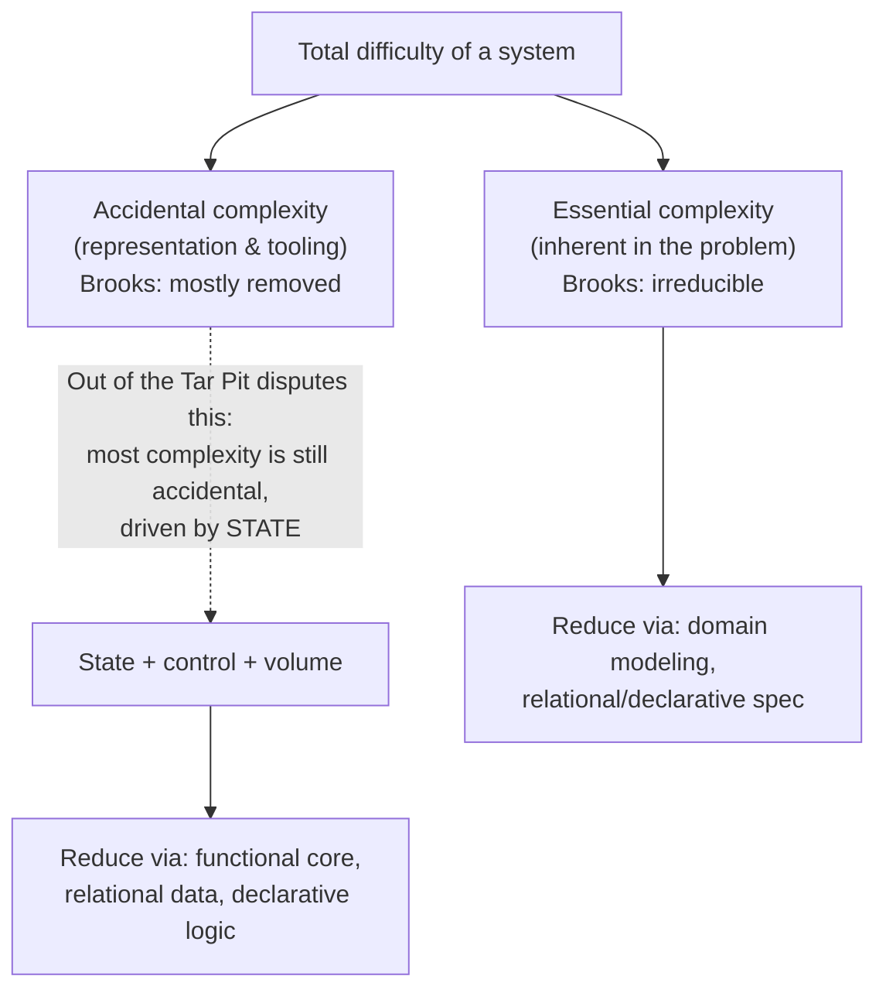
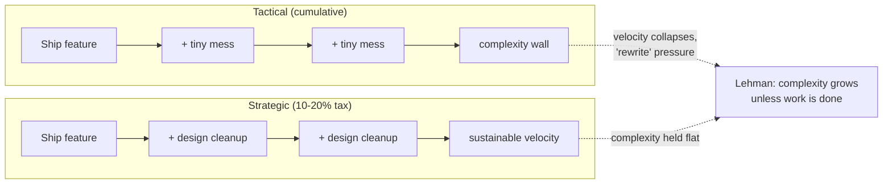

# Deep Modules & Complexity — Professional Level

> Focus: the *theory of complexity* — Brooks's essential/accidental split, Moseley & Marks's claim that state is the prime mover, Ousterhout's symptoms/causes model and his critique of small-methods dogma, Lehman's laws and software entropy, the validity debate around complexity metrics, and the economics of technical debt. Where the senior file teaches you to *spot* shallow modules, this file equips you to *reason about complexity as a field* and defend design decisions with the literature.

---

## Table of Contents

1. [Brooks: essential vs accidental complexity](#brooks-essential-vs-accidental-complexity)
2. [Out of the Tar Pit: state is the prime mover](#out-of-the-tar-pit-state-is-the-prime-mover)
3. [Ousterhout's model, formalized](#ousterhouts-model-formalized)
4. [Tactical vs strategic, and the incremental nature of complexity](#tactical-vs-strategic-and-the-incremental-nature-of-complexity)
5. [Ousterhout vs Clean Code: the small-methods dispute](#ousterhout-vs-clean-code-the-small-methods-dispute)
6. [Lehman's laws and software entropy](#lehmans-laws-and-software-entropy)
7. [Measuring complexity — and the validity debate](#measuring-complexity--and-the-validity-debate)
8. [Cognitive dimensions of notation](#cognitive-dimensions-of-notation)
9. [The economics of complexity](#the-economics-of-complexity)
10. [Accidental complexity from tooling and frameworks](#accidental-complexity-from-tooling-and-frameworks)
11. [Common Mistakes](#common-mistakes)
12. [Test Yourself](#test-yourself)
13. [Cheat Sheet](#cheat-sheet)
14. [Summary](#summary)
15. [Further Reading](#further-reading)
16. [Related Topics](#related-topics)

---

## Brooks: essential vs accidental complexity

Fred Brooks's 1986 essay *No Silver Bullet — Essence and Accident in Software Engineering* (reprinted in the 1995 anniversary edition of *The Mythical Man-Month*) frames the entire discipline. He partitions the difficulty of building software into two categories, borrowed from Aristotle:

- **Essential complexity** — the complexity *inherent in the problem itself*: the tangled set of concepts, the data, the relationships, the invariants the domain demands. A payroll system is essentially complex because tax law is complex; no notation removes that.
- **Accidental complexity** — the complexity that arises from the *representation and tooling* we choose, not from the problem: clumsy languages, manual memory management, build incantations, framework ceremony.

Brooks's central, and most-debated, claim:

> "I believe the hard part of building software to be the specification, design, and testing of this conceptual construct, not the labor of representing it and testing the fidelity of the representation. ... Much of the accidental complexity of software has already been removed by high-level languages, time-sharing, and unified programming environments."

He concludes that no single innovation — no "silver bullet" — will yield an order-of-magnitude productivity gain *in a decade*, because the remaining difficulty is essential, and essence cannot be abstracted away. The promising directions he lists are not tools but processes: buy rather than build, rapid prototyping, incremental "grow don't build," and great designers.

**Why this matters at the professional level.** The essential/accidental split is the vocabulary every later author writes against. When you argue "this framework's boilerplate is accidental complexity we can delete," you are invoking Brooks. The contested premise is the *quantitative* claim that accidental complexity is mostly gone — the next section disputes it directly.



---

## Out of the Tar Pit: state is the prime mover

Ben Moseley and Peter Marks's 2006 paper *Out of the Tar Pit* is the most rigorous modern follow-up to Brooks. It accepts the essential/accidental framing but **rejects Brooks's optimism**: in their experience the overwhelming majority of the complexity in real systems is *still accidental*, and most of it is self-inflicted.

Their ranking of the causes of complexity, from worst to least:

1. **State** — "The biggest cause of complexity... The reason that state is so problematic is that it interacts so badly with our ability to reason about programs." The number of possible states explodes combinatorially; testing can cover only a vanishing fraction; a bug observed in state *S* may be unreproducible because you cannot recreate *S*. Mutable shared state is the prime source of accidental complexity.
2. **Control flow** — the order in which things happen. Imperative code over-specifies sequencing the problem never required, forcing the reader to simulate an execution in their head.
3. **Code volume** — sheer quantity; a secondary effect that amplifies the first two.

Their prescription is a discipline they call **functional-relational programming (FRP — not to be confused with *functional reactive* programming)**:

- Separate the system into **essential state** (the minimal input that cannot be derived), **essential logic** (pure, derived definitions over that state, expressed *relationally/declaratively* — "what" not "how"), and an **accidental** layer (performance hints, infrastructure) kept strictly apart.
- Eliminate mutable state where possible; where it is genuinely essential, isolate it.
- Prefer **declarative** specification (relational algebra, logic) so the *what* is stated and the *how* is left to an evaluator.

> "The most important property of a piece of software is correctness... The second most important property is simplicity. ... We believe that the most important factor in producing simple software is the use of declarative rather than imperative approaches."

**The professional takeaway.** Deep modules (Ousterhout) and information hiding (Parnas) are *tactics*; minimizing state is the *strategy* that makes deep modules possible. A module is shallow and leaky precisely when it exposes its internal mutable state through its interface. This is why immutability and pure functions are not stylistic preferences but complexity-control mechanisms — see [Pure Functions](../15-pure-functions/README.md) and the [Functional Programming](../../functional-programming/README.md) section for the implementation discipline.

---

## Ousterhout's model, formalized

John Ousterhout's *A Philosophy of Software Design* (2nd ed., 2021) gives the most operational definition of complexity in the literature:

> "Complexity is anything related to the structure of a software system that makes it hard to understand and modify the system."

He decomposes it into **symptoms** and **causes**, which is the part professionals must keep distinct — you *observe* symptoms but you *fix* causes.

### The three symptoms

| Symptom | Definition | Field signal |
|---|---|---|
| **Change amplification** | A seemingly simple change requires modifications in many places | One conceptual edit → N file diffs; the same constant duplicated across N call sites |
| **Cognitive load** | How much a developer must know to complete a task | Onboarding takes weeks; a "small" change needs a domain expert |
| **Unknown-unknowns** | It is not obvious *which* code must change, or what a change might break | "I changed X and Y broke, and there was no way to predict that" |

Ousterhout argues unknown-unknowns are the **worst**: with the first two you at least know what you face; with the third you don't know what you don't know, so you cannot even estimate the work or the risk.

### The two causes

Complexity has exactly two root causes in his model:

- **Dependencies** — a piece of code cannot be understood or modified in isolation; it is coupled to others. Dependencies are not eliminable (they are how software composes) but they should be *minimized and made obvious*.
- **Obscurity** — important information is not apparent: a non-obvious dependency, a misleading name, undocumented invariants, behavior that lives somewhere other than where you'd look. Obscurity is the gap between what the reader needs to know and what the code reveals.

He then offers a rough **additive cost model**:

```
C  =  Σ_p ( c_p × t_p )
```

where for each part *p* of the system, `c_p` is the complexity of that part and `t_p` is the fraction of developer time spent dealing with it. The point of the weighting is sharp: complexity in code you rarely touch barely matters; complexity in a hot, frequently-edited module dominates. **Optimize complexity where the time goes**, exactly as you'd optimize performance where the cycles go.

This is the most-quoted single definition in modern practitioner literature, but note its limits: `c_p` is not measurable on any agreed scale, and the model is illustrative rather than predictive. It is a *thinking tool*, not a metric.

---

## Tactical vs strategic, and the incremental nature of complexity

Ousterhout's most actionable distinction:

- **Tactical programming** — the goal is to get the feature working *now*. Each shortcut introduces a little complexity; individually each is justified ("it's just one special case"). The personified extreme is the **tactical tornado**: the developer who ships fastest, is praised by management, and leaves a wake of complexity that everyone else pays for.
- **Strategic programming** — the goal is a *good design*; working code is necessary but not sufficient. You invest a small, continuous tax (Ousterhout suggests ~10–20% of dev time) in design improvements: better abstractions, refactoring as you go, documentation of non-obvious decisions.

The unifying observation is that **complexity is incremental**:

> "Complexity isn't caused by a single catastrophic error; it accumulates in lots of small chunks. A single dependency or obscurity, by itself, is unlikely to affect much. ... However, if developers introduce a few of these every time, complexity accumulates rapidly. Once complexity accumulates, it is hard to eliminate."

The corollary is a **zero-tolerance** stance toward small messes — not because any one is harmful, but because the *rate* is what kills you. This is the rigorous justification for the [Boy Scout Rule](../README.md) and for treating each PR as a place to leave the design slightly better.

### "Design it twice"

A specific strategic technique: for any consequential design (a class interface, a module boundary), produce **two genuinely different** candidate designs and compare them against concrete scenarios. Even experts' first idea is rarely their best; the comparison surfaces trade-offs invisible when you commit to the first plausible structure. The cost is minutes; the payoff is avoiding a deep module that turns out shallow.



---

## Ousterhout vs Clean Code: the small-methods dispute

Ousterhout devotes part of *APoSD* (and a widely-circulated 2020 recorded discussion with Robert C. Martin) to a direct, substantive disagreement with *Clean Code*'s style rules. This is essential context because both books are canonical and they *contradict each other*. A professional must be able to articulate both sides.

**Martin (Clean Code):** functions should be very small — "the first rule of functions is that they should be small; the second rule is that they should be smaller than that" — and should "do one thing." Extract aggressively; a function of 4 lines is fine.

**Ousterhout's critiques:**

1. **Length is the wrong target.** "The most important thing is the depth of the module, not its length." Splitting a method does not reduce total complexity; it can *increase* it by adding interfaces (each a new dependency) and by scattering related logic.
2. **Shallow methods proliferate.** Aggressive extraction produces many tiny methods whose interfaces are nearly as complex as their bodies — the classic *shallow module*. The reader must now chase a chain of one-line methods to understand one operation (Ousterhout's "**conjoined methods**" — methods that cannot be understood independently because each only makes sense in the context of the others).
3. **Comments as a code smell is wrong.** Clean Code treats the need for a comment as a failure to make code self-documenting. Ousterhout argues comments capture information *that cannot be expressed in code* — the why, the invariants, the rejected alternatives — and that "self-documenting code" is frequently an excuse to omit necessary documentation. Obscurity (a cause of complexity) is reduced *by* good comments, not by deleting them.

**The synthesis (what to actually do):** the two camps agree more than the debate suggests. Both want low cognitive load and clear boundaries. The disagreement is about *means*: Martin reaches for extraction by default; Ousterhout reaches for depth and warns that extraction has a cost (the interface). The defensible professional position: **extract when it produces a deeper abstraction or removes a real dependency; do not extract merely to hit a line count.** A 40-line method with a single clear purpose and a narrow interface is a *deep* module and is fine; five 8-line methods that must be read together are *shallower* and worse. Measure by interface-to-implementation ratio, not by length. See [Abstraction & Information Hiding](../22-abstraction-and-information-hiding/README.md) for the depth metric in full.

---

## Lehman's laws and software entropy

Manny Lehman and Laszlo Belady studied IBM OS/360 releases over decades and derived the **Laws of Software Evolution** (1974, refined through 1996). Three are load-bearing for complexity:

- **I — Continuing Change.** "A program that is used must be continually adapted, else it becomes progressively less satisfactory." A system that is touched cannot stand still relative to its environment.
- **II — Increasing Complexity.** "As a program is evolved its complexity increases unless work is done to maintain or reduce it." This is the formal statement of **software entropy**: left alone, structure decays. Complexity is the default direction; order is the thing you must spend energy to preserve.
- **VI/VII — Continuing Growth & Declining Quality.** Functional content must grow to satisfy users; and perceived quality declines unless the system is rigorously adapted.

The thermodynamic analogy is apt and worth stating precisely: an isolated software system does not literally gain entropy on its own (code is static text), but *every edit made under deadline pressure with imperfect knowledge* injects disorder. Lehman's Law II is therefore the empirical backbone of Ousterhout's "complexity is incremental" and the economic argument for the strategic tax: the ~10–20% investment is precisely the "work" Law II says must be done, or complexity *will* increase. The two authors describe the same phenomenon at different altitudes — Lehman the macro-empirical, Ousterhout the per-PR mechanism.

---

## Measuring complexity — and the validity debate

Professionals are routinely asked "what's our complexity, and is it predicting bugs?" The honest answer requires knowing what the metrics actually measure and where the empirical record is mixed.

### Cyclomatic complexity (McCabe, 1976)

Defined on the control-flow graph *G* as:

```
v(G) = E − N + 2P
```

(`E` edges, `N` nodes, `P` connected components). Operationally it equals **the number of linearly independent paths**, or more simply *1 + the number of decision points* (`if`, `case`, `&&`, `||`, loops). McCabe proposed `10` as a per-module ceiling. Its undisputed value: it is a **lower bound on the number of test cases** needed for branch coverage, and it is cheap to compute.

**The validity debate.** Does `v(G)` predict defects? The empirical record is genuinely mixed:

- Many studies find a correlation between cyclomatic complexity and defect density — but the correlation **largely disappears once you control for size (SLOC)**. The seminal critique is Les Hatton and others; the practical conclusion of much research is that `v(G)` is *strongly collinear with lines of code*, so it adds little predictive power beyond "bigger modules have more bugs." In other words, the metric may be measuring length wearing a disguise.
- It is blind to the dimensions that actually drive cognitive load: data flow, nesting depth (a flat 10-way `switch` scores the same as deeply nested logic of equal `v(G)`, though the nested version is far harder to read), and coupling between modules. It measures *one* method in isolation and says nothing about dependencies — which is *half* of Ousterhout's causes.

### Cognitive complexity (Campbell / SonarSource, 2018)

An explicit attempt to fix the readability blindness of `v(G)`: it does **not** count a `switch` as N points (humans read it as one decision), but it **adds penalties for nesting** (each level of nesting increments the cost of an enclosed branch) and for breaks in linear flow. It correlates better with subjective "this is hard to read" judgments. But it is a *maintainability* heuristic with no claim to defect prediction, and it is tool-specific (not a standard).

### Halstead metrics (1977)

Derived from counts of distinct/total operators and operands: *volume*, *difficulty*, *effort*, and a *predicted bug count* `B = V / 3000`. Historically influential, today largely deprecated for prediction — the constants are unvalidated on modern code and the measures, again, track size.

### Goodhart and the limits of metrics

> "When a measure becomes a target, it ceases to be a good measure." — Goodhart's Law (Marilyn Strathern's formulation).

Set a CI gate at `v(G) ≤ 10` and engineers will *split methods to pass the gate* — extracting shallow helpers (exactly the anti-pattern Ousterhout warns about), moving the complexity to the *call graph* where the metric can't see it. The system's complexity is unchanged or worse; the dashboard is green. This is the central professional caution: **complexity metrics are useful as triage signals (find the outliers, look at them) and as test-case lower bounds, but they are invalid as targets and weak as defect predictors once size is controlled.** Treat a high score as "go read this and form a human judgment," never as "this is bad, auto-reject."

| Metric | Measures | Predicts defects? | Right use |
|---|---|---|---|
| Cyclomatic `v(G)` | independent paths in one method | weakly; collinear with SLOC | test-case lower bound; outlier triage |
| Cognitive complexity | human read-difficulty (nesting-aware) | not claimed | readability triage |
| Halstead | operator/operand vocabulary | historically; now deprecated | mostly historical |
| Coupling/instability (CBO, fan-in/out) | inter-module dependencies | moderately | architectural review — the *other* Ousterhout cause |
| Maintainability Index | composite of the above | weak | dashboards (treat with suspicion) |

---

## Cognitive dimensions of notation

Thomas Green and Marian Petre's **Cognitive Dimensions of Notations** (1996) is the under-used framework that connects *code as a notation* to *human reasoning cost* — it gives vocabulary for the obscurity half of Ousterhout's model. A few dimensions every API/language designer should know:

- **Viscosity** — resistance to change; how much work a small intended change actually costs (Ousterhout's change amplification, named from the HCI side).
- **Hidden dependencies** — relationships not visible at the point you need them (a global mutated elsewhere; a config key consumed three layers away). This is precisely Ousterhout's *obscurity*, and it is the single most damaging dimension for unknown-unknowns.
- **Hard mental operations** — places where the reader must hold many things in working memory (deeply nested ternaries, pointer arithmetic).
- **Premature commitment** — being forced to decide before you have the information (a constructor that demands all 12 fields up front).
- **Error-proneness** — does the notation invite mistakes (1-based vs 0-based, `=` vs `==`)?

The value of the framework is that it makes complexity *discussable as design trade-offs* rather than gut feel: improving one dimension often worsens another (reducing viscosity via abstraction can add hidden dependencies). It is the academic complement to both Ousterhout (practitioner) and the metrics literature (quantitative).

---

## The economics of complexity

Ward Cunningham's **technical-debt metaphor** (1992) is the economic model professionals use to justify the strategic tax to non-engineers. Cunningham's original framing was nuanced: shipping a not-quite-right understanding is like borrowing — useful if you *refactor to repay it once you learn more*. The metaphor only works if you also model the **interest**.

The interest on complexity debt is what makes it dangerous and what distinguishes it from financial debt:

- **It compounds.** Each shortcut makes the *next* change in that area more expensive (more state to reason about, more hidden dependencies). The cost of a change in a complex module is higher, *and* that change tends to add more complexity, so the interest rate itself rises. Lehman's Law II is the compounding mechanism.
- **It is paid by everyone, forever, until repaid.** The tactical tornado borrows; the whole team services the interest on every future PR through slower delivery and more defects.

A simple compounding model makes the strategic case quantitative. If a module accretes complexity at rate *r* per period and the cost of change scales with accumulated complexity, the cost of a change at period *n* grows roughly like:

```
cost_n  ≈  cost_0 × (1 + r)^n
```

— exponential, not linear. The strategic tax (paying down principal continuously) keeps *r* near zero, flattening the curve. This is why "we'll clean it up later" is almost always a losing trade: "later" the principal is larger *and* compounded. Martin Fowler's **technical-debt quadrant** (deliberate/inadvertent × prudent/reckless) is the useful refinement for *which* debt to tolerate: deliberate-prudent debt ("we ship now and refactor next sprint, knowing the trade-off") is legitimate; reckless-inadvertent debt ("what's layering?") is pure loss.

---

## Accidental complexity from tooling and frameworks

Brooks believed tooling had *removed* most accidental complexity. The professional reality four decades later, with Moseley & Marks's lens, is that the tooling ecosystem is now itself a major *source* of accidental complexity. Examples to recognize and resist:

- **Framework ceremony.** A "hello world" microservice can require a dozen annotations, a DI container, a build plugin chain, and YAML across three files — none of which is essential to the problem. The accidental layer has *grown*, not shrunk.
- **Configuration sprawl.** State externalized into environment variables, feature flags, and config servers reintroduces Moseley & Marks's prime evil — mutable state — outside the type system, where it is invisible to the compiler and to most reasoning. See [Configuration & Feature Flags](../README.md) for containment tactics.
- **Generated and reflective code.** ORMs, codegen, and reflection create *hidden dependencies* (Green & Petre) — behavior that exists at runtime but not in any file you can grep. This directly manufactures unknown-unknowns.
- **Dependency depth.** A transitive dependency tree of thousands of packages is accidental complexity: each is a module you cannot understand, with its own state and its own evolution under Lehman's laws.

Illustrations across languages:

```go
// Go's stdlib bias keeps accidental complexity low: explicit errors, no DI magic,
// one binary. The cost is verbosity (essential? arguably). The win is that
// `go build` + grep can answer "what runs here" — few hidden dependencies.
func (s *Service) Handle(ctx context.Context, r Req) (Resp, error) { /* ... */ }
```

```java
// Spring trades verbosity for hidden dependencies: behavior is wired by the
// container at runtime via annotations. Convenient — but a @Transactional proxy,
// an aspect, or a conditional bean can change behavior with no visible call site.
@Service
class OrderService {            // who calls this? what advice wraps it? -> unknown-unknown
    @Transactional public void place(Order o) { /* ... */ }
}
```

```python
# Python's dynamism is power and accidental complexity at once: monkeypatching,
# metaclasses, and **kwargs pass-through erase the interface, maximizing hidden
# dependencies. A function that takes **kwargs has, in Ousterhout's terms, no
# real interface at all -- the reader cannot know what is legal without the body.
def handle(**kwargs):  # premature-commitment-free, but obscurity-maximal
    ...
```

The professional judgment: a framework is worth its accidental complexity only when it removes *more* essential complexity than it adds accidental — and that ledger must be checked, not assumed. "Boring" stacks win because their accidental complexity is low and *legible*.

---

## Common Mistakes

- **Treating a metric as the goal.** Gating CI on `v(G) ≤ 10` causes engineers to split methods into shallow helpers — moving complexity to the call graph where the metric is blind. Goodhart's Law in action; the system gets worse while the dashboard goes green.
- **Equating "small functions" with "low complexity."** Length is not Ousterhout's metric; depth is. Aggressive extraction can raise total complexity by multiplying interfaces and creating conjoined methods.
- **Citing Brooks's optimism as current fact.** "Accidental complexity is mostly gone" was contestable in 1986 and is contradicted by *Out of the Tar Pit*; today's framework and dependency sprawl is largely accidental.
- **Confusing symptoms with causes.** Logging "change amplification" as the *problem* and adding tooling to make multi-file edits faster treats the symptom; the cause is a missing abstraction (a dependency or obscurity) that should be removed.
- **Ignoring state as the prime mover.** Chasing control-flow tidiness (early returns, guard clauses) while leaving shared mutable state untouched optimizes the secondary cause and ignores the primary one.
- **"We'll fix it later" without modeling interest.** Complexity debt compounds; "later" the principal is larger and the surrounding code is harder to change. Deliberate-prudent debt is fine; the unpriced kind is a losing trade.
- **Believing self-documenting code removes the need for comments.** Comments carry information *not expressible in code* (the why, the invariants, the rejected alternatives). Deleting them increases obscurity — a root cause of complexity.

---

## Test Yourself

**1. A reviewer rejects a 45-line method "because Clean Code says functions must be small," and asks you to split it into six helpers. Argue the professional position.**

<details><summary>Answer</summary>

Length is the wrong target (Ousterhout); depth is the right one. If the 45-line method has a single clear purpose and a narrow interface, it is a *deep* module — its implementation is large relative to a small interface, which is exactly what you want. Splitting it into six helpers that must be read together creates *shallow, conjoined methods*: the reader now chases six interfaces to understand one operation, and total complexity (the thing we actually care about) goes *up* because each helper is a new dependency. Extract only when a piece is a genuine reusable abstraction or removes a real dependency — not to satisfy a line count. The synthesis: both camps want low cognitive load; they disagree on means, and extraction has a cost (the interface) that must pay for itself.
</details>

**2. Your CI dashboard shows average cyclomatic complexity dropped 30% after a "refactoring sprint," but bug rates didn't change. Explain.**

<details><summary>Answer</summary>

Two compounding facts. (a) `v(G)` is largely collinear with SLOC; once you control for size it adds little defect-prediction power, so moving it doesn't necessarily move bugs. (b) Goodhart: a sprint *targeting* the metric likely split methods into helpers, relocating complexity to the call graph (coupling, hidden dependencies) where `v(G)` — which measures one method in isolation — can't see it. The metric improved without the system's actual complexity (dependencies + obscurity) improving. Cyclomatic complexity is a triage signal and a test-case lower bound, not a target.
</details>

**3. Per *Out of the Tar Pit*, rank the causes of complexity and name the prescribed discipline.**

<details><summary>Answer</summary>

Worst to least: **state** (combinatorial state explosion destroys our ability to reason and reproduce bugs), then **control flow** (over-specified sequencing), then **code volume** (amplifier). The prescription is **functional-relational programming**: separate essential state (minimal, non-derivable input) from essential logic (pure, derived, expressed *declaratively/relationally* — "what" not "how") from a strictly-isolated accidental layer (performance/infrastructure). Minimize mutable state; prefer declarative over imperative. This is the strategic foundation under the tactic of "deep modules."
</details>

**4. Distinguish Ousterhout's three symptoms and say which is worst and why.**

<details><summary>Answer</summary>

*Change amplification* — one conceptual change needs many edits. *Cognitive load* — how much you must know to make a change. *Unknown-unknowns* — you can't tell what must change or what a change might break. The worst is **unknown-unknowns**: with the other two you at least know the scope and can estimate/mitigate; with unknown-unknowns you don't know what you don't know, so you cannot estimate the work or the risk, and you discover breakage only in production. The cure is reducing *obscurity* (one of the two root causes) so the system reveals what depends on what.
</details>

**5. Tie Lehman's Law II to Ousterhout's strategic tax and Cunningham's debt metaphor into one argument.**

<details><summary>Answer</summary>

Lehman II: complexity increases *unless work is done to reduce it* — software entropy is the default direction. Ousterhout's ~10–20% strategic investment *is* that work; skip it and Law II guarantees complexity climbs. Cunningham models the cost: complexity is debt whose interest **compounds** (each shortcut makes the next change in that region costlier, and that change adds more complexity, raising the rate). So `cost_n ≈ cost_0 × (1+r)^n` — exponential. The strategic tax pays down principal continuously, holding *r* near zero and flattening the curve. Three authors, one phenomenon at three altitudes: empirical law, per-PR mechanism, economic model.
</details>

**6. A team adopts a heavyweight DI framework to "reduce complexity." Critique using Brooks and Moseley & Marks.**

<details><summary>Answer</summary>

Brooks: a framework can only help if it removes *essential* difficulty; wiring objects is rarely the essential hardness of the domain. Moseley & Marks: the DI container adds **accidental** complexity — runtime wiring creates *hidden dependencies* (no visible call site for who instantiates/advises a bean), manufacturing unknown-unknowns, and config-driven beans push behavior into externalized mutable state, the prime evil. The honest ledger: a framework earns its accidental complexity only if it removes *more* essential complexity than it adds accidental. For object wiring that ledger usually comes out negative versus explicit construction; "boring," legible stacks win because their accidental complexity is low and greppable.
</details>

---

## Cheat Sheet

| Concept | One-line essence | Source |
|---|---|---|
| Essential vs accidental | Inherent-to-problem vs imposed-by-tooling; only accidental is removable | Brooks 1986 |
| No silver bullet | No single advance gives 10× in a decade — the rest is essence | Brooks 1986 |
| State is the prime mover | Mutable state, not control flow, dominates accidental complexity | Moseley & Marks 2006 |
| Functional-relational | Separate essential state / declarative logic / accidental layer | Moseley & Marks 2006 |
| Complexity definition | Anything structural that makes a system hard to understand/modify | Ousterhout 2021 |
| Symptoms | Change amplification, cognitive load, unknown-unknowns (worst) | Ousterhout 2021 |
| Causes | Dependencies + obscurity (everything reduces to these two) | Ousterhout 2021 |
| Depth > length | Optimize interface-to-implementation ratio, not line count | Ousterhout 2021 |
| Tactical vs strategic | Pay a 10–20% design tax or accrue complexity incrementally | Ousterhout 2021 |
| Design it twice | Compare two real alternatives before committing | Ousterhout 2021 |
| Lehman's Law II | Complexity rises unless work is done — software entropy | Lehman 1974–96 |
| Cyclomatic `v(G)` | `E−N+2P`; test-case lower bound; weak defect predictor (size-collinear) | McCabe 1976 |
| Cognitive complexity | Nesting-aware readability heuristic; not a defect predictor | SonarSource 2018 |
| Goodhart's Law | A metric used as a target stops being a good measure | Strathern 1997 |
| Hidden dependencies | Relationships invisible where you need them = obscurity | Green & Petre 1996 |
| Technical debt + interest | Complexity debt compounds; price the interest or lose | Cunningham 1992; Fowler |

---

## Summary

The professional view of complexity is built from a small canon that mostly agrees across forty years. **Brooks** gave the vocabulary — essential (irreducible) versus accidental (tooling-imposed) — and the sober claim that no silver bullet abolishes the essential part. **Moseley & Marks** contested his optimism and located the prime source of *accidental* complexity in **state**, with control flow and volume behind it, prescribing functional-relational, declarative design to minimize all three. **Ousterhout** operationalized complexity into observable *symptoms* (change amplification, cognitive load, the dreaded unknown-unknowns) and two *causes* (dependencies and obscurity), and reframed the daily choice as **tactical vs strategic** programming over an inescapably **incremental** accumulation — while sharply disputing *Clean Code*'s small-methods dogma in favor of module *depth*. **Lehman** supplied the empirical law that complexity rises unless work is spent against it, the entropy backbone under the strategic tax. The **metrics** literature warns that our measures (cyclomatic, Halstead, even cognitive complexity) are weak defect predictors largely collinear with size and become actively harmful as targets (Goodhart) — useful for triage, invalid as gates. **Green & Petre** name the human-facing dimensions (hidden dependencies, viscosity) and **Cunningham/Fowler** the economics (compounding interest). The throughline: complexity is the default, fought only by minimizing state, building deep modules, and paying the strategic tax continuously — because the alternative compounds.

---

## Further Reading

- Frederick P. Brooks, *No Silver Bullet — Essence and Accident in Software Engineering* (1986); reprinted in *The Mythical Man-Month*, anniversary ed. (1995).
- Ben Moseley & Peter Marks, *Out of the Tar Pit* (2006). The definitive modern statement that state is the prime source of complexity.
- John Ousterhout, *A Philosophy of Software Design*, 2nd ed. (2021). Chapters on complexity, deep modules, tactical/strategic, and the comments chapter.
- The recorded Ousterhout–Robert C. Martin discussion (2020) on the *Clean Code* style disagreements — read alongside *Clean Code* ch. 3 ("Functions").
- M. M. Lehman, "Programs, Life Cycles, and Laws of Software Evolution," *Proc. IEEE* 68(9) (1980); Lehman & Belady, *Program Evolution* (1985).
- Thomas J. McCabe, "A Complexity Measure," *IEEE TSE* SE-2(4) (1976).
- G. Ann Campbell (SonarSource), *Cognitive Complexity — A new way of measuring understandability* (2018).
- Maurice Halstead, *Elements of Software Science* (1977).
- Thomas Green & Marian Petre, "Usability Analysis of Visual Programming Environments: A 'Cognitive Dimensions' Framework," *JVLC* 7(2) (1996).
- Ward Cunningham, "The WyCash Portfolio Management System" (OOPSLA '92 experience report) — origin of the debt metaphor; Martin Fowler, "Technical Debt Quadrant" (2009).
- Goodhart's Law as formulated by Marilyn Strathern, "'Improving ratings': audit in the British University system" (1997).

---

## Related Topics

- [Deep Modules & Complexity — Senior](senior.md) — spotting shallow modules and applying the tactics in code review.
- [Deep Modules & Complexity — Interview](interview.md) — Q&A across all levels.
- [Chapter README](../README.md) — the positive rules and anti-patterns.
- [Abstraction & Information Hiding](../22-abstraction-and-information-hiding/README.md) — module depth, the depth metric, hiding decisions.
- [Cognitive Load](../20-cognitive-load/README.md) — the reader's working-memory cost; the per-developer side of complexity.
- [Pure Functions](../15-pure-functions/README.md) — eliminating state, the prime mover of complexity.
- [Functional Programming](../../functional-programming/README.md) — the declarative discipline *Out of the Tar Pit* prescribes.
