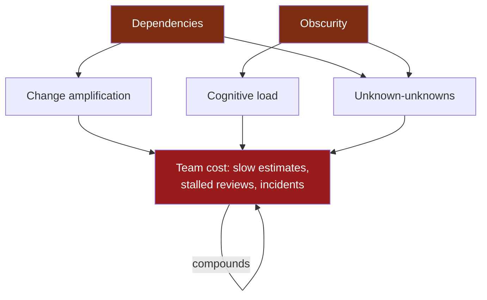
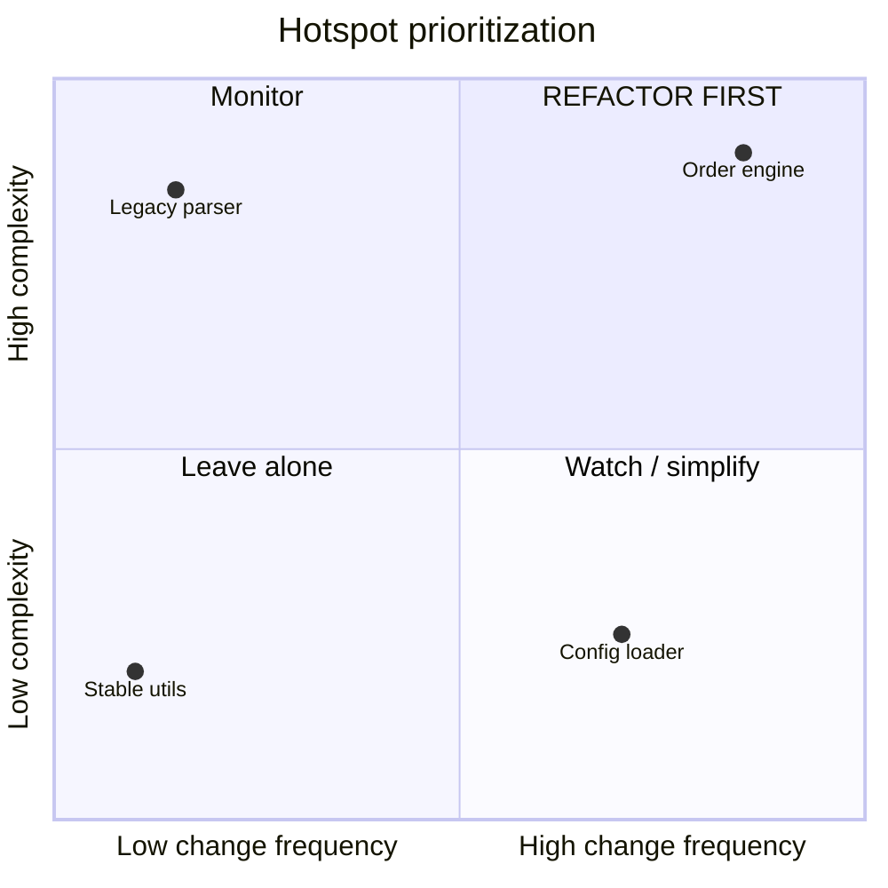
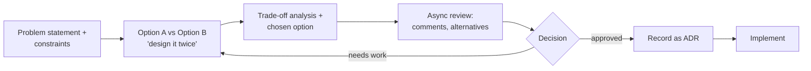

# Deep Modules & Complexity — Senior Level

> Focus: "How do we keep complexity down across a whole system and a whole team?" Strategic programming as a team norm, measuring complexity trends with real tooling, consolidating decisions to kill change amplification, and the economics of tactical debt. For the mechanics of *building* a deep module, see [Abstraction & Information Hiding](../22-abstraction-and-information-hiding/README.md) (ch22).

---

## Table of Contents

1. [The senior reframe: complexity is a team-level metric](#the-senior-reframe-complexity-is-a-team-level-metric)
2. [Strategic vs. tactical programming as a team norm](#strategic-vs-tactical-programming-as-a-team-norm)
3. [The economics of complexity: tactical debt and its interest](#the-economics-of-complexity-tactical-debt-and-its-interest)
4. [Measuring complexity trends with real tools](#measuring-complexity-trends-with-real-tools)
5. [Change-coupling and temporal-coupling analysis](#change-coupling-and-temporal-coupling-analysis)
6. [Hotspot analysis: churn × complexity](#hotspot-analysis-churn--complexity)
7. [Reducing change amplification by consolidating decisions](#reducing-change-amplification-by-consolidating-decisions)
8. [Fighting obscurity at scale: ADRs, conventions, tribal knowledge](#fighting-obscurity-at-scale-adrs-conventions-tribal-knowledge)
9. [Design reviews and "design it twice" as a practice (RFCs)](#design-reviews-and-design-it-twice-as-a-practice-rfcs)
10. [Knowing when to invest vs. ship](#knowing-when-to-invest-vs-ship)
11. [Common Mistakes](#common-mistakes)
12. [Test Yourself](#test-yourself)
13. [Cheat Sheet](#cheat-sheet)
14. [Summary](#summary)
15. [Further Reading](#further-reading)
16. [Related Topics](#related-topics)

---

## The senior reframe: complexity is a team-level metric

At the junior and middle levels, complexity is something *you* feel when *you* read a function. At the senior level, complexity is something the **system** has and the **team** pays for — every sprint, in every estimate, in every onboarding.

Ousterhout's definition is the one that scales: **complexity is anything related to the structure of a system that makes it hard to understand or modify.** He decomposes it into three symptoms and two causes:

| | Name | What a senior observes at scale |
|---|---|---|
| Symptom | **Change amplification** | "Small" features routinely touch 8–15 files across 3 services |
| Symptom | **Cognitive load** | New hires take a quarter to ship safely; reviews stall on "wait, why?" |
| Symptom | **Unknown-unknowns** | Incidents caused by edits in code nobody flagged as related |
| Cause | **Dependencies** | A change here forces a change there — visible as change-coupling |
| Cause | **Obscurity** | The information needed to make a change isn't obvious — tribal knowledge, missing ADRs |

The senior job is to make these **measurable** so they become tractable. You cannot manage a backlog of "the code feels bad." You *can* manage "these four files have 70% temporal coupling and absorb 30% of our commits."



> Complexity is not paid once. It is a *recurring tax* on every future change. That recurrence — the compounding — is what makes it an economic problem, not just an aesthetic one.

---

## Strategic vs. tactical programming as a team norm

Ousterhout's central distinction:

- **Tactical programming** optimizes for getting *this* feature working *now*. Each shortcut is individually rational and individually cheap. The complexity it adds is invisible in the moment.
- **Strategic programming** treats working code as necessary but insufficient. The real goal is a *good design* — one that stays cheap to change. You invest a little extra now to avoid paying interest later.

The senior insight: **this is not an individual virtue, it is a team policy.** One strategic engineer surrounded by tactical pressure loses. The complexity from everyone else's shortcuts swamps their careful work, and they get blamed for being "slow."

### The tactical tornado

The most dangerous person on a tactical team is the **tactical tornado**: the prolific engineer who ships features faster than anyone — by leaving a wake of complexity that *others* clean up. Management often rewards them because output is visible and the cost is deferred and diffuse. A senior's job is to make that cost visible (see hotspot analysis below) so the incentive structure stops rewarding it.

### Budgeting design quality (~10–20%)

Ousterhout's recommendation, and a defensible team norm: spend roughly **10–20% of total effort on design quality** — not as a separate "refactoring sprint" that gets cut under pressure, but folded into every change. Concretely:

- Every feature ticket includes the cost of leaving the touched code *cleaner than you found it* (the [Boy Scout Rule](../21-boy-scout-rule/README.md) made budgetary).
- Estimates explicitly include "design it twice" time for non-trivial work.
- The team agrees that "make it work" is not "done" — "done" includes the abstraction being deep enough that the *next* change is cheap.

> **The schedule-pressure trap.** Under deadline, tactical programming feels faster and *is* faster — for about two months. Then change amplification and cognitive load make every subsequent feature slower than it would have been. A senior's role is to defend the 10–20% against the quarter-by-quarter pressure to cut it, using data (velocity trends, hotspot growth) rather than appeals to craftsmanship.

---

## The economics of complexity: tactical debt and its interest

Treat complexity as debt with a literal interest model — this is the framing that gets traction with engineering managers and product.

| Term | Software meaning |
|---|---|
| **Principal** | The clean redesign you skipped to ship faster |
| **Interest** | The extra time every future change costs because you skipped it |
| **Compounding** | New code built *on top of* the shortcut inherits and multiplies the cost |
| **Default** | The module becomes so tangled that change is effectively impossible — a rewrite |

The critical property is **compounding**. A single shortcut is cheap. But the next engineer builds on it, copies its pattern, and works around its quirks. Six months later the "small" shortcut is load-bearing and entangled with twenty other things. The interest rate rose because the principal grew.

A useful mental model for *when interest dominates*:

```
total_cost(change) ≈ intrinsic_cost + (coupling_factor × n_touched_modules)
```

Tactical programming drives `coupling_factor` and `n_touched_modules` up. Strategic programming — deep modules, consolidated decisions — drives them down. The same feature that costs 2 days in a low-coupling system costs 2 weeks in a high-coupling one, and the gap *widens* over time.

> **What this is not.** Not all debt is bad. *Deliberate, documented* tactical debt taken to hit a real market window is a legitimate business decision — provided it's tracked and paid down. The pathology is *unconscious, undocumented, never-repaid* tactical debt: complexity that accretes one "harmless" special case at a time with no one watching the total.

---

## Measuring complexity trends with real tools

You manage what you measure. Static per-snapshot complexity is useful; **trends** are what tell you whether the team is winning or losing.

### Cyclomatic and cognitive complexity dashboards

- **SonarQube / SonarCloud** — the standard for trend dashboards. It tracks **cognitive complexity** (penalizes nesting, closer to human reading cost) and **cyclomatic complexity** (decision-point count, useful for test-path planning) per function, with history. Key features for a senior: the **Quality Gate** (fail PRs that worsen complexity on *new* code), the **leak period / "new code" model** (don't fail on legacy debt, only on regressions), and complexity *evolution* charts.
- **Per-language CLI gates** wired into CI:
  - **Go** — `golangci-lint` with `gocyclo`, `gocognit`, `funlen`, `cyclop` (package-level). Example threshold config below.
  - **Java** — Checkstyle (`CyclomaticComplexity`, `ClassFanOutComplexity`), PMD (`CognitiveComplexity`, `GodClass`), or SonarQube.
  - **Python** — `radon cc` / `radon mi` (maintainability index), `ruff` (`C901` mccabe complexity), `xenon` to *fail* CI on a complexity grade.

```yaml
# .golangci.yml — fail the build when functions exceed cognitive/length budgets
linters:
  enable: [gocognit, gocyclo, funlen, cyclop]
linters-settings:
  gocognit:
    min-complexity: 20      # cognitive complexity ceiling per func
  gocyclo:
    min-complexity: 15
  funlen:
    lines: 60
    statements: 40
  cyclop:
    max-complexity: 20      # per-function
    package-average: 8.0    # the team-scale signal: average across the package
```

```bash
# Python: gate the maintainability index in CI (xenon fails on grade regressions)
xenon --max-absolute B --max-modules A --max-average A src/

# Quick per-file cognitive complexity ranking to find the worst offenders
radon cc -s -n C src/ | sort -k4 -t'(' -r
```

```java
// Java: ArchUnit as a fitness function — assert architectural invariants in a test
@ArchTest
static final ArchRule core_must_not_depend_on_web =
    noClasses().that().resideInAPackage("..core..")
               .should().dependOnClassesThat().resideInAPackage("..web..");
```

> The senior move is **direction over absolute value**. A team at average complexity 12 trending to 18 is in trouble; a team flat at 15 is fine. Put the *trend line* on a dashboard the whole team sees.

---

## Change-coupling and temporal-coupling analysis

Cyclomatic complexity is *intra*-file. The bigger team-scale signal is *inter*-file: **which files change together?** Two files that always change in the same commit are **temporally coupled** — there's a hidden dependency the type system never declared. This is the measurable face of Ousterhout's "dependencies" cause and the direct driver of change amplification.

You don't need a vendor tool to start — it's in your Git history:

```bash
# Files that most often change together with a given file (poor man's change coupling).
# For each commit touching the target, list co-changed files; rank by frequency.
git log --pretty=format:'@%H' --name-only -- internal/billing/invoice.go \
  | awk '/^@/{next} NF{print}' \
  | sort | uniq -c | sort -rn | head -20
```

```bash
# Repo-wide: pairs of files that co-occur in commits most often.
git log --pretty=format:'@' --name-only \
  | awk '/^@/{for(i=0;i<n;i++)for(j=i+1;j<n;j++)print a[i]"\t"a[j]; n=0; next}
         NF{a[n++]=$0}' \
  | sort | uniq -c | sort -rn | head -30
```

**CodeScene** (Adam Tornhill, *Your Code as a Crime Scene* / *Software Design X-Rays*) productizes this as **change coupling** and **temporal coupling** maps, including coupling *across* repos and the "**modus operandi**" of how a file tends to be changed. The senior reading:

- High coupling between files that *should* be independent (e.g., a controller and a deep-down SQL helper) = a leaked abstraction. Fix by consolidating the decision into one module.
- High coupling between files in *different services* = a distributed monolith forming. Change amplification now crosses a network boundary, the worst place for it.
- A file coupled to *many* others = a likely god module or a missing abstraction layer.

---

## Hotspot analysis: churn × complexity

The single highest-leverage prioritization tool for a senior. Most complex code doesn't matter — a 4,000-line file untouched in three years costs nothing. The code that hurts is **complex AND frequently changed**. That intersection is a **hotspot**.

```
hotspot_priority = change_frequency (git churn) × complexity (LOC or cognitive)
```

```bash
# Churn ranking: files by number of commits that touched them (last year).
git log --since='1 year ago' --name-only --pretty=format: \
  | sort | uniq -c | sort -rn | head -25
```

Combine that with `cloc` or a complexity score per file and you get a 2×2:



- **Top-right (high churn, high complexity)** — refactor first. Highest interest payments; refactoring here pays back fastest.
- **Top-left (high complexity, low churn)** — *leave it alone* unless a change forces you in. Refactoring it is a vanity project.
- **Bottom-right (high churn, low complexity)** — healthy; keep it that way.

**CodeScene** automates this (hotspots, "X-Ray" intra-file hotspot drill-down, and **knowledge maps** showing bus-factor risk per hotspot — who owns it). For a no-cost start, scripts like `git-of-theseus` or a `cloc`-plus-`git-log` join give you 80% of the value. The deliverable is a **ranked, dated list of refactoring targets** that you can defend to product because it's tied to where the team actually spends time.

---

## Reducing change amplification by consolidating decisions

Change amplification means one conceptual decision is **scattered** across many places, so changing it requires editing all of them — and missing one causes a bug (an unknown-unknown). The cure is structural: **each design decision should be encapsulated in exactly one place.** This is the system-scale version of building a deep module (ch22): the module owns a decision; everyone else asks it.

| Scattered decision (change amplification) | Consolidated (one source of truth) |
|---|---|
| Retry/backoff policy copy-pasted into every client | One `RetryPolicy` / middleware applied at the transport layer |
| Each service re-validating `userId` format differently | One typed `UserId` in a shared schema (`.proto`/`.avsc`); validation comes for free |
| Tax/pricing rule duplicated across 12 endpoints | One pricing module; endpoints call it |
| Date format / timezone handling done ad hoc per layer | One time-handling boundary; internal types are always UTC |
| Feature-flag checks sprinkled through business logic | One flag-evaluation gateway; business code receives a resolved config |

Concrete techniques a senior drives:

- **Pull the policy into a deep module.** A wide interface (many shallow methods that each expose an internal detail) re-scatters decisions; a deep interface (a small surface hiding a large, consolidated implementation) absorbs them. *Define errors out of existence* — design the interface so the special case doesn't exist (Ousterhout's example: a text class where deleting past the end is simply a no-op, eliminating callers' duplicated bounds checks).
- **Replace primitives with domain types at the boundary.** A `Money` type or a typed ID consolidates the "what's a valid X" decision into the type, killing the validation clumps. (See [Bloaters → Primitive Obsession](../../refactoring/README.md) at scale.)
- **Schema as the contract.** When a value crosses service boundaries, the *schema* is the single place the decision lives. Generated code in Go/Java/Python all derive from one `.proto`.
- **Verify with change-coupling.** After consolidating, the temporal-coupling number between the formerly-scattered files should *drop*. That's the measurable proof the refactor worked — not "it feels cleaner."

```go
// Before: backoff decision scattered — each caller re-derives it (change amplification).
resp, err := http.Get(url)            // service A: no retry
resp, err := retryThrice(http.Get)    // service B: hand-rolled, different jitter
// ...the policy lives in N places; tuning it means editing all N and hoping you found them all.

// After: one decision, one place. A deep module owns retry/backoff/timeout.
client := httpx.NewClient(httpx.RetryPolicy{
    MaxRetries: 3, Backoff: httpx.ExponentialJitter(50 * time.Millisecond),
})
resp, err := client.Get(ctx, url)     // every caller inherits the consolidated decision
```

---

## Fighting obscurity at scale: ADRs, conventions, tribal knowledge

Obscurity is the *other* root cause — the information needed to make a change isn't obvious. At team scale, obscurity shows up as:

- **Tribal knowledge** — "ask Priya, she's the only one who understands the settlement flow." This is a bus-factor risk *and* a change-amplification multiplier (every change routes through one person).
- **Missing or stale design rationale** — the code shows *what*, never *why*. The next engineer can't tell which constraints are load-bearing, so they either break them (incident) or fear-freeze around them (more complexity).
- **Inconsistent conventions** — when every module names, errors, and layers differently, each one must be learned from scratch. Consistency is *negative* cognitive load: a convention learned once applies everywhere.

Senior countermeasures:

- **Architecture Decision Records (ADRs).** A lightweight, version-controlled, *immutable* record (Michael Nygard's format): Context → Decision → Status → Consequences. Store them in-repo (`docs/adr/NNNN-title.md`), one per significant decision. The point is capturing the **why and the alternatives rejected** — the exact information that's obscure in code. Tools: `adr-tools`, `log4brains`. ADRs convert tribal knowledge into a searchable trail and make "design it twice" decisions auditable.
- **Codify conventions, then enforce them mechanically.** A `CONVENTIONS.md` or `ARCHITECTURE.md` that humans must remember is itself obscure. Promote rules into linters, `ArchUnit`/import-linter fitness functions, formatters (`gofmt`, `black`, Spotless), and PR templates. A convention the build enforces is a convention nobody has to *know*.
- **Map the bus factor.** CodeScene knowledge maps, or `git shortlog -sn -- path/` per hotspot, reveal single-owner modules. Pair-program or rotate ownership on those *before* the owner leaves, not after.

> Obscurity and dependencies feed each other: an undocumented dependency is both. Reducing one without the other leaves the system fragile.

---

## Design reviews and "design it twice" as a practice (RFCs)

"**Design it twice**" (Ousterhout) is the highest-ROI individual habit and the easiest to institutionalize. For any non-trivial module or interface, deliberately produce **two materially different designs** before committing to one. The first idea is rarely the best; the act of comparing forces you to articulate trade-offs you'd otherwise miss. It costs an hour; it saves the weeks that change amplification from a bad interface would cost.

At team scale, the institution is the **RFC / design-doc process**:



A workable lightweight process:

1. **One-page problem statement first.** No solutions yet — agree on the problem, constraints, and non-goals. (Most bad designs solve the wrong problem.)
2. **Two or more options, with a comparison table.** Force the "design it twice" discipline into the template. Include the option you *rejected* and why — that's the ADR's future content.
3. **Asynchronous review with a deadline.** Comments in the doc, not a meeting first. A senior's review here is the cheapest place to prevent system-scale complexity: catch the wide-interface, the leaked abstraction, the new cross-service coupling *before* code exists.
4. **Decision recorded as an ADR.** The doc + decision become the durable artifact.

Calibrate the bar: an RFC for a new service or a public interface, a paragraph in the PR for a small change. Requiring RFCs for everything creates its own tactical-tornado backlash. The skill is matching ceremony to consequence.

---

## Knowing when to invest vs. ship

The senior judgment call. There is no universal answer; there's a defensible *framework*. Bias toward investment for code that is **high-churn, long-lived, and central**; bias toward shipping for code that is **throwaway, peripheral, or rarely touched**.

| Favors investing (strategic) | Favors shipping (acceptable tactical) |
|---|---|
| Code is a hotspot (high churn × complexity) | Code is rarely changed (low churn) |
| Interface will have many callers | Single caller, internal, easy to change later |
| Long expected lifetime / core domain | Spike, prototype, A/B test to be deleted |
| Mistake here causes unknown-unknowns | Mistake here is local and obvious |
| Real, validated demand | Hypothesis still being tested (market window matters) |
| Debt is already compounding here | Greenfield where you'd be guessing |

Decision principles:

- **Invest where you'll return.** The hotspot list *is* the investment map — refactor where the team already spends time.
- **Make tactical debt conscious.** If you take a shortcut, write the ADR or the `// TODO(JIRA-123): tactical shortcut — pricing rule duplicated here; consolidate when the third caller appears` and put it on the backlog. Undocumented debt is the only kind that's always wrong.
- **The "rule of three" for consolidation.** Don't abstract on the first occurrence (premature abstraction is also complexity). Consolidate the decision when the *third* instance appears — by then the shape is clear and the change-amplification cost is real.
- **Defend the 10–20% with data, not virtue.** "Our velocity on the billing module dropped 40% over two quarters and it's our #1 hotspot" wins budget arguments that "we should write cleaner code" never will.

---

## Common Mistakes

- **Treating complexity as an individual quality problem.** Lecturing engineers about clean code while the *incentive structure* rewards tactical tornadoes. Fix the incentives (make deferred cost visible via hotspots) before fixing the people.
- **Measuring snapshots, not trends.** A single complexity number is noise. The *direction* of the trend over quarters is the signal.
- **Refactoring high-complexity, low-churn code.** Satisfying, looks productive, returns nothing. Always sort refactoring targets by churn × complexity.
- **Cutting the design budget under pressure "just this once."** It's never once. The 10–20% must be defended structurally (in estimates, in the definition of done), not by willpower each sprint.
- **Big-bang RFC bureaucracy.** Requiring a design doc for trivial changes breeds resentment and shadow processes. Match ceremony to consequence.
- **Confusing a wide interface for a powerful one.** Adding more methods/config options to "consolidate" actually *re-scatters* decisions onto callers. Depth (small surface, large hidden implementation) is the goal; configurability is often complexity in disguise.
- **Documenting *what* instead of *why*.** Comments and ADRs that restate the code add obscurity (more to read, no new information). Capture rationale and rejected alternatives — the non-obvious part.
- **Letting tactical debt go undocumented.** Conscious, tracked debt is a tool. Invisible debt is the disease. The difference is one ADR or one backlog item.

---

## Test Yourself

1. **Your team's average velocity has dropped over three quarters, but no single thing looks broken. Where do you look first, and what data do you bring to leadership?**

<details><summary>Answer</summary>

This is the signature of compounding tactical debt — change amplification and cognitive load taxing every change. Run a **hotspot analysis** (git churn × complexity) and a **change-coupling** report. The deliverable is a ranked list of the files that absorb the most commits *and* are most complex, plus the velocity trend line. Bring *that* to leadership, not "the code is messy." The argument is economic: "the top three hotspots take 30% of our commits and their complexity is trending up; investing N weeks to consolidate them pays back in M sprints." Data beats craftsmanship appeals when defending the design budget.
</details>

2. **Two files in unrelated packages — a REST controller and a low-level SQL helper — show 80% temporal coupling. What does that tell you and how do you fix it?**

<details><summary>Answer</summary>

They always change together, so there's a **hidden dependency the type system never declared** — a leaked abstraction. A decision (probably a data-shape or query-shape decision) is **scattered** across both, so any change to it amplifies into both files. The fix is to **consolidate the decision** into one deep module that owns it (e.g., a repository/query module with a narrow interface), so the controller depends on a stable abstraction, not on SQL details. Verify the fix worked by re-running the coupling report — the number should drop. If it doesn't, you moved code without consolidating the decision.
</details>

3. **A product manager wants to cut the "design it twice / RFC" step to hit a deadline. The feature is a new payments service. How do you respond?**

<details><summary>Answer</summary>

Calibrate by consequence. A *new service* with *many future callers* in the *core domain* is exactly the high-investment quadrant — skipping the design step here maximizes future change amplification across a network boundary (the worst kind). I'd defend the (one-day) "design it twice" cost as cheaper than the weeks a bad payment interface costs later, and offer to *scope down the RFC ceremony* (one page, two options, async review with a 24-hour deadline) rather than skip it. If genuine market timing demands a shortcut, take it **consciously**: ship a tactical version behind an interface, write the ADR documenting the debt and the trigger to repay it, and put it on the backlog. The pathology is undocumented debt, not debt.
</details>

4. **A senior engineer is the most prolific shipper on the team but their modules are consistently the top hotspots and have a bus factor of one. Is this a high performer?**

<details><summary>Answer</summary>

This is the **tactical tornado** pattern. Raw output is high because the cost is deferred and diffuse — paid by everyone else as change amplification, and by the org as bus-factor risk (obscurity). They are *locally* productive and *globally* expensive. The fix is not to punish them but to **change what's measured and rewarded**: surface hotspot ownership and coupling so the deferred cost is visible, fold the 10–20% design budget into the definition of done so "shipped" isn't "done," and rotate ownership / require ADRs on those modules to dissolve the tribal knowledge. Reward design quality and knowledge-spreading, not just feature count.
</details>

5. **You have budget to refactor exactly one module this quarter. Module A is the most cyclomatically complex file in the repo; Module B is moderately complex but changes in 40% of all PRs. Which do you pick?**

<details><summary>Answer</summary>

**Module B.** Refactoring value is churn × complexity, not complexity alone. Module A is high-complexity/low-churn (top-left quadrant) — refactoring it is a vanity project that returns little because nobody pays its interest. Module B is a true hotspot: it's where the team actually spends time, so reducing its complexity and the change amplification around it pays back every PR. The exception: if a *forced* upcoming change must go through Module A, refactor it just enough to unblock that change — but don't gold-plate code the team rarely touches.
</details>

6. **What's the difference between a wide interface and a deep one, and why does consolidating decisions require depth?**

<details><summary>Answer</summary>

A **wide** (shallow) interface exposes many methods/options, each leaking an internal detail, so callers must understand and re-make decisions — that *re-scatters* decisions and causes change amplification. A **deep** interface has a small surface hiding a large, consolidated implementation; callers state intent and the module owns the decision. Consolidating a decision into "one place" only reduces complexity if that place has a *narrow* interface — otherwise you've just relabeled the scattering. Depth is what lets a single module absorb a decision without pushing the cost back out to every caller. See [ch22 — Abstraction & Information Hiding](../22-abstraction-and-information-hiding/README.md) for the mechanics.
</details>

---

## Cheat Sheet

| Concept | One-liner | Tool / practice |
|---|---|---|
| **Three symptoms** | Change amplification, cognitive load, unknown-unknowns | Hotspots, coupling maps, incident review |
| **Two causes** | Dependencies + obscurity | Change-coupling analysis; ADRs |
| **Strategic vs. tactical** | Working code is necessary, not sufficient; design quality is the goal | 10–20% design budget in every estimate |
| **Tactical tornado** | Fast shipper, deferred diffuse cost, bus factor 1 | Make cost visible; reward design + knowledge-spread |
| **Complexity is debt** | Principal = skipped design; interest = every future change; it compounds | Track debt as ADRs/backlog items |
| **Cognitive complexity** | Penalizes nesting; closer to human reading cost than cyclomatic | SonarQube, gocognit, ruff `C901`, PMD |
| **Change/temporal coupling** | Files that change together share a hidden dependency | `git log` co-change script, CodeScene |
| **Hotspot** | churn × complexity = where to refactor *first* | git churn + `cloc`, CodeScene, git-of-theseus |
| **Consolidate decisions** | Each decision lives in exactly one deep module | Domain types, shared schema, middleware |
| **Obscurity cures** | Capture *why* + rejected alternatives; enforce conventions mechanically | ADRs (Nygard), `adr-tools`, ArchUnit, formatters |
| **Design it twice** | Two materially different designs before committing | RFC/design-doc template with options table |
| **Invest vs. ship** | Invest in high-churn, long-lived, central code; ship throwaway/peripheral | Hotspot list = investment map; rule of three |

---

## Summary

At the senior level, complexity stops being something you feel and becomes something the **team measures and budgets for**. Ousterhout's three symptoms (change amplification, cognitive load, unknown-unknowns) and two causes (dependencies, obscurity) become tractable once you instrument them: **cognitive-complexity trend dashboards** (SonarQube, `gocognit`, `ruff`) for intra-file health, **change-coupling analysis** (git co-change scripts, CodeScene) for the hidden inter-file dependencies that drive change amplification, and **hotspot analysis** (churn × complexity) to prioritize where refactoring actually pays back.

Strategic programming must be a **team norm**, not an individual virtue — defended as a ~10–20% design budget folded into every estimate, against the schedule pressure that breeds tactical tornadoes. The economic frame (complexity is debt; the interest compounds) is what wins that defense with data rather than craftsmanship appeals. You reduce change amplification by **consolidating each decision into one deep module** (and you *verify* it by watching the coupling number drop). You fight obscurity at scale with **ADRs** (capturing the *why* and rejected alternatives), mechanically enforced conventions, and bus-factor mapping. And you institutionalize **"design it twice"** as an RFC process calibrated to consequence — investing in high-churn, long-lived, central code and consciously, *documentedly* taking tactical debt elsewhere.

---

## Further Reading

- John Ousterhout — *A Philosophy of Software Design* (2nd ed.). The source for complexity definitions, deep modules, strategic vs. tactical programming, "define errors out of existence," and "design it twice."
- Adam Tornhill — *Software Design X-Rays* and *Your Code as a Crime Scene*. Change coupling, temporal coupling, hotspots, and behavioral code analysis (the basis for CodeScene).
- Michael Nygard — "Documenting Architecture Decisions" (the ADR format).
- Martin Fowler — "Technical Debt" and "Technical Debt Quadrant"; "Sacrificial Architecture."
- Ward Cunningham — the original "debt metaphor" (1992 OOPSLA experience report).
- SonarSource — "Cognitive Complexity: A new way of measuring understandability" (white paper).
- Tools: SonarQube/SonarCloud, CodeScene, `golangci-lint` (gocognit/gocyclo/cyclop), `radon`/`xenon`/`ruff` (Python), Checkstyle/PMD/ArchUnit (Java), `adr-tools`/`log4brains`, `git-of-theseus`.

---

## Related Topics

- [junior.md](junior.md) · [middle.md](middle.md) · [professional.md](professional.md) — the rest of this chapter
- [Chapter README](../README.md) — the positive rules for fighting complexity
- [Abstraction & Information Hiding](../22-abstraction-and-information-hiding/README.md) — deep-module mechanics (ch22)
- [Cognitive Load](../20-cognitive-load/README.md) — the reader's working-memory cost
- [Modules & Packages](../19-modules-and-packages/README.md) — package boundaries and dependency direction
- [Refactoring](../../refactoring/README.md) — the catalog of cures (Extract, Replace Primitive with Object) and code smells at scale
- [Anti-Patterns](../../anti-patterns/README.md) — god objects, distributed monoliths, and the big ball of mud that complexity decays into
