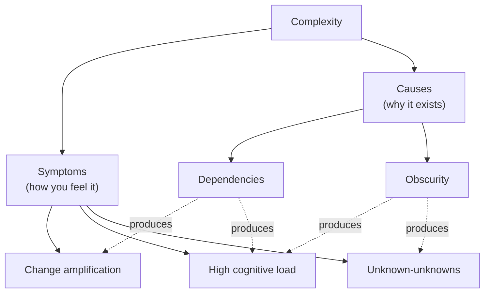
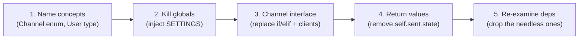

# Deep Modules & Complexity — Practice Tasks

> 12 hands-on exercises that train you to *diagnose and remove complexity* the way Ousterhout's *A Philosophy of Software Design* and the *Out of the Tar Pit* paper frame it: complexity has three **symptoms** (change amplification, high cognitive load, unknown-unknowns) and two **causes** (dependencies, obscurity). Every task names the symptom or cause it removes, gives runnable code (Go / Java / Python — varied), and a full solution with reasoning.

---

## Table of Contents

1. [Task 1 — Eliminate change amplification (a duplicated format string)](#task-1--eliminate-change-amplification-python)
2. [Task 2 — Remove obscurity by renaming a misleading variable](#task-2--remove-obscurity-by-renaming-java)
3. [Task 3 — Document a non-obvious assumption](#task-3--document-a-non-obvious-assumption-go)
4. [Task 4 — Collapse a magic constant duplicated across N call sites](#task-4--collapse-a-magic-constant-across-n-sites-go)
5. [Task 5 — Cut a needless dependency to lower cognitive load](#task-5--cut-a-needless-dependency-python)
6. [Task 6 — Remove an unknown-unknown: an implicit ordering requirement](#task-6--remove-an-unknown-unknown-implicit-ordering-java)
7. [Task 7 — Turn a tactical hack into a small strategic fix](#task-7--tactical-hack--strategic-fix-go)
8. [Task 8 — Separate essential from accidental complexity](#task-8--essential-vs-accidental-complexity-python)
9. [Task 9 — Reduce state: mutable shared state → pure transformation](#task-9--reduce-state-out-of-the-tar-pit-java)
10. [Task 10 — Design it twice: pick the simpler of two designs](#task-10--design-it-twice-go)
11. [Task 11 — Make a deep module out of a shallow one](#task-11--deep-vs-shallow-module-python)
12. [Task 12 — Complexity audit (open-ended)](#task-12--complexity-audit-openended)

---

## How to Use

Read the scenario, then **try to name the symptom or cause before opening the solution**. Diagnosis is the skill being trained — the refactor is the easy part once you can name what's wrong. Then write the fix yourself and compare.



Difficulty climbs from Task 1 (easy) to Task 12 (open-ended). Tasks 1–5 are single-symptom drills; 6–10 require judgment; 11–12 are design-level.

---

## Task 1 — Eliminate change amplification (Python)

**Difficulty:** Easy

**Scenario:** A reporting module formats dates as `dd/mm/yyyy`. Product asks to switch the whole app to ISO `yyyy-mm-dd`. You grep and find the format literal copy-pasted in five places. That grep is the symptom: **change amplification** — one conceptual decision ("how we display a date") is spread across many sites, so one change touches many lines and you *will* miss one.

```python
def render_invoice(inv):
    header = f"Invoice {inv.id} — {inv.date.strftime('%d/%m/%Y')}"
    ...

def render_receipt(rec):
    return f"Paid on {rec.paid_at.strftime('%d/%m/%Y')}"

def export_csv_row(order):
    return [order.id, order.created.strftime('%d/%m/%Y'), order.total]

def audit_line(event):
    return f"[{event.ts.strftime('%d/%m/%Y')}] {event.message}"

def email_subject(inv):
    return f"Statement {inv.date.strftime('%d/%m/%Y')}"
```

**Instruction:** Refactor so the date-display decision lives in exactly one place. After your change, switching to ISO must be a one-line edit.

<details><summary>Solution</summary>

```python
# One source of truth for the decision "how we display a date".
DATE_DISPLAY_FORMAT = "%Y-%m-%d"   # switch to ISO: the only line that changes

def format_date(d) -> str:
    return d.strftime(DATE_DISPLAY_FORMAT)


def render_invoice(inv):
    header = f"Invoice {inv.id} — {format_date(inv.date)}"
    ...

def render_receipt(rec):
    return f"Paid on {format_date(rec.paid_at)}"

def export_csv_row(order):
    return [order.id, format_date(order.created), order.total]

def audit_line(event):
    return f"[{format_date(event.ts)}] {event.message}"

def email_subject(inv):
    return f"Statement {format_date(inv.date)}"
```

**Reasoning — removes change amplification.** The format literal was *knowledge about a decision* duplicated across five call sites. Each duplicate is a place the change can leak. By naming the decision (`format_date` / `DATE_DISPLAY_FORMAT`), the conceptual change "we display dates differently now" maps to a single textual change. Note this is *not* mere DRY-for-its-own-sake: the test is "does one decision require one edit?" If the five sites genuinely needed *different* formats (CSV vs human-readable), forcing them together would be the wrong move — they'd be separate decisions that happen to look alike.

</details>

---

## Task 2 — Remove obscurity by renaming (Java)

**Difficulty:** Easy

**Scenario:** A reviewer reads this and stalls for thirty seconds figuring out what `d` and `f` mean and why `2` is special. That stall is **obscurity** — important information (units, intent, the meaning of the magic number) is not obvious from the code. Obscurity raises cognitive load and breeds bugs because the next reader guesses.

```java
public long calc(long d, int f) {
    long r = d;
    for (int i = 0; i < f; i++) {
        r = r * 2;
    }
    return r;
}
```

Context from the call site: `calc(initialDelayMs, retryAttempt)` — it computes an exponential backoff delay.

**Instruction:** Rename and document so the meaning is obvious without the call site. Make the non-obvious "× 2 per attempt" explicit.

<details><summary>Solution</summary>

```java
private static final int BACKOFF_MULTIPLIER = 2;

/**
 * Exponential backoff: each retry doubles the delay.
 * attempt 0 -> base, attempt 1 -> base*2, attempt 2 -> base*4 ...
 */
public long backoffDelayMs(long baseDelayMs, int attempt) {
    long delayMs = baseDelayMs;
    for (int i = 0; i < attempt; i++) {
        delayMs *= BACKOFF_MULTIPLIER;
    }
    return delayMs;
}
```

**Reasoning — removes obscurity.** Three pieces of hidden information are now surfaced: (1) names carry *units* (`...Ms`) and *intent* (`backoffDelayMs`, `attempt`), so the reader no longer reverse-engineers them from the call site; (2) the bare `2` is named `BACKOFF_MULTIPLIER`, turning "why 2?" into a self-answering line; (3) the doc comment states the *non-local invariant* (attempt→delay mapping) that the loop alone doesn't make obvious. Obscurity is the cause that feeds both high cognitive load and unknown-unknowns; killing it here costs four words and saves every future reader the thirty-second stall.

</details>

---

## Task 3 — Document a non-obvious assumption (Go)

**Difficulty:** Easy–Medium

**Scenario:** This function silently assumes its input slice is already sorted ascending. Nothing in the signature, name, or body says so. A caller who passes unsorted data gets a wrong answer with no error — a classic **unknown-unknown**: there is no way, from reading the call site, to know that you broke a hidden precondition.

```go
// FindFirstAbove returns the index of the first element greater than target.
func FindFirstAbove(xs []int, target int) int {
    lo, hi := 0, len(xs)
    for lo < hi {
        mid := (lo + hi) / 2
        if xs[mid] <= target {
            lo = mid + 1
        } else {
            hi = mid
        }
    }
    return lo
}
```

**Instruction:** Make the hidden precondition impossible to miss. Choose the strongest practical mechanism (not just a comment).

<details><summary>Solution</summary>

```go
// FindFirstAbove returns the index of the first element strictly greater than
// target using binary search.
//
// PRECONDITION: xs MUST be sorted in ascending order. Passing unsorted input
// yields an undefined result. In debug builds this is enforced; see the guard.
func FindFirstAbove(xs []int, target int) int {
    if debugAsserts && !sort.IntsAreSorted(xs) {
        panic("FindFirstAbove: xs is not sorted ascending")
    }
    lo, hi := 0, len(xs)
    for lo < hi {
        mid := lo + (hi-lo)/2 // also avoids int overflow on large slices
        if xs[mid] <= target {
            lo = mid + 1
        } else {
            hi = mid
        }
    }
    return lo
}
```

If you cannot assume sortedness at all, make it *structurally* impossible to misuse by accepting a type that can only be constructed sorted:

```go
// SortedInts can only be built via NewSortedInts, which guarantees the invariant.
type SortedInts struct{ xs []int }

func NewSortedInts(xs []int) SortedInts {
    s := append([]int(nil), xs...)
    sort.Ints(s)
    return SortedInts{s}
}

func (s SortedInts) FindFirstAbove(target int) int { /* binary search on s.xs */ }
```

**Reasoning — removes an unknown-unknown.** The precondition was real but invisible, so a future caller could break it without any signal. The ladder of strength, weakest to strongest: (1) document it; (2) assert it in debug builds (fails loudly, near the cause, not three layers downstream); (3) **make the illegal state unrepresentable** — a `SortedInts` value can only exist sorted, so the question "is it sorted?" can never be asked at a call site. Option 3 converts an unknown-unknown into a compile-time/construction-time known. Pick the strongest option the design budget allows.

</details>

---

## Task 4 — Collapse a magic constant across N sites (Go)

**Difficulty:** Medium

**Scenario:** A rate limiter, a cache, and a metrics flush all hardcode `30` (seconds) independently. They were copied from each other but now drift: one is `30`, one is `30 * time.Second`, one is `30000` (ms). The intent — "the standard polling interval" — is duplicated and inconsistent. This is **change amplification** *plus* **obscurity**: tuning the interval means hunting three encodings, and no site tells you they're meant to be the same number.

```go
func (r *RateLimiter) reset() {
    r.windowEnd = time.Now().Add(30 * time.Second)
}

func (c *Cache) sweep() {
    ttl := 30 // seconds — refreshed each sweep
    c.evictOlderThan(time.Duration(ttl) * time.Second)
}

func (m *Metrics) flushLoop() {
    ticker := time.NewTicker(30000 * time.Millisecond)
    ...
}
```

**Instruction:** Establish one source of truth for the interval, in one unit, and route all three sites through it. If two of these *aren't* conceptually the same number, say so.

<details><summary>Solution</summary>

```go
// PollInterval is the single source of truth for the standard polling cadence.
// All subsystems that "tick every standard window" derive from this.
const PollInterval = 30 * time.Second

func (r *RateLimiter) reset() {
    r.windowEnd = time.Now().Add(PollInterval)
}

func (c *Cache) sweep() {
    c.evictOlderThan(PollInterval)
}

func (m *Metrics) flushLoop() {
    ticker := time.NewTicker(PollInterval)
    ...
}
```

**Reasoning — removes change amplification and obscurity.** A `time.Duration` constant fixes the *unit* problem (no more raw `30` vs `30000`), and the single name fixes the *amplification* problem (tune once). But the harder judgment is the question the instruction plants: **are these actually the same decision?** If the cache TTL must stay 30s for correctness while the metrics cadence is just a tuning preference, coupling them through one constant creates a *false dependency* — changing metrics frequency would silently change cache behavior. In that case the right answer is two well-named constants (`CacheTTL`, `MetricsFlushInterval`) that *happen* to be equal today. Collapsing duplication is only correct when the things are conceptually one; otherwise you trade change amplification for a hidden coupling, which is worse.

</details>

---

## Task 5 — Cut a needless dependency (Python)

**Difficulty:** Medium

**Scenario:** `PriceCalculator` imports the whole `OrderService` just to read a tax rate off it. Now you cannot unit-test pricing without constructing an `OrderService`, which needs a database, which needs config. The dependency is **needless** — pricing depends on a *number*, not on the service that happens to hold it — and it inflates cognitive load: to understand pricing you must drag in the entire order subsystem.

```python
from order_service import OrderService

class PriceCalculator:
    def __init__(self, order_service: OrderService):
        self.order_service = order_service

    def total(self, subtotal: float, region: str) -> float:
        rate = self.order_service.config.tax_table[region]
        return subtotal * (1 + rate)
```

**Instruction:** Remove the dependency on `OrderService`. `PriceCalculator` should depend only on what it actually uses.

<details><summary>Solution</summary>

```python
from typing import Mapping

class PriceCalculator:
    # Depends only on the tax rates it actually reads — not on whoever owns them.
    def __init__(self, tax_rates: Mapping[str, float]):
        self._tax_rates = tax_rates

    def total(self, subtotal: float, region: str) -> float:
        rate = self._tax_rates[region]
        return subtotal * (1 + rate)
```

The caller (e.g. `OrderService`) now passes the data it owns:

```python
calc = PriceCalculator(tax_rates=self.config.tax_table)
```

**Reasoning — cuts a needless dependency, lowering cognitive load.** The original code coupled pricing to `OrderService` purely for a lookup table — a dependency on a *concrete collaborator* where a dependency on *data* was sufficient (the Interface Segregation / "depend on the narrowest thing you use" idea). Effects: (1) the transitive dependency chain (service → config → db) is severed, so pricing is now unit-testable with a literal `{"CA": 0.0875}`; (2) the reader no longer has to load the order subsystem into working memory to reason about pricing; (3) the two modules can now be understood and changed independently — the defining property of low complexity. Less code, fewer imports, smaller blast radius.

</details>

---

## Task 6 — Remove an unknown-unknown: implicit ordering (Java)

**Difficulty:** Medium–Hard

**Scenario:** `ReportBuilder` works only if you call its methods in exactly the right order: `loadData()` before `computeTotals()` before `render()`. Nothing enforces this. A new teammate calls `render()` first and gets a `NullPointerException` deep inside formatting — far from the actual mistake. This is the worst kind of complexity: an **unknown-unknown** *temporal coupling*. There is no way to know, from the API, that order matters.

```java
class ReportBuilder {
    private List<Row> data;
    private Totals totals;

    public void loadData(Source src) { this.data = src.fetch(); }

    public void computeTotals() {
        this.totals = Totals.from(data);   // NPE if loadData not called
    }

    public String render() {
        return Formatter.format(data, totals); // NPE if either step skipped
    }
}
```

**Instruction:** Redesign so the required order is enforced by the type system or the call structure — make it impossible to call steps out of order.

<details><summary>Solution</summary>

```java
// The pipeline is expressed as a single method; the order is the code, not a
// convention a reader must somehow know.
final class Report {
    private final List<Row> data;
    private final Totals totals;
    private final String rendered;

    private Report(List<Row> data, Totals totals, String rendered) {
        this.data = data;
        this.totals = totals;
        this.rendered = rendered;
    }

    public static Report build(Source src) {
        List<Row> data = src.fetch();       // step 1
        Totals totals = Totals.from(data);  // step 2 — can't run before step 1
        String rendered = Formatter.format(data, totals); // step 3
        return new Report(data, totals, rendered);
    }

    public String text() { return rendered; }
}
```

If callers genuinely need the intermediate steps exposed, use **type-state**: each stage returns a distinct type that only offers the next legal operation.

```java
final class LoadedReport {           // exists only after data is loaded
    private final List<Row> data;
    LoadedReport(List<Row> data) { this.data = data; }
    ComputedReport computeTotals() { return new ComputedReport(data, Totals.from(data)); }
}
final class ComputedReport {         // exists only after totals are computed
    private final List<Row> data; private final Totals totals;
    ComputedReport(List<Row> data, Totals totals) { this.data = data; this.totals = totals; }
    String render() { return Formatter.format(data, totals); }
}
// Source.load() returns LoadedReport; the only method available is computeTotals(),
// which returns ComputedReport, whose only method is render(). Out-of-order calls
// won't compile.
```

**Reasoning — converts an unknown-unknown into a known (ideally a compile error).** The original hid a precondition ("call in this order") in the developers' heads; violating it failed *late and far away* (NPE in the formatter), which is exactly what makes unknown-unknowns expensive to debug. Collapsing the steps into one `build` method removes the choice entirely. Where intermediate access is required, type-state makes each illegal transition a *compile-time* error, so the temporal coupling can no longer be violated at all. Either way, the knowledge moves from tribal convention into the program's structure.

</details>

---

## Task 7 — Tactical hack → strategic fix (Go)

**Difficulty:** Hard

**Scenario:** A bug came in: discount codes were case-sensitive, so `SAVE10` worked but `save10` didn't. Someone shipped the fastest possible patch — a special-case `if` at the one call site that reported the bug. Two weeks later the same bug is reported through a *different* entry point, because the hack only fixed one of three places codes are compared. This is the **tactical tornado** / "it's just one special case": each fix is locally cheap and globally corrosive.

```go
// The tactical patch, added under deadline:
func applyDiscount(order *Order, code string) error {
    // HACK: users were typing lowercase. Quick fix for the support ticket.
    if code == "save10" {
        code = "SAVE10"
    }
    d, ok := discounts[code]
    if !ok {
        return fmt.Errorf("unknown code %q", code)
    }
    order.Total -= d.Amount
    return nil
}

// Two other functions also look codes up in `discounts` and were NOT patched:
//   validateCodeExists(code string) bool { _, ok := discounts[code]; return ok }
//   describeDiscount(code string) string  { return discounts[code].Description }
```

**Instruction:** Replace the special-case with a small *strategic* fix that resolves the class of bug (case-insensitive codes everywhere), not the one ticket.

<details><summary>Solution</summary>

```go
// Strategic fix: normalize codes at the single boundary where a raw, user-typed
// string becomes a domain Code. Every lookup goes through the normalized form,
// so the whole class of "casing" bugs disappears at once.
type Code string

func NewCode(raw string) Code {
    return Code(strings.ToUpper(strings.TrimSpace(raw)))
}

// discounts is now keyed by Code; it can only be built/queried with normalized keys.
var discounts map[Code]Discount

func applyDiscount(order *Order, raw string) error {
    code := NewCode(raw)
    d, ok := discounts[code]
    if !ok {
        return fmt.Errorf("unknown code %q", raw)
    }
    order.Total -= d.Amount
    return nil
}

func validateCodeExists(raw string) bool { _, ok := discounts[NewCode(raw)]; return ok }
func describeDiscount(raw string) string  { return discounts[NewCode(raw)].Description }
```

**Reasoning — strategic investment removes the cause, not the symptom.** The tactical patch treated *one symptom* (`save10` at one site) and left the *cause* (raw strings compared without normalization) untouched, so the bug re-emerged everywhere else and the special-case `if` became permanent litter. The strategic fix spends a few extra minutes to (1) name the concept (`Code`), (2) normalize once at the boundary where untrusted input enters the domain, and (3) route every comparison through it. Cost: ~10 lines and one new type. Payoff: the entire *class* of casing bugs is gone, and no future call site can reintroduce it. This is the tactical-vs-strategic tradeoff in miniature — the strategic version is barely more expensive today and prevents the slow accretion of special cases that is how systems rot.

</details>

---

## Task 8 — Essential vs accidental complexity (Python)

**Difficulty:** Hard

**Scenario:** This function computes whether a meeting fits in a room's free slots. The *essential* complexity — interval overlap is genuinely fiddly — is real and must stay. But it is buried under *accidental* complexity: manual index juggling, mutable accumulators, and a hand-rolled sort that the standard library does better. Your job is to remove only the accidental part.

```python
def can_fit(busy, start, end):
    # busy: list of [s, e] intervals, unsorted
    # sort busy by start (bubble sort, because why not)
    n = len(busy)
    for i in range(n):
        for j in range(0, n - i - 1):
            if busy[j][0] > busy[j + 1][0]:
                tmp = busy[j]
                busy[j] = busy[j + 1]
                busy[j + 1] = tmp
    # walk and check for overlap with [start, end]
    ok = True
    k = 0
    while k < len(busy):
        bs = busy[k][0]
        be = busy[k][1]
        if start < be and bs < end:
            ok = False
        k = k + 1
    return ok
```

**Instruction:** Keep the essential overlap logic. Strip the accidental complexity (manual sort, index bookkeeping, mutable flag, in-place mutation of the caller's list).

<details><summary>Solution</summary>

```python
def can_fit(busy, start, end):
    """True if [start, end) overlaps none of the busy intervals.

    Essential complexity (the overlap test) is the single condition below;
    everything else was accidental.
    """
    return all(not _overlaps(bs, be, start, end) for bs, be in busy)


def _overlaps(a_start, a_end, b_start, b_end) -> bool:
    # Two half-open intervals overlap iff each starts before the other ends.
    return a_start < b_end and b_start < a_end
```

**Reasoning — removes accidental, preserves essential.** The *essential* complexity is the overlap predicate `a_start < b_end and b_start < a_end` — that condition is irreducible; it is the actual problem. Everything else was **accidental**: the bubble sort (the algorithm never needed sorted input — overlap is symmetric and order-independent, so the sort was pure waste *and* it mutated the caller's list, a hidden side effect), the manual `while k` index walk (Python iterates directly), and the mutable `ok` flag (replaced by `all(...)`, which also short-circuits). The function shrank from ~18 lines to 2 expressions, the side effect vanished, and the one piece of genuine difficulty is now named, isolated, and commented. The discipline: before deleting, ask of each line "is this inherent to the problem, or to *how I happened to code it*?" Only delete the latter.

</details>

---

## Task 9 — Reduce state: *Out of the Tar Pit* (Java)

**Difficulty:** Hard

**Scenario:** *Out of the Tar Pit* argues that mutable shared state is the single largest source of complexity, because the meaning of the code depends on *when* and *in what order* things ran. This `ShoppingCart` accumulates results into mutable fields, and three methods quietly depend on each other having run. Reasoning about it requires tracking a temporal sequence in your head — high cognitive load plus unknown-unknown ordering bugs.

```java
class CartSummary {
    private double subtotal;     // mutated by addLines
    private double discount;     // mutated by applyDiscount
    private double tax;          // mutated by applyTax
    private double total;        // mutated by finalizeTotal

    void addLines(List<Line> lines) {
        for (Line l : lines) subtotal += l.price() * l.qty();
    }
    void applyDiscount(double pct) {
        discount = subtotal * pct;      // wrong if addLines ran late
    }
    void applyTax(double rate) {
        tax = (subtotal - discount) * rate; // wrong if discount not set
    }
    void finalizeTotal() {
        total = subtotal - discount + tax;  // wrong if any step skipped
    }
    double total() { return total; }
}
```

**Instruction:** Replace the mutable shared state with a single pure transformation from inputs to result. The result should depend only on its inputs — not on call order or prior mutations.

<details><summary>Solution</summary>

```java
// An immutable result and one pure function. No fields mutate; nothing depends
// on call order because there are no calls to order.
record CartSummary(double subtotal, double discount, double tax, double total) {}

static CartSummary summarize(List<Line> lines, double discountPct, double taxRate) {
    double subtotal = lines.stream()
        .mapToDouble(l -> l.price() * l.qty())
        .sum();
    double discount = subtotal * discountPct;
    double tax = (subtotal - discount) * taxRate;
    double total = subtotal - discount + tax;
    return new CartSummary(subtotal, discount, tax, total);
}
```

**Reasoning — eliminates mutable shared state (the tar pit's core complaint).** The original object had four mutable fields whose correctness depended on an *implicit execution order* — a textbook unknown-unknown, and impossible to reason about locally because any method could have run before any other. The pure version makes order *non-existent*: `summarize` is a referentially transparent function from `(lines, discountPct, taxRate)` to an immutable `CartSummary`. The data dependencies (`tax` needs `discount` needs `subtotal`) are expressed once, as ordinary local-variable initialization order the compiler checks — not as a fragile temporal contract between mutators. Benefits: trivially testable (no setup sequence), thread-safe by construction (immutable), and the reader holds *zero* state in their head — they read top to bottom once. This is "replace state with a pure transformation" applied literally.

</details>

---

## Task 10 — Design it twice (Go)

**Difficulty:** Hard

**Scenario:** You must add a feature: notify users by **email**, **SMS**, or **push**, and the set of channels will grow. Ousterhout's advice is *design it twice* — sketch at least two distinct designs and pick the simpler, rather than committing to the first that comes to mind. Below are two real designs for the same requirement. Evaluate them and pick one, justifying the choice on complexity grounds.

**Design A — flags + one big function:**

```go
type NotifyOpts struct {
    Email, SMS, Push bool
    EmailAddr, Phone, DeviceToken string
}

func Notify(msg string, o NotifyOpts) error {
    if o.Email {
        if o.EmailAddr == "" { return errors.New("email addr required") }
        // ... send email ...
    }
    if o.SMS {
        if o.Phone == "" { return errors.New("phone required") }
        // ... send sms ...
    }
    if o.Push {
        if o.DeviceToken == "" { return errors.New("device token required") }
        // ... send push ...
    }
    return nil
}
```

**Design B — a small interface + per-channel types:**

```go
type Channel interface {
    Send(msg string) error
}

type Email struct{ Addr string }
func (e Email) Send(msg string) error { /* ... */ return nil }

type SMS struct{ Phone string }
func (s SMS) Send(msg string) error { /* ... */ return nil }

func Notify(msg string, channels ...Channel) error {
    for _, c := range channels {
        if err := c.Send(msg); err != nil {
            return fmt.Errorf("notify via %T: %w", c, err)
        }
    }
    return nil
}
```

**Instruction:** Pick A or B and justify. Then state when the *other* design would actually be the right call — design-it-twice means knowing the tradeoff, not memorizing "interfaces good."

<details><summary>Solution</summary>

**Pick B for a growing, open set of channels.**

```go
// Adding a new channel is purely additive: define a type with Send. No existing
// code changes, so the "add a channel" decision touches exactly one new file.
type Push struct{ DeviceToken string }
func (p Push) Send(msg string) error { /* ... */ return nil }

// Usage — the caller composes exactly the channels it wants, each carrying its
// own required data, so invalid combinations are unrepresentable:
err := Notify("Your order shipped", Email{Addr: "a@b.com"}, Push{DeviceToken: tok})
```

**Reasoning — design it twice, then weigh complexity.**

- **Change amplification:** In A, adding a channel means editing the `NotifyOpts` struct *and* adding another `if` block inside `Notify` — the core function grows without bound and every channel's logic tangles in one place. In B, a new channel is a new type implementing one method; `Notify` never changes. B localizes the "add a channel" decision.
- **Unknown-unknowns / invalid states:** A allows `{Email: true, EmailAddr: ""}` or `{Email: false, EmailAddr: "set"}` — nonsensical combinations the type permits, caught only at runtime. B couples each channel to *its own* required data, so `Email{}` carries its address inherently; illegal combinations don't compile.
- **Cognitive load:** A's `Notify` forces a reader to hold all channels at once; B's is a three-line loop over an interface, understandable without knowing any concrete channel.

**When A is actually right:** if the channel set is *closed and tiny* (say, exactly email + SMS, forever) and channels share heavy common logic, B's indirection is overhead that buys nothing — you'd be paying interface ceremony for a problem that doesn't grow. The whole point of designing it twice is that you compared them and chose deliberately; the answer flips with the *requirement* (open/growing → B, closed/tiny → A), not with fashion.

</details>

---

## Task 11 — Deep vs shallow module (Python)

**Difficulty:** Hard

**Scenario:** A *shallow* module has a large interface relative to the functionality it provides — it barely hides anything, so callers must do the real work and carry the complexity. A *deep* module hides a lot of complexity behind a small interface. This "config loader" is shallow: it exposes every internal step, forcing every caller to orchestrate them (and get the order right — note the lurking ordering trap from Task 6).

```python
class ConfigLoader:
    def read_file(self, path): ...        # returns raw text
    def parse_yaml(self, text): ...       # returns dict
    def apply_env_overrides(self, d): ... # mutates dict from os.environ
    def validate(self, d): ...            # raises on bad config
    def freeze(self, d): ...              # returns immutable view

# Every caller must write this, in this exact order, forever:
loader = ConfigLoader()
raw = loader.read_file("app.yml")
data = loader.parse_yaml(raw)
loader.apply_env_overrides(data)
loader.validate(data)
config = loader.freeze(data)
```

**Instruction:** Make the module *deep*: hide the multi-step pipeline behind a small interface, so callers express *intent* ("load the config") not *mechanism*.

<details><summary>Solution</summary>

```python
class ConfigLoader:
    # Small interface: one method expresses the caller's intent.
    def load(self, path: str) -> "Config":
        raw = self._read_file(path)
        data = self._parse_yaml(raw)
        data = self._apply_env_overrides(data)
        self._validate(data)
        return self._freeze(data)

    # Deep implementation: the five steps and their required order are hidden.
    def _read_file(self, path): ...
    def _parse_yaml(self, text): ...
    def _apply_env_overrides(self, d): ...
    def _validate(self, d): ...
    def _freeze(self, d): ...

# Every caller now writes:
config = ConfigLoader().load("app.yml")
```

**Reasoning — deepen the module: small interface, hidden complexity.** The shallow version's interface (five public methods) was *as large as its implementation* — it pushed all the orchestration, and the ordering requirement, onto every caller. That's negative-value abstraction: callers carry complexity the module should have absorbed, and the implicit ordering is an unknown-unknown replicated at every call site. The deep version shrinks the interface to one verb (`load`) while *growing* what it hides (the pipeline and its order become private detail). Now the module can change its internal steps — add caching, swap YAML for TOML, reorder validation — without touching a single caller, because none of that leaked through the interface. Interface area down, hidden functionality up: the definition of depth, and the most reliable lever for reducing system-wide complexity.

</details>

---

## Task 12 — Complexity audit (open-ended)

**Difficulty:** Open-ended

**Scenario:** Below is a plausible-looking module. Identify **every** complexity symptom and cause you can find, name each one precisely, and give a one-line fix. This integrates all the prior tasks.

```python
# notifications.py
import datetime

SETTINGS = {}  # populated somewhere at startup, by someone, sometime

class Notifier:
    def __init__(self, db, mailer, sms_client, push_client, analytics, logger):
        self.db = db
        self.mailer = mailer
        self.sms_client = sms_client
        self.push_client = push_client
        self.analytics = analytics
        self.logger = logger
        self.sent = []          # mutable; read by report()

    def send(self, uid, msg, t):
        # t: 1=email, 2=sms, 3=push  (no idea why ints)
        user = self.db.get(uid)
        if t == 1:
            self.mailer.send(user["e"], msg)  # what is "e"?
        elif t == 2:
            self.sms_client.send(user["p"], msg)
        elif t == 3:
            self.push_client.send(user["tok"], msg)
        self.sent.append((uid, t, datetime.datetime.now().strftime("%d/%m/%Y")))
        self.analytics.track("sent")  # depends on analytics being configured

    def report(self):
        # must be called after send(), reads self.sent
        return len(self.sent)
```

<details><summary>Solution</summary>

| # | Symptom / Cause | Where | One-line fix |
|---|---|---|---|
| 1 | **Obscurity** (magic ints) | `t == 1/2/3` | Replace `t` with an `enum Channel { EMAIL, SMS, PUSH }`. |
| 2 | **Obscurity** (cryptic keys) | `user["e"]`, `user["p"]`, `user["tok"]` | Use a typed `User` with named fields `email`, `phone`, `device_token`. |
| 3 | **Change amplification** (date format literal) | `strftime("%d/%m/%Y")` | Route through a single `format_date()` (Task 1). |
| 4 | **Dependency creep / high cognitive load** | 6 constructor deps | `Notifier` needs only the channel(s) it uses; inject a `Channel` strategy, not three clients (Task 10). |
| 5 | **Needless dependency** | `analytics`, `logger` always required | Make them optional or move analytics to a decorator/observer; pricing-style narrowing (Task 5). |
| 6 | **Unknown-unknown** (global mutable config) | `SETTINGS = {}` "populated sometime" | Pass config explicitly into the constructor; ban the import-time global. |
| 7 | **Unknown-unknown** (temporal coupling) | `report()` "must be called after send()" | `report()` reading mutable `self.sent` couples order; return a value or make `sent` an explicit immutable log. |
| 8 | **Mutable shared state** (tar pit) | `self.sent` accumulator | Prefer returning a `SendResult`; if a log is needed, append-only and exposed read-only. |
| 9 | **Change amplification** (channel dispatch) | `if/elif` ladder on `t` | Each new channel edits `send` *and* the constructor — replace with the `Channel` interface (Task 10). |
| 10 | **Obscurity** (silent failure) | no error handling on `.send()` | Decide and document behavior on partial failure; don't leave it implicit. |

**Recommended order of attack:**



1. **Remove obscurity first** — naming concepts (`Channel`, `User`) makes the rest of the code readable enough to refactor safely.
2. **Kill the global** — `SETTINGS` is the scariest item: an unknown-unknown that any code anywhere can have mutated.
3. **Introduce the `Channel` interface** — collapses the `if/elif` and the multi-client constructor, ending the change amplification.
4. **Replace `self.sent` with return values** — removes the mutable state and the `report()` ordering trap.
5. **Narrow dependencies** — once channels are abstracted, `Notifier` no longer needs three concrete clients; drop or decorate the rest.

The meta-lesson: complexity is **incremental** (every item here was individually "harmless when added") and the cure is the same — name things, hide mechanism behind small interfaces, prefer pure transformations over shared mutable state, and depend on the narrowest thing that does the job.

</details>

---

## Self-Assessment

You understand this chapter if you can:

- [ ] Name the three **symptoms** (change amplification, high cognitive load, unknown-unknowns) and the two **causes** (dependencies, obscurity) — and, given a snippet, point to which is present.
- [ ] Tell **change amplification** (one decision spread across N sites) apart from harmless similar-looking code that is genuinely N separate decisions (Task 4's trap).
- [ ] Spot an **unknown-unknown** (an implicit precondition or ordering with no signal at the call site) and pick the *strongest practical* mechanism to surface it — doc → assert → unrepresentable illegal state (Tasks 3, 6).
- [ ] Distinguish **essential** complexity (inherent to the problem) from **accidental** (an artifact of how you coded it) and delete only the latter (Task 8).
- [ ] Explain why **mutable shared state** is the tar pit's central complaint, and convert a stateful accumulator into a pure transformation (Task 9).
- [ ] Articulate the **tactical-vs-strategic** tradeoff and turn a special-case hack into a fix for the whole bug class (Task 7).
- [ ] Recognize a **shallow** module (interface as large as its implementation) and **deepen** it (Task 11).
- [ ] Actually *design it twice* — sketch two designs and justify the simpler on complexity grounds, including when the "obvious" choice is wrong (Task 10).

---

## Related Topics

- [Chapter README](../README.md) — the positive rules behind these anti-patterns.
- [README.md](README.md) — this topic's overview, symptoms, and causes.
- [junior.md](junior.md) · [find-bug.md](find-bug.md) · [optimize.md](optimize.md) — same topic, other angles.
- [Cognitive Load](../20-cognitive-load/README.md) — the reader's working-memory cost; the per-developer view of what these tasks reduce.
- [Abstraction & Information Hiding](../22-abstraction-and-information-hiding/README.md) — building the deep modules Task 11 asks for.
- [Refactoring](../../refactoring/README.md) — the mechanical techniques (Extract Function, Introduce Parameter Object) used to apply these fixes safely.
