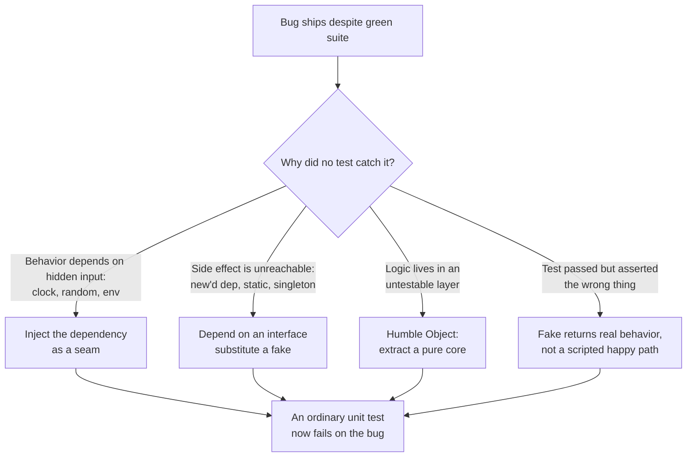
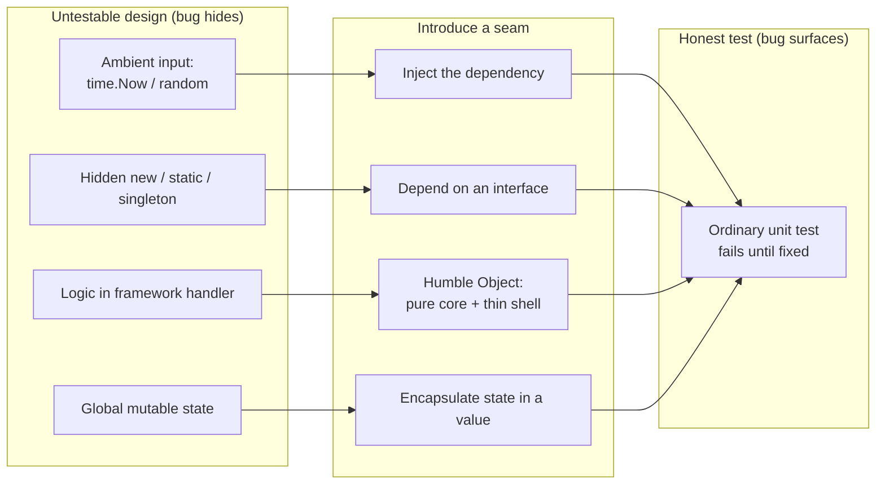

# Designing for Testability — Find the Bug

> 12 snippets where a *testability flaw* let a real bug ship. Either the design made the bug impossible to catch (un-injected clock, hidden `new`, global state, logic trapped in a framework handler), or the test *passed* and lied to you (a mock wired to the happy path, a singleton leaking state, randomness papering over a rare failure). For each: find the bug, explain why no test caught it, then redesign for a seam that *forces* the bug into the open.

Testability is not a property of your tests. It is a property of your **design**. When a bug survives a green test suite, the suite is rarely the root cause — the code gave the test nowhere to stand. The fix is almost never "write a smarter test"; it is "introduce a seam so an ordinary test can reach the bug."

---

## Table of Contents

1. [Snippet 1 — Un-injected `time.Now()` hides a midnight off-by-one (Go)](#snippet-1)
2. [Snippet 2 — Mock wired to the happy path hides an ignored error (Java)](#snippet-2)
3. [Snippet 3 — God constructor does I/O, so the unit test hits the network (Python)](#snippet-3)
4. [Snippet 4 — Logic trapped in a UI handler the suite never runs (Java)](#snippet-4)
5. [Snippet 5 — Global mutable state hides a concurrency bug (Go)](#snippet-5)
6. [Snippet 6 — Singleton leaks state across tests for a false green (Python)](#snippet-6)
7. [Snippet 7 — Hidden `new` makes the error path untestable (Java)](#snippet-7)
8. [Snippet 8 — Non-deterministic random makes a rare bug untestable (Python)](#snippet-8)
9. [Snippet 9 — No seam: concrete dependency forces an integration "unit" test (Go)](#snippet-9)
10. [Snippet 10 — Static utility holds the rate state, so two callers collide (Java)](#snippet-10)
11. [Snippet 11 — Testing through too many layers masks a DST boundary bug (Python)](#snippet-11)
12. [Snippet 12 — The Humble Object that wasn't humble (Go)](#snippet-12)
13. [Scorecard](#scorecard)
14. [Related Topics](#related-topics)

---

## How to Use

1. Read the snippet **and the test next to it**. The test is part of the puzzle — often it is the thing lying to you.
2. Ask two questions, in order: *What is the bug?* and *Why could no honest test catch it as written?*
3. Open the answer. Confirm the bug, the **testability flaw** that hid it, and the **redesign** (a seam: an injected clock, an interface, a pure function, a humble boundary) that makes a plain test fail until the bug is fixed.
4. The redesign is the point. If your fix is "add a `sleep` and retry in the test," you have treated the symptom. Find the seam.

Difficulty: 🟢 junior · 🟡 mid · 🔴 senior.



---

<a name="snippet-1"></a>
## Snippet 1 — Un-injected `time.Now()` hides a midnight off-by-one (Go) 🟡

```go
package subscription

import "time"

type Subscription struct {
    ExpiresAt time.Time
}

// IsActive reports whether the subscription is still valid today.
func (s Subscription) IsActive() bool {
    today := time.Now().Truncate(24 * time.Hour)
    expiry := s.ExpiresAt.Truncate(24 * time.Hour)
    return !expiry.Before(today)
}

// --- test ---
func TestIsActive(t *testing.T) {
    s := Subscription{ExpiresAt: time.Now().Add(48 * time.Hour)}
    if !s.IsActive() {
        t.Fatal("expected active")
    }
    expired := Subscription{ExpiresAt: time.Now().Add(-48 * time.Hour)}
    if expired.IsActive() {
        t.Fatal("expected inactive")
    }
}
```

**Where is the bug, and why can't this test catch it?**

<details><summary>Hint</summary>

The test uses `now ± 48h`. The bug lives at `now ± a few seconds`. What does `Truncate` do to a `time.Time` whose location is the machine's local zone?
</details>

<details><summary>Answer</summary>

**The bug.** `time.Now()` returns a local-zone time, but `Truncate(24 * time.Hour)` truncates relative to the **Unix epoch in UTC**, not relative to local midnight. For any machine east or west of UTC, `Truncate(24h)` snaps to a boundary that is *not* local midnight. A subscription that expires "today" can read as expired several hours early or late, and the exact answer depends on the server's timezone and the current hour. On a machine at UTC+5, a subscription expiring at local `2026-06-10 23:00` truncates to a different calendar day than the user's "today," so `IsActive()` flips at the wrong instant.

**Why no test catches it.** The test calls the same `time.Now()` the code does, then offsets by 48 hours — comfortably far from any boundary. The defect only appears within hours of midnight, and it varies by timezone. You cannot write a deterministic test for a boundary you cannot place the clock at: the design hard-codes `time.Now()`, so the test has no way to say "pretend it is 23:59:59 local on June 10 in Tashkent." The test is *structurally incapable* of reaching the bug.

**The testability flaw.** An un-injected ambient clock. `time.Now()` is a hidden global input; the function's output secretly depends on (a) the wall clock and (b) the machine's zone, neither of which the test controls.

**The redesign — inject a clock seam.**

```go
type Clock interface{ Now() time.Time }

type Subscription struct {
    ExpiresAt time.Time
}

func (s Subscription) IsActive(clock Clock) bool {
    today := startOfDay(clock.Now())
    expiry := startOfDay(s.ExpiresAt)
    return !expiry.Before(today)
}

// startOfDay truncates in the value's own location — local midnight, not UTC epoch.
func startOfDay(t time.Time) time.Time {
    y, m, d := t.Date()
    return time.Date(y, m, d, 0, 0, 0, 0, t.Location())
}
```

Now a test pins the instant and the zone:

```go
type fixedClock struct{ t time.Time }
func (f fixedClock) Now() time.Time { return f.t }

func TestIsActive_LocalMidnightBoundary(t *testing.T) {
    tashkent, _ := time.LoadLocation("Asia/Tashkent")
    now := time.Date(2026, 6, 10, 23, 59, 59, 0, tashkent)
    sub := Subscription{ExpiresAt: time.Date(2026, 6, 10, 0, 0, 0, 0, tashkent)}
    if !sub.IsActive(fixedClock{now}) {
        t.Fatal("subscription expiring today must be active at 23:59 local")
    }
}
```

This test *fails* against the original `Truncate(24h)` code and *passes* against `startOfDay`. The seam did not just enable a test — it forced the timezone bug into daylight.
</details>

---

<a name="snippet-2"></a>
## Snippet 2 — Mock wired to the happy path hides an ignored error (Java)

🟢

```java
public class PaymentProcessor {
    private final PaymentGateway gateway;
    private final OrderRepository orders;

    public PaymentProcessor(PaymentGateway gateway, OrderRepository orders) {
        this.gateway = gateway;
        this.orders = orders;
    }

    public void capture(Order order) {
        ChargeResult result = gateway.charge(order.getTotal(), order.getCardToken());
        // mark the order paid
        order.setStatus(Status.PAID);
        orders.save(order);
    }
}

// --- test ---
@Test
void capturesPayment() {
    PaymentGateway gateway = mock(PaymentGateway.class);
    when(gateway.charge(any(), any()))
        .thenReturn(new ChargeResult(true, "txn_123")); // success
    OrderRepository orders = mock(OrderRepository.class);

    new PaymentProcessor(gateway, orders).capture(order);

    verify(orders).save(argThat(o -> o.getStatus() == Status.PAID));
}
```

**Where is the bug, and why is the test green?**

<details><summary>Answer</summary>

**The bug.** `capture` never inspects `result`. It throws away `ChargeResult` and marks the order `PAID` **regardless of whether the charge succeeded**. A declined card produces a paid order and a shipped product the merchant never got money for.

**Why the test is green.** The mock is scripted to return `ChargeResult(true, ...)` — the happy path — so the assertion `status == PAID` holds. The test verifies that *when the gateway succeeds, the order is marked paid*, which is true and useless. It never exercises the case the code actually mishandles, because the author wrote the mock to match the code's behavior instead of the gateway's contract. This is the classic mock pitfall: the mock returns what makes the test pass, not what the real collaborator can return.

**The testability flaw.** Over-specified mock + no negative case. The mock encodes the implementor's optimism. Nothing in the test design pushes a failing `ChargeResult` through the seam, so the ignored-error branch — which does not even exist — is invisible.

**The redesign — drive the seam with the *failure* the contract allows, and make the code respect it.**

```java
public void capture(Order order) {
    ChargeResult result = gateway.charge(order.getTotal(), order.getCardToken());
    if (!result.isSuccessful()) {
        order.setStatus(Status.PAYMENT_FAILED);
        orders.save(order);
        throw new PaymentDeclinedException(result.declineReason());
    }
    order.setStatus(Status.PAID);
    order.setTransactionId(result.transactionId());
    orders.save(order);
}
```

```java
@Test
void doesNotMarkPaidWhenChargeDeclined() {
    when(gateway.charge(any(), any()))
        .thenReturn(new ChargeResult(false, "insufficient_funds"));

    assertThrows(PaymentDeclinedException.class,
        () -> processor.capture(order));
    verify(orders, never()).save(argThat(o -> o.getStatus() == Status.PAID));
}
```

The seam (`PaymentGateway`) was already there. The flaw was *how it was driven*. A mock must be configured from the dependency's full contract — every result it can legitimately return — not from the code under test.
</details>

---

<a name="snippet-3"></a>
## Snippet 3 — God constructor does I/O, so the unit test hits the network (Python)

🟡

```python
import requests

class ExchangeRates:
    def __init__(self, base="USD"):
        # fetch the whole rate table on construction
        resp = requests.get(f"https://api.fx.example.com/latest?base={base}")
        self._rates = resp.json()["rates"]

    def convert(self, amount, to_currency):
        rate = self._rates[to_currency]
        return round(amount * rate, 2)


# --- test ---
def test_convert():
    fx = ExchangeRates()            # hits the live API
    result = fx.convert(100, "EUR")
    assert result > 0               # "it works"
```

**Where is the bug, and why does the test never reveal it?**

<details><summary>Answer</summary>

**The bug.** `convert` does `round(amount * rate, 2)` and `_rates` is parsed straight from JSON. If the API returns rates keyed differently (e.g. `EUR` quoted *per unit of EUR* rather than *per USD*), or returns a currency code the table omits, `convert` either inverts the conversion or raises `KeyError`. There is also a precision bug: `round(amount * rate, 2)` on a float silently mis-rounds half-cent values (`round(2.675, 2) == 2.67`), which for money should use `Decimal`. None of this is visible because the test never controls the input rates.

**Why the test never reveals it.** The constructor performs the network fetch, so the "unit test" is actually an integration test against a live, changing API. The author wrote `assert result > 0` because that is the *only* assertion you can make when you do not know what the rates are — you cannot assert `convert(100, "EUR") == 91.34` when the rate floats every second. The weak assertion is a direct consequence of the untestable design. A parsing or rounding bug sails through `> 0`.

**The testability flaw.** A **god constructor** that does real work (I/O) on instantiation. You cannot construct the object without a network. You cannot inject known rates. So you cannot assert exact outputs, so the test degenerates to a tautology.

**The redesign — separate construction from I/O; inject the data.**

```python
from decimal import Decimal, ROUND_HALF_UP

class ExchangeRates:
    def __init__(self, rates: dict[str, Decimal]):
        self._rates = rates                     # pure data in, no I/O

    @classmethod
    def fetch(cls, fetcher, base="USD"):        # I/O lives in a named factory
        data = fetcher(f"/latest?base={base}")
        return cls({k: Decimal(str(v)) for k, v in data["rates"].items()})

    def convert(self, amount: Decimal, to_currency: str) -> Decimal:
        if to_currency not in self._rates:
            raise UnknownCurrency(to_currency)
        return (amount * self._rates[to_currency]).quantize(
            Decimal("0.01"), rounding=ROUND_HALF_UP)
```

```python
def test_convert_exact():
    fx = ExchangeRates({"EUR": Decimal("0.9134")})
    assert fx.convert(Decimal("100"), "EUR") == Decimal("91.34")

def test_unknown_currency_raises():
    fx = ExchangeRates({"EUR": Decimal("0.9134")})
    with pytest.raises(UnknownCurrency):
        fx.convert(Decimal("100"), "JPY")
```

The constructor is now a pure assignment; `fetch` is the only place that touches the network, and tests pass a fake `fetcher`. Exact assertions become possible, and the rounding and missing-key bugs are now reachable.
</details>

---

<a name="snippet-4"></a>
## Snippet 4 — Logic trapped in a UI handler the suite never runs (Java)

🟡

```java
public class CheckoutController {
    @PostMapping("/checkout")
    public String checkout(@RequestParam int quantity,
                           @RequestParam double unitPrice,
                           @RequestParam String coupon,
                           Model model) {
        double subtotal = quantity * unitPrice;
        double discount = 0;
        if (coupon.equals("SAVE10")) discount = subtotal * 0.10;
        else if (coupon.equals("SAVE20")) discount = subtotal * 0.20;
        // free shipping over $50, computed on the PRE-discount subtotal
        double shipping = subtotal > 50 ? 0 : 5.99;
        double total = subtotal - discount + shipping;
        model.addAttribute("total", total);
        return "checkout";
    }
}
```

**Where is the bug, and why does no test exercise it?**

<details><summary>Answer</summary>

**The bug.** Free-shipping eligibility is computed on the **pre-discount** subtotal. A $55 order with `SAVE20` drops to a $44 effective spend but still gets free shipping, because `subtotal > 50` is checked before the discount. Whether that is correct is a business rule — and the rule says shipping is free over $50 *spent*. The order spends $44, so it should be charged $5.99 shipping. Customers below the real threshold get free shipping; the company eats the cost on every discounted near-threshold order.

**Why no test exercises it.** Every line of pricing logic lives inside a Spring `@PostMapping` handler that also binds request params and populates a `Model`. To test it you must spin up `MockMvc`, the servlet stack, and parameter binding — heavy enough that nobody wrote the table of `(quantity, unitPrice, coupon) -> total` cases that would expose the threshold bug. The arithmetic is buried where only an integration test can reach it, and the integration test that exists only checks `status().isOk()`.

**The testability flaw.** Business logic trapped in an untestable layer (the framework handler). The controller mixes transport concerns (params, model, view name) with domain arithmetic, so the arithmetic inherits the controller's untestability.

**The redesign — Humble Object. Push the logic into a pure domain function; keep the handler thin.**

```java
public final class Pricing {
    public Money quote(int quantity, Money unitPrice, Coupon coupon) {
        Money subtotal = unitPrice.times(quantity);
        Money discount = coupon.discountOn(subtotal);
        Money discounted = subtotal.minus(discount);
        Money shipping = discounted.isGreaterThan(Money.dollars(50))
            ? Money.ZERO : Money.dollars(5.99);   // threshold on POST-discount spend
        return discounted.plus(shipping);
    }
}

@PostMapping("/checkout")
public String checkout(@RequestParam int quantity, @RequestParam double unitPrice,
                       @RequestParam String coupon, Model model) {
    Money total = pricing.quote(quantity, Money.dollars(unitPrice), Coupon.of(coupon));
    model.addAttribute("total", total);
    return "checkout";   // humble: no logic, just wiring
}
```

```java
@Test
void shippingThresholdUsesDiscountedSpend() {
    Money total = pricing.quote(1, Money.dollars(55), Coupon.of("SAVE20"));
    // 55 - 11 = 44 spent -> below 50 -> shipping applies
    assertEquals(Money.dollars(49.99), total);
}
```

`Pricing.quote` is a plain object, instantiated and asserted in microseconds with no framework. The threshold table is now trivial to enumerate, and the bug fails the very first case.
</details>

---

<a name="snippet-5"></a>
## Snippet 5 — Global mutable state hides a concurrency bug (Go)

🔴

```go
package counter

var lastID int // package-level mutable state

// NextID hands out a unique, increasing ID.
func NextID() int {
    lastID++
    return lastID
}

// --- test ---
func TestNextID(t *testing.T) {
    a := NextID()
    b := NextID()
    if b != a+1 {
        t.Fatalf("expected sequential, got %d then %d", a, b)
    }
}
```

**Where is the bug, and why does the test stay green forever?**

<details><summary>Answer</summary>

**The bug.** `lastID++` is read-modify-write on a shared variable with no synchronization. Under concurrent calls — which is exactly how an ID generator is used in a web server — two goroutines read the same `lastID`, both increment to the same value, and **hand out duplicate IDs**. Duplicate primary keys, collided idempotency tokens, corrupted data.

**Why the test stays green.** The test calls `NextID()` twice **sequentially, on one goroutine**. There is no contention, so the increment is trivially atomic in that scenario. The test asserts the property (`b == a+1`) that holds precisely when nothing races. The design — global state mutated in place — is the bug, and a single-threaded test is structurally unable to create the interleaving that breaks it. Worse, `go test -race` reports nothing here because only one goroutine touches the variable.

**The testability flaw.** Global mutable state with no seam to run concurrent access against. The function takes no receiver and no parameters, so a test cannot construct two independent generators or inject a controlled scheduler; it can only call the one global, one call at a time.

**The redesign — encapsulate the state behind a value you can instantiate, and make the operation atomic. Now a concurrency test is writable.**

```go
import "sync/atomic"

type IDGenerator struct {
    last atomic.Int64
}

func (g *IDGenerator) Next() int64 {
    return g.last.Add(1)
}
```

```go
func TestNext_NoDuplicatesUnderConcurrency(t *testing.T) {
    g := &IDGenerator{}
    const n = 10000
    seen := make([]int64, n)
    var wg sync.WaitGroup
    for i := 0; i < n; i++ {
        wg.Add(1)
        go func(i int) { defer wg.Done(); seen[i] = g.Next() }(i)
    }
    wg.Wait()

    unique := map[int64]bool{}
    for _, id := range seen {
        if unique[id] {
            t.Fatalf("duplicate id %d", id)
        }
        unique[id] = true
    }
}
```

Because the generator is now an injectable value, the test creates one and hammers it from 10,000 goroutines. Run against the original `lastID++` (re-expressed as a method), `-race` lights up and the duplicate check fails. The seam turned an invisible data race into a deterministic test failure.
</details>

---

<a name="snippet-6"></a>
## Snippet 6 — Singleton leaks state across tests for a false green (Python)

🔴

```python
class FeatureFlags:
    _instance = None

    def __new__(cls):
        if cls._instance is None:
            cls._instance = super().__new__(cls)
            cls._instance._flags = {}
        return cls._instance

    def enable(self, name):
        self._flags[name] = True

    def is_enabled(self, name):
        return self._flags.get(name, False)


def new_checkout_enabled():
    return FeatureFlags().is_enabled("new_checkout")


# --- tests ---
def test_new_checkout_off_by_default():
    assert new_checkout_enabled() is False

def test_new_checkout_can_be_enabled():
    FeatureFlags().enable("new_checkout")
    assert new_checkout_enabled() is True
```

**Where is the bug, and why is the suite a false green?**

<details><summary>Answer</summary>

**The bug.** `FeatureFlags` is a process-wide singleton; `enable` mutates shared state that never resets. Production code that flips a flag at runtime (an admin toggle, a request-scoped override) permanently alters a *global* the rest of the process reads. There is no scoping: a flag enabled for one tenant, request, or test is enabled for all of them. The "default off" guarantee is a lie the moment anything calls `enable`.

**Why the suite is a false green — and fragile.** Both tests pass *when run in file order*: `test_off_by_default` runs first against a fresh empty singleton, then `test_can_be_enabled` flips the flag. But the singleton is now polluted. Run the tests in reverse order (pytest with `-p no:randomly` off, or `pytest-randomly`, or just `pytest test_file.py::test_can_be_enabled test_file.py::test_off_by_default`) and `test_off_by_default` **fails**, because the flag enabled by the other test leaked through the singleton. The suite's greenness depends on execution order — the definition of a flaky, untrustworthy suite. The very bug the design has (global leakage) is what makes the tests pass when they shouldn't.

**The testability flaw.** A stateful singleton with no reset seam. Tests cannot get an isolated instance; they share one object whose state survives between them, so isolation — the foundation of unit testing — is impossible.

**The redesign — make it an ordinary injectable object; pass it in.**

```python
class FeatureFlags:
    def __init__(self, flags: dict[str, bool] | None = None):
        self._flags = dict(flags or {})

    def enable(self, name): self._flags[name] = True
    def is_enabled(self, name): return self._flags.get(name, False)


def new_checkout_enabled(flags: FeatureFlags) -> bool:
    return flags.is_enabled("new_checkout")
```

```python
def test_off_by_default():
    assert new_checkout_enabled(FeatureFlags()) is False

def test_can_be_enabled():
    flags = FeatureFlags()
    flags.enable("new_checkout")
    assert new_checkout_enabled(flags) is True
```

Each test constructs its own `FeatureFlags`. Order independence is restored; the tests are honest. In production you create one instance at composition root and inject it — runtime overrides become request-scoped instances rather than mutations of a global.
</details>

---

<a name="snippet-7"></a>
## Snippet 7 — Hidden `new` makes the error path untestable (Java)

🟡

```java
public class ReportService {
    public Report generate(String userId) {
        HttpClient client = new HttpClient();          // hidden dependency
        String json = client.get("/users/" + userId + "/metrics");
        Metrics metrics = parse(json);
        return new Report(metrics);
    }

    private Metrics parse(String json) {
        // ...
        return new Metrics(/* parsed fields */);
    }
}

// --- test ---
@Test
void generatesReport() {
    // can't substitute HttpClient, so we run against a local stub server
    Report r = new ReportService().generate("user-1");
    assertNotNull(r);
}
```

**Where is the bug, and why is the error path never tested?**

<details><summary>Answer</summary>

**The bug.** `generate` assumes `client.get` returns a valid metrics document. When the upstream returns an HTTP 404 (unknown user) or a 500 with an HTML error body, `parse(json)` receives garbage. Depending on `parse`, it either throws an opaque `NullPointerException` or — worse — silently builds a `Report` from a half-parsed `Metrics` with zeroed fields, and the user sees a report full of zeros instead of an error. The failure handling is simply absent.

**Why the error path is never tested.** `HttpClient` is constructed with `new` *inside* `generate`. There is no way for a test to make it return a 404 or malformed body. The author's only recourse was a stub HTTP server returning the happy path, and against that the code "works," so `assertNotNull(r)` passes. The branch that should handle a non-200 response cannot be reached by any test, because the dependency that produces non-200 responses cannot be controlled. The absent error handling is therefore invisible.

**The testability flaw.** A hidden dependency — `new HttpClient()` welded into the method. No seam, no double, no way to script a failure response.

**The redesign — inject the client behind an interface; drive the failure through it.**

```java
public interface MetricsClient {
    Response get(String path);
}

public class ReportService {
    private final MetricsClient client;
    public ReportService(MetricsClient client) { this.client = client; }

    public Report generate(String userId) {
        Response resp = client.get("/users/" + userId + "/metrics");
        if (resp.status() == 404) throw new UserNotFoundException(userId);
        if (!resp.isSuccessful()) throw new UpstreamException(resp.status());
        return new Report(parse(resp.body()));
    }
}
```

```java
@Test
void unknownUserThrows() {
    MetricsClient client = path -> new Response(404, "");
    assertThrows(UserNotFoundException.class,
        () -> new ReportService(client).generate("ghost"));
}

@Test
void upstreamErrorThrows() {
    MetricsClient client = path -> new Response(500, "<html>oops</html>");
    assertThrows(UpstreamException.class,
        () -> new ReportService(client).generate("user-1"));
}
```

A lambda implements the seam in one line and returns exactly the failure you want to test. The error branches are now reachable and asserted; the silent-zeros bug cannot survive.
</details>

---

<a name="snippet-8"></a>
## Snippet 8 — Non-deterministic random makes a rare bug untestable (Python)

🟡

```python
import random

def assign_bucket(user_id: str) -> str:
    """A/B test: 10% of users go to 'experiment', 90% to 'control'."""
    r = random.random()
    if r < 0.1:
        return "experiment"
    elif r > 0.1:
        return "control"
    # exactly 0.1 falls through


# --- test ---
def test_assign_bucket():
    buckets = {assign_bucket(f"u{i}") for i in range(1000)}
    assert buckets <= {"experiment", "control"}
```

**Where is the bug, and why can't the test reliably catch it?**

<details><summary>Answer</summary>

**The bug.** The branches are `r < 0.1` and `r > 0.1`. The exact value `r == 0.1` matches **neither**, so the function falls through and returns `None`. A user whose draw lands exactly on the boundary gets bucket `None`, which downstream code (expecting `"experiment"` or `"control"`) mishandles — a crash, or a user silently excluded from both arms, skewing the experiment.

**Why the test can't reliably catch it.** `random.random()` is seeded from the OS entropy, so each run draws different values. Hitting `r == 0.1` exactly is astronomically unlikely in 1000 draws, and the seed is different every run, so the test is *non-deterministic*: it passes essentially always and would only fail on a run that happened to draw the boundary — which the author will never see. The assertion is also too weak (`buckets <= {...}` is satisfied even when `None` never appears). You cannot test a boundary you cannot place the random draw on, and the un-injected `random` gives the test no control over the draw.

**The testability flaw.** Un-injected randomness. `random.random()` is a hidden, uncontrollable input; the test cannot force the boundary value, so the off-by-equality bug is unreachable.

**The redesign — inject the randomness source and fix the boundary logic.**

```python
from typing import Callable

def assign_bucket(user_id: str, rng: Callable[[], float] = random.random) -> str:
    return "experiment" if rng() < 0.1 else "control"   # mutually exhaustive
```

```python
def test_boundary_value_goes_to_control():
    assert assign_bucket("u1", rng=lambda: 0.1) == "control"   # exactly 0.1

def test_just_below_boundary_goes_to_experiment():
    assert assign_bucket("u1", rng=lambda: 0.0999999) == "experiment"

def test_split_proportions():
    draws = iter([0.05, 0.5, 0.09, 0.99])
    rng = lambda: next(draws)
    results = [assign_bucket(f"u{i}", rng) for i in range(4)]
    assert results == ["experiment", "control", "experiment", "control"]
```

Injecting `rng` lets the test stand exactly on `0.1` and prove the fall-through is gone. The conditional is now exhaustive (`<` vs `else`), so no draw can return `None`. Same technique applies to the clock in Snippet 1: any ambient non-determinism becomes a parameter you control.
</details>

---

<a name="snippet-9"></a>
## Snippet 9 — No seam: concrete dependency forces an integration "unit" test (Go)

🟡

```go
package notify

import "database/sql"

type Notifier struct {
    db *sql.DB
}

func (n *Notifier) NotifyOverdue() (int, error) {
    rows, err := n.db.Query(
        `SELECT email FROM invoices WHERE due_date < NOW() AND paid = false`)
    if err != nil {
        return 0, err
    }
    defer rows.Close()

    sent := 0
    for rows.Next() {
        var email string
        rows.Scan(&email)
        sendEmail(email, "Your invoice is overdue")
        sent++
    }
    return sent, nil
}
```

**Where is the bug, and why does only a database test exist?**

<details><summary>Answer</summary>

**The bug.** `rows.Scan(&email)` returns an error that is ignored. If a row has a `NULL` email (a customer record with no contact), `Scan` fails, `email` stays `""`, and `sendEmail("", ...)` is called — sending to an empty address (bounce, or worse, an error the mailer treats as a no-op) while `sent++` still counts it as delivered. The function reports more notifications sent than were actually delivered, so overdue customers go un-notified and the metric hides it. Additionally `rows.Err()` is never checked after the loop, so an iteration error truncates the batch silently.

**Why only a database test exists.** `Notifier` depends on a concrete `*sql.DB`. There is no interface, so the only way to test `NotifyOverdue` is to stand up a real (or in-memory) database, seed `invoices`, and run the query. That is expensive and fiddly, so the team wrote one happy-path integration test with clean data and no NULL emails. The `Scan` error and the empty-email send are never provoked because crafting a NULL-email row through the full SQL stack is annoying enough that nobody did it. The missing seam pushed all testing to the integration level, where the edge cases were skipped.

**The testability flaw.** No seam — a concrete `*sql.DB` with no interface to substitute. The query, the row iteration, and the send are fused; you cannot feed the iteration a crafted row set without a database.

**The redesign — depend on a narrow interface for the data, inject the sender, and handle the errors.**

```go
type OverdueRepo interface {
    OverdueEmails() ([]string, error)   // returns only valid, non-null emails
}

type Sender interface {
    Send(to, body string) error
}

type Notifier struct {
    repo   OverdueRepo
    sender Sender
}

func (n *Notifier) NotifyOverdue() (int, error) {
    emails, err := n.repo.OverdueEmails()
    if err != nil {
        return 0, err
    }
    sent := 0
    for _, email := range emails {
        if email == "" {
            continue   // defensive; repo should already exclude these
        }
        if err := n.sender.Send(email, "Your invoice is overdue"); err != nil {
            return sent, fmt.Errorf("send to %s: %w", email, err)
        }
        sent++
    }
    return sent, nil
}
```

```go
type fakeRepo struct{ emails []string }
func (f fakeRepo) OverdueEmails() ([]string, error) { return f.emails, nil }

type fakeSender struct{ sent []string }
func (f *fakeSender) Send(to, body string) error { f.sent = append(f.sent, to); return nil }

func TestNotifyOverdue_SkipsEmptyEmails(t *testing.T) {
    sender := &fakeSender{}
    n := &Notifier{repo: fakeRepo{[]string{"a@x.com", "", "b@x.com"}}, sender: sender}
    sent, _ := n.NotifyOverdue()
    if sent != 2 || len(sender.sent) != 2 {
        t.Fatalf("empty email must not be sent or counted: sent=%d, calls=%v", sent, sender.sent)
    }
}
```

The repo interface confines SQL to a place that *is* integration-tested, while the notification logic becomes a fast unit test driven by fakes. The NULL/empty case is now a one-line fixture, and the count-vs-delivered discrepancy is caught.
</details>

---

<a name="snippet-10"></a>
## Snippet 10 — Static utility holds the rate state, so two callers collide (Java)

🔴

```java
public final class RateLimiter {
    private static long windowStart = 0;
    private static int count = 0;
    private static final int LIMIT = 100;

    private RateLimiter() {}

    public static boolean allow() {
        long now = System.currentTimeMillis();
        if (now - windowStart > 1000) {   // new 1s window
            windowStart = now;
            count = 0;
        }
        count++;
        return count <= LIMIT;
    }
}

// --- test ---
@Test
void allowsUnderLimit() {
    for (int i = 0; i < 100; i++) {
        assertTrue(RateLimiter.allow());
    }
    assertFalse(RateLimiter.allow());   // 101st denied
}
```

**Where is the bug, and what does the test fail to model?**

<details><summary>Answer</summary>

**The bug — two of them, both rooted in shared static state.** First, `count` and `windowStart` are static, so *all* callers across the whole application share one limiter. Two unrelated endpoints, or two tenants, share a single 100-request budget — one tenant's traffic starves another. The limiter cannot distinguish callers. Second, `allow()` reads and mutates static fields with no synchronization; under concurrent requests (the only realistic condition for a rate limiter) the read-modify-write on `count` races, so the limit is enforced sloppily — sometimes letting through more than 100, sometimes fewer. And because `System.currentTimeMillis()` is ambient, the window logic cannot be tested at the boundary either.

**What the test fails to model.** The test runs on one thread, sequentially, and never advances time, so it sees a clean single-window single-caller scenario — exactly the one scenario where static state behaves. It cannot model two callers (there is only one global), cannot model concurrency (one thread), and cannot model window rollover (no clock control). Every dimension of the bug is outside what the static design lets a test express. Worse, this test mutates static state, so a *second* test calling `allow()` inherits a polluted `count` — the Snippet 6 leakage problem returns.

**The testability flaw.** A static utility holding behavior and mutable state. Statics cannot be instantiated per-caller, cannot be faked, and cannot be reset — the trifecta of untestability.

**The redesign — an instantiable limiter with an injected clock, atomic state, and per-key scoping.**

```java
public final class RateLimiter {
    private final Clock clock;
    private final int limit;
    private long windowStart;
    private int count;

    public RateLimiter(Clock clock, int limit) {
        this.clock = clock;
        this.limit = limit;
    }

    public synchronized boolean allow() {
        long now = clock.millis();
        if (now - windowStart > 1000) {
            windowStart = now;
            count = 0;
        }
        return ++count <= limit;
    }
}
```

```java
@Test
void resetsAfterWindow() {
    MutableClock clock = new MutableClock(0);
    RateLimiter limiter = new RateLimiter(clock, 2);
    assertTrue(limiter.allow());
    assertTrue(limiter.allow());
    assertFalse(limiter.allow());     // 3rd in window denied
    clock.advance(1001);              // next window
    assertTrue(limiter.allow());      // budget restored
}

@Test
void callersDoNotShareBudget() {
    MutableClock clock = new MutableClock(0);
    RateLimiter a = new RateLimiter(clock, 1);
    RateLimiter b = new RateLimiter(clock, 1);
    assertTrue(a.allow());
    assertTrue(b.allow());            // b has its own budget
}
```

Each caller owns a `RateLimiter`; the injected `MutableClock` makes window rollover a one-line test; `synchronized` (or atomics) makes the count race testable and correct. Three bugs that the static design hid are now each a named test.
</details>

---

<a name="snippet-11"></a>
## Snippet 11 — Testing through too many layers masks a DST boundary bug (Python)

🔴

```python
# service.py
from datetime import datetime, timedelta

class BillingService:
    def __init__(self, db, mailer):
        self.db = db
        self.mailer = mailer

    def run_daily_billing(self):
        accounts = self.db.fetch_active_accounts()
        for acct in accounts:
            next_charge = self._next_charge_date(acct.last_charged)
            if next_charge <= datetime.now():
                self.db.charge(acct.id, acct.plan_price)
                self.mailer.send_receipt(acct.email)

    def _next_charge_date(self, last_charged: datetime) -> datetime:
        return last_charged + timedelta(hours=24)   # "one day later"


# --- test ---
def test_run_daily_billing(monkeypatch):
    db = FakeDB(accounts=[Account(id=1, last_charged=datetime(2026, 1, 1),
                                  plan_price=10, email="a@x.com")])
    mailer = FakeMailer()
    BillingService(db, mailer).run_daily_billing()
    assert db.charges == [(1, 10)]      # it charged; good enough
```

**Where is the bug, and why does the broad test miss it?**

<details><summary>Answer</summary>

**The bug.** "One day later" is implemented as `+ timedelta(hours=24)`. On a day with a daylight-saving transition, a calendar day is 23 or 25 hours, not 24. Billing tied to 24h drift relative to the calendar: across a spring-forward boundary the next charge lands an hour early; over months these errors accumulate and double-charge or skip a day. The correct "one day later" is a calendar operation (add one *day*, preserving wall-clock time in the account's timezone), not a fixed 24-hour delta. The code also reads `datetime.now()` (naive, server-local), compounding the timezone confusion.

**Why the broad test misses it.** The test exercises the whole `run_daily_billing` flow — DB fetch, the date math, the charge, the mailer — and asserts only the *end* effect (`db.charges == [(1, 10)]`). The date arithmetic is one buried expression among four collaborators, and the assertion is so coarse it just checks "a charge happened." There is no way, from this whole-service test, to feed `_next_charge_date` a DST boundary and assert the resulting instant, because the date math is not isolated and `datetime.now()` is not injected. Testing through too many layers means the precise unit (the date calculation) is never asserted precisely.

**The testability flaw.** Two combined: logic buried so the test can only reach it through the full service (no isolated unit), plus an ambient `datetime.now()`. The coarse end-to-end assertion is the symptom.

**The redesign — extract the date math as a pure function, inject the clock, and assert the boundary directly.**

```python
from datetime import datetime, timedelta
from zoneinfo import ZoneInfo

def next_charge_date(last_charged: datetime) -> datetime:
    """One calendar day later, preserving wall-clock time across DST."""
    # add a day in the value's own timezone, not a fixed 24h
    return (last_charged + timedelta(days=1)).astimezone(last_charged.tzinfo)

class BillingService:
    def __init__(self, db, mailer, clock):
        self.db, self.mailer, self.clock = db, mailer, clock

    def run_daily_billing(self):
        now = self.clock.now()
        for acct in self.db.fetch_active_accounts():
            if next_charge_date(acct.last_charged) <= now:
                self.db.charge(acct.id, acct.plan_price)
                self.mailer.send_receipt(acct.email)
```

```python
def test_next_charge_preserves_wall_clock_across_spring_forward():
    tz = ZoneInfo("America/New_York")
    # DST begins 2026-03-08 in US Eastern
    before = datetime(2026, 3, 7, 9, 0, tzinfo=tz)
    nxt = next_charge_date(before)
    assert nxt.hour == 9          # still 9 AM wall-clock, not 8 or 10
    assert nxt.date() == datetime(2026, 3, 8).date()
```

The extracted pure function is asserted at the exact DST boundary with no DB and no mailer in the way. The service test can stay broad for the wiring, but the dangerous arithmetic now has its own sharp, isolated test that fails on the 24-hour bug.
</details>

---

<a name="snippet-12"></a>
## Snippet 12 — The Humble Object that wasn't humble (Go)

🔴

```go
package importer

import (
    "encoding/csv"
    "os"
    "strconv"
)

// ImportProducts reads a CSV and returns the total inventory value.
func ImportProducts(path string) (float64, error) {
    f, err := os.Open(path)
    if err != nil {
        return 0, err
    }
    defer f.Close()

    r := csv.NewReader(f)
    records, err := r.ReadAll()
    if err != nil {
        return 0, err
    }

    total := 0.0
    for _, rec := range records[1:] { // skip header
        price, _ := strconv.ParseFloat(rec[2], 64)
        qty, _ := strconv.Atoi(rec[3])
        total += price * float64(qty)
    }
    return total, nil
}

// --- test ---
func TestImportProducts(t *testing.T) {
    // write a temp CSV, then import it
    tmp := writeTempCSV(t, "name,sku,price,qty\nWidget,W1,9.99,3\n")
    total, err := ImportProducts(tmp)
    if err != nil || total != 29.97 {
        t.Fatalf("got %v, %v", total, err)
    }
}
```

**Where is the bug, and why does the file-based test step right over it?**

<details><summary>Answer</summary>

**The bug.** The parsing ignores errors: `strconv.ParseFloat(rec[2], 64)` and `strconv.Atoi(rec[3])` both discard their error with `_`. A row with a malformed price (`"$9.99"`, `"N/A"`, an empty cell) parses to `0`, so the product contributes `0` to the total and the import **silently undercounts inventory value** with no warning. A row with too few columns panics on `rec[2]`/`rec[3]` index access. The "humble" boundary (file + CSV reading) is fused with the domain logic (summing inventory), and the domain logic is the part that is wrong.

**Why the test steps over it.** `ImportProducts` couples three concerns: opening a file, decoding CSV, and computing the total. To test it you must write a temp file with perfectly clean data — which is exactly what the test does. With well-formed rows the ignored errors never fire, so `total == 29.97` and the test is green. Exercising the malformed-price case means crafting and writing more temp files, and because the whole thing is one function, each case pays the file-I/O tax. So the team wrote one clean-data test and stopped. The Humble Object pattern says: make the boundary (I/O) humble and trivial, and put the logic where a plain test can reach it. Here the "boundary" function is *not* humble — it owns the logic — so the logic inherited the boundary's untestability.

**The testability flaw.** A boundary function that is not humble: I/O and computation fused, with no pure core to test. Error-laden parsing is reachable only through file fixtures.

**The redesign — split a humble I/O shell from a pure, total-computing core that takes already-decoded rows.**

```go
type Product struct {
    SKU   string
    Price float64
    Qty   int
}

// pure core: no I/O, exhaustive error handling, trivially testable
func inventoryValue(products []Product) float64 {
    total := 0.0
    for _, p := range products {
        total += p.Price * float64(p.Qty)
    }
    return total
}

func parseRow(rec []string) (Product, error) {
    if len(rec) < 4 {
        return Product{}, fmt.Errorf("row has %d columns, need 4", len(rec))
    }
    price, err := strconv.ParseFloat(rec[2], 64)
    if err != nil {
        return Product{}, fmt.Errorf("bad price %q: %w", rec[2], err)
    }
    qty, err := strconv.Atoi(rec[3])
    if err != nil {
        return Product{}, fmt.Errorf("bad qty %q: %w", rec[3], err)
    }
    return Product{SKU: rec[1], Price: price, Qty: qty}, nil
}

// humble shell: only wiring — open, decode, delegate
func ImportProducts(path string) (float64, error) {
    f, err := os.Open(path)
    if err != nil {
        return 0, err
    }
    defer f.Close()
    records, err := csv.NewReader(f).ReadAll()
    if err != nil {
        return 0, err
    }
    products := make([]Product, 0, len(records))
    for i, rec := range records[1:] {
        p, err := parseRow(rec)
        if err != nil {
            return 0, fmt.Errorf("row %d: %w", i+2, err)
        }
        products = append(products, p)
    }
    return inventoryValue(products), nil
}
```

```go
func TestParseRow_MalformedPriceIsError(t *testing.T) {
    _, err := parseRow([]string{"Widget", "W1", "$9.99", "3"})
    if err == nil {
        t.Fatal("malformed price must be an error, not a silent zero")
    }
}

func TestParseRow_ShortRowIsError(t *testing.T) {
    _, err := parseRow([]string{"Widget", "W1"})
    if err == nil {
        t.Fatal("short row must be an error, not a panic")
    }
}

func TestInventoryValue(t *testing.T) {
    got := inventoryValue([]Product{{Price: 9.99, Qty: 3}, {Price: 2.00, Qty: 5}})
    if got != 39.97 {
        t.Fatalf("got %v", got)
    }
}
```

`parseRow` and `inventoryValue` are pure and tested in microseconds with literal inputs — no temp files. `ImportProducts` is now humble: it opens, decodes, and delegates, and it propagates the parse errors it used to swallow. The silent-undercount and the panic both became named, fast tests.
</details>

---

## Scorecard

Track which testability flaws you spotted unaided. The pattern in the right column is the seam that turns the hidden bug into a failing test.

| # | Language | Hidden bug | Testability flaw | Seam that exposes it |
|---|----------|------------|------------------|----------------------|
| 1 | Go | Midnight/timezone off-by-one | Un-injected `time.Now()` | Inject `Clock`; pin the instant |
| 2 | Java | Ignored decline result | Mock scripted to happy path | Drive the seam with a failure result |
| 3 | Python | Parsing/rounding error | God constructor does I/O | Separate construction from `fetch`; inject data |
| 4 | Java | Shipping threshold on wrong subtotal | Logic trapped in a UI handler | Humble Object; pure `Pricing.quote` |
| 5 | Go | Duplicate IDs under concurrency | Global mutable state | Encapsulate as a value; atomic op; concurrent test |
| 6 | Python | Flag leakage / wrong default | Singleton leaks across tests | Make it injectable; one instance per test |
| 7 | Java | Unhandled non-200 response | Hidden `new HttpClient()` | Inject client interface; script the error |
| 8 | Python | `== 0.1` fall-through to `None` | Un-injected randomness | Inject `rng`; place the draw on the boundary |
| 9 | Go | Ignored `Scan` error / empty send | No interface seam over `*sql.DB` | Narrow repo + sender interfaces; fakes |
| 10 | Java | Shared budget + count race | Static utility holding state | Instantiable limiter; injected clock; atomics |
| 11 | Python | 24h vs calendar-day DST drift | Buried logic + ambient `now()` | Extract pure date fn; inject clock |
| 12 | Go | Silent parse undercount / panic | Boundary fn that isn't humble | Pure core + humble I/O shell |

Scoring (bug **and** the flaw that hid it, unaided):

- **11–12:** You diagnose by design smell, not by guessing. You would have caught these in review.
- **8–10:** Strong. Revisit the ones where you found the bug but not *why the test couldn't*.
- **5–7:** Re-read the four seam archetypes: inject ambient inputs (clock/random/env), depend on interfaces not concretes, push logic into a pure core (Humble Object), and drive doubles from the real contract.
- **<5:** Work through [junior.md](junior.md) and [tasks.md](tasks.md) before returning.

The recurring lesson: a green suite is not evidence of correctness when the design denied the test a place to stand. Every fix above is a *seam*, not a cleverer assertion.



---

## Related Topics

- [README.md](README.md) — the positive rules: dependency injection, seams, pure cores, the Humble Object, separating construction from logic.
- [junior.md](junior.md) — the foundational testability moves, worked from scratch.
- [tasks.md](tasks.md) — exercises: take an untestable function and introduce the seam yourself.
- [../README.md](../README.md) — the Clean Code chapter index.
- [../../anti-patterns/README.md](../../anti-patterns/README.md) — hidden dependencies and global state as named anti-patterns.
- [../../refactoring/README.md](../../refactoring/README.md) — refactorings (Extract Function, Introduce Parameter) that create the seams shown here.
