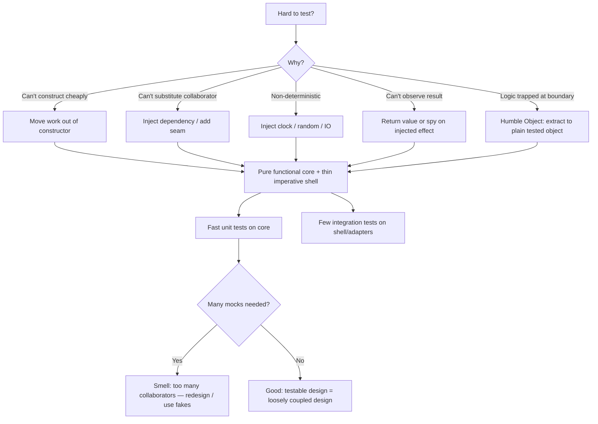

# Designing for Testability — Interview Questions

> 50+ questions across all tiers (Junior → Staff). Testability is not a property of tests — it is a property of the *production* code's design. These questions probe whether a candidate can recognize the structural choices (injection, seams, pure cores, humble objects) that make code easy to test *before* a single test is written, and whether they can tell the difference between code that is genuinely decoupled and code that has merely been buried under mocks.

---

## Table of Contents

- [Junior](#junior-15-questions)
- [Mid](#mid-15-questions)
- [Senior](#senior-12-questions)
- [Staff](#staff-10-questions)
- [Rapid-Fire](#rapid-fire)
- [Summary](#summary)
- [Further Reading](#further-reading)
- [Related Topics](#related-topics)

---

## Junior (15 questions)

### J1. What does "testable code" actually mean?

<details><summary>Answer</summary>

Code you can drive into a known state, exercise, and observe — fast, deterministically, and in isolation — without standing up the whole system. Concretely: you can construct the unit cheaply, substitute its collaborators, control its inputs (including time, randomness, and I/O), and assert on its outputs or observable effects. If any of those is hard, the *design* is the problem, not the test.

</details>

### J2. What is dependency injection (DI)?

<details><summary>Answer</summary>

A unit receives its collaborators from the outside (via constructor, parameter, or setter) instead of creating them itself. `new EmailSender()` inside a method is a hidden dependency; `OrderService(EmailSender sender)` is an injected one. DI lets a test pass a fake `sender` without touching the network.

</details>

### J3. What is the difference between DI and an IoC container?

<details><summary>Answer</summary>

DI is the *pattern* — pass dependencies in. An IoC container (Spring, Guice, Dagger, Wire) is a *tool* that wires them automatically. DI does not require a container; constructor injection by hand is DI. Conflating the two leads people to think they "can't do DI without Spring," which is false.

</details>

### J4. Why is `new` inside a method a testability problem?

<details><summary>Answer</summary>

It hard-codes the collaborator. The test cannot substitute it, so the unit drags the real dependency — a real DB connection, a real HTTP client — into every test. The dependency is also *hidden*: nothing in the signature tells you the method talks to the network.

</details>

### J5. What is a test double?

<details><summary>Answer</summary>

A stand-in for a real collaborator. Gerard Meszaros's taxonomy: **Dummy** (passed but unused), **Stub** (returns canned answers), **Spy** (records calls for later assertion), **Mock** (pre-programmed with expectations, fails if they're not met), **Fake** (a working but simplified implementation, e.g. an in-memory repository).

</details>

### J6. Stub vs mock — what's the difference?

<details><summary>Answer</summary>

A **stub** provides inputs: it answers queries so the unit can proceed (state-based testing). A **mock** verifies outputs: it asserts that a specific interaction happened (behavior-based testing). Stub when you ask "what did the system compute?"; mock when you ask "did the system tell the collaborator to do X?".

</details>

### J7. What is global mutable state and why does it break tests?

<details><summary>Answer</summary>

A singleton, static field, or process-global that holds mutable data shared across the program. Tests that mutate it leak into each other: order-dependence, flakiness, "passes alone, fails in the suite." It also can't be substituted, so any unit touching it is coupled to the whole world.

</details>

### J8. Why is `time.Now()` a problem inside business logic?

<details><summary>Answer</summary>

It makes behavior non-deterministic and tied to wall-clock. A test for "expire after 30 minutes" can't control the clock, so it either sleeps (slow, flaky) or can't be written. Inject a `Clock`/`now func() time.Time` so the test passes a fixed time.

</details>

### J9. How do you make randomness testable?

<details><summary>Answer</summary>

Inject the source of randomness. Pass a `Random`/`rand.Source` (or a function returning the next value), and in tests provide a seeded or scripted source so output is reproducible. Same principle as time: push non-determinism to the edge and inject it.

</details>

### J10. What is a "seam"?

<details><summary>Answer</summary>

Michael Feathers's term (*Working Effectively with Legacy Code*): a place where you can alter behavior without editing the code at that spot. An interface parameter is an object seam; a virtual method you can override is one; a linker substituting a library is a link seam. Seams are where you insert test doubles.

</details>

### J11. What's wrong with a constructor that opens a DB connection?

<details><summary>Answer</summary>

It does real work on instantiation, so you can't even *create* the object in a test without the DB being up. Construction should be cheap and side-effect-free: assign fields, validate arguments, nothing more. Do the work in an explicit method (`connect()`/`start()`).

</details>

### J12. What is the Humble Object pattern (one sentence)?

<details><summary>Answer</summary>

Keep the hard-to-test boundary (UI widget, framework callback, hardware driver) so thin and logic-free that it's not worth testing, and move all the logic into a plain object next to it that *is* easy to test.

</details>

### J13. Why is logic stuck in a UI handler or `main()` hard to test?

<details><summary>Answer</summary>

To reach it you must instantiate the framework or run the program. Logic inside a button-click handler or an HTTP handler can only be exercised by spinning up the UI/server. Extract the logic into a plain function/object the handler merely calls.

</details>

### J14. Does writing more tests make code testable?

<details><summary>Answer</summary>

No — that's backwards. Tests *reveal* (lack of) testability; they don't create it. Testability is a design property: you achieve it by injecting dependencies, isolating side effects, and keeping logic in plain objects. Bolting tests onto bad design produces slow, brittle, mock-heavy tests.

</details>

### J15. Give one quick win to make a class more testable.

<details><summary>Answer</summary>

Replace a hard-coded collaborator with a constructor parameter. `new Clock()` / `new HttpClient()` / `Singleton.getInstance()` inside the class becomes an argument. One change turns an untestable unit into one you can drive with a fake.

</details>

---

## Mid (15 questions)

### M16. Constructor injection vs setter injection vs field injection — which for testability?

<details><summary>Answer</summary>

**Constructor injection.** It makes dependencies explicit and mandatory, produces fully-initialized (never half-built) objects, and allows `final`/immutable fields. Setter injection allows optional/reconfigurable deps but permits objects in an invalid state. Field injection (`@Autowired` on a private field) is the worst for testing — you can't set it without reflection or the container, hiding dependencies entirely.

</details>

### M17. What is the "functional core, imperative shell" architecture?

<details><summary>Answer</summary>

Gary Bernhardt's idea: put decision-making in a **pure functional core** (no I/O, no mutation, no side effects — same input → same output) and keep all the messy I/O in a thin **imperative shell** that calls the core. The core is trivially testable with plain values (no mocks); the shell has almost no branching, so a few integration tests cover it.

</details>

### M18. Why are pure functions the easiest things to test?

<details><summary>Answer</summary>

No setup, no doubles, no teardown. You pass values and assert on the return. No clock to freeze, no DB to seed, no order-dependence. The test reads as `assert f(input) == expected`. Pushing logic into pure functions is the single highest-leverage testability move.

</details>

### M19. What are observability and controllability?

<details><summary>Answer</summary>

The two pillars of testability (borrowed from hardware testing). **Controllability**: can you drive the unit into the state you want (set inputs, dependencies, time)? **Observability**: can you see the outcome (return value, recorded interaction, state change)? Hard-to-test code usually lacks one — a `void` method that writes to a private field with no getter has poor observability; a method that reads a static singleton has poor controllability.

</details>

### M20. What does "testability is a proxy for good design" mean?

<details><summary>Answer</summary>

The forces that make code testable — small focused units, explicit dependencies, isolated side effects, clear inputs/outputs — are the same forces that make code loosely coupled and cohesive. So "hard to test" is a reliable early-warning signal of bad design (god objects, hidden coupling, mixed concerns). The pain of testing is design feedback delivered early.

*What the interviewer is really checking:* whether you see tests as a design tool, not just a verification chore.

</details>

### M21. How do you inject time? Show the shape.

<details><summary>Answer</summary>

Depend on a clock abstraction, not the global.

```go
type Clock interface{ Now() time.Time }
type Session struct{ clock Clock; ... }
func (s *Session) Expired() bool { return s.clock.Now().After(s.deadline) }
```

In production pass a real clock; in tests pass a fixed/fake clock. Equivalent: `java.time.Clock`, a `now func() time.Time`, or .NET's `TimeProvider`. The rule generalizes to all ambient non-determinism: time, random, UUIDs, env vars, file system.

</details>

### M22. Why separate object construction from business logic?

<details><summary>Answer</summary>

Mixing "who do I depend on" with "what do I do" means every test of the logic also has to satisfy the wiring (build the whole graph). Keep construction in factories, builders, `main`, or the DI container; keep behavior in objects that receive their already-built collaborators. Then logic tests need only the relevant fakes. (See Misko Hevery's "constructor does no work" rule.)

</details>

### M23. How do you get a fast unit test against code that calls a slow HTTP API?

<details><summary>Answer</summary>

Introduce a seam: define a narrow interface for what you need from the API (`PaymentGateway.charge(...)`), depend on it, and inject a fake/stub in tests. The HTTP client lives behind the interface and is exercised only by a small number of integration tests. This is Ports & Adapters applied at the unit level.

</details>

### M24. What is the difference between a fake and a mock, and when prefer a fake?

<details><summary>Answer</summary>

A **fake** is a real, working implementation that's just unsuitable for production (in-memory repo, in-memory clock, a `tmpfs` filesystem). A **mock** is configured per-test with expectations. Prefer a fake when many tests share the same collaborator: one well-written `InMemoryUserRepo` replaces dozens of per-test mock setups, and it tests *behavior* (round-tripping data) rather than *implementation* (exact call sequences). Fakes resist over-specification.

</details>

### M25. Is heavy mocking a code smell?

<details><summary>Answer</summary>

Usually yes. A test that needs five mocks, deep stubbing (`when(a.b().c().d())`), or asserts a precise sequence of internal calls is telling you the unit has too many collaborators and is coupled to *how* it works, not *what* it produces. The fix is design — collapse collaborators, extract a pure core, replace mocks with fakes — not "mock more cleverly."

*What the interviewer is really checking:* do you treat mock-heaviness as a design signal, or as normal?

</details>

### M26. What is the over-specification / brittle-test problem?

<details><summary>Answer</summary>

Mocks let you assert on internal interactions; tests then fail when you refactor *without changing behavior*, because the internal call shape changed. These tests pin the implementation, not the contract — they punish exactly the refactoring tests are supposed to enable. Prefer state-based assertions and fakes; mock only true boundaries (out-of-process side effects).

</details>

### M27. Are static methods untestable?

<details><summary>Answer</summary>

No — *pure* static methods (`Math.max`, a stateless formatter) are the *easiest* things to test: no setup, just inputs and outputs. The problem is static methods that *do work* or read global state (`DateTime.now()`, `Logger.global`, `Db.query(...)`) — those create hidden, un-substitutable dependencies. The distinction is purity and side effects, not the `static` keyword.

*What the interviewer is really checking:* whether the candidate parrots "statics are bad" or understands *which* statics and *why*.

</details>

### M28. London school vs Detroit (classicist) school — what's the difference?

<details><summary>Answer</summary>

**Detroit/classicist** (Beck, the original TDD): test a unit together with its real collaborators, mock only at genuine boundaries (network, DB), assert on resulting state. **London/mockist** (Freeman & Pryce, *GOOS*): isolate the unit-under-test by mocking *all* collaborators, assert on interactions; "outside-in" design driven by the roles you discover. Classicist tests are more refactor-tolerant; mockist tests give stronger design pressure and find missing roles earlier.

</details>

### M29. Does making code testable mean adding more interfaces?

<details><summary>Answer</summary>

Not automatically. You need a *seam* at true boundaries (I/O, time, external services) — often an interface. But interfaces with a single implementation added "just for tests" are noise that hides the real type. In Go, the consumer defines a tiny interface only where it substitutes a double. In languages with mockable concrete classes or built-in clock abstractions, you may need no new interface at all. Add seams where substitution is *needed*, not reflexively.

*What the interviewer is really checking:* whether "testable" has become a cargo-cult of interfaces, or a targeted design decision.

</details>

### M30. Should you add a seam (interface) when there is only ever one implementation?

<details><summary>Answer</summary>

Add it only when the *second* "implementation" is the test double itself and there's no cheaper way to substitute it (e.g. an out-of-process dependency). If the type is a pure value transformer with no I/O, you don't need a seam — call it directly. The test of "do I need this interface?" is "is there something I genuinely cannot control or observe without it?"

</details>

---

## Senior (12 questions)

### S31. Walk through getting a tangled legacy class under test.

<details><summary>Answer</summary>

Feathers's "legacy code dilemma": to change safely you need tests, but to test you must change the code. Steps:
1. **Find a seam** — a place to break a dependency (extract an interface, subclass-and-override a method, parameterize a constructor).
2. **Break the dependency minimally** using the least invasive seam.
3. **Write characterization tests** to pin current behavior.
4. **Refactor** behind the green tests.
5. **Replace** characterization tests with intent-based tests once you understand the behavior.

</details>

### S32. What is a characterization test?

<details><summary>Answer</summary>

A test that captures what the code *currently does*, not what it *should* do. You run the legacy code on representative inputs, record actual outputs, and assert those — even if the behavior looks wrong (bug-for-bug). It's a safety net: it makes refactoring detectable, and surprising captured values often reveal real behavior nobody knew about.

</details>

### S33. Describe Sprout Method and Sprout Class.

<details><summary>Answer</summary>

Feathers's techniques for adding features to untested code without first taming the whole thing. **Sprout Method**: write the new logic as a brand-new, fully tested method, then call it from the legacy code in one line. **Sprout Class**: when the new logic doesn't belong in the legacy class (or you can't even instantiate it), put it in a new tested class and call into it. The untested legacy stays untested but doesn't grow.

</details>

### S34. Describe Wrap Method and Wrap Class.

<details><summary>Answer</summary>

For changing behavior *around* existing code. **Wrap Method**: rename the old method, create a new one with the old name that calls the renamed one plus the new behavior. **Wrap Class** (decorator): a new class implementing the same interface, holding the legacy object, adding behavior before/after delegating. Both let you bolt tested behavior onto untouchable code.

</details>

### S35. What is "test-induced design damage" (DHH's critique)?

<details><summary>Answer</summary>

DHH's argument: chasing isolated, fast unit tests can push you to *worsen* the design — gratuitous indirection, single-implementation interfaces, service objects extracted only to be mockable, ports/adapters where a direct call would be clearer. The damage is real *when testability is pursued dogmatically*. The senior view: testability and good design usually agree; when they conflict, value the design and accept a slower integration test rather than contorting production code.

*What the interviewer is really checking:* can you hold both positions — testability as a design proxy *and* the awareness that it can be overdone?

</details>

### S36. How do you resolve the DHH vs TDD-purist tension in practice?

<details><summary>Answer</summary>

Test at the right altitude. Use fast unit tests for the pure logic core where they're cheap and natural; use integration/system tests for thin orchestration and framework glue rather than mocking it into a unit shape. Don't extract an abstraction whose *only* justification is "to mock it." If a direct, well-named call reads better and an integration test covers it adequately, prefer that. Let the test pyramid, not dogma, decide.

</details>

### S37. How does Ports & Adapters (Hexagonal) relate to testability?

<details><summary>Answer</summary>

The domain core depends only on **ports** (interfaces it owns). **Adapters** (DB, HTTP, queue) implement those ports at the edge. The core never references infrastructure, so it's testable with in-memory adapters — no containers, no network. Adapters are tested separately against the real tech. This is the architectural-scale form of "functional core, imperative shell" and of the Humble Object boundary.

</details>

### S38. Show the Humble Object pattern with a concrete boundary.

<details><summary>Answer</summary>

A view should hold no logic. Instead of formatting/branching inside a widget:

```text
Presenter (plain, tested):  buildViewModel(data) -> ViewModel  // all logic, pure
HumbleView (untested):      render(viewModel)                  // setText/setColor only
```

The presenter is unit-tested with plain data; the view is a dumb projection of the ViewModel that's so trivial it doesn't warrant a test (or gets one cheap UI smoke test). Same shape for hardware drivers, message handlers, and cron entry points.

</details>

### S39. Can you over-apply the functional core / imperative shell split?

<details><summary>Answer</summary>

Yes. Pushing *everything* through immutable value objects can add ceremony for code that's inherently I/O-shaped (a streaming pipeline, a stateful protocol). The shell can also accidentally accumulate logic if you're not disciplined — then your "few integration tests" balloon. The pattern pays off most where there is genuine decision logic to extract; for thin CRUD plumbing the split is overhead.

</details>

### S40. How do you test code that must interact with the file system or network?

<details><summary>Answer</summary>

Three layers, in preference order: (1) extract the *logic* away from the I/O so most of it is pure and needs no I/O at all; (2) for the remaining I/O code, depend on an abstraction (a port / `fs.FS` / repository) and use a fake or in-memory implementation for unit tests; (3) keep a small set of integration tests that hit a real temp dir / test container / sandbox to verify the real adapter. Don't mock the OS at the syscall level.

</details>

### S41. A `void` method does work but exposes nothing. How do you test it?

<details><summary>Answer</summary>

It has poor observability. Options, best first: change it to **return** the computed result (often the void was hiding a value); have it produce an observable **effect through an injected collaborator** you can spy on (it called `repo.save(x)`); or, last resort, expose state via a query method. If none is natural, the method is doing too much — split the computation (testable, returns a value) from the effect (thin, injected).

</details>

### S42. How does Test Data Builder support testability?

<details><summary>Answer</summary>

It separates "construct a valid object" from each test's specifics. A builder with sane defaults (`aUser().withRole("admin").build()`) means tests express only what differs and stay readable as requirements evolve. It centralizes the "what is a valid X" knowledge, so when the constructor changes you fix one builder, not 200 tests. This is a controllability tool: cheap, expressive setup. (See Builder.)

</details>

---

## Staff (10 questions)

### S43. How do you make testability an architectural property, not a per-class effort?

<details><summary>Answer</summary>

Set structural rules and enforce them: domain layer may not import infrastructure (enforced with ArchUnit / `depguard` / import-linter); time/random/IO accessed only through injected ports; controllers/handlers contain no branching (a fitness function on cyclomatic complexity of the adapter layer). Make the wiring live in one composition root. Then testability is guaranteed by the dependency rule, not by each developer remembering to inject.

</details>

### S44. How do you balance the test pyramid when units are highly testable?

<details><summary>Answer</summary>

High unit testability lets you push *most* coverage down to fast unit tests of the functional core, keeping the expensive layers thin. But beware the inverted pyramid hiding in mockist suites: thousands of mock-heavy "unit" tests that verify interactions while *no* test exercises the real adapters. Maintain enough integration/contract tests that the seams you faked are validated against reality (e.g. consumer-driven contracts for service boundaries).

</details>

### S45. When is it correct to make code *less* unit-testable on purpose?

<details><summary>Answer</summary>

When the abstraction needed to isolate a unit would obscure the design more than the integration test costs. Examples: a thin repository over an ORM where mocking the ORM tests nothing useful — test it against a real DB instead; a streaming/concurrency path where the "pure core" rewrite would be less correct than the direct version. The staff-level judgment is recognizing that *coverage at the cheapest layer* is the goal, not *unit isolation at any cost*.

</details>

### S46. How do you keep tests from ossifying the design (mock brittleness at scale)?

<details><summary>Answer</summary>

Policy: assert on observable outcomes (state, messages crossing real boundaries), not internal call sequences. Mock only out-of-process collaborators. Prefer shared, well-maintained fakes over per-test mocks. Treat "this refactor broke 300 tests but changed no behavior" as a defect in the *tests*. Periodically delete tests that only restate the implementation. The aim is a suite that *enables* refactoring, which is the whole point of having one.

</details>

### S47. How do you make legacy code testable when you can't change its construction?

<details><summary>Answer</summary>

Use seams that don't require touching the call site: **subclass-and-override** (extract the hard call into a protected method, override it in a test subclass), **link/preprocessor seams** (substitute a library or symbol at build/link time), or wrap the whole component (Wrap Class) and test the wrapper. Combine with characterization tests so you can verify nothing changed. Reach for invasive constructor parameterization only once a safety net exists.

</details>

### S48. Is dependency injection always worth its cost?

<details><summary>Answer</summary>

No. DI buys substitutability at the cost of indirection — harder to follow "what actually runs," especially under a magic container. For stable, pure, single-implementation collaborators (a date formatter, a math helper), inlining is clearer. Inject what is *non-deterministic, slow, external, or polymorphic*; construct the rest directly. Over-injection produces the same opacity problem as global state, just dressed in interfaces.

*What the interviewer is really checking:* whether the candidate can argue *against* a practice they otherwise endorse.

</details>

### S49. How do property-based tests interact with testable design?

<details><summary>Answer</summary>

They demand even more purity and determinism: a property runs hundreds of randomized inputs, so any hidden I/O, clock dependence, or shared state surfaces immediately as flakiness. A clean functional core is what makes property testing feasible — you assert invariants (round-trips, idempotence, ordering) over generated values with no mocks. So adopting property-based testing tends to *pull* the architecture toward pure cores.

</details>

### S50. How do you test concurrent / time-dependent code deterministically?

<details><summary>Answer</summary>

Remove real time and real scheduling from the logic. Inject a **virtual clock** the test advances explicitly; inject the **executor/scheduler** so the test can step it (e.g. a deterministic test scheduler, Go's `synctest`, RxJava `TestScheduler`). Model the logic as a state machine over events so concurrency becomes ordered event-application you can drive. Reserve real-thread stress tests (race detector, jcstress) for verifying the few genuinely concurrent primitives.

</details>

### S51. A team reports "our tests are slow and flaky." Diagnose from a design standpoint.

<details><summary>Answer</summary>

Slow + flaky almost always means tests touch real I/O, real time, or shared global state — i.e. the production code lacks seams, so tests can't isolate. The fix is upstream: extract a pure core (most logic becomes fast pure tests), inject clock/random/IO (removes flakiness from non-determinism), and isolate global state (removes order-dependence). Quarantine and parallelize are stopgaps; the cure is design.

</details>

### S52. How would you set a testability standard for a new service from day one?

<details><summary>Answer</summary>

Establish the dependency rule (domain core has no infra imports) and a composition root. Mandate constructor injection, no work in constructors, all ambient state (time/random/IDs/config) behind injected ports. Default to fakes over mocks; reserve mocks for out-of-process boundaries; assert on outcomes not interactions. Add contract tests at each external seam. Encode the rules as CI fitness functions so the standard survives turnover. Result: testability is a property of the architecture, free at the point of use.

</details>

---

## Rapid-Fire

| Question | Answer |
|---|---|
| Best injection style for testability? | Constructor injection. |
| Does DI require a container? | No — passing args by hand is DI. |
| Easiest code to test? | Pure functions. |
| Two pillars of testability? | Controllability + observability. |
| Where do side effects go? | The imperative shell / adapters. |
| Are pure statics untestable? | No — they're the easiest to test. |
| Which statics hurt testability? | Ones doing I/O or reading global state. |
| Is heavy mocking a smell? | Usually yes — a coupling signal. |
| Stub vs mock? | Stub feeds inputs; mock verifies interactions. |
| Prefer fake or mock for shared collaborators? | Fake. |
| Add an interface per dependency? | No — only at true seams. |
| Test for a captured legacy behavior? | Characterization test. |
| Add a feature to untested code? | Sprout Method/Class; Wrap Method/Class. |
| London vs Detroit? | Mock all collaborators vs use real ones, mock boundaries. |
| Constructor opens a DB connection — ok? | No; constructors do no work. |
| Pattern for an untestable UI/driver boundary? | Humble Object. |
| Inject time how? | A `Clock`/`now()` abstraction. |
| Testability proves what about design? | It's a proxy for loose coupling/cohesion. |

---

## Summary

Testable code is code you can **control** (set its inputs, dependencies, time, randomness) and **observe** (see its outputs or effects) cheaply and in isolation. You buy that with a handful of design moves: inject dependencies instead of `new`-ing them, keep constructors work-free, push logic into a **pure functional core** and side effects into a thin **imperative shell**, isolate untestable boundaries behind **Humble Objects** and **ports/adapters**, and put **seams** where you genuinely need to substitute a double.

The strongest senior signal is judgment about the *limits*: not every dependency deserves an interface, not every static is evil, heavy mocking is a smell rather than a tool to perfect, and chasing unit isolation dogmatically can inflict **test-induced design damage**. Testability and good design usually point the same way — when they don't, prefer the clearer design and test it at a higher altitude. For legacy code, the toolkit is **seams, characterization tests, sprout, and wrap**: get a safety net first, then improve the design behind it.



---

## Further Reading

- Michael Feathers, *Working Effectively with Legacy Code* — seams, characterization tests, sprout/wrap.
- Steve Freeman & Nat Pryce, *Growing Object-Oriented Software, Guided by Tests* — the London/mockist school.
- Gary Bernhardt, "Functional Core, Imperative Shell" (Destroy All Software screencast).
- Misko Hevery, "Writing Testable Code" / "The Clean Code Talks" (Google) — constructors do no work, DI without containers.
- Robert C. Martin, *Clean Architecture* — Humble Object, ports & boundaries.
- Gerard Meszaros, *xUnit Test Patterns* — the test-double taxonomy.
- Vladimir Khorikov, *Unit Testing Principles, Practices, and Patterns* — fakes vs mocks, over-specification, classicist defaults.
- David Heinemeier Hansson, "Test-induced design damage" and "TDD is dead? Long live testing." (the DHH debate).

---

## Related Topics

- Same chapter: [Junior](junior.md) · [Professional](professional.md)
- Chapter overview: [Designing for Testability — README](README.md)
- Related clean-code chapter: [Unit Tests](../08-unit-tests/README.md)
- Construction & seams: Builder
- Design principles behind testability: [Design Patterns](../../design-patterns/README.md)
- Refactoring untestable code: [Refactoring](../../refactoring/README.md)
