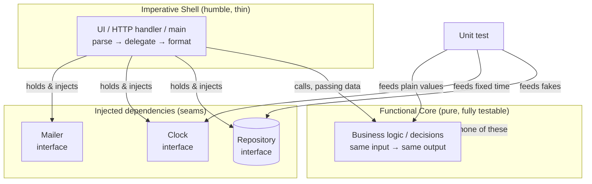
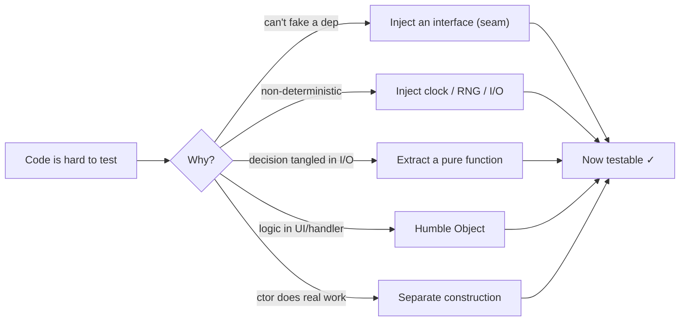

# Designing for Testability — Junior Level

> **Level:** Junior — "What's the rule? Show me a clean example."
> **Scope:** How to *shape production code* so it is easy to test. This is the **design** side of testing — the structural choices you make *before* a single test exists. It is distinct from [Unit Tests](../08-unit-tests/README.md), which is about *writing good tests*.

---

## Table of Contents

1. [The one big idea](#the-one-big-idea)
2. [Real-world analogy](#real-world-analogy)
3. [Rule 1 — Inject dependencies, don't `new` them inside](#rule-1--inject-dependencies-dont-new-them-inside)
4. [Rule 2 — Depend on an interface (a seam), not a concrete type](#rule-2--depend-on-an-interface-a-seam-not-a-concrete-type)
5. [Rule 3 — Inject the clock, randomness, and I/O](#rule-3--inject-the-clock-randomness-and-io)
6. [Rule 4 — Push decision logic into a pure function](#rule-4--push-decision-logic-into-a-pure-function)
7. [Rule 5 — Keep the untestable boundary thin (Humble Object)](#rule-5--keep-the-untestable-boundary-thin-humble-object)
8. [Rule 6 — Separate construction from logic](#rule-6--separate-construction-from-logic)
9. [The whole picture](#the-whole-picture)
10. [Common Mistakes](#common-mistakes)
11. [Test Yourself](#test-yourself)
12. [Cheat Sheet](#cheat-sheet)
13. [Summary](#summary)
14. [Further Reading](#further-reading)
15. [Related Topics](#related-topics)

---

## The one big idea

> **If code is hard to test, it is usually badly designed. Testability is a free design review.**

You do not make code testable by writing clever tests. You make it testable by **designing it so a test can control its inputs and observe its outputs**. A test needs two things:

1. **Control** — it must be able to feed the code fake collaborators (a fake database, a fixed clock, a stub payment gateway).
2. **Observation** — it must be able to see what the code decided (a return value it can assert on).

Code fights both of these when it reaches out and grabs its own collaborators: when it writes `new Database()` inside a method, calls a global singleton, reads the real system clock, or buries its one interesting decision behind three layers of UI and framework glue.

Every rule in this file is a way to give a test **control** and **observation**.

A **seam** (a term from Michael Feathers) is *a place where you can change behavior without editing the code at that place*. The most common seam is an interface parameter: production passes the real implementation, the test passes a fake. No seam means no place to insert a test double, which means you must spin up the whole world to test one line.

---

## Real-world analogy

### The car factory test rig

Imagine testing a car engine. You have two choices.

**Bad design:** the engine is welded into the chassis, the fuel line is soldered to a specific gas station's pump, and the dashboard clock is fused to the engine block. To "test" the engine you must build the whole car, drive it to *that one* gas station, and wait for the real time of day. Every test is slow, flaky, and depends on the weather.

**Good design:** the engine has *standard connectors*. You wheel it onto a test rig, plug in a fuel supply you control, attach a clock you set by hand, and bolt sensors onto the output shaft. You can test the engine at 3 a.m. with simulated fuel and read its exact torque. The connectors are **seams**. The fuel supply and clock are **injected dependencies**.

The engine didn't get more testable by accident — the engineers *designed the connectors in*. That is exactly what you do when you accept an interface as a parameter instead of building your collaborators inside.

---

## Rule 1 — Inject dependencies, don't `new` them inside

**Rule:** A unit should receive its collaborators from the outside (as constructor or function parameters), not construct them itself with `new`, nor fetch them from a global or singleton.

When a method does `new EmailClient()` inside its body, that `EmailClient` is a **hidden dependency**: nothing in the signature warns you, and a test has no way to replace it. Sending a real email is now part of "testing" your logic.

### Dirty — collaborator created inside (untestable)

**Go:**

```go
// BAD: OrderService reaches out and builds its own collaborators.
type OrderService struct{}

func (s *OrderService) PlaceOrder(o Order) error {
    db := postgres.Connect("prod-db:5432")   // hidden dependency
    mailer := smtp.NewClient("smtp.acme.com") // hidden dependency
    if err := db.Save(o); err != nil {
        return err
    }
    return mailer.Send(o.CustomerEmail, "Order confirmed")
}
// To test PlaceOrder you need a real Postgres and a real SMTP server. You can't.
```

### Clean — collaborators injected

**Go:**

```go
type OrderRepository interface {
    Save(o Order) error
}

type Mailer interface {
    Send(to, body string) error
}

type OrderService struct {
    repo   OrderRepository
    mailer Mailer
}

// Dependencies arrive from the outside via the constructor.
func NewOrderService(repo OrderRepository, mailer Mailer) *OrderService {
    return &OrderService{repo: repo, mailer: mailer}
}

func (s *OrderService) PlaceOrder(o Order) error {
    if err := s.repo.Save(o); err != nil {
        return err
    }
    return s.mailer.Send(o.CustomerEmail, "Order confirmed")
}
```

Now a test passes fakes:

```go
type fakeRepo struct{ saved []Order }
func (f *fakeRepo) Save(o Order) error { f.saved = append(f.saved, o); return nil }

type fakeMailer struct{ sent []string }
func (f *fakeMailer) Send(to, body string) error { f.sent = append(f.sent, to); return nil }

func TestPlaceOrder_SavesAndNotifies(t *testing.T) {
    repo := &fakeRepo{}
    mailer := &fakeMailer{}
    svc := NewOrderService(repo, mailer)

    err := svc.PlaceOrder(Order{CustomerEmail: "a@b.com"})

    if err != nil {
        t.Fatalf("unexpected error: %v", err)
    }
    if len(repo.saved) != 1 {
        t.Errorf("expected order saved, got %d", len(repo.saved))
    }
    if len(mailer.sent) != 1 {
        t.Errorf("expected email sent, got %d", len(mailer.sent))
    }
}
```

**Java — constructor injection:**

```java
// BAD
class OrderService {
    void placeOrder(Order o) {
        Database db = new Database("prod-db");          // hidden dependency
        EmailClient mailer = new EmailClient("smtp..."); // hidden dependency
        db.save(o);
        mailer.send(o.customerEmail(), "Order confirmed");
    }
}

// CLEAN
class OrderService {
    private final OrderRepository repo;
    private final Mailer mailer;

    OrderService(OrderRepository repo, Mailer mailer) { // injected
        this.repo = repo;
        this.mailer = mailer;
    }

    void placeOrder(Order o) {
        repo.save(o);
        mailer.send(o.customerEmail(), "Order confirmed");
    }
}
```

```java
@Test
void placeOrder_savesAndNotifies() {
    FakeRepo repo = new FakeRepo();
    FakeMailer mailer = new FakeMailer();
    OrderService svc = new OrderService(repo, mailer);

    svc.placeOrder(new Order("a@b.com"));

    assertEquals(1, repo.saved.size());
    assertEquals(1, mailer.sent.size());
}
```

**Python — pass collaborators in:**

```python
# BAD
class OrderService:
    def place_order(self, order):
        db = Database("prod-db")            # hidden dependency
        mailer = EmailClient("smtp...")     # hidden dependency
        db.save(order)
        mailer.send(order.customer_email, "Order confirmed")

# CLEAN
class OrderService:
    def __init__(self, repo, mailer):       # injected
        self._repo = repo
        self._mailer = mailer

    def place_order(self, order):
        self._repo.save(order)
        self._mailer.send(order.customer_email, "Order confirmed")
```

```python
def test_place_order_saves_and_notifies():
    repo = FakeRepo()
    mailer = FakeMailer()
    svc = OrderService(repo, mailer)

    svc.place_order(Order(customer_email="a@b.com"))

    assert len(repo.saved) == 1
    assert len(mailer.sent) == 1
```

> **The rule of thumb:** if you cannot list a class's collaborators by reading its constructor signature, it has hidden dependencies — and hidden dependencies are untestable dependencies. This is the practical heart of [dependency injection](../../design-patterns/README.md).

---

## Rule 2 — Depend on an interface (a seam), not a concrete type

**Rule:** Type your dependencies as **interfaces** (the role you need), not concrete classes. The interface is the seam where a test substitutes a double.

Injection (Rule 1) only helps if what you inject can be *faked*. If `OrderService` is typed to require a concrete `PostgresRepository`, a test would have to subclass Postgres — painful or impossible. Type it to a small interface that describes only the behavior you use, and a 5-line fake satisfies it.

### Dirty — depends on a concrete class

**Java:**

```java
// BAD: even though it's injected, the type is concrete.
class InvoiceService {
    private final PostgresInvoiceRepo repo; // concrete — no seam
    InvoiceService(PostgresInvoiceRepo repo) { this.repo = repo; }

    BigDecimal totalOutstanding(CustomerId id) {
        return repo.findUnpaid(id).stream()
                   .map(Invoice::amount)
                   .reduce(BigDecimal.ZERO, BigDecimal::add);
    }
}
// A test must build a real PostgresInvoiceRepo (and a real DB) to call totalOutstanding.
```

### Clean — depends on an interface

**Java:**

```java
// The seam: a small role interface, owned by the consumer.
interface InvoiceRepository {
    List<Invoice> findUnpaid(CustomerId id);
}

class InvoiceService {
    private final InvoiceRepository repo; // interface — a seam!
    InvoiceService(InvoiceRepository repo) { this.repo = repo; }

    BigDecimal totalOutstanding(CustomerId id) {
        return repo.findUnpaid(id).stream()
                   .map(Invoice::amount)
                   .reduce(BigDecimal.ZERO, BigDecimal::add);
    }
}
```

```java
@Test
void totalOutstanding_sumsUnpaidInvoices() {
    InvoiceRepository fake = id -> List.of(
        new Invoice(new BigDecimal("10.00")),
        new Invoice(new BigDecimal("5.50"))
    ); // a lambda is enough — no database
    InvoiceService svc = new InvoiceService(fake);

    assertEquals(new BigDecimal("15.50"), svc.totalOutstanding(new CustomerId("c1")));
}
```

**Go — interfaces are implicit, so this is especially natural:**

```go
// Consumer-side interface: declare ONLY the method you need.
type InvoiceRepository interface {
    FindUnpaid(id CustomerID) ([]Invoice, error)
}

type InvoiceService struct {
    repo InvoiceRepository // the seam
}

func (s *InvoiceService) TotalOutstanding(id CustomerID) (Money, error) {
    invoices, err := s.repo.FindUnpaid(id)
    if err != nil {
        return 0, err
    }
    var total Money
    for _, inv := range invoices {
        total += inv.Amount
    }
    return total, nil
}
```

```go
type stubRepo struct{ invoices []Invoice }
func (s stubRepo) FindUnpaid(id CustomerID) ([]Invoice, error) {
    return s.invoices, nil
}

func TestTotalOutstanding(t *testing.T) {
    svc := &InvoiceService{repo: stubRepo{invoices: []Invoice{{Amount: 1000}, {Amount: 550}}}}
    got, _ := svc.TotalOutstanding("c1")
    if got != 1550 {
        t.Errorf("want 1550, got %d", got)
    }
}
```

> **Go idiom:** define the interface *in the package that consumes it*, listing only the methods that package calls. "Accept interfaces, return structs." A narrow interface is the easiest possible seam to fake.

**Python — `Protocol` gives you a seam without inheritance:**

```python
from typing import Protocol

class InvoiceRepository(Protocol):          # structural seam
    def find_unpaid(self, customer_id: str) -> list["Invoice"]: ...

class InvoiceService:
    def __init__(self, repo: InvoiceRepository):
        self._repo = repo

    def total_outstanding(self, customer_id: str) -> Decimal:
        return sum((inv.amount for inv in self._repo.find_unpaid(customer_id)), Decimal(0))
```

```python
class StubRepo:                              # no base class needed — duck typing
    def find_unpaid(self, customer_id):
        return [Invoice(Decimal("10.00")), Invoice(Decimal("5.50"))]

def test_total_outstanding():
    svc = InvoiceService(StubRepo())
    assert svc.total_outstanding("c1") == Decimal("15.50")
```

A `Protocol` is checked structurally: any object with a matching `find_unpaid` method satisfies it. That is the seam — no `class StubRepo(InvoiceRepository)` required. See [Boundaries](../07-boundaries/README.md) for why you wrap third-party concretes behind your own interfaces.

---

## Rule 3 — Inject the clock, randomness, and I/O

**Rule:** Anything that makes the same input produce a *different output* — the current time, random numbers, reading a file, an HTTP call — must be injected, not called directly. These are the sources of **non-determinism**, and non-determinism is the enemy of a reliable test.

A function that calls `time.Now()` directly can never be tested for "what happens on a leap day" or "does the trial expire after 30 days" without time-traveling the whole machine. Inject a `Clock` and the test sets the time.

### Dirty — reads the real clock

**Go:**

```go
// BAD: behavior depends on the wall clock; "is this trial expired?" is untestable.
func IsTrialExpired(signupDate time.Time) bool {
    return time.Now().Sub(signupDate) > 30*24*time.Hour
}
```

### Clean — inject a clock

**Go:**

```go
type Clock interface {
    Now() time.Time
}

type RealClock struct{}
func (RealClock) Now() time.Time { return time.Now() }

func IsTrialExpired(signupDate time.Time, clock Clock) bool {
    return clock.Now().Sub(signupDate) > 30*24*time.Hour
}
```

```go
type fixedClock struct{ t time.Time }
func (f fixedClock) Now() time.Time { return f.t }

func TestIsTrialExpired(t *testing.T) {
    signup := time.Date(2026, 1, 1, 0, 0, 0, 0, time.UTC)
    now := fixedClock{t: time.Date(2026, 2, 15, 0, 0, 0, 0, time.UTC)} // 45 days later

    if !IsTrialExpired(signup, now) {
        t.Error("expected trial to be expired after 45 days")
    }
}
```

**Java — inject `Clock` (the JDK ships one):**

```java
// BAD
class TrialChecker {
    boolean isExpired(Instant signup) {
        return Duration.between(signup, Instant.now()).toDays() > 30; // real clock
    }
}

// CLEAN
class TrialChecker {
    private final Clock clock;
    TrialChecker(Clock clock) { this.clock = clock; } // java.time.Clock

    boolean isExpired(Instant signup) {
        return Duration.between(signup, clock.instant()).toDays() > 30;
    }
}
```

```java
@Test
void trialExpiresAfter30Days() {
    Instant signup = Instant.parse("2026-01-01T00:00:00Z");
    Clock fixed = Clock.fixed(Instant.parse("2026-02-15T00:00:00Z"), ZoneOffset.UTC);

    assertTrue(new TrialChecker(fixed).isExpired(signup));
}
```

**Python — inject a `now` callable:**

```python
from datetime import datetime, timedelta, timezone

# BAD
def is_trial_expired(signup: datetime) -> bool:
    return datetime.now(timezone.utc) - signup > timedelta(days=30)

# CLEAN — inject the clock (a zero-arg callable returning "now")
def is_trial_expired(signup: datetime, now=lambda: datetime.now(timezone.utc)) -> bool:
    return now() - signup > timedelta(days=30)
```

```python
def test_trial_expires_after_30_days():
    signup = datetime(2026, 1, 1, tzinfo=timezone.utc)
    frozen = lambda: datetime(2026, 2, 15, tzinfo=timezone.utc)  # 45 days later
    assert is_trial_expired(signup, now=frozen) is True
```

The same pattern covers randomness (inject an RNG or a "pick" function) and I/O (inject a reader/writer). The principle never changes: **the source of non-determinism becomes a parameter.**

---

## Rule 4 — Push decision logic into a pure function

**Rule:** Separate the *interesting decision* (a calculation) from the *side effects* (saving, sending, printing). Put the decision in a **pure function** — same input, same output, no side effects — so you can test it with plain values and zero mocks. This is the **functional core, imperative shell** pattern.

A pure function is the most testable thing in existence: feed it data, assert on the result. No fakes, no clocks, no setup. So move as much logic as possible *into* pure functions, and leave only the unavoidable I/O in a thin shell around them.

### Dirty — decision tangled with side effects

**Python:**

```python
# BAD: the discount decision is welded to DB reads and email sends.
class CheckoutService:
    def __init__(self, db, mailer):
        self._db = db
        self._mailer = mailer

    def checkout(self, cart_id):
        cart = self._db.load_cart(cart_id)              # I/O
        total = sum(i.price * i.qty for i in cart.items)
        if cart.customer.tier == "GOLD":                # decision
            total *= 0.90
        if total > 100:                                 # decision
            total -= 5
        self._db.save_total(cart_id, total)             # I/O
        self._mailer.send(cart.customer.email, f"Total: {total}")  # I/O
        return total
# To test the discount math you must fake a DB and a mailer. The math is buried.
```

### Clean — pure core, thin shell

**Python:**

```python
# PURE CORE: just data in, data out. No DB, no mailer, no clock. Trivially testable.
def compute_total(items, tier: str) -> Decimal:
    total = sum((i.price * i.qty for i in items), Decimal(0))
    if tier == "GOLD":
        total *= Decimal("0.90")
    if total > 100:
        total -= 5
    return total

# IMPERATIVE SHELL: orchestrates I/O, delegates every decision to the pure core.
class CheckoutService:
    def __init__(self, db, mailer):
        self._db = db
        self._mailer = mailer

    def checkout(self, cart_id):
        cart = self._db.load_cart(cart_id)
        total = compute_total(cart.items, cart.customer.tier)   # the decision
        self._db.save_total(cart_id, total)
        self._mailer.send(cart.customer.email, f"Total: {total}")
        return total
```

```python
def test_gold_customer_gets_10_percent_off():
    items = [Item(price=Decimal("100"), qty=1)]
    # No mocks. No DB. Just values.
    assert compute_total(items, tier="GOLD") == Decimal("85.0")  # 100 * .9 - 5
```

**Go:**

```go
// PURE CORE
func ComputeTotal(items []Item, tier string) Money {
    var total Money
    for _, it := range items {
        total += it.Price * Money(it.Qty)
    }
    if tier == "GOLD" {
        total = total * 90 / 100
    }
    if total > 100_00 {
        total -= 5_00
    }
    return total
}

// IMPERATIVE SHELL
func (s *CheckoutService) Checkout(cartID string) (Money, error) {
    cart, err := s.db.LoadCart(cartID)
    if err != nil {
        return 0, err
    }
    total := ComputeTotal(cart.Items, cart.Customer.Tier) // the decision
    if err := s.db.SaveTotal(cartID, total); err != nil {
        return 0, err
    }
    return total, s.mailer.Send(cart.Customer.Email, fmt.Sprintf("Total: %d", total))
}
```

```go
func TestComputeTotal_Gold(t *testing.T) {
    got := ComputeTotal([]Item{{Price: 100_00, Qty: 1}}, "GOLD")
    if got != 85_00 { // 100 * .9 - 5
        t.Errorf("want 8500, got %d", got)
    }
}
```

**Java:**

```java
// PURE CORE — a static method that only transforms its inputs.
final class Pricing {
    static BigDecimal computeTotal(List<Item> items, String tier) {
        BigDecimal total = items.stream()
            .map(i -> i.price().multiply(BigDecimal.valueOf(i.qty())))
            .reduce(BigDecimal.ZERO, BigDecimal::add);
        if ("GOLD".equals(tier)) {
            total = total.multiply(new BigDecimal("0.90"));
        }
        if (total.compareTo(new BigDecimal("100")) > 0) {
            total = total.subtract(new BigDecimal("5"));
        }
        return total;
    }
}
```

```java
@Test
void goldCustomerGets10PercentOff() {
    var items = List.of(new Item(new BigDecimal("100"), 1));
    assertEquals(new BigDecimal("85.0"), Pricing.computeTotal(items, "GOLD"));
}
```

> **Note for juniors:** a *pure static* method like `Pricing.computeTotal` is fine and highly testable. The anti-pattern is a *stateful static utility class* that hides behavior you can't fake (covered in Common Mistakes). Pure = good; hidden side effects = bad. Read more in [Pure Functions](../15-pure-functions/README.md).

---

## Rule 5 — Keep the untestable boundary thin (Humble Object)

**Rule:** Some things are genuinely hard to unit-test: UI widgets, framework callbacks, raw I/O drivers, `main`. Make those layers **humble** — so thin and dumb that there is almost nothing left to test. Move all the logic out into a plain, injected object you *can* test.

The boundary still exists; you just shrink it until "we didn't test it" carries almost no risk, because it contains no decisions — only delegation.

### Dirty — logic trapped in an HTTP handler

**Go:**

```go
// BAD: all the logic lives inside the framework handler, which needs a full
// HTTP request/response to exercise. The interesting code is unreachable by a unit test.
func SignupHandler(w http.ResponseWriter, r *http.Request) {
    body, _ := io.ReadAll(r.Body)
    var req SignupRequest
    json.Unmarshal(body, &req)

    if len(req.Password) < 8 {                       // logic, trapped
        http.Error(w, "password too short", 400)
        return
    }
    if !strings.Contains(req.Email, "@") {           // logic, trapped
        http.Error(w, "bad email", 400)
        return
    }
    hashed := bcrypt.Hash(req.Password)              // logic, trapped
    db := postgres.Connect("prod")                   // hidden dependency too!
    db.Insert(req.Email, hashed)
    w.WriteHeader(201)
}
```

### Clean — humble handler delegates to a testable service

**Go:**

```go
// The handler is now HUMBLE: parse, delegate, translate the result. No decisions.
type SignupService interface {
    Register(email, password string) error
}

func SignupHandler(svc SignupService) http.HandlerFunc {
    return func(w http.ResponseWriter, r *http.Request) {
        var req SignupRequest
        if err := json.NewDecoder(r.Body).Decode(&req); err != nil {
            http.Error(w, "bad request", 400)
            return
        }
        if err := svc.Register(req.Email, req.Password); err != nil {
            http.Error(w, err.Error(), 400) // translate domain error to HTTP
            return
        }
        w.WriteHeader(201)
    }
}

// All the logic lives here, in a plain struct with injected deps — fully unit-testable.
type signupService struct {
    repo   UserRepository
    hasher PasswordHasher
}

func (s *signupService) Register(email, password string) error {
    if len(password) < 8 {
        return errors.New("password too short")
    }
    if !strings.Contains(email, "@") {
        return errors.New("invalid email")
    }
    return s.repo.Insert(email, s.hasher.Hash(password))
}
```

Now the validation rules are tested directly against `signupService.Register` with no HTTP at all:

```go
func TestRegister_RejectsShortPassword(t *testing.T) {
    svc := &signupService{repo: &fakeRepo{}, hasher: &fakeHasher{}}
    err := svc.Register("a@b.com", "short")
    if err == nil {
        t.Error("expected error for short password")
    }
}
```

**Java — humble controller, testable service:**

```java
// HUMBLE controller: bind input, call service, map result. Zero business logic.
@RestController
class SignupController {
    private final SignupService service; // injected

    SignupController(SignupService service) { this.service = service; }

    @PostMapping("/signup")
    ResponseEntity<Void> signup(@RequestBody SignupRequest req) {
        service.register(req.email(), req.password()); // all logic lives here
        return ResponseEntity.status(201).build();
    }
}

// TESTABLE service: plain class, no framework, no HTTP.
class SignupService {
    private final UserRepository repo;
    private final PasswordHasher hasher;
    SignupService(UserRepository repo, PasswordHasher hasher) {
        this.repo = repo; this.hasher = hasher;
    }
    void register(String email, String password) {
        if (password.length() < 8) throw new ValidationException("password too short");
        if (!email.contains("@")) throw new ValidationException("invalid email");
        repo.insert(email, hasher.hash(password));
    }
}
```

**Python — humble view, testable service:**

```python
# HUMBLE view (framework boundary): parse request, delegate, format response.
def signup_view(request):
    data = request.json
    try:
        signup_service.register(data["email"], data["password"])  # all logic here
    except ValidationError as e:
        return Response(str(e), status=400)
    return Response(status=201)

# TESTABLE service: plain object, injected deps.
class SignupService:
    def __init__(self, repo, hasher):
        self._repo = repo
        self._hasher = hasher

    def register(self, email: str, password: str) -> None:
        if len(password) < 8:
            raise ValidationError("password too short")
        if "@" not in email:
            raise ValidationError("invalid email")
        self._repo.insert(email, self._hasher.hash(password))
```

> **The litmus test:** if deleting your UI/HTTP layer would lose any *decision*, the boundary is not humble enough. A humble boundary loses only wiring.

---

## Rule 6 — Separate construction from logic

**Rule:** Building the object graph (deciding which database, which mailer, reading config, opening connections) is a *different job* from running business logic. Do construction in one place — `main`, a factory, or a DI container — and keep your business classes free of construction work. In particular, **constructors must not do real work**.

A "god constructor" that opens a network connection or queries a database the moment you write `new Service()` means a test cannot even *instantiate* the class without the real world being present.

### Dirty — god constructor doing real work

**Java:**

```java
// BAD: just constructing this object hits the network and the DB.
class ReportService {
    private final Connection db;
    private final HttpClient http;
    private final Config config;

    ReportService() {
        this.config = Config.loadFromDisk("/etc/app.conf"); // file I/O in ctor
        this.db = DriverManager.getConnection(config.dbUrl()); // network in ctor
        this.http = HttpClient.newHttpClient();
        this.db.execute("SELECT 1"); // real query in ctor!
    }
}
// `new ReportService()` in a test fails unless prod config and DB exist.
```

### Clean — construction happens outside; logic class just receives deps

**Java:**

```java
// The business class takes ready-made collaborators. The constructor only assigns.
class ReportService {
    private final ReportRepository repo;
    private final ReportFormatter formatter;

    ReportService(ReportRepository repo, ReportFormatter formatter) {
        this.repo = repo;          // no I/O, no work — just wiring
        this.formatter = formatter;
    }

    Report build(CustomerId id) {
        return formatter.format(repo.findRows(id));
    }
}

// Construction is a separate concern, done once at the edge (a factory / main / DI).
class AppFactory {
    static ReportService reportService(Config cfg) {
        var repo = new PostgresReportRepository(cfg.dbUrl());
        var formatter = new PdfReportFormatter();
        return new ReportService(repo, formatter);
    }
}
```

```java
@Test
void build_formatsRows() {
    ReportRepository repo = id -> List.of(new Row("a"), new Row("b"));
    ReportFormatter formatter = rows -> new Report(rows.size() + " rows");
    ReportService svc = new ReportService(repo, formatter); // instant, no I/O

    assertEquals("2 rows", svc.build(new CustomerId("c1")).text());
}
```

**Go — `main` wires, the struct just holds:**

```go
// BAD: NewServer does real work, so tests can't construct it offline.
func NewServer() *Server {
    db, _ := sql.Open("postgres", os.Getenv("DB_URL"))
    db.Ping() // real connection at construction time
    return &Server{db: db}
}

// CLEAN: the struct receives ready collaborators; wiring lives in main().
type Server struct {
    repo Repository
}

func NewServer(repo Repository) *Server { // trivial, no I/O
    return &Server{repo: repo}
}

func main() {
    db, err := sql.Open("postgres", os.Getenv("DB_URL"))
    if err != nil {
        log.Fatal(err)
    }
    srv := NewServer(NewPostgresRepo(db)) // construction at the edge
    log.Fatal(http.ListenAndServe(":8080", srv.Routes()))
}
```

**Python — factory function assembles, classes stay pure of construction:**

```python
# BAD
class ReportService:
    def __init__(self):
        self._db = connect(os.environ["DB_URL"])   # work in __init__
        self._db.execute("SELECT 1")               # real query in __init__

# CLEAN
class ReportService:
    def __init__(self, repo, formatter):           # just assignment
        self._repo = repo
        self._formatter = formatter

# Construction lives in a composition-root factory, called once at startup.
def build_report_service(config) -> ReportService:
    repo = PostgresReportRepo(config.db_url)
    return ReportService(repo, PdfFormatter())
```

> **Composition root:** the single place (usually `main`/startup) where you assemble the object graph. Keeping construction there means every other class is born testable. This is the natural home of [creational patterns](../../design-patterns/README.md) like Factory.

---

## The whole picture



Read it as: the **shell** is humble and grabs the **seams**; the **core** is pure and decides everything; the **test** controls the seams and asserts on the core. Every rule in this file pushes code from the hard-to-test outer ring into the easy-to-test inner ring.

---

## Common Mistakes

| # | Mistake | Why it kills testability | Fix |
|---|---------|--------------------------|-----|
| 1 | `new Collaborator()` inside a method | Hidden dependency — no way to substitute a fake | Inject it (Rule 1) |
| 2 | Calling a singleton/global (`Logger.instance`, `Config.GLOBAL`) | Global state leaks between tests; can't fake | Inject the dependency |
| 3 | Typing a field as a concrete class | No seam to substitute — must build the real thing | Type it as an interface (Rule 2) |
| 4 | `time.Now()` / `random()` / file reads called directly | Non-deterministic — same input, different output | Inject a clock / RNG / reader (Rule 3) |
| 5 | Decision logic mixed with DB/network calls | Can't test the math without faking the world | Extract a pure function (Rule 4) |
| 6 | Business rules living inside a UI/HTTP handler | Need a full framework request to reach them | Make the boundary humble (Rule 5) |
| 7 | Constructor that opens connections / queries DB | Can't even *instantiate* the class in a test | Constructor only assigns; wire in `main` (Rule 6) |
| 8 | A *stateful* static utility class holding behavior | Statics can't be faked or reset between tests | Make it an injectable instance (or a pure function) |
| 9 | Global mutable state shared across modules | One test mutates it; the next test fails randomly | Pass state explicitly; no module-level mutable globals |
| 10 | Testing only through 4 layers because the unit isn't isolated | Slow, flaky, vague failures | Isolate the unit with seams so you can test it directly |

> **Note on statics:** a *pure* static (`Math.max`, `Pricing.computeTotal`) is perfectly testable — it has no hidden state or side effects. The smell is a static that *does I/O or holds mutable state* (`Db.query(...)`, `Cache.put(...)`), because there is no seam to fake it. Distinguish "pure static" (fine) from "static with side effects" (hide it behind an injected interface).

---

## Test Yourself

**1. What two capabilities does a test need from your code, and what gives them?**

<details><summary>Answer</summary>

**Control** over inputs (feed fakes/stubs) and **observation** of outputs (assert on a return value). Seams (injected interfaces) give control; pure functions and return values give observation. Code that grabs its own collaborators or hides its decision behind side effects denies the test both.

</details>

**2. What is a "seam," and what is the most common one?**

<details><summary>Answer</summary>

A seam is a place where you can change behavior without editing the code at that place (Michael Feathers). The most common seam is an **interface used as a parameter or field**: production passes the real implementation, the test passes a double. No seam = nothing to substitute = you must build the whole real dependency.

</details>

**3. Why is `funcThatCallsTimeNow()` hard to test, and how do you fix it?**

<details><summary>Answer</summary>

It is **non-deterministic**: the output depends on the wall clock, so "does the trial expire after 30 days?" can't be asserted reliably. Fix: inject a `Clock` (or a `now()` callable). The test passes a fixed/frozen clock and gets deterministic behavior. Same fix applies to randomness and I/O.

</details>

**4. You have a 200-line `checkout()` that loads a cart from the DB, computes a discount, saves, and emails. How do you make the discount logic testable without mocks?**

<details><summary>Answer</summary>

Apply **functional core, imperative shell**: extract a pure function `computeTotal(items, tier) -> total` that takes plain data and returns a number, with no I/O. Test it directly with values — no DB or mailer fake needed. `checkout()` becomes a thin shell that loads, calls the pure function, then saves and emails.

</details>

**5. Is a static method always a testability smell?**

<details><summary>Answer</summary>

No. A **pure** static (no hidden state, no side effects — e.g. `computeTotal`) is one of the *most* testable things possible. The smell is a static that **does I/O or holds mutable state** (`Db.save`, `Cache.put`), because there is no seam to fake and global state leaks between tests. Pure static = fine; side-effecting static = hide behind an injected interface.

</details>

**6. Why must a constructor not open a database connection?**

<details><summary>Answer</summary>

Because then a test cannot even *instantiate* the class without a real database present — `new Service()` itself fails. Construction (wiring the object graph) is a separate job from logic. The constructor should only assign already-built collaborators; the actual connecting happens once at the **composition root** (`main`/factory). That keeps every business class instant to construct and therefore testable.

</details>

**7. Your teammate "made it testable" by adding `if (TEST_MODE) { ... }` branches inside the production method. What's wrong with that?**

<details><summary>Answer</summary>

That is not a seam — it bakes test awareness into production code. The method now behaves differently under test than in production, so the test no longer verifies the real path, and the branch ships to users. The correct seam is *external*: inject a fake collaborator so the production code runs unchanged and only its dependency differs.

</details>

**8. Why is "I can only test this by driving the UI through four layers" a design smell, not just a testing inconvenience?**

<details><summary>Answer</summary>

Because hard-to-test almost always means tightly-coupled. If the only way to reach a decision is through the UI, the HTTP layer, a controller, and a service, those layers are entangled and the decision has no home of its own. The fix (extract the logic into an injectable, pure-ish unit) improves the *design* — testability was just the symptom that revealed the coupling.

</details>

---

## Cheat Sheet

| Want a test to... | Design move | Mechanism (Go / Java / Python) |
|---|---|---|
| Substitute a fake collaborator | **Inject** dependencies | constructor/func params; never `new` inside |
| Have something to substitute | Depend on an **interface** (seam) | `interface` / `interface` / `Protocol` |
| Control time / randomness / I/O | **Inject** the clock/RNG/reader | `Clock`/`now` param; fixed clock in test |
| Test the decision with no mocks | **Pure function** (functional core) | data in → data out, no side effects |
| Stop testing through the framework | **Humble Object** boundary | thin handler delegates to plain service |
| Construct the class in a test instantly | **Separate construction** from logic | wire in `main`/factory; ctor only assigns |

**Smell → cure quick reference**

- `new X()` inside a method → inject `X` as an interface.
- `time.Now()` / `random()` in logic → inject a `Clock` / RNG.
- Decision buried in I/O → extract a pure function.
- Logic inside an HTTP handler → move to an injectable service; keep the handler humble.
- Constructor does network/DB work → move work to `main`; constructor only assigns.
- Static class doing side effects → make it an injectable instance behind an interface.



---

## Summary

- **Testability is a design property, not a testing trick.** You earn it by giving a test two powers: **control** over inputs and **observation** of outputs.
- **Inject dependencies** (Rule 1) and **type them as interfaces** (Rule 2) so a test can substitute fakes. The interface is the **seam** — the place to insert a test double.
- **Inject non-determinism** — clock, randomness, I/O (Rule 3) — so the same input always yields the same output.
- **Push decisions into pure functions** (Rule 4): the functional core is testable with plain values and no mocks; the imperative shell just orchestrates.
- **Keep boundaries humble** (Rule 5): UI/HTTP/framework layers should hold only wiring, never decisions.
- **Separate construction from logic** (Rule 6): build the object graph at the composition root; constructors only assign — never open connections.
- Across all rules, the through-line is the same: **code that is hard to test is usually badly coupled.** Fixing testability fixes the design.

---

## Further Reading

- **Michael Feathers — *Working Effectively with Legacy Code*** — the canonical source for *seams* and how to introduce them into untestable code.
- **Gary Bernhardt — "Functional Core, Imperative Shell"** — the talk that names the pure-core / thin-shell split used in Rule 4.
- **Robert C. Martin — *Clean Code* & *Clean Architecture*** — the Humble Object boundary and the dependency rule.
- **Misko Hevery — "Writing Testable Code"** — classic guide; especially "do no real work in the constructor" (Rule 6).

---

## Related Topics

- [middle.md](middle.md) — the same rules at depth: test doubles taxonomy, ports & adapters, when injection is overkill, dealing with legacy seams.
- [senior.md](senior.md) — architectural testability: hexagonal/clean architecture, contract tests, testability as an organizing force.
- [Chapter README](../README.md) — overview and the full set of positive rules and anti-patterns.
- [Unit Tests](../08-unit-tests/README.md) — the companion chapter on *writing* the tests this design enables.
- [Pure Functions](../15-pure-functions/README.md) — the foundation of the functional-core idea in Rule 4.
- [Boundaries](../07-boundaries/README.md) — wrapping third-party code behind your own interfaces so it becomes a seam.
- [Design Patterns](../../design-patterns/README.md) — Dependency Injection, Factory, and other creational patterns for separating construction.
- [Refactoring](../../refactoring/README.md) — mechanical steps for introducing seams and extracting pure functions into existing code.
- [Anti-Patterns](../../anti-patterns/README.md) — the god constructor, hidden dependencies, and global state as recognized anti-patterns.

