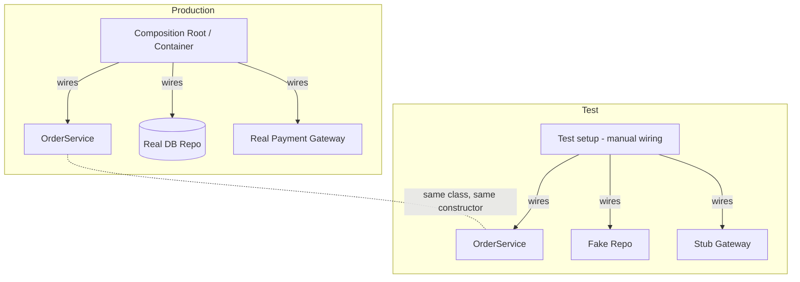

# Designing for Testability — Middle Level

> Focus: "Why?" and "When does it bend?" — testability as a *proxy* for good design, the trade-offs of injection, seams, pure cores, and the humble object, and the cases where chasing testability damages the production design instead of improving it.

---

## Table of Contents

1. [Testability as a proxy — and where the proxy lies](#testability-as-a-proxy--and-where-the-proxy-lies)
2. [Test-induced design damage: the counter-force](#test-induced-design-damage-the-counter-force)
3. [How to inject: constructor vs container vs manual wiring](#how-to-inject-constructor-vs-container-vs-manual-wiring)
4. [Seams without over-abstraction](#seams-without-over-abstraction)
5. [Pure core, imperative shell — minimizing the mocking surface](#pure-core-imperative-shell--minimizing-the-mocking-surface)
6. [The Humble Object boundary](#the-humble-object-boundary)
7. [Sociable vs solitary tests, and the design that enables each](#sociable-vs-solitary-tests-and-the-design-that-enables-each)
8. [Don't mock what you don't own — when integration tests win](#dont-mock-what-you-dont-own--when-integration-tests-win)
9. [Designing for observability](#designing-for-observability)
10. [Common Mistakes](#common-mistakes)
11. [Test Yourself](#test-yourself)
12. [Cheat Sheet](#cheat-sheet)
13. [Summary](#summary)
14. [Further Reading](#further-reading)
15. [Related Topics](#related-topics)

---

## Testability as a proxy — and where the proxy lies

The central claim of this chapter: **hard-to-test code is usually badly designed code**. When a unit resists testing, the test is reporting a structural problem — hidden dependencies, tight coupling to globals, or logic fused to a side effect. The pain you feel writing the test is the same pain the next maintainer will feel changing the code.

The friction maps almost one-to-one onto design defects:

| Test pain | The design defect it reveals |
|---|---|
| "I can't construct this object without a live database." | Construction does real work; collaborators are hidden, not injected. |
| "The test passes alone but fails in the suite." | Shared global mutable state. |
| "I have to mock six things to test one behavior." | The unit reaches across too many boundaries; low cohesion. |
| "The result is only visible as a log line." | No observable return value or event — the method is a black hole. |
| "It returns a different answer every run." | Un-injected `time.Now()`, randomness, or I/O. |

So far, so clean. But the word that matters in "**usually** badly designed" is *usually*. Testability is a **proxy metric**, and every proxy metric can be gamed or misread. Optimizing the proxy instead of the goal is where teams go wrong — which is the entire next section.

> **The honest framing:** testability is a *symptom reader*, not a *design goal*. Good decoupling makes code testable. The reverse — contorting code to satisfy a test harness — does not reliably make it well designed, and sometimes makes it worse.

---

## Test-induced design damage: the counter-force

David Heinemeier Hansson (DHH) coined **test-induced design damage**: changes made to production code *purely* to enable a particular testing style, which degrade the design that would otherwise be natural. This is the necessary counterweight to "make everything testable."

Symptoms of damage:

- **An interface with exactly one implementation**, created so a test can supply a mock — adding indirection nobody else needs.
- **Public methods that exist only so a test can reach internal state** — breaking encapsulation to assert on a private intermediate.
- **Constructor parameters multiplying** because every collaborator, however trivial, is injected "for testability," turning a 2-argument object into an 8-argument one.
- **Logic spread thin across many tiny classes** so each is "unit testable in isolation," when one cohesive class would have been clearer and a single sociable test would have covered it.

```python
# Damage: a one-impl interface + injected formatter purely to mock it in a test.
class Greeter:
    def __init__(self, name_formatter: "NameFormatter", clock: "Clock", repo: "UserRepo"):
        self._fmt = name_formatter
        self._clock = clock
        self._repo = repo

    def greeting(self, user_id: str) -> str:
        user = self._repo.get(user_id)
        return f"Hello, {self._fmt.format(user.name)}"  # formatting is pure string work
```

```python
# Healthier: keep pure formatting inline; inject only the real boundary (the repo).
class Greeter:
    def __init__(self, repo: UserRepo):
        self._repo = repo

    def greeting(self, user_id: str) -> str:
        user = self._repo.get(user_id)
        return f"Hello, {user.name.title()}"  # test by calling greeting() with a fake repo
```

The discriminating question: **would I keep this seam if no test existed?** If the abstraction earns its place by enabling substitution that production genuinely needs (a second payment provider, a swappable storage backend), keep it. If its *only* consumer is the test, you are paying production complexity to subsidize a test — and a better-shaped test (a fake, a sociable test, an integration test) would not demand it.

> The resolution between "design for testability" and "don't damage design for tests" is not a contradiction. Both say the same thing: **let good design make code testable; do not let test mechanics dictate bad design.** When they conflict, the test is usually asking for the wrong kind of isolation.

---

## How to inject: constructor vs container vs manual wiring

Dependency injection is the load-bearing technique for testability — it converts hidden collaborators into substitutable parameters. But *how* you inject has trade-offs.

### Constructor injection (the default)

Dependencies are mandatory parameters of the constructor. The object is impossible to build in an invalid state, dependencies are explicit, and tests pass fakes directly with zero framework.

```go
type OrderService struct {
    repo    OrderRepo
    payment PaymentGateway
    clock   func() time.Time // inject time as a function — no global time.Now()
}

func NewOrderService(repo OrderRepo, payment PaymentGateway, clock func() time.Time) *OrderService {
    return &OrderService{repo: repo, payment: payment, clock: clock}
}
```

```go
// Test: wire fakes by hand. No container, no magic.
svc := NewOrderService(
    &FakeOrderRepo{},
    &StubPaymentGateway{approve: true},
    func() time.Time { return time.Date(2026, 1, 1, 0, 0, 0, 0, time.UTC) },
)
```

**When it bends:** a constructor with 8+ parameters is a smell — but the smell is *low cohesion*, not "too much DI." The fix is to split the class, not to hide the dependencies in a container.

### Framework container (Spring, Guice, Dagger, dependency-injector)

A container resolves and wires the graph at startup from configuration or annotations.

```java
@Service
class OrderService {
    private final OrderRepo repo;
    private final PaymentGateway payment;
    private final Clock clock;

    OrderService(OrderRepo repo, PaymentGateway payment, Clock clock) {
        this.repo = repo; this.payment = payment; this.clock = clock;
    }
}
```

**Trade-off:** containers shine for wiring large graphs and managing lifecycles/scopes. But note the class above is *still constructor-injected* — the container only chooses arguments. The anti-pattern is **field/setter injection driven by the container** (`@Autowired` on a private field), which makes the object un-testable *without* the container and hides dependencies. Prefer constructor injection even when a container is present; then unit tests need no container at all.

### Manual wiring (composition root)

A single place — `main`, a factory, an app bootstrap — constructs the whole graph by hand.

**Trade-off:** maximally explicit and dependency-free, scales poorly for very large graphs but is ideal up to mid-size apps and is the most test-friendly. Many teams use manual wiring in tests and a container in production, served by the same constructor-injected classes.



> **Rule:** the *class* should be unit-testable with hand-wired fakes regardless of how production wires it. If your class only works under the container, the container has become a hidden dependency.

---

## Seams without over-abstracting

A **seam** (Michael Feathers, *Working Effectively with Legacy Code*) is a place where you can alter behavior without editing the code at that point — typically by substituting a collaborator. Seams are what make isolation possible.

The middle-level skill is knowing **when to introduce one**. The failure modes sit at both extremes:

- **No seam:** a method `new`s its collaborator or calls a static, so there is no point to substitute. You cannot test the logic without the real thing.
- **Too many seams:** every collaboration is abstracted behind an interface "just in case," producing a forest of single-implementation interfaces (the test-induced damage above).

**The heuristic:** add a seam when you need to substitute *now* — a real boundary you must fake (clock, network, DB, randomness), or a genuine variation point production needs (two providers). Do **not** add an interface speculatively for a type that has one implementation and crosses no boundary. You can introduce the seam the moment a second case appears; YAGNI applies to seams too.

```python
# Over-abstraction: TaxCalculator is pure arithmetic with one impl. No seam needed.
class ITaxCalculator(Protocol):       # delete this
    def tax(self, amount: Decimal) -> Decimal: ...

# Right: call the pure function directly; test it directly. The seam that DOES
# earn its place is the boundary to an external rates service:
class TaxRatesProvider(Protocol):     # keep this — it hits the network
    def rate_for(self, region: str) -> Decimal: ...
```

> **Boundaries are the natural seam locations.** See [`../07-boundaries/README.md`](../07-boundaries/README.md): the line between your code and the outside world (DB, HTTP, filesystem, time) is exactly where a seam pays for itself, and exactly where it does not need an excuse.

---

## Pure core, imperative shell — minimizing the mocking surface

The most reliable way to need fewer mocks is to **have less to mock**. Push decision logic into pure functions that take data and return data; confine side effects to a thin outer layer.

- **Pure core:** deterministic, no I/O, no clock, no globals. Tested by passing inputs and asserting outputs — no doubles at all.
- **Imperative shell:** does the I/O, then hands data to the core and acts on the result. Thin enough that a few integration tests cover it.

```go
// Pure core: all the rules, zero I/O. Trivially testable with plain values.
func DecideDiscount(order Order, now time.Time) Decision {
    if order.Total > 100 && isWeekend(now) {
        return Decision{Discount: order.Total * 0.10, Reason: "weekend-bulk"}
    }
    return Decision{Discount: 0}
}

// Imperative shell: I/O in, pure call, I/O out.
func (s *OrderService) ApplyDiscount(id string) error {
    order, err := s.repo.Get(id)        // side effect (read)
    if err != nil { return err }
    decision := DecideDiscount(order, s.clock())  // pure
    return s.repo.SaveDiscount(id, decision)      // side effect (write)
}
```

Tests for `DecideDiscount` need no fakes, run in microseconds, and cover the entire rules matrix exhaustively. Only the shell — small and boring — needs the repo faked. Compare this with logic interleaved with I/O, where every test must mock a chain of calls.

> **Preference order for isolating dependencies:** real object → in-memory **fake** → **stub** → **mock**. Reach for deep mock chains last. A `mock.repo.expects.get().returns(...).then.save().verify()` ritual couples the test to the *implementation's call sequence*; a hand-written in-memory fake couples it to behavior. See [`../15-pure-functions/README.md`](../15-pure-functions/README.md) for why pure functions eliminate the question entirely.

---

## The Humble Object boundary

Some code genuinely cannot be unit-tested cheaply: a UI event handler, a framework callback, a `main`, a thread entry point, a thin DB adapter. The **Humble Object** pattern (Gerard Meszaros) says: make that layer so dumb it barely needs testing, and move all the logic it *would* have held into a testable plain object next to it.

```python
# Humble: the framework handler does no logic — it adapts and delegates.
class CheckoutHandler:                       # framework-bound, "humble"
    def __init__(self, checkout: Checkout):  # Checkout is a plain, testable object
        self._checkout = checkout

    def on_request(self, http_request):                 # untestable framework edge
        cmd = parse(http_request)                       # trivial mapping
        result = self._checkout.place(cmd)              # ALL logic lives here
        return to_http_response(result)                 # trivial mapping
```

The handler stays at "extract input, call core, format output" — three lines you cover with one or two integration tests. `Checkout` holds the rules and is unit-tested in full isolation. The humble layer is the deliberate home for the *un*-testable, keeping it small instead of letting logic leak into a place you can't reach.

> This is the same shape as pure-core/imperative-shell, viewed from the boundary: the Humble Object *is* the imperative shell at a specific framework edge.

---

## Sociable vs solitary tests, and the design that enables each

Martin Fowler distinguishes:

- **Solitary test:** the unit under test is isolated; all collaborators are replaced with doubles.
- **Sociable test:** the unit is tested together with its real collaborators (the ones that are cheap and in-process), substituting only true boundaries.

Neither is universally correct, and **the design dictates which is even possible**:

| Design property | Enables |
|---|---|
| Collaborators are pure / cheap / in-memory | **Sociable** tests — use the real ones, fewer doubles, tests survive refactors |
| Collaborators cross expensive boundaries (DB, net) | **Solitary** tests for the unit + integration tests for the boundary |
| Logic fused to a side effect | Forces over-mocked solitary tests (a smell) |

A pure-core/imperative-shell design naturally produces **sociable** core tests: the core's collaborators are other pure functions, so you run them for real and only fake the shell's boundaries. Over-mocked solitary tests are often a sign that the unit is reaching across a boundary it shouldn't — the design, not the test, is wrong.

> **Trade-off:** solitary tests pinpoint the failing unit precisely but couple to call structure (refactor-fragile). Sociable tests are refactor-robust and catch integration bugs but localize failures less precisely. Use solitary where isolation is genuinely needed (true boundaries); prefer sociable for clusters of cheap, pure collaborators.

---

## Don't mock what you don't own — when integration tests win

A well-known rule (Steve Freeman & Nat Pryce, *Growing Object-Oriented Software*): **don't mock types you don't own.** Mocking a third-party client (the AWS SDK, a payment library, a DB driver) bakes *your assumptions* about its behavior into the test. When the real library behaves differently — a retry, a wrapped error, a pagination quirk — your mock-based test stays green while production breaks.

The design response is to **wrap the third party behind a thin port you own** (an interface in your domain language), and:

- **Unit-test your code against the port** with a fake you control.
- **Integration-test the adapter** (the real implementation of the port) against the real dependency or a high-fidelity substitute (Testcontainers, an embedded server, a sandbox).

```java
// Port you own — mock this in unit tests.
interface PaymentGateway { PaymentResult charge(Money amount, Card card); }

// Adapter you own, wrapping Stripe (which you do NOT mock).
class StripeGateway implements PaymentGateway {
    private final com.stripe.StripeClient stripe;   // third party
    public PaymentResult charge(Money amount, Card card) { /* translate + call */ }
}
// StripeGateway is verified by an INTEGRATION test against Stripe's test mode,
// never by mocking com.stripe.StripeClient.
```

This is where designing for testability connects directly to [`../07-boundaries/README.md`](../07-boundaries/README.md): the boundary wrapper is simultaneously your seam, your humble object, and the line between unit and integration testing. **Integration tests are the right tool when the contract you depend on lives outside your code** — and no amount of mocking can verify a contract you don't own.

---

## Designing for observability

A behavior you cannot observe, you cannot assert. Methods that do work but expose nothing — mutating private state, writing only a log line, firing-and-forgetting — are testable only through brittle, indirect means (parsing logs, reflecting into privates).

Design for observability by giving each meaningful behavior an **assertable output**:

- **Return a value** instead of mutating hidden state. A `Decision`, a `Result`, a computed object you can compare.
- **Emit a domain event** the test can capture (a recorded event, a callback, a message on an in-memory bus) rather than a side effect buried in a vendor SDK.
- **Make state queryable** through a public accessor when a return value doesn't fit.

```go
// Hard to observe: only a log line proves anything happened.
func (s *Svc) Process(o Order) {
    if o.Fraudulent { log.Printf("rejected %s", o.ID); return }  // assert how?
    s.charge(o)
}

// Observable: return a result the test compares directly.
func (s *Svc) Process(o Order) ProcessResult {
    if o.Fraudulent {
        return ProcessResult{Status: Rejected, Reason: "fraud"}
    }
    return ProcessResult{Status: Charged, Amount: o.Total}
}
```

> Returning a result also tends to improve the *production* design: it makes the outcome explicit to callers, composes better, and removes the hidden-side-effect coupling. Observability is another case where the testable shape and the well-designed shape coincide.

---

## Common Mistakes

1. **Adding an interface with one implementation "for testability."** If only the test consumes it, it's test-induced design damage. Add the seam when production needs substitution, or fake the concrete via a different technique.
2. **Field/setter injection under a container** (`@Autowired` private field). The object becomes un-testable without the framework. Use constructor injection even with a container.
3. **Mocking what you don't own.** Wrap the third party in a port; unit-test against the port, integration-test the adapter against the real thing.
4. **Deep mock chains** (`when(a.b()).thenReturn(c); when(c.d())...`). The test now asserts call structure, not behavior, and breaks on every refactor. Prefer an in-memory fake or a sociable test.
5. **Exposing privates / adding getters only for tests.** This is the test reaching into intermediates. Assert on the public outcome; if there isn't one, the method needs a return value, not the test needs a getter.
6. **Un-injected `time.Now()`, `random`, `uuid`, env reads.** Non-deterministic units. Inject a clock/RNG/ID source — usually as a simple function, not a heavyweight interface.
7. **God constructors doing real work** (opening connections, hitting the network on `new`). Construction should only assign; real work happens in methods. Otherwise the object can't be instantiated in a test.
8. **Splitting one cohesive class into many tiny ones so each is "isolatable."** This trades clarity for an isolation you didn't need. A sociable test over the cohesive unit is often better.
9. **Treating every solitary-test mock as virtuous.** Over-mocking is a design smell signaling the unit reaches across a boundary it shouldn't own.

---

## Test Yourself

1. **You introduce an interface so a unit test can supply a mock. The interface has exactly one production implementation and will likely never have another. Good design?**

<details><summary>Answer</summary>

This is the textbook case of **test-induced design damage**. The seam exists solely to serve the test; production gets indirection it doesn't need. Better options: write an in-memory **fake** of the concrete type, use a **sociable** test if the collaborator is cheap and pure, or restructure so the logic is a pure function you call directly. Keep the interface only if production genuinely needs to substitute implementations (a real variation point or an external boundary). The discriminating question: *would I keep this seam if no test existed?*

</details>

2. **A unit test passes when run alone but fails inside the full suite. What design defect is the test reporting, and is the fix in the test or the production code?**

<details><summary>Answer</summary>

**Global mutable state** that tests leak into each other (a static cache, a singleton registry, a module-level variable, a shared DB row). The robust fix is in production code: remove the global, make the dependency injected so each test gets its own instance. Resetting the global in test teardown is a band-aid that papers over the coupling and breaks again under parallel test execution.

</details>

3. **When is mocking a dependency the wrong choice, and what replaces it?**

<details><summary>Answer</summary>

When you **don't own the dependency** (a third-party SDK, a DB driver), mocking bakes your assumptions about its behavior into the test; the test stays green while production breaks on the real behavior. Wrap the third party behind a **port you own**, unit-test your code against a fake of that port, and **integration-test the adapter** against the real dependency (or a high-fidelity substitute like Testcontainers). You can only meaningfully verify a contract you own.

</details>

4. **A method does its work but its only output is a log line. How do you make it testable, and why does that also improve the design?**

<details><summary>Answer</summary>

Give it an **assertable output** — return a result object, emit a capturable domain event, or expose queryable state — instead of relying on a side effect. Tests then compare a value directly rather than parsing logs. This improves the production design too: the outcome becomes explicit to callers, the method composes better, and you remove a hidden side-effect coupling. Observable and well-designed are the same shape here.

</details>

5. **Your `OrderService` constructor has grown to 8 parameters. Is the answer to move them into a DI container so the constructor "looks cleaner"?**

<details><summary>Answer</summary>

No. The container would only *hide* the dependencies, not remove them — the object still does eight things. Eight constructor parameters is a **low-cohesion** signal: the class has too many responsibilities. The fix is to **split the class** (or group genuinely-related collaborators into a smaller object), reducing each piece to a focused unit. Constructor injection is doing its job here: it surfaced a design smell the container would have concealed.

</details>

6. **You have a pure pricing calculation and a service that reads an order from the DB, prices it, and saves the result. How do you structure this to minimize mocking?**

<details><summary>Answer</summary>

Apply **pure core, imperative shell**. Put all pricing rules in a pure function (`Decision = price(order, now)`) that takes plain data and returns plain data — tested exhaustively with zero doubles. Keep the service thin: read (I/O), call the pure function, write (I/O). Only the shell needs the repo faked, and a couple of tests cover it. This collapses the mocking surface to the single real boundary (the repo) instead of mocking a chain of calls inside interleaved logic.

</details>

7. **When should you prefer a sociable test over a solitary one?**

<details><summary>Answer</summary>

Prefer **sociable** when the collaborators are cheap, in-process, and ideally pure — run them for real, fake only true boundaries (DB, network, clock). Sociable tests are refactor-robust and catch integration bugs between your own units. Prefer **solitary** when a collaborator crosses an expensive or external boundary, or when you need to pinpoint exactly which unit failed. If you find yourself forced into heavy mocking for a solitary test, that's usually the *design* telling you the unit reaches across a boundary it shouldn't.

</details>

8. **Why is a "God constructor" that opens a DB connection on `new` a testability problem, and what's the fix?**

<details><summary>Answer</summary>

You cannot instantiate the object in a test without a live database — construction has a hidden side effect. It also couples object lifetime to resource lifetime. The fix: constructors should only **assign** injected dependencies; real work (connecting, fetching) happens in methods, called when needed. Inject the connection (or a factory/port for it) so tests supply a fake. Construction becomes pure and free.

</details>

---

## Cheat Sheet

| Situation | Do | Avoid |
|---|---|---|
| Need to substitute a true boundary (DB, net, clock, RNG) | Inject a port/seam | Calling the concrete/static directly |
| Type has one impl, crosses no boundary | Call it directly; no interface | An interface "just for the mock" |
| Wiring dependencies | Constructor injection (default) | Field/setter injection under a container |
| Large object graph in production | Container or composition root | Making the class depend on the container |
| Logic mixed with I/O | Pure core + imperative shell | Mocking a chain inside interleaved code |
| Framework edge (handler, `main`) | Humble Object — delegate to plain object | Logic trapped in the untestable layer |
| Third-party dependency | Port you own + adapter; integration-test adapter | Mocking the type you don't own |
| Cheap, pure collaborators | Sociable test with real objects | Mocking everything reflexively |
| Behavior with no visible output | Return a value / emit an event | Asserting via logs or private state |
| Constructor has 8+ params | Split the class (low cohesion) | Hiding params in a container |

**The one-line test:** *Would I keep this seam / abstraction / split if no test existed?* If yes, it's design. If only the test needs it, it's damage.

---

## Summary

- **Testability is a proxy for good design, not a goal in itself.** Hard-to-test code is *usually* badly coupled — but optimizing the proxy blindly produces **test-induced design damage**.
- The discriminating question for any seam, interface, or split is: **would I keep it if no test existed?** Production-justified substitution earns its place; test-only indirection does not.
- **Constructor injection** is the default; containers and manual wiring are *how you supply arguments*, and the class must stay testable without either.
- **Add seams at real boundaries**, when you need substitution now — not speculatively for single-implementation types.
- **Pure core, imperative shell** minimizes the mocking surface; prefer real objects → fakes → stubs → mocks, with deep mock chains last.
- **Humble Object** keeps untestable framework edges trivially thin so all logic lives in testable plain objects.
- **Don't mock what you don't own** — wrap it in a port, unit-test the port, integration-test the adapter. Integration tests are the right tool for contracts that live outside your code.
- **Design for observability**: give behaviors assertable return values or events; the observable shape and the well-designed shape usually coincide.

---

## Further Reading

- Michael Feathers — *Working Effectively with Legacy Code* (seams, characterization tests)
- Steve Freeman & Nat Pryce — *Growing Object-Oriented Software, Guided by Tests* ("don't mock what you don't own", ports & adapters)
- Gerard Meszaros — *xUnit Test Patterns* (Humble Object, test doubles taxonomy)
- Martin Fowler — *Mocks Aren't Stubs* and *UnitTest* (sociable vs solitary, solitary vs integration boundaries)
- David Heinemeier Hansson — *Test-induced design damage* (the counter-argument to over-isolation)
- Gary Bernhardt — *Boundaries* talk (functional core, imperative shell)

---

## Related Topics

- [`junior.md`](junior.md) — the concrete techniques (DI, seams, injecting time/random, the humble object) with worked examples
- [`senior.md`](senior.md) — architecture-level testability, test pyramids, contract tests, legacy seam strategies at scale
- [`../README.md`](../README.md) — the Clean Code chapter index
- [`../08-unit-tests/README.md`](../08-unit-tests/README.md) — writing *good* tests once the code is testable (the complementary chapter)
- [`../15-pure-functions/README.md`](../15-pure-functions/README.md) — why pure functions are the cheapest thing to test
- [`../07-boundaries/README.md`](../07-boundaries/README.md) — managing third-party edges, the natural home for seams and ports
- [`../../design-patterns/README.md`](../../design-patterns/README.md) — Dependency Injection, Adapter, and Strategy as testability enablers
- [`../../refactoring/README.md`](../../refactoring/README.md) — introducing seams safely into existing untested code